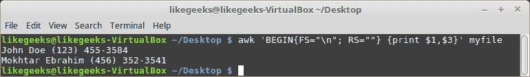
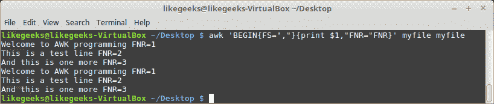
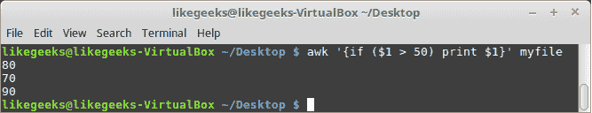
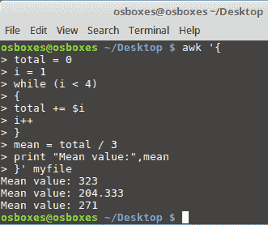
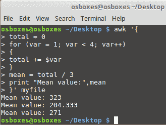
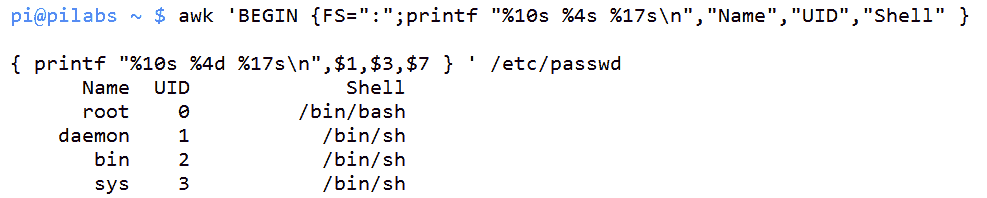
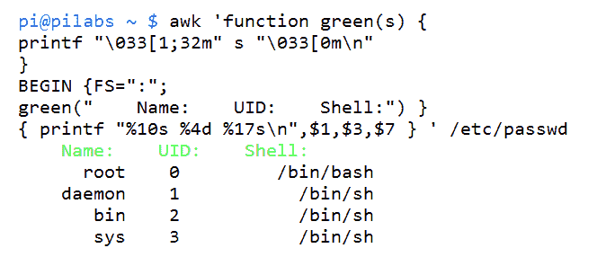

# AWK Fundamentals

流编辑器在它的家族中并不孤单，它有一个大哥，AWK。 在本章中，我们将浏览 AWK 的基础知识，并探索 AWK 编程语言的强大功能。 在接下来的两章中，我们将学习为什么我们需要和喜爱 AWK，以及在我们开始实际使用 AWK 之前如何使用一些基本特性。 在此过程中，我们将涵盖以下主题:

*   AWK 背后的历史
*   从文件中显示和过滤内容
*   AWK 变量
*   条件语句
*   格式化输出
*   通过 UID 进一步过滤显示用户
*   AWK 控制文件

# 技术要求

本章的源代码可在此下载:

[https://github.com/PacktPublishing/Mastering-Linux-Shell-Scripting-Second-Edition/tree/master/Chapter10](https://github.com/PacktPublishing/Mastering-Linux-Shell-Scripting-Second-Edition/tree/master/Chapter10)

# AWK 背后的历史

在 UNIX 和 Linux 中，`awk`命令是命令套件的支柱。 UNIX`awk`命令最初是由贝尔实验室在 20 世纪 70 年代开发的，并以主要作者的姓氏命名:Alfred Aho、Peter Weinberger 和 Brian Kernighan。 `awk`命令允许访问 AWK 编程语言，该语言被设计用于处理文本流中的数据。

AWK 的实现有很多:

*   **gawk**:也称为 GNU AWK，它是 AWK 的一个免费版本，被许多开发人员使用; 我们将在这本书中用到它。
*   **mawk**:另一个实现由一个叫 Mike Brennan 的家伙。 这个实现只包含了一些奇怪的特性; 它是为速度和性能而设计的。
*   **tawk**:或者 Thompson AWK，是一个在 Solaris, DOS 和 Windows 上工作的实现。
*   **BWK awk**:也称为 nawk，由 OpenBSD 和 macOS 使用。

请注意，我们在本书中将使用的`awk`解释器是`gawk`，但它与`awk`有一个符号链接。 因此，`awk`和`gawk`是相同的命令。

你可以通过列出`awk`二进制文件来确定它指向的位置:


为了演示由`awk`提供的编程语言，我们应该创建一个`Hello World`程序。 我们知道这对所有语言都是强制性的:

```sh
$ awk 'BEGIN { print "Hello World!" }'  
```

我们不仅可以看到这段代码将打印无处不在的 hello 消息，还可以使用`BEGIN`块生成头部信息。 稍后，我们将看到，通过允许主
代码块，
可以使用`END`代码块创建摘要信息。

我们可以在下面的截图中看到这个基本命令的输出:


# 从文件中显示和过滤内容

现在，当然我们都希望能够打印出比`Hello World`更多的内容。 可以使用`awk`命令过滤文件中的内容，如果需要，还可以过滤非常大的文件。 我们应该先把整个文件打印出来，然后再进行过滤。 通过这种方式，我们将了解命令的语法。 稍后，我们将看到如何将这些控制信息添加到`awk`文件中以简化命令行。 使用下面的命令，我们将打印`/etc/passwd`文件中的所有行:

```sh
$ awk ' { print } ' /etc/passwd  
```

这相当于在`print`语句中使用`$0`变量:

```sh
$ awk ' { print $0 }' /etc/passwd 
```

AWK 为我们提供了一些现成的变量来提取数据，例如:

*   `$0`为整条线
*   `$1`为第一个字段
*   `$2`为第二个字段
*   `$3`为第三场，以此类推

但是，我们需要指定在这个文件中使用的字段分隔符是冒号，因为它是`/etc/passwd`文件中的字段分隔符。 `awk`默认分隔符是一个空格或任意数量的空格、制表符和换行符。 有两种方法可以指定输入分隔符; 下面的示例中显示了这些参数。

第一个例子很容易使用。 `-F`选项工作得很好，特别是当我们不需要任何额外的头信息:

```sh
$ awk -F":" '{ print $1 }' /etc/passwd  
```

我们也可以在`BEGIN`块中这样做; 当我们想要使用`BEGIN`块来显示头部信息时，这很有用:

```sh
$ awk ' BEGIN { FS=":" } { print $1 } ' /etc/passwd  
```

我们可以在前面的例子中清楚地看到这一点，在这个例子中，我们命名了`BEGIN`块，并且它中的所有代码都用大括号括起来。 主块没有名称，被括在大括号中。

在了解了`BEGIN`块和主要代码块之后，我们现在来看看`END`代码块。 这通常用于显示汇总数据。 例如，如果我们想打印`passwd`文件中的总行数，我们可以使用`END`块。 包含`BEGIN`和`END`块的代码只处理一次，而每一行都处理主块。 下面的例子添加到我们迄今为止编写的代码中，以包含总行数:

```sh
$ awk ' BEGIN { FS=":" } { print $1 } END { print NR } ' /etc/passwd  
```

内部变量`awk``NR`保持处理线的数量。 如果我们愿意，我们可以添加一些额外的文本。 这可以用于注释摘要数据。 我们还可以使用 AWK 语言中使用的单引号; 它们将允许我们将代码分散到多行上。 一旦打开单引号，我们就可以在命令行中添加新行，直到关闭引号为止。 在下一个例子中，我们扩展了总结信息:

```sh
$ awk ' BEGIN { FS=":" }
> { print $1 }
> END { print "Total:",NR } ' /etc/passwd 
```

如果我们不希望在这里结束 AWK 体验，我们可以很容易地显示每一行的运行行数，以及最终的总数。 如下面的例子所示:

```sh
$ awk ' BEGIN { FS=":" }
> { print NR,$1 }
> END { print "Total:",NR } ' /etc/passwd  
```

下面的截图捕获了这个命令，并显示了部分输出:


在使用`BEGIN`的第一个示例中，我们看到没有理由不能在没有主代码块的情况下单独使用`END`代码块。 如果我们需要模拟`wc -l`命令，我们可以使用下面的`awk`语句:

```sh
$ awk ' END { print NR }' /etc/passwd 
```

输出将是文件的行数。 下面的屏幕截图显示了使用`awk`命令和`wc`命令来计算`/etc/passwd`文件中的行数:


正如我们所看到的，输出与`28`行一致，我们的代码已经工作了。

我们可以练习的另一个特性是只对选定的行进行操作。 例如，如果我们只想打印前五行，我们将使用以下语句:

```sh
$ awk ' NR < 6 ' /etc/passwd  
```

如果我们想打印行`8`到`12`，我们可以使用以下代码:

```sh
$ awk ' NR==8,NR==12 ' /etc/passwd
```

我们还可以使用正则表达式来匹配行中的文本。 看一下下面的例子，我们看一下以单词`bash`结尾的行:

```sh
$ awk ' /bash$/ ' /etc/passwd 
```

示例及其产生的输出如下截图所示:


因此，如果您想使用正则表达式模式，您应该使用两个斜杠并在它们之间写入模式`/bash$/`。

# AWK 变量

我们了解了如何使用数据字段，如`$1`和`$2`。 此外，我们还看到了`NR`字段，它保存了已处理的行数，但是 AWK 提供了更多内置变量来越来越多地简化工作。

*   `FIELDWIDTHS`:字段宽度
*   `RS`:指定记录分隔符
*   `FS`:字段分隔符
*   `OFS`:指定输出分隔符，默认为空格
*   `ORS`:指定输出分隔符
*   `FILENAME`:保存处理后的文件名
*   `NF`:保持正在处理的行
*   `FNR`:保存正在处理的记录
*   `IGNORECASE`:忽略字符大小写

这些变量在很多情况下可以帮助您。 让我们假设我们有以下文件:

```sh
John Doe
15 back street
(123) 455-3584

Mokhtar Ebrahim
10 Museum street
(456) 352-3541  
```

我们可以说，我们有两个人的两条记录，每条记录包含三个字段。 假设我们需要打印姓名和电话号码。 那么我们如何让 AWK 正确地处理它们呢?

在这种情况下，字段由换行符(`\n`)分隔，记录由空行分隔。

因此，如果我们将`FS`设置为(`\n`)，并将`RS`设置为空文本，则字段将被正确标识:

```sh
$ awk 'BEGIN{FS="\n"; RS=""} {print $1,$3}' myfile
```



结果似乎是有效和适当的。

以同样的方式，您可以使用`OFS`和`ORS`作为输出报告:

```sh
$ awk 'BEGIN{FS="\n"; RS=""; OFS="*"} {print $1,$3}' myfile  
```


您可以使用任何符合您需要的文本。

我们知道，`NR`保存着被处理的线的数量，而`FNR`从定义中看起来是一样的，但是让我们看看下面的例子来看看它们的区别:

假设我们有以下文件:

```sh
Welcome to AWK programming
This is a test line
And this is one more 
```

让我们用 AWK 来处理这个文件:

```sh
$ awk 'BEGIN{FS="\n"}{print $1,"FNR="FNR}' myfile myfile
```



这里，为了测试目的，我们对文件进行了两次处理，只是为了看看 FNR 变量的值是多少。

如您所见，对于每个处理周期，该值都从 1 开始。

让我们以同样的方式来使用 whether`NR`变量:

```sh
$ awk 'BEGIN {FS="\n"} {print $1,"FNR="FNR,"NR="NR} END{print "Total lines: ",NR}' myfile myfile  
```


变量`NR`在整个处理过程中保持其值，而`FNR`从 1 开始。

# 用户定义的变量

您可以定义自己的变量，以便在 AWK 编程中使用，就像任何编程语言一样。

你可以使用任何文本来定义变量，但是它**必须**不能以数字开头:

```sh
$ awk '
BEGIN{
var="Welcome to AWk programming"
print var
}'
```


您可以定义任何类型的变量并以相同的方式使用它。

你可以这样定义数字:

```sh
$ awk '
BEGIN{
var1=2
var2=3
var3=var1+var2
print var3
}'  
```


或者像这样执行字符串连接:

```sh
$ awk '
BEGIN{
str1="Welcome "
str2=" To shell scripting"
str3=str1 str2
print str3
}'  
```


如您所见，AWK 是一种强大的脚本语言。

# 条件语句

AWK 支持条件语句，如`if`和`while`循环。

# 如果命令

假设你有以下文件:

```sh
50
30
80
70
20
90 
```

现在，让我们过滤这些值:

```sh
$ awk '{if ($1 > 50) print $1}' myfile  
```



`if`语句检查每个值，如果值大于`50`，则将其打印出来。

你可以这样使用`else`从句:

```sh
$ awk '{
if ($1 > 50)
{
x = $1 * 2
print x
} else
{
x = $1 * 3
print x
}}' myfile
```


如果你不使用括号`{}`来围住你的语句，你可以用分号在同一行中输入它们:

```sh
$ awk '{if ($1 > 50) print $1 * 2;  else print $1 * 3}' myfile  
```

Note that you can save this code into a file and assign it to the `awk` command using the `-f` option, as we will see later on this chapter.

# while 循环

AWK 处理文件的每一行，但是如果您想迭代每一行本身的字段呢?

使用 AWK 时，可以使用`while`循环遍历字段。

假设我们有以下文件:

```sh
321 524 124
174 185 254
195 273 345 
```

现在让我们使用`while`循环遍历字段。

```sh
$ awk '{
total = 0
i = 1
while (i < 4)
{
total += $i
i++
}
mean = total / 3
print "Mean value:",mean
}' myfile  
```



`while`循环遍历字段; 我们得到每一行的平均值，然后打印出来。

# for 循环

当使用 AWK 时，你可以使用`for`循环来迭代值，如下所示:

```sh
$ awk '{
total = 0
for (var = 1; var < 4; var++)
{
total += $var
}
mean = total / 3
print "Mean value:",mean
}' myfile  
```



我们获得了相同的结果，但这次使用了`for`循环。

# 格式化输出

到目前为止，我们仍然忠实于`print`命令，因为我们对输出的要求是有限的。 如果我们想打印出用户名、UID 和默认 shell，我们需要开始对输出进行一些格式化。 在本例中，我们可以将输出组织在形状良好的列中。 如果没有格式化，我们使用的命令将类似于下面的例子，我们使用逗号分隔我们想要打印的字段:

```sh
$ awk ' BEGIN { FS=":" } { print $1,$3,$7 } ' /etc/passwd  
```

我们在这里使用`BEGIN`块，因为我们可以使用它来打印列标题。

为了更好地理解这个问题，看看下面的截图，它演示了不均匀的列宽:


我们在输出中遇到的问题是列没有对齐，因为用户名长度不一致。 为了改进这一点，我们可以使用`printf`函数来指定列的宽度。 `awk`语句的语法类似于下面的例子:

```sh
$ awk ' BEGIN { FS=":" }
> { printf "%10s %4d %17s\n",$1,$3,$7 } ' /etc/passwd  
```

`printf`格式包含在双引号中。 我们还需要包含带有`\n`的换行符。 `printf`函数不会自动添加换行符，而`print`函数会自动添加。 我们打印三个字段; 第一个接受字符串值，并设置为`10`字符宽。 中间字段最多接受 4 个数字，我们以默认 shell 字段结束，其中最多允许`17`字符串字符。

下面的截图显示了如何改进输出:


我们可以通过添加标题信息进一步增强这一点。 虽然在这一阶段代码看起来很凌乱，但我们稍后将看到如何使用 AWK 控制文件解决这个问题。 下面的示例显示了添加到`Begin`块的头信息。 分号用于分隔`BEGIN`块中的两个语句:

```sh
$ awk 'BEGIN {FS=":" ;printf "%10s %4s %17s\n","Name","UID","Shell" }
> { printf "%10s %4d %17s\n",$1,$3,$7 } ' /etc/passwd
```

在下面的截图中，我们可以看到这是如何进一步改善输出的:



在前一章中，我们看到了如何在 shell 中使用颜色来增加输出。 我们也可以通过添加我们自己的函数来使用 AWK 内部的颜色。 在下一个代码示例中，您将看到 AWK 允许我们定义自己的函数，以促进更复杂的操作并隔离代码。 现在我们将修改前面的代码，在头文件中包含绿色输出:

```sh
$ awk 'function green(s) {
> printf "\033[1;32m" s "\033[0m\n"
> }
> BEGIN {FS=":"; 
green("   Name:  UID:    Shell:") }
> { printf "%10s %4d %17s\n",$1,$3,$7 } ' /etc/passwd
```

在`awk`中创建函数允许在我们需要的地方添加颜色，在本例中是绿色文本。 创建定义其他颜色的函数很容易。 代码和输出包含在下面的截图中:



# 通过 UID 进一步过滤显示用户

我们已经能够通过 AWK 一点一点地构建我们的技能，我们所学到的都是有用的。 我们可以采取这些微小的步骤，添加它们，开始创建一些更有用的东西。 也许我们只想打印标准用户; 这些用户通常高于 500 或 1000，这取决于您的特定发行版。

在我为本书使用的 Linux Mint 发行版上，标准用户以 UID`1000`开始。 UID 是第三个字段。 这实际上很简单，只需使用第三个字段的值作为范围操作符。 我们可以在下面的例子中看到:

```sh
$ awk -F":" '$3 > 999 ' /etc/passwd  
```

我们可以使用以下命令显示 UID 为`101`或更低的用户:

```sh
$ awk -F":" '$3 < 101 ' /etc/passwd
```

这些只是让你对 AWK 的一些可能性有所了解。 实际上，我们可以整天玩算术比较操作符。

我们还看到，在其中一些例子中，`awk`语句变得有点长。 这就是我们可以实现`awk`控制文件的地方。 在我们陷入语法的泥沼之前，让我们直接看看这些。

# AWK 控制文件

就像使用`sed`一样，我们可以通过创建和包含控制文件来简化命令行。 这也使得以后更容易编辑命令。 控制文件包含我们希望`awk`执行的所有语句。 对于`sed`、`awk`和 shell 脚本，我们必须考虑的主要问题是模块化; 创建可重用元素，可用于隔离和重用代码。 这节省了我们的时间和工作，我们有更多的时间来做我们喜欢的事情。

要查看`awk`控制文件的示例，我们应该重新查看`passwd`文件的格式。 创建以下文件将封装`awk`语句:

```sh
function green(s) { 
    printf "\033[1;32m" s "\033[0m\n" 
} 
BEGIN { 
    FS=":" 
    green("   Name:   UID:       Shell:") 
} 
{ 
    printf "%10s %4d %17s\n",$1,$3,$7 
} 
```

我们可以将该文件保存为`passwd.awk`。

能够在一个文件中包含所有的`awk`语句是非常方便的，并且执行变得干净整洁:

```sh
$ awk -f passwd.awk /etc/passwd 
```

这当然鼓励使用更复杂的`awk`语句，并允许您在代码中扩展更多的功能。

# 内置函数

在前面的示例中，我们定义了一个名为`green`的函数。 这就引出了一些与`awk`一同提供的内置函数。

AWK 自带许多内置函数，如数学函数:

*   `sin(x)`
*   `cos(x)`
*   `sqrt(x)`
*   `exp(x)`
*   `log(x)`
*   `rand()`

你可以这样使用它们:

```sh
$ awk 'BEGIN{x=sqrt(5); print x}' 
```

此外，还有一些内置函数可以用于字符串操作:

```sh
$ awk 'BEGIN{x = "welcome"; print toupper(x)}'
```

# 总结

我希望您对 AWK 工具的用途有一个更好、更清晰的理解。 这是一个数据处理工具，它逐行运行文本文件，并处理您添加的代码。主块运行符合行标准的每一行，而`BEGIN`和`END`块代码只执行一次。

您已经学习了如何使用 AWK 内置变量以及如何定义和使用自己的变量。

此外，您还学习了如何使用`if`、`while`和`for`循环遍历数据字段。

在下一章中，我们将讨论正则表达式以及如何在`sed`和 AWK 中使用它们来获得更多的功能。

# 问题

1.  下面命令的输出是什么?

```sh
$ awk '
BEGIN{
var="I love AWK tool"
print $var 
}'
```

2.  假设你有以下文件:

```sh
13
15
22
18
35
27
```

然后对该文件运行以下命令:

```sh
$ awk '{if ($1 > 30) print $2}' myfile 
```

将打印多少数字?

3.  假设你有以下文件:

```sh
135 325 142
215 325 152
147 254 327
```

然后运行以下命令:

```sh
$ awk '{
total = 0
i = 1
while (i < 3)
{
total += $i
i++
}
mean = total / 3
print "Mean value:",mean  
}' myfile
```

前面的代码有什么问题?

4.  下面的命令将打印多少行?

```sh
$ awk -F":" '$3 < 1 ' /etc/passwd  
```

# 进一步的阅读

请参阅以下有关本章的资料:

*   [https://likegeeks.com/awk-command/](https://likegeeks.com/awk-command/)
*   [https://www.gnu.org/software/gawk/manual/gawk.html](https://www.gnu.org/software/gawk/manual/gawk.html)