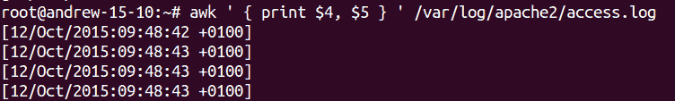
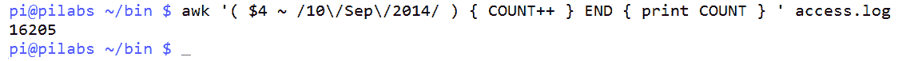
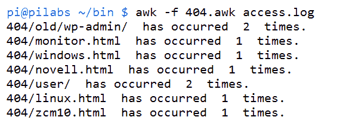
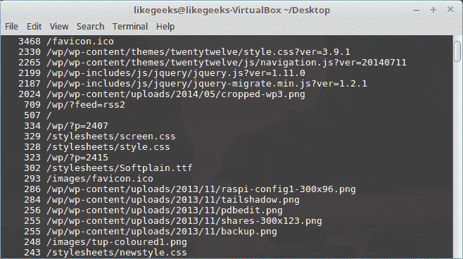

# 使用 AWK 汇总日志

在前一章中，我们讨论了正则表达式，并了解了如何使用它们来增强`sed`和 AWK。 在本章中，我们将讨论一些使用 AWK 的实例。

AWK 真正擅长的任务之一是过滤日志文件中的数据。 这些日志文件可能有很多行，可能有 250,000 或更多行。 我处理过超过一百万行的数据。 AWK 可以快速有效地处理这些行。 作为一个例子，我们将使用一个 30,000 行的 web 服务器访问日志来展示 AWK 代码的有效性和良好编写。 在阅读本章的过程中，我们还将看到不同的日志文件，并回顾我们可以使用`awk`命令和 AWK 编程语言来帮助报告和管理我们的服务的一些技术。 在本章中，我们将涵盖以下主题:

*   HTTPD 日志文件格式
*   显示来自 web 日志的数据
*   显示排行最高的客户端 IP 地址
*   显示浏览器数据
*   使用电子邮件日志

# 技术要求

本章的源代码可以从这里下载:

[https://github.com/PacktPublishing/Mastering-Linux-Shell-Scripting-Second-Edition/tree/master/Chapter12](https://github.com/PacktPublishing/Mastering-Linux-Shell-Scripting-Second-Edition/tree/master/Chapter12)

# HTTPD 日志文件格式

在处理任何文件时，第一项任务是熟悉文件模式。 简单地说，我们需要知道每个字段表示什么，以及用什么来分隔字段。 我们将使用来自 Apache HTTPD web 服务器的访问日志文件。 可以通过`httpd.conf`文件控制日志文件的位置。 在基于 debian 的系统上，默认的日志文件位置是`/var/log/apache2/access.log`; 其他系统可能使用`httpd`目录来代替`apache2`。

`log`文件已经在代码包中，所以您可以下载并直接使用它。

使用`tail`命令，可以显示`log`文件的末尾。 尽管，公平地说，使用`cat`也可以处理这个文件，因为它只有几行:

```sh
$ tail /var/log/apache2/access.log  
```

命令的输出和文件的内容如下截图所示:


输出确实在新行中包装了一点，但是我们可以感受到日志的布局。 我们还可以看到，尽管我们感觉只访问了一个网页，但实际上我们访问了两个项目:`index.html`和`ubuntu-logo.png`。 我们也无法访问`favicon.ico`文件。 我们可以看到文件是用空格分隔的。 每个字段的含义如下表所示:

| **田间** | 【实验目的】 |
| 1 | 客户端 IP 地址。 |
| 2 | 客户端标识由 RFC 1413 和`identd`客户端定义。 除非启用了`IdentityCheck`，否则不会读取此信息。 如果未被读取，该值将带有连字符。 |
| 3 | 启用用户认证时的用户 ID。 如果未启用身份验证，该值将是一个连字符。 |
| 4 | 请求的日期和时间，格式为`day/month/year:hour:minute:second offset`。 |
| 5 | 实际的要求和方法。 |
| 6 | 返回状态码，如`200`或`404`。 |
| 7 | 以字节为单位的文件大小。 |

即使这些字段是 Apache 定义的，我们也必须小心。 时间、日期和时区是一个单独的字段，在方括号中定义; 但是，在该数据和时区之间的字段中有额外的空间。 为了确保在需要时打印完整的时间字段，我们需要同时打印`$4`和`$5`。 如下命令示例所示:

```sh
$ awk ' { print $4,$5 } ' /var/log/apache2/access.log  
```

我们可以在下面的截图中看到这个命令和它产生的输出:



# 显示来自 web 日志的数据

我们已经预览了如何使用 AWK 查看 Apache web 服务器上的日志文件; 然而，现在我们将转移到具有更大更多样内容的演示文件。

# 按日期选择条目

在了解了如何显示日期之后，我们也许应该看看如何从一天开始打印条目。 为此，我们可以使用`awk`中的匹配操作符。 如果你喜欢，可以用波浪线或弯弯曲曲的线表示。 因为我们只需要日期元素，所以不需要同时使用日期和时区字段。 下面的命令显示了如何打印 2014 年 9 月 10 日的条目:

```sh
$ awk ' ( $4 ~ /10\/Sep\/2014/ ) ' access.log  
```

为了完整起见，这个命令和部分输出如下截图所示:


圆括号或圆括号包含我们要查找的行范围，并且我们省略了主块，这确保我们从该范围打印完整的匹配行。 没有什么可以阻止我们进一步过滤字段，以便从匹配的行中打印。 例如，如果我们只想打印出用于访问 web 服务器的客户端 IP 地址，我们可以打印字段`1`。 如下命令示例所示:

```sh
$ awk ' ( $4 ~ /10\/Sep\/2014/ ) { print $1 } ' access.log  
```

如果希望打印给定日期的总访问次数，可以将条目通过管道传递到`wc`命令。 如下所示:

```sh
$ awk ' ( $4 ~ /10\/Sep\/2014/ ) { print $1 } ' access.log | wc -l  
```

然而，如果我们想使用`awk`来完成此操作，这将比启动一个新进程更有效，并且我们可以计算条目。 如果使用内置变量`NR`，则可以打印文件中的整行，而不仅仅是该范围内的行。 最好是在主块中增加我们自己的变量，而不是匹配每一行的范围。 可以实现`END`块来打印我们使用的`count`变量。 以如下命令行为例:

```sh
$ awk ' ( $4 ~ /10\/Sep\/2014/ ) { print $1; COUNT++ }  END { print COUNT }' access.log  
```

来自`wc`和内部计数器的计数输出将给出`16205`作为演示文件的结果。 我们应该在主块中使用变量 increment，如果我们只想计数的话:

```sh
$ awk ' ( $4 ~ /10\/Sep\/2014/ ) { COUNT++ }  END { print COUNT }' access.log  
```

我们可以在下面的输出中看到:



# 总结 404 错误

请求页的状态码显示在日志的`9`字段中。 `404`状态将表示服务器上的页面未找到错误。 我相信我们都曾在浏览器中看到过这种情况。 这可能表明您的站点上存在配置错误的链接，或者只是浏览器搜索要在选项卡浏览器中显示的图标图像产生的。 您还可以通过查找标准页面的请求来识别站点的潜在威胁，这些标准页面可能提供对 PHP 驱动站点(如 WordPress)的额外信息的访问。

首先，我们可以单独打印请求的状态:

```sh
$ awk '{ print $9 } ' access.log  
```

现在我们可以像我们自己一样稍微扩展代码，只打印`404`错误:

```sh
$ awk ' ( $9 ~ /404/ ) { print $9 } ' access.log  
```

我们可以通过同时打印状态代码和正在访问的页面来进一步扩展。 这将需要我们打印字段`9`和字段`7`。 简单地说，这将如下代码所示:

```sh
$ awk ' ( $9 ~ /404/ ) { print $9, $7 } ' access.log  
```

许多访问失败的页面将被复制。 为了总结这些记录，我们可以使用命令管道通过`sort`和`uniq`命令来实现这一点:

```sh
$ awk ' ( $9 ~ /404/ ) { print $9, $7 } ' access.log | sort -u 
```

要使用`uniq`命令，数据必须预先排序; 因此，我们使用`sort`命令准备数据。

# 汇总 HTTP 访问码

现在是时候离开纯粹的命令行，开始使用 AWK 控制文件了。 与往常一样，当所需结果集的复杂性增加时，我们会看到`awk`代码的复杂性也会增加。 我们将在当前目录中创建一个`status.awk`文件。 该文件应该类似以下文件:

```sh
{ record[$9]++ } 
END { 
for (r in record) 
print r, " has occurred ", record[r], " times." }  
```

首先，我们将剥离主要代码块，这是非常简单和稀疏的。 这是一种简单的方法来计算状态码的每个唯一出现。 我们没有使用简单的变量，而是将其输入数组。 在本例中，数组称为记录。 数组是一个多值变量，数组中的槽称为键。 数组中存储了一组变量。 例如，我们希望看到`record[200]`和`record[404]`的条目。 我们用它们的出现计数填充每个键。 每当我们找到一个`404`代码，我们就增加存储在相关键中的计数:

```sh
{ record[$9]++ } 
```

在`END`块中，我们使用`for`循环创建汇总信息，以打印出数组中的每个键和值:

```sh
END { 
for (r in record) 
print r, " has occurred ", record[r], " times." } 
```

要运行它，相关的命令行将类似如下:

```sh
$ awk -f status.awk access.log 
```

为了查看命令和输出，我们包含了以下截图:


我们可以更进一步，把重点放在`404`错误上。 当然，您可以选择任何状态码。 从结果可以看出，我们有`4382 404`状态码。 为了总结这些`404`代码，我们将`status.awk`复制到一个名为`404.awk`的新文件中。 我们可以编辑`404.awk`，添加`if`语句，以便只在`404`代码上工作。 该文件应该类似于以下代码:

```sh
{ if ( $9 == "404" ) 
    record[$9,$7]++ } 
END { 
for (r in record) 
print r, " has occurred ", record[r], " times." } 
```

如果我们用下面的命令执行代码:

```sh
$ awk -f 404.awk access.log  
```

输出将类似如下截图:



# 资源打

你可以使用 AWK 检查一个特定页面或资源被请求了多少次:

```sh
$ awk '{print $7}' access.log | sort | uniq -c | sort -rn 
```

前面的命令将请求的资源从最高的排序到最低的:



这些资源可以是图像、文本文件或 CSS 文件。

如果你想查看请求的 PHP 文件，你可以使用`grep`只获取 PHP 文件:

```sh
$ awk ' ($7 ~ /php/) {print $7}' access.log | sort | uniq -c | sort -nr  
```


在每个页面旁边，都有点击次数。

您可以从`log`文件中获取任何统计数据，并获得惟一值，并以相同的方式对它们进行排序。

# 识别图像盗链

当我们谈论资源时，你可能会面临一个问题，就是图片盗链。 它是关于使用你的图像从其他服务器链接到他们。 图像盗链的这种行为会泄漏您的带宽。

既然我们在谈论 AWK，我们将看到如何使用 AWK 来找出它如何使用我们的图像:

```sh
$ awk -F\" '($2 ~ /\.(png|jpg|gif)/ && $4 !~ /^https:\/\/www\.yourdomain\.com/){print $4}' access.log | sort | uniq -c | sort
```

注意，如果你正在使用 Apache，你可以通过一个小的`.htaccess`文件来阻止图片盗链，通过检查 referrer 是否不是你的域:

```sh
RewriteEngine on 
RewriteCond %{HTTP_REFERER} !^$ 
RewriteCond %{HTTP_REFERER} !^https://(www\.)yourdomain.com/.*$ [NC] 
RewriteRule \.(gif|jpg|jpeg|bmp|png)$ - [F] 
```

# 显示排行最高的 IP 地址

现在您应该意识到`awk`的一些功能以及语言结构本身是多么庞大。 我们能够从 30000 行文件中生成的数据非常强大，而且很容易提取。 我们只需要用`$1`替换之前使用过的字段 此字段表示客户端 IP 地址。 如果我们使用下面的代码，我们将能够打印每个 IP 地址，以及它已经被用来访问 web 服务器的次数:

```sh
{ ip[$1]++ } 
END { 
for (i in ip) 
print i, " has accessed the server ", ip[i], " times." } 
```

我们希望能够扩展它，只显示排名最高的 IP 地址，也就是访问站点使用最多的地址。 同样，该工作将主要在`END`块中，并将利用与当前最高排名地址的比较。 可以创建以下文件并保存为`ip.awk`:

```sh
{ ip[$1]++ } 
END { 
for (i in ip) 
    if ( max < ip[i] ) { 
        max = ip[i] 
        maxnumber = i } 

print i, " has accessed ", ip[i], " times." } 
```

我们可以在下面的屏幕截图中看到该命令的输出。 部分客户端 IP 地址已经被遮挡，因为它是从我的公共 web 服务器:


代码的功能来自`END`块。 在进入`END`块时，我们将进入一个`for`循环。 我们遍历`ip`数组中的每个条目。 我们使用条件语句`if`来查看正在迭代的当前值是否高于当前最大值。 如果是，这将成为新的最高条目。 当`loop`完成后，我们打印拥有最高条目的 IP 地址。

# 显示浏览器数据

用于访问该网站的浏览器包含在日志文件的字段`12`中。 显示用于访问站点的浏览器列表可能会很有趣。 下面的代码将帮助您显示所报告的浏览器的访问列表:

```sh
{ browser[$12]++ } 
END { 
    for ( b in browser ) 
        print b, " has accessed ", browser[b], " times." 
    } 
```

您可以看到如何使用这些文件为`awk`创建小插件，并调整字段和数组名称以适应。 输出如下截图所示:


有趣的是，我们看到 Mozilla 4 和 Mozilla 5 构成了请求客户机的大部分。 我们看到 Mozilla 4 在这里列出了`1713`次。 这里的 Mozilla/5.0 条目有一个畸形的双引号。 之后出现了 27000 次访问。

# 使用电子邮件日志

我们已经处理了来自 Apache HTTP web 服务器的日志。 事实上，我们可以将相同的理念和方法应用于任何日志文件。 我们将看看 Postfix 邮件日志。 邮件日志保存了来自 SMTP 服务器的所有活动，然后我们可以看到谁向谁发送了电子邮件。 日志文件通常位于`/var/log/mail.log`。 我将在我的 Ubuntu 15.10 服务器上访问它，那里有一个本地邮件发送。 这意味着 STMP 服务器只监听`127.0.0.1`的本地主机接口。

根据消息的类型，日志格式会有一点变化。 例如，`$7`将包含出站消息上的`from`日志，而入站消息将包含`to`日志。

如果我们想要列出所有发送到 SMTP 服务器的入站消息，我们可以使用以下命令:

```sh
$ awk '  ( $7 ~ /^to/ ) ' /var/log/mail.log  
```

由于字符串`to`非常短，我们可以通过使用`^`确保字段以`to`开始，从而向其添加标识。 命令和输出如下截图所示:


可以很容易地扩展`to`或`from`搜索以包含用户名。 我们可以看到发送或接收邮件的格式。 使用与 Apache 日志相同的模板，我们可以轻松地显示最高的接收方或发送方。

# 总结

现在，我们的文本处理背后有一些强大的弹药，我们可以开始理解 AWK 的强大。 使用真实数据在测量搜索的性能和准确性方面特别有用。 在新安装的 Ubuntu 15.10 Apache web 服务器上开始使用简单的 Apache 条目后，我们很快就从一个实时 web 服务器迁移到更大的示例数据。 这个文件有 3 万行，给我们提供了一些真正的素材，很快，我们就能写出可信的报告。 我们结束了对 Ubuntu 15.10 服务器的返回，以分析 Postfix SMTP 日志。 我们可以看到，我们可以将以前使用过的技术拖放到新的日志文件中。

接下来，我们继续使用 AWK，看看如何报告`lastlog`数据和平面 XML 文件。

# 问题

1.  `access_log`文件中的哪个字段包含 IP 地址?
2.  用来计算 AWK 处理的行数的命令是什么?
3.  如何从 Apache 访问日志文件中获得唯一访问者的 IP 地址?
4.  如何从 Apache 访问日志文件中获得访问次数最多的 PHP 页面?

# 进一步的阅读

请参阅以下有关本章的资料:

*   [https://httpd.apache.org/docs/1.3/logs.html](https://httpd.apache.org/docs/1.3/logs.html)