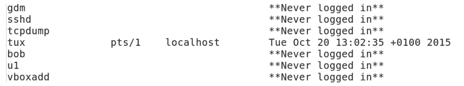
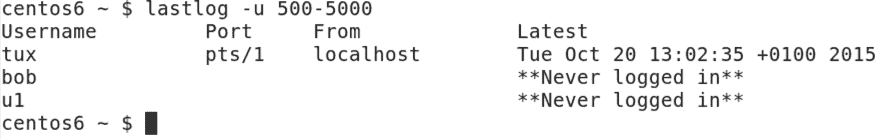
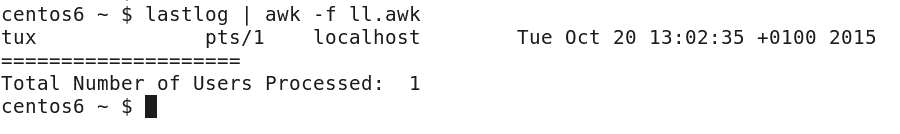
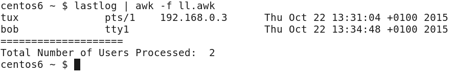
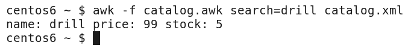

# 与 AWK 更好的 lastlog

我们已经在[第 12 章](12.html)、*AWK 日志汇总*中看到，我们如何从纯文本文件中挖掘大量数据，创建复杂的报告。 类似地，我们可以使用标准命令行工具(如`lastlog`工具)的输出创建大量的报告。 `lastlog`本身可以报告所有用户的最后一次登录时间。 但是，我们通常希望过滤`lastlog`的输出。 也许您需要排除从未用于登录系统的用户帐户。 它也可能与报告`root`无关，因为该帐户可能主要用于`sudo`，而不是用于标准登录的定期记录。

在本章中，我们将使用`lastlog`并格式化 XML 数据。 由于这是我们研究 AWK 的最后一章，我们将配置记录分隔符。 我们已经在 AWK 中看到了字段分隔符的使用，但是我们可以将默认的记录分隔符从换行符改为更符合我们需要的东西。 更具体地说，在本章中，我们将涵盖:

*   使用 AWK 范围来排除数据
*   基于字段数量的条件
*   操作 AWK 记录分隔符来报告 XML 数据

# 技术要求

本章的源代码可在此下载:

[https://github.com/PacktPublishing/Mastering-Linux-Shell-Scripting-Second-Edition/tree/master/Chapter13](https://github.com/PacktPublishing/Mastering-Linux-Shell-Scripting-Second-Edition/tree/master/Chapter13)

# 使用 AWK 范围来排除数据

到目前为止，在本书中，我们主要研究了包含`sed`或`awk`范围的数据。 使用这两种工具，我们可以否定范围，从而排除指定的行。 为了更好地解释，我们将使用`lastlog`命令的输出。 这将打印所有用户的所有登录数据，包括从未登录过的帐户。 这些从未登录过的帐户可能是服务帐户，也可能是迄今尚未登录到系统的新用户的帐户。

# lastlog 命令

如果我们看一下`lastlog`的输出，当它没有任何选项时，我们就可以开始理解这个问题了。 在命令行中，我们以标准用户的身份执行命令。 不需要将其作为根帐户运行。 命令示例如下:

```sh
$ lastlog 
```

部分输出如下截图所示:



我们可以看到，甚至从这个有限的输出，我们有一个杂乱的输出，因为虚拟噪音是由帐户创建的，没有登录。 使用`lastlog`选项可以在一定程度上减轻这一问题，但可能不能完全解决该问题。 为了演示这一点，我们可以在`lastlog`中添加一个选项，只显示标准用户，并过滤掉其他系统和服务用户。 这在您的系统上可能有所不同，但在我使用的示例 CentOS 6 主机上，第一个用户将是 UID 500。 在 CentOS 7 上，标准用户的 UID 从 1000 开始。

如果使用`lastlog -u 500-5000`命令，我们将只打印 UID 在此范围内的用户的数据。 在这个简单的演示系统上，我们只有三个用户帐户，其输出是可以接受的。 然而，我们可以理解，由于这些帐户还没有被使用，我们可能仍然有一些混乱。 如下截图所示:



除了从`Never logged in`帐户打印的多余数据外，我们可能只对`Username`和`Latest`字段感兴趣。 这是支持使用 AWK 作为数据过滤器的另一个原因。 通过这种方式，我们可以同时提供水平和垂直数据过滤、行和列。

# 用 AWK 水平过滤行

为了使用 AWK 提供这种过滤，我们将把数据从`lastlog`直接管道到`awk`。 我们将使用一个简单的控制文件，最初提供水平过滤或减少我们看到的行。 首先，命令管道将像下面的命令示例一样简单:

```sh
$ lastlog | awk -f lastlog.awk  
```

当然，复杂性是从命令行中抽象出来的，并隐藏在我们使用的控制文件中。 最初，控制文件保持简单，如下所示:

```sh
!(/Never logged in/ || /^Username/ || /^root/) { 
  print $0; 
} 
```

正如我们前面看到的，范围被设置在主代码块之前。 在圆括号前面使用感叹号来否定或反转所选范围。 双竖条充当逻辑上的`OR`。 我们不包括包含`Never logged in`的行，也不包括以`Username`开头的行。 这将删除由`lastlog`打印的标题行。 最后，我们从显示中排除根帐户。 这将启动我们要处理的行，主代码块将打印这些行。

# 计算匹配的行

我们可能还想计算过滤器返回的行数。 例如，使用内部变量`NR`将显示所有行，而不仅仅是匹配的行; 为了能够报告已经登录的用户数量，我们必须使用我们自己的变量。 下面的代码将维护我们命名为`cnt`的变量中的计数。 对于主代码块的每次迭代，我们使用 C 风格`++`增加该值。

我们可以使用`END`代码块来显示该变量的结束值:

```sh
!(/Never logged in/ || /^Username/ || /^root/) { 
  cnt++ 
  print $0; 
} 
END { 
  print "========================" 
  print "Total Number of Users Processed: ", cnt 
} 
```

我们可以看到下面的代码和输出如何在我的系统上出现:



从显示输出中，我们现在可以看到，我们只显示已登录的用户，在本例中，它只是单个用户。 然而，我们也可能决定进一步抽象数据，只显示匹配行的某些字段。 这应该是一个简单的任务，但它很复杂，因为字段的数量将根据登录的执行方式而变化。

# 基于字段数量的条件

如果用户直接登录到服务器的物理控制台，而不是通过远程或图形化伪终端登录，那么`lastlog`输出将不显示主机字段。 为了演示这一点，我已经直接登录到我的 CentOS 主机上的`tty1`控制台，并避免使用 GUI。 前一个 AWK 控制文件的输出显示，我们现在有用户`tux`和`bob`; `bob`虽然缺乏主机字段，因为他是连接到一个控制台:



虽然这本身不是一个问题，但如果我们想过滤字段，并且在某些行中删除某个字段时，两行的字段号会发生变化，那么就会有问题。 对于`lastlog,`，对于大多数连接，我们将有`9`字段，而对于那些直接连接到服务器控制台的连接，只有`8`字段。 应用的目标是打印用户名和日期，而不是最后一次登录的时间。 我们还将在`BEGIN`块中打印我们自己的页眉。 为了确保使用正确的位置，我们需要使用`NF`内部变量计算每行中的字段。

对于`8`字段的行，我们希望打印字段`1`、`4`、`5`和`8`; 对于带有附加主机信息的较长的行，我们将使用字段`1`，`5`，`6`和`9`。 我们还将使用`printf`来正确对齐列数据。 控制文件应该被编辑，如下例所示:

```sh
BEGIN { 
printf "%8s %11s\n","Username","Login date" 
print "====================" 
} 
!(/Never logged in/ || /^Username/ || /^root/) { 
cnt++ 
if ( NF == 8 ) 
    printf "%8s %2s %3s %4s\n", $1,$5,$4,$8 

else 
    printf "%8s %2s %3s %4s\n", $1,$6,$5,$9 
} 
END { 
print "====================" 
print "Total Number of Users Processed: ", cnt 
} 
```

我们可以在下面的屏幕截图中看到这个命令和它产生的输出。 我们可以看到如何基于我们想要关注的信息创建一个更合适的显示:


如果我们看一下输出，我选择在月份之前显示日期，所以我们不按数字顺序显示字段。 当然，这是一个个人的选择，并且可以根据您认为数据应该显示的方式进行定制。

我们可以将我们在`lastlog`控制文件中看到的原则用于任何命令的输出，并且您应该练习使用您想要过滤数据的命令。

# 操作 AWK 记录分隔符来报告 XML 数据

到目前为止，虽然我们一直在使用 AWK，但我们限制自己只处理单独的行，每个新行代表一个新记录。 尽管这通常是我们想要的，在我们处理带标记的数据时，例如 XML，单个记录可能跨越多行。 在这种情况下，我们可能需要设置分隔符`RS`或`record`内部变量。

# Apache 虚拟主机

在第 9 章，*自动化 Apache 虚拟主机*中，我们使用了**Apache 虚拟主机**。 它使用标记的数据来定义每个虚拟主机的开始和结束。 尽管我们倾向于将每个虚拟主机存储在其自己的文件中，但它们可以合并成一个单独的文件。 考虑以下文件，它存储了可能的虚拟主机定义; 可以存储为`virtualhost.conf`文件，如下所示:

```sh
<VirtualHost *:80> 
DocumentRoot /www/example 
ServerName www.example.org 
# Other directives here 
</VirtualHost> 

<VirtualHost *:80> 
DocumentRoot /www/theurbanpenguin 
ServerName www.theurbanpenguin.com 
# Other directives here 
</VirtualHost> 

<VirtualHost *:80> 
DocumentRoot /www/packt 
ServerName www.packtpub.com 
# Other directives here 
</VirtualHost> 
```

我们在一个文件中有三个虚拟主机。 每个记录由一个空行分隔，这意味着我们有两个新行字符，逻辑上分隔每个条目。 我们将通过设置变量`RS`向 AWK 解释这一点:`RS="\n\n"`。 有了这些，我们就可以打印所需的虚拟主机记录。 这将在控制文件的`BEGIN`代码块中进行设置。

我们还需要在命令行中动态搜索所需的主机配置。 我们将其构建到控制文件中。 控制文件应该类似如下代码:

```sh
BEGIN { RS="\n\n" ; } 
$0 ~ search { print } 
```

`BEGIN`块设置变量，然后我们移动到范围。 设置范围以便记录(`$0`)匹配`search`变量(`~`)。 我们必须在执行`awk`时设置变量。 下面的命令演示了控制文件和配置文件在工作目录中的命令行执行:

```sh
$ awk -f vh.awk search=packt virtualhost.conf 
```

我们可以通过下面截图中的命令和输出更清楚地看到这一点:


# XML 目录

我们可以将其进一步扩展到 XML 文件中，在这些文件中，我们可能不希望显示完整的记录，而只是显示某些字段。 考虑以下产品`catalog`:

```sh
<products>
<product> 
<name>drill</name> 
<price>99</price> 
<stock>5</stock> 
</product> 

<product> 
<name>hammer</name> 
<price>10</price> 
<stock>50</stock> 
</product> 

<product> 
<name>screwdriver</name> 
<price>5</price> 
<stock>51</stock> 
</product> 

<product> 
<name>table saw</name> 
<price>1099.99</price> 
<stock>5</stock> 
</product> 
</products>
```

从逻辑上讲，每个记录都像以前一样用空行分隔。 每个字段都更详细一些，我们需要使用如下的分隔符:`FS="[><]"`。 我们将开始或结束尖括号定义为字段分隔符。

为了帮助分析这一点，我们可以打印如下单个记录:

```sh
<product><name>top</name><price>9</price><stock>5</stock></product> 
```

每个角大括号是一个字段分隔符，这意味着我们将有一些空字段。 我们可以将这一行重写为 CSV 文件:

```sh
,product,,name,top,/name,,price,9,/price,,stock,5,/stock,,/product, 
```

我们用逗号替换每个尖括号; 这样我们就更容易阅读。 我们可以看到字段`5`的内容就是`top`的值。

当然，我们不会编辑 XML 文件，我们将保留 XML 格式。 这里的转换只是为了强调如何读取字段分隔符。

下面的代码示例说明了用于从 XML 文件中提取数据的控制文件:

```sh
BEGIN { FS="[><]"; RS="\n\n" ; OFS=""; } 
$0 ~ search { print $4 ": " $5, $8 ": " $9, $12 ": " $13 } 
```

在`BEGIN`代码块中，我们按照前面讨论的那样设置`FS`和`RS`变量。 我们还将**输出字段分隔符**(`OFS`)或设置为空格。 这样，当我们打印字段时，我们用空格分隔值，而不是用尖括号隔开。 该范围使用了与我们之前查看虚拟主机时相同的匹配。

如果我们需要从`catalog`中搜索产品钻取，我们可以在以下示例中使用命令:

```sh
$ awk -f catalog.awk search=drill catalog.xml  
```

具体输出如下截图所示:



现在，我们已经能够获取一个相当混乱的 XML 文件，并从目录中创建可读的报告。 AWK 的力量再次被强调，对我们来说，这是本书的最后一次。 到现在为止，我希望你也能开始经常使用这个方法。

# 总结

我们在三章中使用了 AWK，从第 10 章、*AWK 基础*中的一些基本用法开始，在这些章节中我们逐渐熟悉了 AWK。 在[第 12 章](12.html)、*AWK 日志总结*中，我们开始构建定制的应用。

具体地说，在本章中，我们看到了如何从标准命令(如`lastlog`)的输出创建报告。 我们看到，我们可以否定范围，并额外地使用`OR`语句。 然后，我们构建了一个允许查询 XML 数据的应用。

在接下来的两章中，我们将从 shell 脚本转移到使用 perl 和 Python 的脚本，以便比较这些脚本语言并做出适当的选择。

# 问题

1.  我们如何获取那些从未登录过系统的用户?
2.  在前面的问题中，如何计算从未登录的用户数量?
3.  下面的命令将打印多少行?

# 进一步的阅读

请参阅以下有关本章的资料:

*   [https://linux.die.net/man/8/lastlog](https://linux.die.net/man/8/lastlog)
*   [https://en.wikipedia.org/wiki/Lastlog](https://en.wikipedia.org/wiki/Lastlog)