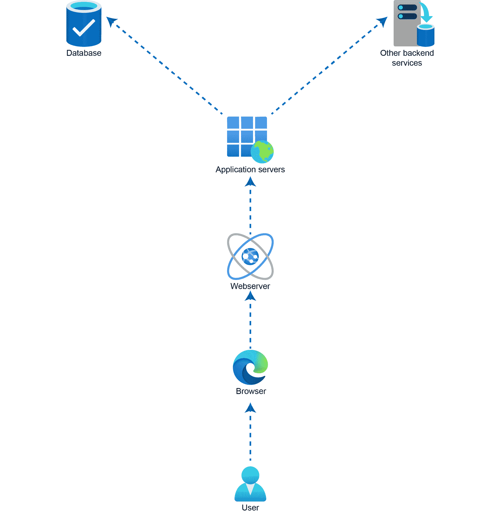
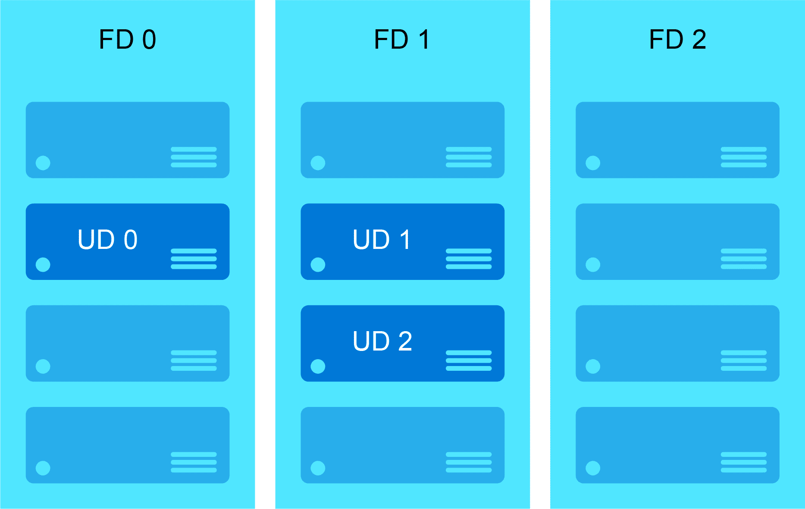

# 一、Linux：云的历史与未来

“微软♡ Linux”写在微软 CEO 萨提亚·纳德拉 2015 年演讲的最后一张幻灯片上。这宣布了一波即将发生的变化，塞特亚·纳德拉希望解决微软对 Linux 和开源软件技术的兴趣。每个人都觉得这里有些矛盾，想知道微软为什么要和 OSS 技术合作。《连线》杂志报道称，纳德拉对打老仗不感兴趣——尤其是，不管你喜不喜欢，Linux 已经成为当今商业技术的重要组成部分。纳德拉告诉《连线》杂志，“如果你不接受新的事物，你就无法生存。”

在撰写本文时，微软 Azure 50%以上是由 Linux 统治的。关于将现有的 Linux 工作负载迁移到微软 Azure 有很多误解，这本书将有助于理解复杂性，简化迁移过程。

我们将从 Linux 的简史和导致它发展的事件开始。与此同时，我们将讨论 Linux 的一些竞争对手，以及 Linux 和这些竞争对手的用例。我们将介绍 Linux 服务器在 IT 基础架构中扮演的一些关键角色，并讨论为什么云比内部解决方案更适合运行这些工作负载。随着大多数组织采用云转型战略，对虚拟机、容器、容器编排解决方案、大数据等的需求不断增加，微软 Azure 提供了一个平台来运行所有这些任务关键型工作负载。

为了了解将 Linux 工作负载迁移到 Azure 的复杂性，您需要了解 IT、操作系统、Unix、Linux 和 Windows 在云和虚拟化之前的历史。本章将提供一些关于 Linux 的重要背景信息，以使那些不太熟悉它的人能够学习术语。

与自托管环境相比，公共云有许多优势。我们将讨论它们，特别是讲述 Azure 是如何支持 Linux 工作负载的。

虽然我们将简要提及 Linux 系统中一些典型的困难方面，但您也将了解到 Azure 正在快速发展。Azure 现在有了开箱即用的功能，这将使 Linux 系统管理员的生活更加轻松。

本章涵盖以下关键主题:

*   Linux 的简史和演变
*   Linux 在信息技术基础设施中的使用案例
*   内部基础设施面临的挑战
*   云经济学
*   迁移到 Azure 的优势
*   简化与迁移相关的复杂性

让我们从 Linux 的简史开始。

## Linux 简史

在我们谈论 Linux 的历史之前，从导致它发展的事件开始是一个好主意。你可能见过像汽车或房子那么大的旧电脑的照片。现在我们生活在一个手持设备和瘦客户端的世界里，很难想象处理这么大的系统会有多麻烦。不仅仅是巨大的尺寸；过去在这些设备上运行的不同操作系统使事情变得更加复杂。每一个软件都是为一个目的而设计的，不可能在另一台计算机上运行。简而言之，我们遇到了兼容性问题。除了这些问题之外，购买这些电脑的成本也是巨大的。对于普通人来说，购买一台电脑并不是一个梦想。

### Unix

上述缺点导致了一个名为 **Unix** 的项目的开发，该项目是由贝尔实验室的一群开发人员在 20 世纪 70 年代中期开始的。这个项目的主要目的是为所有计算机制作一个通用软件，而不是为每台计算机制作单独的软件。项目用 C 语言代替汇编语言；它确实精致而不复杂。

Unix 操作系统被政府机构、大学和学校广泛采用。它存在于许多系统中，从个人计算机一直到超级计算机。虽然 Unix 的出现解决了一些问题，但它没有解决定价问题；这些系统仍然很昂贵。

20 世纪 80 年代初，组织开始开发自己的 Unix 版本。作为多个开发分支的结果，我们最终得到了许多不同的版本或方言。每个开发者和组织都想创建一个类似 Unix 的自由操作系统，1983 年在麻省理工学院，理查德·斯托尔曼开发了 GNU 项目。这个项目的目标是创建一个免费的操作系统(在许可的意义上，不一定是成本)。这个项目并没有像预期的那样获得多少人气；尽管如此，GNU 工具在 Linux 出现时就被它采用了。

### Linux

1991 年，莱纳斯·托瓦尔兹在芬兰赫尔辛基大学上学时，将 Linux 开发成了一个可自由分发的 Unix。Linus 的动力来自 Andrew Tanenbaum 的 Minix 操作系统，这是另一款面向 PC 的免费 Unix。Linus 想为希望从电脑中获得更多信息的 Minix 用户创作一个可以在基于英特尔 386 的电脑上运行的 Unix 免费学术版。该项目最初被命名为“Freax”，这是一个有趣的项目，最终以“Linux”的名字成为计算机历史上最大的革命之一在 Linux 初期的一个公共论坛(comp.os.minix)上，Linus 提到他的作品是“比 minix 更好的 Minix。”引用他自己的话:

*“之后就一帆风顺了:长毛编码依旧，但我有了一些设备，调试也更容易了。我是在这个阶段开始使用 C 语言的，这当然加快了开发速度。这也是我开始认真对待我的自大狂想法，让“一个比 Minix 更好的 Minix。“我希望有一天能在 Linux 下重新编译 gcc...*

*“两个月用于基本设置，但之后只是稍微长一点，直到我有了一个磁盘驱动程序(有严重的问题，但它碰巧在我的机器上工作)和一个小文件系统。那大约是在我推出 0.01 的时候[大约在 1991 年 8 月下旬]:它并不漂亮，没有软驱，也不能做太多事情。我不认为有人编辑过那个版本。但那时我已经上瘾了，在我能扔掉 Minix 之前，我不想停下来。”*

要是他猜到 30 年后 Linux 会被广泛采用就好了。

### Linux 版本历史

对于 Linux 的第一个版本(v0.01)，没有可执行文件。要使用这个版本，您需要一台 Minix 机器来编译，因为这样做的目的是让 Minix 系统变得更好。1991 年，v0.02 推出，现在被称为 Linux 的第一个正式版本。我们看到的当前 Linux 系统为各种事情提供了大量的资源，例如用户支持、文档和软件仓库。然而，在 Linux 的早期阶段，情况并非如此。在 v0.02 中，Bash(GNU Bourne re Shell)和 gcc (GNU 编译器)是唯一运行的东西，主要关注的是内核开发。

v0.02 之后是 v0.03，以此类推；直到 1992 年 Linux 达到 v0.95 之前，一直在进行修订，目标是实现无 bug 的 v1.0。经过两年的修订，v1.0 于 1994 年 3 月问世。经过 25 年的 v1.0，我们目前处于 v5.x 版本，在撰写本文时，发布的最后一个版本是 v5.9。我们预计 v5.10 很快就会发布。

如前所述，Linux 采用了 GNU 工具，这些工具在 Linux 的制作中起到了不可避免的作用。没有这些，Linux 可能不会产生我们今天看到的影响。和 GNU 一样， **Berkeley 软件发行版** ( **BSD** )在让 Linux 流行起来的过程中发挥了作用。尽管最初在 Linux 的早期阶段并没有采用 BSD，但后来的版本中有从 BSD 移植的工具。网络守护程序和其他几个实用程序是 BSD 对 Linux 的贡献的完美例子，使它成为令人钦佩的主题。

### Linux 的演进和发行版

Linux 经过这些年的发展，Linus Torvalds 启动的有趣项目现在被全球数百万台计算机、智能手机、服务器甚至超级计算机使用。如今，Linux 能够运行网络、邮件、电子邮件、视窗系统……不胜枚举。Linux 不仅在内部占据主导地位，而且在 Azure 中也占据了很大一部分工作负载。目前，我们有很多适合企业和个人使用的 Linux 风格。

如前所述，Linux 不是由单一组织开发的。它是不同部分或模块的组合，例如内核、GNU 外壳实用程序、X 服务器、桌面环境、系统服务、守护程序和终端命令——所有这些都来自不同的开发人员，并且是独立开发的。如果你愿意，你可以获取内核、外壳和其他组件的源代码并组装起来。有 **Linux 从无到有** ( **LFS** )和**超越 Linux 从无到有** ( **BLFS** )等项目，用户可以下载这些在开源软件下获得许可的软件，进行编译，做出自己的 Linux 味道。

虽然令人兴奋，但这需要大量的工作，你必须投入大量的时间让这些组件正常工作。Linux 发行版(通常被称为**发行版**)让这项繁忙的任务变得更加容易。发行版将从存储库中获取所有代码并编译它们，最后创建一个可以在计算机上启动的单一操作系统。发行版的例子包括 Ubuntu、Fedora、CentOS、RHEL、Mint 和 SUSE Linux。一些发行版，如 RHEL、SUSE 和 Ubuntu，也有企业服务器级版本，组织使用它来托管其任务关键型工作负载。

面向企业的 Linux 是一个全新的领域。最开始是红帽，以前是垄断的。然而，更多的竞争对手很快出现，包括 Canonical 和 SUSE，以及非商业 CentOS。Azure 支持所有上述企业级 Linux 操作系统，因此每个组织都可以将其 Linux 工作负载迁移到 Azure。

在讨论将工作负载转移到 Azure 的好处之前，让我们先了解一下 IT 基础架构中这些 Linux 服务器的常见用例场景，以及与内部部署方法相关的一些挑战。

## IT 基础设施中典型的 Linux 用例

如前一节*Linux 简史*所述，Linux 操作系统的客户群对于内部环境和云来说都是非常庞大的。在本节中，我们将讨论 Linux 在信息技术基础设施中的一些用例。自从开始采用 Linux 以来，有些东西一直是相关的(文件、网络、数据库等)，而另一些东西最近随着新技术的引入而被采用(例如容器化和容器编排)。这些用例将随着时间的推移而增加和发展。

### 工作站

有很大一部分消费者更喜欢在个人电脑上使用 Linux 作为日常通勤工具。这个领域主要被 Windows 和 macOS 垄断，但是当 Linux 登场后，事情发生了很大的变化。传统上，Linux 一直是程序员和程序员的最爱，为普通消费者提供了比 Windows 或 macOS 更多的定制选项。因此，Linux 成为全球数百万人的首选:

图 1.1:不同的工作站发行版和图形用户界面

目前我们有 Ubuntu、Fedora Workstation、Linux Mint、Elementary OS、CentOS、Arch Linux 等口味。*图 1.1* 展示了**图形用户界面** ( **图形用户界面**)在不同工作站发行版中的表现。

### 应用服务器

应用服务器是捆绑在一起以促进业务逻辑的计算机软件。如果我们采用一个三层应用，应用服务器是由图形用户界面、业务逻辑和数据库服务器组成的组件。大多数应用服务器都支持 Java 平台，例如 JBoss、Jetty、JOnAS、Apache Geronimo 和 Glassfish:

图 1.2:应用服务器与其他服务的耦合，以提供端到端解决方案

在*图 1.2* 中，可以看到应用服务器是如何与其他服务耦合的，包括前端和后端服务。应用服务器处理来自前端和后端服务(如数据库和其他逻辑)的用户请求之间的连接。

### 数据库服务器

Linux 成为数据库之家已经有很长时间了。我们可以根据我们的数据需求在 Linux 上安装关系数据库和非关系数据库。术语**数据库服务器**是指数据库应用和为数据存储分配的内存的组合。这些数据库可以用来记录事务，其方式类似于 SQL Server 在 Microsoft Windows 上的工作方式:

图 1.3:负载平衡器后面有数据库的两层应用模型

一些常用的数据库服务包括 MariaDB、PostgreSQL、MySQL 和 MongoDB。在大多数情况下，托管在 Linux 服务器中的数据库被保留在负载平衡解决方案后面，以提供高可用性。*图 1.3* 就是一个例子。

### 虚拟化

虚拟化的目的是使用称为**虚拟机管理程序**的专用软件创建虚拟机。大多数人可能都熟悉术语**虚拟机** ( **虚拟机**，因为这在内部环境和云中非常常见。使 Linux 成为虚拟化主机的目的与安装具有 Hyper-V 角色的 Windows Server 实例相同。虚拟机通常是为隔离工作负载和测试目的而创建的。流行的 Linux 虚拟化解决方案包括 KVM、RHEV、Xen、QEMU、VirtualBox 和 VMware:

图 1.4:虚拟化级别

如图*图 1.4* 所示，虚拟机管理程序安装在硬件上，使用虚拟机管理程序创建不同的虚拟机。这些虚拟机中的每一个都与操作系统隔离，并且可以托管不同的应用。

### 容器

我们刚刚讨论了虚拟机及其使用安装在我们的 Linux 服务器上的虚拟机管理程序的创建。这些服务器的占地面积会很大，并且通常包含一些我们不需要的库和二进制文件。这导致计算资源的浪费；随着所有虚拟机的部署，您的主机容量将很快耗尽。随着容器的引入，情况发生了变化，我们不需要部署整个虚拟机来托管专用服务。

容器只是一个软件包，包含特定任务所需的代码、二进制文件和库。例如，要运行一个网络服务器，我们可以部署一个虚拟机，并在其上安装 NGINX。虚拟机的资源消耗会很高，并且包含许多我们不需要的服务。相反，我们可以使用容器，因此该映像只有运行 NGINX 服务器的代码，没有其他内容。这意味着轻量级映像和快速部署。

就虚拟机而言，我们使用虚拟机管理程序来运行它们；就容器而言，我们使用容器运行时引擎。两者的对比见*图 1.5* 。一些常见的例子包括 Docker(使用最多)、Runc、Rkt(不再开发)和 Mesos:

图 1.5:容器与虚拟机

目前，我们为每个服务都提供了容器映像，包括 NGINX、MySQL 和 Apache。所有主要软件包都已移植。

### 云计算

Linux 可以用来托管云操作系统解决方案，比如 OpenStack。我们可以在我们的 Linux 服务器上安装 OpenStack 来托管云环境(私有和公共)，以管理包括计算、存储和网络在内的大型底层资源池。可以把它想象成 Azure 堆栈，在这里你可以在自己的数据中心运行 Azure。同样，您可以在数据中心托管云环境，供用户使用运行在 Linux 上的 OpenStack 部署服务:

图 1.6:运行在 Linux 之上的 OpenStack

OpenStack 公开了许多 API，用户可以使用这些 API 来跟踪、管理和监控他们的部署。*图 1.6* 展示了 OpenStack 如何在 Linux 之上运行作为部署平台的基本架构。

### 容器编排

随着容器的引入，许多组织正在从单一架构向微服务架构转变。随着容器数量的增加，大规模管理它们并不容易。这就是容器编排工具(如 Kubernetes)出现的地方。我们可以在 Linux 机器上安装 Kubernetes 服务，并向其中添加 Linux 和 Windows 工作节点。主服务器将在 Linux 服务器上运行，这将作为集群的管理平面。*图 1.7* 展示了如何将 Linux 节点添加到 Kubernetes 主节点的高级表示。以类似的方式，我们还可以创建一个 Windows 节点池，并将其添加到 Kubernetes 集群中:

图 1.7:Kubernetes 集群中的 Linux 工作节点

Kubernetes 的另一个发行版是由红帽开发的 OpenShift。不同的供应商发布了许多 Kubernetes 发行版，都是为了容器编排。事实上，有一些专门的 Linux 发行版是在考虑到 Kubernetes 的情况下开发的，比如 Rancher 的 k3OS。容器编排是一个蓬勃发展和不断增长的领域，我们甚至可以单独就这个主题写一整本书。

### 大数据

我们从简单的例子开始，一直扩展到复杂的场景，比如 Linux 上的大数据。可以在 Linux 上安装 Apache Hadoop 等工具，然后进行大数据分析。由于对 Azure Synapse Analytics 或 Azure HDInsight 等托管云服务的可用性和支持各不相同，我们并没有在每个组织中真正看到这种情况。然而，如果你想在 Linux 上实现大数据分析，这是可能的。*图 1.8* 显示了数据科学家和大数据分析师使用的工具的广泛列表，所有这些工具都可以安装在 Linux 上:

图 1.8:用于大数据分析的工具

如前所述，使用 Linux 进行大数据分析是一个很少看到的场景，但是，一些客户更喜欢在 Linux 上安装某些分析工具，如 Splunk。

在本节中，我们已经讨论了一些常见的场景，但这并不意味着用例仅限于这些场景。随着几乎每天都有新技术的引入，潜在的用例将继续扩展。我们探索了这些特定的场景，以证明 Linux 可以处理广泛的场景，从基本功能(如工作站)一直到容器编排和大数据。

尽管内部基础设施也可以支持所有这些场景，但这种方法也有一些缺点。这是每个组织云之旅背后的驱动力。让我们看看这些挑战是什么，以及云如何缓解它们。

## 内部基础设施的挑战

由于需要合格的人员和复杂的网络，在内部托管基础架构非常具有挑战性。传统的方法已经持续了很长时间。随着云计算的引入，组织开始认识到他们几十年来面临的挑战如何通过云计算来解决。在我们了解云计算的优势之前，让我们先了解这些内部挑战的根本原因:

*   **缩放**:这是主要挑战之一。很难实现一个可以根据变化的流量进行扩展的解决方案。每当需要更多资源时，您可以添加更多服务器(物理或虚拟)，当不再需要时，可以终止它们。但是，这种情况下的资源利用率没有优化。随着云的引入，扩展变得非常容易；您只需指定缩放条件(CPU %、内存%等)，云提供商将负责缩放本身。您永远不知道您的业务明年会发展到哪里，微软 Azure 可以帮助您在业务发展的同时扩展基础架构。
*   **敏捷**:敏捷是快速反应的能力。在 Microsoft Azure 中，您可以快速分配和释放资源，以响应业务需求的变化。所有服务都是作为按需自助服务提供的，这意味着如果您需要新服务器，可以在几秒钟内部署。在内部，如果我们需要一个新的物理服务器，获得一个的过程是非常复杂的。您可能需要要求硬件提供商运送硬件、许可、修补，然后安装所有必需的软件，使其适合运行您的工作负载。因此，我们看到的时间表至少在 2-3 周左右，这与微软 Azure 提供的敏捷性形成鲜明对比。即使您正在内部部署新的虚拟机，您也需要确保您的主机有足够的资源用于新的虚拟机，否则您可能需要购买新的服务器。
*   **技能**:管理自己的数据中心所需的技能要求非常高，很难找到专业人士来处理。除了基础设施管理，您还必须考虑数据中心的安全性。为此，您可能需要雇佣更多的安全专业人员来提高数据中心的安全性。员工人数的增加是组织的另一项成本。
*   **安全性**:上一点，我们注意到雇佣更多的专业人员会增加组织的成本。即使在成功招聘后，随着威胁的不断变化和发展，也很难对员工进行每一组可能的安全威胁的培训。管理安全性以及如何应对新威胁仍然是内部环境中的一项挑战。大多数组织只有在受到威胁后才实施预防措施。事件发生后，您将需要聘请网络法医专业人员进行调查，这对组织来说也是一笔额外的费用。

这些是为什么在内部工作很有挑战性的一些主要原因。随着云的引入，组织可以更加专注于实现业务目标，而不是将时间浪费在机架和堆叠、软件修补和其他耗时的信息技术管理琐事上。

在下一节中，我们将介绍云经济，深入探讨云的优势以及如何解决上述和其他未提及的挑战。

## 云经济

拥有数据中心不是典型公司的核心业务。虽然 it 部门拥有自己可以设置并与自己进行物理交互的物理服务器可能很诱人，但这可能不是您的**首席财务官** ( **CFO** )想要做的事情。拥有服务器不仅会在资产负债表中显示为资本支出，而且设施、电力、保险等成本也会在总运营成本中增加。如果你问任何一位 IT 经理，在他们自己的数据中心托管一个应用一年所需的基础架构的购买、设置、运行和处置成本是多少，他们很可能不知道，甚至不敢猜测。

在你意识到自己运营数据中心的成本有多高之后，将基础设施外包给托管提供商听起来是个好主意。与单客户数据中心相比，多客户数据中心当然更具成本效益。通过在所有或许多客户之间共享部分基础架构，增加规模可以更容易地节省成本。2020 年底，全球有成千上万个专业运营的共享托管数据中心——我们如何知道选择哪一个，哪一个将在明年倒闭？

商业软件的规模和复杂性增加了，应用收集和处理的数据量也增加了。这导致对计算能力和存储的需求越来越大，这自然会增加基础架构成本。不断增加托管环境的成本不是您的首席财务官能够长期忍受的。

### 规模带来效益

许多托管数据中心提供商正在将自己的基础架构迁移到公共云，部分原因与其客户相同:公共云基础架构在区域、数据中心和服务器数量方面变得如此庞大，以至于优化成本的规模和功能确实难以与之竞争。对于传统的数据中心和主机提供商来说，通常不可能只在您真正需要容量的时候才付费，例如在办公时间。

公共云由于其巨大的规模，可以提供基于消费的定价。他们可以与所有客户共享区域和全球资源。此外，他们能够对基础设施进行大规模投资，并使用定制组件。在许多情况下，他们还可以通过选择条件有利的地点来优化运营成本，例如有助于冷却数据中心的寒冷气候；此外，数据中心产生的热量可以用来加热附近的家庭。

公共云值得一提的另一个好处是安全性方面。让我们来看看 Azure:它使用微软的全球网络实现 Azure 内外的所有连接。微软运营其他各种基于云的服务，如微软 365 和 Xbox，它们从互联网接收大量不需要的流量。这有它的好处；例如，一些行为恶劣的 Xbox 用户试图对另一个 Xbox 用户进行 DDoS 攻击，这将被微软注意到，微软可以在全球范围内修复攻击，例如确保 Azure 不受影响。

通过使用公共云，您可以节省时间和金钱，因为您不必雇用自己的数据中心团队，或者不必为此向托管提供商付费。它还为您提供了几乎无限的上下可扩展性，而无需承诺长期合同。

迁移到公共云并不意味着您需要一次性完成所有工作。您可以选择混合方法，将一些应用和数据留在后面，只在环境之间创建连接。

### 许多服务可用

为了更好地理解迁移策略，了解各种可用的云服务是非常有用的。

Outlook 和 Gmail 等云服务，或者 OneDrive 和 Google Drive，都是**软件即服务** ( **SaaS** )的好例子。大多数面向消费者的云服务，如脸书、Instagram 和 WhatsApp，也属于这一类。

从用户的角度来看，这些解决方案只是“在那里”，不需要太多的初始努力就可以使用。这同样适用于典型的业务解决方案，如 Salesforce CRM 或 Microsoft 365。你不能自己安装这些，即使你想；它们总是作为交钥匙服务出现，并且您对底层基础架构没有任何可见性。

**平台即服务** ( **PaaS** )解决方案与 SaaS 有几个不同之处；他们需要某种安装工作和可以安装他们的基础设施。虽然安装是自动的，但您可能需要自己管理基础架构的某些部分。此类服务的例子包括**天青库伯内斯服务** ( **AKS** )和**天青红帽 OpenShift** ( **ARO** )。

在将 Linux 服务器迁移到 Azure 的背景下，我们关注的是**基础架构即服务** ( **IaaS** )，这意味着您只能获得较低级别的基础架构组件即服务。其他一切都是您自己的责任，包括配置存储和网络以及自己操作操作系统。这种类型的云服务类似于托管公司提供的典型虚拟机托管服务。

## 迁移到 Azure 的好处

内部部署环境中的典型 Linux 部署基于虚拟机，将它们迁移到 Azure 属于 IaaS 领域，因此迁移后它们仍将是虚拟机。对于系统管理员来说，这意味着他们已经拥有的技能和熟悉的管理工具在 Azure 上仍然有用。

在 Azure 的早期，有些服务不是为 Linux 使用而设计的，用户有时会对在 Azure 上使用 Linux 的复杂性感到沮丧。最初被命名为微软 Azure 暗示了它是为什么用例设计的。从那以后，Azure 得到了发展，它已经发展得越来越对 Linux 友好。

#### 注意

Linux 在 Azure 中迅速普及。2015 年，Azure 首席技术官 Mark Russinovich 表示，Azure 中每四个 VM 实例中就有一个运行 Linux。2018 年，微软云 EVP Scott Guthrie 在接受 ZDnet 采访时透露，Azure 虚拟机中约有一半运行 Linux。

([https://www . zdnet . com/article/mark-russinovich-the-Microsoft-azure-cloud-and-open-source/](https://www.zdnet.com/article/mark-russinovich-the-microsoft-azure-cloud-and-open-source/)和[https://www.zdnet.com/article/linux-now-dominates-azure/](https://www.zdnet.com/article/linux-now-dominates-azure/))

在 2021 年撰写本文时，微软已经因其对 Linux 和开源的热爱而闻名。微软正在支持许多开源项目、计划和基金会，比如 Linux 基金会。根据他们的网站([https://opensource.microsoft.com/program/](https://opensource.microsoft.com/program/))显示，微软在构建产品和服务时已经使用了超过 15 万个开源组件。

如今，越来越多的客户正在将其现有工作负载迁移到 Azure。如前所述，其中许多工作负载都是基于 Linux 的。为了促进这些迁移，微软为 Linux 用户开发了许多工具和服务。我们将在本书后面更详细地介绍这些内容。

微软已经与所有主要的 Linux 供应商合作，帮助他们的客户将工作负载转移到 Azure。这些合作伙伴关系的目标是开发新功能，并确保现有功能得到更好的集成，同时不要忘记以继续在 Azure 中使用现有商业内部合同的能力的形式提供金钱利益。

Red Hat 和 SUSE 等企业级 Linux 公司在内部 IT 基础架构领域非常受欢迎，他们都与微软合作创建了统一的全球支持服务，以确保其客户能够顺利迁移到 Azure。

像 CentOS 和 Ubuntu 这样的社区 Linux 发行版在 Azure 中非常受欢迎，有许多公司提供商业 Linux 支持，包括 Canonical 及其 Ubuntu Pro 产品。

## 从 Linux 到 Azure 的旅程

在这一节中，我们将介绍在考虑迁移到 Azure 时应该了解的典型 Linux 环境的一些方面。我们将介绍一些关键特性，并讨论 Azure 上可用的解决方案。我们还将在本节中提供相关 Azure 文档的链接，以使您的学习曲线稍微浅一点——这些文档非常好地涵盖了 Azure 上的 Linux。

在深入技术细节之前，最好知道您不一定需要自己实现所有内容。Azure Marketplace 有许多基于 Linux 的解决方案，可能会以交钥匙的方式解决您的问题。

在撰写本文时，Azure Marketplace 有超过 2，000 个基于 Linux 虚拟机的映像，而基于 Windows 的映像大约有 800 个。Linux 显然正在主导市场。在这些图片中，只有 14 张来自微软；其余的由第三方 ISV 公司创建和发布。例如，如果您想在 Linux 虚拟机上安装 WordPress，您需要安装 Apache、PHP 和 MySQL 作为数据库。另一方面，如果你使用的是市场图片，你可以找到定制的 WordPress 图片。这些映像可以很容易地从市场部署到您的 Azure 订阅中，而不需要手动安装 Apache、PHP 和 MySQL 服务。

你可以在这里找到蔚蓝市场:https://azuremarketplace.microsoft.com/marketplace/。市场图像也可以通过 Azure 命令行界面获得。就在我们发言的时候，图像的数量正在增加，也有可能将您自己的图像发布到 Azure Marketplace，并使它们可供大量客户使用。

我们将首先讨论集群，这是一个有很多灰色区域的场景。

### 聚类

在简单的英语中，“集群”一词的意思是群体、成群或集合。当我们说 IT 世界中的集群时，我们表达的是一组计算机(在这种情况下是 Linux 计算机)、多个存储组件和冗余网络连接共同作用形成一个高可用性系统的想法。群集避免了单点故障，还提供了负载平衡和高可用性。乍一看，集群可能看起来很复杂，因为我们必须管理多个计算资源，但这一部分是关于揭开集群复杂性的神秘面纱。

典型的 Linux 集群场景可以分为四种类型:

*   仓库
*   高可用性
*   负载平衡
*   高性能

这些都是用不同的软件实现的，需要自己的架构和配置。在接下来的几节中，我们将看到 Azure 如何解决这四个场景中的每一个。

### Azure 共享磁盘用于存储

内部部署系统中的存储集群通常被认为是多个节点之间一致的集群文件系统。当使用软件解决方案时，用于文件系统集群的技术通常是 GlusterFS、GFS2 或 OCFS2。对于块级存储共享，使用 DRBD 非常常见。在 Azure 上使用这些解决方案并不简单——即使在内部系统上也要正确设置它们，这需要非常熟练的系统管理员。

对于共享块存储，您可以使用 Azure 共享磁盘。这是一项相当新的功能，允许您将一个受管磁盘同时连接到多个虚拟机。这解决了许多与存储集群相关的问题。 **SCSI 持久保留** ( **SCSI PR** )是一个行业标准，由运行在**存储区域网络** ( **SAN** 上的内部环境中的应用使用。相同的 SCSI PR 有助于保留，虚拟机将使用这些保留来读取数据或将数据写入其连接的磁盘。共享托管磁盘需要使用群集管理器工具，如起搏器，它将处理群集节点通信和写锁定。群集需要起搏器，因为共享托管磁盘不提供可通过中小型企业/NFS 访问的完全托管文件系统。

这里的一个缺点是，并非所有磁盘类型的层都可以用作共享磁盘。目前，支持超固态硬盘和高级固态硬盘。如果您的虚拟机使用标准硬盘或标准固态硬盘，为了满足群集先决条件或克服当前限制，您可能需要将磁盘类型升级为超级或高级固态硬盘。

共享磁盘的文档可以在这里找到:[https://docs . Microsoft . com/azure/virtual-machines/disks-shared](https://docs.microsoft.com/azure/virtual-machines/disks-shared)。我们应该注意到，并非所有的 Linux 发行版都支持 Azure 共享磁盘。

### 天青文件和天青 NetApp 文件

共享文件系统的解决方案是一项名为 **Azure 文件**的服务。这是一个易于使用的云文件系统，允许通过使用**服务器消息块** ( **中小企业**)或**网络文件系统** ( **NFS** )协议挂载 Azure 文件共享。NFS 非常受 Linux 服务器的欢迎，中小企业通常与 Windows 服务器一起使用。在*信息技术基础设施中的典型 Linux 用例*部分，我们讨论了文件服务器如何在信息技术基础设施中发挥重要作用；Azure 文件是它的企业级云版本。这些文件共享可以安装在 Linux、Windows 和 macOS 系统上。Azure 文件提供了一个公共共享空间，可以与您的内部工作站和虚拟机共享。作为 Azure 存储的一部分，Azure 文件具有 Azure 存储支持的所有功能。说到 NFS 市场份额，与中小型企业市场份额相比，它的功能较少。

Azure 文件可以完全替代我们内部服务器上的文件服务器角色。由于我们能够连接到我们的内部服务器，我们还可以使用 Azure 文件将数据从内部服务器移动到云服务器，在两端装载相同的文件共享。相关文档请点击这里:[https://docs . Microsoft . com/azure/storage/files/storage-files-introduction](https://docs.microsoft.com/azure/storage/files/storage-files-introduction)。

共享 NFS 文件系统的另一个解决方案叫做**天青 NetApp 文件** ( **ANF** )。这是一项企业级高性能文件系统服务。NetApp 是一种非常受欢迎的存储解决方案，通常用于内部系统，现在它也在 Azure 上提供。您可以在这里阅读更多关于解决方案的信息:[https://docs.microsoft.com/azure/azure-netapp-files](https://docs.microsoft.com/azure/azure-netapp-files)。

ANF 支持各种存储性能层，具体取决于您的应用的 IOPS 要求。由于它与 Azure 平台深度集成，因此可以用作集群解决方案的共享文件解决方案。此外，ANF 拥有领先的行业认证，这使其成为 SAP HANA LOB 应用、HPFS、VDI 和 HPC 的理想之选。请注意，ANF 的最小存储容量目前为 4 TB。

### 高可用性的可用性集

Azure 提供非常简单的可用性集功能，可用于创建简单易用的高可用性环境。可用性集由**故障域** ( **故障域**)和**更新域** ( **故障域**)组成。

FDs 是 Azure 数据中心中共享公共电源、冷却和网络连接的硬件组。当我们将虚拟机部署到可用性集中时，Azure 会确保它们分布在三个 FD 1 上，这样即使 fd1 的电源中断，FD 2 或 FD 3 中的虚拟机也可以为客户提供服务。

同样，我们也有 UDs，其中虚拟机以底层硬件可以同时重启的方式进行分组。当 Azure 数据中心发生计划的维护事件时，一次只有一个 UD 重新启动。默认情况下，如果您部署到可用性集，虚拟机将分布在五个 FDs 上。但是，如果您愿意，您可以将其增加到最多 20 个 UDs。*图 1.9* 显示了数据中心如何映射用户定义文件和功能描述文件:

图 1.9: FDs 和 UDs

可用性集使您能够跨隔离的硬件集群以分布式方式在 Azure 上部署虚拟机。这里有一个有用的教程:https://docs . Microsoft . com/azure/virtual-machines/Linux/tutorial-availability-set。

邻近放置组功能使您能够将选定的虚拟机保持在可用性集中的距离上。这减少了可能影响您的应用的网络延迟。请点击这里查看更多关于此功能的信息:[https://docs . Microsoft . com/azure/virtual-machines/co-location # proximity-placement-group](https://docs.microsoft.com/azure/virtual-machines/co-location#proximity-placement-groups)。

Azure 上通常不需要起搏器，这是一种用于典型内部安装的集群软件。然而，一些移植到 Azure 的传统解决方案是基于起搏器和 DRBD 的，例如，Azure 架构上的认证 SAP。

### Azure 第 4 层负载平衡

Azure 附带了非常有用的第 4 层负载平衡功能，通常可以用来替代典型的内部解决方案。在多个虚拟机之间分配请求和负载需要负载平衡。本教程将指导您在 Azure 上创建和操作 Linux 负载平衡:[https://docs . Microsoft . com/Azure/virtual-machines/Linux/教程-负载平衡](https://docs.microsoft.com/azure/virtual-machines/linux/tutorial-load-balancer)。

许多内部负载平衡解决方案不适合照原样迁移到云，因此调查 Azure 负载平衡是否解决了同样的需求可能会有所帮助。特别是，如果您的应用架构将在迁移过程中被修改，那么当前的负载平衡架构可能不具备您需要的功能，或者在 Azure 上使用时可能不必要的昂贵。

### Azure 上的高性能计算

最后一种集群类型，即高性能计算，非常适合 Azure。典型的内部高性能计算解决方案极其昂贵，尤其是当您不使用它们时，因为您需要全天候支付硬件费用。

Azure 既提供了传统的基于 CPU 的高性能计算解决方案，也提供了非常强大的基于 GPU 的高度可扩展模型。您可以使用各种存储选项在运行工作负载的节点之间共享数据。您可能还想从基于 RDMA 的高吞吐量后端网络中获益。相关文档可在此获得:[https://docs . Microsoft . com/azure/architecture/topics/高性能计算](https://docs.microsoft.com/azure/architecture/topics/high-performance-computing)。

此外，Azure 市场上还有各种第三方高性能计算解决方案。

### 订阅便携性

很多时候，对于 Linux 的 Azure 迁移来说，最大的挑战出人意料地不是技术性的。让我们在这里停一会儿，考虑一下您的 Linux 许可和订阅，尤其是如果您正在使用商业 Linux 发行版，如红帽企业 Linux 或 SUSE Linux 企业服务器。

您知道自己是否只是将现有虚拟机提升并转移到了公共云上吗？你需要和你的 IT 采购或律师讨论红帽或 SUSE 的合同条款吗？对于您现在可能想到的任何问题，正确答案都是:*是，但首先请咨询您的 IT 采购。*

红帽和 SUSE 都允许客户将其现有的企业订阅转移到公共云，但是您需要采取几个步骤来实现合规性并继续直接获得他们的支持。在 Azure 中，使用这些迁移订阅创建的 Linux 虚拟机是**自带订阅** ( **BYOS** )。红帽调用相关程序**红帽云访问**，SUSE 的程序调用 **SUSE 公有云程序**。

请注意，将您现有的 Linux 订阅迁移到 Azure 意味着，对于使用这些订阅的虚拟机，您将继续与 Red Hat 或 SUSE 保持计费关系。您可以使用微软的**即付即用** ( **PAYG** )计费在 Azure 上创建新的 Linux 虚拟机。

最后，了解 Azure 混合优势非常有用，它允许您在 BYOS 和 PAYG 之间切换。此功能正在积极开发中，在撰写本文时，仅支持从内部迁移到 Azure 的虚拟机。请在此处的文档中查看更多详细信息:[https://docs . Microsoft . com/azure/virtual-machines/Linux/azure-hybrid-受益-linux](https://docs.microsoft.com/azure/virtual-machines/linux/azure-hybrid-benefit-linux) 。

如果你使用的是社区发行版，比如 CentOS 和 Ubuntu，前面这些对你来说都不重要，因为这些发行版是完全免费使用的，但至少你今天学到了一些新东西。

## 总结

这一章从 Linux 的历史开始。Linux 从一个有趣的项目到一个企业级操作系统的飞跃令人惊讶。如今，从高端服务器到智能手机再到智能灯泡，Linux 无处不在。由于定制的自由，Linux 有很多变体，被称为口味或发行版；每个用例都有一个发行版。如果没有一个发行版符合您的确切要求，并且您想要添加更多的特性，请随意定制和构建您自己的 Linux。我们探讨了 Linux 的一些用例场景，并研究了传统 IT 在内部环境中基础架构管理面临的一些挑战。

每个组织都是靠数字运行的。在云经济部分，我们研究了如果进行资本支出和运营支出比较，在云中运行工作负载如何获利。云的上风不仅来自于成本的降低；这是一个解决我们在内部环境中遇到的所有挑战的解决方案。我们讨论了几个优势，包括容错、高可用性、敏捷性、弹性和可伸缩性。

可以肯定地说，您过去在内部环境中所做的一切都可以以某种方式迁移到 Azure 中。有大量高质量的文档可用，第三方独立软件开发商解决方案可以缩短您的实施周期。微软合作伙伴公司、微软客户团队以及致力于帮助客户迁移到 Azure 的微软快速通道团队也提供了额外的帮助。

下一章我们将深入探讨这些发行版，从许可部分开始，讨论一些被广泛采用的发行版，并最终讨论 Azure 上的 Linux 体验。