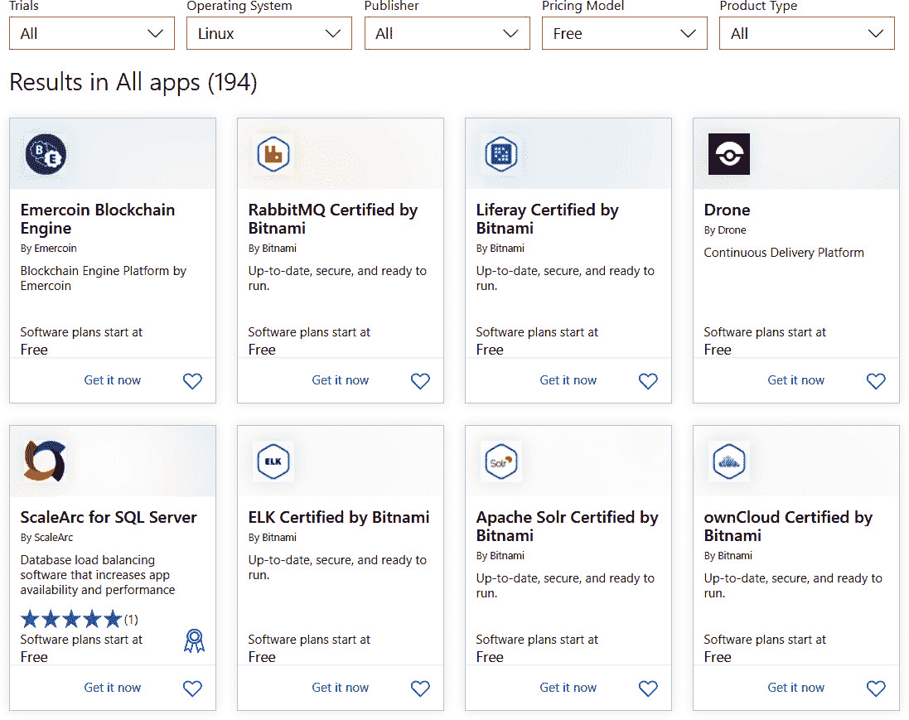
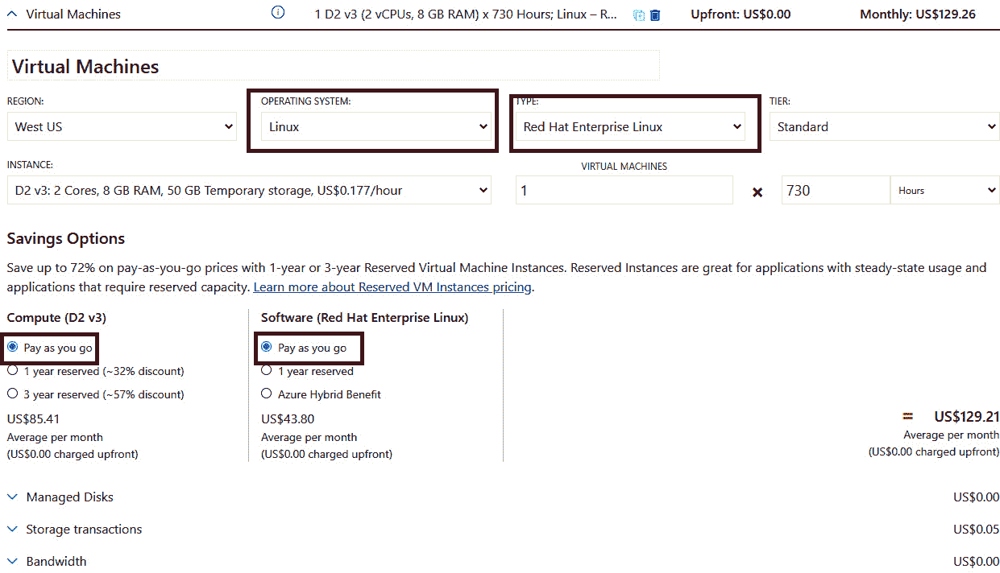
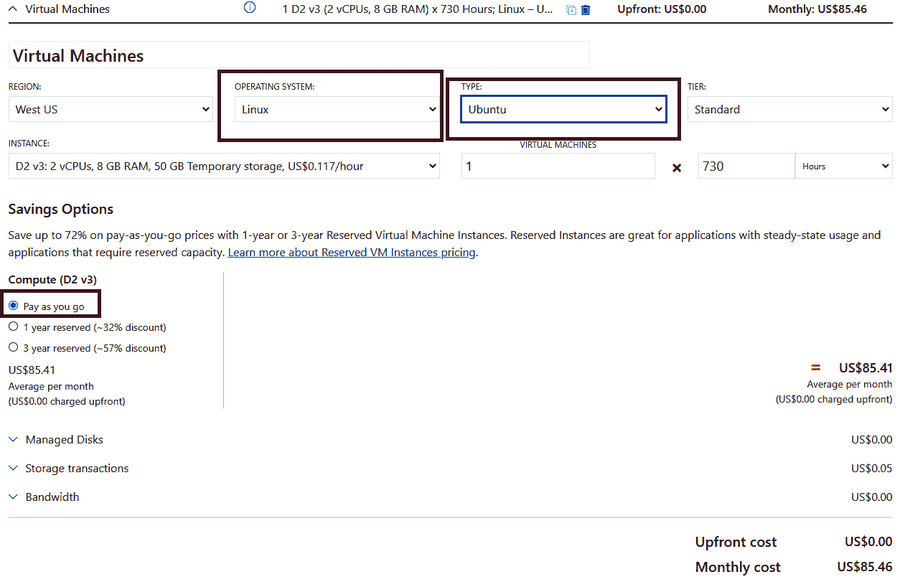
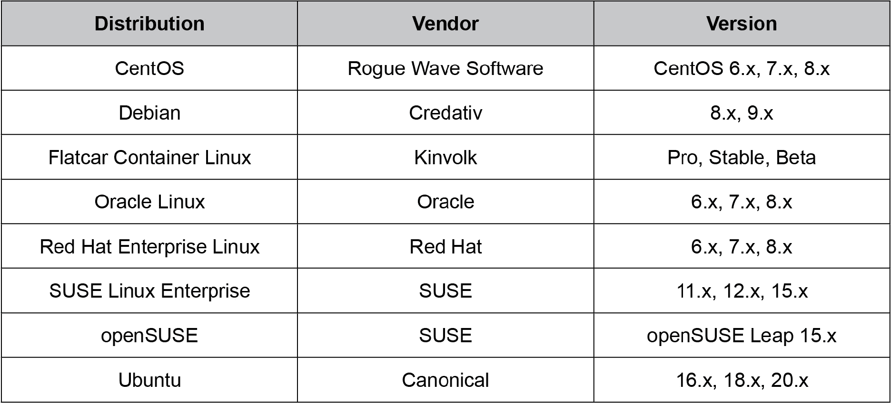
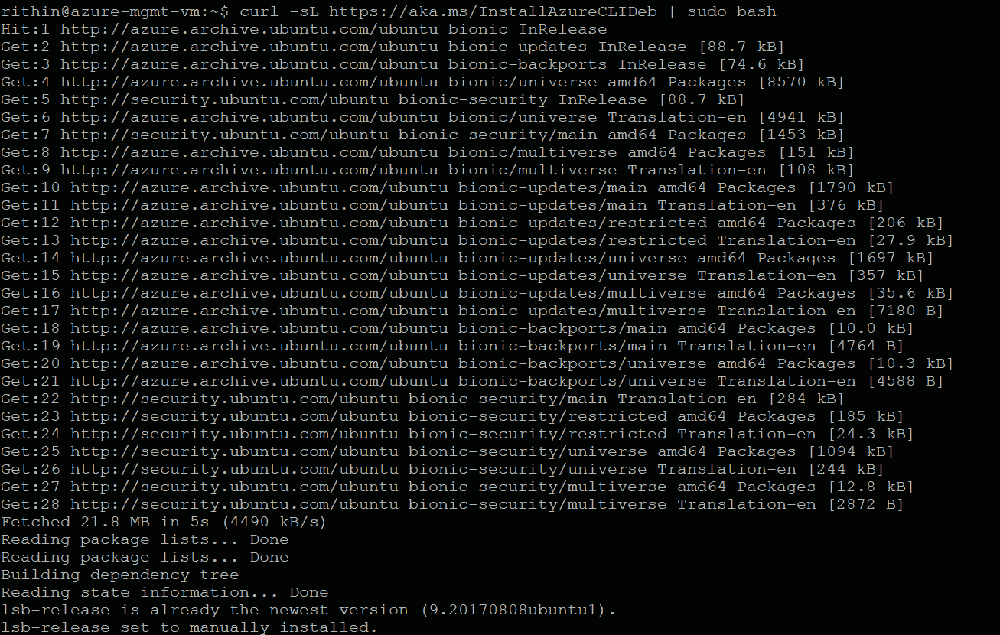
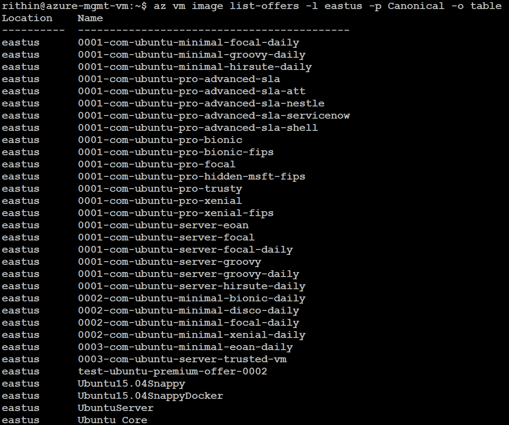
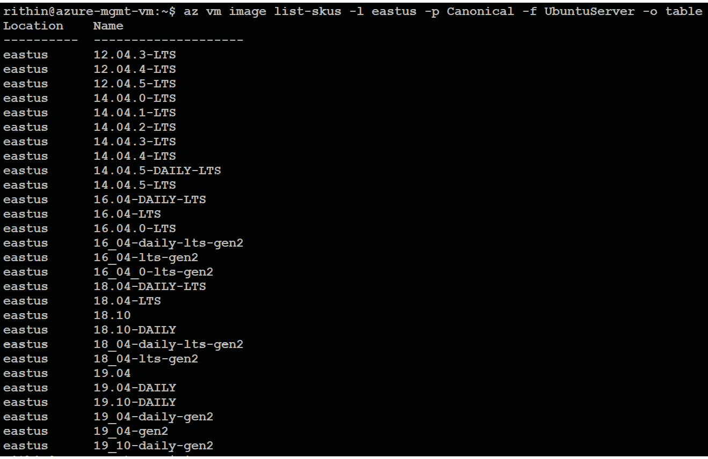
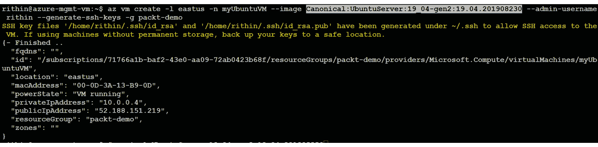

# 2.了解 Linux 发行版

*好东西有很多种口味，Linux 发行版也是如此。*

要创建一个成功的云迁移计划，您需要很好地了解要迁移到云的系统的组件和变量。

在本章中，您将了解各种 Linux 发行版的相关术语和技术细节，以帮助您规划到 Azure 的成功迁移。尽管所有的发行版都基于相同的操作系统，但它们都有自己的小技术细节，需要详细的知识才能成功地为迁移做准备。随着发行版的介绍，我们将了解许可选项，以及自由和商业开源软件之间的区别。商业 Linux 发行版有各种附加功能和支持选项。我们还将介绍不同发行版的一些典型用例。

本章的最后一节是 Azure 上的*Linux*，首先讨论微软认可的发行版和微软提供的支持范围。微软和 Linux 供应商共享支持。我们还将介绍 Azure 中的 Linux 虚拟机许可模式，以及每种模式为客户带来的潜在节约。我们将以使用 Azure CLI 查找虚拟机映像详细信息的演示来结束本章；如果您想在 Azure 上查看可用图像的列表，这非常有用。

本章将涵盖以下主题:

*   Linux 许可和开源商业模式
*   流行的 Linux 发行版
*   Azure 上的 Linux:优势、许可模式、支持

到本章结束时，您将了解到将 Linux 订阅转移到云中的必要技巧和诀窍。让我们从探索 Linux 许可证开始讨论。

## Linux 许可和开源商业模式

本节重点介绍商业 Linux 发行版。如果您只使用免费的 Linux 社区版本，如 CentOS 或 Debian，某些内容可能不适用于您。

### 开源许可

你如何从免费的东西中赚钱？为了回答这个问题，我们必须回头看看，当我们说某个东西是开源的时候，它意味着什么。

Linux 发行版和 Linux 内核都是开源的，但同时它们也受到版权法的保护。让事情变得非常复杂的是，有许多开源许可证覆盖了 Linux 发行版的不同部分。一些组件可能包含在 **GNU 通用公共许可证** ( **GPL** )中，一些包含在 **Apache 许可证** ( **APL** 中，还有一些包含在 MIT 许可证中。要使这变得更加复杂，重要的是要认识到同一许可证可能有多个版本，并且它们可能不都相互兼容或与任何其他许可证兼容。

在这一点上，理解所有的 Linux 发行版都被开源许可证覆盖就足够了。这意味着您有权下载 Linux 发行版中包含的所有软件的源代码。你可以用源代码做什么不在本书的讨论范围之内，因为我们没有创建自己的 Linux 发行版。在这本书里，我们不必深入各种开源许可和版权法的细节。

### 企业协议

当谈到商业开源，特别是商业 Linux 发行版时，术语**企业协议**是您在考虑将您的 Linux 服务器迁移到 Azure 之前需要熟悉的东西。我们可能经常会跳过阅读此类协议的条款和条件，然后只需简单地点击一下鼠标就可以接受，但阅读它们很重要。

面向商业 Linux 供应商的企业协议通常规定，您同意根据他们最新的价目表付费使用他们的软件，并遵守您可以在哪里以及如何使用软件的规则。它还说了很多其他的东西，但是由于这不是一个软件采购的书，我们就不深入这些细节了。然而，与您的软件采购团队进行对话，检查他们是否知道合同细节，这可能是有意义的。

### Linux 订阅

专有软件供应商所谓的“许可证”在 Linux 世界中可以被松散地称为“订阅”。当然，从技术上讲，这是两码事，但在典型的销售对话中，您可能会听到有人谈论 Linux 许可证——正如我们之前了解到的，这些不是您要找的许可证。

**订阅**实际上是指下载、使用和更新商业 Linux 发行版的权利。它通常还附带一项技术支持服务，该服务具有不同的服务级别协议。为了订阅这样的服务，您需要代表您的雇主与商业 Linux 供应商签订合同。这种合同通常被称为企业协议，它通常附带一些额外的义务。这些义务之一是遵守服务订购协议的规则。

例如，红帽企业 Linux 的订阅规则规定，您只能在自己的基础架构上使用该软件。实际上，这也包括托管环境，被认为是租用的基础设施。公共云不被视为您自己的基础架构，如果您想将您的 Linux 服务器移动到公共云，您需要通知红帽。

SUSE 有非常相似的订阅规则。如前所述，与您的软件采购部门一起检查合同是一个非常好的主意，以确保您遵守规则。

使用 Ubuntu，订阅的概念有点不同；您根本不需要订阅就可以使用它。在这种情况下，订阅指的是 Ubuntu 背后的公司 Canonical 的专业支持服务合同。除了免费的 Ubuntu Linux，Canonical 还提供 Ubuntu Pro，这是他们在 Azure 上的商业 Ubuntu 映像。

*图 2.1* 说明了商业和社区 Linux 发行版的许可证、订阅和支持合同之间的区别:

图 2.1:许可证、订阅和合同之间的区别

足够的许可证和订阅。让我们看看实际的 Linux 发行版。

## 流行的 Linux 发行版

多年来，各种 Linux 服务器发行版获得了相当稳定的市场份额。公司用户通常根据他们使用的业务应用在一个或两个发行版上进行标准化。红帽和 SUSE 是两家最著名的企业级 Linux 开发公司和供应商，它们在 Linux 操作系统领域都有类似的产品。如今，第三家商业 Linux 供应商 Canonical 也在同一类别中。他们的 Ubuntu Linux 曾经以开发者工作站发行版而闻名，它作为生产服务器操作系统也很快受到欢迎。再加上 Canonical 的商业支持产品，Ubuntu Linux 是两个领先的企业级 Linux 发行版的绝佳替代品。

红帽成立于 1993 年，当时鲍勃·扬和马克·尤因联手创建了*红帽软件*。1999 年，红帽在 T2 纽交所上市。在 2019 年被 IBM 收购之前，Red Hat 已经收购了数十家小型开源公司，如 Cygnus(跨平台工具)、JBoss (Java 中间件)、qum ranet(KVM 虚拟化技术的创造者)、Makara(PaaS 平台，OpenShift 的第一个版本)、ManageIQ(混合云编排器，CloudForms 的第一个版本)、InkTank(Ceph 存储技术的创造者)、Ansible(流行的自动化工具包)和 CoreOS(用于容器的小型 Linux 发行版)。

完整的收购名单包括 30 多家公司，你们大多数人可能都没有听说过，因为这些品牌已经与红帽的其他产品线合并了。**红帽企业 Linux** ( **RHEL** )是现在非常流行的平台，尤其是对于 Java 中间件 JBoss 产品，商业的 Kubernetes 打包、OpenShift 也是如此，因为两者都是由红帽发布的。

SUSE 成立于 Red Hat 的前一年，也就是 1992 年，成为第一家向企业客户销售 Linux 的公司。Rolard Dyroff、Burchard Steinbild、Hubert Mantel 和 Thomas Fehr 首先将公司命名为*Gesellschaft für Software and Systementwicklung mbH*，并使用了首字母缩略词 SuSE，它来自德语短语*Software-und System-Entwicklung，*意为*软件和系统开发。*他们产品的第一个版本是当时流行的 Slackware Linux 发行版的扩展。1996 年，他们发布了第一个 Linux 发行版，基于已经被遗忘的 Linux 发行版 Jurix，并偏离了 Slackware。

多年来，SUSE 多次被收购和更名，最著名的是 2003 年被 Novell 收购，2018 年被 EQT Partners 收购。SUSE 本身在 2017 年收购了惠普企业公司的 OpenStack 和 CloudFoundry 资产，并在 2020 年收购了以 Kubernetes 管理平台闻名的 Rancher Labs。如今， **SUSE Linux 企业服务器** ( **SLES** )是 SAP 系统部署非常常见的平台。

对于非商业用途，如果你看看部署的数量，Ubuntu 似乎是明显的赢家。Ubuntu 是基于 Debian 的，Debian 曾经是服务器工作负载非常流行的 Linux 发行版。

与 RHEL 完全兼容的 CentOS 也很受欢迎，因为它通常被 RHEL 专业人士用于他们的业余项目和其他没有企业级预算的工作。

多年来，有许多流行的 Linux 发行版供桌面使用，但它们在服务器用例上并没有得到普及。我们将不涉及本书范围内的内容，因为 Azure 上的 Linux 通常指的是使用服务器操作系统。

在下一节中，我们将深入讨论在 Azure 上使用免费和商业 Linux 发行版的细节，特别关注 RHEL、SLES 和 Ubuntu Pro。然而，大多数内容也适用于它们的免费版本 CentOS、openSUSE 和 Ubuntu。

## Azure 上的 Linux

在*第 1 章**Linux:云中的历史和未来*中，我们提到微软提出了“微软♡ Linux”的座右铭在 Azure 上，Linux 主要是指 Azure 上支持的不同的 Linux 发行版。微软 Azure 支持常见的 Linux 服务器发行版，包括 RHEL、CentOS、Ubuntu、Debian、SLES、openSUSE、Oracle Linux 和 Flatcar Container Linux。您可以在此登录页面找到最新列表以及更多关于 Azure 上 Linux 的信息:[https://azure.com/linux](https://azure.com/linux)。

如果您正在寻找的操作系统不在列表中，或者您需要定制或预配置的映像，请随时访问 Azure Marketplace，在那里您可以浏览数百个可能符合您要求的映像。

如果 Azure Marketplace 映像不符合您组织的标准或要求，您可以创建自己的映像并上传到 Azure:

图 2.2: Azure 市场

*图 2.2* 是 Azure Marketplace 的视图，显示了一些可用的不同类型的预配置映像。

### Linux 在 Azure 上的优势

在云中部署与您习惯的内部部署没有什么不同；您将能够在云中使用 Linux 操作系统，就像使用内部服务器一样。您可以使用已经熟悉的命令和工具，并根据需要添加更多的包。

您可以使用现成的功能，如 cloud-init、Azure Automation Runbooks 和 Azure 资源管理器模板的 Azure 自定义脚本扩展，在部署阶段自动执行配置管理。通过使用这些工具，管理员将能够节省花费在冗长重复的配置管理任务上的时间。

由于环境已经设置好并准备好登录，您不必像以前创建虚拟机时那样经历冗长的安装过程。凭据将在 Azure 虚拟机创建期间提供，一旦虚拟机部署完毕，您就可以登录并开始使用虚拟机。

由于所有部署都与 Azure Monitor 集成在一起，因此您可以监控与虚拟机相关的所有指标，例如 CPU 使用率、磁盘写入、磁盘读取、网络输出、网络输入等。Azure 公开了 Metrics API，因此您可以进一步利用开发的仪表板来监控任务关键型工作负载的度量。除了这些指标，Azure 还提供了一个可以安装在 Linux 虚拟机上的代理，称为 **OMS 代理**。使用此代理，您可以将系统日志、身份验证日志和自定义日志(如 Apache 日志)摄取到 Azure 日志分析工作区。数据摄入后，可以使用**库斯托查询语言** ( **KQL** )分析日志。

从安全角度来看，您可以使用 Azure 安全中心来改善基础架构的安全状况。Azure 安全中心可以检测威胁，并为您的部署提供策略见解和建议。

此外，我们现在可以对 Linux 虚拟机使用 Azure 活动目录登录。这消除了在每台 Linux 机器上管理本地用户帐户的管理开销和安全风险；用户可以使用他们的公司凭据登录 Linux 虚拟机。

从这个非详尽的优势列表中，我们看到 Azure 上的 Linux 提供了两全其美的优势；您可以获得 Linux 的所有定制功能，同时还可以获得 Microsoft Azure 提供的所有功能和优势。

Azure 上的 Linux 非常通用；“在 Azure 上”后缀可以单独应用于每个发行版。例如，您应该将“Azure 上的红帽”理解为 Azure 上支持的所有红帽产品。您可能认为 RHEL 是 Red Hat 在 Azure 上提供的唯一产品，但您也可以找到其他产品，如 Azure Red Hat OpenShift、Red Hat JBoss 企业应用平台、Red Hat Gluster 存储、Red Hat OpenShift 容器平台、Red Hat CloudForms 和 Red Hat Ansible Automation。可以看到红帽的所有主要产品线在 Azure 上都有；这是大型组织如何向 Microsoft Azure 推广其产品的一个明显例子。您将从其他供应商那里看到类似的方法，如“Azure 上的 SUSE”和“Azure 上的 Ubuntu”，它们代表 Azure 中各自供应商支持的产品。

#### 注意

查看以下供应商在 Azure 上提供的产品线:

*   Azure 上提供的红帽产品线:[https://Azure.com/RedHat](https://Azure.com/RedHat )
*   Azure 上提供的 SUSE 产品线:[https://Azure.com/SUSE](https://Azure.com/SUSE )
*   Ubuntu on azure:[https://azure . com/Ubuntu](https://Azure.com/Ubuntu )

微软建议在 Azure 中使用认可的 Linux 发行版来托管您的生产工作负载。这样做的理由是，所有被认可的映像都是由世界上最知名的 Linux 厂商维护的，比如红帽、Canonical、SUSE 等等；基本上，背书图片是这些供应商发布的图片。完整的 Linux 支持矩阵可以在[https://docs . Microsoft . com/疑难解答/azure/云服务/支持-Linux-开源-技术# Linux-支持-矩阵](https://docs.microsoft.com/troubleshoot/azure/cloud-services/support-linux-open-source-technology#linux-support-matrix)查看。

如果您不想使用批注过的图像，也可以将自己的图像带到 Azure。您甚至可以使用 Azure Image Builder 工具定制 Azure 映像，该工具基于 hashicop Packer:[https://docs . Microsoft . com/Azure/virtual-machines/Image-Builder-overview](https://docs.microsoft.com/azure/virtual-machines/image-builder-overview)。

这里需要注意的一个关键点是，微软只为认可的发行版提供支持。说到这里，我们来看看 Azure 上对 Linux 的技术支持是如何安排的。

### Linux 支持范围

微软为 Azure 上认可的 Linux 发行版提供支持，如果需要联系供应商，他们将根据具体情况代表您进行联系。例如，如果 Ubuntu 18.04 LTS 的映像有问题，并且微软无法修复，他们将联系 Canonical(Ubuntu 的发行商)来检查该场景。以下是您在联系微软支持时应该记住的一些要点。

微软的技术支持团队可以主要在 Linux 故障排除场景中为您提供帮助，例如，如果您无法使用 SSH 连接到 Linux 虚拟机，或者无法安装软件包。Linux 供应商可能必须参与解决与 Linux 映像本身相关的问题。为此，微软与红帽、SUSE 和 Canonical 等 Linux 供应商达成了联合支持和工程协议。

在使用微软支持时，请务必让您的 Linux 管理员参与进来。在大多数故障排除场景中，您可能需要超级用户(通常称为 **sudo** )权限，这只有管理员才有。

Linux 提供了比任何其他操作系统更大的定制空间。有些组织使用微软支持不支持的定制 Linux 内核或模块。虽然内核相关的问题是通过与 Linux 供应商合作来解决的，但是在这种情况下，即使是供应商也可能无法提供帮助，因为他们通常只能支持自己发布的官方内核版本。

Azure Advisor 和 Azure 安全中心为我们的工作负载提供了不同的安全性、成本、高可用性和性能相关的建议。遵循这些建议是在 Azure 上有效运行工作负载的最佳实践之一。但是，对于性能调整和优化，客户可能需要联系供应商寻求解决方案。

如前所述，微软支持帮助您解决问题。这适用于免费的 Azure 支持，官方称之为“基本”支持，适用于所有 Azure 客户。如果您需要在 Azure 上设计、创建架构或部署应用方面的帮助，您可以选择购买额外的支持，范围从开发支持到关键业务企业支持计划。付费计划包括各种级别的设计和架构支持，您可以在此了解更多信息:[https://azure.microsoft.com/support/plans/](https://azure.microsoft.com/support/plans/)。

在 Azure 设计、架构和其他技术问题上获得帮助的另一种选择是与微软的销售和合作伙伴团队合作，即**客户成功部门** ( **CSU** )和 **One 商业合作伙伴** ( **OCP** )。这些团队能够帮助指定的商业客户和合作伙伴。请记住，这些组织不是微软支持的替代者，而是微软全球销售和营销组织的一部分。要联系 CSU 和 OCP 团队的技术人员，您应该联系您指定的 Microsoft 客户经理。

第三个也是非常受欢迎的选择是与大型微软合作伙伴网络进行交流。他们能够为 Azure 以及 Azure 上的 Linux 提供广泛的咨询、咨询、实施和操作帮助。其中许多合作伙伴还与本章中提到的一些 Linux 供应商合作。找到微软合作伙伴最简单的方法是使用微软解决方案提供商搜索工具:[https://www.microsoft.com/solution-providers/home](https://www.microsoft.com/solution-providers/home)。

#### 注意

除了认可的 Linux 发行版支持，微软还为某些 OSS 技术提供生产支持，如 PHP、Java、Python、Node.js、MySQL、Apache、Tomcat 和 WordPress。此列表可能会有所变化，可用的技术支持可能非常有限。

现在我们已经熟悉了 Azure 技术支持的范围，让我们看看定价在 Azure 上是如何工作的。

### 在天蓝色上许可

在 Azure 中，有三种授权模式:**现收现付** ( **PAYG** )、Azure 混合福利、预付费。我们将从 PAYG 模型开始，看看这些模型是如何变化的，有什么好处。

### 现收现付模式

顾名思义，在 PAYG 模式中，客户在使用资源时会被收取许可证费用。例如，如果您运行虚拟机 12 小时，您将看到以下费用:

*   12 小时的计算时间(包括 vCPU、RAM 等)。
*   12 小时的 Linux“许可”或“订阅”使用(如果您使用的是需要付费订阅的发行版，如 RHEL 或 SLES)。
*   公共 IP 地址的成本(如果需要)。
*   出口网络流量的成本。
*   存储成本。

通常，在 Azure 定价计算器([https://azure.microsoft.com/pricing/calculator/](https://azure.microsoft.com/pricing/calculator/))中，当您选择运行 RHEL 或 SLES 的 Linux 虚拟机时，您将能够看到许可成本。如果您使用的是 Ubuntu/CentOS，则不会有许可费用。在*图 2.3* 中，您可以看到，对于 RHEL 虚拟机，在 PAYG 下有计算和许可成本。计算是针对 730 小时的消耗:

图 2.3:来自 Azure 定价计算器的 RHEL 许可成本

另一方面，如果我们选择 Ubuntu/CentOS，许可费用就不在那里了，如图*图 2.4* :

图 2.4:许可成本不适用于 Ubuntu

总而言之，在 PAYG，客户根据虚拟机运行时间付费。当虚拟机解除分配时，计算核心不会被利用，这意味着计算核心或许可证不会产生任何费用。这种模式非常适合为测试而部署并将短时间运行的虚拟机，但是如果您有 24/7/365 运行的虚拟机，这可能不是理想的模式，因为许可证成本会根据使用的小时数不断累积。在这些情况下，最好选择 Azure 混合福利或预付计划，以实现潜在的节约。

### 天蓝色混合优势

如果你重温*图 2.3* 中定价计算器的截图，你可以在**软件(红帽企业 Linux)** 下看到另一个选项，上面写着 **Azure 混合福利**。以前，Azure 混合优势是指可用于 Windows Server 和 SQL 虚拟机的许可优势，客户可以通过该优势将自己的 Windows Server 和 SQL 许可证带到 Azure。使用这种方法，许可成本无效，客户可以使用他们已经从软件保障或批量许可中购买的许可证。2020 年 11 月，Azure 混合优势被普遍用于 Linux。

使用 Azure 混合福利，您可以通过**自带订阅** ( **BYOS** )计费将现有的 RHEL 和 SLES 服务器迁移到 Azure。通常，在 PAYG 模式中，您需要支付基础架构(计算+存储+网络)成本和软件(许可)成本。但是，由于您将自己的订阅带到这里，软件成本被取消，您只需为基础架构付费，这大大降低了在 Azure 中托管的成本。您可以将 PAYG 模式下的现有虚拟机转换为 BYOS 计费，而无需停机，这也意味着根本不需要重新部署这些服务。当您的 BYOS 到期时，您可以根据需要将这些虚拟机转换回 PAYG 模式。

Azure 市场上的所有 RHEL 和 SLES PAYG 映像都有资格享受 Azure 混合福利。但是，如果您要从 Azure Marketplace 中选择自定义图像或任何 RHEL/SLES BYOS 图像，则这些图像不符合享受该优惠的条件。

红帽客户可以按照以下说明开始使用 Azure 混合优势。在我们开始之前，有一些先决条件:

*   您应该拥有符合 Azure 使用条件的活动或未使用的 RHEL 订阅。
*   您应该已经使用红帽云访问程序为 Azure 使用启用了一个或多个活动或未使用的订阅。红帽云访问是红帽提供的一个项目。使用此功能，您可以在红帽认证的云提供商(如微软 Azure、亚马逊网络服务和谷歌云)上运行合格的红帽产品订阅。

如果您满足先决条件，下一步是开始使用 Azure 混合优势。以下是您需要遵循的步骤:

1.  选择一个活动的或未使用的 RHEL 订阅，并启用它在 Azure 中使用。这是从红帽云访问客户界面完成的。红帽客户登录[https://www . red Hat . com/technologies/cloud-computing/cloud-access](https://www.redhat.com/technologies/cloud-computing/cloud-access)即可访问。只有我们在此注册的订阅才有资格使用 Azure 混合福利。
2.  链接订阅是主要步骤；我们可以指定虚拟机在创建阶段使用 RHEL 订阅，也可以转换现有虚拟机。
3.  During the creation of the VM, you can opt to use the existing RHEL subscription as shown in *Figure 2.5*:

    

    图 2.5:在虚拟机创建期间实现 Azure 混合优势

4.  我们还可以将现有虚拟机转换为 Azure 混合优势，而无需重新部署。这可以通过虚拟机的**配置**面板来实现，如*图 2.6* 所示:

图 2.6:将现有虚拟机转换为 Azure 混合优势

一旦这个过程完成，在您的 Azure 使用中，您将看到虚拟机的成本大幅下降。将 RHEL 订阅附加到 Azure 虚拟机的过程也可以从 CLI 和 ARM 模板完成，如果您想以编程方式完成的话。

如前所述，只要 RHEL 套餐到期，客户就可以自由切换回 PAYG 模式。转换回 PAYG 模型也是通过虚拟机的配置窗格完成的。

对于 SUSE 客户来说，连接的过程基本相同；但是，使用 SUSE 订阅的注册是通过 SUSE 公共云计划完成的。

这种模式非常适合那些拥有从各自供应商处购买的有效或未使用的 RHEL 或 SUSE 订阅，并且希望在云中使用这些订阅以实现比 PAYG 模式更大的潜在节约的客户。

在这个模型中，我们使用从 Red Hat 或 SUSE 购买的订阅，并将其附加到我们的 Azure 订阅中。然而，在我们接下来要介绍的预付费模式中，我们将直接从微软购买红帽或 SUSE 软件计划。

### 为 Azure 软件计划预付费用

Azure 定价计算器的储蓄选项部分中软件(红帽企业 Linux)下的最后一个选项保留 1 年。*图 2.7* 展示了红帽正在选择的 1 年软件计划:

图 2.7:从 Azure 定价计算器计算软件计划成本

在这种模式下，客户可以直接从微软购买为期 1 年的软件计划，如果需要，他们也可以在期限结束时续订。这里的一个问题是，计划金额应该提前支付。在*图 2.7* 中，可以看到这个已经在成本中提到了；客户从 Azure 购买软件计划的那一刻起，该费用将作为下一年的前期费用添加到下一张发票中。

这里要记住的另一个要点是，不允许取消或交换这些计划。这意味着你应该为你的工作量购买正确的计划。例如，如果您的产品是 2-4 个风投单位的 SLES 优先，您应该购买 2-4 个风投单位的 SLES 优先。如果您错误地为 HPC 1-2 风险资本单位购买了 SLES，而不是为 2-4 风险资本单位购买了 SLES 优先，那么您将无法获得该福利，也无法退回或更换该计划。这里的一个建议是了解你的工作量，并据此购买。

软件计划可以从 Azure 中的“保留”窗格中购买，这正是我们为 Azure 虚拟机、数据库等购买保留实例的地方。该优势将自动应用于匹配的工作负载，并且不需要映射。

例如，如果您有三个 SLES 优先级实例，每个实例都有 4 个风险资本单位，那么您的正确计划是 2-4 个风险资本单位的 SLES 优先级。根据您购买的数量，折扣会自动应用于实例。假设我们为 2-4 个 vCPU 计划购买了两个 SLES 优先级；然后，三分之二的虚拟机将受益，剩下的一个将保留在 PAYG 模式中。如果你需要第三个计划的费用，那么你需要购买另一个同类计划。这个新计划将自动附加到剩余的虚拟机。

像 Azure 保留的实例一样，软件计划是一个“使用它或失去它”的好处。这意味着，如果您取消分配所有虚拟机，并且计划无法找到合适的虚拟机来连接，那么收益将是徒劳的。你不能结转未使用的时间。

#### 注意

通过在 Azure 门户上打开计费支持案例，您可以避免在迁移的情况下失去优势。

在购买软件计划之前，您应该始终对您的工作负载进行适当的规划，以确保选择最具成本效益的计划。重申我们应该牢记的一些考虑:

1.  该计划非常适合 24/7/365 工作负载；其他服务器需要计费支持更改请求。如果计划不能发现合适的 SKU，计划的利用率将为零，您将失去一个好处。
2.  不可能退货或换货。根据您的虚拟机拥有的产品和 vCores 购买正确的计划；购买错误的计划或错误数量的 CPU 将导致金钱损失。
3.  对于 SUSE 计划，仅支持某些 SLES 版本。确保您使用 **cat/etc/os-release** 命令检查您正在运行的版本，并与此处提供的文档相匹配:[https://docs . Microsoft . com/azure/cost-management-开单/预订/了解-预订-收费#折扣-适用于不同虚拟机大小的预订计划](https://docs.microsoft.com/azure/cost-management-billing/reservations/understand-suse-reservation-charges#discount-applies-to-different-vm-sizes-for-suse-plans)。
4.  该计划的费用是预付的，将出现在您的下一张发票上。

在下一节中，我们将通过对这些许可模式及其优势的有益比较来结束本章的许可部分。

### 许可模式的节约比较

在上一节中，我们看到了适用于您在 Azure 中的 Linux 工作负载的不同类型的许可模式(参见*第 1 章*、 *Linux:云中的历史和未来*)。在这里，我们将从客户的角度进行比较，并查看每种型号的节省百分比。

出于演示目的，我们将使用在美国东部运行 730 小时的 RHEL D2v3 虚拟机的成本(美元)。在撰写本文时，PAYG 和预付费软件计划模型的软件成本分别为每月 43.80 美元和 35 美元。我们不考虑 Azure 混合福利月费，因为此订阅是从相应的型号购买的。如果您已经与红帽或 SUSE 合作，您可以在这些订阅上获得一些折扣。现在让我们做数学；*表 2.1* 显示了每个型号每月的成本:

表 2.1: Azure 许可模式比较

如果我们将这些值绘制在图表上，并计算一年的储蓄百分比，我们将得到一个类似于*图 2.8* 所示的图表:

图 2.8:计算许可模式的节约

该值可能看起来很小，但这仅适用于单个虚拟机；在有数千个虚拟机的企业环境中，潜在的节约非常高。

每个模型都有自己的用例场景:

*   如果您不打算让虚拟机全天候运行，那么 PAYG 非常适合测试或开发。
*   如果您拥有红帽或 SUSE 的许可证订阅，并且希望在云中使用它们，Azure 混合优势是合适的。
*   预付软件计划非常适合没有 RHEL 或 SUSE 订阅并希望在软件成本上获得一些折扣的客户。然而，这是微软的长期承诺。

使用 Azure 保留实例，客户还可以获得计算成本的折扣。简而言之，如果您将 Azure 混合福利或预付软件计划与 Azure 保留实例相结合，整体节省百分比将提升至 50-70%。您可以在这里阅读更多关于虚拟机 Azure 预留实例的信息:[https://docs . Microsoft . com/Azure/成本管理-计费/预留/保存-计算-成本-预留](https://docs.microsoft.com/azure/cost-management-billing/reservations/save-compute-costs-reservations)。由于这不是一个许可模式，而更多的是一种成本优化技术，我们将不会在本章中讨论这个主题。但是，当我们在*第 3 章*、*评估和迁移规划*中讨论评估和迁移时，我们将讨论如何优化云成本。

现在我们已经熟悉了许可模型，让我们看看如何使用 Azure **命令行界面**来查找可用发行版的版本。

### 可用发行版

在 Azure 上的*Linux*部分的介绍中，我们看到微软 Azure 支持常见的 Linux 发行版，比如红帽、Ubuntu、SUSE、CentOS、Debian、Oracle Linux 和 CoreOS。我们还看到了如何利用 Azure Marketplace 来根据我们组织的需求找到合适的图像。*表 2.2* 显示了认可的发行版以及提供这些图像的供应商/发行商:

表 2.2:Azure 上认可的 Linux 发行版

虽然上表给出了通用版本号，但是使用 **Azure CLI** 很容易从发布者那里找到图像名称和版本。为了使用 Azure 命令行界面，我们需要在工作站上安装它。Azure 命令行界面可以安装在 Linux、苹果或视窗系统上。如果您在 Azure 门户中使用云外壳，默认情况下会为您安装 Azure 命令行界面。

假设我们使用的是本地计算机(例如 Ubuntu 计算机)，我们需要安装 Azure 命令行界面。具体安装步骤可以根据你的操作系统在这里找到:[https://docs.microsoft.com/cli/azure/install-azure-cli](https://docs.microsoft.com/cli/azure/install-azure-cli)。为了简化演示，我们将在 Ubuntu 实例上安装 Azure 命令行界面:

1.  Microsoft has developed a script to run the installation in a single shot, which makes it convenient for beginners to ramp up quickly. If you prefer to perform this step by step, the Microsoft documentation has instructions for that as well. For Ubuntu, the installation can be done using the following command:

    curl-sL https://aka.ms/InstallAzureCLIDeb | sudo bash

    输出见*图 2.9* :

    

    图 2.9:Ubuntu 上的 Azure 命令行界面安装

2.  The next step is to log in to our account from the Azure CLI in order to connect our Azure account to the Azure CLI. This can be accomplished by running the **az login** command. The console will prompt you to open a browser window and provide a code to complete the authentication process, as shown in *Figure 2.10*:

    

    图 2.10:使用 Azure 命令行界面登录到 Azure

3.  In a browser window, you must enter the code shown in the terminal (as shown in *Figure 2.10*) and sign in using your credentials. Once signed in, the terminal will show all the subscriptions you have access to, as seen in *Figure 2.11*. If you do not want to authenticate using the code, you can log in using a service principal where you will be using the client ID and client secret as the username and password, respectively. Also, you can use Managed Identity if required:

    

    图 2.11:登录到 Azure

    现在，我们将了解如何获取可用虚拟机映像的信息。这里使用的主要命令是 **az vm 镜像**。

4.  To list the images (offline) for the VMs/VMSSs that are available on Azure Marketplace, you can use **az vm image list**. The response will be in JSON and we can format it to a table by appending the **-o table** parameter to the command. This will list offline cached images as shown in *Figure 2.12*:

    

    图 2.12:列出可用的虚拟机映像

    要更新列表并显示所有图像，您可以将**–all**参数追加到命令中，然后再次调用命令。

    前面的命令可能需要一两分钟来刷新所有可用图像的列表。通常，当我们查询图像列表时，建议使用 publisher 或 SKU 或 offer 参数，以便搜索仅限于一组图像，并且可以非常容易地检索结果。

    在接下来的步骤中，我们将看到如何找到图像的发行商、报价或 SKU，并在我们的 **az vm 图像列表**中使用它来缩小搜索范围。

5.  In order to find the list of all publishers, we can use the **az vm image list-publishers** command. Location is a required parameter here, as some publishers publish only to a specific region, so it's recommended to check that the publisher has published to the region you are planning to deploy to. The following is the output:

    

    图 2.13:列出一个地区的出版商

6.  For example, the publisher for Ubuntu is Canonical. If we want to list all the offers provided by this publisher, we can use the following command:

    az 虚拟机映像列表-报价-p Canonical -l eastus -o 表

    这里，位置是必需的参数，因为报价可能因位置而异。输出类似于*图 2.14* 所示:

    

    图 2.14:列出来自美国东部 Canonical 发行商的图像

7.  Let's pick an offer; for instance, **UbuntuServer**. Now we need to list the SKUs to find the available SKUs for the image. We need to pass the publisher, offer, and location to the **az vm image list-skus** command in order to list the SKUs. The aforementioned parameters are mandatory for this command, so the final command will be as follows:

    az vm 映像列表-SKU-l eastus-p canonical-f ubuntuserver-o 表

    输出如*图 2.15* 所示:

    

    图 2.15:列出了美国东部标准 UbuntuServer 产品中可用的 SKU

8.  Now we know the publisher, offer, and SKU. Let's use these values in the **az vm image list** command to see the available versions of an image. Here we will be using **Canonical** as the publisher (**-p**), **UbuntuServer** as the offer (**-f**), and **19_04-gen2** as the SKU (**-s**). Combine these and call the following command:

    az 虚拟机映像列表-p Canonical-f ubuntuser ver-s 19 _ 04-gen 2-all-o 表

    这将列出可用于指定发行商、报价和 SKU 组合的图像版本。以下是示例输出:

    

    图 2.16:列出特定发行商、报价和 SKU 组合的图像版本

9.  We can use **urn** from the output in the **az vm image show** command to get the details of the VM image as shown in *Figure 2.17*:

    

    图 2.17:查找虚拟机映像详细信息

10.  The same **urn** can be used in our **az vm create** command to create a VM with that particular image version. A quick illustration has been given in *Figure 2.18*:

    

图 2.18:使用 URN 创建虚拟机

在我们结束之前，请查看*表 2.3* ，该表列出了我们在前面步骤中使用的所有命令，以供快速参考:

<colgroup><col> <col> <col> <col></colgroup> 
| 命令 | 目的 | 所需参数 | 文件 |
| --- | --- | --- | --- |
| vm 映像列表 | 列出虚拟机/VMSS 映像(离线/缓存)。 | 钠 | [https://docs.microsoft.com/cli/azure/vm/image?view = azure-CLI-最新](https://docs.microsoft.com/cli/azure/vm/image?view=azure-cli-latest) |
| az 虚拟机映像列表-全部 | 列出来自 Azure 市场的所有图像。由于数据集很大，这通常需要时间。建议您使用 publisher、offer 和 SKU 进行过滤，以获得更快的响应。 | 钠 |
| az 虚拟机映像列表-发布者 | 列出可用的发布者。 | 位置( **-l** ) |
| az 虚拟机映像列表-优惠 | 列出可用的虚拟机映像产品。 | 位置( **-l** )，发布者( **-p** ) |
| 虚拟机映像列表框 | 列出发行商报价的可用库存单位。 | 位置( **-l** )、出版商( **-p** )、报价( **-f** ) |
| 虚拟机映像显示 | 显示给定 URN 的详细信息。 | 位置( **-l** )、URN ( **-u** ) |
| az 虚拟机创建 | 创建虚拟机。 | 名称( **-n** )，资源组( **-g** ) | [https://docs.microsoft.com/cli/azure/vm?view = azure-CLI-最新#az_vm_create](https://docs.microsoft.com/cli/azure/vm?view=azure-cli-latest#az_vm_create) |

表 2.3:用于动手练习的命令

在本实践练习中，我们查询了映像列表以查找可用的映像，并使用这些映像创建了一个虚拟机。我们学习了如何使用出版商、优惠和 SKU 等参数缩小搜索范围。

虽然我们使用 Azure CLI 来完成这项任务，但是如果您使用的是 PSCore 或 PowerShell，则可以使用 Azure Powershell 模块来执行相同的操作。这个的文档可以在这里找到:[https://docs . Microsoft . com/powershell/module/az . compute/get-azvmimage？view=azps-5.2.0](https://docs.microsoft.com/powershell/module/az.compute/get-azvmimage?view=azps-5.2.0) 。

至此，我们已经到达了本章的结尾，现在我们将总结到目前为止讨论的主题。

## 总结

在第一章中，我们了解到根据用户需求，有不同的 Linux 发行版或版本。本章更多的是对流行的 Linux 发行版以及 Linux 在 Azure 上的工作原理的概述。我们还谈到了商业和免费开源软件。

使用商业发行版的 Linux 有几个优点。由于我们是为这些订阅付费的，预计它们会提供免费发行版中没有的额外功能。这些附加组件包括支持、额外模块和扩展定制选项。这一章也揭示了这些领域。

我们仔细研究了 Azure 上的 Linux。我们从 Azure 市场和它的大量图片开始。在那之后，我们引入了术语“认可分发”；这就是微软与红帽、Canonical 和 SUSE 等不同供应商合作，将他们的 Linux 映像带到云中的地方。微软建议在您的生产部署中使用认可的映像。我们还讨论了技术支持矩阵和微软支持提供的支持范围。我们看到了供应商需要参与解决问题的一些场景。

在介绍了 Azure 上的 Linux 发行版之后，我们讨论了 Linux 中可用的许可模式，以及根据部署类型，哪种模式最适合您。我们还绘制了一个图表来描述每个模型的潜在节约。本章的最后一部分是更多的实践，我们看到了如何使用 Azure CLI 来查找 Azure 上可用的不同虚拟机映像。然而，选择的范围并不止于此；如果你找不到你要找的图片，Azure 可以让你自由的自带图片。

Azure 上的 Linux 是一个广泛的话题，有很多书明确讨论了如何在 Azure 上进行 Linux 管理。这本书更倾向于 Linux 工作负载的迁移和评估。对许可模型和发行版进行了解释，以帮助您理解 Azure 领域中的工作方式。

在下一章中，我们将开始讨论迁移。许多组织在没有适当评估或规划的情况下开始迁移到云。规划和评估是迁移的基石，在迁移到云之前需要正确完成。规划阶段更多的是了解容量和检查先决条件，而评估则是使用评估工具来验证您的工作负载是否已经为 Azure 做好准备，或者他们是否需要任何类型的重构。话虽如此，我们将在下一章中更多地讨论这些策略和步骤。继续读！