# 3.评估和迁移规划

本章将重点讨论评估本地或托管环境中现有工作负载的有用方法，并为规划迁移项目提供一些指导。

我们将深入讨论一些流行的 Linux 工作负载的技术细节，并解释为什么这些特定的工作负载需要在迁移之前进行额外的仔细规划。此外，我们将讨论各种迁移方法和工具，还将展示一些如何使用 Azure Migrate 等工具评估当前工作负载的实际示例。

到目前为止，我们一直在谈论 Linux 的历史和各种可用的 Linux 发行版。我们没有讨论迁移或在此之前发生的事情。在本章中，我们将介绍与迁移前步骤相关的概念。您可能想知道为什么我们需要迁移前的步骤，为什么我们不能将工作负载直接迁移到云中。答案很简单，迁移到云需要大量的规划和评估。我们需要确保我们的工作负载已准备好迁移到云中，否则在迁移上投入的时间和金钱将会付诸东流。

在本章中，您还将了解到预迁移主要包括评估和容量规划。评估是创建当前环境中工作负载清单的过程。使用此清单，我们将能够了解当前的基础架构拓扑，这可用于生成向云迁移的费用，并验证工作负载是否经过云优化。

我们还将介绍一项名为 **Azure Migrate** 的服务，它可以处理我们的 Linux 工作负载的评估和迁移。随着我们的进展，我们将向您介绍评估流程及其与迁移的相关性。

本章的一些要点如下:

*   了解 Linux 上一些流行的工作负载
*   准备迁移项目
*   评估当前环境
*   评估工具介绍

此外，我们还为您创建了一个动手实验练习，您可以通过自己动手来学习评估环境。

现在让我们从运行在 Linux 上的一些流行工作负载开始。

## Linux 上流行的工作负载

在现实场景中，我们只迁移运行工作负载的服务器，因为将没有服务的虚拟机迁移到云中是没有意义的。相反，您可以直接在 Azure 中部署一个新的服务器，并在此基础上开始开发。让我们快速回顾一下 Linux 上流行的工作负载。其中一些已经在*第 1 章*、 *Linux:云中的历史和未来*中进行了解释。让我们回顾一下各种工作负载，包括应用托管(如 Java 和 LAMP)、搜索和大数据，看看 Azure 如何支持这些。

### 灯

首字母缩略词 LAMP 代表 **Linux** 、 **Apache** 、 **MySQL** 、 **PHP/Perl/Python** 。通常，它是任何 Linux 管理员都会建立的第一个服务堆栈，通常用于托管动态和数据库驱动的网站。在 LAMP 中:

*   **Linux** ( **L** )指任何 Linux 发行版；您可以使用 Ubuntu 或 Fedora 或 CentOS 或任何其他发行版。
*   **Apache** ( **A** )是向用户呈现数据或网页的网络服务器。简而言之，这是用户将与之交互的前端。
*   **MySQL** ( **M** )是将用于保存数据的数据存储。
*   **PHP/Perl/Python**(**P**)是用于开发动态网站的编程语言。

虽然我们称之为 LAMP 服务器安装，但这些是单独的软件包，您需要单独安装，这不像在计算机上安装 CentOS。在某些情况下，LAMP 可能不是正确的选择；换句话说，您可能不需要 LAMP 的所有组件。同样，这完全取决于您的应用是什么。如果您有一个使用 HTML、CSS 和 JS 创建的静态网站，那么您的系统中不需要 MySQL 或 PHP 功能。您所需要的只是运行在其上的 Linux 服务器和 Apache web 服务器，它们可以将静态站点交付给您的客户端。

根据您使用的 LAMP 服务器的组件，需要相应地规划迁移。在本章的动手实验中，我们将使用 LAMP 服务器进行评估和依赖性分析。*图 3.1* 展示了服务器的架构。此体系结构可以部署在 Hyper-V、VMWare ESXi 等虚拟机管理程序上，也可以部署在物理服务器上。在我们的实验室中，我们将使用 Hyper-V 作为虚拟化平台:

图 3.1: LAMP 服务器

*图 3.1* 展示了动手实验室中使用的架构。

### 数据库服务器

在 LAMP 中，我们看到了 Linux 服务器如何托管 MySQL 数据库，该数据库可以作为动态网站的数据存储。MySQL 并不是唯一可以部署在 Linux 服务器上的数据库。有太多的关系和非关系数据库可以安装在 Linux 服务器上。下面列出了一些可以在 Linux 上部署的开源关系数据库。其中一些非常受欢迎，广为人知；其他你以前可能没有听说过的:

*   关系型数据库
*   马里亚 DB
*   一种数据库系统
*   数据库
*   LucidDB
*   氘
*   HSQLDB
*   火鸟
*   德比
*   库弗德

还有许多其他关系数据库产品不是开源的，例如微软的 SQL Server、Oracle Database 18c、MaxDB 和 IBM 的 DB2。

除了关系数据库，Linux 也是 NoSQL 数据库的一个流行平台。MongoDB、Couchbase、CouchDB、RavenDB 和 OrientDB 都是 NoSQL 数据库的例子。

Azure 拥有数据库迁移服务，可将数据从内部迁移至托管的**平台即服务** ( **PaaS** )解决方案。不管 PaaS 服务提供的所有优势如何，有一部分客户更喜欢将这些优势部署在**基础架构即服务** ( **IaaS** )服务器上，并全面管理管理。迁移过程和技术细节取决于所选择的技术。

除了 IaaS，Azure 还提供了一套开源数据库作为 PaaS 解决方案。使用 PaaS 的优势在于，大多数与基础架构相关的任务(如更新和修补)将由 Microsoft Azure 负责。这些 PaaS 解决方案包括用于 PostgreSQL 的 Azure 数据库、用于 MySQL 的 Azure 数据库、用于 MariaDB 的 Azure 数据库以及用于 Redis 的 Azure 缓存。

### 高性能计算、集群和 SAP

在*第 1 章*、 *Linux:云中的历史和未来*中，我们考察了 Linux 中的 SAP、集群和 HPC 场景。概括地说，**高性能计算** ( **高性能计算**)是数百甚至数千台联网服务器的集合。集群中的每台服务器都被称为**节点**，它们相互并行工作以提供更高的处理速度。高综合处理速度有助于提高性能。

微软 Azure 提供了各种虚拟机系列，这些虚拟机系列是专门为高性能计算而设计的，可用于执行计算密集型任务。这些包括 VM 系列、H 系列、HC 系列、HB 系列和 HBv2 系列。

客户将高性能计算迁移到云的主要理由是更大的资源需求。由于这些工作负载正在执行计算密集型任务，因此所需的计算能力很大，必要时基础架构应该能够提供更多的服务器。内部基础设施将无法像云一样提供这种自由的可扩展性。现实情况是，内部基础架构只能处理高性能计算集群。任何超出这个安全区域的缩放都是不可能实现的。这就是 Azure 的用武之地。您所需要做的就是设置扩展策略，Azure 将负责其余的工作。

有趣的是，您还可以实施混合高性能计算集群，其中头节点将放置在内部，计算节点放置在 Azure 中。由于计算节点位于 Azure 中，因此可以根据需求执行扩展。

### 共享存储

通过回顾*第 1 章*、 *Linux:云中的历史和未来*，让我们再次回顾共享存储用例。Linux 通常用作存储服务器，客户端通过中小型企业或 NFS 协议连接到服务器。这些服务器可用于存储共享文件，并可由客户端出于多种目的进行访问。例如，您可以有一个共享文件服务器来存储内部应用的所有必要安装包。您的客户端将能够从共享存储中下载并使用这些文件。

此外，共享存储可用于存储需要协作的文件。上传到这些驱动器的文件可以由协作者使用，这取决于他们拥有的权限级别。

在微软 Azure 中，Azure 文件可以用作共享存储，这里的优势是这是一个完全托管的服务。如果您计划部署虚拟机并在此基础上托管共享存储，作为客户，您必须管理许多事情，从操作系统管理、更新、补丁等开始。但是，在 Azure Files 的情况下，该服务由微软管理，并且由于 Azure Storage 提供的各种冗余级别，您不必担心自己实现高可用性。

可以使用 AzCopy 和 robocopy 等命令行工具移动内部数据。AzCopy 针对拷贝作业的最佳吞吐量进行了优化，可以在存储帐户之间直接拷贝数据。另一方面，如果您想从内部存储转移到 Azure 文件存储，robocopy 非常有用，因为 Azure 文件存储已经安装在同一台服务器上。

以上是常见的场景；但是，这并不意味着用例场景或工作负载类型仅限于此。即使对于相同的工作负载类型，不同的客户也会使用不同的组件。例如，如果我们考虑一个数据库服务器，一些客户将使用 MySQL，而其他客户将使用 PostgreSQL。

微软有一系列文档、最佳实践、实施指南和工具，旨在加速您的云采用。这个框架被称为 Azure 的微软**云采用框架** ( **CAF** )。建议组织采用此框架，以便他们能够从云之旅的一开始就纳入最佳实践和工具。完整的框架可以在这里查看:[https://docs.microsoft.com/azure/cloud-adoption-framework/](https://docs.microsoft.com/azure/cloud-adoption-framework/)。

我们将在本书中遵循的行动计划来自 CAF 的*迁移*部分。在本书中，我们将重点介绍将您的 Linux 工作负载迁移到 Azure 的主要步骤。该路线图包括四个主要步骤，如*图 3.2* 所示:

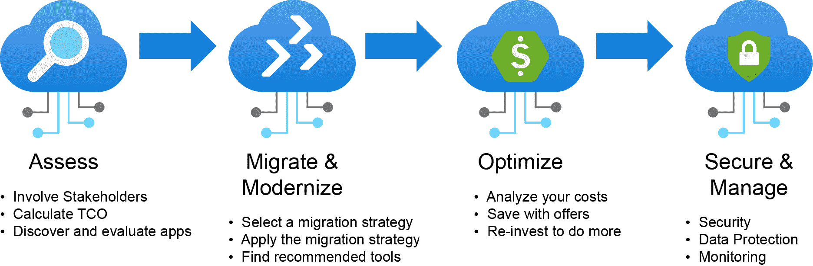

图 3.2: Linux 迁移路线图

如上图所示，我们将从第一阶段开始我们的迁移之旅— *评估*。

## 项目前期准备

所有项目都应该从适当的规划开始，这同样适用于云迁移。此时，我们已经收集了所有必要的技术信息，但是我们如何知道我们需要什么样的项目团队？让我们仔细看看。

### 确定相关角色和职责

通常，内部应用的职责被分配给不同团队中的许多内部利益相关者，有时甚至是不同的部门或公司。

例如，任何业务应用的典型生产环境都需要几个不同的角色才能运行:

*   硬件管理员
*   虚拟化管理员
*   存储管理员
*   网络管理员
*   Linux 管理员
*   数据库管理员
*   备份管理员

当您添加内部和外部用户时，列表会增长:

*   身份管理管理员
*   连接管理员
*   应用所有者
*   企业主
*   应用用户

现在，让我们假设您计划将该系统迁移到 Azure:为了确保该应用的业务用户所承担的工作不被中断，您需要与这些人中的哪一个交谈？让我们来看看一些关键角色，以及为什么它们在云迁移项目中非常重要。

### 网络管理员

与分布在全球各地的应用和用户相比，仅在一个数据中心运行并为单个国家的用户提供服务的应用很容易迁移到云中。

举个例子(参考*图 3.3* )公司在两大洲四个国家有四个办事处。巴黎和伦敦的欧洲团队使用伦敦的数据中心，新加坡和曼谷的团队使用新加坡的数据中心:

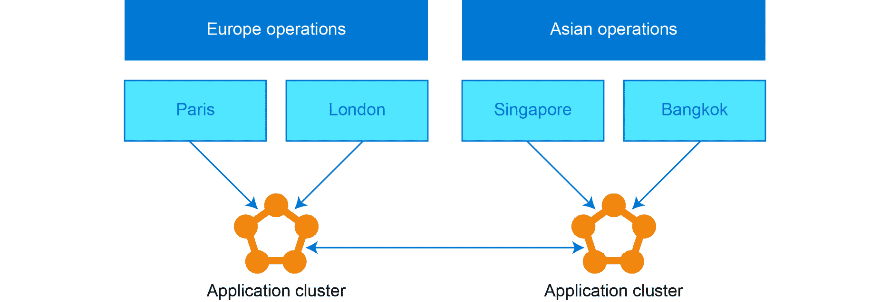

图 3.3:两大洲的集群应用

这个场景给整个架构增加了一个明显的复杂性方面:**全球网络连接**。从项目规划的角度来看，这意味着您需要在项目涉及的角色列表中添加至少一家国际网络提供商公司。

通常情况下，这种网络结构可以迁移到云中，而不会有任何显著的变化，但是有一类特殊的应用需要大量的规划:金融应用。传统上，金融行业依赖于专用的互联网连接和系统中的私有链接。这本身不是一个问题，因为 Azure 有各种各样的虚拟专用网络和其他私有连接选项。这里棘手的部分是在金融部门使用的许多交易应用中使用**多播**协议。另一个经常使用**组播**协议的行业是医疗保健，尤其是医院。

#### 注意

如果你想了解更多企业环境下组播的用例，可以看看*思科出版社*:[https://www.ciscopress.com/articles/article.asp?p=2928192&seqNum = 5](https://www.ciscopress.com/articles/article.asp?p=2928192&seqNum=5)出版的书*组播设计解决方案*。

本节中值得一提的是，公共云不支持多播网络。这使得将依赖多播路由的应用直接迁移到 Azure 变得非常困难。幸运的是，有一些方法可以解决这个问题，例如，使用多播到单播网关，但是这种方法将需要重新设计您的网络设计和可能的应用。

另一个需要仔细规划的网络细节是虚拟专用网络和快速路由连接。请记住，不能保证您可以轻松地将连接从当前位置移动到公共云。由于这些现有的连接可能由第三方公司拥有或运营，因此您需要确保让它们参与您的网络规划会议。

这里需要理解的一点是，网络之类的事情听起来可能简单明了，但它是公共云迁移中最困难的技术领域之一，不仅从技术角度来看，而且从人员配备和规划角度来看，因为涉及到如此多的利益相关方。

如果您可以在您的迁移团队中只添加一名网络人员，请选择具有与电信提供商和传统网络技术合作经验的人员。这个人将比任何云网络专家都更有价值。

现在让我们进入下一个关键角色。

### Linux 管理员

在前面的章节中，我们讨论了 Linux 订阅管理的业务方面。它还有一些技术细节需要在计划迁移到公共云时考虑。其中一个细节是更新管理:在 Azure 上使用 Linux 时，您将从哪里获得安全补丁和软件包更新？

您的 Linux 管理员是这里的关键人物，因为他们已经知道各种包管理器和订阅系统在当前系统中是如何工作的。通过一些培训，他们很容易理解在将系统迁移到 Azure 时需要实现什么样的更改。

在您的迁移项目团队中有一个 Linux 管理员听起来很明显吗？在现实生活中，我们见过这样的迁移项目，项目经理认为这是不必要的，并让一名 Windows 管理员试图弄清楚如何将 Linux 迁移到 Azure。你可能会猜测那些项目是否成功。

在本文中，我们所说的 Linux 管理员是指了解文件系统、磁盘性能、SELinux 和订阅管理(如果您使用的是商业 Linux 发行版)的人。

幸运的是，您计划迁移的系统得到了很好的维护，所有安全补丁和更新都得到了应用，并且一切都得到了很好的记录。然而在现实生活中，情况很少如此。团队中有一个在使用各种 Linux 服务和应用堆栈方面有丰富经验的人真的很有帮助，因为他们经常可以找到您的文档中缺少的信息。

让我们举一个 RHEL 服务器关闭 SELinux 的例子。您的应用文档没有提到任何关于 SELinux 的内容，您的安全团队表示，在公共云中，您需要启用 SELinux，否则他们不会批准迁移。可能会出什么问题？一切，尤其是如果安全团队在 SELinux 中打开**强制模式**而没有首先检查应用的行为。

我们建议您熟悉与您计划迁移到 Azure 的系统相关的所有角色和角色，并按照这里介绍的模式仔细调查，以找出您需要让谁参与到您的项目团队中。

### 云治理和运营

微软开发了一个 CAF，一套文档、实施指南、最佳实践和工具来帮助客户以最佳方式开始使用 Azure。

#### 注意

CAF 在[https://docs.microsoft.com/azure/cloud-adoption-framework/](https://docs.microsoft.com/azure/cloud-adoption-framework/)对所有人免费开放。

在了解云迁移时，CAF 中的几个部分非常重要。例如，*着陆区*是一个你应该非常熟悉的前进术语。在 Azure 中，着陆区意味着一组预先设计的体系结构或服务，您可以在其中部署新的或迁移的资源，例如虚拟机。软件开发领域的一个类比是**最小可行产品** ( **MVP** )。

#### 注意

点击此处阅读更多关于 Azure 登陆区的信息:[https://docs . Microsoft . com/Azure/cloud-采用-框架/ready/登陆区/](https://docs.microsoft.com/azure/cloud-adoption-framework/ready/landing-zone/) 。

此时值得一提的另一个非常重要的话题是云运营，或者说 **CloudOps** 。在大多数情况下，开发软件解决方案的团队将不是部署解决方案后运营云基础架构(或着陆区)的团队。通常，云运营由公司的信息技术部门管理，或者这项工作外包给专业的云管理服务提供商。

你能做的最糟糕的事情是，在应用部署后，没有人来照顾它或它正在使用的基础设施。有人需要监控应用和基础架构的性能，对系统警报做出反应，确保应用了安全补丁，并且很有可能时不时地运行成本优化流程。

微软 CAF 还涵盖了这些云管理方面，不仅从技术角度，而且从组织和业务协调角度。点击这里阅读更多关于 CAF 中云管理的内容:[https://docs . Microsoft . com/azure/cloud-采用-框架/manage/](https://docs.microsoft.com/azure/cloud-adoption-framework/manage/) 。

为了应用到目前为止我们所学到的与发现和评估相关的所有理论，让我们通过一个实践评估实验室。在本实验中，您将看到如何在 Azure 中发现和评估 Hyper-V 虚拟机。

## 迁移评估

通过了解您当前的基础架构，迁移之旅仍在继续。评估是迁移的第一步，在此阶段，我们将创建一个来源清单。当我们说*来源*时，这不一定总是在内部。也可能是其他云供应商或平台。Azure 中提供的评估工具可用于评估 AWS、GCP、虚拟化平台和内部物理服务器中的基础架构。我们需要执行评估的原因是，我们需要确保迁移后工作负载的迁移情况。

评估包括四个步骤和一套工具。让我们继续学习这些步骤。

### 准备云迁移计划

正如本杰明·富兰克林所说:“没有做好准备，你就是在准备失败。”乍一看，移民似乎并不复杂；然而，如果我们在没有计划和没有适当策略的情况下开始，那么迁移将会失败。失败的迁移将完全浪费时间、精力和生产力。你应该从设定目标和优先事项开始你的计划。不是每次迁移都一蹴而就；这将分阶段进行。通常，属于同一解决方案的服务器会一起迁移，而不是随机迁移服务器。假设您的环境中有注册应用、工资单应用、票务应用等。在这种情况下，您需要设置一些优先级和项目截止日期，因为在工资单应用中是优先级，应该在 Q1 结束之前处理。这种方法确保您一步一个脚印，遵循一个原则，从而确保成功的迁移。

一般的经验法则是优先考虑依赖较少的应用；这将成为迁移的催化剂。一旦完成了这些，您就可以专注于具有大量依赖关系的应用。移动这些将会给你更多的时间去关注，因为其他的应用已经被提前迁移了。这也将确保你的时间得到更好的利用。如果您从具有大量依赖关系的应用开始，您可能需要更长的时间来优化和规划它们。这将意味着其他工作负载的截止日期将进一步延长。因此，最好先完成简单的，然后再处理复杂的。

下一步是*发现和评估*这是进行全面评估的地方。

### 发现和评价

既然我们心中有了计划，我们需要开始对环境进行全面评估。这些步骤的结果是确定迁移范围内的服务器、应用和服务。

接下来，我们将生成迁移范围内的服务器和服务的完整清单和依赖关系图。清单和映射帮助我们理解这些依赖服务是如何相互交流的。强烈建议您彻底调查每个应用及其依赖关系。未能评估或说明依赖关系之一将导致迁移后的重大问题。

您的某些应用可能不适合提升和转移迁移，因此您还需要考虑其他选项。对于每个应用，您需要评估以下迁移选项:

*   **Rehost** :这就是我们通常所说的“升降档”基本上，您正在 Azure 中重新创建您的基础架构。这需要对应用进行最小的更改，因此影响最小。例如，将虚拟机复制到云中，然后使用复制的磁盘在 Azure 中重新创建它们。
*   **重构**:当您将一个 IaaS 服务器移动到一个 PaaS 解决方案时，例如，从虚拟机移动到一个 PaaS 解决方案，如 Azure 应用服务，这就完成了。正如我们已经知道的，转向 PaaS 解决方案减少了管理任务，同时有助于保持低成本。
*   **重新架构**:在某些场景下，您可能需要重新架构一些系统，以便它们能够成功迁移。这种架构的实现主要是为了使系统成为云原生的，或者利用较新的路径，如容器化和微服务。
*   **重新构建**:如果重新构建应用所需的成本、时间和人力超过从头开始，那么您可以重新构建应用。这种方法帮助软件开发团队开发能够充分利用云的应用。
*   **替换**:有时候，当你回顾重建或者重新构建解决方案的整体支出，可能会比购买第三方软件的支出更高。假设您有自己的客户关系管理解决方案，重新构建或重建的成本高于为类似的 SaaS 产品(如 Dynamics 365)购买许可证。

一旦我们发现了整个基础设施，下一步就是让关键的利益相关者参与进来。

### 让关键利益相关方参与进来

在发现阶段，我们将对基础架构有一个完整的了解；然而，应用的所有者和超级用户也将对应用的架构有一个完整的了解。我们在本章前面提到的这些所有者和其他关键利益相关者将能够分享关于应用架构的宝贵建议和信息，在迁移的早期阶段纳入这些建议将提高成功迁移的概率。

在填补知识空白时，最好让信息技术和业务负责人参与进来。此外，这些人将有助于提供任何关于应用架构的指导。

谈到迁移，首席执行官、首席技术官和首席信息官等 CxO 利益相关方将始终有兴趣了解这些数字，因为如果我们从内部迁移到 Azure，可能会节省多少成本。让我们看看如何估算成本。

### 估算节约

许多组织采用迁移途径来节省基础架构成本。云的敏捷性和可扩展性是这里的主要驱动因素。例如，如果您购买了一台新服务器，而这台服务器没有得到预期的利用，那么这就构成了公司的损失。然而，在云中，情况就不同了；如果不需要，可以在几秒钟内取消分配服务器。一旦解除分配，您就不必担心服务器，并且不再为它付费。

在迁移到云之前，所有组织都会进行计算，并验证他们是否从此次迁移中获得了任何利润或节约。完成初步范围界定后，您可以使用 Azure **总拥有成本** ( **TCO** )计算器来估算内部运行工作负载与 Azure 的成本。

从评估到节约计算，这一过程涉及不同的工具。让我们确定评估阶段可用的工具。

### 识别工具

工具在迁移评估中起着至关重要的作用。如果没有工具，访问您内部的每台服务器并创建清单将是一项麻烦的任务。因此，工具提高了生产率并加速了迁移。*表 3.1* 显示了在评估阶段可以利用的工具列表:

表 3.1:评估工具

上述是评估阶段使用的工具。同样，在采用计划的每个阶段(**迁移**、**优化**、**保护&管理**)都会用到其他工具。一旦我们到达这些阶段，您将熟悉每个阶段使用的工具。

还有其他第三方工具可用于执行评估。这些在 Azure Migrate 中可用，可以在项目创建期间选择。

现在我们已经熟悉了评估阶段的步骤，让我们试着更多地了解这些工具及其用法。

## 评估工具

正如前面的*识别工具*部分所解释的，这些工具扮演的不可避免的角色使得评估、映射和节约计算变得更加容易。现在我们将评估这些工具中的每一个，看看它们是如何使用的，以及用例场景是什么。我们将从 Azure Migrate 开始。

### 天青迁徙

Azure Migrate 的目的已经从*表 3.1* 中显而易见。在 Azure Migrate 的帮助下，我们可以运行环境发现，而无需在服务器上安装任何代理。如果我们安装代理，我们还可以执行依赖分析，这可以用来生成服务映射。评估最棒的部分是所有这些都在本地集成到 Azure 门户中，并且您不必依赖任何其他门户。

评估完成后，Azure Migrate 会生成一份评估报告，其中包含您需要调配的虚拟机的估计成本、建议和大小，以匹配您的内部配置。Azure Migrate 可以发现和评估部署在 Hyper-V 和 VMWare 虚拟化环境中的虚拟机以及物理机，同时将列表扩展到其他云供应商。

要使用 Azure Migrate，我们需要在 Azure 门户中创建一个 Azure Migrate 项目。该项目将用于存储我们执行的评估。同样，当我们将工作负载迁移到 Azure 时，也可以使用相同的项目。由于我们处于迁移计划的评估阶段，本章将重点介绍项目中可用的评估工具。一旦我们到达*第 4 章*、*中的迁移阶段，执行到 Azure* 的迁移，我们将讨论 Azure Migrate 项目中的迁移工具。

现在让我们熟悉下一个工具*服务图*。

### 服务地图

服务地图是另一个很好的工具，它是 Azure Monitor 的一部分，用于为我们执行依赖性分析的服务器评估。利用依赖性分析有几个优点，这可以提高整体迁移信心和成功率。一些优点如下:

如果您有大量服务器要迁移，您可以根据解决方案对它们进行分组，因为我们知道哪些服务器承载哪些依赖项:

*   它有助于在解决方案中确定合适的机器，并将它们一起迁移。
*   它有助于理解环境的拓扑结构。

确保您迁移了所有内容，并且没有服务器因为人为错误或疏忽而被排除在迁移之外。依赖性分析有两种类型:

*   无药剂分析
*   基于代理的分析

让我们仔细看看这些。

### 无药剂分析

顾名思义，虚拟机上没有安装代理来执行依赖性分析。发现或分析是通过使用从机器捕获的 TCP 连接数据来完成的。但是，这里需要注意的一点是，在撰写本书时，无代理分析处于预览阶段，仅适用于 VMWare 虚拟机。数据轮询和收集是在 vSphere APIs 的帮助下完成的。

如果我们在我们的 Linux 或 Windows 计算机上运行 **netstat** 命令，我们将能够看到从我们的计算机建立的所有网络连接的连接、连接状态、来源、目的地和端口。如前所述，这些 TCP 指标用于服务器的逻辑分组。

对它们进行分组后，您可以可视化服务图以了解依赖关系，或者将其导出为 CSV 文件以供参考。评估工具包括一个 Azure Migrate 应用装置，这是一个需要在您的环境中部署以进行发现的虚拟机。该设备将不断收集数据，并将其推送到 Azure 进行评估。

### 基于代理的分析

顾名思义，在基于代理的分析中，我们需要一个代理来执行依赖性分析。这种分析方法利用了 Azure Monitor 的服务地图功能。我们需要安装**微软监控代理** ( **MMA** ，本质上是针对 Windows 机器，或者 OMS 代理(在 Linux 机器的情况下)，以及依赖代理。这些代理发送的数据将用于创建服务地图。

我们需要一个日志分析工作区来接收这些代理推送的日志和数据。这里需要注意的一点是，工作区应该部署在支持服务地图的区域。

与无代理分析不同，由于我们已经将数据摄取到工作空间中，因此我们可以使用 **Kusto 查询语言** ( **KQL** )来分析这些数据。

当我们在本章的最后继续进行实践练习时，我们将看到这些代理是如何安装的，以及它们是如何用于依赖性分析的。在具有复杂体系结构的应用中，依赖性分析非常有用。接下来，我们将讨论 Azure TCO 计算器。

### Azure 总拥有成本计算器

**总拥有成本** ( **TCO** )是每个希望开始采用云的组织都应该考虑的问题。**投资回报** ( **投资回报**)使用总体拥有成本进行评估，Azure 总体拥有成本计算器有助于计算迁移到 Azure 的估计成本，并预测与当前成本相比您可能节省的成本。

建议您在迁移到云之前进行总体拥有成本计算，在估算总拥有成本时，您应该考虑一些费用。这些费用包括:

*   **迁移费用**:迁移费用昂贵，需要最大程度的关注。迁移失败会导致潜在的损失。因此，您应该在总体拥有成本中考虑资源、技术人员和为迁移而采购的其他硬件方面的成本。
*   **基础设施成本**:您需要保持您的内部基础设施正常运行，直到迁移完成。在迁移的某个阶段，您将为云中的资源以及内部数据中心付费。只有在迁移完成后，转换才会发生。
*   **风险因素**:迁移不是一个简单的任务，这里面总有风险。如果您的应用没有针对云进行优化，或者在迁移到云之前没有正确评估您的应用，这可能会导致潜在的故障。示例包括与内部应用相比的功能和性能问题。资源一旦部署在云端，你就要收费；如果出现问题，您应该有预算回滚更改并执行故障切换回您的内部应用。由于这是一个经过计算的风险，我们应该将其包括在我们的总体拥有成本中。

通过导航到以下链接，可以从任何浏览器访问 Azure TCO 计算器:[https://azure.microsoft.com/pricing/tco/calculator/](https://azure.microsoft.com/pricing/tco/calculator/)。

总拥有成本计算包括三个步骤，从定义您的工作负载开始。在第一步中，您将输入内部工作负载的详细信息，并将其与云成本进行对比，以了解节省的成本。这些工作负载分为服务器、数据库、存储和网络组件。对于每个类别，都有一组您需要传递给总体拥有成本计算器的信息。以服务器为例，系统会要求我们输入操作系统类型、操作系统、许可证、处理器、内核和内存，如图*图 3.4* :

图 3.4:定义服务器工作负载

定义工作负载后，您将进入调整假设步骤。在这里，我们将分享关于您是否已经拥有这些机器的许可证的详细信息，然后是存储成本、IT 人工成本、电力成本等。您需要根据您的内部数据调整这些假设。

一旦您陈述了假设，总拥有成本计算器将根据您共享的数据给出潜在的节约。例如，在这里，基于工作负载和假设，我们预计在 1 年内节约成本 18，472 美元。*图 3.5* 显示了总拥有成本计算器的输出示例:

图 3.5:使用 Azure 总体拥有成本计算器计算的节约

总体拥有成本计算器中还有其他图表(按类别细分)，最棒的是，您可以下载此报告，并与利益相关方共享以供审查。

至此，我们已经涵盖了在*表 3.1* 中所示的**评估**阶段使用的主要工具。如前所述，在采用计划的其他阶段还使用了其他工具。我们将在*第 4 章*、*中介绍**迁移&实现**阶段向 Azure* 执行迁移，在*第 5 章*、*在 Azure 上运行 Linux*中介绍**优化**和**安全&管理**阶段。

既然我们已经收集了应用和基础架构的所有必要细节，我们就可以创建迁移项目计划了。

## 实践评估实验室

到目前为止，我们已经讨论了不同的规划策略和评估方法。在本实验中，我们将评估运行在 Hyper-V 环境中的服务器。下面是我们将要评估的环境架构:

图 3.6:评估环境

在*图 3.6* 中，我们可以有一个 Hyper-V 主机，上面部署了两个虚拟机。一个虚拟机(VM - 01)运行 Ubuntu，并在其上设置了 LAMP 服务器。第二个虚拟机(VM - 02)是使用 Apache 网络服务器运行静态网站的 CentOS 虚拟机。

我们的目标是评估这个环境，并创建一个评估报告以及一个依赖性分析。

正如前面在*评估工具*部分提到的，我们需要创建一个 Azure Migrate 项目来启动评估过程。

### 先决条件

本实验的一些先决条件如下:

*   您至少应该拥有 Azure 订阅的投稿人权限。
*   用户应该有权限注册 Azure 广告应用，否则应该在 Azure 广告中拥有应用开发人员角色。

### 设置 Azure 迁移项目

使用 Azure Migrate 的第一步从创建 Azure Migrate 项目开始。该服务用于存储在评估和迁移阶段捕获的元数据。Azure 迁移项目提供了一个集中的平台来记录您对 Azure 的所有评估和迁移。让我们导航到 Azure 门户并创建一个 Azure 迁移项目:

1.  To create an Azure Migrate project, navigate to All services in the Azure portal and search for Azure Migrate, as shown in *Figure 3.7*:

    

    图 3.7:搜索 Azure 迁移

    进入 Azure Migrate 刀片后，您将看到服务器、数据库等不同的迁移选项。

2.  Since we are assessing servers, you need to choose Assess and migrate servers or you can click on Servers from the Azure Migrate blade, as shown in *Figure 3.8*:

    

    图 3.8:启动 Azure 迁移项目

3.  In the next window, you will get the Create project option and, once selected, you need to input basic details such as Subscription, Resource group, Migrate project, and Geography, as shown in *Figure 3.9*:

    

    图 3.9:创建 Azure 迁移项目

4.  Once the project is created, we will be presented with the Assessment tools and Migration tools options for servers. Since we are currently in the Assess phase, we will explore Assessment tools, as shown in *Figure 3.10*:

    

    图 3.10:服务器评估工具

5.  The next step is to initiate the discovery of servers in our Hyper-V environment so that we can create the assessment. We will be using the Discover option shown in *Figure 3.10* to start the discovery process.

    现在，我们必须选择当前部署服务器的平台。您可以选择 VMWare 虚拟化虚拟机管理程序、Hyper-V 和物理或其他(AWS、GCP 等)。由于我们的虚拟机部署在 Hyper-V 上，我们选择这个选项，如图*图 3.11* 所示。

    要针对我们的内部基础架构运行发现，我们需要在内部环境中部署一个新的虚拟机。该虚拟机称为 Azure Migrate 设备，它将发现服务器并将该信息发送给 Azure Migrate。

6.  We need to give a name to the migrate appliance and generate a key, as shown in *Figure 3.11*. This key is later used to set up the migrate appliance on our Hyper-V host. You need to copy this key and keep this handy:

    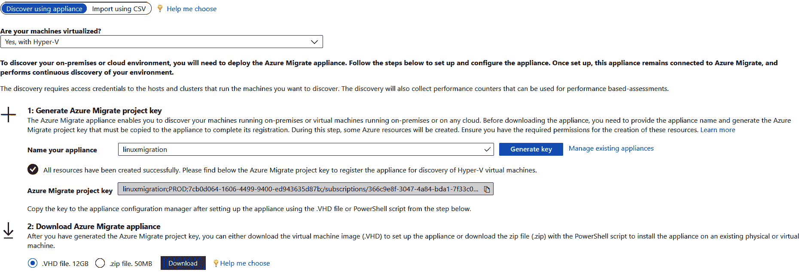

图 3.11:生成 Azure 迁移项目密钥

创建密钥后，我们需要下载 Azure Migrate 设备。基本上有两种部署家电的方式，如图*图 3.11* 所示。

您可以下载 VHD 文件并将其部署为 Hyper-V 环境中的新虚拟机，也可以下载包含 PowerShell 脚本的 zip 文件，该脚本可以将现有虚拟机转换为 Azure Migrate 应用装置。如果您更喜欢使用现有服务器作为迁移设备，微软建议使用至少 8vCPUs 和 16 GB 内存的 Windows Server 2016。

在本实验中，我们将把 VHD 直接下载到我们的 Hyper-V 主机上，并创建一个新的虚拟机。使用 VHD 文件，我们需要使用以下步骤在 Hyper-V 服务器中创建新虚拟机:

1.  打开右侧的 Hyper-V 管理器。从操作中，选择导入虚拟机。
2.  您将看到带有一组说明的“开始前”页面。单击下一步。
3.  使用定位文件夹，浏览提取 VHD 的文件夹，然后点击下一步。
4.  选择虚拟机，然后单击下一步。
5.  选择拷贝虚拟机(创建新的唯一标识)作为导入类型，然后点击下一步。
6.  将目标和存储保留为默认设置，然后单击下一步。
7.  选择虚拟机将用于连接网络的适当虚拟交换机，然后单击下一步。
8.  最后，在“摘要”页面中，查看我们选择的配置，然后单击“完成”启动虚拟机导入。
9.  一段时间后，您将能够在 Hyper-V 管理器中看到新虚拟机。

我们现在已经在环境中部署了虚拟机。现在，是时候开始发现并将信息发送到 Azure Migrate 项目了。让我们设置设备，将数据推送到 Azure。

### 设置和注册 Azure 迁移设备

虚拟机已部署到 Hyper-V 环境中，现在必须对其进行配置并连接到我们的 Azure 迁移项目。我们需要提供 Windows 服务器的密码，之后，我们需要像登录任何 Windows 服务器一样登录。

您可以通过转到**https://设备名称**或 **IP 地址:44368** 来连接到迁移设备。如果在桌面上打开边缘浏览器，您将被重定向到设备配置管理器页面。下一步是向项目注册设备，如以下步骤所示:

1.  我们必须同意开始使用 Azure Migrate 设备的条款和条件。
2.  The prerequisite check will be done automatically and if there is any new update, the system will install it automatically, as shown in *Figure 3.12*:

    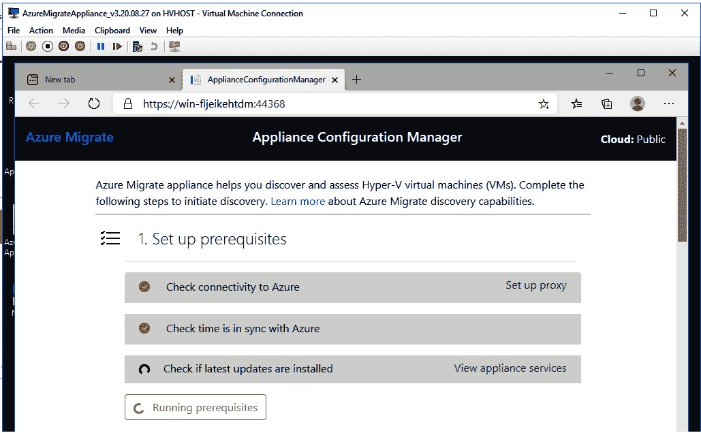

    图 3.12:迁移设备中的先决条件检查

3.  The next step is to input the Migrate appliance key, which we generated from the Azure portal when we initiated the Discover process (*Figure 3.11*).

    需要将密钥输入文本框，以便系统验证密钥并注册设备。验证完成后，将提示您输入设备代码以登录 Azure。我们需要使用 Copy code & Login 向 Azure 进行身份验证，如图*图 3.13* :

    

    图 3.13:注册 Azure 迁移设备

4.  In the new tab, you can sign in using the credentials that you use to sign into the Azure portal, and if the authentication is successful, you will be asked to close the newly opened tab. Also, as shown in *Figure 3.14*, you will be able to confirm from the Azure Migrate appliance screen whether the appliance was successful:

    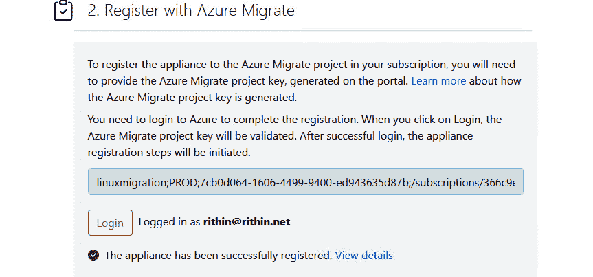

    图 3.14:成功注册

5.  The next step is to provide the credentials for the Hyper-V cluster to the Azure Migrate appliance so that it can run Discovery. You can use Add credentials and enter the credentials for your Hyper-V host as shown in *Figure 3.15* and save it:

    

    图 3.15:添加 Hyper-V 凭据

6.  Since we have stored the credentials, we will be using the credentials to connect to our Hyper-V host. You can add multiple Hyper-V clusters in a single shot, or you can import the list as a CSV. In our case, we have a single server, and we need to provide the IP address for the server and select the credentials created in *Step 5*, as shown in *Figure 3.16*:

    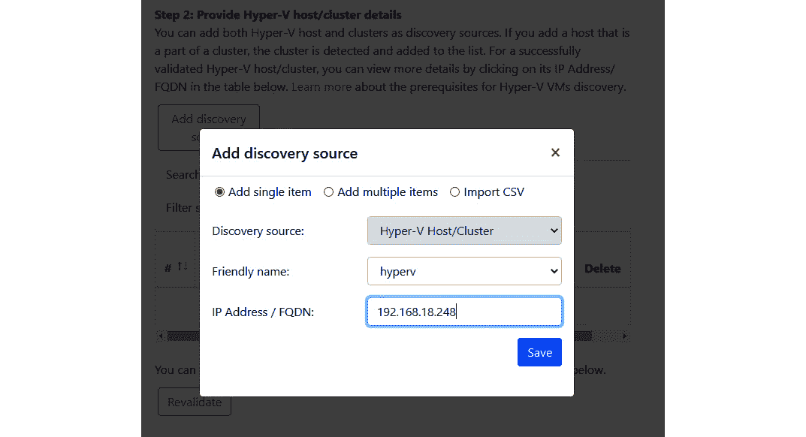

    图 3.16:添加 Hyper-V 群集详细信息

7.  The Migrate appliance will use the credentials against the IP address we have entered to perform validation. If the credentials are correct, you will be able to see the successful message, as shown in *Figure 3.17*:

    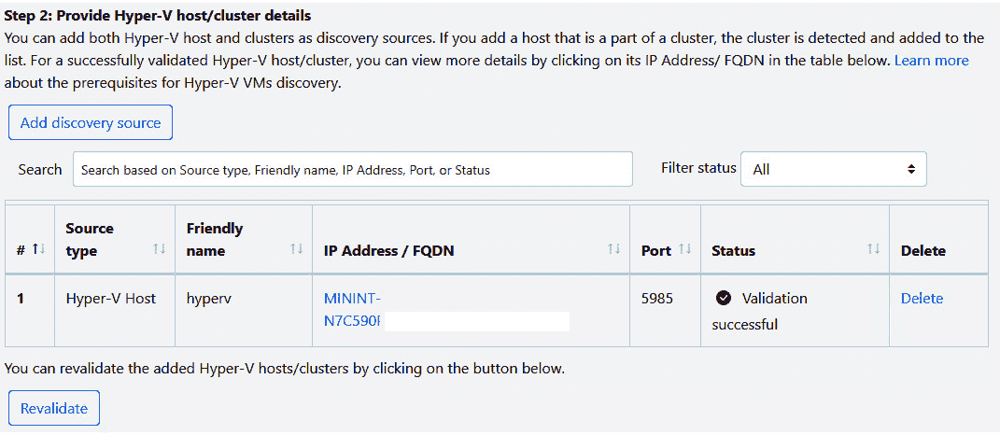

    图 3.17:成功连接到主机

8.  Now that we have completed the configuration of the appliance, we can start the discovery using the Start Discovery option. The discovery process may take some time and the discovered number will be reflected on the Azure portal.

    #### 注意

    由于设备使用 FQDN 进行连接，如果 DNS 无法解析主机名称，您将无法发现任何虚拟机，重新验证将会失败。解决方法是修改主机文件并添加 FQDN 和 IP 地址。

我们流程的下一步是从 Azure 门户验证发现是否成功，设备是否能够发现所有虚拟机。在下一节中，我们将看到如何从门户验证发现。

### 验证门户中发现的虚拟机

发现过程完成后，您将能够看到来自迁移设备的确认。现在，是时候检查门户了，看看设备是否能够将信息推送到我们的 Azure Migrate 项目中。您可以使用这里提到的步骤进行验证:

1.  打开 Azure 迁移仪表板。
2.  在“Azure 迁移|服务器| Azure 迁移:服务器评估”页面中，单击显示已发现服务器计数的图标。

在*图 3.18* 中，可以看到发现成功，Azure 门户表示发现了三个虚拟机:

图 3.18:验证发现的服务器

在这里，我们看到三个虚拟机，因为发现过程也包括迁移应用装置。下一个过程是在发现的服务器上运行评估，这可以通过单击发现旁边的评估选项来完成。

### 运行评估

如*迁移评估*部分所述，该评估将创建您的内部服务器清单。按照以下步骤进行评估:

1.  Select the Assess option from Azure Migrate: Server Assessment, as shown in *Figure 3.19*:

    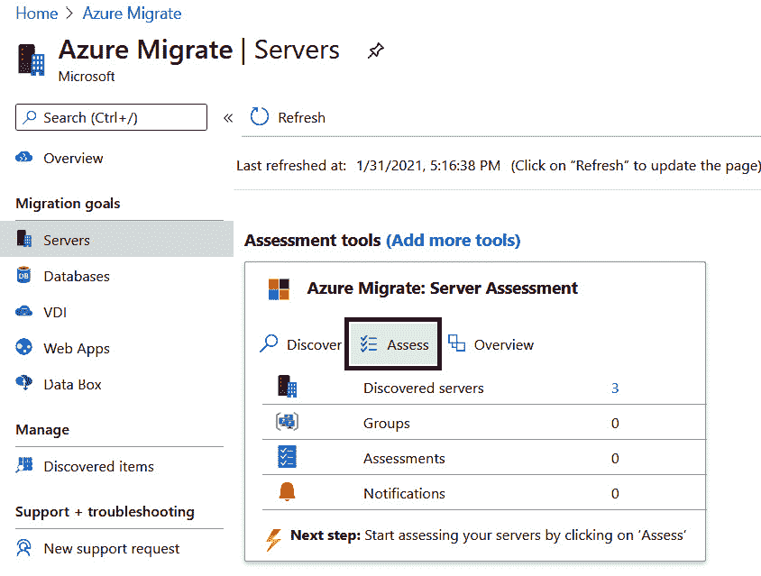

    图 3.19:开始评估

2.  In Assess servers | Assessment Type, select the type as **Azure VM** and, in Discovery source, select **Machines discovered from Azure Migrate appliance**. You also have the option to upload your inventory as a CSV file and perform an assessment on that. The Assessment properties section will be populated automatically, and you can edit them using the Edit button if required, as shown in *Figure 3.20*:

    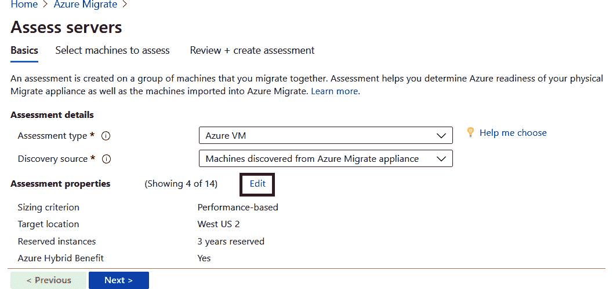

    图 3.20:设置基础

3.  In the Assessment properties edit window, you will have the option to customize TARGET PROPERTIES, VM SIZE, and PRICING. These factors are used to run the assessment and generate the report. Also, you can include the Azure Hybrid Benefit in your calculation to exclude the license cost if you already have licenses purchased. You can update each of these factors as per your requirements. A sample configuration has been shown in *Figure 3.21*:

    

    图 3.21:评估属性

4.  Next, you can provide a name for your assessment and a name for the group of servers. Grouping helps you to assess a set of servers together. Finally, we will select the servers that need to be assigned and add them to the group, as shown in *Figure 3.22*:

    

    图 3.22:选择要评估的服务器

5.  最后一步是创建评估，这将创建组并在分组的服务器上运行评估。

如果您刷新评估工具，您可以看到组和评估的值为 1，如*图 3.23* 所示:

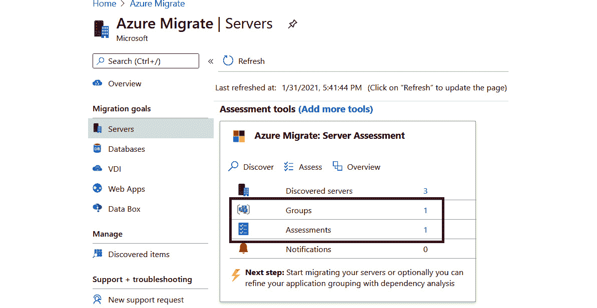

图 3.23:验证来自 Azure 门户的评估

#### 注意

如果数据不可见，尝试使用**刷新**按钮，等待系统刷新。

现在我们有了评估，是时候回顾一下了。

### 审核评估

评估主要涉及三个主要因素:

*   **Azure 就绪**:发现的机器是否适合在 Azure 上运行——换句话说，它们是否为 Azure 做好了准备？
*   **月成本估算**:提供这些虚拟机迁移后在 Azure 上运行所需的估算成本。还提供了计算成本和存储成本的成本细分。
*   **存储-每月成本估算**:迁移后的预计磁盘存储成本。

以下是查看评估所涉及的步骤:

1.  在服务器| Azure Migrate:服务器评估中，点击*图 3.23* 中可见的评估旁边的数字。
2.  In Assessments, select an assessment to open it. You will be able to see the assessment report as shown in *Figure 3.24*:

    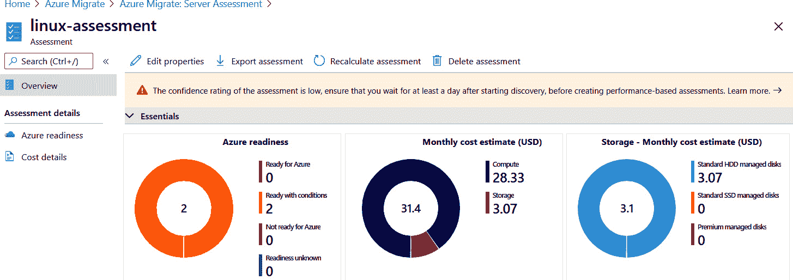

    图 3.24:评审评估

3.  如果您想基于另一个目标区域或任何其他属性重新计算，您可以编辑属性(使用编辑属性选项，如图 3.24*)并重新运行评估。*

 *在这里，我们只发现了虚拟机；然而，我们还没有进行依赖性分析。此评估报告可以导出到 Excel 表中，您可以与利益相关者共享。

在下一节中，我们将看到如何使用代理在 Azure Migrate 中设置依赖性分析。

### 依赖性分析

依赖关系分析仅支持 VMWare 虚拟机和 Hyper-V 虚拟机。从其他平台(如 Xen)甚至从其他云提供商(如 AWS 和 GCP)发现的虚拟机不支持依赖性分析。

如*服务图*部分所述，我们只能在 Hyper V 环境下运行基于代理的依赖分析。对于 VMWare 虚拟机，它支持无代理和基于代理的依赖性分析。

首先，我们需要将日志分析工作区与我们的 Azure Migrate 项目相关联。可以执行以下步骤将工作区与 Azure Migrate 关联:服务器评估:

1.  找到要评估的计算机后，在服务器| Azure 迁移:服务器评估中，单击概述。
2.  在 Azure 迁移:服务器评估中，单击基本。
3.  In OMS Workspace, click Requires configuration, as shown in *Figure 3.25*:

    

    图 3.25:设置 OMS 配置

4.  选择“需要配置”后，如图 3.25 所示，系统会提示您创建一个新的日志分析工作区，或者在您的 Azure 订阅中关联一个现有的工作区。
5.  If you do not have an existing workspace, create a new one as shown in *Figure 3.26*:

    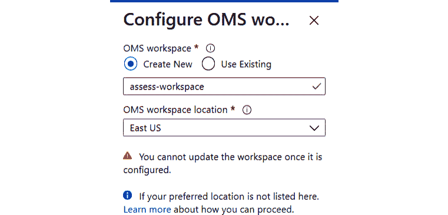

    图 3.26:创建日志分析工作区

6.  下一步是下载并安装依赖关系可视化代理。为此，我们需要导航到发现的服务器，并检查依赖项(基于代理)列。有时，此列将被隐藏，您可以使用“列”选项启用它。
7.  We will select Requires agent installation against our discovered VM, as shown in *Figure 3.27*, to install the agents. For ease of demonstration, let's install the agents on the LAMP server:

    

    图 3.27:选择代理安装

8.  The portal will give you the steps to install the agents on both Windows and Linux servers. We are interested in the Linux servers, and so will follow that process. Also, we need to make a note of Workspace ID and Workspace key, shown in *Figure 3.28*. This is required in order to configure the agent:

    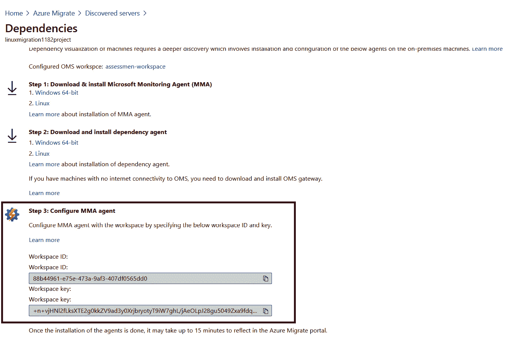

    图 3.28:工作空间信息

9.  您可以使用 **wget** 命令在 Linux 中下载它，或者使用 **SFTP/SCP** 将其下载到您的计算机并传输到 Linux 机器。让我们使用 **wget** 下载它，并在 Linux 服务器上配置代理。
10.  You can copy the link for the agents from the portal and pass that to **wget** to download the file, as shown in *Figure 3.29*:

    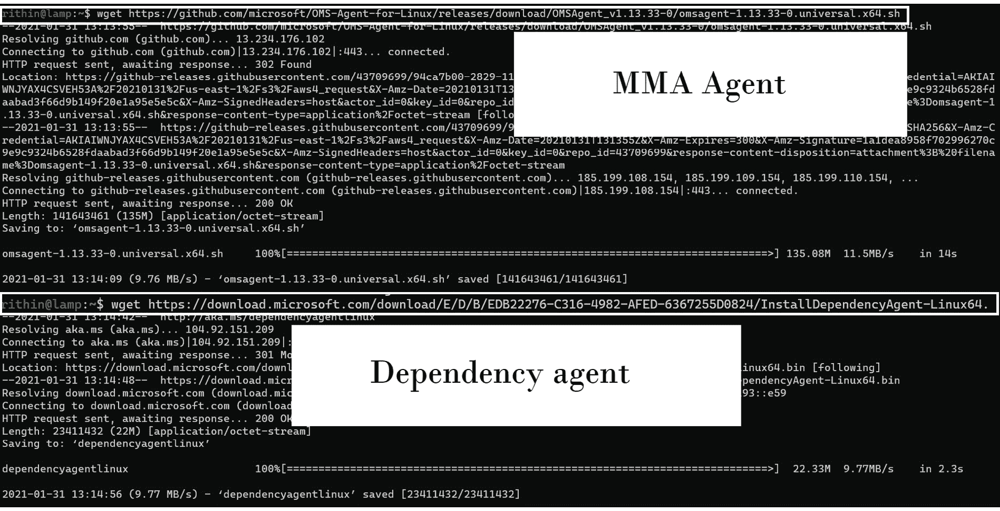

    图 3.29:下载代理

11.  The MMA agent can be installed using the following command:

    sudo wget https://raw . githubusercontent . com/Microsoft/OMS-Linux 代理/主/安装程序/脚本/板载 _ 代理. sh && sh 板载 _ 代理. sh -w <your workspace="" id="">-s</your>

    **工作区 id****工作区键**可从 Azure 门户获取，如图*图 3.28* 。在写这本书的时候，MMA 代理的最新版本是 **1.13.33-0** ，我们安装这个如图*图 3.30* :

    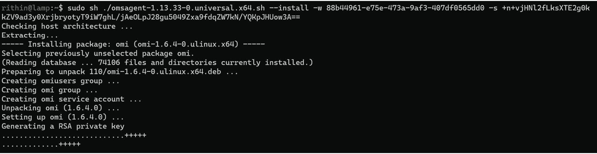

    图 3.30:安装 MMA 代理

12.  Now, we must download and install the dependency agent using the following commands:

    wget-content-disposition https://aka.ms/dependencyagentlinux-O InstallDependencyAgent-linux64 . bin

    sh install dependency-Linux64.bin-安装相依性-Linux 64 . bin

13.  一旦安装了依赖项代理，我们将能够从 Azure Migrate:服务器评估中看到依赖项。单击发现的服务器。在“依赖项”列中，单击“查看依赖项”以查看服务器的依赖项。预计加载依赖项需要一些时间。

您还可以对日志分析工作区运行 Kusto 查询，以检查连接并验证数据。

这样，我们成功评估了 Hyper-V 主机中部署的工作负载，并建立了依赖性分析。我们已经使用 Hyper-V 进行了演示。但是，在您的环境中，您可能正在使用 VMWare，因此*表 3.2* 显示了可用于评估其他环境的链接列表，以及 Hyper-V 的文档:

<colgroup><col> <col> <col></colgroup> 
| **平台** | **发现** | **评估** |
| --- | --- | --- |
| **超 V** | [https://docs . Microsoft . com/azure/migrate/tutorial-discover-hyper-v](https://docs.microsoft.com/azure/migrate/tutorial-discover-hyper-v) | [https://docs . Microsoft . com/azure/migrate/tutorial-assesse-hyper-v](https://docs.microsoft.com/azure/migrate/tutorial-assess-hyper-v) |
| **VMWare** | [https://docs . Microsoft . com/azure/migrate/tutorial-discover-VMware](https://docs.microsoft.com/azure/migrate/tutorial-discover-vmware) | [https://docs . Microsoft . com/azure/migrate/tutorial-assessment-VMware-azure-VM](https://docs.microsoft.com/azure/migrate/tutorial-assess-vmware-azure-vm) |
| **物理服务器** | [https://docs . Microsoft . com/azure/migrate/tutorial-discover-physical](https://docs.microsoft.com/azure/migrate/tutorial-discover-physical) | [https://docs . Microsoft . com/azure/migrate/tutorial-assessment-physical](https://docs.microsoft.com/azure/migrate/tutorial-assess-physical) |
| **AWS** | [https://docs . Microsoft . com/azure/migrate/tutorial-discover-AWS](https://docs.microsoft.com/azure/migrate/tutorial-discover-aws) | [https://docs . Microsoft . com/azure/migrate/tutorial-assessment-AWS](https://docs.microsoft.com/azure/migrate/tutorial-assess-aws) |
| **GCP** | [https://docs . Microsoft . com/azure/migrate/tutorial-discover-GCP](https://docs.microsoft.com/azure/migrate/tutorial-discover-gcp) | [https://docs . Microsoft . com/azure/migrate/tutorial-assessment-GCP](https://docs.microsoft.com/azure/migrate/tutorial-assess-gcp) |
| **输入 CSV** | 不适用的 | [https://docs . Microsoft . com/azure/migrate/tutorial-discover-import](https://docs.microsoft.com/azure/migrate/tutorial-discover-import) |

表 3.2:其他平台的评估文档

这个实践实验的基本原理是让您了解步骤并熟悉过程。在我们结束本章之前，让我们快速浏览一下到目前为止讨论过的主题的摘要。

## 总结

正如我们在本章中学到的，评估当前的体系结构和工作负载是迁移项目非常重要的一部分。为此，我们使用 Azure Migrate 创建了一份可靠的评估报告。我们还讨论了在 Azure 上计算成本节约的工具，并通过实验进行了迁移评估。

在本章中，我们还讨论了 Linux 上一些流行的工作负载，包括 LAMP 堆栈和数据库服务器。我们还介绍了高性能计算、集群、共享存储和 SAP 应用方面一些技术难度较大的场景。

在*项目前期准备*部分，也讲述了让合适的项目团队成员参与的重要性，因为这可以确保您拥有迁移项目所需的所有技能，包括网络和 Linux 管理。

下一章将重点介绍实际迁移，您将有机会在实践实验室中使用到目前为止所学的一切。*