# 4.执行向 Azure 的迁移

本章概述了如何基于上一章中完成的工作负载评估来执行真正的迁移项目。我们创建了两个实践实验室，向您展示如何实施实际迁移。

第一个动手实验为您提供了如何使用 Azure Migrate 将 Linux 服务器从 Hyper-V 主机迁移到 Azure 的实际示例。第二个实验将指导您使用 Azure **数据库迁移服务** ( **DMS** )将 MySQL 服务器迁移到 Azure。

在现实生活中执行迁移并不总是像听起来那么容易。幸运的是，我们看到的大多数问题实际上与技术无关，而更多的是关于规划和项目管理。如果你把这本书的经验运用到你的项目中，你将能够避免同样的陷阱。

例如，我们知道的一个特定的迁移项目最初计划花费几个月的时间，它有大约 500 台虚拟服务器要迁移到 Azure。这个项目比最初计划的要复杂一点。项目启动后，一些问题就开始了。负责迁移的团队严重低估了项目所需的资源和技能。最终，项目范围缩小了，外部云专家被邀请就项目中一些最困难的部分提供建议。毫不奇怪，其中一些部分与 Linux 补丁管理、订阅管理和安全性有关。你还记得我们在这本书的前面讨论过这些话题吗？现在你知道为什么了。

项目时间表得到了相当多的延长，项目时间比原计划长得多。在项目期间，客户还决定不迁移一些较旧的应用程序，而是决定开始开发这些应用程序的新云原生版本。从迁移项目的角度来看，这给项目调度带来了一些重大挑战。在前一章中，我们谈到了评估和高质量项目规划的重要性，这是有充分理由的。

为什么项目不成功？项目团队没有使用任何迁移评估工具，他们也缺少一个合适的迁移执行工具。此外，他们几乎没有管理此类项目的经验，而且他们也缺乏云迁移和一些要迁移的工作负载方面的专业知识。

即使成功迁移到 Azure 后，由于错误的配置或人为错误，也可能会出现意外问题。如果出现虚拟机启动问题、远程 SSH 访问不起作用等问题，您可以联系微软 Azure 支持。在*第 6 章*、*故障排除和问题解决*中，我们将更多地讨论可能出现的问题和故障排除场景，以及如何解决这些问题。

在本书中，我们已经多次提到了这一点，但既然这是如此重要的建议，让我们再说一遍:成功的迁移项目的一个关键要素是确保您的客户——无论是内部客户还是外部客户——致力于该项目。我们要重复的第二条建议是使用正确的工具来帮助您进行迁移。在前一章中，我们介绍了运行成功评估的 Azure Migrate，因此我们可以非常确定项目团队对要迁移的工作负载有正确的了解。

在本章中，我们将涵盖以下主题:

*   实践迁移实验室
    *   将服务器迁移到 Azure
    *   迁移数据库

到本章结束时，您将学会如何以正确的方式使用正确的工具。

## 动手迁移实验室

在*第 3 章*、*评估和迁移规划*的*实践评估实验室*部分，我们看到了如何进行工作负载评估和依赖性分析。这些是迁移框架中至关重要的步骤，我们目前处于*迁移*阶段。这个实验室有两个部分。第一部分涉及服务器的迁移，我们将把我们的一个 LAMP 服务器迁移到云中，并验证站点是否按预期工作。在第二个场景中，我们将 Linux 上的 MySQL 数据库迁移到 Azure MySQL 托管数据库。在第一种情况下，我们从 IaaS 迁移到 IaaS，而在第二种情况下，我们从 IaaS 迁移到 PaaS 解决方案。让我们开始迁移服务器。

### 将服务器迁移到 Azure

如前所述，Azure Migrate 服务是*评估*阶段和*迁移*阶段的工具。在*评估*阶段，我们依赖服务器评估工具，在*迁移*阶段，我们关注服务器迁移工具。如果您正在跟进，您可以使用来自*第 3 章*、*评估和迁移规划*的评估实践实验室的相同迁移项目。否则，您可以创建一个新的。

在此阶段，您的**虚拟机** ( **虚拟机**)将被复制到云中，稍后该复制的磁盘将用于启动虚拟机。这与我们在 Azure 站点恢复中设置跨区域故障转移的方式非常相似。Azure Migrate 在后端使用站点恢复来完成迁移过程，在此过程中，您的服务器会不断复制到站点恢复存储库中。

*图 4.1* 显示了我们将要迁移到 Azure 的服务器:

图 4.1:Hyper-V 中的虚拟机

LAMP 服务器将用于演示使用 Azure Migrate 进行服务器迁移，而 MySQL 虚拟机将使用 DMS 进行迁移。您可以从 GitHub 部署一个 LAMP 应用程序——有很多转帖都有一个简单的 LAMP 服务器的文件。演示中使用的是从[https://github.com/Anirban2404/phpMySQLapp](https://github.com/Anirban2404/phpMySQLapp)克隆而来的。GitHub 报告中介绍了 LAMP 安装。

我们将把这个过程分解成不同的阶段，从提供者的安装开始，一直到转换。

### 安装提供程序

在评估的情况下，我们在我们的内部 Hyper-V 服务器上部署了一个 Azure Migrate 应用装置，用于将发现的数据发送到云中。同样，在*迁移*阶段，我们将在 Hyper-V 服务器上安装一些软件提供商，即站点恢复提供商和微软 Azure 恢复服务代理。我们在评估阶段部署的迁移设备在服务器迁移中没有任何作用，该服务器的目的是发现内部虚拟机并创建清单。以下步骤可用于安装提供程序:

1.  Navigate to the Azure Migrate project | Servers, and under Azure Migrate: Server Migration click on Discover, as shown in *Figure 4.2*:

    

    图 4.2:导航到迁移工具

    在*图 4.2* 中，您可以看到服务器评估工具、上一个实验的结果以及我们将在本实验中使用的迁移工具。

2.  Once we click on Discover, we'll be asked to confirm the platform where our servers are deployed. We will select Yes, with Hyper-V as shown in *Figure 4.3*. Along with that, we'll set Target region. This is the region where your server will be deployed post-migration. One thing to keep in mind here is that once Target region is confirmed, it cannot be changed for the project. Azure will show a banner with the same content and you have to agree to this condition by checking the checkbox. After that, we can click on Create resources and the Site Recovery vault gets created behind the scenes:

    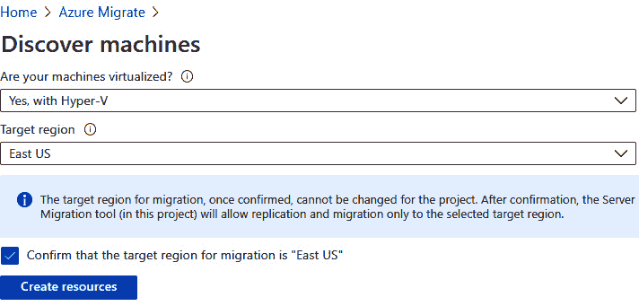

    图 4.3:确认目标区域并创建资源

3.  Azure provides very intuitive steps to complete the replication, starting with the installation of the replication provider software on our Hyper-V server. Steps will be prompted to you as shown in *Figure 4.4*:

    

    图 4.4:回顾迁移步骤

4.  We'll follow the steps in *Figure 4.4*. Let's download the Site Recovery provider software and install it on our Hyper-V server, and also download the registration key. You can copy the installation file and registration key to the Hyper-V server over **remote desktop protocol** (**RDP**), or you can use a file share. The installation is a two-step process and will take some time to install. Once the installation is done, you will get a window similar to the following one and you can proceed using the Register button, not the Finish button:

    

    图 4.5:安装站点恢复提供程序

5.  It's time to use the registration key that we copied earlier. Click on the Register button shown in *Figure 4.5*. On the next screen, you will be asked to choose the registration key and the rest of the details are auto-filled, as shown in *Figure 4.6*. Proceed by clicking on the Next button:

    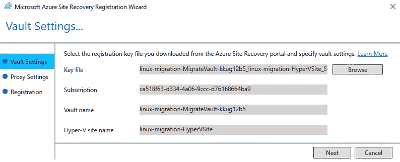

    图 4.6:选择注册码

6.  您不必配置为使用代理进行连接—让服务器直接连接到站点恢复，而无需代理服务器。点击下一步并继续注册过程。
7.  The last stage is Registration, which will take some time. Once the registration is done, the window will prompt as shown in *Figure 4.7*:

    

    图 4.7:完成注册

8.  Now we need to go back to the Azure portal and reopen the project to finalize the registration. If the connection was successful, you will see the registered Hyper-V host under 2\. Finalize registration. Click on the Finalize registration button as shown in *Figure 4.8*. If you are not able to see the host as registered, follow the troubleshooting guide provided by Azure on the same page:

    

    图 4.8:完成注册

9.  You will get a message on the screen to say that the registration may take around 15 minutes to complete. We need to wait for this process to complete before we replicate our machines to Azure. Once the process is complete, you will get a Registration finalized message, as shown in *Figure 4.9*:

    

图 4.9:完成注册

让我们看看如何发现可迁移的服务器。

### 发现服务器

我们的 Hyper-V 服务器配置了提供商，我们需要确保我们的 Azure Migrate 项目发现了虚拟机。让我们返回到 Azure Migrate 登录页面并刷新工具集。如图*图 4.10* 所示，可以看到迁移工具发现了两个虚拟机:

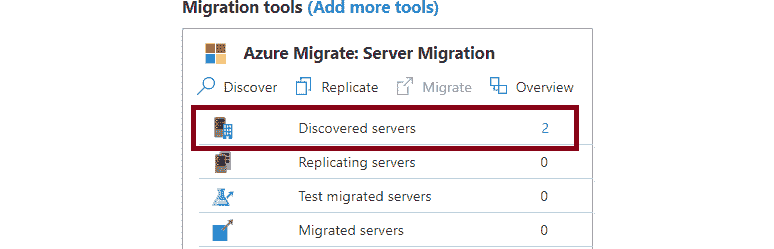

图 4.10:发现的服务器

我们可以看到我们的虚拟机是由 Azure Migrate 项目发现的，我们准备复制这些发现的服务器。

### 复制服务器

如图 4.10 所示，下一步是将我们的服务器复制到 Azure。为此，您需要单击发现旁边的复制选项。另外，在我们复制之前，您需要创建某些资源，否则您可能需要重新启动复制过程。因此，最好在开始复制之前创建您的资源组、虚拟网络和复制存储帐户:

1.  复制是一个五步过程，我们将从源设置开始。在这里，您将选择虚拟化平台或您的源作为 Hyper-V
2.  In the second step, you have to select the VMs that you are migrating to the cloud. You could use the results of an assessment and migrate, or you can specify the migration settings manually. For demonstration purposes and to explain the steps, let's go with the manual option. Select the VMs and hit Next as shown in *Figure 4.11*:

    

    图 4.11:选择虚拟机

3.  It's time to configure Target settings as in the configuration on the Azure side. You have to set Subscription, Resource group, Replication Storage Account (this is where the data will be replicated), Virtual Network, Subnet, and Availability options. The target location cannot be changed. As mentioned earlier, if you don't have these resources created, feel free to create these resources in your selected target region and start from *Step 2* again. Here is how the configuration will look if you already have the target resources in place:

    

    图 4.12:选择目标资源

4.  Hitting Next in the Target settings tab will take you to the Compute tab, where you can set Azure VM Size, OS Type, and the OS Disk name you are going to migrate. You could set Azure VM Size as Automatically select matching configuration, as shown in *Figure 4.13*, and Azure will select a size matching your on-premises configuration:

    

    图 4.13:选择计算大小

5.  After selecting the Compute configuration, you can click on Next and the wizard will take you to the Disks tab. Here you will get a chance to select the disks that you want to replicate from on-premises. You can also replicate the data disks if required; however, in our case, we only have the OS disks. The configuration will look like *Figure 4.14*:

    

    图 4.14:选择要复制的磁盘

6.  选择磁盘后，您可以单击“下一步”，进入最后一步。在这一步中，我们将检查目标配置，并单击复制将服务器复制到 Azure。
7.  We can confirm from the landing page whether the replication has started or not. As shown in *Figure 4.15*, the Replicating servers section should show two as we selected two servers for replication:

    

    图 4.15:验证复制

8.  We could also click on 2, which has a hyperlink to show the status of the replication. This is a lengthy process, and you can track it as shown in *Figure 4.16*:

    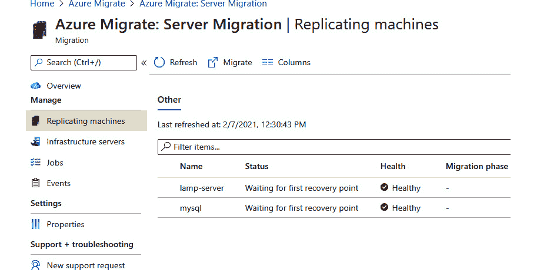

    图 4.16:验证复制过程

9.  Once the replication is done, you will be able to see the status of both the servers change to Protected as demonstrated in *Figure 4.17*:

    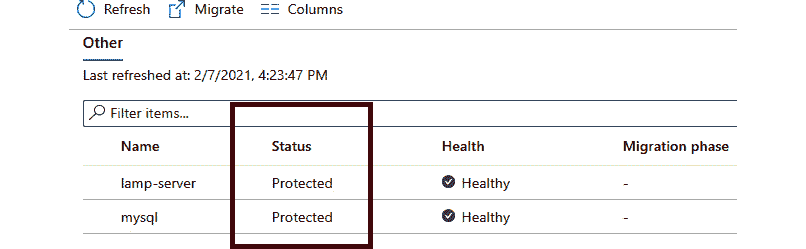

图 4.17:复制完成

我们的服务器已成功复制到 Azure。在迁移到生产环境之前，我们可以执行测试故障转移。在我们进行生产切换之前，测试故障转移有助于了解应用程序是否正常工作。让我们执行测试故障转移并完成迁移过程。

### 迁移到 Azure

由于服务器是复制的，我们可以随时执行测试故障转移。执行测试故障转移不会中断任何服务—此阶段是为了确认应用程序是否按预期运行。如果没有，我们可以采取措施对此进行补救，并重新尝试迁移，而不会造成任何生产停机。

让我们看看应用程序在我们的内部 LAMP 应用程序中的外观，这是一个从[https://github.com/Anirban2404/phpMySQLapp](https://github.com/Anirban2404/phpMySQLapp)创建的演示 LAMP 应用程序:

图 4.18:内部应用程序索引页面

正如本节开头提到的，我们可以执行测试故障转移，看看我们的应用程序是否运行良好。为了执行测试故障转移，请执行以下步骤:

1.  Navigate to Azure Migrate | Servers and choose Replicate from Migration tools as shown in *Figure 4.19*:

    

    图 4.19:查看复制的服务器

2.  From the next screen, select the VM that you want to test failover for and click on the three dots on the far-right side. You'll see a Test migration option as shown in *Figure 4.20*:

    

    图 4.20 选择测试迁移

3.  Select the virtual network where you want to deploy the resources and select Test migration as shown in *Figure 4.21*:

    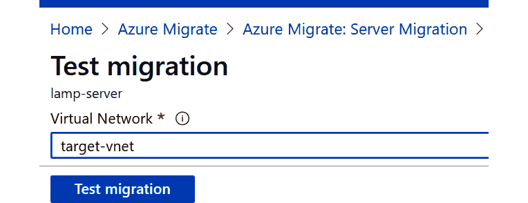

    图 4.21:开始测试迁移

4.  一段时间后，您将看到资源已经创建。这里需要注意的一点是，在测试迁移期间创建的资源不会附加公共 IP 或 NSG。为了让我们使用互联网检查它们，我们需要一个公共的 IP 和 NSG，并添加 SSH 和 HTTP 规则。如果您不确定如何进行此更改，请参考[https://docs . Microsoft . com/azure/virtual-network/manage-network-security-group](https://docs.microsoft.com/azure/virtual-network/manage-network-security-group)和[https://docs . Microsoft . com/azure/virtual-network/associate-public-IP-address-VM](https://docs.microsoft.com/azure/virtual-network/associate-public-ip-address-vm)。
5.  Once the test migration status shows as completed, you can navigate to the target resource group that you selected in the Azure Migrate project during the initial configuration. The resources will be deployed, with the test keyword added as a suffix to the resource name, as visible in *Figure 4.22*:

    

    图 4.22:探索测试迁移资源

6.  You can attach an NSG and public IP address as mentioned in the aforementioned documentation, and then you can test the migration by opening the displayed IP address in your browser as shown in *Figure 4.23*:

    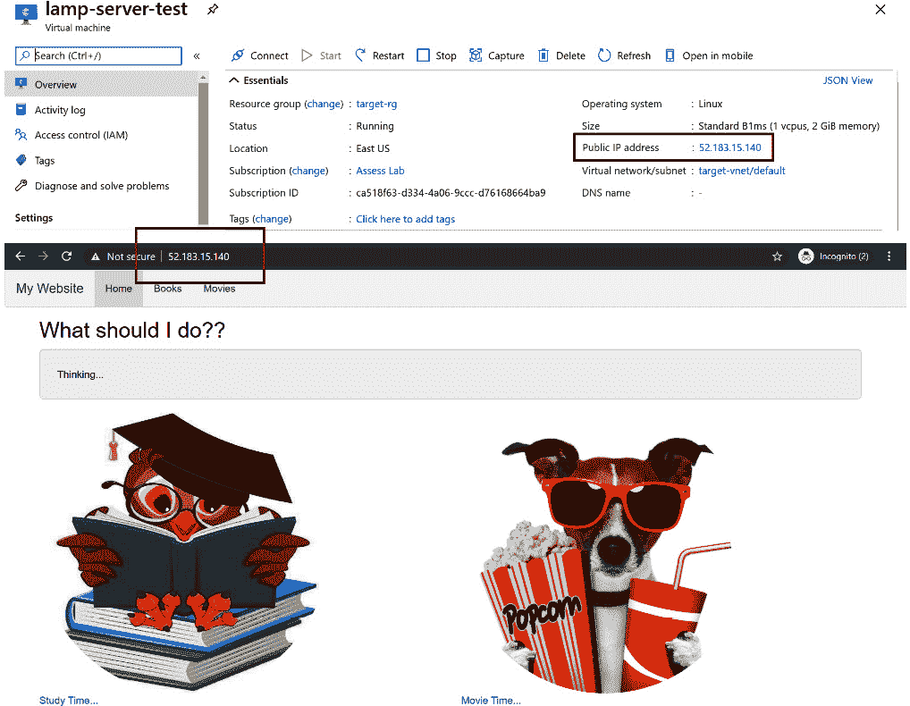

    图 4.23:从浏览器验证应用程序

7.  一旦测试迁移完成，在我们执行实际迁移之前，您需要清理测试迁移。这可以使用清理测试迁移选项来完成，如*图 4.20* 所示。系统将要求您添加笔记并确认删除测试资源。
8.  After cleaning up the test resources, we can perform the actual migration of resources. To start the migration, navigate to Azure Migrate | Servers and choose Migrate from Migration tools as shown in *Figure 4.24*:

    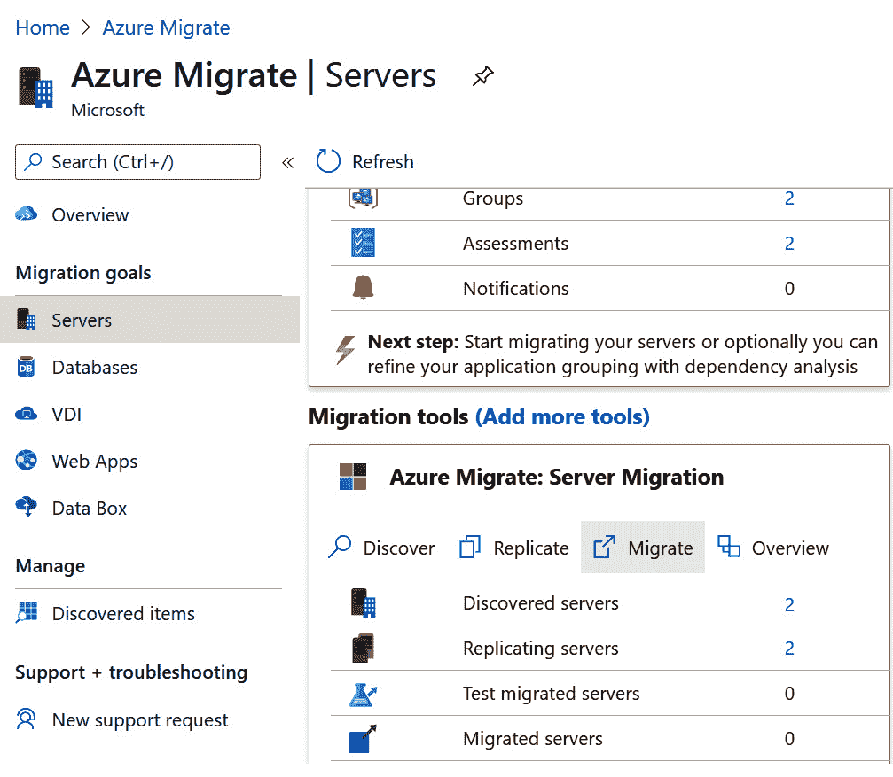

    图 4.24:迁移服务器

9.  You will be asked whether you want to shut down the machines to minimize data loss. Select Yes to shut down the machines and perform a planned migration with zero data loss. If you choose not to shut down the VMs, a final sync will be performed before the migration, but any changes that happen on the machine after the final sync is started will not be replicated. Let's go with No and select the machines we want to migrate, as shown in *Figure 4.25*:

    

    图 4.25:完成迁移

10.  正如我们在测试迁移的案例中看到的，这个过程需要一些时间，并且资源将在目标资源组中创建。服务器将没有公共知识产权或 NSG 附加到他们。您需要遵循我们在测试迁移中遵循的文档中概述的流程来附加 NSG 和公共 IP。如果您没有删除 NSG 和公共 IP，则可以从测试迁移中重用它们。
11.  Voilà, we have our resources in our target resource group:

    

    图 4.26:审查迁移的资源

12.  If we navigate back to Azure Migrate | Servers and refresh the project, we will get the summary of the migration we have done as shown in *Figure 4.27*:

    

图 4.27:项目总结

由此，我们看到了使用 Azure Migrate 将服务器从内部 Hyper-V 主机迁移到 Azure 的端到端过程。正如在本节的介绍中提到的，我们将在下一个实践实验中了解如何将数据库迁移到 PaaS 解决方案。

### 迁移数据库

在*将服务器迁移到 Azure* 部分，我们看到了如何在 Azure Migrate 的帮助下将服务器迁移到 Azure。我们可以像在 LAMP 服务器的情况下一样，直接将数据库从 IaaS 迁移到 IaaS。但是，在本节中，我们将把数据库迁移到 PaaS 解决方案。您可以使用任何可以公开访问的内部 MySQL 服务器。如果没有，出于演示目的，您可以在 Azure 中创建一个虚拟机并安装 MySQL。为了处理实际数据，您需要在 MySQL 服务器中运行以下 SQL 脚本:

创建数据库电影；

使用电影；

CREATE TABLE 恐怖 _ TBL(movie _ id int NOT NULL PRIMARY KEY auto _ increment，movie_title varchar(100) NOT NULL，movie _ year int NOT NULL)；

INSERT INTO 恐怖 _tbl(movie_title，movie_year) VALUES(《驱魔人》，1973 年)、(《世袭》，2018 年)、(《变戏法》，2013 年)、(《闪灵人》，1980 年)、(《德州电锯杀人狂》，1980 年)、(《魔戒》，2002 年)、(《万圣节》，1978 年)、(《阴险》，2012 年)、(《阴险》，2010 年)、(《IT》，2017 年)；

尽管 IaaS 在控制和管理方面提供了很大的灵活性，但 PaaS 有助于开发人员或管理员轻松部署并提高工作效率，因为大多数管理任务都是由微软执行的。由于底层硬件、操作系统补丁和更新以及维护任务都由 Azure 负责，因此 PaaS 节省了大量时间。

为了将数据库迁移到 PaaS，我们将使用名为 Azure DMS 的服务。DMS 使客户能够执行从大量数据库源到 Azure 数据平台的在线和离线迁移，同时将服务中断或停机时间降至最低。

DMS 提供了两种不同的数据库迁移方法:离线迁移或在线迁移。离线迁移需要在迁移开始时关闭服务器，因此这种方法会导致停机。另一方面，在线迁移遵循实时数据的连续复制，也允许在最短的停机时间内随时切换到 Azure。

Azure DMS 提供两个定价层:

*   **标准**:仅支持离线迁移。这一层不收费。
*   **特优**:支持离线和在线迁移。前六个月不收费，之后，这一级将产生费用。

现在我们已经对 DMS 有了一些了解，让我们继续创建一个实例。

### 创建数据库迁移服务实例

该过程包括多个步骤:

1.  Find Azure Database Migration Services in the All Services pane, or simply search for it. You can kick off the creation process by clicking New or Create azure database migration service as shown in *Figure 4.28*:

    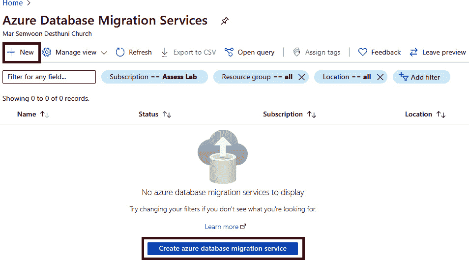

    图 4.28:创建数据库迁移服务实例

2.  The creation process is very straightforward—you need to input values for Subscription, Resource group, Migration service name, and Location. Additionally, there is an option to choose Pricing tier and Service mode. As mentioned previously, there are two pricing tiers for this service: Standard (supports only offline migration) and Premium (supports both offline and online migration). Also, there are two service modes: Azure, where we'll be choosing one of the aforementioned pricing tiers, and Hybrid, where the worker is hosted on-premises. At the time of writing this book, Hybrid mode is in preview. The creation process is shown in *Figure 4.29*:

    

    图 4.29:配置基础

3.  The next configuration we need is the Networking configuration, where will be creating a virtual network. You could choose an existing virtual network or create a new one. This virtual network will be used by the service to communicate with the source databases over the internet. The configuration is as shown in *Figure 4.30*:

    

    图 4.30:创建新的虚拟网络

4.  单击“审阅+创建”将启动验证过程，并创建服务。

现在我们已经创建了一个 DMS 实例，下一步是配置迁移项目。在此之前，我们需要在 Azure 中创建目标数据库。由于我们正在迁移 MySQL，我们需要为 MySQL 服务器创建一个 Azure 数据库。

### 创建和配置目标资源

如前所述，我们要创建的服务是一个 MySQL 服务器的 Azure 数据库。这是一个由微软 Azure 管理的产品，利用了 MySQL 社区版 5.6、5.7 和 8.0 版本。让我们创建目标资源来迁移数据:

1.  在搜索栏中搜索 MySQL，您将能够在 Azure 门户中看到 MySQL 的 Azure 数据库。单击新建按钮开始创建新数据库。
2.  我们将采用单服务器模式，因为它是生产就绪型、成本优化型，并且具有内置的高可用性。您可以选择灵活服务器，它提供高级定制，在撰写本书时处于预览状态。
3.  The wizard will take you through the creation process. You need to fill in the details and configure the compute, storage, and pricing tier for the server as per your requirements. Since we're dealing with a very small database, a Basic server with 1 vCPU and 8 GB of storage will suffice. In real-world scenarios, you should match the compute and storage of the Azure server with the on-premises configuration to avoid performance issues. The configuration is as shown in *Figure 4.31*:

    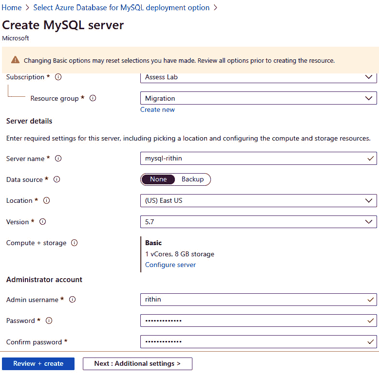

    图 4.31:为 MySQL 服务器创建一个 Azure 数据库

4.  这样，我们可以选择“查看+创建”选项，然后选择“创建”选项，这样就可以调配数据库了。
5.  配置数据库后，我们需要创建一个目标表，本地数据库表中的数据应该迁移到该目标表中。我们将创建一个空表，并在创建迁移项目时将其映射到我们的内部数据库。
6.  服务器管理员登录名可以从我们在*步骤 3* 中创建的数据库的概述窗格中获得。
7.  You can use any Linux or Windows computer with MySQL tools installed or Azure Cloud Shell to work with the server we deployed in Azure. Here, let's connect from the Bash shell as shown in *Figure 4.32*:

    

    图 4.32:使用 Bash 连接到 Azure MySQL

    这里连接将失败，因为我们连接的机器的 IP 地址不在允许的 IP 地址列表中，防火墙将阻止我们连接。

8.  To add your IP address to the allowed list of IP addresses, you can navigate to the server we created and click on Connection security. If you are using Azure Cloud Shell, you have to enable Allow access to Azure services. Since we are using a local machine, we will add our IP address as shown in *Figure 4.33* and save the configuration:

    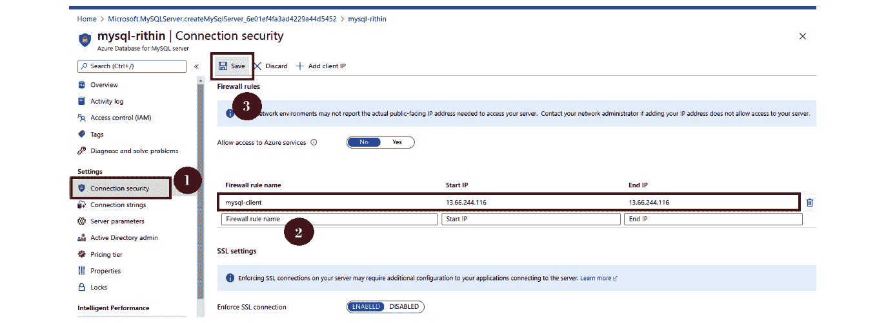

    图 4.33:配置防火墙

9.  Now that we've added our IP address to the firewall, let's try to reconnect from Bash and see if the connection succeeds. You can see in *Figure 4.34* that the login was successful:

    

    图 4.34:登录到 MySQL

10.  Our on-premises server consists of a database and has a table named **horror_tbl**. Basically, this table stores the names of horror movies and the years they were released. We need to create a similar table in the MySQL server as we created in Azure so that the data can be migrated. Let's create a new database and table using the following commands:

    创建数据库电影；

    使用电影；

    创建表格恐怖

    电影标识不为空自动增量，

    电影标题 varchar(150)不为空，

    电影 _ 年份整数不为空，

    PRIMARY KEY(movie _ id))；

11.  Here is how the databases look in on-premises infrastructure and in Azure:

    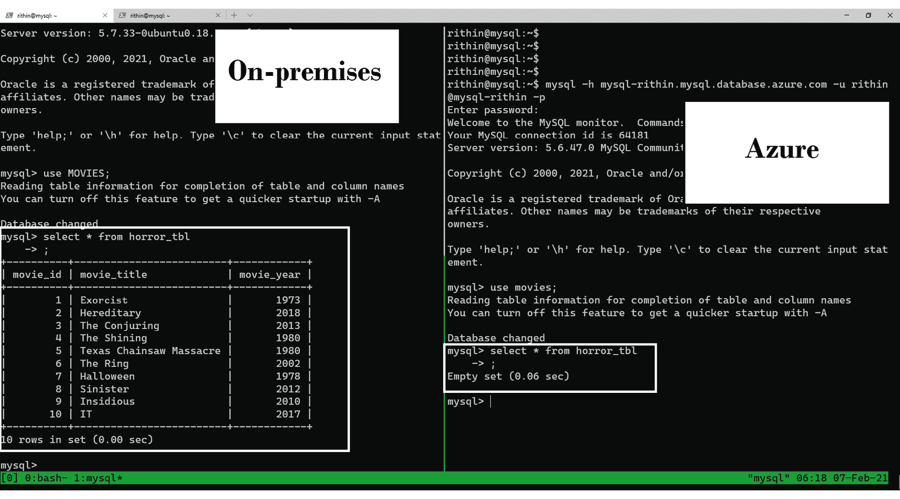

图 4.35:比较内部和 Azure 中的数据集

从上图可以明显看出，内部数据库包含数据，而 Azure 数据库是空的。现在我们需要从源数据库中提取模式，并将其应用到目标数据库。

### 迁移示例模式

为了提取模式，可以使用带有 **-无数据**参数的 **mysqldump** 命令。语法如下:

MySQL dump-h { servername }-u { username }-p-databases { database name } \

-no data >/路径/到/文件

在我们的场景中，我们需要提取 **MOVIES** 数据库的模式。因为我们是从 MySQL 服务器本身执行命令，所以我们不需要使用 **-h** 参数。但是，如果您在远程服务器上执行此操作，请考虑使用 **-h** 参数。在我们的场景中，以下命令就足够了:

MySQL dump-u root-p-databases MOVIES-no-data > schema . SQL

如果您有多个数据库，并且希望一次性提取所有数据库的模式，也可以使用 **-所有数据库**参数。如果您查看模式文件，它将类似于以下 SQL 脚本:

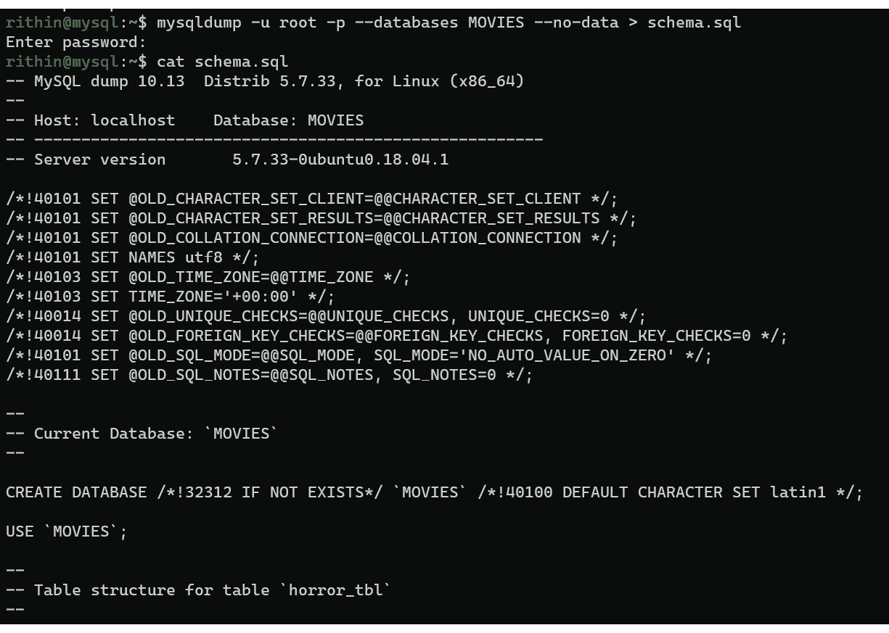

图 4.36:检查模式文件

现在，我们需要使用以下语法将这些数据导入 MySQL 的 Azure 数据库。如果网络允许连接，这可以直接从托管内部数据库的虚拟机运行。否则，需要在可以选择连接到 Azure 数据库或直接连接到 Cloud Shell 的计算机上导入模式:

MySQL-h { servername }-u { username }-p {数据库名称} < /path/to/schema

在我们的场景中，您需要用 MySQL 凭据的 Azure 数据库替换服务器名和登录名:

MySQL-h mysql-rithin.mysql.database.azure.com-u rithin @ MySQL-rithin \

-p movies < schema.sql

导入过程结束后，我们需要切换回 DMS 并创建一个迁移项目。

### 创建迁移项目和迁移数据库

要创建数据库迁移项目，我们需要返回 DMS。可以使用以下步骤创建项目:

1.  Navigate to Azure Database Migration Service and select New Migration Project as shown in *Figure 4.37*:

    

    图 4.37:创建迁移项目

2.  The creation is a very simple process. We need to input a name for the project, set Source server type (in our case MySQL), and set Target server type, which is Azure Database for MySQL. Finally, set the type of activity as Online data migration, as we are planning to migrate without any downtime. The offline option is not currently available for MySQL. The configuration is as shown in *Figure 4.38*:

    

    图 4.38:配置项目

3.  项目配置完成后，单击创建并运行活动。这将把你带到 MySQL 到 Azure 数据库的 MySQL 在线迁移向导。
4.  The first step in the wizard is to configure the source. Here we need to set Source server name, Server port, User Name, and Password for our publicly available on-premises server as shown in *Figure 4.39*:

    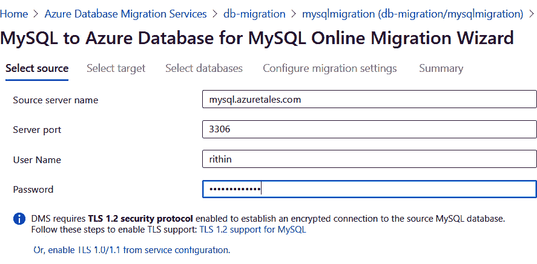

    图 4.39:连接到源数据库

    #### 注意

    如果 MySQL 服务器配置不正确，您可能会遇到错误。要成功连接，可能需要配置绑定地址、绑定登录 **mysqld.cnf** ，以及创建具有管理员权限的新用户。参考[https://docs . Microsoft . com/azure/DMS/tutorial-MySQL-azure-MySQL-online #先决条件](https://docs.microsoft.com/azure/dms/tutorial-mysql-azure-mysql-online#prerequisites)。

5.  Now we need to configure the target, which includes setting Target server name, User Name, and Password. Target server name and User Name can be found from the Overview pane of our MySQL server in Azure. The password is the one you entered during the service creation—if forgotten, you can use the Reset Password option. The target server details should be configured as follows:

    

    图 4.40:配置目标服务器

    #### 注意

    您可能会收到一条错误消息，指出不允许该 IP 地址连接到 MySQL 服务器。从错误消息中，您可以获取 DMS 的公共 IP，并将该 IP 添加到 MySQL 的“连接安全性”窗格中，以便成功连接，或者启用“允许访问 Azure 服务”。但是，这将使订阅中的所有 Azure 服务都可以访问数据库。

6.  The next step is to select the source databases that need to be migrated to the cloud. The tool will show you the databases that are available on the on-premises server. Select the source database and corresponding database as the target. In our case, we will map the **MOVIES** database, which is on-premises, to the **movies** database that we created earlier. *Figure 4.41* shows how the mapping is done from source to target:

    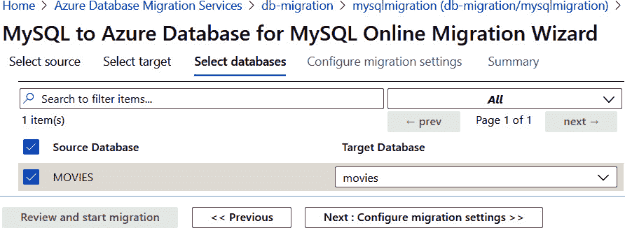

    图 4.41:映射数据库

7.  We're approaching the last step, where we can configure the migration settings. At this stage, you can specify which tables need to be migrated and settings for **large objects** (**LOB**) data. Since our dataset is small, we don't need to configure LOB settings. From *Figure 4.42*, we can see that the **horror_tbl** table has been selected:

    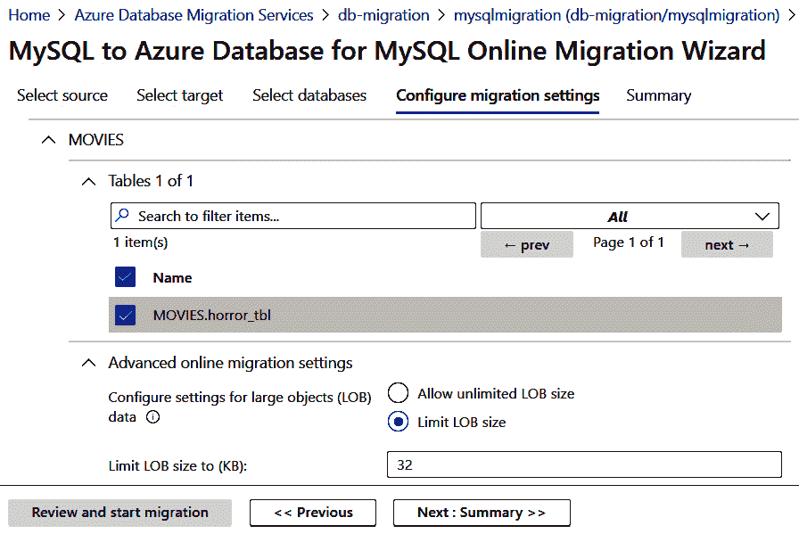

    图 4.42:配置数据库迁移设置

8.  接下来，我们进入“摘要”选项卡，在这里我们需要为此活动添加一个名称，并查看到目前为止所做的配置。单击开始迁移将启动从内部服务器到 Azure 服务器的迁移。
9.  Soon we will be redirected to a page with the migration status and details of the source and destination servers, as shown in *Figure 4.43*:

    

    图 4.43:检查迁移状态

10.  Since our dataset was 10 rows, it took less than 5 seconds to complete the migration and notify us that we are ready to cut over. If you choose Start Cutover, Azure will provide the steps to commit any pending transactions, as shown in *Figure 4.44*, and after that you are ready to point your applications to this database:

    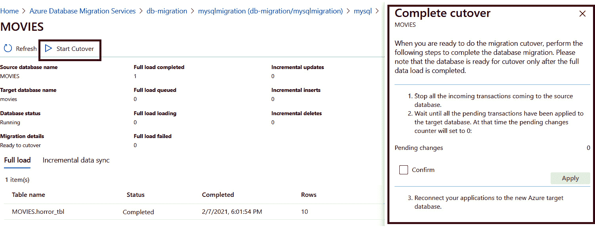

    图 4.44:开始切换

11.  即使没有启动切换，您也可以检查 Azure MySQL 实例，并验证我们的记录是否在那里。下面显示了使用 Bash 通过连接到实例完成的验证:

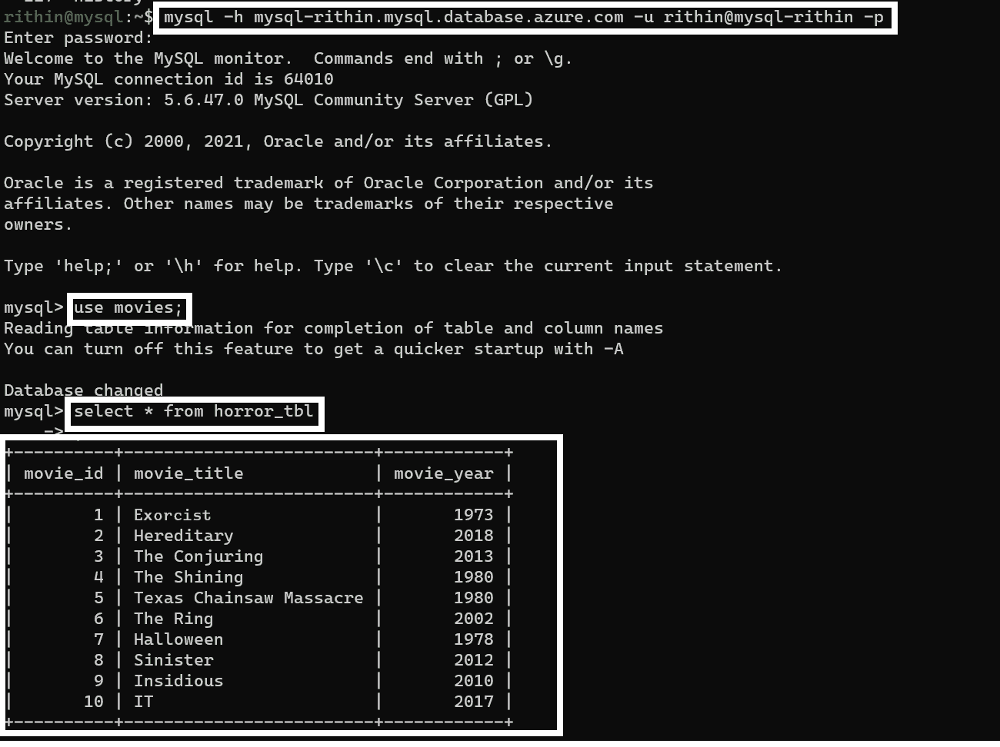

图 4.45:迁移后验证 MySQL 服务器的 Azure 数据库中的数据

从*图 4.45* 可以明显看出，我们确实连接到了 Azure MySQL 实例。

虽然我们从 Hyper-V 执行了迁移以进行演示，但 Azure Migrate 支持其他平台，DMS 也支持其他数据库类型。*表 4.1* 显示了包括 Hyper-V 在内的其他平台的微软官方内容链接:

<colgroup><col> <col></colgroup> 
| **平台** | **链接** |
| --- | --- |
| **VMware** | [https://docs . Microsoft . com/azure/migrate/server-migrate-概述](https://docs.microsoft.com/azure/migrate/server-migrate-overview) |
| **物理服务器** | [https://docs . Microsoft . com/azure/migrate/tutorial-migrate-physical-virtual-machines](https://docs.microsoft.com/azure/migrate/tutorial-migrate-physical-virtual-machines) |
| **AWS 实例** | [https://docs . Microsoft . com/azure/migrate/tutorial-migrate-AWS-虚拟机](https://docs.microsoft.com/azure/migrate/tutorial-migrate-aws-virtual-machines) |
| **GCP 实例** | [https://docs . Microsoft . com/azure/migrate/tutorial-migrate-GCP-虚拟机](https://docs.microsoft.com/azure/migrate/tutorial-migrate-gcp-virtual-machines) |
| **超 V** | [https://docs . Microsoft . com/azure/migrate/tutorial-migrate-hyper-v](https://docs.microsoft.com/azure/migrate/tutorial-migrate-hyper-v) |
| **数据库迁移** | [https://datamigration.microsoft.com/](https://datamigration.microsoft.com/) |

表 4.1:其他平台的迁移文档

至此，我们已经到达动手实验的终点。最后，本练习分为两个部分，一部分是使用 Azure Migrate 迁移服务器，另一部分是使用 DMS 迁移数据库。

## 总结

本章重点介绍通过动手实验进行的实践学习。首先，我们了解了如何在虚拟机中安装提供程序，然后运行了发现和复制过程。第一个实践实验以使用 Azure Migrate 将虚拟机迁移到 Azure 而结束。

我们的第二个实验侧重于使用 DMS 将 MySQL 数据库迁移到 MySQL 服务的 Azure 数据库。在本实验中，我们首先创建了迁移服务，并用我们的目标资源对其进行了配置。然后我们迁移了一个示例模式。最后，我们创建了一个迁移项目，并将数据库迁移到 Azure。

将操作系统和数据库迁移到 Azure 只是我们云之旅的一步。自然，下一步是在 Azure 上操作迁移的 Linux 工作负载。*第五章*、*在 Azure* 上操作 Linux，会给大家一些关于这个话题的实用指导。