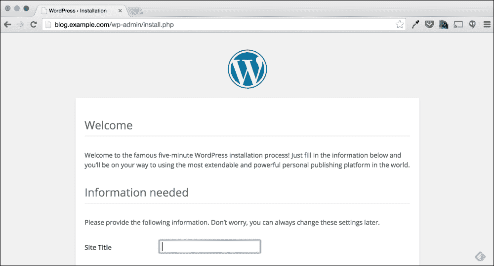
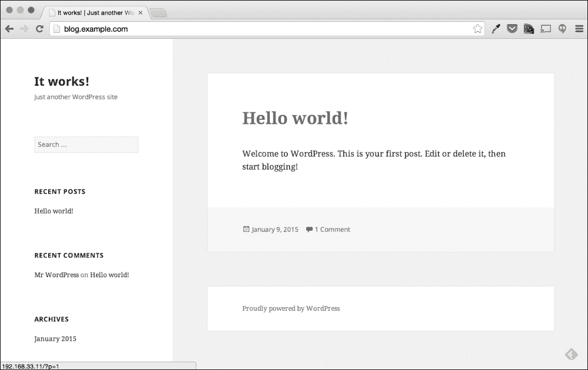

# 三、Web 应用故障排除

在本书的第一和第二章中，我们介绍了故障排除过程、常见的信息位置和有用的故障排除命令。 在本章中，我们将运行一个已经创建的示例问题，以演示多个故障排除和补救步骤。 特别地，我们将了解对基于 web 的应用进行故障排除所需的步骤。

在本章中，我将介绍故障排除过程的每个步骤，并解释每个步骤背后的原因。 虽然本章所涵盖的问题可能不是一个非常普遍的问题，但是看看所使用的过程和工具是很重要的。 本章中使用的过程和工具可以应用于大多数 web 应用问题。

# 一个小小的背景故事

在本书的每一章中，您将发现一个示例问题，涵盖了常见的故障排除主题。 虽然本书的重点是展示解决这些类型的问题所需的命令和概念，但展示围绕解决这些问题的过程也很重要。 为此，我们将以最近加入新公司的新系统管理员的身份来探讨这些问题。

每个问题的呈现方式都略有不同，但每个问题都将以报告的一个问题开始。

# 报道的问题

当我们在新公司开始的新角色时，我们被分配到公司**网络运营中心**(**NOC**)接听电话。 在这个职位上，我们将专注于解决公司环境中的问题，并希望能够迅速解决这些问题。 对于第一期，我们接到了一个电话; 电话的另一端是遇到问题的业务用户。 *突然，我们的博客显示的是一个安装页面，而不是我们的帖子!*

现在我们有了一个报告的问题，让我们开始进行故障排除流程。

# 数据收集

如果我们回顾在[第 1 章](01.html#DB7S1-8ae10833f0c4428b9e1482c7fee089b4 "Chapter 1. Troubleshooting Best Practices")，*故障排除最佳实践*，故障排除过程的第一步是理解问题陈述。 在本节中，我们将探讨问题是如何报告的，并将尝试收集所有能够找到问题根源的数据。

对于本例，我们通过电话通知了这个问题。 这实际上是幸运的，因为我们有一个终端用户在电话上，可以问问题从他/她获得更多的信息。

在向报告问题的人询问更多信息之前，让我们先看看已经回答了什么。 *突然，我们的博客显示的是一个安装页面，而不是我们的帖子!*

一开始，你可能觉得这个问题陈述很模糊; 这是因为它是模糊的。 然而，在这个简单的句子中仍然有相当多的有用信息。 如果我们分析报道的问题，我们可以更好地理解这个问题。

*   "我们的博客显示了一个安装页面"
*   "突然"
*   “不是我们的文章!”

从这三个部分，我们可以假设如下:

*   这个博客显示了一个意想不到的页面
*   这个博客以前展示过帖子
*   在某种程度上，这种情况发生了变化，似乎是最近发生的

虽然以上是一个很好的开始来确定是否存在一个问题以及它与什么有关，但它还不足以给我们提供一个假设。

## 问问题

为了阐明假说，我们需要更多的信息。 获得这一信息的一种方法是询问报告该问题的人。 为了获得更多的信息，我们将向企业用户提出以下问题:

1.  When was the last time you saw the blog working?

    昨晚。

2.  What is the blog's address?

    `http://blog.example.com`

3.  Did you receive any other errors?

    不。

虽然以上的问题不足以识别问题，但它们确实给了我们一个起点，让我们从哪里开始寻找。

## 重复这个问题

正如前面在[第 1 章](01.html#DB7S1-8ae10833f0c4428b9e1482c7fee089b4 "Chapter 1. Troubleshooting Best Practices")中提到的，*故障排除最佳实践*查找信息的最佳方法之一是复制问题。 在这种情况下，似乎我们可以通过简单地访问提供的地址来复制问题。



在前面的屏幕截图中，我们可以看到博客的运行正如用户所描述的那样。 当我们访问提供的 URL 时，出现了一个默认的 WordPress 安装屏幕。

这能给我们提供任何关于问题起因的线索吗? 不，不完全是，除非我们以前见过这个问题。 虽然这可能不能告诉我们问题的原因，但它确实确认了用户报告的问题是可重现的。 这个步骤还告诉了我们正在进行故障排除的软件的名称:WordPress。

WordPress 是最流行的开源博客平台之一。 在本章中，假设我们没有管理 WordPress 的经验，并且需要通过在线资源找到我们需要的关于这个 web 应用的任何信息。

## 了解环境

由于我们是新的系统管理员，在这一点上，我们对环境知之甚少，这意味着我们对如何部署这个博客知之甚少。 事实上，我们甚至不知道它从哪个服务器运行。

### 这个博客在哪里?

然而，我们知道的一件事是，我们公司管理的所有服务器的 ip 都在 192.168.0.0/16 子网内。 为了确定这是否是一个我们可以解决的问题，我们首先需要确定博客是否在我们公司管理的服务器上。 如果本博客不在本公司管理的服务器上，我们的故障排除选项可能有限。

确定博客托管位置的一种方法是简单地查找`blog.example.com`地址的 IP 地址。

#### 使用 nslookup 查找 ip

查找 DNS 名称的 IP 地址有多种方式; 我们将要讨论的命令是`nslookup`命令。 要使用此命令，只需执行`nslookup`和要查找的 DNS 名称:`blog.example.com`即可。

```sh
$ nslookup blog.example.com
Server:    192.0.2.1
Address:  192.0.2.1#53

Non-authoritative answer:
Name:  blog.example.com
Address: 192.168.33.11

```

在前面的输出中，对于不熟悉`nslookup`的人来说，结果可能有点令人困惑。

```sh
Non-authoritative answer:
Name:  blog.example.com
Address: 192.168.33.11

```

我们知道前面的信息是`nslookup`查询的结果。 这个块表示`blog.example.com`域的地址是`192.168.33.11`。 `nslookup`的第一个输出块只是告诉我们使用哪个 DNS 服务器来查找这些信息。

```sh
Server:    192.0.2.1
Address:  192.0.2.1#53

```

我们可以从这个块中看到，DNS 服务器使用的是`192.0.2.1`。

#### 那么 ping, dig 或其他工具呢?

我们可以使用许多命令来查找这个域的 IP 地址。 我们可以使用`dig`，`host`，甚至`ping`。 我们选择`nslookup`命令的原因是在大多数情况下，它包含在大多数操作系统中。 因此，无论您是否需要从 Windows、Mac 或 Linux 桌面查找 IP 地址，都可以使用`nslookup`命令。

然而，使用`nslookup`命令的一个警告是，它专门使用 DNS 来查找地址。 它不尊重`/etc/hosts`中的值或`/etc/nsswitch.conf`中指定的任何其他名称服务。 这一点我们将在后面的章节中进一步探讨; 现在，我们假设`192.168.33.11`的 IP 地址是正确的 IP 地址。

### 好的，它在我们的环境中; 现在怎么办呢?

由于我们使用的是 Linux 服务器，管理该服务器最常用的方法是通过**Secure Shell**(**SSH**)。 SSH 是一种安全的网络服务，它允许用户远程访问服务器的 shell。 在本书中，我们将假设您已经熟悉通过 SSH 登录到服务器。 无论您使用 SSH 命令行客户端还是像 PuTTY 这样的桌面客户端，都假定您能够使用 SSH 登录到服务器。

在这个场景中，我们使用一台拥有自己 shell 环境的笔记本电脑。 要登录到我们的服务器，我们只需从终端窗口执行`ssh`命令。

```sh
$ ssh vagrant@blog.example.com
vagrant@blog.example.com's password:

```

登录后，我们执行的第一个信息收集命令是`w`命令。

```sh
$ w
 18:32:17 up 2 days, 12:05,  1 user,  load average: 0.11, 0.08, 0.07
USER     TTY        LOGIN@   IDLE   JCPU   PCPU WHAT
vagrant  pts/1     00:53    2.00s  0.00s  0.08s sshd: vagrant [priv]

```

在[第 2 章](02.html#I3QM2-8ae10833f0c4428b9e1482c7fee089b4 "Chapter 2. Troubleshooting Commands and Sources of Useful Information")、*故障诊断命令和有用信息来源*中，我们介绍了`w`命令，并提到它是执行的第一个命令。 我们可以在`w`命令的输出中看到相当多的有用信息。

从这个输出，我们可以确定以下内容:

*   目前只有 1 个用户登录(这是我们的登录会话)
*   有问题的服务器已经上线 2 天了
*   平均负载较低，说明正常

总的来说，乍一看，服务器似乎运行正常。 问题在昨晚开始的事实表明问题在两天前重启后没有开始。 由于平均负载较低，此时假设问题与系统负载无关也是安全的。

### 安装和运行哪些服务?

由于我们以前从未登录过到这个服务器，而且对这个环境完全陌生，所以我们应该做的第一件事是找出在这个服务器上运行的服务。

因为我们从安装页面知道这个博客是一个 WordPress 博客，所以我们可以搜索谷歌关于它需要的服务。 我们可以通过使用搜索词“WordPress 安装要求”来做到这一点。

这个搜索字符串返回以下 URL 作为第一个结果:[https://wordpress.org/about/requirements/](https://wordpress.org/about/requirements/)。 本页面包含 WordPress 的安装要求，并列出如下:

*   PHP 5.2.4
*   MySQL 5.0 或更高版本
*   Apache 或 Nginx web 服务器

从我们可以访问安装页面的事实来看，我们可以假设已经安装了 web 服务器和 PHP，并且能够正常工作。 然而，验证总是比假设更好。

#### 验证 web 服务器

因为 WordPress 推荐的**Apache**或【5】Nginx web 服务器,我们首先需要确定哪些是安装,更重要的是,确定这个 WordPress 应用在使用。

以下是一些确定哪些 web 服务器已经安装和运行的方法:

*   我们可以使用`rpm`来查看已安装的包
*   我们可以使用`ps`来查看正在运行的进程
*   我们可以简单地通过浏览器访问一个不存在的页面，并查看错误页面是否表明哪个 web 服务器正在运行
*   我们还可以访问`/var/logs`，查看哪些日志文件存在，哪些不存在

所有这些方法都是有效的，并有各自的好处。 对于本例，我们将使用*第五*方法(之前没有提到)，它将回答关于此服务器上的 web 服务器配置的两个问题。

该方法的第一步将是确定哪个进程正在侦听端口 80。

```sh
$ su -
# netstat -nap | grep 80
tcp6       0      0 :::80                   :::* LISTEN      952/httpd
unix  3      [ ]         STREAM     CONNECTED     17280  1521/master

```

正如在[第 2 章](02.html#I3QM2-8ae10833f0c4428b9e1482c7fee089b4 "Chapter 2. Troubleshooting Commands and Sources of Useful Information")、*故障诊断命令和有用信息来源*中所讨论的，`netstat`命令可以用来确定哪些端口正在使用`–na`标志。 如果我们简单地将`–p`(端口)标志添加到`netstat`，我们还可以看到哪个进程正在监听每个端口。

### 提示

为了识别哪些进程正在监听每个端口，必须使用**超级用户**级别的权限执行`netstat`命令。 因此，在执行`netstat`之前，我们使用`su`命令切换到**根用户**。

在本书中，任何以`$`开头的命令都以非特权用户的身份运行，而以`#`开头的命令都以根用户的身份执行。

端口 80 是 HTTP 请求的默认端口; 因此，如果我们回顾为复制手头的问题而执行的步骤，我们可以看到使用的地址是`http://blog.example.com`。 由于这是一个 HTTP 地址，并且没有指定不同的端口，这意味着为 WordPress 安装页面提供服务的服务正在侦听端口 80。

从`netstat`命令的输出中，我们可以看到进程 952 正在监听端口 80。 `netstat`输出还显示进程 952 正在运行`httpd` 二进制文件。 在 RHEL 系统上，这个`httpd`二进制文件通常是 Apache。

我们可以通过[第 2 章](02.html#I3QM2-8ae10833f0c4428b9e1482c7fee089b4 "Chapter 2. Troubleshooting Commands and Sources of Useful Information")、*故障诊断命令和有用信息来源*中讨论的带有`–elf`标志的`ps`命令来验证情况是否如此。 我们还将使用`grep`命令搜索`ps`命令的输出，搜索字符串“952”:

```sh
$ ps -elf | grep 952
4 S root       952     1  0  80   0 - 115050 poll_s Jan11 ? 00:00:07 /usr/sbin/httpd -DFOREGROUND
5 S apache    5329   952  0  80   0 - 115050 inet_c 08:54 ? 00:00:00 /usr/sbin/httpd -DFOREGROUND
5 S apache    5330   952  0  80   0 - 115050 inet_c 08:54 ? 00:00:00 /usr/sbin/httpd -DFOREGROUND
5 S apache    5331   952  0  80   0 - 115050 inet_c 08:54 ? 00:00:00 /usr/sbin/httpd -DFOREGROUND
5 S apache    5332   952  0  80   0 - 115050 inet_c 08:54 ? 00:00:00 /usr/sbin/httpd -DFOREGROUND
5 S apache    5333   952  0  80   0 - 119196 inet_c 08:54 ? 00:00:00 /usr/sbin/httpd -DFOREGROUND

```

通过上面的输出，我们可以看到进程 952 及其子进程正在 apache**用户下运行。 这证实了正在使用的软件最有可能是 Apache，但是为了更加谨慎，我们可以执行带有`–version`标志的`httpd`二进制文件来打印 web 服务器软件的版本。**

```sh
$ httpd -version
Server version: Apache/2.4.6
Server built:   Jul 23 2014 14:48:00

```

`httpd`二进制文件的输出表明它实际上是 Apache web 服务器，它符合 WordPress 的要求。

在这一点上，我们已经发现了以下事实的 web 服务器使用这个服务器:

*   web 服务器是 Apache
*   Apache 进程正在运行
*   Apache 版本为 2.4.6
*   Apache 进程正在监听 80 端口

可以使用其他方法(如`rpm`)识别相同的信息。 这种方法的优点在于，如果服务器安装了两个 web 服务器服务，我们就知道哪些服务正在监听 80 端口。 这也告诉我们哪个服务提供了 WordPress 安装页面。

#### 正在验证数据库服务

一个常见的 WordPress 实现是在一台服务器上运行 Apache、PHP 和 MySQL 服务。 然而，有时 MySQL 服务将从另一个或多个服务器上运行。 为了更好地理解这个环境，我们应该检查这个环境是在本地还是从另一个服务器上运行 MySQL。

要检查这一点，我们将再次使用`ps`命令; 然而，这一次我们将使用`grep`来搜索与字符串“mysql”匹配的进程:

```sh
$ ps -elf | grep mysql
4 S mysql     2045     1  0  80   0 - 28836 wait   Jan12 ? 00:00:00 /bin/sh /usr/bin/mysqld_safe --basedir=/usr
0 S mysql     2203  2045  0  80   0 - 226860 poll_s Jan12 ? 00:00:42 /usr/libexec/mysqld --basedir=/usr --datadir=/var/lib/mysql --plugin-dir=/usr/lib64/mysql/plugin --log- error=/var/log/mariadb/mariadb.log --pid- file=/var/run/mariadb/mariadb.pid -- socket=/var/lib/mysql/mysql.sock

```

从前面的输出中可以看到，实际上有一个 MySQL 进程正在运行。 同样需要注意的是，`ps`输出显示`mysqld`进程正在使用以下选项:`–log-error=/var/log/mariadb/mariadb.log`。

这是重要的两个原因:首先,这是日志文件的位置`mysqld`的过程,第二个是这个日志文件**MariaDB**,这是不同于 MySQL。

我们可以通过`rpm`和`egrep`命令来确认 MySQL 或 MariaDB 是否已经安装。

```sh
$ rpm -qa | egrep "(maria|mysql)"
php-mysql-5.4.16-23.el7_0.3.x86_64
mariadb-5.5.40-2.el7_0.x86_64
mariadb-server-5.5.40-2.el7_0.x86_64
mariadb-libs-5.5.40-2.el7_0.x86_64

```

`egrep`命令类似于`grep`; 但是，它接受正则表达式形式的搜索字符串。 在上面的命令中，我们使用`egrep`来搜索字符串“`mariadb`”或字符串“`mysql`”，从前面的输出中，我们可以看到这个服务器实际上安装了 MariaDB，但没有安装 MySQL。

有了这些信息，我们可以假设正在运行的`mysqld`进程实际上是 MariaDB 二进制程序。 我们可以通过使用`–q`(查询)和`–l`(列出所有文件)标志的`rpm`命令来验证这一点。

```sh
$ rpm -ql mariadb-server | grep "libexec/mysqld"
/usr/libexec/mysqld

```

我们可以从`rpm`命令的输出中看到，正在运行的`/usr/libexec/mysqld`二进制文件被部署为**mariadb-server**包的一部分。 显示运行的数据库进程实际上是 MariaDB，并且是通过 MariaDB -server 包安装的。

现在，我们已经发现了以下关于该服务器上运行的数据库服务的事实:

*   数据库服务实际上是 MariaDB
*   MariaDB 运行
*   此服务的日志文件位于`/var/log/mariadb/`

虽然 MariaDB 是 MySQL 的临时替代品，但 WordPress 的需求并没有将其列为首选数据库服务。 注意这个差异很重要，因为它可能确定所报告问题的根本原因。

#### 验证 PHP

既然我们知道 WordPress 需要 PHP，我们也应该检查一下它是否已经安装。 我们可以再次使用`rpm`命令来验证这一点。

```sh
$ rpm -qa | grep php
php-mbstring-5.4.16-23.el7_0.3.x86_64
php-mysql-5.4.16-23.el7_0.3.x86_64
php-enchant-5.4.16-23.el7_0.3.x86_64
php-process-5.4.16-23.el7_0.3.x86_64
php-xml-5.4.16-23.el7_0.3.x86_64
php-simplepie-1.3.1-4.el7.noarch
php-5.4.16-23.el7_0.3.x86_64
php-gd-5.4.16-23.el7_0.3.x86_64
php-common-5.4.16-23.el7_0.3.x86_64
php-pdo-5.4.16-23.el7_0.3.x86_64
php-PHPMailer-5.2.9-1.el7.noarch
php-cli-5.4.16-23.el7_0.3.x86_64
php-IDNA_Convert-0.8.0-2.el7.noarch
php-getid3-1.9.8-2.el7.noarch

```

PHP 本身并不是作为 Apache 或 MySQL 之类的服务运行的，而是作为一个 web 服务器模块。 但是，可以将`php-fpm`这样的服务用作应用服务器。 这允许 PHP 作为一个服务运行，并被上游 web 服务器调用。

要检查此服务器是否运行`php-fpm`或任何其他 PHP 前端服务，我们可以再次使用`ps`和`grep`命令。

```sh
$ ps -elf | grep php
0 S root      6342  5676  0  80   0 - 28160 pipe_w 17:53 pts/0    00:00:00 grep --color=auto php

```

通过使用`ps`命令，我们看不到任何特定的 PHP 服务; 然而，当我们访问博客时，我们能够看到安装页面。 这表明 PHP 被配置为直接通过 Apache 运行。 我们可以通过使用`–M`(modules)标志再次执行`httpd`二进制文件来验证这一点。

```sh
$ httpd -M | grep php
 php5_module (shared)

```

`–M`标志将告诉`httpd`二进制文件列出所有加载的模块。 这个列表中包括`php5_module`，这意味着 Apache 的安装能够通过`php5_module`运行 PHP 应用。

##### 已安装和正在运行的服务的摘要

在这一点上，我们已经从我们的数据收集中确定了以下几点:

*   Apache 的 WordPress 需求已经安装并运行
*   MySQL 的 WordPress 要求似乎被 MariaDB 满足了，它已经安装并运行
*   PHP 的 WordPress 要求已经安装，并且似乎正在工作
*   看起来 WordPress 是部署在单服务器而不是多服务器上

现在我们可以假设这些事实意味着问题不是由缺少 WordPress 需求引起的。

通过收集所有这些数据点，我们不仅对正在进行故障排除的环境有了更多的了解，而且还消除了此问题的几个可能原因。

## 正在查找错误消息

现在已经确定了安装的和配置的服务，我们知道从哪里开始查找错误或有用消息。 在数据收集的下一个阶段中，我们将检查这些服务的各种日志文件，尝试识别可能表明此问题原因的任何错误。

### Apache 日志

由于 Apache 在发出 web 请求时调用 PHP，所以最有可能包含 PHP 相关错误的日志文件是 Apache 错误日志。 RHEL 的`httpd`包的默认日志位置为`/var/log/httpd/`。 然而，我们还不知道正在运行的`httpd`服务是否是 RHEL 打包版本。

#### 查找 Apache 日志的位置

因为我们不知道 Apache 日志的位置，所以我们需要找到它们。 找到日志文件的一种方法是在`/var/log`中查找与服务名称匹配的任何文件或文件夹。 然而，对于我们的示例来说，这个解决方案有点太简单了。

为了找到`httpd`日志文件的位置，我们将使用[第二章](02.html#I3QM2-8ae10833f0c4428b9e1482c7fee089b4 "Chapter 2. Troubleshooting Commands and Sources of Useful Information")、*故障排除命令和有用信息来源*中讨论的方法，并通过服务的配置文件进行搜索。 `/etc`文件夹是系统配置文件的默认文件夹。 它也是服务配置的标准位置。 因此，假定`/etc/`文件夹将包含`httpd`服务的配置文件或文件夹是相当安全的。

```sh
# cd /etc/httpd/
# ls -la
total 20
drwxr-xr-x.  5 root root   86 Jan  7 23:29 .
drwxr-xr-x. 79 root root 8192 Jan 13 16:10 ..
drwxr-xr-x.  2 root root   35 Jan  7 23:29 conf
drwxr-xr-x.  2 root root 4096 Jan  7 23:29 conf.d
drwxr-xr-x.  2 root root 4096 Jan  7 23:29 conf.modules.d
lrwxrwxrwx.  1 root root   19 Jan  7 23:29 logs -> ../../var/log/httpd
lrwxrwxrwx.  1 root root   29 Jan  7 23:29 modules -> ../../usr/lib64/httpd/modules
lrwxrwxrwx.  1 root root   10 Jan  7 23:29 run -> /run/httpd

```

在前面的命令中，我们可以看到可以切换到包含几个配置文件的`/etc/httpd`文件夹。 因为我们不知道哪个配置文件包含日志记录配置，所以我们可能要花相当多的时间来阅读每个配置文件。

让这个过程更快,我们可以使用`grep`命令字符串搜索所有文件”`log`,“自`/etc/httpd/`文件夹包含子文件夹,我们可以简单地添加`–r`(递归)国旗导致`grep`命令来搜索文件包含在这些子文件夹。

```sh
# grep -r "log" /etc/httpd/*
./conf/httpd.conf:# with "/", the value of ServerRoot is prepended -- so 'log/access_log'
./conf/httpd.conf:# server as '/www/log/access_log', whereas '/log/access_log' will be
./conf/httpd.conf:# interpreted as '/log/access_log'.
./conf/httpd.conf:# container, that host's errors will be logged there and not here.
./conf/httpd.conf:ErrorLog "logs/error_log"
./conf/httpd.conf:# LogLevel: Control the number of messages logged to the error_log.
./conf/httpd.conf:<IfModule log_config_module>
./conf/httpd.conf:    <IfModule logio_module>
./conf/httpd.conf:    # define per-<VirtualHost> access log files, transactions will be
./conf/httpd.conf:    # logged therein and *not* in this file.
./conf/httpd.conf:    #CustomLog "logs/access_log" common
./conf/httpd.conf:    # If you prefer a log file with access, agent, and referer information
./conf/httpd.conf:    CustomLog "logs/access_log" combined
./conf.modules.d/00-base.conf:LoadModule log_config_module modules/mod_log_config.so
./conf.modules.d/00-base.conf:LoadModule logio_module modules/mod_logio.so
./conf.modules.d/00-base.conf:#LoadModule log_debug_module modules/mod_log_debug.so

```

### 提示

为了简洁起见，前面的代码片段已被截断，只显示了感兴趣的关键行。

虽然前面的`grep`命令有一些输出，但是如果我们查看返回的数据，可以看到实际上为`httpd`服务定义了两个日志文件:`logs/access_log`和`logs/error_log`。

```sh
./conf/httpd.conf:ErrorLog "logs/error_log"
./conf/httpd.conf:    CustomLog "logs/access_log" combined

```

所定义的日志使用`logs/`的相对路径; 该路径相对于“`httpd`服务运行目录”。 在本例中，这意味着 logs 文件夹实际上是`/etc/httpd/logs`; 然而，情况并非总是如此。 要验证是否如此，只需在`/etc/httpd`文件夹中使用`ls`命令执行一个文件夹清单。

```sh
# ls -la /etc/httpd | grep logs
lrwxrwxrwx.  1 root root   19 Jan  7 23:29 logs -> ../../var/log/httpd

```

从`ls`命令可以看到`/etc/httpd/logs`存在; 但是，这不是一个文件夹，而是一个到`/var/log/httpd/`的符号链接。 这意味着两个日志文件(即`access_log`和`error_log`)实际上位于`/var/log/httpd/`文件夹中。

#### 查看日志

既然我们知道了日志文件的位置，我们就可以搜索这些日志文件以获得任何有用的信息。 为此，我们将使用`tail`命令。

`tail`是一个非常有用的命令，可以用来读取一个或多个文件的最后一部分。 默认情况下，当不带任何标志执行`tail`时，该命令将打印指定文件的最后 10 行。

对于我们的故障诊断，我们不仅希望看到最后 10 行数据，还希望查看文件中所附加的任何新数据。 为此，我们可以使用`–f`(follow)标志，它告诉`tail`跟踪指定的一个或多个文件。

```sh
# tail -f logs/access_log logs/error_log
==> logs/access_log <==
192.168.33.1 - - [12/Jan/2015:04:39:08 +0000] "GET /wp-includes/js/wp-util.min.js?ver=4.1 HTTP/1.1" 200 981 "http://blog.example.com/wp-admin/install.php" "Mozilla/5.0 (Macintosh; Intel Mac OS X 10_10_1) AppleWebKit/537.36 (KHTML, like Gecko) Chrome/39.0.2171.95 Safari/537.36"
"http://blog.example.com/wp-admin/install.php" "Mozilla/5.0 (Macintosh; Intel Mac OS X 10_10_1) AppleWebKit/537.36 (KHTML, like Gecko) Chrome/39.0.2171.95 Safari/537.36"
192.168.33.1 - - [12/Jan/2015:04:39:08 +0000] "GET /wp-admin/js/password-strength-meter.min.js?ver=4.1 HTTP/1.1" 200 737 "http://blog.example.com/wp-admin/install.php" "Mozilla/5.0 (Macintosh; Intel Mac OS X 10_10_1) AppleWebKit/537.36 (KHTML, like Gecko) Chrome/39.0.2171.95 Safari/537.36"
::1 - - [13/Jan/2015:16:08:33 +0000] "GET / HTTP/1.1" 302 - "-" "curl/7.29.0"
192.168.33.11 - - [13/Jan/2015:16:10:19 +0000] "GET / HTTP/1.1" 302 - "-" "curl/7.29.0"

==> logs/error_log <==
[Sun Jan 11 06:01:03.679890 2015] [auth_digest:notice] [pid 952] AH01757: generating secret for digest authentication ...
[Sun Jan 11 06:01:03.680719 2015] [lbmethod_heartbeat:notice] [pid 952] AH02282: No slotmem from mod_heartmonitor
[Sun Jan 11 06:01:03.705469 2015] [mpm_prefork:notice] [pid 952] AH00163: Apache/2.4.6 (CentOS) PHP/5.4.16 configured -- resuming normal operations
[Sun Jan 11 06:01:03.705486 2015] [core:notice] [pid 952] AH00094: Command line: '/usr/sbin/httpd -D FOREGROUND'

```

### 提示

`tail`命令的 RHEL 7 实现实际上可以同时跟踪多个文件。 要做到这一点，只需指定在执行命令时希望读取或遵循的所有文件。 上面是使用`tail`一次读取两个文件的示例。

虽然每个文件的最后 10 行没有导致立即的 PHP 错误，但这并不一定意味着这些文件不会显示我们需要的错误。 由于这是一个基于 web 的应用，我们可能需要加载应用以触发任何错误。

我们可以简单地打开浏览器，再次导航到`http://blog.example.com`。 然而，对于本例，我们将使用一个非常有用的故障诊断命令:`curl`。

##### 使用 curl 调用我们的 web 应用

`curl`命令可以作为客户端来访问许多不同类型的协议，从 FTP 到 SMTP。 这个命令在诊断 web 应用时特别有用，因为它可以作为 HTTP 客户端使用。

当故障排除一个 web 应用,您可以使用`curl`命令`HTTP`,`GET`或`POST`请求到指定的 URL,这在详细模式`–v`(verbose)旗可以产生相当多的有趣的信息。

```sh
$ curl -v http://blog.example.com
* About to connect() to blog.example.com port 80 (#0)
*   Trying 192.168.33.11...
* Connected to blog.example.com (192.168.33.11) port 80 (#0)
> GET / HTTP/1.1
> User-Agent: curl/7.29.0
> Host: blog.example.com
> Accept: */*
>
< HTTP/1.1 302 Found
< Date: Tue, 13 Jan 2015 21:10:51 GMT
< Server: Apache/2.4.6 PHP/5.4.16
< X-Powered-By: PHP/5.4.16
< Expires: Wed, 11 Jan 1984 05:00:00 GMT
< Cache-Control: no-cache, must-revalidate, max-age=0
< Pragma: no-cache
< Location: http://blog.example.com/wp-admin/install.php
< Content-Length: 0
< Content-Type: text/html; charset=UTF-8
<
* Connection #0 to host blog.example.com left intact

```

前面的输出显示了我想要突出显示的四个关键信息片段。

```sh
* Connected to blog.example.com (192.168.33.11) port 80 (#0)

```

前面的行告诉我们，当我们寻址名为`blog.example.com`的页面时，我们实际上访问了位于`192.168.33.11`的服务器。 虽然我们已经确定了`blog.example.com`解析为`192.168.33.11`，但这一行确认了该命令的输出产生了来自预期系统的数据。

```sh
< HTTP/1.1 302 Found

```

第二段关键信息显示了由 web 服务器提供的 HTTP 状态代码。

在这种情况下，web 服务器以状态码`302`作为应答，该状态码用于指示临时重定向。 当浏览器请求一个页面时，web 服务器返回一个 302 状态码，浏览器知道将最终用户重定向到另一个页面。

```sh
< Location: http://blog.example.com/wp-admin/install.php

```

下一页是由**Location**HTTP 头决定的。 这个由 web 服务器分配的报头，以及 HTTP 状态码 302 将导致任何浏览器将最终用户重定向到`/wp-admin/install.php`页面。

这解释了为什么当我们导航到`blog.example.com`时，我们会看到一个安装页面，因为 web 服务器只是简单地响应这个 302 重定向。

```sh
< X-Powered-By: PHP/5.4.16

```

第四个关键信息片段是 HTTP 报头**X-Powered-By**; 这是一个由 PHP 添加的 HTTP 头。 当被请求的页面被 PHP 处理时，PHP 添加了这个头，这意味着我们的 curl 请求实际上是由 PHP 处理的。

更重要的是，我们可以看到 PHP 版本(5.4.16)满足了 WordPress 所列出的最低要求。

##### 请求非 php 页面

我们可以看到，当请求非 php 页面时，web 服务器的回复中没有添加**X-Powered-By**报头。 我们可以通过请求无效的 URL 来实现这一点。

```sh
# curl -v http://192.168.33.11/sdfas
* About to connect() to 192.168.33.11 port 80 (#0)
*   Trying 192.168.33.11...
* Connected to 192.168.33.11 (192.168.33.11) port 80 (#0)
> GET /sdfas HTTP/1.1
> User-Agent: curl/7.29.0
> Host: 192.168.33.11
> Accept: */*
>
< HTTP/1.1 404 Not Found
< Date: Tue, 13 Jan 2015 21:18:57 GMT
< Server: Apache/2.4.6 PHP/5.4.16
< Content-Length: 203
< Content-Type: text/html; charset=iso-8859-1

```

从请求非 php 页面时获得的输出可以看出，X-Powered-By 头不存在。 这表明 web 服务器没有将此页面处理为 PHP。

X-Powered-By 头的出现告诉我们，当我们请求`blog.example.com`页面时，它被 PHP 处理了。 这也意味着 302 的 HTTP 状态码是 WordPress 提供的响应。 该信息非常重要，因为它意味着 PHP 很可能处理没有任何问题的页面，从而消除了 PHP 作为报告问题的可能根源，至少目前如此。

我们可以通过查看从上述 web 请求生成的任何日志条目来进一步验证这一点。

##### 查看已生成的日志项

当使用`curl`进行上述的请求时，我们应该将新的日志消息附加到两个`httpd`日志中。 因为我们使用了`tail`命令来连续跟踪日志文件，所以我们可以返回到终端并查看新消息。

```sh
==> logs/access_log <==
192.168.33.11 - - [13/Jan/2015:23:22:17 +0000] "GET / HTTP/1.1" 302 - "-" "curl/7.29.0"

```

在我们对博客 URL 进行 HTTP 请求之后，两个日志中的唯一条目都是前一个条目。 然而，这只是一条信息日志消息，而不是解释问题的错误。 然而，信息日志消息也是一个关键数据点。 如果 PHP 代码或处理有问题，将会生成类似以下内容的错误消息。

```sh
[Tue Jan 13 23:24:31.339293 2015] [:error] [pid 5333] [client 192.168.33.11:52102] PHP Parse error:  syntax error, unexpected 'endif' (T_ENDIF) in /var/www/html/wp-includes/functions.php on line 2574

```

没有出现 PHP 错误实际上证实了 PHP 正在按预期工作。 当结合`curl`结果时，我们可以确信 PHP 不是根本原因。

#### 我们从 httpd 日志中学到的

虽然`httpd`服务日志可能没有向我们显示一个错误来解释为什么会出现这个问题，但它们允许我们消除一个可能的原因。 在进行故障排除时，您经常会发现自己在找到问题的确切原因之前排除了许多可能的原因。 前面提到的故障排除步骤正是这样，从而消除了可能的原因。

## 数据库验证

之前，当检查正在运行的服务时，我们发现 MariaDB 服务正在运行。 但是，我们没有验证我们是否可以访问该服务，或者 WordPress 应用是否可以访问该数据库服务。

要验证是否可以访问 MariaDB 服务，只需使用`mysql`命令。

```sh
# mysql
Welcome to the MariaDB monitor.  Commands end with ; or \g.
Your MariaDB connection id is 28
Server version: 5.5.40-MariaDB MariaDB Server

Copyright (c) 2000, 2014, Oracle, Monty Program Ab and others.

Type 'help;' or '\h' for help. Type '\c' to clear the current input statement.

MariaDB [(none)]>

```

`mysql`命令实际上是 MariaDB 客户端命令。 当以**root**用户从命令行运行时(如上所示)，`mysql`命令默认将以 MariaDB 根用户登录到 MariaDB 服务。 虽然这是默认的行为，但是可以将 MariaDB 服务配置为不允许直接的根用户登录。

上述结果表明 MariaDB 允许直接根用户登录，这表明 MariaDB 服务本身已经启动并接受连接。 他们没有透露的是 WordPress 应用是否可以访问数据库。

要确定这一点，我们需要使用与应用相同的用户名和密码登录到 MariaDB 服务。

### 验证 WordPress 数据库

为了使用与 WordPress 相同的凭据连接到 MariaDB 服务，我们需要获取这些凭据。 我们可以向报告问题的人询问这些细节，但作为业务用户，他们很可能不知道。 即使他们每天使用 WordPress，一般情况下，数据库用户名和密码都是由一个人配置的，只在安装时使用。

这意味着我们必须自己找到这些信息。 一种方法是查看 WordPress 的配置，因为每个连接到数据库的 web 应用都必须从某个地方获得登录凭证，而最常见的方法是将它们存储在一个配置文件中。

对这种方法的一个有趣的挑战是，这一章假设我们对 WordPress 知之甚少。 找到 WordPress 将其数据库凭证存储在哪里是一件有点棘手的事情; 这一点尤其正确，因为我们也不知道 WordPress 应用安装在哪里。

#### 找到 WordPress 的安装路径

我们所知道的是 WordPress 是一个由`httpd`服务提供的 web 应用。 这意味着`httpd`服务将在其配置文件中定义安装路径。

`httpd`的默认配置是从默认文件夹提供单个域。 默认文件夹可以在不同的发行版之间更改，但通常，对于 RHEL 系统，它被放在`/var/www/html`下。

可以配置`httpd`来服务多个域; 这是通过**Virtual Hosts**配置完成的。 此时，我们不知道这个系统是配置为托管多个域还是一个域。

##### 检查默认配置

使用默认的单域配置，任何和所有指向服务器 IP 的域都将提供相同的`.html`或`.php`文件。 使用 Virtual Hosts，您可以配置 Apache 来服务于特定的`.html`或`.php`文件，这取决于请求被发送到的域。

我们可以通过执行一个简单的`grep`命令来确定`httpd`服务是为 Virtual Hosts 配置的，还是为单个域配置的。

```sh
# grep -r "DocumentRoot" /etc/httpd/
/etc/httpd/conf/httpd.conf:# DocumentRoot: The folder out of which you will serve your
/etc/httpd/conf/httpd.conf:DocumentRoot "/var/www/html"
/etc/httpd/conf/httpd.conf:    # access content that does not live under the DocumentRoot.

```

因为`/etc/httpd`文件夹有多个子文件夹，所以我们再次为`grep`使用`–r`(递归)标志。 该命令在整个`/etc/httpd`文件夹结构中搜索**DocumentRoot**字符串。

DocumentRoot 是 Apache 配置项，它指定包含指定域的`.html`或`.php`文件的本地文件夹。 对于为多个域配置的系统，`DocumentRoot`设置将出现多次，而对于单个域配置，则只会出现一次。

从上面的输出可以看到，在这个服务器上，`DocumentRoot`只定义了一次，并设置为`/var/www/html`。 由于这是 RHEL 系统的默认值，因此可以相当安全地假设`httpd`服务是在一个基于域的配置中配置的。

为了验证这是 WordPress 的安装文件夹，我们可以简单地执行`ls`命令来列出该路径中的文件和文件夹。

```sh
# ls -la /var/www/html/
total 156
drwxr-xr-x.  5 root root  4096 Jan  9 22:54 .
drwxr-xr-x.  4 root root    31 Jan  7 23:29 ..
-rw-r--r--.  1 root root   418 Jan  9 21:48 index.php
-rw-r--r--.  1 root root  4951 Jan  9 21:48 wp-activate.php
drwxr-xr-x.  9 root root  4096 Jan  9 21:48 wp-admin
-rw-r--r--.  1 root root   271 Jan  9 21:48 wp-blog-header.php
-rw-r--r--.  1 root root  5008 Jan  9 21:48 wp-comments-post.php
-rw-r--r--.  1 root root  3159 Jan  9 22:01 wp-config.php
-rw-r--r--.  1 root root  2726 Jan  9 21:48 wp-config-sample.php
drwxr-xr-x.  6 root root    77 Jan  9 21:48 wp-content
-rw-r--r--.  1 root root  2956 Jan  9 21:48 wp-cron.php
drwxr-xr-x. 10 root root  4096 Jan 13 23:25 wp-includes
-rw-r--r--.  1 root root  2380 Jan  9 21:48 wp-links-opml.php
-rw-r--r--.  1 root root  2714 Jan  9 21:48 wp-load.php
-rw-r--r--.  1 root root 33435 Jan  9 21:48 wp-login.php
-rw-r--r--.  1 root root  8252 Jan  9 21:48 wp-mail.php
-rw-r--r--.  1 root root 11115 Jan  9 21:48 wp-settings.php
-rw-r--r--.  1 root root 25152 Jan  9 21:48 wp-signup.php
-rw-r--r--.  1 root root  4035 Jan  9 21:48 wp-trackback.php
-rw-r--r--.  1 root root  3032 Jan  9 21:48 xmlrpc.php

```

从`ls`命令的输出，我们可以看到 WordPress 实际上安装在`/var/www/html/`中。 我们可以根据大量的`.php`文件以及这些文件的“`wp-`”命名方案得出结论。 不过，这一点将在接下来的步骤中得到证实。

#### 查找数据库凭证

现在我们已经确定了安装文件夹，我们只需要在 WordPress 应用的配置文件中找到数据库凭证。 不幸的是，我们对 WordPress 不是很熟悉，也不知道这些文件中哪些包含数据库凭证。

那我们要怎么找到他们? 当然是通过谷歌搜索。

正如我们在[第 1 章](01.html#DB7S1-8ae10833f0c4428b9e1482c7fee089b4 "Chapter 1. Troubleshooting Best Practices")、*故障排除最佳实践*中所述，谷歌可以成为系统管理员最好的朋友。 由于 WordPress 是一个常见的开源应用，所以很可能会有在线帮助文档来介绍如何配置或至少恢复数据库密码。

首先，我们将通过谷歌简单地搜索*WordPress 数据库配置*。 在搜索谷歌时，我们发现第一个结果之一链接到 WordPress 论坛，用户在论坛中询问在 WordPress 中哪里可以找到数据库详细信息。 ([https://wordpress.org/support/topic/finding-the-database-settings-in-wordpress](https://wordpress.org/support/topic/finding-the-database-settings-in-wordpress))。

第一个答案是查看`wp-config.php` 文件。

### 提示

虽然 Google 这种类型的信息对于流行的开源项目来说很容易，但是对于闭源应用也很有效，因为很多时候即使是闭源应用的文档都是在线的，并且通过谷歌进行索引。

要获取数据库详细信息，可以使用`less`命令读取`wp-config.php`文件。 `less`命令是一个简单的命令，允许用户通过命令行读取文件。 这对于大文件特别有用，因为它缓冲输出，而不是像`cat`命令那样简单地将所有内容转储到屏幕上。

```sh
# less /var/www/html/wp-config.php

// ** MySQL settings - You can get this information from your web host ** //
/** The name of the database for WordPress */
define('DB_NAME', 'wordpress');

/** MySQL database username */
define('DB_USER', 'wordpress');

/** MySQL database password */
define('DB_PASSWORD', 'password');

/** MySQL hostname */
define('DB_HOST', 'localhost');

```

通过读取配置文件，我们可以清楚地看到数据库凭证，它们位于文件的顶部。 下面是我们可以从这个文件中提取的细节列表:

*   `NAME`(`wordpress`)是 WordPress 正在使用的数据库
*   `HOST`(`localhost`)表示 WordPress 正在尝试连接

    ```sh
    define('DB_HOST', 'localhost');
    ```

*   WordPress 正在尝试使用

    ```sh
    define('DB_USER', 'wordpress');
    ```

    认证的`USER`(`wordpress`)数据库
*   `PASSWORD`(`password`)用于认证

    ```sh
    define('DB_PASSWORD', 'password');
    ```

通过上面的细节，我们可以像 WordPress 应用那样连接到 MariaDB 服务。 这将是我们故障排除过程中的一个关键步骤。

##### 作为 WordPress 用户正在连接

现在我们有了数据库凭据，我们可以使用`mysql`命令再次测试连接。 要使用特定的用户名和密码连接到 MariaDB，我们需要使用`mysql`命令中的`–u`(用户)和`–p`(密码)标志。

```sh
# mysql –uwordpress -p
Enter password: Welcome to the MariaDB monitor.  Commands end with ; or \g.
Your MariaDB connection id is 30
Server version: 5.5.40-MariaDB MariaDB Server
MariaDB [(none)]>

```

在前面的命令中，我们可以看到我们在`–u`标志之后添加了用户名，但是在`–p`标志之后没有添加密码。 因为我们没有包含密码，所以`mysql`客户端只是在我们按 enter 键后要求输入密码。 虽然可以在`–p`之后包含密码，但从安全性的角度来看，这是一种糟糕的做法。 最好让`mysql`客户机请求密码，以减少密码被查看命令历史记录的人泄露的机会。

从`mysql`客户端连接中，我们可以看到，通过使用与 WordPress 相同的凭据，我们能够登录到 MariaDB 服务。 这一点很重要，因为无法连接到数据库服务将影响 WordPress 应用，并且可能是所报告问题的一个可能原因。

##### 验证数据库结构

由于我们可以通过使用 WordPress 凭据将连接到 MariaDB 服务，所以接下来我们应该验证数据库结构是否存在并完好无损。

### 提示

在本节中，我们将从 MariaDB 命令行界面执行**Structured Query Language**(**SQL**)语句。 这些语句不是 shell 命令，而是 SQL 查询。

SQL 是与关系数据库(如 MySQL、MariaDB、Postgres 和 Oracle)交互的标准语言。 虽然 SQL 不一定是每个管理员都需要知道的语言，但我建议任何支持大量数据库的系统管理员至少应该知道 SQL 的基本知识。

如果您所支持的环境没有管理数据库和数据库服务的特定数据库管理员，这一点尤其正确。

验证的第一项是数据库本身已创建并可访问。 我们可以通过使用`show databases`查询来做到这一点。

```sh
MariaDB [(none)]> show databases;
+--------------------+
| Database           |
+--------------------+
| information_schema |
| test               |
| wordpress          |
+--------------------+
3 rows in set (0.00 sec)

```

我们可以看到 WordPress 数据库实际上列在这个输出中，这意味着它是存在的。 为了验证 WordPress 数据库是可访问的，我们将使用`use`SQL 语句。

```sh
MariaDB [(none)]> use wordpress;
Database changed

```

通过`Database changed`的结果，我们似乎已经确认了数据库本身已经创建并可以访问。 那么，这个数据库中的表呢? 我们可以通过使用`show tables`查询来验证数据库表是否已经创建。

```sh
MariaDB [wordpress]> show tables;
+-----------------------+
| Tables_in_wordpress   |
+-----------------------+
| wp_commentmeta        |
| wp_comments           |
| wp_links              |
| wp_options            |
| wp_postmeta           |
| wp_posts              |
| wp_term_relationships |
| wp_term_taxonomy      |
| wp_terms              |
| wp_usermeta           |
| wp_users              |
+-----------------------+
11 rows in set (0.00 sec)

```

从结果来看，似乎存在相当多的表。

由于我们对 WordPress 是新手，所以很有可能我们遗漏了一个表，而我们甚至不知道它。 WordPress 是记录在线很广泛,我们可能会发现一个表列表搜索*WordPress 数据库表*列表,它返回一个非常有用的数据库描述的 WordPress 文档页面:https://codex.wordpress.org/Database_Description([)](https://codex.wordpress.org/Database_Description)

在比较了`show tables`查询和 Database Description 页面的输出后，我们发现没有表丢失。

因为我们知道哪些表存在，所以我们应该检查这些表是否可访问; 我们可以通过运行一个`select`查询来做到这一点。

```sh
MariaDB [wordpress]> select count(*) from wp_users;
ERROR 1017 (HY000): Can't find file: './wordpress/wp_users.frm' (errno: 13)

```

终于，我们发现了一个错误!

然而，我们发现的错误非常有趣，因为它不是通常在 SQL 查询中看到的错误。 事实上，这个错误似乎表明包含表数据的文件存在问题。

#### 我们从数据库验证中学到什么

此时，在对数据库进行验证后，我们了解到以下内容:

*   MariaDB 可以被根用户和 WordPress 应用访问
*   WordPress 用户创建并访问正在访问的数据库
*   在查询其中一个数据库表时显示错误

有了这些信息，我们可以通过建立假设进入故障排除过程的下一步。

# 建立假设

在故障排除过程的这个阶段，我们将利用收集到的所有信息来确定问题发生的原因以及如何解决问题的想法。

首先，让我们回顾一下我们从数据收集步骤中学到了什么。

*   一个已建立的博客网站目前正在显示一个页面，该页面被设计为只在博客软件的初始安装期间显示
*   该博客使用开源软件 WordPress
*   WordPress 是用 PHP 编写的，同时使用 Apache 和 MariaDB 服务
*   Apache 和 PHP 工作正常，没有显示任何错误
*   WordPress 的安装位置在`/var/www/html`
*   MariaDB 服务已经启动并接受连接
*   WordPress 应用能够连接到数据库服务
*   当从数据库表中读取数据时，我们收到一个错误，表明包含数据库数据的文件有问题

我们可以从所有这些数据点得出如下假设:

在某些情况下，MariaDB 服务无法访问 MariaDB 的数据文件，更确切地说，是 WordPress 数据库。 当 WordPress 连接到数据库时，似乎无法查询表; 因此，它认为应用还没有安装。 因为 WordPress 不认为应用已经安装，所以它显示了一个安装页面。

我们可以根据以下关键信息来阐述这个假设:

1.  我们看到的唯一错误是 MariaDB 的错误。
2.  该错误不是典型的 SQL 错误，消息本身表明访问数据库文件时出现了问题。
3.  Apache 日志中没有 PHP 错误。
4.  WordPress 环境的其他一切似乎都是正确的。

现在我们已经形成了一个假设，我们需要通过尝试解决这个问题来验证这是正确的。 这将我们带到故障排除过程的第三个阶段:*Trial and Error*。

# 解决问题

在这个阶段，我们将尝试解决这个问题。 为此，让我们看一下这些数据文件是什么以及它们的用途。

## 了解数据库数据文件

除了内存中数据库之外，大多数数据库都有某种类型的文件用于在文件系统中存储数据; 这通常被称为持久存储。 MariaDB 和 MySQL 也不例外。

根据所使用的数据库存储引擎，可能有一个大文件或多个文件具有不同的文件扩展名。 不管文件类型或文件存储在哪里/如何，在一天结束时，如果这些文件不可访问，数据库将有问题。

## 查找 MariaDB 数据文件夹

由于我们是这个环境的新手，所以目前不知道 MariaDB 数据文件存储在哪里。 确定这些文件的位置将是纠正问题的第一步。 确定数据文件夹的一种方法是查看数据库服务的配置文件。

由于`/etc`文件夹是大多数(但不是所有)配置文件的目录，所以这是我们应该首先查看的地方。

```sh
# ls -la /etc/ | grep -i maria

```

确定适当的配置文件,我们可以使用`ls`命令列表`/etc`文件夹和`grep`命令搜索结果的任何字符串“`maria`。”上述`grep`命令使用`–i`(不敏感)国旗,导致`grep`搜索大写和小写的字符串。 如果文件夹或文件有混合大小写名称，这将很有帮助。

由于我们的命令没有打印输出，因此在其名称中没有包含字符串“`maria`”的文件夹或文件。 这意味着 MariaDB 服务的配置要么被命名为我们不期望的东西，要么不在`/etc/`文件夹中。

由于 MariaDB 应该是 MySQL 的临时替代品，我们还应该检查是否有一个命名为`mysql`的文件夹或文件。

```sh
# ls -la /etc/ | grep –i mysql

```

似乎也没有与此名称匹配的文件夹或文件。

通过使用`ls`命令，我们可以很容易地花费几个小时来寻找 MariaDB 的配置文件。 幸运的是，有一种更快的方法可以找到配置文件。

由于 MariaDB 是通过 RPM 包安装的，所以我们可以使用`rpm`命令列出该包部署的所有文件和文件夹。 在前面检查 MariaDB 如何安装时，`rpm`命令显示多个 MariaDB 包。 我们感兴趣的是`mariadb-server`包。 这个包安装 MariaDB 服务和默认配置文件。

前面我们使用`rpm`的`–q`和`–l`标志来列出这个包部署的所有文件。 如果希望将查询限制为只查询配置文件，可以使用`–q`和`–c`标志。

```sh
$ rpm -qc mariadb-server /etc/logrotate.d/mariadb
/etc/my.cnf.d/server.cnf
/var/log/mariadb/mariadb.log

```

从上面可以看到，`mariadb-server`包部署了三个配置文件。 `mariadb.log`和`logrotate.d`文件不太可能包含我们要查找的信息，因为它们与日志记录过程相关。

这就留下了`/etc/my.cnf.d/server.cnf`文件。 我们可以使用`cat`命令读取该文件。

```sh
# cat /etc/my.cnf.d/server.cnf
#
# These groups are read by the MariaDB server.
# Use it for options that only the server (but not clients) should see
#
# See the examples of server my.cnf files in /usr/share/mysql/
#

# this is read by the standalone daemon and embedded servers
[server]

# this is only for the mysqld standalone daemon
[mysqld]

# this is only for embedded server
[embedded]

# This group is only read by MariaDB-5.5 servers.
# If you use the same .cnf file for MariaDB of different versions,
# use this group for options that older servers don't understand
[mysqld-5.5]

# These two groups are only read by MariaDB servers, not by MySQL.
# If you use the same .cnf file for MySQL and MariaDB,
# you can put MariaDB-only options here
[mariadb]

[mariadb-5.5]

```

不幸的是，这个文件也不包含我们所希望的数据文件夹的详细信息。 然而，这个文件确实给了我们一个线索，让我们知道下一步该看哪里。

`server.conf`文件的父文件夹为`/etc/my.cnf.d`文件夹。 文件夹名称末尾的`.d`很重要，因为这种命名约定在 Linux 中有特殊的用途。 `.d`(点 D)文件夹类型的设计允许用户简单地添加一个或多个具有自定义配置的服务文件。 当服务启动时，将读取此文件夹中的所有文件并应用配置。

这允许用户无需编辑默认配置文件就可以配置服务; 他们只需在`.d`文件夹中创建一个新文件，就可以添加他们想要添加的配置。

需要注意的是，这是一种配置方案，并不是每个服务都支持这种方案。 然而，MariaDB 的服务似乎确实支持这一计划。

然而，有趣的是这个`.d`文件夹的名称。 通常，`.d`配置文件夹的命名约定是`.d`后面的服务名称或文件夹用途。 您可以在实践中通过`/etc/cron.d`或`/etc/http/conf.d`文件夹看到这一点。 MariaDB`.d`文件夹的名称表明主配置文件可能被命名为`my.cnf`。

如果我们检查这样一个文件是否存在，我们将看到它存在。

```sh
# ls -la /etc/ | grep my.cnf
-rw-r--r--.  1 root root      570 Nov 17 12:28 my.cnf
drwxr-xr-x.  2 root root       64 Jan  9 18:20 my.cnf.d

```

该文件似乎是主要的 MariaDB 配置文件，其中有望包含数据文件夹配置。 要找到答案，我们可以使用`cat`命令读取该文件。

```sh
# cat /etc/my.cnf
[mysqld]
datadir=/var/lib/mysql
socket=/var/lib/mysql/mysql.sock
# Disabling symbolic-links is recommended to prevent assorted security risks
symbolic-links=0
# Settings user and group are ignored when systemd is used.
# If you need to run mysqld under a different user or group,
# customize your systemd unit file for mariadb according to the
# instructions in http://fedoraproject.org/wiki/Systemd

[mysqld_safe]
log-error=/var/log/mariadb/mariadb.log
pid-file=/var/run/mariadb/mariadb.pid

#
# include all files from the config folder
#
!includedir /etc/my.cnf.d

```

正如预期的那样，这个文件实际上包含了数据文件夹配置。

```sh
datadir=/var/lib/mysql

```

有了这个信息，我们现在可以排除 WordPress 数据库数据文件的当前状态。

## 解决数据文件问题

如果我们将更改为`/var/lib/mysql`文件夹，并使用`ls`命令列出文件夹内容，我们可以看到相当多的数据库数据文件/文件夹。

```sh
# cd /var/lib/mysql/
# ls -la
total 28712
drwxr-xr-x.  6 mysql mysql     4096 Jan 15 00:20 .
drwxr-xr-x. 29 root  root      4096 Jan 15 05:40 ..
-rw-rw----.  1 mysql mysql    16384 Jan 15 00:20 aria_log.00000001
-rw-rw----.  1 mysql mysql       52 Jan 15 00:20 aria_log_control
-rw-rw----.  1 mysql mysql 18874368 Jan 15 00:20 ibdata1
-rw-rw----.  1 mysql mysql  5242880 Jan 15 00:20 ib_logfile0
-rw-rw----.  1 mysql mysql  5242880 Jan  9 21:39 ib_logfile1
drwx------.  2 mysql mysql     4096 Jan  9 21:39 mysql
srwxrwxrwx.  1 mysql mysql        0 Jan 15 00:20 mysql.sock
drwx------.  2 mysql mysql     4096 Jan  9 21:39 performance_schema
drwx------.  2 mysql mysql        6 Jan  9 21:39 test
drwx------.  2 mysql mysql     4096 Jan  9 22:55 wordpress

```

似乎在此服务器上创建的每个数据库都作为`/var/lib/mysql/`下的文件夹存在。 从`ls`输出中还可以看到文件夹处于正常状态。 由于问题出在 WordPress 数据库上，我们将通过切换到`wordpress`文件夹来关注这个数据库。

```sh
# cd wordpress/
# ls -la
total 156
drwx------. 2 mysql mysql  4096 Jan  9 22:55 .
drwxr-xr-x. 6 mysql mysql  4096 Jan 15 00:20 ..
-rw-rw----. 1 mysql mysql    65 Jan  9 21:45 db.opt
----------. 1 root  root   8688 Jan  9 22:55 wp_commentmeta.frm
----------. 1 root  root  13380 Jan  9 22:55 wp_comments.frm
----------. 1 root  root  13176 Jan  9 22:55 wp_links.frm
----------. 1 root  root   8698 Jan  9 22:55 wp_options.frm
----------. 1 root  root   8682 Jan  9 22:55 wp_postmeta.frm
----------. 1 root  root  13684 Jan  9 22:55 wp_posts.frm
----------. 1 root  root   8666 Jan  9 22:55 wp_term_relationships.frm
----------. 1 root  root   8668 Jan  9 22:55 wp_terms.frm
----------. 1 root  root   8768 Jan  9 22:55 wp_term_taxonomy.frm
----------. 1 root  root   8684 Jan  9 22:55 wp_usermeta.frm
----------. 1 root  root   8968 Jan  9 22:55 wp_users.frm

```

在执行`ls`命令之后，我们可以看到这个文件夹中的文件有一些不寻常的地方。

最突出的一点就是所有的`.frm`文件都有一个`000`的文件模式。 这意味着所有者、组或其他 Linux 用户都不能读写这些文件。 这包括 MariaDB 作为用户运行。

如果我们回头看看从 MariaDB 接收到的错误，我们会发现这个错误似乎支持了无效权限实际上正在导致问题的假设。 要纠正这个错误，我们只需要将权限重置为正确的值。

由于我们是 MariaDB 的新手，所以目前还不知道这些值应该是多少。

幸运的是，有一种简单的方法可以确定权限应该是什么:只需查看另一个数据库的文件权限。

如果我们回头看看`/var/lib/mysql`的文件夹清单的输出，我们会发现有几个文件夹。 这些文件夹中至少有一个应该是数据库的数据文件夹。 要确定我们的`.frm`文件应该具有什么权限，我们只需要找到其他`.frm`文件。

```sh
# find /var/lib/mysql -name "*.frm" -ls
134481927   12 -rw-rw----   1 mysql    mysql        9582 Jan  9 21:39 /var/lib/mysql/mysql/db.frm
134481930   12 -rw-rw----   1 mysql    mysql        9510 Jan  9 21:39 /var/lib/mysql/mysql/host.frm
134481933   12 -rw-rw----   1 mysql    mysql       10630 Jan  9 21:39 /var/lib/mysql/mysql/user.frm
134481936   12 -rw-rw----   1 mysql    mysql        8665 Jan  9 21:39 /var/lib/mysql/mysql/func.frm
134481939   12 -rw-rw----   1 mysql    mysql        8586 Jan  9 21:39 /var/lib/mysql/mysql/plugin.frm
134481942   12 -rw-rw----   1 mysql    mysql        8838 Jan  9 21:39 /var/lib/mysql/mysql/servers.frm
134481945   12 -rw-rw----   1 mysql    mysql        8955 Jan  9 21:39 /var/lib/mysql/mysql/tables_priv.frm
134481948   12 -rw-rw----   1 mysql    mysql        8820 Jan  9 21:39 /var/lib/mysql/mysql/columns_priv.frm
134481951   12 -rw-rw----   1 mysql    mysql        8770 Jan  9 21:39 /var/lib/mysql/mysql/help_topic.frm
134309941   12 -rw-rw----   1 mysql    mysql        8700 Jan  9 21:39 /var/lib/mysql/mysql/help_category.frm

```

对于故障排除，`find`命令是一个非常有用的命令，可以在许多不同的情况下使用命令。 在我们的示例中，我们使用`find`命令搜索`/var/lib/mysql`文件夹中文件名以“`.frm`”结尾的文件(通过`–name`标志)。 `–ls`(文件夹列表)标志告诉`find`命令以长列表格式打印它找到的任何文件，这将显示每个文件的权限，而不需要运行第二个命令。

从`find`命令的输出，我们可以看到`.frm`文件的权限被设置为`-rw-rw----`; 其数值表示为`660`。 这些权限似乎适合于我们的数据库表，并允许所有者和组读和写这些文件。

要重置我们的 WordPress 数据文件的权限，我们将使用`chmod`命令。

```sh
# chmod -v 660 /var/lib/mysql/wordpress/*.frm
mode of '/var/lib/mysql/wordpress/wp_commentmeta.frm' changed from 0000 (---------) to 0660 (rw-rw----)
mode of '/var/lib/mysql/wordpress/wp_comments.frm' changed from 0000 (---------) to 0660 (rw-rw----)
mode of '/var/lib/mysql/wordpress/wp_links.frm' changed from 0000 (---------) to 0660 (rw-rw----)
mode of '/var/lib/mysql/wordpress/wp_options.frm' changed from 0000 (---------) to 0660 (rw-rw----)
mode of '/var/lib/mysql/wordpress/wp_postmeta.frm' changed from 0000 (---------) to 0660 (rw-rw----)
mode of '/var/lib/mysql/wordpress/wp_posts.frm' changed from 0000 (---------) to 0660 (rw-rw----)
mode of '/var/lib/mysql/wordpress/wp_term_relationships.frm' changed from 0000 (---------) to 0660 (rw-rw----)
mode of '/var/lib/mysql/wordpress/wp_terms.frm' changed from 0000 (---------) to 0660 (rw-rw----)
mode of '/var/lib/mysql/wordpress/wp_term_taxonomy.frm' changed from 0000 (---------) to 0660 (rw-rw----)
mode of '/var/lib/mysql/wordpress/wp_usermeta.frm' changed from 0000 (---------) to 0660 (rw-rw----)
mode of '/var/lib/mysql/wordpress/wp_users.frm' changed from 0000 (---------) to 0660 (rw-rw----)

```

在前面的命令中，`–v`(详细)标志与`chmod`一起使用，这样我们就可以在执行命令时看到每个文件权限的更改。

### 验证

现在已经设置了权限，我们可以再次使用 SQL`select`查询进行验证。

```sh
MariaDB [wordpress]> select count(*) from wp_users;
ERROR 1017 (HY000): Can't find file: './wordpress/wp_users.frm' (errno: 13)

```

从上面的查询中，我们可以看到 MariaDB 访问这些文件时仍然出现了错误。 这意味着我们必须没有纠正数据文件的所有问题。

```sh
# ls -la
total 156
drwx------. 2 mysql mysql  4096 Jan  9 22:55 .
drwxr-xr-x. 6 mysql mysql  4096 Jan 15 00:20 ..
-rw-rw----. 1 mysql mysql    65 Jan  9 21:45 db.opt
-rw-rw----. 1 root  root   8688 Jan  9 22:55 wp_commentmeta.frm
-rw-rw----. 1 root  root  13380 Jan  9 22:55 wp_comments.frm
-rw-rw----. 1 root  root  13176 Jan  9 22:55 wp_links.frm
-rw-rw----. 1 root  root   8698 Jan  9 22:55 wp_options.frm
-rw-rw----. 1 root  root   8682 Jan  9 22:55 wp_postmeta.frm
-rw-rw----. 1 root  root  13684 Jan  9 22:55 wp_posts.frm
-rw-rw----. 1 root  root   8666 Jan  9 22:55 wp_term_relationships.frm
-rw-rw----. 1 root  root   8668 Jan  9 22:55 wp_terms.frm
-rw-rw----. 1 root  root   8768 Jan  9 22:55 wp_term_taxonomy.frm
-rw-rw----. 1 root  root   8684 Jan  9 22:55 wp_usermeta.frm
-rw-rw----. 1 root  root   8968 Jan  9 22:55 wp_users.frm

```

通过查看`ls`命令的输出，我们可以看到与示例`.frm`文件的另一个不同之处。

```sh
134481927   12 -rw-rw----   1 mysql    mysql        9582 Jan  9 21:39 /var/lib/mysql/mysql/db.frm

```

`wordpress`文件夹中文件的属主和组权限设置为`root`，而其他`.frm`文件的属主和组权限设置为`mysql`用户。

`660`的权限意味着只有文件的所有者和组成员可以访问它。 对于我们的 WordPress 文件，这意味着只有根用户和根组的任何成员可以访问这些文件。

由于 MariaDB 作为`mysql`用户运行，MariaDB 服务仍然不能访问这些文件。 我们可以使用`chown`命令重置所有权和组成员关系。

```sh
# chown -v mysql.mysql ./*.frm
changed ownership of './wp_commentmeta.frm' from root:root to mysql:mysql
changed ownership of './wp_comments.frm' from root:root to mysql:mysql
changed ownership of './wp_links.frm' from root:root to mysql:mysql
changed ownership of './wp_options.frm' from root:root to mysql:mysql
changed ownership of './wp_postmeta.frm' from root:root to mysql:mysql
changed ownership of './wp_posts.frm' from root:root to mysql:mysql
changed ownership of './wp_term_relationships.frm' from root:root to mysql:mysql
changed ownership of './wp_terms.frm' from root:root to mysql:mysql
changed ownership of './wp_term_taxonomy.frm' from root:root to mysql:mysql
changed ownership of './wp_usermeta.frm' from root:root to mysql:mysql
changed ownership of './wp_users.frm' from root:root to mysql:mysql

```

既然文件的所有权和组成员都是`mysql`，我们可以重新运行查询以查看问题是否解决。

```sh
MariaDB [wordpress]> select count(*) from wp_users;
count(*)
1

```

最后，我们通过查询 WordPress 数据库表解决了这个错误。

## 最终验证

由于我们已经解决了数据库错误，并且在排除故障时没有发现任何其他错误，所以下一个验证步骤是查看博客是否仍然显示安装屏幕。



通过从浏览器导航到`http://blog.example.com`，我们现在看到的不再是安装页面，而是博客的首页。 到目前为止，这个问题似乎已经解决了。

一般来说，当处理一个人报告的问题时，最好的做法是让最初报告问题的人来验证一切都已恢复到预期的状态。 我看到过很多情况下，一个事件是由一个以上的问题引起的，虽然更明显的问题很快就解决了，但其他问题经常被忽视。 让用户验证我们已经解决了整个问题将有助于确保所有问题都得到了真正的解决。

对于这个场景，当我们询问报告问题的业务用户以检查问题是否已经解决时，他/她回答*一切看起来都已修复。 谢谢你！*

# 总结

在本章中，我们通过使用一个在现实世界中很容易发生的问题来了解故障排除过程。 我们遍历故障排除过程的步骤 1、2 和 3，以收集数据、建立假设并解决问题; 这些步骤在[第 1 章](01.html#DB7S1-8ae10833f0c4428b9e1482c7fee089b4 "Chapter 1. Troubleshooting Best Practices")、*故障排除最佳实践*中有详细介绍。 然后，我们使用了在[第二章](02.html#I3QM2-8ae10833f0c4428b9e1482c7fee089b4 "Chapter 2. Troubleshooting Commands and Sources of Useful Information")、*故障诊断命令和有用信息来源*以及一些新的命令和日志文件。

虽然学习本章中使用的命令对于任何使用 web 应用的系统管理员来说都是很重要的，但更重要的是看看我们所遵循的过程。 我们开始解决这个问题时并不了解环境或应用，但通过一些基本的数据收集和尝试和错误，我们可以解决这个问题。

在下一章中，我们将使用相同的故障排除流程和类似的工具来故障排除性能问题。