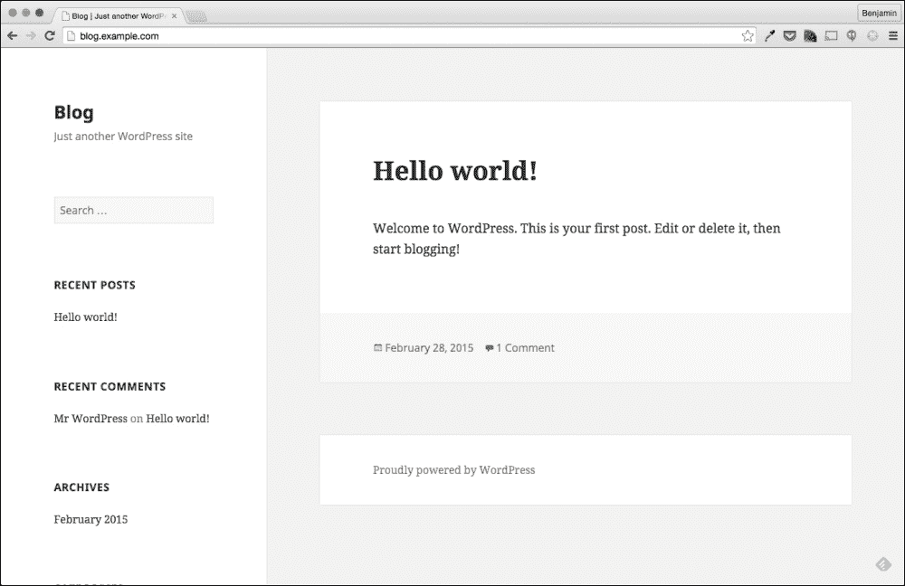

# 第十二章。 意外重启的根本原因分析

在最后一章中，我们将测试您在前几章中学到的故障排除方法和技能。 我们将对最困难的现实场景之一执行根本原因分析:意外重启。

正如我们在[第 1 章](01.html#DB7S1-8ae10833f0c4428b9e1482c7fee089b4 "Chapter 1. Troubleshooting Best Practices")、*故障排除最佳实践*中所讨论的，根本原因分析比简单地故障排除和解决问题要复杂得多。 在企业环境中，您将发现导致重大影响的每个问题都需要进行根本原因分析(RCA)。 原因在于，企业环境通常具有既定的处理事件的流程。

一般来说，当重大事件发生时，受其影响的组织希望避免再次发生。 你可以在很多行业看到这一点，甚至在技术环境之外。

正如我们在[第一章](01.html#DB7S1-8ae10833f0c4428b9e1482c7fee089b4 "Chapter 1. Troubleshooting Best Practices")，*故障排除最佳实践*中所讨论的，一个有用的 RCA 具有以下特征:

*   正如报道的那样
*   问题的真正根源
*   事件和行动的时间表
*   任何关键数据点
*   防止事故再次发生的行动计划

对于今天的问题，我们将使用一个事件来构建一个示例根本原因分析文档。 为此，我们将使用您在前几章中学到的信息收集和故障排除步骤。 在进行所有这些操作的同时，您还将学习如何处理意外重启，这是识别根本原因的最糟糕事件之一。

意外重新引导之所以困难的原因是，当系统重新引导时，您经常会丢失识别问题根源所需的信息。 正如我们在前面章节中看到的，我们在问题期间收集的数据越多，我们就越有可能确定问题的原因。

在重新引导期间丢失的信息通常是确定根本原因和不确定根本原因的区别。

# 深夜警报

随着我们在章节中取得进展，并为我们最近的雇主解决了许多问题，我们也获得了他们对我们能力的信心。 最近，我们甚至被置于**on call**的旋转状态，这意味着如果几个小时后出现问题，我们的手机将通过短信发送警报。

当然，当值的第一个晚上我们就得到了警报; 这不是一个好的警报。

*ALERT: blog.example.com is no longer responding to ICMP ping*

当我们被加入随叫随到轮值时，我们的团队领导通知我们，任何在下班后发生的重大事件也必须进行 RCA。 这样做的原因是为了让我们小组中的其他人能够学习和理解我们为解决问题所做的事情，以及如何防止它再次发生。

正如我们前面所讨论的，一个有用的 RCA 的关键组件之一是列出事情发生的时间。 时间轴中的主要事件是我们收到警报的时间; 根据我们的短信，我们可以看到，我们收到警报在 2015 年 7 月 05 日 01:52 或更确切地说; 7 月 5 日凌晨 1 点 52 分(欢迎随叫随到!)

# 发现问题

从警报中，我们可以看到我们的监控系统无法向我们公司的博客服务器执行`ICMP`ping。 我们应该做的第一件事是确定我们是否可以`ping`服务器:

```sh
$ ping blog.example.com
PING blog.example.com (192.168.33.11): 56 data bytes
64 bytes from 192.168.33.11: icmp_seq=0 ttl=64 time=0.832 ms
64 bytes from 192.168.33.11: icmp_seq=1 ttl=64 time=0.382 ms
64 bytes from 192.168.33.11: icmp_seq=2 ttl=64 time=0.240 ms
64 bytes from 192.168.33.11: icmp_seq=3 ttl=64 time=0.234 ms
^C
--- blog.example.com ping statistics ---
4 packets transmitted, 4 packets received, 0.0% packet loss
round-trip min/avg/max/stddev = 0.234/0.422/0.832/0.244 ms

```

似乎我们能够 ping 出问题的服务器，所以也许这是一个错误的警报? 以防万一，让我们尝试登录到系统:

```sh
$ ssh 192.168.33.11 -l vagrant
vagrant@192.168.33.11's password: 
$

```

看来我们可以登录系统了，系统已经开始运行了; 让我们开始四处看看，看看是否有什么问题。

如前一章所述，我们总是运行的第一个命令是`w`:

```sh
$ w
01:59:46 up 9 min,  1 user,  load average: 0.00, 0.01, 0.02
USER     TTY        LOGIN@   IDLE   JCPU   PCPU WHAT
vagrant  pts/0     01:59    2.00s  0.03s  0.01s w

```

在这个例子中，这个小习惯实际上得到了很好的回报。 通过`w`命令的输出，我们可以看到该服务器只启动了`9`分钟。 似乎我们的监控系统无法 ping 通我们的服务器，因为它正在重新启动。

### 提示

我们应该注意，我们能够识别服务器在登录后重新启动; 这将是我们时间表上的关键事件。

## 有人重启服务器了吗?

虽然我们已经确定了警报的根本原因，但这不是问题的根本原因。 我们需要确定服务器重启的原因。 服务器不经常(至少不应该)重新启动; 有时它可能只是某个在此服务器上执行维护而不让其他人知道的人。 我们可以看到最近是否有人使用`last`命令登录到这个服务器:

```sh
$ last
vagrant  pts/0        192.168.33.1     Sun Jul  5 01:59   still logged in 
joe  pts/1        192.168.33.1     Sat Jun  6 18:49 - 21:37  (02:48) 
bob  pts/0        10.0.2.2         Sat Jun  6 18:16 - 21:37  (03:21) 
billy  pts/0        10.0.2.2         Sat Jun  6 17:09 - 18:14  (01:05) 
doug  pts/0        10.0.2.2         Sat Jun  6 15:26 - 17:08  (01:42) 

```

`last`命令的输出以最上面的最新登录开始。 该数据从用于存储登录详细信息的`/var/log/wtmp`中提取。 在最后一个命令输出的末尾，我们看到以下一行:

```sh
wtmp begins Mon Jun 21 23:39:24 2014

```

这告诉我们`wtmp`日志文件的历史有多久远; 非常有用的信息。 如果我们想要查看特定的登录数量，我们可以简单地添加`–n`标志，后面跟着我们希望看到的登录数量。

这在一般情况下是非常有用的; 但是，由于我们不知道这台机器上最近有多少次登录，所以我们只使用默认值。

从我们收到的输出，我们可以看到这台服务器最近没有任何登录。 除了有人实际按下电源按钮或拔掉这个系统，我们可以假设有人没有重新启动服务器。

### 提示

这是我们应该在时间轴中使用的另一个事实/事件。

## 日志告诉我们什么?

由于一个人没有重新启动该服务器，我们的下一个假设是，该服务器是由于软件或硬件问题重新启动的。 我们的下一个逻辑步骤是查看系统日志文件，以确定发生了什么:

```sh
01:59:46 up 9 min,  1 user,  load average: 0.00, 0.01, 0.02

```

在`w`的输出中，我们看到服务器已经启动了`9`分钟，而该命令的执行时间是`01:59`。 因为我们要查看这个系统上的日志，所以我们应该开始查看从`01:45`到`01:52`的时间窗口。

我们应该查看的第一个日志是`/var/log/messages`日志。 默认情况下，在基于 Red Hat 的系统上，该日志文件包含所有信息和更高级别的日志消息。 这意味着，如果我们想找到关于我们为什么重启的信息，那么这里就是主要位置。

下面的代码片段是使用`less`命令读取`/var/log/messages`的:

```sh
Jul  5 01:48:01 localhost auditd[560]: Audit daemon is low on disk space for logging
Jul  5 01:48:01 localhost auditd[560]: Audit daemon is suspending logging due to low disk space.
Jul  5 01:50:02 localhost watchdog[608]: loadavg 25 9 3 is higher than the given threshold 24 18 12!
Jul  5 01:50:02 localhost watchdog[608]: shutting down the system because of error -3
Jul  5 01:50:12 localhost rsyslogd: [origin software="rsyslogd" swVersion="7.4.7" x-pid="593" x-info="http://www.rsyslog.com"] exiting on signal 15.
Jul  5 01:50:32 localhost systemd: Time has been changed
Jul  5 01:50:32 localhost NetworkManager[594]: <info> dhclient started with pid 722
Jul  5 01:50:32 localhost NetworkManager[594]: <info> Activation (enp0s3) Stage 3 of 5 (IP Configure Start) complete.
Jul  5 01:50:32 localhost vboxadd-service: Starting VirtualBox Guest Addition service [  OK  ]
Jul  5 01:50:32 localhost systemd: Started LSB: VirtualBox Additions service.
Jul  5 01:50:32 localhost dhclient[722]: Internet Systems Consortium DHCP Client 4.2.5
Jul  5 01:50:32 localhost dhclient[722]: Copyright 2004-2013 Internet Systems Consortium.
Jul  5 01:50:32 localhost dhclient[722]: All rights reserved.
Jul  5 01:50:32 localhost dhclient[722]: For info, please visit https://www.isc.org/software/dhcp/
Jul  5 01:50:32 localhost dhclient[722]: 
Jul  5 01:50:32 localhost NetworkManager: Internet Systems Consortium DHCP Client 4.2.5
Jul  5 01:50:32 localhost NetworkManager: Copyright 2004-2013 Internet Systems Consortium.
Jul  5 01:50:32 localhost NetworkManager: All rights reserved.
Jul  5 01:50:32 localhost NetworkManager: For info, please visit https://www.isc.org/software/dhcp/
Jul  5 01:50:32 localhost NetworkManager[594]: <info> (enp0s3): DHCPv4 state changed nbi -> preinit
Jul  5 01:50:32 localhost dhclient[722]: Listening on LPF/enp0s3/08:00:27:20:5d:4b
Jul  5 01:50:32 localhost dhclient[722]: Sending on   LPF/enp0s3/08:00:27:20:5d:4b
Jul  5 01:50:32 localhost dhclient[722]: Sending on   Socket/fallback
Jul  5 01:50:32 localhost dhclient[722]: DHCPREQUEST on enp0s3 to 255.255.255.255 port 67 (xid=0x3ae55b57)

```

由于这里有相当多的信息，让我们把我们看到的分解一点。

第一个任务是查找在引导时清楚地写入的日志消息。 通过识别在引导时写入的日志消息，我们将能够识别在重新引导之前和之后写入了哪些日志。 我们还可以为我们的根本原因文档确定一个引导时间:

```sh
Jul  5 01:50:12 localhost rsyslogd: [origin software="rsyslogd" swVersion="7.4.7" x-pid="593" x-info="http://www.rsyslog.com"] exiting on signal 15.
Jul  5 01:50:32 localhost systemd: Time has been changed
Jul  5 01:50:32 localhost NetworkManager[594]: <info> dhclient started with pid 722
Jul  5 01:50:32 localhost NetworkManager[594]: <info> Activation (enp0s3) Stage 3 of 5 (IP Configure Start) complete.

```

第一个看起来有希望的日志条目是来自`NetworkManager`的`01:50:32`的消息。 此消息表示`NetworkManager`服务已启动`dhclient`。

`dhclient`进程用于发起 DHCP 请求，并根据应答进行网络配置。 这个进程通常只在网络重新配置或启动时调用:

```sh
Jul  5 01:50:12 localhost rsyslogd: [origin software="rsyslogd" swVersion="7.4.7" x-pid="593" x-info="http://www.rsyslog.com"] exiting on signal 15.

```

如果我们看前面的一行，我们可以看到在 01:50:12，`rsyslogd`过程是`exiting on signal 15`。 这意味着，`rsyslogd`进程被发送一个终止信号，这是关机期间的一个相当标准的进程。

我们可以确定在 01:50:12 服务器处于关机进程，在 01:50:32 服务器处于引导进程。 这意味着，我们应该查看 01:50:12 之前的所有内容，以确定为什么系统重新启动。

### 提示

我们的根本原因时间线也需要关机时间和开机时间。

从前面捕获的日志中，我们可以看到在 01:50 之前写入到`/var/log/messages`的两个进程; `auditd`和看门狗进程。

```sh
Jul  5 01:48:01 localhost auditd[560]: Audit daemon is low on disk space for logging
Jul  5 01:48:01 localhost auditd[560]: Audit daemon is suspending logging due to low disk space.

```

让我们先来看看`auditd`过程。 我们可以在第一行中看到一条“磁盘空间不足”的消息。 我们的系统是否会因为磁盘空间不足而出现问题? 这是有可能的，我们现在就可以检查:

```sh
# df -h
Filesystem               Size  Used Avail Use% Mounted on
/dev/mapper/centos-root   39G   39G   32M 100% /
devtmpfs                 491M     0  491M   0% /dev
tmpfs                    498M     0  498M   0% /dev/shm
tmpfs                    498M  6.5M  491M   2% /run
tmpfs                    498M     0  498M   0% /sys/fs/cgroup
/dev/sda1                497M  104M  394M  21% /boot

```

看起来文件系统确实是 100%的，但是类似这样的事情本身通常不会导致重新引导。 考虑到第二个`auditd`消息显示**，守护进程正在暂停日志记录**; 这看起来也不像一个重启过程。 让我们继续看，看看我们还能发现什么:

```sh
Jul  5 01:50:02 localhost watchdog[608]: loadavg 25 9 3 is higher than the given threshold 24 18 12!
Jul  5 01:50:02 localhost watchdog[608]: shutting down the system because of error -3

```

来自`watchdog`流程的下面两个消息很有趣。 第一个声明服务器的`loadavg`高于指定的阈值。 第二个消息非常有趣，因为它明确表示，“关闭系统”。

`watchdog`进程是否重新启动了此服务器? 也许吧，但第一个问题是，`watchdog`的过程是什么?

## 了解新的流程和服务

从`messages`日志中挖掘以找到一个你从未使用过或见过的进程，这并不罕见:

```sh
# ps -eo cmd | sort | uniq | wc -l
115

```

即使在我们的基本示例系统中，进程列表中也有 115 个惟一的命令。 当您添加一个更新的版本，比如 Red Hat Enterprise Linux 7(在编写本文时更新)时，这一点尤其正确。 每个新版本都会带来新的功能，这甚至可能意味着默认情况下会运行新的进程。 要跟上这一切是很困难的。

就我们的例子而言，`watchdog`就是其中之一。 在这一点上，除了从它的名称推断它监视事物之外，我们不知道这个过程做什么。 那么我们如何了解更多呢? 我们要么谷歌它，要么`man`它:

```sh
$ man watchdog
NAME
 watchdog - a software watchdog daemon

SYNOPSIS
 watchdog [-F|--foreground] [-f|--force] [-c filename|--config-file filename] [-v|--verbose] [-s|--sync] [-b|--softboot] [-q|--no-action]

DESCRIPTION
 The  Linux  kernel  can  reset  the system if serious problems are detected.  This can be implemented via special watchdog hardware, or via a slightly less reliable software-only watchdog inside the kernel. Either way, there needs to be a daemon that tells the kernel the system is working fine. If the daemon stops doing that, the system is reset.

 watchdog is such a daemon. It opens /dev/watchdog, and keeps writing to it often enough to keep the kernel from resetting, at least once per minute. Each write delays the reboot time another minute. After a minute  of  inactivity the watchdog hardware will cause the reset. In the case of the software watchdog the ability to reboot will depend on the state of the machines and interrupts.

 The watchdog daemon can be stopped without causing a reboot if the device /dev/watchdog is closed correctly, unless your kernel is compiled with the CONFIG_WATCHDOG_NOWAYOUT option enabled.

```

根据`man`页面，我们确定了`watchdog`服务实际上用于确定服务器是否健康。 如果`watchdog`不能这样做，它可能会重新启动服务器:

```sh
Jul  5 01:50:02 localhost watchdog[608]: shutting down the system because of error -3

```

从这个日志信息看来，看门狗软件是导致重启的一个。 可能是看门狗重新启动了系统，因为文件系统已满?

如果我们继续到`man`页，我们会看到另一个有用的信息，如下所示:

```sh
TESTS
 The watchdog daemon does several tests to check the system status:

 ·  Is the process table full?

 ·  Is there enough free memory?

 ·  Are some files accessible?

 ·  Have some files changed within a given interval?

 ·  Is the average work load too high?

```

在这个列表中的最后一个“`test`”中，它表示`watchdog`守护进程可以检查平均工作负载是否过高:

```sh
Jul  5 01:50:02 localhost watchdog[608]: loadavg 25 9 3 is higher than the given threshold 24 18 12!

```

根据`man`页面和前面的日志消息，`watchdog`似乎不是因为文件系统而重新引导服务器，而是由于服务器的平均负载。

### 提示

在进一步讨论之前，让我们注意到，在 01:50:02，`watchdog`进程启动了重新引导。

# 是什么导致了高平均负载?

虽然我们已经确定了是什么重新启动了服务器，但我们仍然没有找到问题的根本原因。 我们还得搞清楚是什么导致了高平均负载。 不幸的是，这将归类为在重新引导期间丢失的信息。

如果系统的平均负载仍然很高，那么我们只需使用`top`或`ps`来确定哪个进程使用了最多的 CPU 时间。 但是，一旦系统重新启动，任何导致高平均负载的进程都将被重新启动。

除非这些进程开始再次导致高平均负载，否则我们无法确定源。

```sh
$ w
 02:13:07 up  23 min,  1 user,  load average: 0.00, 0.01, 0.05
USER     TTY        LOGIN@   IDLE   JCPU   PCPU WHAT
vagrant  pts/0     01:59    3.00s  0.26s  0.10s sshd: vagrant [priv]

```

然而，我们能够确定平均负载何时开始增加，以及增加到多高。 当我们进一步调查时，这些信息可能会很有用，因为我们可以用它来确定事情是什么时候开始出错的。

要查看平均负载的历史视图，我们可以使用`sar`命令:

```sh
$ sar

```

幸运的是，`sar`命令的收集间隔似乎被设置为每`2`分钟。 默认值是 10 分钟，这意味着我们通常会看到每 10 分钟一行:

```sh
01:42:01 AM    all    0.01    0.00    0.06     0.00     0.00    99.92
01:44:01 AM    all    0.01    0.00    0.06     0.00     0.00    99.93
01:46:01 AM    all    0.01    0.00    0.06     0.00     0.00    99.93
01:48:01 AM    all   33.49    0.00    2.14     0.00     0.00    64.37
01:50:05 AM    all   87.80    0.00   12.19     0.00     0.00     0.01
Average:       all    3.31    0.00    0.45     0.00     0.00    96.24

01:50:23 AM       LINUX RESTART

01:52:01 AM   CPU   %user   %nice   %system   %iowait   %steal  %idle
01:54:01 AM   all   0.01    0.00     0.06     0.00       0.00   99.93
01:56:01 AM   all   0.01    0.00     0.05     0.00       0.00   99.94
01:58:01 AM   all   0.01    0.00     0.05     0.00       0.00   99.94
02:00:01 AM   all   0.03    0.00     0.10     0.00       0.00   99.87

```

查看输出，我们可以看到在`01:46`，这个系统几乎没有任何 CPU 占用。 但是，从`01:48`开始，用户空间中的 CPU 利用率为`33`%。

似乎在`01:50`时，`sar`能够捕获正在使用的`99.99`百分比的 CPU 利用率，其中`87.8`百分比由用户使用，`12.19`百分比由系统使用。

### 提示

在我们的根本原因总结中，以上都是很好的事实。

有了这个，我们现在知道我们的问题是在`01:44`和`01:46`之间的某个时间开始的，我们可以从 CPU 使用情况中看到这一点。

让我们看看带有`–q`标志的平均负载，看看平均负载是否与 CPU 利用率匹配:

```sh
# sar -q
Again, we can narrow events down even further:
01:42:01 AM        0      145     0.00      0.01      0.02         0
01:44:01 AM        0      145     0.00      0.01      0.02         0
01:46:01 AM        0      144     0.00      0.01      0.02         0
01:48:01 AM       14      164     4.43      1.12      0.39         0
01:50:05 AM       37      189    25.19      9.14      3.35         0
Average:           1      147     0.85      0.30      0.13         0

01:50:23 AM       LINUX RESTART

01:52:01 AM   runq-sz  plist-sz  ldavg-1   ldavg-5  ldavg-15  blocked
01:54:01 AM         0       143     0.01      0.04      0.02        0
01:56:01 AM         1       138     0.00      0.02      0.02        0
01:58:01 AM         0       138     0.00      0.01      0.02        0
02:00:01 AM         0       141     0.00      0.01      0.02        0

```

通过**平均负载**的测量，我们可以看到在`01:46`时，尽管 CPU 很高，但一切都很安静。 然而，在下一次以`01:48`运行时，我们可以看到**运行队列**为 14，而 1 分钟负载平均为 4。

## 运行队列和平均负载是多少?

因为我们正在查看运行队列和平均负载，所以让我们花点时间来理解这些值的含义。

在一个非常基本的概念中，运行队列值显示处于活动状态等待执行的进程数量。

要了解更多细节，让我们考虑 CPU 及其工作原理。 一个 CPU 一次只能执行一个任务。 现在大多数服务器都有多个核心，有时每个服务器有多个处理器。 在 Linux 上，每个内核和线程(对于超线程 CPU 来说)都被视为一个 CPU。

每个 cpu一次只能执行一个任务。 如果我们有两个 CPU 服务器，我们的服务器可以一次执行两个任务。

让我们假设我们的 2 个 CPU 系统需要同时执行 4 个任务。 系统可以执行其中的两个任务，但其他两个任务必须等待前两个任务完成。 当这种情况发生时，正在等待的进程被放入一个“运行队列”。 当系统在运行队列中有进程时，它们将被优先排序并在 CPU 可用时执行。

在我们的`sar`捕获中，我们可以看到在 01:48 时运行队列的值是 14; 这意味着在那一刻，有 14 个任务在运行队列中等待 CPU。

### 平均负载

平均负载与运行队列有一点不同，但不是很大。 平均负载是给定时间内的平均运行队列值。 在前面的示例中，我们可以看到`ldavg-1`(这一列是最后一分钟的平均运行队列长度)。

运行队列值和 1 分钟平均负载可能不同，因为`sar`报告的运行队列值是在执行时，1 分钟平均负载是运行队列在 60 秒内的平均负载。

```sh
01:46:01 AM        0      144      0.00      0.01      0.02         0
01:48:01 AM       14      164      4.43      1.12      0.39         0
01:50:05 AM       37      189     25.19      9.14      3.35         0

```

对高运行队列的单个捕获可能并不一定意味着存在问题，特别是在 1 分钟平均负载不高的情况下。 然而，在我们的示例中，我们可以看到在`01:48`，我们的运行队列有 14 个任务在队列中，而在`01:50`，我们的运行队列有 37 个任务在队列中。

最重要的是，我们可以看到在`01:50`，我们的 1 分钟平均负载是 25。

考虑到 CPU 利用率的重叠，似乎在 01:46 - 01:48 左右发生了一些事情，导致了较高的 CPU 利用率。 除了这种高利用率之外，还存在许多需要执行但却无法执行的任务。

### 提示

我们应该花点时间并记录我们在`sar`中看到的时间和值，因为这些将是根本原因总结的必要细节。

# 检查文件系统是否已满

早些时候，我们注意到文件系统是 100%满的。 不幸的是，我们安装的`sysstat`版本不能捕获磁盘空间的使用情况。 一个需要识别的有用的东西是，当文件系统被填满的时候，与我们的运行队列开始增加的时候相比:

```sh
Jul  5 01:48:01 localhost auditd[560]: Audit daemon is low on disk space for logging
Jul  5 01:48:01 localhost auditd[560]: Audit daemon is suspending logging due to low disk space.

```

从前面看到的日志消息中，我们可以看到`auditd`进程在`01:48`处标识了低磁盘空间。 这非常接近我们的运行队列峰值出现的时间。

这是建立在一个假设基础上的，即问题的根本原因是文件系统被填满，这导致进程要么启动许多 CPU 密集型任务，要么为其他任务阻塞 CPU。

虽然这是一个合理的理论，但我们必须证明它是正确的。 我们可以进一步证明这一点的一种方法是确定是什么在这个系统上占用了大部分磁盘空间:

```sh
# du -k / | sort -nk 1 | tail -25
64708  /var/cache/yum/x86_64/7/epel
67584  /var/cache/yum/x86_64/7/base
68668  /usr/lib/firmware
75888  /usr/lib/modules/3.10.0-123.el7.x86_64/kernel/drivers
80172  /boot
95384  /usr/share/locale
103548  /usr/lib/locale
105900  /usr/lib/modules/3.10.0-123.el7.x86_64/kernel
116080  /usr/lib/modules
116080  /usr/lib/modules/3.10.0-123.el7.x86_64
148276  /usr/bin
162980  /usr/lib64
183640  /var/cache/yum
183640  /var/cache/yum/x86_64
183640  /var/cache/yum/x86_64/7
184396  /var/cache
285240  /usr/share
317628  /var
328524  /usr/lib
1040924  /usr
2512948  /opt/myapp/logs
34218392  /opt/myapp/queue
36731428  /opt/myapp
36755164  /opt
38222996  /

```

前面的一行程序对于确定哪个目录或文件使用了最多的空间是非常有用的方法。

## du 命令

前面的一行程序使用`sort`命令对`du`的输出进行排序，您在[第 11 章](11.html#26I9K2-8ae10833f0c4428b9e1482c7fee089b4 "Chapter 11. Recovering from Common Failures")、*从常见故障中恢复*中了解了该命令。 `du`命令是一个非常有用的命令，它可以估计给定目录所使用的空间量。

例如，如果我们想知道`/var/tmp`目录使用了多少空间，我们可以很容易地通过下面的`du`命令来确定:

```sh
# du -h /var/tmp
0  /var/tmp/systemd-private-Wu4ixe/tmp
0  /var/tmp/systemd-private-Wu4ixe
0  /var/tmp/systemd-private-pAN90Q/tmp
0  /var/tmp/systemd-private-pAN90Q
160K  /var/tmp

```

`du`的一个有用属性是，默认情况下，它不仅会列出`/var/tmp`，还会列出其中的目录。 我们可以看到有几个目录中什么都没有，但是`/var/tmp/`目录包含 160kb 的数据。

```sh
# du -h /var/tmp/
0  /var/tmp/systemd-private-Wu4ixe/tmp
0  /var/tmp/systemd-private-Wu4ixe
0  /var/tmp/systemd-private-pAN90Q/tmp
0  /var/tmp/systemd-private-pAN90Q
4.0K  /var/tmp/somedir
164K  /var/tmp/

```

### 注意事项

重要的是要知道，`/var/tmp`的大小就是`/var/tmp`内内容的大小，其中包括其他子目录。

为了说明前面的要点，我创建了一个名为“`somedir`”的目录，并在其中放置了一个 4 kb 的文件。 我们可以从随后的`du`命令中看到，`/var/tmp`目录现在显示使用了 164 kb。

`du`命令有许多标志，允许我们更改它输出磁盘使用情况的方式。 在前面的示例中，由于使用了`–h`标志，这些值以人类可读的格式打印。 在一行代码中，由于`–k`标志，这些值以千字节表示:

```sh
2512948  /opt/myapp/logs
34218392  /opt/myapp/queue
36731428  /opt/myapp
36755164  /opt
38222996  /

```

如果我们回到一行程序，我们可以从输出中看到，从`/`中使用的 38 GB, 34 GB 在`/opt/myapp/queue`目录中。 这个目录对我们来说非常熟悉，因为我们在前面的章节中对这个目录进行了故障诊断。

根据我们以前的经验，我们知道这个目录用于对通过自定义应用程序接收的消息进行队列。

根据这个目录的大小，可能在重新引导之前，自定义应用程序在这个服务器上运行并填满了文件系统。

我们已经知道这个目录占用了系统上的大部分空间。 确定这个目录下的最后一个文件是什么时候创建的是很有用的，因为这将给我们一个粗略的时间框架，知道这个应用程序最后一次运行的时间:

```sh
# ls -l
total 368572
drwxrwxr-x. 2 vagrant vagrant        40 Jun 10 17:03 bin
drwxrwxr-x. 2 vagrant vagrant        23 Jun 10 16:55 conf
drwxrwxr-x. 2 vagrant vagrant        49 Jun 10 16:40 logs
drwxr-xr-x. 2 root    root    272932864 Jul  5 01:50 queue
-rwxr-xr-x. 1 vagrant vagrant       116 Jun 10 16:56 start.sh

```

我们可以通过在`/opt/myapp`目录中执行`ls`来实现这一点。 从上面的输出可以看出，`queue/`目录最后一次修改是在 7 月 5 日 01:50。 这与我们的问题很好地相关，至少证明了自定义应用程序是在重新引导之前运行的。

### 提示

这个目录最后一次更新的时间戳和这个应用程序正在运行的事实都是我们将在总结中标注的项。

根据前面的信息，此时我们可以有把握地说，在事件发生时，自定义应用程序正在运行，并且已经创建了足够多的文件来填满文件系统。

我们还可以说，在文件系统使用率达到 100%的时候，服务器的平均负载突然出现了峰值。

根据这些事实，我们可以创造一个假设; 我们当前的工作原理是，一旦应用程序填充了文件系统，它就不能再创建文件了。 这可能会导致同一个应用程序阻塞 CPU 时间或产生许多 CPU 任务，从而导致较高的平均负载。

## 为什么没有处理队列目录?

因为我们知道自定义的应用程序是文件系统问题的根源，所以我们还需要回答为什么。

在前面的章节中，您了解到此应用程序的队列目录由作为“`vagrant`”用户运行的`cronjob`处理。 让我们通过查看`/var/log/cron`日志文件来看看 cron 作业最后一次运行是什么时候:

```sh
Jun  6 15:28:01 localhost CROND[3115]: (vagrant) CMD (/opt/myapp/bin/processor --debug --config /opt/myapp/conf/config.yml > /dev/null)

```

根据`/var/log/cron`目录，作业最后一次运行是`June 6th`。 这个时间轴大致与此进程被移动到另一个系统的时间轴一致，在此之后服务器耗尽了内存。

是否可能是处理器作业已经停止，而应用程序没有停止? 可能，我们知道应用程序正在运行，但是让我们检查一下`processor`作业。

我们可以使用`crontab`命令检查处理器作业是否已被移除:

```sh
# crontab -l -u vagrant
#*/4 * * * * /opt/myapp/bin/processor --debug --config /opt/myapp/conf/config.yml > /dev/null

```

`–l`(list)标志将导致`crontab`命令打印或列出为执行该命令的用户定义的 cronjobs。 当添加`-u`(user)标志时，它允许我们指定一个用户来列出`vagrant`用户的 cronjob。

从列表中可以看出，`processor`作业并没有被删除，而是被禁用了。 我们可以看到它已被禁用，因为该行以`#`开头，它用于指定`crontab`文件中的注释。

这本质上把作业变成了一个注释，而不是一个预定的作业。 这意味着`crond`进程将不会执行此作业。

## 一个关于你所学内容的检查点

现在，让我们对能够识别和收集的内容进行检查。

登录到系统后，我们能够确定服务器已经重新启动。 我们可以在`/var/log/messages`中看到`watchdog`进程负责重新启动服务器:

```sh
Jul  5 01:50:02 localhost watchdog[608]: loadavg 25 9 3 is higher than the given threshold 24 18 12!

```

看门狗进程根据`/var/log/messages`日志提示，由于服务器负载过高重启服务器。 从`sar`可以看到，负载平均在几分钟内从 0 上升到 25。

在执行我们的调查时，我们还能够确定服务器的`/`(根)文件系统已满。 它不仅是满的，而且有趣的是，在系统重新启动前的几分钟，它的利用率大约是 100%。

文件系统处于这种状态的原因是`/opt/myapp`中的自定义应用程序仍然在`/opt/myapp/queue`中运行并创建文件。 但是，清除该队列的作业没有运行，因为它已经在流浪用户的`crontab`中被注释掉了。

基于此，我们可以说问题的根本原因很可能是由于文件系统被填满，这是由于应用程序正在运行但没有处理消息。

### 有时你无法证明一切

现在，我们已经确定了导致高平均负载的所有原因。 由于我们没有事件发生时正在运行的进程的快照，所以我们不能肯定地说它是自定义应用程序。 根据所收集到的信息，我们也不能肯定地说它是由于文件系统已满而触发的。

我们可以通过在另一个系统中复制这个场景来测试这个理论，但这并不一定是在周末凌晨 2 点进行的事情。 将问题复制到那种程度通常需要作为后续活动来执行。

在这一点上，根据我们所能找到的数据，我们可以合理地确定根本原因。 在许多情况下，这是您所能得到的最接近的结果，因为您可能没有时间来收集或根本没有数据来根据您的根本原因。

# 防止再次发生

由于我们对所发生的事情的假设非常有信心，现在我们可以进入根本原因分析的最后一步; 防止问题再次发生。

正如我们在本章开头所讨论的，所有有用的根本原因分析报告都包括一个行动计划。 有时，这个行动计划是在问题发生时立即执行的。 有时，这个计划是以后作为一个长期的决议来执行的。

对于我们的问题，我们将同时采取立即行动和长期行动。

## 立即行动

我们需要立即采取的第一个行动是确保系统的主要功能是健康的。 在这种情况下，服务器的主要功能是为公司的博客提供服务。



通过在浏览器中访问博客地址，这很容易检查。 我们可以从前面的屏幕截图中看到，这个博客正在按预期工作。 为了确保，我们可以验证 Apache 服务是否也在运行:

```sh
# systemctl status httpd
httpd.service - The Apache HTTP Server
 Loaded: loaded (/usr/lib/systemd/system/httpd.service; enabled)
 Active: active (running) since Sun 2015-07-05 01:50:36 UTC; 3 days ago
 Main PID: 1015 (httpd)
 Status: "Total requests: 0; Current requests/sec: 0; Current traffic:   0 B/sec"
 CGroup: /system.slice/httpd.service
 ├─1015 /usr/sbin/httpd -DFOREGROUND
 ├─2315 /usr/sbin/httpd -DFOREGROUND
 ├─2316 /usr/sbin/httpd -DFOREGROUND
 ├─2318 /usr/sbin/httpd -DFOREGROUND
 ├─2319 /usr/sbin/httpd -DFOREGROUND
 ├─2321 /usr/sbin/httpd -DFOREGROUND
 └─5687 /usr/sbin/httpd -DFOREGROUND

Jul 05 01:50:36 blog.example.com systemd[1]: Started The Apache HTTP Server.

```

从这一点来看，我们的 web 服务器在重启后一直处于在线状态，这很好，因为这意味着博客在重启后也一直在工作。

### 提示

有时，根据系统的临界程度，甚至在调查问题之前，首先验证系统是否启动并运行可能是很重要的。 就像任何事情一样，这真的取决于环境，因为有严格的规则来决定谁先来。

既然我们知道 blog 按预期工作，那么我们需要解决磁盘已满的问题。

```sh
# ls -la /opt/myapp/queue/ | wc -l
495151

```

与前面的章节一样，似乎`queue`目录有相当多的消息等待处理。 为了正确地清除这个问题，我们需要手动运行`processor`命令，但是我们也必须采取一些额外的步骤:

```sh
# sysctl -w fs.file-max=500000
fs.file-max = 500000

```

我们必须采取的第一步是增加系统一次可以打开的文件数量。 我们从过去处理处理器应用程序和大量消息的经验中了解到这一点。

```sh
# su - vagrant
$ ulimit -n 500000
$ ulimit -a
core file size          (blocks, -c) 0
data seg size           (kbytes, -d) unlimited
scheduling priority             (-e) 0
file size               (blocks, -f) unlimited
pending signals                 (-i) 7855
max locked memory       (kbytes, -l) 64
max memory size         (kbytes, -m) unlimited
open files                      (-n) 500000
pipe size            (512 bytes, -p) 8
POSIX message queues     (bytes, -q) 819200
real-time priority              (-r) 0
stack size              (kbytes, -s) 8192
cpu time               (seconds, -t) unlimited
max user processes              (-u) 4096
virtual memory          (kbytes, -v) unlimited
file locks                      (-x) unlimited

```

第二步是增加施加给`vagrant`用户的用户限制; 具体来说，是打开文件的数量限制。 这个步骤需要在我们将要执行`processor`命令的同一个 shell 会话中执行。 一旦该步骤完成，我们可以手动执行`processor`命令来处理排队的消息:

```sh
$ /opt/myapp/bin/processor --debug --config /opt/myapp/conf/config.yml
Initializing with configuration file /opt/myapp/conf/config.yml
- - - - - - - - - - - - - - - - - - - - - - - - - -
Starting message processing job
Added 495151 to queue
Processing 495151 messages
Processed 495151 messages

```

现在消息已经处理完毕，我们可以使用`df`命令重新检查文件系统的利用率:

```sh
# df -h
Filesystem               Size  Used Avail Use% Mounted on
/dev/mapper/centos-root   39G  3.8G   35G  10% /
devtmpfs                 491M     0  491M   0% /dev
tmpfs                    498M     0  498M   0% /dev/shm
tmpfs                    498M   13M  485M   3% /run
tmpfs                    498M     0  498M   0% /sys/fs/cgroup
/dev/sda1                497M  104M  394M  21% /boot

```

正如我们所看到的，`/`文件系统的利用率下降到了`10`百分比。

为了确保我们不会再次填满这个文件系统，我们验证自定义应用程序当前是否停止:

```sh
# ps -elf | grep myapp
0 R root      6535  2537  0  80   0 - 28160 -      15:09 pts/0    00:00:00 grep --color=auto myapp

```

因为我们看不到在应用程序名称下运行的任何进程，所以我们可以确定应用程序当前没有运行。

## 长期行动

这就引出了我们的**长期行动**。 长期行动是我们将在根本原因总结中建议的行动，但现在还没有采取。

对的第一个长期建议是将自定义应用程序永久地从系统中删除。 因为我们知道应用程序已经迁移到另一个系统，所以在这个服务器上应该不再需要它了。 然而，我们不应该在凌晨 2 点删除这个应用程序，或者在没有验证它真的不再需要的情况下删除它。

第二个长期操作是研究添加监视解决方案，该解决方案可以对正在运行的进程和这些进程的 CPU/状态进行定期快照。 如果我们在这次 RCA 调查中获得了这些信息，我们就能够毫无疑问地证明，是哪个过程导致了高负载。 由于无法获得这些信息，我们只能做出有根据的猜测。

再说一遍，这不是我们想要在深夜打电话时完成的任务，而是一个标准工作日的任务。

# 一个根本原因分析样本

现在我们已经获得了所需的所有信息，让我们创建一个根本原因分析报告。 实际上，这份报告可以采用任何格式，但我发现以下几条很管用。

## 问题总结

大约在 2015 年 7 月 5 日1:50 A.M.，服务器`blog.example.com`意外重启。 由于服务器上的平均负载很高，`watchdog`进程启动了重新引导进程。

经过调查，高平均负载似乎是由一个自定义电子邮件应用程序引起的，该应用程序虽然已迁移到另一个服务器，但仍处于运行状态。

从可用的数据来看，应用程序似乎消耗了 100%的根文件系统。

虽然我无法获得重启前的进程状态，但平均高负载似乎也可能是由于同一个应用程序无法写入磁盘。

## 问题细节

事件发生时间:2015 年 05 月 07 日`01:52`

事件发生的时间线是:

*   通过`01:52`发送的短信提示:`blog.example.com`无法通过 ICMP ping 到达。
*   执行的第一个故障排除步骤是 ping 服务器:
    *   ping 表明服务器处于在线状态
*   登录到服务器`01:59`，并确定服务器已经重新启动。
*   搜索`/var/log/messages`文件，发现看门狗进程在`01:50:12`重新启动服务器:
    *   由于平均负载过高，看门狗启动重启进程`01:50:02`
    *   在调查过程中，我们发现在事件发生时没有用户登录
    *   服务器在`01:50:32`启动引导进程
*   在调查期间，发现服务器在`01:48:01`处已经耗尽了可用磁盘空间。
*   该系统的平均负载大约在同一时间开始增加，在`01:50:05`达到 25。
*   我们发现`/opt/myapp/queue`目录最后一次修改是在`01:50`，并且包含大约 34 GB 的数据，创建了 100%的磁盘利用率:
    *   这表明自定义电子邮件应用程序一直在运行，直到服务器重新启动
*   我们发现`processor`作业自 6 月 6 日以来没有运行，这意味着消息没有被处理。

## 根本原因

由于自定义应用程序在没有通过 cron 执行`processor`作业的情况下运行，文件系统的利用率达到100%。 收集到的数据表明，这会导致较高的平均负载，从而触发`watchdog`进程重新引导服务器。

## 行动计划

我们应该有以下的步骤到位:

*   验证 Apache 正在运行且`Blog`可访问
*   验证自定义应用程序在系统重新启动后没有运行
*   在 02:15 手动执行处理器作业，解决磁盘空间问题

### 待采取的进一步行动

*   从服务器中删除自定义应用程序，以防止应用程序意外启动
*   研究进程列表监控的添加，以捕获在类似问题期间哪些进程正在利用 CPU 时间:
    *   将有助于解决任何类似的情况，如果他们发生

正如您在前面的报告中看到的，我们有一个高层次的时间表，展示了我们能够识别什么，我们如何识别它，以及我们为解决问题所采取的行动。 做好根本原因分析的所有关键部分。

# 总结

在本章中，我们介绍了如何应对一个非常困难的问题:意外重启。 我们使用贯穿本书的工具和方法来确定根本原因并创建一个根本原因报告。

我们在本书中大量使用日志文件; 在本章中，我们能够使用这些日志来识别重新启动服务器的进程。 我们还确定了`watchdog`决定重新启动服务器的原因，这是由于平均负载过高。

我们能够使用诸如`sar`、`df`、`du`和`ls`等工具来确定高平均负载的时间和原因。 所有这些工具都是您在本书中所学到的命令。

在最后一章中，我们介绍了本书前面提到的一些例子。 您学习了如何排除 web 应用程序、性能问题、自定义应用程序和硬件问题。 我们使用了现实世界的例子和现实世界的解决方案。

虽然本书涵盖了相当多的主题，但本书的目标是向您展示在 Red Hat Enterprise Linux 系统中故障诊断的概念。 这些示例可能很常见，也可能很少，但这些示例中使用的命令是日常故障排除过程中使用的命令。 所涵盖的所有主题都提供了 Linux 的核心能力，并将为您提供必要的知识，以排除本书未直接涉及的问题。