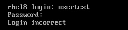

# 五、使用用户、组和权限保护系统

安全性是管理系统的关键部分，任何系统管理员都需要理解安全性概念，以便为正确的用户或用户组提供对正确资源的正确访问。

在本章中，我们将回顾在**Red Hat Enterprise Linux**(**RHEL**)中安全性的基础知识。 我们将向系统中添加新用户并更改其属性。 我们还将向组中添加一个用户，在进行更改之前检查组将在本章中看到。 我们将检讨如何处理用户密码、更改密码的年龄要求、锁定和/或限制用户访问。 我们将使用`sudo`作为一种方式，将管理员权限分配给系统中的不同用户(甚至禁用根帐户)。 我们还将深入研究文件权限以及如何更改它们，使用扩展功能使命令能够在不同的用户或组中运行，或简化目录中的组协作。

我们将涵盖以下议题:

*   创建、修改、删除本地用户帐号和组
*   管理小组和检查任务
*   调整密码策略
*   为管理任务配置 sudo 访问
*   检查、审查和修改文件权限
*   使用特殊的权限

让我们从用户帐户和组的权限和安全性开始。

# 创建、修改、删除本地用户帐号和组

的第一个任务,一个系统管理员当准备一个的用户系统访问是创建新用户帐户访问系统。 在本节中，我们将回顾如何创建和删除本地帐户，以及如何将它们分配给组。

第一步是在系统中创建一个新的用户帐户。 这可以通过使用`useradd`命令完成。 让我们通过运行以下命令将`user01`添加到系统中:

```sh
[root@rhel8 ~]# useradd user01
[root@rhel8 ~]# grep user01 /etc/passwd
user01:x:1001:1001::/home/user01:/bin/bash
[root@rhel8 ~]# id user01
uid=1001(user01) gid=1001(user01) groups=1001(user01)
```

这样就创建了用户。

重要提示

为了能够添加用户，我们需要管理权限。 在当前配置中，我们通过以`root`的形式运行命令来实现这一点。

该帐户使用系统默认选项创建，如下所示:

*   **No password assigned**:新用户将无法使用密码登录。 但是，我们可以使用`su`作为`root`切换到该帐户。 接下来我们将看到如何为用户添加密码。
*   **用户 ID (UID)**:999 以上的第一个号码。 在前面运行的命令中，对于`user01`，UID 是`1001`。
*   **组 ID (GID)**:与 UID 相同。 本例中 GID 为`1001`。
*   **Description**:创建用户时没有添加描述信息。 该字段为空。
*   **Home**:在`/home/$USER`中创建了一个`home`目录，本例中为`/home/user01`。 这将是用户的默认和主目录，是他们的个人偏好和文件将被存储的地方。 初始内容从`/etc/skel`复制。
*   **Shell**: The default shell is `bash`.

    提示

    创建新用户时应用的默认选项在`/etc/default/useradd`文件中定义。

一旦创建了用户，我们可以通过运行添加(或更改)密码，如`root`、命令`passwd`和用户名来更改密码:

```sh
[root@rhel8 ~]# passwd user01
Changing password for user user01.
New password: redhat
BAD PASSWORD: The password is shorter than 8 characters
Retype new password: redhat
passwd: all authentication tokens updated successfully
```

现在已经为用户分配了新密码。 注意两件事:

*   用户`root`可以在不知道前一个用户的情况下将密码更改为任何用户(即完全重置密码)。 当用户度假回来不记得密码时，这很有用。
*   在这个示例中，我们显示了所分配的密码`redhat`，但它没有显示在屏幕上。 但是，密码太简单了，不符合默认的复杂度标准，因为`root`我们仍然可以分配它。

让我们用之前学过的`id`命令来检查新用户:

```sh
[root@rhel8 ~]# id user01
uid=1001(user01) gid=1001(user01) groups=1001(user01)
```

在本节中采取的步骤之后，现在系统中有了用户，可以使用了。 我们可以用来用`useradd`定制用户创建的主要选项如下:

*   `-u`或`--uid`:指定用户 UID。
*   `-g`或`--gid`:为用户分配主组。 它可以通过编号(GID)或名称指定。 首先需要创建这个组。
*   `-G`或`--groups`:通过提供以逗号分隔的组列表，使其成为其他组的用户部分。
*   `-c`或`--comment`:提供用户的描述，如果要使用空格，在双引号之间指定。
*   `-d`或`--home-dir`:定义用户的主目录。
*   `-s`或`--shell`:为用户分配自定义 shell。
*   `-p`或`--password`:为用户提供密码的一种方式。 要使用这种方法，密码应该已经加密。 建议*而不是*使用此选项，因为有多种方法可以捕获加密的密码。 请用`passwd`代替。
*   `-r`或`--system`:创建系统帐户，而不是用户帐户。

如果我们需要更改用户的任何属性，比如描述，该怎么办? 这个工具是`usermod`。 让我们将描述修改为`user01`:

```sh
[root@rhel8 ~]# usermod -c "User 01" user01
[root@rhel8 ~]# grep user01 /etc/passwd
user01:x:1001:1001:User 01:/home/user01:/bin/bash
```

`usermod`命令使用与`useradd`相同的选项。 现在很容易自定义当前用户。

让我们创建`user02`作为如何使用选项的示例:

```sh
[root@rhel8 ~]# useradd --uid 1002 --groups wheel \
--comment "User 02" --home-dir /home/user02 \
--shell /bin/bash user02
[root@rhel8 ~]# grep user02 /etc/passwd
user02:x:1002:1002:User 02:/home/user02:/bin/bash
[root@rhel8 ~]# id user02
uid=1002(user02) gid=1002(user02) groups=1002(user02),10(wheel)
```

提示

当命令行太长时，可以添加字符`\`，然后按*输入*，在新行上继续命令。

现在我们知道了如何创建用户，但是我们可能还需要创建一个组并将用户添加到其中。 让我们用`groupadd`命令创建`finance`组:

```sh
[root@rhel8 ~]# groupadd finance
[root@rhel8 ~]# grep finance /etc/group
finance:x:1003:
```

我们可以将`user01`和`user02`用户加入`finance`组:

```sh
[root@rhel8 ~]# usermod -aG finance user01
[root@rhel8 ~]# usermod -aG finance user02
[root@rhel8 ~]# grep finance /etc/group
finance:x:1003:user01,user02
```

重要提示

我们使用`-aG`选项将用户添加到组中，而不是修改用户所属的组。

一旦知道了如何创建用户和组，让我们检查如何使用`userdel`命令删除它们:

```sh
[root@rhel8 ~]# userdel user01
[root@rhel8 ~]# grep user01 /etc/passwd
[root@rhel8 ~]# id user01
id: 'user01': no such user
[root@rhel8 ~]# grep user02 /etc/passwd
user02:x:1002:1002:User 02:/home/user02:/bin/bash
[root@rhel8 ~]# id user02
uid=1002(user02) gid=1002(user02) groups=1002(user02),10(wheel),1003(finance)
[root@rhel8 ~]# ls /home/
user  user01  user02
[root@rhel8 ~]# rm -rf /home/user01/
```

如您所见，我们需要手动删除`home`目录。 如果我们想保留用户的数据以供将来使用，那么这种删除用户的方法是很好的。

要完全删除用户，我们将应用选项`-r`。 让我们试试`user02`:

```sh
[root@rhel8 ~]# userdel -r user02
[root@rhel8 ~]# ls /home/
user  user01
[root@rhel8 ~]# grep user02 /etc/passwd
[root@rhel8 ~]# id user02
id: 'user02': no such user
```

现在让我们用`groupdel`命令删除`finance`组:

```sh
[root@rhel8 ~]# groupdel finance
[root@rhel8 ~]# grep finance /etc/group
```

正如我们所看到的，在 RHEL 中创建用户和组并进行简单的赋值是简单且容易的。 在下一节中，让我们更深入地了解如何管理年龄段和分配给他们的任务。

# 管理小组和审查任务

我们看到了如何使用`groupadd`创建组，如何使用`groupdel`删除组。 让我们看看如何使用`groupmod`修改已创建的组。

让我们创建一个小组一起工作。 我们将通过运行以下命令来创建拼写错误的`acounting`组:

```sh
[root@rhel8 ~]# groupadd -g 1099 acounting
[root@rhel8 ~]# tail -n1 /etc/group
acounting:x:1099: 
```

你看，我们在名字上犯了一个错误，没有拼写`accounting`。 我们甚至可能添加了一些用户帐户到它，我们需要修改它。 我们可以使用`groupmod`并运行以下代码:

```sh
[root@rhel8 ~]# groupmod -n accounting acounting
[root@rhel8 ~]# tail -n1 /etc/group
accounting:x:1099:
```

现在我们已经看到了如何修改组名。 通过使用`-g`选项，我们不仅可以修改名称，还可以修改 GID:

```sh
[root@rhel8 ~]# groupmod -g 1111 accounting
[root@rhel8 ~]# tail -n1 /etc/group
accounting:x:1111:
```

通过运行`groups`命令%，我们可以看到哪些组被分配给了用户:

```sh
[root@rhel8 ~]# groups user
user : user wheel
```

这样，我们就可以在 Linux 系统中管理组和用户了。 让我们继续讨论密码策略。

# 调整密码策略

就像[*中提到第三章*](03.html#_idTextAnchor029),*【显示】基本命令和简单的 Shell 脚本,用户存储在`/etc/passwd`文件加密的密码,或**密码散列,存储在`/etc/shadow`文件。***

提示

一种散列算法可以从提供的数据块(即文件或单词)中生成精确的字符串或散列。 它这样做的方式是，它总是从相同的原始数据生成相同的哈希，但几乎不可能从哈希重新创建原始数据。 这就是为什么它们被用来存储密码或验证下载文件的完整性。

让我们看一个例子，通过将`grep`用户作为`root`运行`/etc/shadow`:

```sh
user:$6$tOT/cvZ4PWRcl8XX$0v3.ADE/ibzlUGbDLer0ZYaMPNRJ5gK17LeKnoMfKK9 .nFz8grN3IafmHvoHPuh3XrU81nJu0.is5znztB64Y/:18650:0:99999:7:3:19113:
```

与密码文件一样，存储在`/etc/shadow`中的数据每行有一个条目，字段用冒号分隔(`:`)。

*   `user`:账户名。 应该与`/etc/passwd`中相同。
*   `$6$tOT/cvZ4PWRcl8XX$0v3.ADE/ibzlUGbDLer0ZYaMPNRJ5gK17LeKnoMfKK 9.nFz8grN3IafmHvoHPuh3XrU81nJu0.is5znztB64Y/`: Password hash. It contains three parts separated by `$`:

    —`$6`:算法，用于加密文件。 在本例中，`6`表示为 SHA-512。 数字`1`是旧的，现在不安全的 MD5 算法。

    -`$tOT/cvZ4PWRcl8XX`:密码**盐**。 此令牌用于改进密码加密。

    —`$0v3.ADE/ibzlUGbDLer0ZYaMPNRJ5gK17LeKnoMfKK9.nFz8grN3IafmHvoHPuh3XrU81nJu0.is5znztB64Y/`:加密密码哈希。 使用 salt 和 SHA-512 算法，将创建此令牌。 当用户进行验证时，进程将再次运行，如果生成相同的散列，则验证密码并授予访问权限。

*   `18650`:最后一次修改密码的时间和日期。 格式为自 1970-01-01 00:00 UTC 以来的天数(该日期也称为，即**epoch**)。
*   `0`:用户可以再次修改密码的最小天数。
*   `99999`:用户必须再次更改密码的最大天数。 如果为空，则不会过期。
*   `7`:提示用户密码即将过期的天数。
*   `3`:密码过期后，用户仍然可以登录的天数。
*   `19113`:密码过期日期。 如果为空，则不会在特定日期过期。
*   `<empty>`: The last colon is left to allow us to add new fields easily.

    提示

    要将`date`字段转换为人类可读的日期，可以执行以下命令:`date -d '1970-01-01 UTC + 18650 days'`。

如何更改密码的到期日期? 这样做的工具是`chage`，对于**改变年龄**。 让我们首先回顾一下可以以相同顺序存储在`/etc/shadow`中的选项:

*   `-d`或`--lastday`:最后一次修改密码的时间和日期。 其格式为`YYYY-MM-DD`。
*   `-m`或`--mindays`:用户可以再次修改密码的最小天数。
*   `-W`或`--warndays`:提示用户密码即将过期的天数。
*   `-I`或`--inactive`:天数，一旦密码过期，必须通过该天数才能锁定账户。
*   `-E`或`--expiredate`:用户帐号被锁定的日期。 日期以`YYYY-MM-DD`格式表示。

让我们试一试。 首先，我们创建`usertest`帐户:

```sh
[root@rhel8 ~]# adduser usertest
[root@rhel8 ~]# grep usertest /etc/shadow
usertest:!!:18651:0:99999:7:::
```

重要提示

工具`adduser`和`useradd`是 RHEL 8 中的相同工具。 你可以自由地用你觉得最舒服的方式来输入它。

您将注意到，在前面的示例中，从粗体的两个感叹号`!!`中可以看出，没有设置密码，我们使用的是默认值。 让我们修改一下密码，检查一下差异。 使用任意密码:

```sh
[root@rhel8 ~]# passwd usertest
Changing password for user usertest.
New password: 
Retype new password: 
passwd: all authentication tokens updated successfully.
[root@rhel8 ~]# grep usertest /etc/shadow
usertest:$6$4PEVPj7M4GD8CH.4$VqiYY.IXetwZA/g54bFP1ZJwQ/yc6bnaFauHGA1 1eFzsGh/uFbJwxZCQTFHIASuamBz.27gb4ZpywwOA840eI.:18651:0:99999:7:::
```

创建密码散列，并将最后一次更改的日期保持与当前日期相同。 让我们建立一些选项:

```sh
[root@rhel8 ~]# chage --mindays 0 --warndays 7 --inactive 3 --expiredate 2030-01-01 usertest
[root@rhel8 ~]# grep usertest /etc/shadow
usertest:$6$4PEVPj7M4GD8CH.4$VqiYY.IXetwZA/g54bFP1ZJwQ/yc6bnaFauHGA1 1eFzsGh/uFbJwxZCQTFHIASuamBz.27gb4ZpywwOA 840eI.:18651:0:99999:7:3:21915:
[root@rhel8 ~]# date -d '1970-01-01 UTC + 21915 days'
mar ene  1 01:00:00 CET 2030
```

请注意`/etc/shadow`文件中与`chage`指定值对应的变化。 我们可以使用`chage`的选项`–l`检查更改:

```sh
[root@rhel8 ~]# chage -l usertest
Last password change                  : ene 24, 2021
Password expires                      : never
Password inactive                     : never
Account expires                       : ene 01, 2030
Minimum number of days between password change   : 0
Maximum number of days between password change   : 99999
Number of days of warning before password expires: 7
```

要更改默认值，我们将编辑`/etc/login.defs`。 让我们看看最常见的变化:

```sh
# Password aging controls:
#
#    PASS_MAX_DAYS    Maximum number of days a password may be used.
#    PASS_MIN_DAYS    Minimum number of days allowed between password changes.
#    PASS_MIN_LEN    Minimum acceptable password length.
#    PASS_WARN_AGE    Number of days warning given before a password expires.
#
PASS_MAX_DAYS    99999
PASS_MIN_DAYS    0
PASS_MIN_LEN     5
PASS_WARN_AGE    7
```

请花几分钟回顾一下`/etc/login.defs`中的选项。

现在，我们可能遇到用户离开公司的情况。 我们如何锁定帐户以便用户不能访问系统? `usermod`命令有`–L`选项，用于**锁**。 让我们试一试。 首先，让我们登陆系统:


图 5.1 -用户帐户 usertest 登录到系统

现在让我们锁定账户:

```sh
[root@rhel8 ~]# usermod -L usertest
[root@rhel8 ~]# grep usertest /etc/shadow
usertest:!$6$4PEVPj7M4GD8CH.4$VqiYY.IXetwZA/g54bFP1ZJwQ/yc6bnaFauHGA 11eFzsGh/uFbJwxZCQTFHIASuamBz.27gb4ZpywwOA840eI.:18651:0:99999:7:3:21915:
```

注意，在密码散列之前添加了一个`!`字符。 这是用来锁住它的装置。 让我们试着再次登录:



图 5.2 -用户帐户 usertest 不能登录到系统

使用`–U`选项可以解锁该帐户:

```sh
[root@rhel8 ~]# usermod -U usertest
[root@rhel8 ~]# grep usertest /etc/shadow
usertest:$6$4PEVPj7M4GD8CH.4$VqiYY.IXetwZA/g54bFP1ZJwQ/yc6bnaFauHGA1 1eFzsGh/uFbJwxZCQTFHIASuamBz.27gb4ZpywwOA840eI.:18651:0:99999:7:3:21915:
```

现在您可以看到`!`字符被删除了。 请再次尝试登录。

重要提示

为了完全锁定帐户，而不仅仅是使用密码登录(还有其他机制)，我们应该将到期日期设置为`1`。

另一个常见的用例是希望用户访问系统时,如有一个网络共享目录(通过 NFS 或 CIFS,解释在[*第十二章*](12.html#_idTextAnchor160),*【显示】管理本地存储和文件系统),但你不希望他们能够在系统运行命令。 为此，我们可以使用一个非常特殊的壳层，即`nologin`壳层。 让我们使用`usermod`将 shell 分配给`usertest`用户帐户:*

```sh
[root@rhel8 ~]# usermod -s /sbin/nologin usertest
[root@rhel8 ~]# grep usertest /etc/passwd
usertest:x:1001:1001::/home/usertest:/sbin/nologin
[root@rhel8 ~]# su - usertest
Last login: sun jan 24 16:18:07 CET 2021 on pts/0
This account is currently not available.
[root@rhel8 ~]# usermod -s /bin/bash usertest
[root@rhel8 ~]# su - usertest
Last login: sun jan 24 16:18:15 CET 2021 on pts/0
[usertest@rhel8 ~]$
```

注意，这一次我们将检查`/etc/passwd`中的更改，因为它是应用修改的地方。

如您所见，很容易为任何用户设置密码老化值、锁定它们或限制对系统的访问。 让我们继续讨论更多的管理任务以及如何委派管理访问。

# 配置管理任务的 sudo 访问

有一个方式委托管理访问用户在 RHEL,它这样做有一种工具叫做**sudo**,即**超级用户做**。

它不仅允许您向用户或组授予完整的管理权限，而且还允许一些用户可以执行细粒度的特权命令。

让我们从理解默认配置以及如何更改它开始。

## 理解 sudo 配置

该工具在`/etc/sudoers`中有其主要的配置文件，并在默认配置中包含此部分:

```sh
root ALL=(ALL)  ALL
%wheel    ALL=(ALL)  ALL 
## Read drop-in files from /etc/sudoers.d (the # here does not mean a comment)
#includedir /etc/sudoers.d
```

让我们逐行分析，了解它们的作用。

第一行允许`root`用户对他们想要运行的任何命令使用`sudo`:

```sh
root ALL=(ALL)  ALL
```

第二行允许`wheel`组中的用户对他们想要运行的任何命令使用`sudo`。 我们将在后面解释语法的细节:

```sh
%wheel    ALL=(ALL)  ALL
```

重要提示

请不要禁用`wheel`组指令，除非有重要的原因。 此行为是其他可用程序所期望的，禁用它可能会导致一些问题。

第三行和所有以`#`开头的行都被认为是注释，它们仅用于添加描述性内容，而不影响最终的配置:

```sh
 ## Read drop-in files from /etc/sudoers.d (the # here does not mean a comment)
```

第四行是前面规则的唯一例外。 这一行启用目录`/etc/sudoers.d`作为配置文件的源。 我们可以在该文件夹中放入一个文件，它将被`sudo`使用:

```sh
#includedir /etc/sudoers.d
```

最后一条规则的例外是以`~`结尾或包含`.`(点)字符的文件。

如您所见，缺省配置允许`root`和`wheel`组的成员使用`sudo`以管理员身份运行任何命令。

使用它的最简单方法是将一个用户添加到`wheel`组，以授予该用户完全的管理权限。 修改`usertest`帐号使其成为 admin 帐号的示例如下:

```sh
[root@rhel8 ~]# usermod -aG wheel usertest
[root@rhel8 ~]# groups usertest
usertest : usertest wheel
```

重要提示

对于云实例，root 帐户没有分配有效的密码。 为了能够管理上述云实例，在一些云(如**Amazon Web Services**(**AWS**)中，默认创建一个用户并将其添加到`wheel`组中。 对于 AWS，默认用户账号为`ec2-user`。 在其他云中，还创建了一个自定义用户，并将其添加到`wheel`组中。

要编辑`/etc/sudoers`文件，就像编辑其他敏感文件一样，有一个工具不仅可以帮助确保两个管理员没有同时编辑它，而且还可以帮助确保语法正确。 在本例中，编辑它的工具是`visudo`。

## 使用 sudo 命令运行管理命令

我们将在这些示例中使用`user`帐户。 您可能还记得，在[*第 1 章*](01.html#_idTextAnchor014)，*安装 RHEL8*中，我们启用了复选框，其中我们请求该帐户成为管理员。 在底层，该帐户被添加到`wheel`组，因此我们可以开始使用`sudo`来运行管理命令。

让我们用`user`帐户登录，并尝试运行一个管理命令，例如`adduser`:

```sh
[root@rhel8 ~]# su - user
Last login: dom ene 24 19:40:31 CET 2021 on pts/0
[user@rhel8 ~]$ adduser john
adduser: Permission denied.
adduser: cannot lock /etc/passwd; try again later.
```

如您所见，我们收到一个`Permission denied`错误消息。 为了能够使用`sudo`运行它，我们只需要将其添加到命令行开头:

```sh
[user@rhel8 ~]$ sudo adduser john
We trust you have received the usual lecture from the local System
Administrator. It usually boils down to these three things:

    #1) Respect the privacy of others.
    #2) Think before you type.
    #3) With great power comes great responsibility.
[sudo] password for user:
[user@rhel8 ~]$ id john
uid=1002(john) gid=1002(john) groups=1002(john)
```

在本例中，我们看到在第一次成功运行`sudo`时显示了一条警告消息。 然后我们被要求输入我们自己的密码—不是管理员密码，因为甚至可能没有管理员密码，而是我们为运行`sudo`的用户设置的密码。 一旦密码输入正确，命令就会运行并在系统日志中注册:

```sh
jan 24 19:44:26 rhel8.example.com sudo[2879]: user : TTY=pts/0 ; PWD=/home/user ; USER=root ; COMMAND=/sbin/adduser john
```

重要提示

成功运行`sudo`后，它将在 15 分钟内记住验证(作为默认行为)。 这样做的目的是，如果您需要在一个会话中运行多个管理命令，则不必反复键入密码。 要将其增加到 30 分钟，我们可以使用`visudo`:`Defaults:USER timestamp_timeout=30`添加以下一行。

有时您希望有一个交互式会话，这样就不需要一遍又一遍地键入`sudo`。 为此，`–i`选项非常有用。 让我们试一试:

```sh
[user@rhel8 ~]$ sudo -i
[sudo] password for user: 
[root@rhel8 ~]#
```

现在让我们继续在`sudoers`文件中定制`sudo`的配置。

## 配置 sudoers

在前一节中，我们已经看到了默认`/etc/sudoers`文件的细节。 让我们看几个示例，看看如何进行更细粒度的配置。

让我们先让`sudo`运行管理命令，而不需要为`wheel`组中的用户请求密码。 我们可以运行`visudo`，使以`%wheel`开头的行看起来像这样:

```sh
%wheel        ALL=(ALL)       NOPASSWD: ALL
```

保存它。 注意，配置文件中有一个注释行。 现在让我们试试:

```sh
[user@rhel8 ~]$ sudo adduser ellen
[user@rhel8 ~]$ id ellen
uid=1003(ellen) gid=1003(ellen) groups=1003(ellen)
```

现在，我们可以用您喜欢的编辑器创建一个文件，以使新的用户帐户`ellen`能够运行管理命令。 让我们创建内容如下的`/etc/sudoers.d/ellen`文件:

```sh
ellen ALL=(ALL)  ALL
```

这样，我们就可以使用`/etc/sudoers.d`目录来扩展`sudo`配置。

我们将在这里回顾`sudoers`的详细配置，尽管它不是 RHCSA 考试的一部分。 如您所见，有三个字段，用空格或制表符分隔，用于在配置文件中定义策略。 让我们回顾一下:

*   The first field is to specify who is affected by the policy:

    -我们可以简单地把用户名放在第一个字段来添加用户。

    -我们可以通过在第一个字段的组名之前使用`%`字符来添加组。

*   The second field is for where the policy applies:

    -到目前为止，我们已经使用了`ALL=(ALL)`来指定所有内容。

    -在该领域的第一部分，我们可以定义一组要运行的计算机，如`SERVERS=10.0.0.0/255.255.255.0`。

    -在第二部分中，我们可以指定像`NETWORK=/usr/sbin/ip`这样的命令。

    —括号内为可用于执行该命令的用户帐号。

*   第三个字段指定哪些命令将使用密码，哪些不使用。

语法是这样的:

```sh
user  hosts = (run-as) commands
```

让我们看一个例子:

```sh
Runas_AliasDB = oracle
Host_Alias SERVERS=10.0.0.0/255.255.255.0
Cmnd_Alias NETWORK=/ust/sbin/ip
pete  SERVERS=NETWORK 
julia SERVERS=(DB)ALL
```

我们已经看到了如何在 RHEL 中为用户提供管理访问，甚至如何以一种非常细粒度的方式进行操作。 现在让我们转到关于使用文件权限的部分。

# 检查、查看、修改文件权限

到目前为止，我们已经学习了如何创建用户和组，甚至为它们提供管理功能。 现在我们来看看文件和目录级别的权限是如何工作的。

正如你所记得的，在[*第三章*](03.html#_idTextAnchor029)，*基本命令和简单 Shell 脚本*中，我们已经看到了如何查看应用到文件的权限。 现在让我们来回顾一下，并进行更深入的研究。

让我们通过使用`–l`(for long)选项来列出一些示例文件的权限信息。 记住以`root`用户(或使用`sudo`)的形式运行:

```sh
[root@rhel8 ~]# ls -l /usr/bin/bash
-rwxr-xr-x. 1 root root 1150704 jun 23  2020 /usr/bin/bash
[root@rhel8 ~]# ls -l /etc/passwd
-rw-r--r--. 1 root root 1324 ene 24 21:35 /etc/passwd
[root@rhel8 ~]# ls -l /etc/shadow
----------. 1 root root 1008 ene 24 21:35 /etc/shadow
[root@rhel8 ~]# ls -ld /tmp
drwxrwxrwt. 8 root root 172 ene 25 17:35 /tmp
```

记住，在 Linux 中，*所有内容都是一个文件*。

现在让我们通过使用`/usr/bin/bash`的权限来回顾权限包含的五个不同的信息块:

```sh
-rwxr-xr-x.
```

积木如下:


让我们再回顾一遍，因为它们非常重要。

第 1 块用于文件可能具有的特殊权限。 如果它是一个普通的文件并且没有特殊的权限(就像在这种情况下)，它将显示为`-`:

*   目录将以`d`显示。
*   链接，通常是符号链接，将以`l`显示。
*   作为不同的用户或组(称为**setuid**或**setgid**)运行文件的特殊权限将显示为`s`。
*   对目录的特殊权限，使所有者只能删除或重命名文件，称为**粘着位**将显示为`t`。

Block 2 为*用户*拥有文件的权限，由 3 个字符组成:

*   第一个，`r`，是分配的读权限。
*   第二个，`w`，是分配的写权限。
*   第三个，`x`，是可执行权限。 (请注意，目录的可执行权限意味着能够进入它们。)

第 3 块是*组*的权限。 它由相同的三个字符组成，用于读、写和执行(`rwx`)。 在本例中，缺少 write。

第 4 块是*其他*的权限。 它同样由三个相同的字符组成，用于读取、写入和执行(`rwx`)。 与前一个块中一样，没有写。

第 5 块表示有一个**SELinux**上下文应用于该文件。 [*第十章*](10.html#_idTextAnchor143)*用 SELinux 加固系统*

要更改文件的权限，我们将使用`chmod`命令。

首先，让我们创建一个文件:

```sh
[root@rhel8 ~]# touch file.txt
[root@rhel8 ~]# ls -l file.txt 
-rw-r--r--. 1 root root 0 ene 27 18:30 file.txt
```

如您所见，该文件是用您的用户名作为所有者、主组作为组和一组默认权限创建的。 默认权限集由`umask`定义，在 RHEL 中，新创建的文件权限的默认值如下:

*   用户:读写
*   **组**:读
*   **其他**:读

要使用`chmod`更改权限，我们用三个字符指定更改:

*   The first one, which determines whom the change affects:

    -`u`:用户

    -`g`:组

    -`o`:其他

*   The second one to add or remove permissions:

    -`+`:添加

    -`-`:移除

*   The third one, which determines the permission to be changed:

    -`r`:阅读

    -`w`:写

    -`x`:执行

因此，要给组添加写权限，我们可以执行以下操作:

```sh
[root@rhel8 ~]# chmod g+w file.txt 
[root@rhel8 ~]# ls -l file.txt 
-rw-rw-r--. 1 root root 0 ene 27 18:30 file.txt
```

为了删除其他人的读取权限，我们运行如下命令:

```sh
[root@rhel8 ~]# chmod o-r file.txt 
[root@rhel8 ~]# ls -l file.txt 
-rw-rw----. 1 root root 0 ene 27 18:30 file.txt
```

权限以 4 个八进制数字存储。 这意味着特殊权限存储在从 0 到 7 的数字中，存储用户、组和其他权限的方式相同，每个权限都有一个从 0 到 7 的数字。

一些例子如下:


它是如何工作的? 我们为每个权限分配一个数字(2 的幂):

*   **Nothing**:0
*   **执行**:2^0 = 1
*   写下:2^1 = 2
*   **读**:2^2 = 4

我们将它们添加:

```sh
rwx = 4 + 2 + 1 = 7
rw- = 4 + 2 = 6 
r-x = 4 + 1 = 5
r-- = 4
--- = 0
```

这就是使用数字分配权限的方法。 现在让我们试试:

```sh
[root@rhel8 ~]# chmod 0755 file.txt 
[root@rhel8 ~]# ls -l file.txt 
-rwxr-xr-x. 1 root root 0 ene 27 18:30 file.txt
[root@rhel8 ~]# chmod 0640 file.txt 
[root@rhel8 ~]# ls -l file.txt 
-rw-r-----. 1 root root 0 ene 27 18:30 file.txt
[root@rhel8 ~]# chmod 0600 file.txt 
[root@rhel8 ~]# ls -l file.txt 
-rw-------. 1 root root 0 ene 27 18:30 file.txt
```

如前所述，权限的默认配置由`umask`设置。 我们可以很容易地看到它的价值:

```sh
[root@rhel8 ~]# umask 
0022
```

所有新创建的文件都有`execute`权限被删除(`1`)。

使用 RHEL 中默认提供的`umask`、`0022`，我们将删除`group`和`others`的`write`权限(`2`)。

即使不建议改变`umask`，我们也可以尝试去了解它是如何工作的。 让我们从最开放的`umask`，`0000`开始，看看所有的`read`和`write`权限是如何分配给新创建的文件的:

```sh
[root@rhel8 ~]# umask 0000
[root@rhel8 ~]# touch file2.txt
[root@rhel8 ~]# ls -l file2.txt 
-rw-rw-rw-. 1 root root 0 ene 27 18:33 file2.txt
```

现在让我们对`group`和`others`权限使用更严格的`umask`:

```sh
[root@rhel8 ~]# umask 0066
[root@rhel8 ~]# touch file3.txt
[root@rhel8 ~]# ls -l file3.txt 
-rw-------. 1 root root 0 ene 27 18:33 file3.txt
```

如果我们尝试一个更大的数字，它将不起作用，并返回一个错误:

```sh
[root@rhel8 ~]# umask 0088
-bash: umask: 0088: octal number out of range
```

可以看到，`0066`和`0077`的效果是一样的:

```sh
[root@rhel8 ~]# umask 0077
[root@rhel8 ~]# touch file4.txt
[root@rhel8 ~]# ls -l file4.txt 
-rw-------. 1 root root 0 ene 27 18:35 file4.txt
```

让我们在我们的会话中重新建立`umask`，按照默认，继续练习:

```sh
[root@rhel8 ~]# umask 0022
```

现在我们可能发现自己需要为特定的用户或组创建一个目录，或者更改一个文件的所有者。 为了能够更改文件或目录的所有权，可以使用`chown`或`chgrp`工具。 让我们看看它是如何工作的。 移动到`/var/tmp`，为`finance`和`accounting`创建文件夹:

```sh
[root@rhel8 ~]# cd /var/tmp/
[root@rhel8 tmp]# mkdir finance
[root@rhel8 tmp]# mkdir accounting
[root@rhel8 tmp]# ls -l
total 0
drwxr-xr-x. 2 root root 6 ene 27 19:35 accounting
drwxr-xr-x. 2 root root 6 ene 27 19:35 finance
```

现在让我们为`finance`和`accounting`创建组:

```sh
[root@rhel8 tmp]# groupadd finance
[root@rhel8 tmp]# groupadd accounting
groupadd: group 'accounting' already exists
```

在本例中，已经创建了`accounting`组。 让我们用`chgrp`来更改每个目录的组:

```sh
[root@rhel8 tmp]# chgrp accounting accounting/
[root@rhel8 tmp]# chgrp finance finance/
[root@rhel8 tmp]# ls -l
total 0
drwxr-xr-x. 2 root accounting 6 ene 27 19:35 accounting
drwxr-xr-x. 2 root finance    6 ene 27 19:35 finance
```

现在我们为`sonia`和`matilde`创建用户，并将分别分配给`finance`和`accounting`:

```sh
[root@rhel8 tmp]# adduser sonia
[root@rhel8 tmp]# adduser matilde
[root@rhel8 tmp]# usermod -aG finance sonia
[root@rhel8 tmp]# usermod -aG accounting matilde
[root@rhel8 tmp]# groups sonia
sonia : sonia finance
[root@rhel8 tmp]# groups matilde
matilde : matilde accounting
```

现在我们可以在他们的组文件夹下为他们创建一个个人文件夹:

```sh
[root@rhel8 tmp]# cd finance/
[root@rhel8 finance]# mkdir personal_sonia
[root@rhel8 finance]# chown sonia personal_sonia
[root@rhel8 finance]# ls -l
total 0
drwxr-xr-x. 2 sonia root 6 ene 27 19:44 personal_sonia
[root@rhel8 finance]# chgrp sonia personal_sonia/
[root@rhel8 finance]# ls -l
total 0
drwxr-xr-x. 2 sonia sonia 6 ene 27 19:44 personal_sonia
```

有一种方法可以将用户和组指定为`chown`，即使用`:`分隔符。 让我们把它和`matilde`一起使用:

```sh
[root@rhel8 tmp]# cd ../accounting
[root@rhel8 accounting]# mkdir personal_matilde
[root@rhel8 accounting]# chown matilde:matilde \
personal_matilde
[root@rhel8 accounting]# ls -l
total 0
drwxr-xr-x. 2 matilde matilde 6 ene 27 19:46 personal_matilde
```

如果我们想要为整个分支更改权限，我们可以将`chown`与`–R`一起使用，以实现递归。 让我们复制一个分支并更改其权限:

```sh
[root@rhel8 accounting]# cp -rv /usr/share/doc/audit personal_matilde/
'/usr/share/doc/audit' -> 'personal_matilde/audit'
'/usr/share/doc/audit/ChangeLog' -> 'personal_matilde/audit/ChangeLog'
'/usr/share/doc/audit/README' -> 'personal_matilde/audit/README'
'/usr/share/doc/audit/auditd.cron' -> 'personal_matilde/audit/auditd.cron'
[root@rhel8 accounting]# chown -R matilde:matilde \
personal_matilde/audit
[root@rhel8 accounting]# ls -l personal_matilde/audit/
total 20
-rw-r--r--. 1 matilde matilde  271 ene 28 04:56 auditd.cron
-rw-r--r--. 1 matilde matilde 8006 ene 28 04:56 ChangeLog
-rw-r--r--. 1 matilde matilde 4953 ene 28 04:56 README
```

这样，我们就很好地理解了 RHEL 中的权限、它们的默认行为以及如何使用它们。

让我们继续讨论一些关于权限的更高级的主题。

# 使用特殊权限

正如我们在上一节中看到的，可以应用于文件和目录的一些特殊权限。 让我们从 Set-UID(或**suid**)和 Set-GUID(或**sgid**)开始。

## 理解和应用 Set-UID

让我们回顾 Set-UID 如何应用于文件和目录:

*   **Set-UID 权限应用到一个文件**:当应用到一个可执行文件时，这个文件将像文件的所有者正在运行它一样运行，应用权限。
*   **Set-UID 权限应用到目录**:无效。

让我们检查一个带有 Set-UID 的文件:

```sh
[root@rhel8 ~]# ls -l /usr/bin/passwd 
-rwsr-xr-x. 1 root root 33544 dic 13  2019 /usr/bin/passwd
```

`passwd`命令需要`root`权限才能更改`/etc/shadow`文件中的哈希值。

要应用此权限，我们可以使用`chmod`命令，应用`u+s`权限:

```sh
[root@rhel8 ~]# touch testsuid
[root@rhel8 ~]# ls -l testsuid 
-rw-r--r--. 1 root root 0 ene 28 05:16 testsuid
[root@rhel8 ~]# chmod u+s testsuid 
[root@rhel8 ~]# ls -l testsuid 
-rwsr--r--. 1 root root 0 ene 28 05:16 testsuid
```

提示

当将`suid`作为`root`分配给文件时，要非常小心。 如果对文件保留写权限，则任何用户都可以像`root`一样更改内容并执行任何操作。

## 理解和应用 Set-GID

让我们回顾 Set-GID 如何应用于文件和目录:

*   **Set-GID 权限应用到文件**:当应用到可执行文件时，该文件将以该文件的组权限运行。
*   **Set-GID 权限应用到目录**:在该目录下创建的新文件将应用该目录的组。

让我们检查一个带有 Set-GID 的文件:

```sh
[root@rhel8 ~]# ls -l /usr/bin/write
-rwxr-sr-x. 1 root tty 21232 jun 26  2020 /usr/bin/write
```

我们可以尝试使用`g+s`对带有`chmod`的文件应用权限:

```sh
[root@rhel8 ~]# touch testgid
[root@rhel8 ~]# chmod g+s testgid 
[root@rhel8 ~]# ls -l testgid 
-rw-r-sr--. 1 root root 0 ene 28 05:23 testgid
```

现在让我们尝试使用一个目录。 让我们回到之前的例子:

```sh
[root@rhel8 ~]# cd /var/tmp/
[root@rhel8 tmp]# ls
accounting  finance
[root@rhel8 tmp]# chmod g+s accounting finance
[root@rhel8 tmp]# ls -l
total 0
drwxr-sr-x. 3 root accounting 30 ene 27 19:46 accounting
drwxr-sr-x. 3 root finance    28 ene 27 19:44 finance
[root@rhel8 tmp]# touch finance/testfinance
[root@rhel8 tmp]# ls -l finance/testfinance 
-rw-r--r--. 1 root finance 0 ene 28 05:27 finance/testfinance
[root@rhel8 tmp]# touch accounting/testaccounting
[root@rhel8 tmp]# ls -l accounting/testaccounting 
-rw-r--r--. 1 root accounting 0 ene 28 05:27 accounting/testaccounting
```

您可以看到，在将Set-GID 应用到文件夹之后，它们显示了组的`s`权限(粗体)。 此外，在这些目录中创建新文件时，分配给它们的组与父目录拥有的组相同(同样以粗体显示)。 通过这种方式，我们确保正确地分配了组权限。

## 使用粘位

最后一个要使用的权限是**粘着位**。 它只对目录有影响，而且它的作用很简单:当用户在具有 sticky 位的目录中创建一个文件时，只有该用户可以编辑或删除该文件。

让我们看一个例子:

```sh
[root@rhel8 ~]# ls -ld /tmp
drwxrwxrwt. 8 root root 172 ene 28 04:31 /tmp
```

我们可以将这些应用到前面的例子中，也可以使用`o+t`中的`chmod`:

```sh
[root@rhel8 ~]# cd /var/tmp/
[root@rhel8 tmp]# ls -l
total 0
drwxr-sr-x. 3 root accounting 52 ene 28 05:27 accounting
drwxr-sr-x. 3 root finance    47 ene 28 05:27 finance
[root@rhel8 tmp]# chmod o+t accounting finance
[root@rhel8 tmp]# ls -l
total 0
drwxr-sr-t. 3 root accounting 52 ene 28 05:27 accounting
drwxr-sr-t. 3 root finance    47 ene 28 05:27 finance
```

让我们试一试。 我们将用户`sonia`添加到`accounting`组。 我们将为这个组授予`/var/tmp/accounting`目录的写权限。 然后，我们将使用用户`matilde`创建一个文件，并尝试使用用户`sonia`删除该文件。 让我们去:

```sh
[root@rhel8 ~] # usermod -aG accounting sonia
[root@rhel8 ~]# cd /var/tmp/
[root@rhel8 tmp]# chmod g+w accounting
[root@rhel8 tmp]# ls -l
total 0
drwxrwsr-t. 3 root accounting 52 ene 28 05:27 accounting
drwxr-sr-t. 3 root finance    47 ene 28 05:27 finance
[root@rhel8 tmp]# su - matilde
Last login: jue ene 28 05:41:09 CET 2021 on pts/0
[matilde@rhel8 ~]$ cd /var/tmp/accounting/
[matilde@rhel8 accounting]$ touch teststickybit
[matilde@rhel8 accounting]$ exit
logout
[root@rhel8 tmp]# su - sonia
[sonia@rhel8 ~]$ cd /var/tmp/accounting/
[sonia@rhel8 accounting]$ ls -l teststickybit 
-rw-rw-r--. 1 matilde accounting 0 Jan 28 05:43 teststickybit
[sonia@rhel8 accounting]$ rm -f teststickybit 
rm: cannot remove 'teststickybit': Operation not permitted
```

提示

特殊权限的数值为:`suid`=`4`; `sgid`=`2`; `sticky bit`=`1`。

至此，我们已经完成了如何在 RHEL 中管理权限。

# 总结

在本章中，我们回顾了 RHEL 中使用传统权限实现的权限管理系统。 我们学习了如何创建用户帐户和组，以及如何确保正确管理密码。 我们还学习了如何在系统中存储密码，甚至如何阻止 shell 访问用户。 我们已经创建了文件和文件夹，为它们分配了权限，并确保用户可以使用一组强制的规则进行协作。

这些是 RHEL 中管理访问的基础，对于避免管理系统时的安全问题非常有用。 由于这是一个如此重要的主题，我们建议仔细阅读这一章，阅读`man`页面中显示的命令，并努力真正很好地理解这一主题，因为这将避免在未来出现任何不舒服的情况。

现在，您已经准备好开始向用户提供服务并管理他们的访问，这是我们将在下一章中讨论的内容。 记住要练习和彻底测试在这里学到的教训。