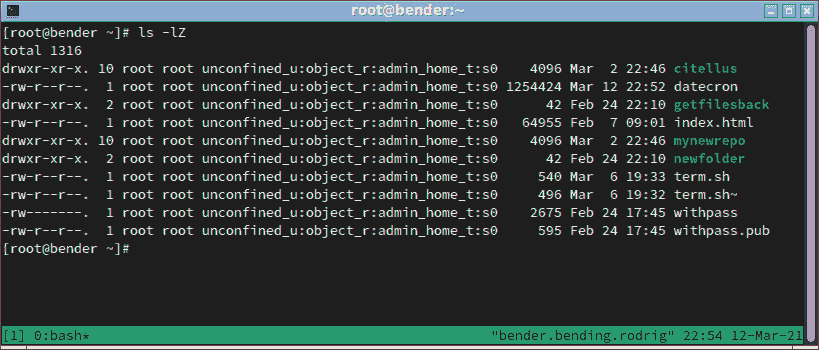
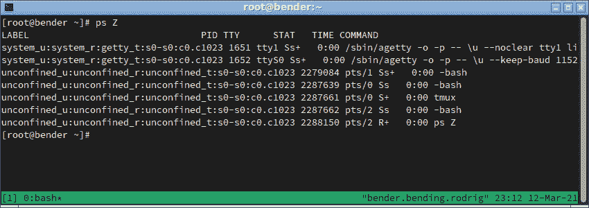
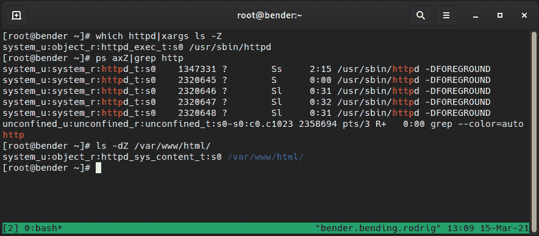
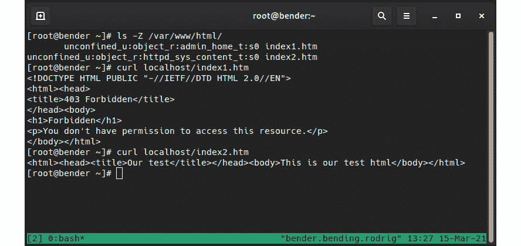
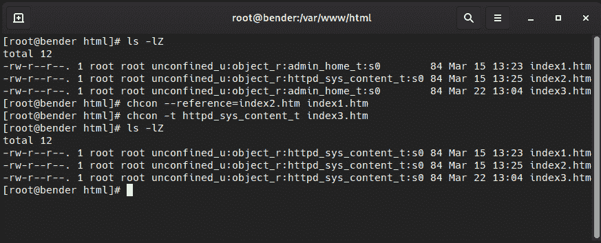

# *第十章*:用 SELinux 加固你的系统

在本章中，我们将熟悉 SELinux。 SELinux 已经存在一段时间了，但是由于对它的工作原理缺乏了解，许多人建议禁用它。

这不是我们想要的，因为这类似于告诉用户放弃密码，因为它很难记住。

我们将介绍 SELinux 的起源，以及默认模式和策略是什么。 然后，我们将了解如何将 SELinux 应用于我们的文件、文件夹和进程，以及如何将它们恢复为系统默认值。

此外，我们将探讨如何使用布尔值微调策略，并在以下章节的帮助下排除常见问题:

*   在强制和允许模式下使用 SELinux
*   检查文件和进程的 SELinux 上下文
*   使用 semanage 调整策略
*   将已更改的文件上下文恢复为默认策略
*   使用 SELinux 布尔设置来启用服务
*   SELinux 故障排除和常见修复

最后，我们将更好地理解如何正确地使用 SELinux，以及如何从它为我们的系统提供的额外保护中获益。

在本章中，将详细解释 SELinux 是如何工作的，以帮助我们理解它的操作方式，尽管实际上使用它要简单得多。 我们还将使用这些示例来说明 SELinux 如何防止攻击或错误配置。

让我们动手使用 SELinux!

# 技术要求

可以在[*第一章*](01.html#_idTextAnchor014)，*安装 RHEL8*中继续使用本书开头创建的虚拟机。 本章所需的任何附加软件包将在文本旁边注明，并可从[https://github.com/PacktPublishing/Red-Hat-Enterprise-Linux-8-Administration](https://github.com/PacktPublishing/Red-Hat-Enterprise-Linux-8-Administration)下载。

# SELinux 在强制和允许模式下的使用

**安全增强型 Linux**(**SELinux)介绍2000 年 12 月通过 Linux 内核邮件列表作为一个产品**开始的国家安全局【显示】(****国家安全局)来提高操作系统的安全性通过强制访问控制和基于角色的访问 控制，而不是系统中可用的传统自由裁量的访问控制。****

SELinux 是在 Linux 内核中引入之前,讨论发生关于适当的方法,和最后,内核框架命名为**Linux 安全模块(LSM)**介绍了 SELinux 是使用它实现其他方法可以使用 LSM,也不仅仅是 SELinux。

SELinux 为 Linux 提供了安全性改进，因为可以以非常细粒度的方式控制用户、进程甚至其他资源对文件的访问。

让我们举一个例子来说明 SELinux 在什么时候起作用:当 web 服务器为用户提供页面时，它从用户的主目录的`public_html`或`www`文件夹(最标准的文件夹)中读取文件。 能够从用户的主目录可以揭示读取文件内容时,web 服务器进程被攻击者,这一刻 SELinux 进场时,它会自动屏蔽文件不应该访问的 web 服务器。

然后，SELinux 限制流程和服务只执行它们应该执行的操作，并且只使用授权的资源。 这是一个非常重要的特性，它使事情处于控制之下，即使是在可能导致意外的文件或资源被访问的软件错误的情况下。 如果它没有被活动策略授权，SELinux 将阻止它。

重要的提示

如果用户由于不适当的文件权限而无法访问某个文件，那么在常规的**自由裁量访问控制**(**DAC**)之后总是会出现 SELinux 权限。 SELinux 与此无关。

默认情况下，系统安装应该以`enforcing`模式部署它，并使用`targeted`策略。 可以通过执行`sestatus`来检查您当前的系统状态，如下截图所示:


图 10.1 -系统 sestatus 的输出

如我们所见，我们的系统有 SELinux`enabled`，使用`targeted`策略，并且当前是`enforcing`。 让我们来了解一下这是什么意思。

SELinux 通过定义一个**策略**来工作，即一组预定义的允许或拒绝访问资源的规则。 可用的选项可以通过系统中的`dnf list selinux-policy-*`列出，其中`targeted`和`mls`是最常见的选项。

我们将关注有针对性的政策,但对于`mls`做一个类比,**多层次安全**(**【显示】美国职业足球大联盟)的政策,是基于他们的安全间隙允许用户交互,类似于电影,我们可以看到有人间隙知道一些信息,而不是别人。 这如何应用到系统中呢? 根用户可能访问执行某些行为而不是其他人,如果用户成为根通过`su`或`sudo`,他们仍然会有原始标签如果根登录权限可以减少发生在本地终端或远程连接和`sudo`执行。**

列出的模式为`enforcing`，表示当前正在执行的策略，与`permissive`的相对。 我们可以把这看作是主动提供保护，而宽容则是主动但只提供警告，不提供保护。

为什么我们要有`permissive`而不是禁用它? 这个问题有点棘手，所以让我们解释一下它是如何工作的，以提供一个更好的答案。

SELinux 在文件系统中使用扩展属性来存储标签。 每次创建一个文件时，都会根据策略分配一个标签，但这只在 SELinux 处于活动状态时才会发生，所以这使得 SELinux`disabled`与 SELinux`permissive`不同，因为第一个将不会为创建的新文件创建那些标签。

此外，在`permissive`模式下，SELinux 允许我们查看如果程序没有收到好的策略或者文件没有适当的标签，将引发的错误。

从`enforcing`切换到`permissive`，或者从`permissive`切换到`permissive`，都很容易，而且总是通过`setenforce`命令，而我们可以使用`getenforce`检索当前状态，如下截图所示:


图 10.2 -改变 SELinux 强制状态

它可能看起来很简单，但实际上就是这么简单，只是运行一个命令而已。 但是，如果禁用了状态，情况就完全不同了。

SELinux 状态是通过编辑`/etc/selinux/config`文件来配置的，但是更改只有在系统重新引导后才生效; 也就是说，我们可以实时地从`enforcing`切换到`permissive`，或者从允许切换到强制，但是当策略从`disabling`切换到`enabling`，或者反之，SELinux 将要求我们重新启动系统。

一般的建议是让 SELinux 保持强制模式，但是如果由于某种原因，SELinux 被禁用了，建议将 SELinux 切换到`permissive`作为从`disabled`移动的第一步。 这将允许我们检查系统实际工作，而不会因为内核阻塞访问文件和资源而被锁定。

请注意

在从`disabled`切换到`permissive`或`enforcing`后的重启过程中，系统将根据策略强制重新标记文件系统。 这是通过在文件系统的根文件夹中创建一个名为`/.autorelabel`的文件来完成的，该文件将触发进程并在之后再次重新引导。

但是为什么选择禁用而不是`permissive`? 例如，一些软件可能需要将其设置为禁用模式，即使稍后也可以为操作或其他原因重新启用它，但请记住，SELinux 是保护您的系统的安全特性和应该保留。

记住,SELinux 使用**访问向量缓存**(**AVC)消息记录到`/var/log/audit/audit.log`文件以及系统日志,是的,这是一个缓存,所以规则不像经常检查,以加快操作。**

 **让我们回到文件系统存储标签的想法，并进入下一节，看看它们如何与 SELinux 提供的进程、文件和 RBAC 相关。

# 检查文件和进程的 SELinux 上下文

SELinux使用标签，也称为附加到每个文件的安全性上下文，并定义了几个方面。 让我们在主文件夹中检查一个例子，使用`ls –l`命令，但是使用了一个特殊的修饰符`Z`，它也将显示 SELinux 属性，如下截图所示:



图 10.3 -显示 SELinux 属性的文件清单

让我们将聚焦于其中一个文件的输出:

```sh
-rw-r--r--.  1 root unconfined_u:object_r:admin_home_t:s0     540 Mar  6 19:33 term.sh
```

SELinux 属性列在`unconfined_u:object_r:admin_home_t:s0`中:

*   **第一部分用户映射**:`unconfined_u`
*   :`object_r`
*   **第三部分为类型**:`admin_home_t`
*   第四部分用于多级安全和多类别安全中的:`s0`级别

类似的事情也发生在进程中，同样地，我们可以在许多常见命令中添加`Z`来获取上下文，例如，使用`ps Z`，如下面的截图所示:



图 10.4 -带有 SELinux 上下文的 ps 输出

再一次，让我们检查中的一行:

```sh
unconfined_u:unconfined_r:unconfined_t:s0-s0:c0.c1023 2287661 pts/0 S+   0:00 tmux
```

同样，我们可以看到相同的方法:用户、角色、类型和级别来实现多级安全性和多类别安全性。

现在我们已经介绍了它的样子，让我们关注它在目标政策中是如何工作的。

目标策略允许系统中除了 SELinux 所针对的服务外，其他一切都像未启用 SELinux 一样运行。 这在安全性和可用性之间做出了很好的妥协。

在策略的开发过程中，会添加新的服务，而对其他服务进行细化，许多最常见的服务都编写了保护它们的策略。

SELinux 还提供了名为**转换**的功能。 转换允许一个由用户启动的进程，使用具有特定角色的二进制文件，通过执行将转换为其他角色，稍后将使用该角色定义其权限。

正如你可能想象的那样，我们的用户也有一个 SELinux 上下文，类似地，我们可以使用`id -Z`命令来检查它:

```sh
unconfined_u:unconfined_r:unconfined_t:s0-s0:c0.c1023
```

因此，回到第一个示例，Apache Web Server 是由`httpd`包提供的，它可以通过`dnf –y install httpd`安装。 安装完成后，让我们用`systemctl start httpd`启动它，用`systemctl enable httpd`启用它，然后打开防火墙`firewall-cmd --add-service=http`和`firewall-cmd --add-service=https`，就像我们在前面的章节中对其他服务所做的那样。

以上命令可以在以下脚本中找到:[https://github.com/PacktPublishing/Red-Hat-Enterprise-Linux-8-Administration/blob/main/chapter-10-selinux/apache.sh](https://github.com/PacktPublishing/Red-Hat-Enterprise-Linux-8-Administration/blob/main/chapter-10-selinux/apache.sh)。

让我们看看下面的截图是如何发挥作用的:



图 10.5 - Web 服务器 SELinux 上下文

在这里，我们可以看到磁盘上的可执行文件如何具有上下文`httpd_exec_t`，进程是`httpd_t`，它所服务的文件/文件夹是`httpd_sys_content_t`，并且它工作!

现在让我们在`home`文件夹中创建一个`index.htm`文件，并将其移动到`Apache Web Root`文件夹，如下所示:

```sh
# echo '<html><head><title>Our test</title></head><body>This is our test html</body></html>' > index.htm
# cp index.htm /var/www/html/index2.htm
# mv index.htm /var/www/html/index1.htm
```

让我们看看当我们尝试访问如下截图所示的文件时会发生什么:



图 10.6 - Apache 使用生成的文件的行为

正如我们所看到的，每个文件都有一个 SELinux 上下文，但是在之上，Apache 拒绝访问我们移动的那个(`index1.htm`)，但是显示我们复制的那个(`index2.htm`)的内容。

这里发生了什么? 我们复制了一个文件并移动了另一个文件，但是它们有两个不同的 SELinux 上下文。

让我们扩展测试，如下图所示:


图 10.7 -在允许模式下使用 SELinux 进行重试

正如我们可以在前面的截图中看到的，我们现在能够访问文件内容，所以你可以说*“SELinux 怎么了，不允许我的站点工作?”* ，但是正确的表达方式应该是*“Look how SELinux has protected us from disclosure a personal file ona website”*。

如果不是直接将文件移动到 Apache 的**DocumentRoot**(`/var/www/html`)中，而是攻击者试图访问我们的主文件夹文件，SELinux 会默认拒绝这些访问。 `httpd_t`进程无法访问`admin_home_t`上下文。

类似的事情发生,当我们试图让 Apache 或任何其他服务目标政策下监听一个端口,不是配置默认情况下,最好的方法熟悉我们能或不能做的是了解`semanage`效用。

使用`semanage`，我们可以在策略中列出、编辑、添加或删除不同的值，甚至导出和导入我们的定制，因此，让我们使用它来通过使用`httpd`的示例进一步了解它。

让我们在下一节中了解一下`semanage`。

# 使用 semanage 调整策略

正如我们前面介绍的，目标策略包含一些对其定义的服务实施的配置，允许保护这些服务，同时不干扰它不知道的服务。

尽管如此，有时我们仍然需要调整许多设置，例如允许`http`或`ssh`守护进程监听替代端口或访问其他一些文件类型，但同时又不失去 SELinux 提供的额外保护层。

首先，让我们确保`policycoreutils`和`policycoreutils-python-utils`与`dnf –y install policycoreutils-python-utils policycoreutils`一起安装在我们的系统中，因为它们提供了我们将在本章和本章下一节中使用的工具。

让我们通过一个例子来学习。 让我们看看哪些端口`httpd_t`可以通过`semanage port -l|grep http`访问:

```sh
http_cache_port_t              tcp      8080, 8118, 8123, 10001-10010
http_cache_port_t              udp      3130
http_port_t                    tcp      80, 81, 443, 488, 8008, 8009, 8443, 9000
```

如我们所见,`http_port_t`,使用 Apache 守护进程,是允许的,默认情况下,使用港口`80`、`81`,`443`,`488`,`8008`,`9009`,`8443`,【显示】通过`tcp`。

这意味着，如果我们想在这些端口上运行 Apache，则不需要更改策略。

如果我们重复`ssh`之外的命令，我们只看到端口`22`打开(执行`semanage port -l|grep ssh`):

```sh
ssh_port_t                     tcp      22
```

例如，我们可能想要将另一个端口(假设为`2222`)添加到可能的端口列表中，以便隐藏端口扫描器正在测试的标准端口。 我们将能够通过`semanage port -a -p tcp -t ssh_port_t 2222`来完成它，然后验证之前的命令`semanage port –l|grep ssh`，现在显示如下:

```sh
ssh_port_t                     tcp      2222, 22
```

如我们所见,港口`2222`已添加到`ssh_port_t`的可用端口的列表类型,这使`ssh`守护进程开始监听(当然,这需要额外的配置`ssh`守护进程配置,防火墙之前工作服务)。

以同样的方式，例如，一些 web 服务需要写入特定的文件夹来存储配置，但在默认情况下，`/var/www/html`上的上下文是`httpd_sys_content_t`，这不允许写入磁盘。

我们可以检查可用的文件上下文`semanage fcontext –l`以类似的方式我们的港口,但文件的列表是巨大的,作为一个 web 服务器可以使用常见的位置如`logs`和`cgi-bin`,以及文件系统的文件证书,配置,和主目录,扩展 PHP 等。 当你用前面的命令检查上下文时，注意不同的类型是可用的，以及一个列表的结构，例如:

```sh
/var/www/html(/.*)?/wp-content(/.*)?               all files          system_u:object_r:httpd_sys_rw_content_t:s0
```

正如我们所看到的，有一个正则表达式，它与`/var/www/html`路径内的`wp-content`文件夹中的文件相匹配，并将`httpd_sys_rw_content_t`设置为 SELinux 上下文，允许读写访问。 这个文件夹由流行的博客软件**WordPress**使用，因此策略已经准备好涵盖一些最流行的服务、文件夹和需求，而不需要系统管理员临时编写它们。

当调用`semanage`时，它将输出一些我们可以使用的子命令，例如以下:

*   `import`:这允许引入本地修改。
*   `export`:允许导出本地更改。
*   `login`:这允许管理登录和 SELinux 用户关联。
*   `user`:用角色和级别管理 SELinux 用户。
*   `port`:管理端口定义和类型。
*   `ibpkey`:管理 ib 定义。
*   `ibendport`:管理结束端口 ib 定义。
*   `interface`:定义网络接口定义。
*   `module`:管理 SELinux 的策略模块。
*   `node`:管理网络节点的定义。
*   `fcontext`:管理文件上下文定义。
*   `boolean`:管理用于调整策略的布尔值。
*   `permissive`:管理强制模式。
*   `dontaudit`:管理策略中的`dontaudit`规则。

对于前面的每个命令，我们可以使用`-h`参数来列出、帮助并了解可用于每个命令的额外参数。

对于日常使用的情况,大部分的时间我们将使用`port`和`fcontext`将覆盖扩展或调优的可用服务 Red Hat Enterprise Linux,像我们展示的例子`ssh`监听一个额外的端口。

重要的提示

传统上,**红帽认证系统管理员**(**RHCSA)和**红帽认证工程师**(【显示】RHCE)课程使用重启验证。 这意味着对于每个已安装和启动的服务，还必须记住在下次重新启动时使其处于活动状态。 SELinux 也发生了类似的事情。 如果我们要添加一个将留在系统中的软件，最好的方法是通过`semanage`定义将要使用的路径`regexp`。 当采用这种方法时，如果文件系统被重新标记或恢复了上下文，应用程序将继续工作。**

 **在下一节中，让我们看看如何手动设置文件的上下文以及如何恢复默认值。

# 恢复已更改的文件上下文为默认策略

在前面的部分中，我们提到了`semanage`如何使我们能够对策略执行更改，这是执行更改并为未来的文件和文件夹持久化它们的推荐方法，但这不是我们执行操作的唯一方法。

在命令行中，我们可以使用`chcon`实用程序来更改文件的上下文。 这将允许我们定义用户,角色,和类型的文件我们想改变,和类似于其他文件系统实用程序`chmod`或`chown`等,我们也可以影响文件递归,所以很容易制定一个完整的文件夹层次结构所需的上下文。

我发现一个非常有趣的特性是能够通过`--reference`标志复制文件的上下文，这样就可以将与被引用的文件相同的上下文应用到目标文件。

当我们在本章前面介绍`httpd`的例子时，我们对两个文件`index1.htm`和`index2.htm`进行了测试，它们被移动并复制到`/var/www/html`文件夹中。 为了更深入地了解这个示例，我们将制作额外的`index1.htm`副本，在下一个屏幕截图中演示`chcon`的用法。 请记住，直接在`/var/www/html`文件夹中创建文件将使文件具有适当的上下文，所以我们需要在`/root`创建它们，然后将它们移动到目标文件夹中，如下截图所示:



图 10.8 -演示 chcon 的使用

正如我们可以看到的，`index1.htm`和`index3.htm`文件现在都有了适当的上下文，在第一种情况下，使用引用，在第二种情况下，定义要使用的类型。

当然，这不是唯一的方法。 如前所述，为应用程序设置上下文的推荐方法是通过`semanage`定义`regexps`路径，这使我们能够使用`restorecon`命令根据配置将正确的上下文应用到文件中。 让我们看看下面的截图是如何操作的:


图 10.9 -使用 restorerecon 恢复上下文

如我们所见，我们使用`restorecon –vR /var/www/html/`，它自动将`index3.htm`文件更改为`httpd_sys_content_t`，这是为该文件夹定义的，正如我们在测试`semanage`列出上下文时看到的。 所使用的参数`v`和`R`使实用程序报告更改(详细)并递归地在提供的路径上工作。

假设我们通过在根文件系统上运行`chcon`来搞乱系统。 有什么办法可以解决这个问题? 在这种情况下，正如我们前面提到的，我们应该做以下工作:

*   设置操作模式为`permissive`，不阻止通过`setenforce 0`进一步访问。
*   放置标记使文件系统通过`touch /.autorelabel`重新标记。
*   修改`/etc/selinux/config`文件，将启动方式设置为`permissive`。
*   重新启动系统让重新贴标签发生。
*   系统重新启动后，再次编辑`/etc/selinux/config`，将操作模式定义为`enforcing`。

通过以这种方式操作,而不仅仅是运行`restorecon -R /`,我们确保系统操作和重启后将继续运作,全面重新贴标签于适用于文件系统,因此准备启用`enforcing`安全模式。

在下一节中，我们将了解如何在策略内部进行调优，使用布尔值来调优策略的工作方式。

# 使用 SELinux Boolean 设置启用服务

许多服务对于许多常见情况都有广泛的配置选项，但并不总是相同的。 例如，`http`服务器不应该访问用户文件，但同时，从每个用户的主目录中的`www`或`public_html`文件夹中启用个人网站是一种常见的操作方式。

为了克服这个用例，同时提供增强的安全性，SELinux 策略使用了布尔值。

布尔值是可以由管理员设置的可调项，管理员可以启用或禁用策略代码中的条件。 让我们看看，例如，通过执行`getsebol -a|grep ^http`可以为`httpd`提供一个布尔值列表(列表减少):

```sh
httpd_can_network_connect --> off
httpd_can_network_connect_db --> off
httpd_can_sendmail --> off
httpd_enable_homedirs --> off
httpd_use_nfs --> off
```

这个列表是可用布尔的一个简化子集，但它确实让我们知道它可以完成什么; 例如，`http`，默认情况下，不能使用网络连接到其他主机，或发送电子邮件(通常用 PHP 脚本完成)，甚至不能访问用户的主文件夹。

例如，如果我们想让系统中的用户从主目录的`www`文件夹发布他们的个人网页，也就是`/home/user/www/`，我们必须通过运行以下命令来启用`httpd_enable_homedirs`布尔值:

```sh
setsebool -P httpd_enable_homedirs=1
```

这将调整策略，使`http`能够访问用户的主目录，以便在那里提供页面。 此外,如果服务器将存储在一个**网络文件系统(NFS**)或【显示】常见的网络文件系统**(**CIFS),需要额外的布尔值。 我们仍然使用相同的目标策略，但是我们启用了内部条件来允许 SELinux 不阻止访问。****

 **重要的提示

为了使*的更改永久*，需要对`setsebool`的`–P`参数。 这意味着写入更改以便它被持久化; 没有它，一旦我们重新启动服务器，所做的更改就会丢失。

正如我们所看到的，`getsebool`和`setsebool`允许我们查询和设置优化策略的布尔值，而且，`semanage boolean -l`也可以在这里提供帮助，正如我们在下面的截图中看到的:


图 10.10 -使用 semanage 管理布尔值

在前面的截图中，我们不仅可以看到我们使用`setsebool`编辑的布尔值，还可以看到预期行为的描述。

正如我们所介绍的，其中一个好处是`semanage`允许我们导出和导入对策略的本地更改，因此任何定制都可以导出和导入到另一个系统，以简化类似的服务器概要文件的设置。

策略中所有可能的布尔值都可以用`semanage boolean –l`检查，类似于我们在`http`示例中列出应用程序的绑定端口所做的操作。

我们已经学习了如何使用布尔值来调整策略如何适应一些特定但非常常见的情况。 接下来，我们将探讨可能是管理员最常用的部分，即故障排除，但重点是 SELinux。

# SELinux 故障排除和常见修复

在适应SELinux 的主要问题之一是，许多不熟悉它的人指责它的东西不工作; 然而，这种说法有点过时了:SELinux 是在 2005 年 Red Hat Enterprise Linux 4 中引入的。

大多数时候，SELinux 和我们的系统的问题与更改文件上下文和更改服务端口有关，而与策略本身有关的时间问题较少。

首先，我们可以在几个地方检查错误，但在我们的列表中，我们应该从审计日志或系统消息开始。 例如，我们可以从本章前面介绍的`/var/log/audit/audit.log`文件开始。

还考虑在,SELinux**强制访问控制(MAC**)只扮演一次**我们从定期清除访问任意访问控制**(**【显示】DAC),也就是说,如果我们没有权限查看一个文件(例如,400 年模式和我们的用户不是所有者)。 在这种情况下，SELinux 不太可能阻塞访问。**

 **大多数时候，我们的系统会安装`setroubleshoot-server`和`setroubleshoot-plugins`包，这些包提供了一些工具，包括`sealert`，用于查询收到的 SELinux 消息，并多次提出修改建议。

让我们来看看一些我们应该始终验证的基本内容:

*   检查所有其他控件(正确设置了用户和组的所有权和权限)。
*   Do not disable SELinux.

    如果一个程序不能正常工作，并且它是随操作系统一起提供的，那么它可能是一个 bug，应该通过支持案例或 Bugzilla 在[https://bugzilla.redhat.com](https://bugzilla.redhat.com)报告。

    只有当程序不能正常工作时，才可以让它不受限制地运行，但通过目标策略保护所有剩余的系统服务。

*   Think about what was done before the error happened if this is an existing program.

    可能文件在到达目的地时被移动而不是复制或创建，或者可能软件的端口或文件夹被更改。

至此，我们应该检查`audit.log`是否有相关的消息。 例如，关于我们提到的关于`/var/www/html/`中文件的错误上下文的例子，审计条目的例子如下:

```sh
type=AVC msg=audit(1617210395.481:1603680): avc:  denied  { getattr } for  pid=2826802 comm="httpd" path="/var/www/html/index3.htm" dev="dm-0" ino=101881472 scontext=system_u:system_r:httpd_t:s0 tcontext=unconfined_u:object_r:admin_home_t:s0 tclass=file permissive=0
```

看起来奇怪,但如果我们检查参数,我们看到受影响的文件的路径,PID,源上下文(`scontext`),和目标上下文(`tcontext`),总之,我们可以看到`httpd_t`试图访问(属性)目标上下文`admin_home_t`,被拒绝。

同时，如果我们使用`setroubleshoot`，我们将在系统日志中得到这样的消息:


图 10.11 -排除登录系统日志的故障

正如我们在前面的截图中看到的，它已经确定其中一个插件建议在文件上应用命令`restorecon`，因为它不匹配它所在的文件夹，甚至建议使用准确的命令来恢复标签。

另一个插件建议使用以下两个命令生成自定义策略:

```sh
# ausearch -c 'httpd' --raw | audit2allow -M my-httpd
# semodule -X 300 -i my-httpd.pp
```

但是，应该了解正在执行的操作，这意味着前面的命令将修复`httpd_t`在访问`home_admin_t`文件方面的问题。 我们可以通过只运行第一个命令和`audit2allow`管道来了解会发生什么。

运行`ausearch –c 'httpd' --raw | audit2allow –M my-httpd`将在当前文件夹中创建几个名为`my-httpd`的文件，其中一个名为`my-httpd.te`，另一个名为`my-httpd.pp`。 第二个命令(我们将*不使用*)将安装修改后的策略，但是请在了解发生了什么之前不要这样做，我们将在下面几行中看到。

我们现在感兴趣的文件是`my-httpd.te`(其中*te*表示*类型执行*):

```sh
module my-httpd 1.0;
require {
        type httpd_t;
        type admin_home_t;
        class file getattr;
}
#============= httpd_t ==============
allow httpd_t admin_home_t:file getattr;
```

从这里，我们可以看到它为所涉及的类型使用一个需求会话，然后是规则本身，它允许`httpd_t`访问`admin_home_t`文件以使用`getattr`函数，仅此而已。

如前所述，这将解决我们的问题吗? 它将有效地允许`httpd_t`获得对`index3.html`文件的访问，因此将不再有任何错误，但这需要付出很大的代价。 从此，`httpd_t`也可以毫无怨言地读取主目录文件。

重要提示

我不知道这个事实需要强调多少次，但在对系统采取行动之前要三思。 SELinux 是一种增强系统安全性的保护机制; 不要禁用它，不要盲目地接受`audit2allow`创建的策略，而不进行一些初步调查和了解问题可能是什么，以及建议的解决方案是什么，因为它可能几乎等同于禁用 SELinux。

如果在这个点，我们已经安装了那个模块，我们可以使用`semodule`做以下事情:

*   列出`semodule -l`。
*   安装`semodule -i $MODULE_NAME`。
*   移除`semodule –r $MODULE_NAME`。

使用上述命令，我们可以检查或更改策略加载模块的当前状态。

回顾一下系统日志，我们可能会意识到某些东西实际上是在它开始后的某个时候失败的，而不是从一开始就失败，所以使用`ausearch`或将完整的日志传递给`audit2allow`可能没有帮助; 然而，我们可以使用`setroubleshootd`建议的命令来列出它们:

```sh
Mar 31 17:06:41 bender setroubleshoot[2924281]: SELinux is preventing /usr/sbin/httpd from getattr access on the file /var/www/html/index3.htm. For complete SELinux messages run: sealert -l 1b4d549b-f566-409f-90eb-7a825471aca8
```

如果我们执行`sealert –l <ID>`，我们将收到由不同插件提供的解决问题的输出，以及类似于图 10.11 中所示的上下文信息。

如果正在部署的新软件不支持 SELinux，我们可以在测试系统中以相反的方式进行以下检查:

*   设置 SELinux 为`permissive`模式。
*   部署的软件。
*   分析所有收到的警报，以查看是否有意外情况。
*   联系软件供应商，并与 Red Hat 一起发起一个支持案例来制定策略。

以防我们锁定的系统因为 SELinux 是执行和严重混乱标签,例如,通过运行糟糕的`chcon`命令递归地对我们的根文件夹(例如,脚本上下文变化取决于一个变量,该变量是空的), 我们仍然有以下方法摆脱困境:

*   使用`setenforce 0`将 SELinux 置于`permissive`模式。
*   运行`touch /.autorelabel`。
*   重新启动主机，以便在下一次启动时，SELinux 恢复适当的标签

如果我们处于一个非常糟糕的情况，例如，不能使用`setenforce 0`或者系统甚至不能正确引导或执行重新标签，仍然有希望，但需要一些额外的步骤。

当系统重新启动时，我们可以在 grub 提示符中看到已安装内核的列表，并使用它来编辑内核启动参数。

使用`selinux=0`参数，我们完全禁用 SELinux，这是我们不想要的，但是我们可以使用`enforcing=0`来实现在`permissive`模式下启用 SELinux。

一旦我们将系统引导到`permissive`模式，我们就可以重复前面的过程以返回到前面的行为，并使用预先给出的指示(检查系统日志等)继续在系统本身内调试中的情况。

# 总结

本章介绍了 SELinux，它是如何工作的，我们如何检查进程、文件和端口，以及如何通过添加新选项或使用布尔值对它们进行微调。 我们还讨论了几个初步的故障排除技能，我们应该进一步探讨这些技能以增强我们的知识和经验。

正如我们所看到的，SELinux 是一种强大的工具，它通过一个额外的层保护我们的系统，甚至保护我们的系统不受可能来自软件本身缺陷的未知问题的影响。

我们讨论了如何在文件和进程中查找 SELinux 上下文，如何通过策略应用这些上下文，以及如何对其进行调优，以便保护系统并仍然能够提供预期的服务。

排除 SELinux 故障是一种技能，它将帮助我们调整 Red Hat Enterprise Linux 不附带的软件，使其仍然能够正确地执行。

在下一章中，我们将学习 OpenSCAP 的安全配置文件，以继续保证系统的安全。********