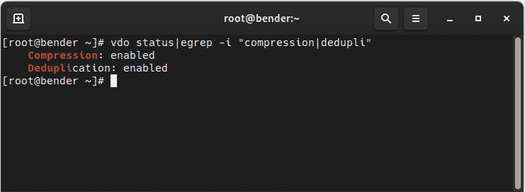

# *第十四章*:基于分层和 VDO 的高级存储管理

在本章中，我们将学习**分层**和**虚拟数据优化器**(**VDO**)。

Stratis 是一个存储管理工具，可以简化最典型的日常任务的运行。 它使用前面章节中介绍的底层技术，如 LVM、分区模式和文件系统。

VDO 是一个存储层，它包括一个位于应用和存储设备之间的驱动程序，以提供存储的数据的重复数据删除和压缩，以及管理这一功能的工具。 例如，这将允许我们最大限度地提高系统保存虚拟机(VM)实例的能力，这些虚拟机实例只会根据它们的独特性占用磁盘空间，而只存储它们的公共数据一次。

我们还可以使用 VDO 来存储备份的不同副本，因为我们知道磁盘使用仍将得到优化。

在本章结束时，我们将知道 VDO 是如何工作的，以及我们的系统需要什么来设置它。

我们将在下面几节中探讨如何准备、配置和使用我们的系统:

*   《Stratis
*   安装和启用 Stratis
*   使用 Stratis 管理存储池和文件系统
*   准备使用 VDO 的系统
*   创建 VDO 卷
*   将 VDO 卷分配给 LVM
*   测试 VDO 容量并回顾统计数据

让我们开始准备使用 VDO 的系统。

# 技术要求

可以在[*第一章*](01.html#_idTextAnchor014)，*Installing RHEL8*中继续使用本书开头创建的 VM。 本章需要的任何额外的软件包将会被指出，并且可以从[https://github.com/PacktPublishing/Red-Hat-Enterprise-Linux-8-Administration](https://github.com/PacktPublishing/Red-Hat-Enterprise-Linux-8-Administration)下载。

我们需要,*理解层云*部分,同样的两个磁盘添加到[*第十三章*](13.html#_idTextAnchor169),*灵活的存储管理与 LVM*,毕竟 LVM 组件已经被清理干净。

# 理解层次

作为一个管理存储的新特性，**Stratis**作为技术预览版(从 RHEL 8.3 版本开始)被包含在 RHEL 8 中。 层云是创建本地存储管理系统通过结合服务,**stratisd**,与著名的工具在 LVM(解释[*第十三章*【显示】,*灵活的存储管理与 LVM*)和 XFS 文件系统(解释](13.html#_idTextAnchor169)[【病人】第十二章](12.html#_idTextAnchor160), *管理本地存储和文件系统*)，这使得它非常可靠。

重要提示

使用 Stratis 创建的文件系统/池应该始终使用它来管理，而不是使用 LVM/XFS 工具。 同样，已经创建的 LVM 卷不应该使用 Stratis 进行管理。

分层将本地磁盘组合成**池**，然后将存储分布到**文件系统**中，如下图所示:


图 14.1 -分层简化架构图

可以看出，当与 LVM 相比时，Stratis 提供了一个更加简单易懂的存储管理接口。 在下面几节中,我们将安装和启用层云,然后使用相同的磁盘中创建[*第十三章*](13.html#_idTextAnchor169),*与 LVM*灵活的存储管理,创建一个池和两个文件系统。

# 安装并启用层

为了能够与 Stratis 一起工作，我们将首先安装它。 使用它所需要的两个包是:

*   `stratis-cli`:执行存储管理任务的命令行工具
*   `stratisd`:一种系统服务(也称为守护进程)，它接受命令并执行底层任务

要安装它们，我们将使用`dnf`命令:

```sh
[root@rhel8 ~]# dnf install stratis-cli stratisd
Updating Subscription Management repositories.
Red Hat Enterprise Linux 8 for x86_64 - BaseOS (RPMs)                17 MB/s |  32 MB     00:01    
Red Hat Enterprise Linux 8 for x86_64 - AppStream (RPMs)             12 MB/s |  30 MB     00:02    
Dependencies resolved.
====================================================================================================
Package                           Arch    Version           Repository                         Size
====================================================================================================
Installing:
stratis-cli                       noarch  2.3.0-3.el8       rhel-8-for-x86_64-appstream-rpms   79 k
stratisd                          x86_64  2.3.0-2.el8       rhel-8-for-x86_64-appstream-rpms  2.1 M
[omitted]
Complete!
```

现在我们可以通过`systemctl`启动的`stratisd`服务:

```sh
[root@rhel8 ~]# systemctl start stratisd
[root@rhel8 ~]# systemctl status stratisd
● stratisd.service - Stratis daemon
   Loaded: loaded (/usr/lib/systemd/system/stratisd.service; enabled; vendor preset: enabled)
   Active: active (running) since Sat 2021-05-22 17:31:35 CEST; 53s ago
     Docs: man:stratisd(8)
Main PID: 17797 (stratisd)
    Tasks: 1 (limit: 8177)
   Memory: 1.2M
   CGroup: /system.slice/stratisd.service
           └─17797 /usr/libexec/stratisd --log-level debug 
[omitted]
```

现在我们将使它在启动时启动:

```sh
[root@rhel8 ~]# systemctl enable stratisd
[root@rhel8 ~]# systemctl status stratisd
● stratisd.service - Stratis daemon
   Loaded: loaded (/usr/lib/systemd/system/stratisd.service; enabled; vendor preset: enabled)
[omitted]
```

提示

我们可以使用一个命令(即`systemctl enable --now stratisd`)来完成这两个任务。

让我们用`stratis-cli`检查守护进程(也称为系统服务)是否正在运行:

```sh
[root@rhel8 ~]# stratis daemon version
2.3.0
```

我们已经准备好了，所以是时候开始研究磁盘了。 让我们继续下一小节。

# 管理具有分层的存储池和文件系统

为了使有一些可供 Stratis 使用的存储，我们将使用`/dev/vdb`和`/dev/vdc`磁盘。 我们需要确保它们上没有任何逻辑卷或分区。 让我们回顾一下:

```sh
[root@rhel8 ~]# lvs
  LV   VG   Attr       LSize  Pool Origin Data%  Meta%  Move Log Cpy%Sync Convert
  root rhel -wi-ao---- <8,00g                                                    
  swap rhel -wi-ao----  1,00g                                                    
[root@rhel8 ~]# vgs
  VG   #PV #LV #SN Attr   VSize  VFree
  rhel   1   2   0 wz--n- <9,00g    0 
[root@rhel8 ~]# pvs
  PV         VG   Fmt  Attr PSize  PFree
  /dev/vda2  rhel lvm2 a--  <9,00g    0
```

我们是好的:所有lvm 创建的对象都是磁盘`/dev/vda`上的。 让我们检查另外两个磁盘，`/dev/vdb`和`/dev/vdc`:

```sh
[root@rhel8 ~]# parted /dev/vdb print
Model: Virtio Block Device (virtblk)
Disk /dev/vdb: 1074MB
Sector size (logical/physical): 512B/512B
Partition Table: gpt
Disk Flags: 

Number  Start  End  Size  File system  Name  Flags
[root@rhel8 ~]# parted /dev/vdc print
Error: /dev/vdc: unrecognised disk label
Model: Virtio Block Device (virtblk)
Disk /dev/vdc: 1074MB
Sector size (logical/physical): 512B/512B
Partition Table: unknown
Disk Flags: 
```

磁盘`/dev/vdc`没有分区表标签。 我们对这个很好。 但是，磁盘`/dev/vdb`有一个分区表。 让我们删除它:

```sh
[root@rhel8 ~]# dd if=/dev/zero of=/dev/vdb count=2048 bs=1024
2048+0 records in
2048+0 records out
2097152 bytes (2,1 MB, 2,0 MiB) copied, 0,0853277 s, 24,6 MB/s 
```

提示

`dd`命令(即表示磁盘转储)用于将数据从设备上转储到设备上。 这个特殊的设备`/dev/zero`简单地产生零，我们用它来覆盖磁盘的初始扇区，也就是标签所在的地方。 请小心使用`dd`; 它可能会在没有警告的情况下覆盖任何东西。

现在我们准备使用`stratis`命令创建第一个池:

```sh
[root@rhel8 ~]# stratis pool create mypool /dev/vdb
[root@rhel8 ~]# stratis pool list
Name                     Total Physical   Properties
mypool   1 GiB / 37.63 MiB / 986.37 MiB      ~Ca,~Cr
```

我们目前已经创建了池，如下图所示:


图 14.2 -创建的层池

我们创建了池; 现在可以在它上面创建一个文件系统:

```sh
[root@rhel8 ~]# stratis filesystem create mypool data
[root@rhel8 ~]# stratis filesystem list
Pool Name   Name   Used      Created             Device                      UUID                            
mypool      data   546 MiB   May 23 2021 19:16    /dev/stratis/mypool/data   b073b6f1d56843b888cb83f6a7d80a43
```

存储的状态“”如下:


图 14.3 -创建的分层文件系统

让我们准备安装文件系统。 我们需要在`/etc/fstab`中添加以下一行:

```sh
/dev/stratis/mypool/data /srv/stratis-data      xfs     defaults,x-systemd.requires=stratisd.service        0 0
```

重要提示

为了让在引导过程中正确地安装一个分层文件系统，我们应该添加`x-systemd.requires=stratisd.service`选项，使其在`stratisd`服务启动后安装。

现在我们可以安装它:

```sh
[root@rhel8 ~]# mkdir /srv/stratis-data 
[root@rhel8 ~]# mount /srv/stratis-data/
```

现在让我们扩展池:

```sh
[root@rhel8 ~]# stratis blockdev list mypool 
Pool Name   Device Node   Physical Size   Tier
mypool      /dev/vdb              1 GiB   Data
[root@rhel8 ~]# stratis pool add-data mypool /dev/vdc
[root@rhel8 ~]# stratis blockdev list mypool 
Pool Name   Device Node   Physical Size   Tier
mypool      /dev/vdb              1 GiB   Data
mypool      /dev/vdc              1 GiB   Data
```

由于底层使用瘦池，我们不需要扩展文件系统。 存储方式如下:


图 14.4 -层池扩展

使用`stratis snapshot`命令创建快照的时间。 让我们创建一些数据，然后快照:

```sh
[root@rhel8 ~]# stratis filesystem
Pool Name   Name   Used      Created             Device                      UUID                            
mypool      data   546 MiB   May 23 2021 19:54    /dev/stratis/mypool/data   08af5d5782c54087a1fd4e9531ce4943
[root@rhel8 ~]# dd if=/dev/urandom of=/srv/stratis-data/file bs=1M count=512
512+0 records in
512+0 records out
536870912 bytes (537 MB, 512 MiB) copied, 2,33188 s, 230 MB/s
[root@rhel8 ~]# stratis filesystem
Pool Name   Name   Used      Created             Device                      UUID                            
mypool      data   966 MiB   May 23 2021 19:54    /dev/stratis/mypool/data   08af5d5782c54087a1fd4e9531ce4943
[root@rhel8 ~]# stratis filesystem snapshot mypool data data-snapshot1
[root@rhel8 ~]# stratis filesystem
Pool Name   Name             Used       Created             Device                               UUID                    
mypool      data             1.03 GiB   May 23 2021 19:54    /dev/stratis/mypool/data             08af5d5782c54087a1fd4e9531ce4943
mypool      data-snapshot1   1.03 GiB   May 23 2021 19:56    /dev/stratis/mypool/data-snapshot1   a2ae4aab56c64f728b59d710b82fb682
```

提示

要查看 Stratis 的内部部分，可以运行`lsblk`命令。 通过它，您将在树中看到 Stratis 使用的组件:物理设备、元数据和数据的分配、池和文件系统。 所有这些都被 Stratis 抽象出来。

因此，我们已经了解了 Stratis 的概况，以便了解其管理的基础知识。 记住层在预览，因此它不应该在生产系统中使用。

现在让我们通过回顾使用 VDO 的数据重复数据删除来讨论存储管理中的其他高级主题。

# 准备系统使用 VDO

正如前面提到的，VDO 是一个驱动程序，特别是一个 Linux 设备映射器驱动程序，它使用两个内核模块:

*   `kvdo`:进行数据压缩。
*   `uds`:负责重复数据删除。

常规的存储设备，如本地磁盘**廉价磁盘冗余阵列**(**RAID**)，等等是存储数据的最终后端; 上面的 VDO 层通过以下方式减少磁盘使用:

*   删除已归零的块，只将它们存储在元数据中。
*   重复数据删除:重复数据块在元数据中被引用，但只存储一次。
*   压缩，使用 4 KB 的数据块与无损压缩算法(LZ4:[https://lz4.github.io/lz4/](https://lz4.github.io/lz4/))。

这些技术在过去的其他解决方案中使用过，例如在精简的**虚拟机**中，这些虚拟机只保留了 vm 之间的差异，但是 VDO 使透明地执行这些操作。

与精简配置类似，VDO 意味着更快的数据吞吐量，因为数据可以由系统控制器缓存，多个服务甚至虚拟机都可以使用这些数据，而不需要额外的磁盘读取来访问它。

让我们在系统上安装所需的软件包，通过安装`vdo`和`kmod-kvdo`软件包来创建 VDO 卷:

```sh
dnf install vdo kmod-kvdo
```

现在，安装了包之后，我们准备在下一节中创建第一个卷。

# 创建 VDO 卷

创建一个VDO 设备,我们将使用环回设备中创建[*第十二章*](12.html#_idTextAnchor160),*管理本地存储和文件系统*,我们将首先检查是否安装或不通过执行:

```sh
mount|grep loop
```

如果没有输出，我们设置为在它上面创建`vdo`卷，如下所示:

```sh
vdo create -n myvdo --device /dev/loop0 –force
```

输出如下截图所示:


图 14.5 -创建 vdo 卷

一旦卷创建完成，我们可以执行`vdo status`来获取创建卷的详细信息，如下图所示:


图 14.6 - vdo 状态输出

正如我们所看到的，有关于`kvdo`版本、正在使用的配置文件以及卷(大小、压缩状态等等)的信息。

现在可以通过`/dev/mapper/myvdo`(我们用`–n`指定的名称)看到新卷，并且可以使用它了。

我们可以执行`vdo status|egrep -i "compression|dedupli"`并得到如下的输出:



图 14.7 -检查压缩和重复数据删除的 vdo 状态

这意味着在卷上同时启用了压缩和重复数据删除功能，因此我们准备在下一节中通过将其添加到 LVM 卷来测试该功能。

# 分配 VDO 卷给 LVM 卷

在前一节中,我们创建了一个 VDO 体积,**现在将成为我们的物理卷**(**光伏)创建一个 LVM 卷组和逻辑卷上。**

让我们通过运行以下命令序列来创建 PV:

1.  `pvcreate /dev/mapper/myvdo`
2.  `vgcreate myvdo /dev/mapper/myvdo`
3.  `lvcreate -L 15G –n myvol myvdo`

此时，我们的`/dev/myvdo/myvol`已经准备好进行格式化了。 让我们使用 XFS 文件系统:

```sh
mkfs.xfs /dev/myvdo/myvol
```

一旦创建了文件系统，让我们通过如下方式挂载一些数据:

```sh
mount /dev/myvdo/myvol /mnt
```

现在让我们在下一节中测试 VDO 体积。

# 测试 VDO 音量并查看统计数据

为了测试重复数据删除和压缩,我们将与一个大文件,测试等RHEL 8 KVM 客人图片可以在 https://access.redhat.com/downloads/content/479/ver=/rhel--8/8.3/x86_64/product-software。

下载后，将其保存为`rhel-8.3-x86_64-kvm.qcow2`，并将其复制四次到我们的 VDO 卷:

```sh
cp rhel-8.3-x86_64-kvm.qcow2 /mnt/vm1.qcow2
cp rhel-8.3-x86_64-kvm.qcow2 /mnt/vm2.qcow2
cp rhel-8.3-x86_64-kvm.qcow2 /mnt/vm3.qcow2
cp rhel-8.3-x86_64-kvm.qcow2 /mnt/vm4.qcow2
```

这是服务器中包含启动相同基本磁盘映像的 vm 的典型情况，但是我们看到任何改进吗?

让我们执行`vdostats --human-readable`来验证数据。 请注意，下载的映像为 1.4 GB，如`ls –si`所报告的。 由`vdostats --human-readable`得到的输出如下:

```sh
Device                    Size      Used Available Use% Space saving%
/dev/mapper/myvdo        20.0G      5.2G     14.8G  25%           75%
```

原始卷(环回文件)是 20gb，所以这是我们可以看到的大小，但是从输出判断，我们创建的 LVM 卷是 15gb，我们看到大约只有 1.2 GB 被消耗了，即使我们有四个每个 1.4 GB 的文件。

这个比例也很清楚。 我们节省了 75%的空间(四个文件中有三个是完全复制的)。 如果我们做一个额外的副本，我们将看到这个百分比变成 80%(5 份副本中有 1 份)。

让我们来看看另一种方法，通过创建一个空文件(充满 0):

```sh
[root@bender mnt]# dd if=/dev/zero of=emptyfile bs=16777216 count=1024
dd: error writing 'emptyfile': No space left on device
559+0 records in
558+0 records out
9361883136 bytes (9.4 GB, 8.7 GiB) copied, 97.0276 s, 96.5 MB/s
```

正如我们所看到的，我们可以在磁盘完全填满之前写入 9.4 GB，但是让我们再次检查`vdo`和`vdostats --human-readable`的数据，如下截图所示:


图 14.8 -检查 vdostats 输出

正如我们所看到的，我们仍然有 14.8 GB 可用，并且我们将磁盘空间从 80%增加到 92%，因为这个大文件是空的。

等等——如果我们正在使用重复数据删除和压缩，那么如果 92%的卷已经被保存，我们是否已经填满了卷?

由于我们没有指明 VDO 卷的逻辑大小，它默认与底层设备设置为 1:1 的比例。 这是最安全的方法，但除了性能之外，我们并没有真正利用压缩和重复数据删除的优势。

为了充分利用这些优化，我们可以在现有的卷上创建一个更大的逻辑驱动器。 例如，如果在很长一段时间后，我们非常确定磁盘优化可能是相似的，我们可以使用以下命令增加逻辑大小:

```sh
vdo growLogical --name=myvdo --vdoLogicalSize=30G
```

当然，这不会增加可用的大小，因为我们在 PV 上定义了一个卷组和一个逻辑卷。 因此，我们还需要通过执行以下命令来扩展它:

1.  `pvresize /dev/mapper/myvdo`
2.  `lvresize –L +14G /dev/myvdo/myvol`
3.  `xfs_growfs /mnt`

这样，我们有扩展了物理卷，增加了逻辑卷的大小，并扩展了文件系统，所以现在可以使用空间了。

如果我们现在执行`df|grep vdo`，我们将看到这样的结果:


图 14.9 -调整卷大小后的磁盘空间可用性

从这一点开始，我们必须非常小心，因为就可能的压缩而言，我们对磁盘空间的实际使用可能没有像以前那样优化，从而导致写入失败。 然后，需要监视可用磁盘空间和 VDO 状态，以确保我们没有试图使用比可用空间更多的空间，例如，如果无法以相同的比率压缩或重复数据删除存储的文件。

重要提示

在我们的实际物理磁盘空间中设置一个非常大的逻辑卷是很诱人的，但是我们应该提前计划并考虑避免未来的问题，例如压缩比可能没有我们预期的那么高。 充分分析所存储的实际数据及其典型压缩比，可以让我们更好地了解在继续积极监控逻辑卷和物理卷的磁盘使用变化的同时，使用什么是安全的方法。

很久以前,当磁盘空间真的是昂贵的(和硬盘总共 80 MB),它变得非常流行使用工具,允许一个*增加磁盘空间使用透明层压缩这可能使一些估计和报告更大空间; 但在现实中，我们知道图像和电影等内容不能像文本文件等其他文档格式那样压缩。 一些文档格式(例如 LibreOffice 使用的那些)已经是压缩文件，因此不会获得额外的压缩好处。*

 *但是当我们谈到 vm 时，这种情况就发生了变化，其中每个 vm 的基础或多或少是相等的(基于公司的政策和标准)，并通过克隆磁盘映像和稍后执行小定制来部署，但在本质上共享大部分磁盘内容。

提示

一般来说，请记住，优化实际上只是权衡。 在调优配置文件的情况下，您正在调整吞吐量以应对延迟，在我们的情况下，您正在用 CPU 和内存资源换取磁盘可用性。 判断某件事是否值得权衡的唯一方法是实现它，看看它的性能如何，看看从中获得的好处，然后随着时间的推移继续监视性能。

# 总结

在本章中，我们学习了 VDO 和 Stratis。 我们了解了管理存储的简单方法、如何透明地节省磁盘空间以及如何在这个过程中获得一些吞吐量。

使用 Stratis，我们创建了一个包含两个磁盘的池，并将其分配给一个挂载点。 它比使用 LVM 需要更少的步骤，但另一方面，我们对所做的事情的控制更少。 无论如何，我们学习了如何在 RHEL 8 中使用这种预览技术。

VDO,我们我们创建的卷用于定义一个 LVM PV,在它之上,一个卷组和逻辑卷我们已经格式化的使用获得的知识在之前的章节来存储虚拟机磁盘映像几次,来模拟一个场景,几个虚拟机开始从相同的基础。

我们还学习了如何检查 VDO 优化和节省的磁盘数量。

现在，我们准备使用 Stratis 而不是 LVM 来分组和分发存储(尽管不用于生产)。 我们还可以为服务器实现 VDO，以开始优化磁盘使用。

在下一章中，我们将学习引导过程。*