# 第三章。Vim 功夫

Vim 的默认配置通常相当一般。为了更好地利用 Vim 的力量，我们将通过其配置文件的帮助释放其全部潜力。然后，我们将学习探索一些有助于我们加快工作流程的键盘快捷键。我们还将看看一些常用的插件，它们让 Vim 变得更好。我们将看到 Vim 如何利用它的加密文件选项来存储您的密码。这几章将以展示我们如何自动化 Vim 并轻松配置工作环境来结束。

在本章中，我们将介绍以下内容:

*   与 Vim 合作
*   探索 Vim 的插件类固醇
*   使用 Vim 密码管理器存储密码
*   自动化 Vim 配置

说到在终端的生产力，一个重要的方面就是永远不要离开终端！当我们完成工作时，很多时候我们发现自己不得不编辑文件和打开外部(图形用户界面)编辑器。

糟糕的举动！

为了让我们的工作效率翻倍，我们需要把那些日子抛在脑后，在终端完成工作，而不是为了编辑一行简单的文本而打开成熟的 IDEs。现在，关于哪个是你的终端最好的文本编辑器，有很多争论，每一个都有它的利弊。我们推荐 Vim，这是一个超级可配置的编辑器，一旦掌握，甚至可以超越集成开发环境。

为了启动我们的 Vim 生产力，我们需要做的第一件事是拥有一个配置良好的`vimrc`文件。

# 增压 Vim

让我们从在我们的`home`文件夹中打开一个名为`.vimrc`的新隐藏文件并粘贴几行开始:

```sh
set nocompatible
filetype off

" Settings to replace tab. Use :retab for replacing tab in existing files.
set tabstop=4
set shiftwidth=4
set expandtab

" Have Vim jump to the last position when reopening a file
if has("autocmd")
   au BufReadPost * if line("'\"") > 1 && line("'\"") <= line("$") | exe "normal! g'\"" | endif

" Other general vim options:
syntax on
set showmatch      " Show matching brackets.
set ignorecase     " Do case insensitive matching
set incsearch      " show partial matches for a search phrase
set nopaste
set number           
set undolevels=1000
```


现在让我们关闭并重新打开文件，这样我们就可以看到配置生效。让我们更详细地讨论一些选项。

首先，你可能已经猜到了，以`"`开头的行是注释，可以忽略。第 5、6 和 7 行告诉`vim`始终使用空格代替制表符，并将制表符大小设置为 4 个空格。第 10 到 12 行告诉`vim`始终打开一个文件，并将光标设置在与上次打开文件时相同的位置:

*   `syntax on`:这可以实现语法高亮，所以更容易阅读代码
*   `set nopaste`:这设置了`nopaste`模式，也就是说你可以粘贴代码，而不用 Vim 去猜怎么格式化
*   `set number`:这告诉 Vim 总是显示行号
*   `set undolevels=1000`:这告诉 Vim 记住我们对文件所做的最后 1000 个更改，这样我们就可以轻松地撤销和重做

现在，大多数这些功能都可以轻松打开或关闭。比方说，我们想从 Vim 中打开的一个文件复制、粘贴一些行到另一个文件。有了这个配置，我们还将粘贴行号。能做的就是通过输入`:set nonumber`快速关闭行号，或者，如果语法很烦人，我们可以通过运行`syntax off`轻松关闭。

另一个常见功能是状态行，可以通过粘贴以下选项进行配置:

```sh
" Always show the status line
set laststatus=2

" Format the status line
set statusline=\ %{HasPaste()}%F%m%r%h\ %w\ \ CWD:\ %r%{getcwd()}%h\ \ \ Line:\ %l\ \ Column:\ %c

" Returns true if paste mode is enabled
function! Has Paste()
    if &paste
        return 'PASTE MODE  '
    en  
    return ''
end function
```

关闭文件并再次打开。现在我们可以在页面底部看到一个带有额外信息的状态栏。这也是超可配置的，所以我们可以在里面放很多不同的东西。这个特殊的状态栏包含文件名、当前目录、行号和列号以及粘贴模式(开或关)。要将其设置为开，我们使用`:set paste`，更改将显示在状态栏中。

Vim 还可以选择改变配色方案。为此，请转到/ `usr/share/vim/vim74/colors`并从中选择一种配色方案:

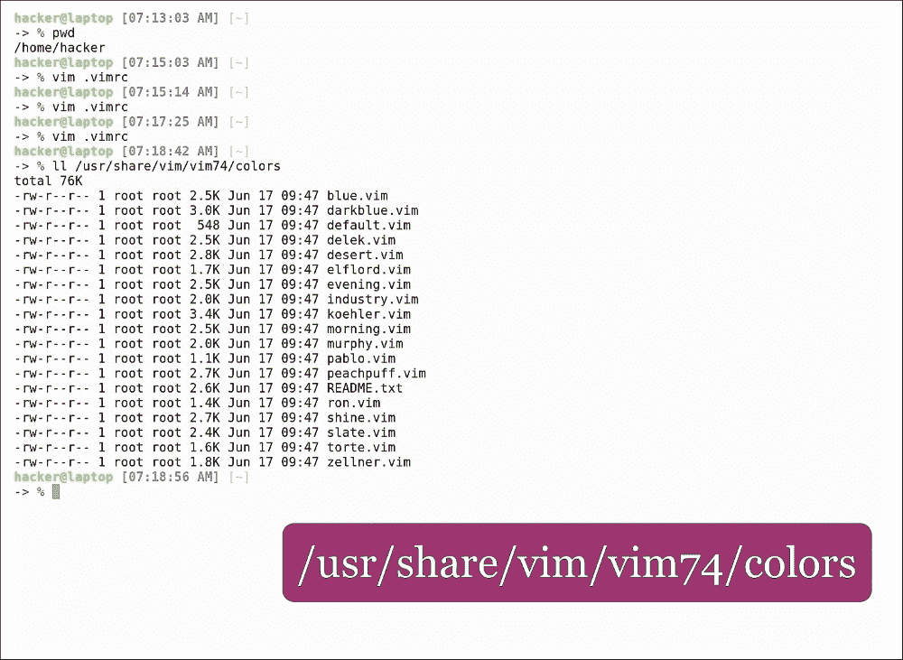

让我们选择沙漠！

## 沙漠配色

关闭并重新打开文件；你会看到它和之前的颜色主题没有那么大的不同。如果我们想要一个更激进的，我们可以将配色方案设置为蓝色，这将彻底改变 Vim 的外观。但是在剩下的课程中，我们将坚持**沙漠**。

Vim 也可以在外部工具的帮助下增压。在编程领域，我们经常发现自己在编辑 JSON 文件，如果 JSON 没有缩进，这可能是一项非常困难的任务。有一个 Python 模块，我们可以使用它来自动缩进 JSON 文件，Vim 可以配置为在内部使用它。我们所需要做的就是打开配置文件并粘贴以下行:

```sh
map j !python -m json.tool<CR>

```

本质上这是在告诉 Vim，在视觉模式下，如果我们按下 *J* ，它应该用选中的文本调用 Python。我们手动写一个`json`字符串，按 *V* 进入视觉模式，用我们的箭头选择文本，点击 *J* 。

并且，由于没有额外的包，我们添加了一个 JSON 格式快捷方式:

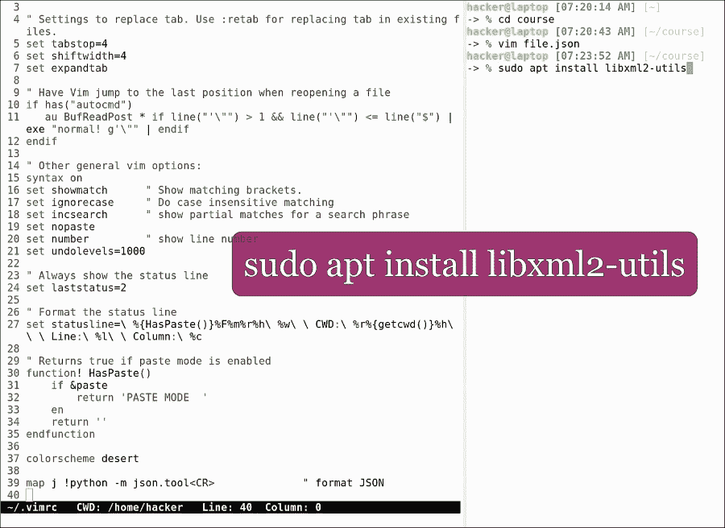

我们可以对`xml`文件做同样的事情，但是首先我们需要安装一个工具来处理它们:

```sh
sudo apt install libxml2-utils

```

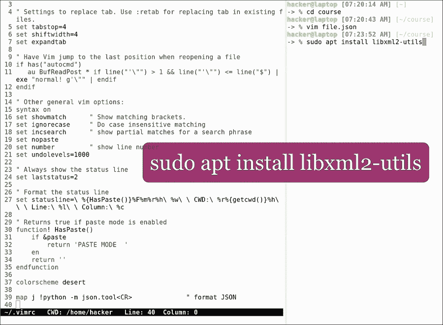

要安装 XML 实用程序包，我们必须在配置文件中添加以下行:

```sh
map l !xmllint --format --recover -<CR>

```

这将视觉模式下的 *L* 键映射到`xmllint`。让我们写一个 HTML 片段，它实际上是一个有效的`xml`文件，点击`V`进入视觉模式，选择文本，然后按 *L* 。

这种类型的扩展(也包括拼写检查器、临帖器、字典等等)可以被带到 Vim 中，并且可以立即使用。

一个配置良好的`vim`文件可以在命令行中为您节省大量时间。虽然开始时可能需要一些时间来进行设置并找到适合您的配置，但这项投资在未来会有很大回报，久而久之和我们在 Vim 上投入了越来越多的时间。很多时候，我们甚至没有打开图形用户界面编辑器的奢侈，就像通过`ssh`会话远程工作一样。信不信由你，命令行编辑器是救命稻草，没有它们，生产力很难实现。

# 键盘功夫

现在我们已经设置好了 Vim，是时候学习更多命令行快捷方式了。我们首先要看的是压痕。

缩进可以在 Vim 中完成，进入视觉模式，输入 *V* 选择部分文本或 *V* 选择整行，然后输入 *>* 或 *<* 向右或向左缩进。然后按下`.`重复最后一个操作:

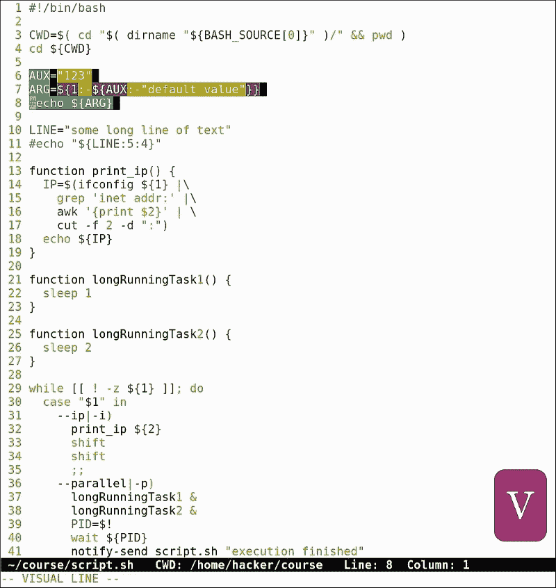

任何操作都可以通过点击`u`撤销，然后可以通过点击 *Ctrl* + *R* 重做(如撤销和重做)。这相当于大多数流行编辑器中的 *Ctrl* + *Z* 、*Ctrl*+*Shift*+*Z*。

在视觉模式下，我们可以选择通过点击 *U* 使所有文本大写， *u* 小写， *~* 反转当前大小写来改变字母的大小写:


其他便捷的快捷方式有:

*   `G`:转到文件结尾
*   `gg`:转到文件开始
*   `Select all`:这并不是真正的快捷方式，而是命令的组合:`gg V G`，如进入文件的开始，选择整行，移动到最后。

Vim 还有一个便捷的快捷方式，可以打开光标下单词的手册页。只需点击 K，就会显示该特定单词的手册页(如果有的话):


在 Vim 中查找文本就像点击 */* 一样简单。只需输入 */* *+* 要查找的文本，点击*进入*开始搜索。Vim 将转到该文本的第一次出现处。下一次点击`n`，上一次点击 *N* 。

我们最喜欢的编辑器有一个强大的查找和替换功能，类似于`sed`命令。假设我们想用字符串`DIR`替换字符串`CWD`的所有出现。为此，只需键入:

```sh
:1,$s/CWD/DIR/g
:1,$ - start from line one, till the end of the file
s - substitute 
/CWD/DIR/ - replace CWD with DIR
g - global, replace all occurrences.

```


让我们做另一个编程中经常出现的常见例子:注释代码行。假设我们想要注释掉 shell 脚本中的第 10 到 20 行。为此，请键入:

```sh
:10,20s/^/#\ /g

```


这意味着用#和空格代替行首。要删除文本行，请键入:

```sh
:30,$d

```

这将删除从第 30 行到结尾的所有内容。

关于正则表达式的更多信息可以在章节中找到。也可以查看`sed`上的部分，了解更多文本操作示例。这些命令是 Vim 中最长的命令，我们经常会弄错。要编辑我们刚刚编写的命令并再次运行它，我们可以通过点击 *q:* 打开命令历史，导航到包含要编辑的命令的行，按插入，更新该行，然后按 *Esc* 和*回车*运行该命令。就这么简单！


另一个经常有用的操作是排序。让我们从经典的 lorem ipsum 文本中创建一个包含未排序文本行的文件:

```sh
cat lorem.txt | tr " " "\n" | grep -v "^\s*$" | sed "s/[,.]//g" > sort.txt

```

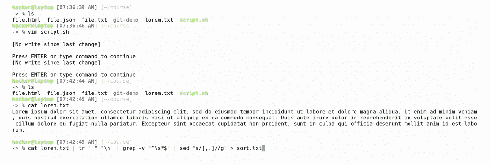

打开`sort.txt`和`run :sort`。我们看到这些行都是按字母顺序排序的。

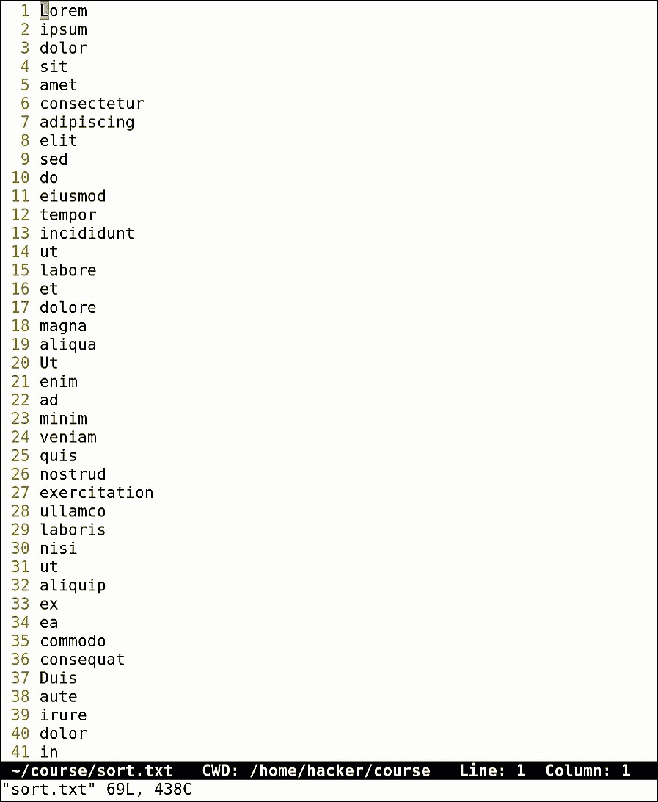

现在让我们继续前进到窗口管理。Vim 可以选择分割屏幕来并行编辑文件。水平拆分只需写`:split`，垂直拆分只需写`:vsplit`:

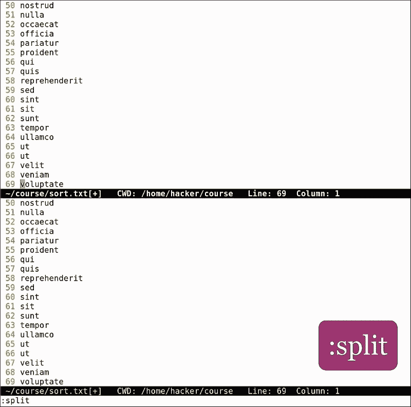

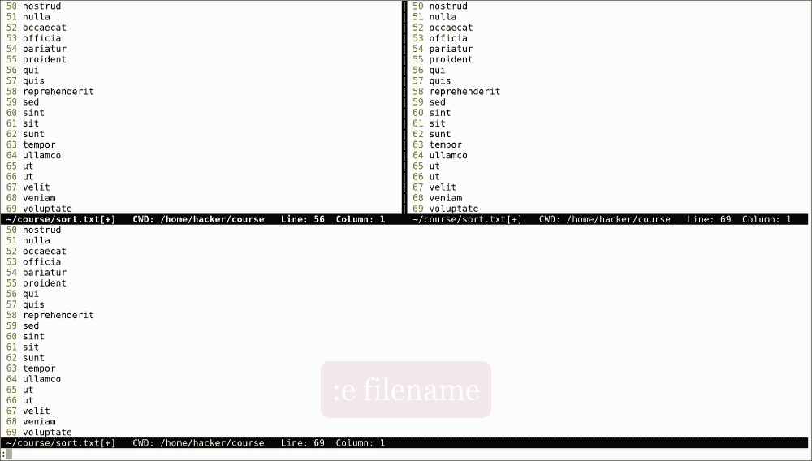

当 Vim 拆分屏幕时，它会在另一个窗格中打开相同的文件；要打开另一个文件，只需点击`:e`。这里好的是我们有自动完成功能，所以我们可以点击*标签*，Vim 将开始为我们写文件名。如果我们不知道我们想要选择什么文件，我们可以直接从 Vim 运行任何任意 shell 命令，完成后再回来。例如，当我们键入`:!ls,`时，外壳打开，向我们显示命令的输出，并等待直到我们点击*进入*返回文件。

在拆分模式下，按 *Ctrl* + *W* 切换窗口。要关闭窗口，请按`:q`。如果你想用不同的名字保存一个文件(想想其他编辑的`save as`命令)，只需点击`:w`后跟着新的文件名，说`mycopy.txt`。

Vim 还可以选择一次打开多个文件；只需在`vim`命令后指定文件列表:

```sh
vim file1 file2 file3

```

文件打开后，使用`:bn`移动到下一个文件。要关闭所有文件，点击`:qa`。

Vim 还有一个内置的探索者。只需打开 Vim 并点击`:Explore`。之后，我们可以浏览目录布局并打开新文件:

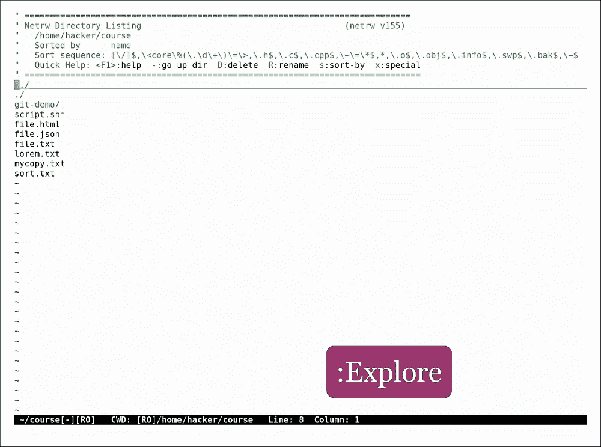

它也有不同的选择。让我们打开一个文件，删除其中一行，然后用新的名称保存它。退出并用`vimdiff`打开两个文件。现在我们可以直观地看到它们之间的区别。这适用于所有类型的更改，比普通的旧 diff 命令输出好得多。

当使用 Vim 时，键盘快捷键真的有所作为，并打开了一个全新的可能性世界。开始的时候有点难记，但是一旦开始使用，就像点击一个按钮一样简单。

# Vim 的外挂类固醇

在这一部分，我们将研究如何向 Vim 添加外部插件。Vim 有自己的编程语言来编写插件，这一点我们在编写`vimrc`文件时看到过。幸运的是，我们不需要学习所有这些，因为我们能想到的大多数东西都已经有一个插件了。要管理插件，让我们安装插件管理器病原体。开放:[https://github.com/tpope/vim-pathogen](https://github.com/tpope/vim-pathogen)。

遵循安装说明。如您所见，这是一个单行命令:

```sh
mkdir -p ~/.vim/autoload ~/.vim/bundle && \curl -LSso ~/.vim/autoload/pathogen.vim https://tpo.pe/pathogen.vim

```

完成后，在你的`.vimrc`中加入病原体:

```sh
execute pathogen#infect()
```

大多数 ide 显示文件夹结构的树形布局，与打开的文件平行。Vim 也可以做到这一点，而实现这一点最简单的方法就是安装名为 **NERDtree** 的插件。

打开:[https://github.com/scrooloose/nerdtree](https://github.com/scrooloose/nerdtree)，按照说明安装:

```sh
cd ~/.vim/bundle git clone https://github.com/scrooloose/nerdtree.git

```

现在我们应该都准备好了。我们打开一个文件，输入`:NERDtree`。我们在这里看到我们当前文件夹的树状结构，在这里我们可以浏览和打开新文件。如果我们想让 Vim 取代我们的 IDE，这当然是一个强制性的插件！


另一个非常好用的插件叫做 **Snipmate** ，用于编写代码片段。要安装它，请转到此链接并按照说明进行操作:[https://github.com/garbas/vim-snipmate](https://github.com/garbas/vim-snipmate)。

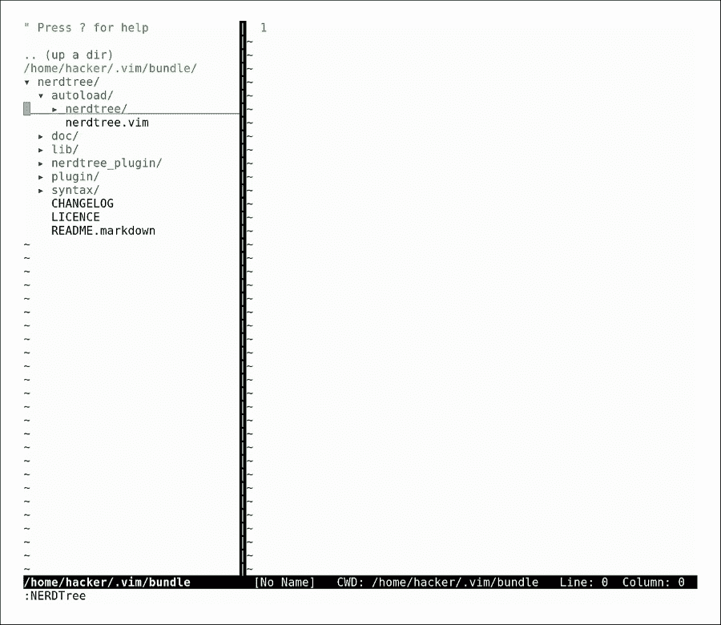

我们可以看到，在安装`snipmate`之前，还有一套插件需要安装:

*   `git clone https://github.com/tomtom/tlib_vim.git`
*   `git clone https://github.com/MarcWeber/vim-addon-mw-utils.git`
*   `git clone https://github.com/garbas/vim-snipmate.git`
*   `git clone https://github.com/honza/vim-snippets.git`

如果我们看一下自述文件，我们可以看到一个 C 文件的例子，它有`for`关键字的自动完成。我们打开一个扩展名为`.c`的文件，输入`for`，点击*标签*。我们可以看到自动完成工作。

我们还安装了`vim-snipmate`包，里面有很多不同语言的片段。如果我们看一下`~/.vim/bundle/vim-snippets/snippets/`，我们可以看到很多片段文件:

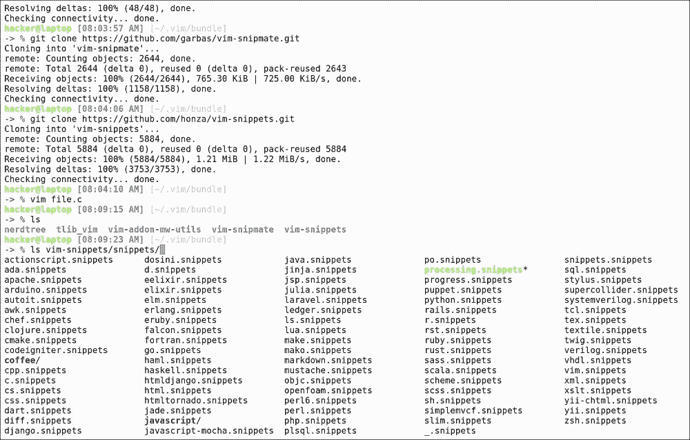

我们来看看和`javascript`这一个:

```sh
vim ~/.vim/bundle/vim-snippets/snippets/javascript/javascript.snippets

```

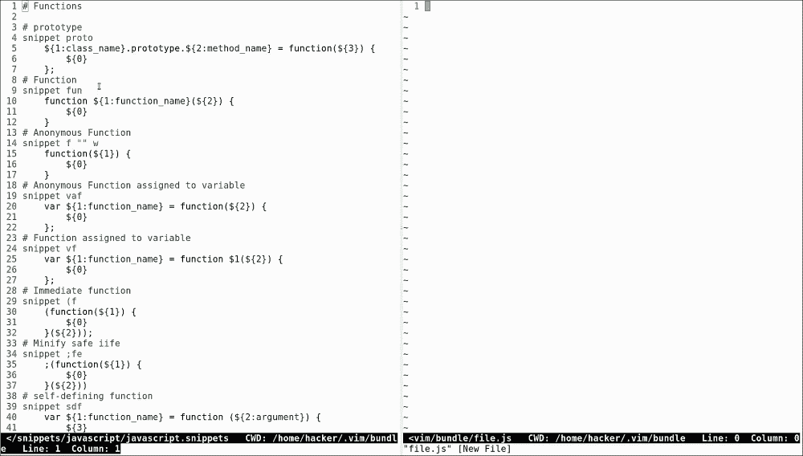

这里我们可以看到所有可用的片段。键入`fun`并点击*选项卡*进行功能自动完成。代码片段预先配置了变量，这样你就可以写一个函数名，点击的*标签*到下一个变量完成。有一个片段用于编写 if-else 块，一个用于编写`console.log,`，还有许多其他的用于编写公共代码块。学习它们的最好方法是浏览文件并开始使用片段。

有很多插件。人们制作了各种各样的插件包，保证让你的 Vim 充满活力。一个很酷的项目是[http://vim.spf13.com/](http://vim.spf13.com/)

它被昵称为终极 Vim 插件包，它基本上有插件和键盘快捷键。这是为更高级的用户准备的，所以在跳转到插件包之前一定要了解基本概念。记住，最好的学习方法是手动安装插件，然后一个一个地玩。

# Vim 密码管理器

Vim 也可以用来安全存储信息，通过不同的`cryp`方法加密文本文件。要查看 Vim 当前使用的`cryp`方法，请键入:

```sh
:set cryptmethod?
```

在我们的案例中，我们可以看到它是`zip`，这实际上不是一种`crypto`方法，并且在安全性方面没有提供太多。要了解我们有哪些不同的选择，我们可以键入:

```sh
:h 'cryptmethod'
```

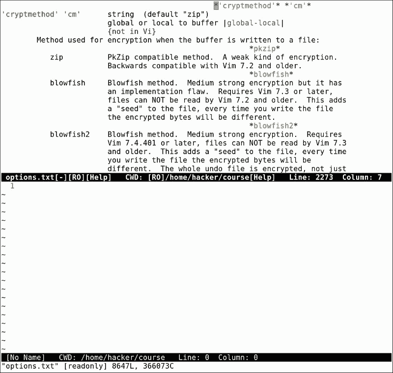

一个描述不同加密方法的页面出现了。我们可以从`zip`、`blowfish,`和`blowfish2`中选择。最安全最推荐的当然是`blowfish2`。要更改加密方法，请键入:

```sh
:set cryptmethod=blowfish2
```

这也可以添加到`vimrc`中，使其成为默认加密。现在我们可以使用 Vim 安全地加密文件。

一个常见的场景是存储密码文件。

让我们打开一个名为`passwords.txt`的新文件，在里面添加一些虚拟密码，然后保存。下一步是用密码加密文件，为此我们键入`:X`。

Vim 会提示您输入两次密码。如果不保存文件就退出，将不会应用加密。现在，再次加密，保存并退出文件。

当我们重新打开它时，Vim 会要求相同的密码。如果我们弄错了，Vim 会显示一些来自失败解密的随机字符。只有输入正确的密码才会得到实际的文件内容:


使用 Vim 保存加密文件，结合在私有`git`存储库或私有 Dropbox 文件夹等地方备份文件，可以成为存储密码的有效方式:


它还有一个好处，那就是它是一种独特的存储密码的方法，相比之下，它使用的在线服务非常标准，可能会受到损害。这也可以称为*安全穿越*T2【h】默默无闻。

# 即时配置恢复

我们在本章中看到的配置可能需要一些时间来手动设置，但是，一旦一切都配置好了，我们就可以创建一个脚本来立即恢复 Vim 配置。

为此，我们将到目前为止发出的所有命令粘贴到 bash 脚本中，该脚本可以运行以使 Vim 达到完全相同的配置。这个脚本中缺少的只是`home`文件夹中的`vimrc`文件，我们也可以通过一种叫做 heredocs 的技术来恢复它。只需键入 cat，将输出重定向至`vimrc`，并使用 heredoc 作为输入，由`eof`分隔:


```sh
cat > ~/.vimrc << EOF
...
<vimrc content>
...
EOF

```

使用 heredocs 是在 bash 脚本中操作大块文本的常用技术。基本上，它将一段代码视为一个单独的文件(在我们的例子中，所有代码都在 cat 之后，直到 EOF)。有了这个脚本，我们可以恢复我们已经完成的所有 Vim 配置，我们也可以在我们工作的任何计算机上运行它，这样我们就可以在短时间内设置我们的 Vim！

我们希望你喜欢这份材料，并在下一章再见！