# 第四章。命令行界面——隐藏的配方

本章将从 sed 开始，sed 是一种会吓到很多 Linux 用户的工具。我们将研究一些基本的`sed`命令，这些命令可以让几个小时的折射变成几分钟。我们将看到如何使用 Linux 计算机定位任何文件。此外，我们将看到当 Tmux 进入我们的技能集时，远程工作会变得多么好。借助最好的终端多路复用器，您可以运行持久的命令，分割屏幕，并且永远不会丢失您的工作。然后，您将学习如何在 netstat 和 nmap 等命令的帮助下发现网络并与之交互。最后，我们将看到 Autoenv 如何帮助自动切换环境，以及如何使用 rm 命令使用垃圾桶实用程序从命令行与垃圾桶交互。

在本章中，我们将介绍以下内容:

*   了解 sed 的工作
*   使用终端多路复用器 tmux
*   使用 Autoenv 自动切换环境
*   使用 rm 命令行删除文件或目录

# Sed–单线生产力宝藏

如果一张图片值 1000 个字，那么 sed one 的班轮绝对值一千行代码！你猜对了，Linux 命令行界面中最令人害怕的命令之一就是 sed！程序员和系统管理员都很害怕它，因为它的用法很神秘，但它可以作为一个非常强大的工具来快速编辑大量数据。

我们已经创建了五个文件来帮助展示这个令人敬畏的工具的力量。第一个是一个简单的文件，包含一行不起眼的文本:*橙色是新的黑色*。让我们从创建一个简单的`sed`命令开始，将单词*黑色*替换为*白色*。

sed 的第一个参数是 replace 命令。它被 3 `/`分成 3 部分。第一部分是`s`为替代，第二部分是被替代的词，`black`，在我们这里，第三部分是替代词，`white`。

第二个参数是输入，在我们的例子中，是一个文件:

```sh
sed "s/black/white/" 1.txt

```


现在，结果会打印在屏幕上，你可以看到黑色这个词已经被白色取代了。

我们的第二个例子包含另一行文本，这一次在大写和小写中都有单词 black。如果我们使用这个新文件运行相同的命令，我们将看到它只替换匹配大小写的单词。如果我们想进行不区分大小写的替换，我们将在我们的`sed`命令的末尾再添加两个字符；`g`和`l`。

*   `g`:表示全局替换，用于替换文件中的所有出现。没有这个，它只会取代第一个参数。
*   `l`: means case insensitive search.

    ```sh
    sed "s/black/white/gI" 2.txt

    ```

    

如你所见，这两个词都被替换了。如果我们想将结果保存在我们的文件中，而不是打印到屏幕上，我们使用`-i`参数，它代表内联替换。

在某些情况下，我们可能也想保存我们的初始文件，以防我们在`sed`命令中出现错误。为此，我们在`-i`后面指定一个后缀，这将创建一个备份文件。在我们的例子中，我们使用`.bak`后缀:

```sh
sed -i.bak "s/black/white/g" 2.txt

```

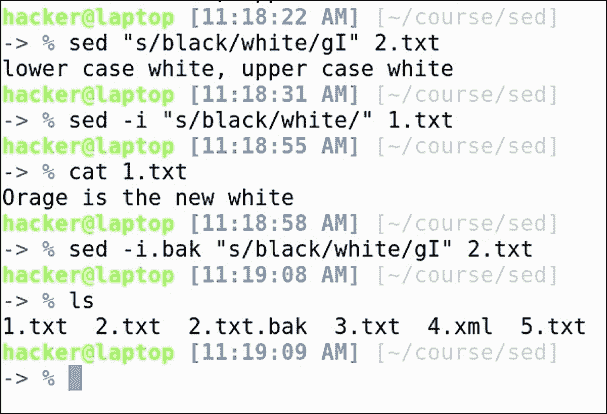

如果我们检查文件的内容，可以看到初始文件包含更新后的文本，备份文件包含原始文本。

现在，让我们看一个更实际的例子。假设我们有一个包含多个变量的 shell 脚本，我们希望用花括号将变量括起来:

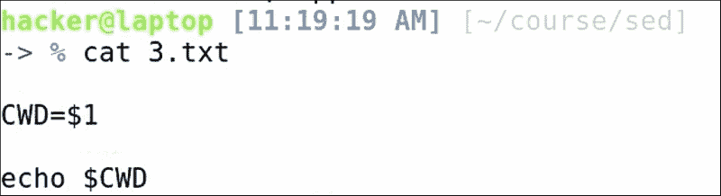

为此，我们将写道:

*   `s`:是代课用的。
*   `g`:是为了全球；意味着替换找到的所有事件。
*   `\$`:这匹配所有以美元符号开始的字符串。在这里，美元需要被逃脱，这样它就不会与排主播的*开头混淆。*
*   我们将把`$`后面的字符串括在(中)，这样我们就可以在命令的替换部分引用它。
*   `[ ]`:用于指定字符范围
*   `A-Z`:匹配所有大写字符
*   `0-9`:匹配所有数字
*   `_`:匹配`_`
*   `\+`:任何字符在`[ ]`中必须出现一次或多次

在替换部分，我们将使用:

*   `\$`:美元符号
*   `{ }`:我们要加的花括号。
*   `\1`: The string that was previously matched in the ( )

    ```sh
    sed 's/\$\([A-Z0-9_]\+\)/\${\1}/g' 3.txt

    ```

    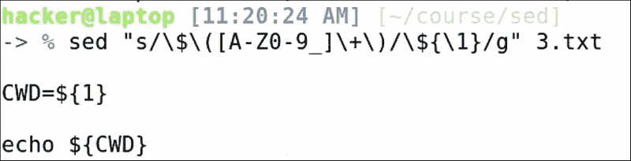

其他常见的场景是替换`xml`或`html`文件中的内容。

这里我们有一个基本的 html 文件，里面有一个`<strong>`文本。现在，我们知道`<strong>`文本对于搜索引擎优化有更多的语义价值，所以也许我们想让我们强大的标签成为一个简单的`<b>`(粗体)，并手动决定页面中的`<strong>`单词。为此，我们说:

*   `s`:这是给替补的。
*   `<strong`:我们正在搜索的实际文本。
*   `\( \)`:这将再次用于选择一段文字，该文字将被添加回来。
*   `.*`:表示任意字符，找到任意次数。我们想在“`<strong`”和“`strong>`”之间选择一切。
*   `</`:这是标签的结束。这个，我们要保持完好。
*   `<b\1b>`: Just add `<b b>`, and the text that you previously found in the `( )`.

    ```sh
    sed "s/<strong\(.*</\)strong>/<b\1b>/g" 4.xml

    ```

    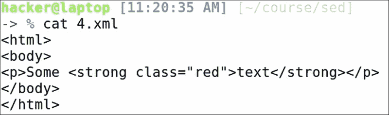

如您所见，文本更新正确，`red`类仍然适用于新标签，旧文本仍然包含在我们的标签之间，这正是我们想要的:

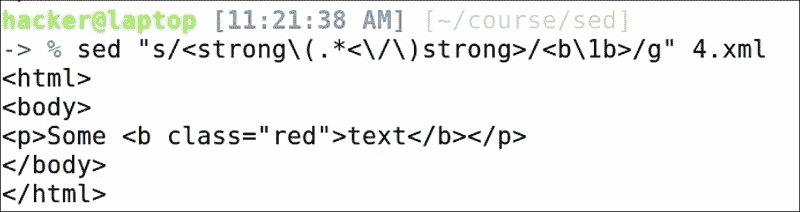

除了替换，sed 还可以用于删除文本行。我们的`5.txt`文件包含了`lorem ipsum`文本中的所有单词。如果我们想删除第三行文本，我们将发出以下命令:

```sh
sed -i 3d 5.txt

```

点击 *:e、*重新加载 vim 中的文件，我们看到`dolor`这个词已经不存在了。例如，如果我们想删除文件的前 10 行，我们只需运行:

```sh
sed -i 1,10d 5.txt

```

点击 *:e* ，你会看到线已经不在了。对于最后一个例子，如果我们向下滚动，我们可以看到多行空白文本。这些可以通过以下方式删除:

```sh
sed -i "/^$/d" 5.txt

```


代表:

*   `^`:线锚开始
*   `$`:线锚结束
*   `d`:删除

重新加载文件，您会看到这些行不再存在。

现在，你可以想象，这些只是一些基本的例子。sed 的力量比这大得多，使用它的可能性比我们今天看到的要多得多。我们建议您充分了解今天介绍的功能，因为这些可能是您最常用的功能。它并不像一开始看起来那么复杂，它在很多场景中都很有用。

# 你可以跑，但你不能躲…躲避寻找

几十个项目，几百个文件夹，几千个文件；这个场景听起来熟悉吗？如果答案是*是*，那么你可能不止一次发现自己处于找不到具体文件的情况。`find`命令将帮助我们定位项目中的任何文件，等等。但是首先，为了创建一个快速的游乐场，让我们从 GitHub 下载电子开源项目:

Git 克隆[https://github.com/electron/electron](https://github.com/electron/electron)

而`cd`进入其中:

```sh
cd electron

```

我们在这里看到许多不同的文件和文件夹，就像任何正常大小的软件项目一样。为了找到特定的文件，假设`package.json`，我们将使用:

```sh
find . -name package.json

```

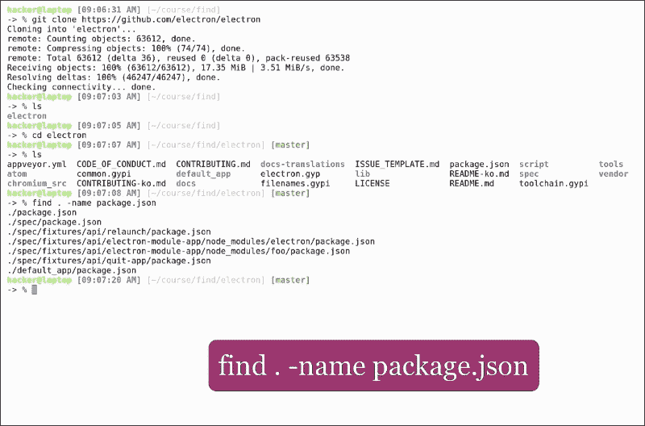

`.`:这将开始在当前文件夹中搜索

`-name`:这有助于搜索文件名

如果我们在项目中查找所有自述文件，前面的命令格式没有帮助。我们需要发布一个不区分大小写的查找。出于演示目的，我们还将创建一个`readme.md`文件:

```sh
touch lib/readme.md

```

我们还将使用`-iname`参数进行不区分大小写的搜索:

```sh
find . -iname readme.md

```


你看这里`readme.md`和`README.md`都找到了。现在，如果我们要搜索所有的 JavaScript 文件，我们将使用:

```sh
find . -name "*.js"

```


而且如你所见，有相当多的结果。为了缩小结果范围，让我们将查找限制在`default_app`文件夹:

```sh
find default_app -name "*.js"

```

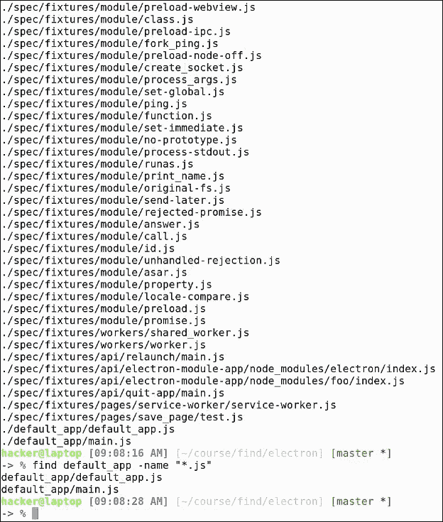

可以看到，这个文件夹里只有两个`js`文件。如果我们要找到所有不是 JavaScript 的文件，只需在名称参数前添加一个`!`标记:

```sh
find default_app ! -name "*.js"

```


你可以在这里看到所有不以`js`结尾的文件。如果我们要查找目录中属于文件类型的所有索引节点，我们将使用`-type f`参数:

```sh
find lib -type f

```


以同样的方式，我们将使用`-type d`来查找特定位置的所有目录:

```sh
find lib -type d

```


Find 还可以根据时间标识符定位文件。例如，为了找到`/usr/share`目录中最近 24 小时内修改过的所有文件，发出以下命令:

```sh
find /usr/share -mtime -1

```


我有一个很大的单子。你可以看到`-mtime -3`将列表扩大了更多。

例如，如果我们要找到最近一个小时内修改的所有文件，我们可以使用`-mmin -60`:

```sh
find ~/.local/share -mmin -60

```


一个好的搜索文件夹是`~/.local/share`，如果我们使用`-mmin -90`，列表又变宽了。

Find 还可以通过使用`-atime -1`参数向我们显示最近 24 小时访问的文件列表，如下所示:

```sh
find ~/.local/share -atime -1

```


在处理大量项目文件时，如果有时一些项目中的案例仍然是空的，而我们忘记了来删除它们。为了找到所有空文件，只需执行以下操作:

```sh
find . -empty

```

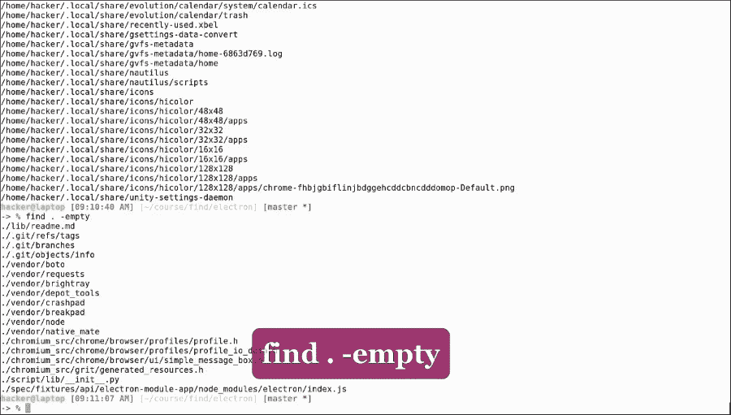

我们可以看到，电子有几个空文件。Find 还会显示空目录或链接。

删除空文件将保持我们的项目干净，但是当涉及到减小大小时，我们有时希望知道哪些文件占用了大部分空间。Find 还可以根据文件大小进行搜索。例如，让我们找到所有大于`1`兆的文件:

```sh
find . -size +1M

```

较小的使用-1M。

正如我们在开头所说的，find 可以做的不仅仅是在项目中定位文件。使用`-exec`参数，它可以与几乎任何其他命令结合使用，这赋予了它几乎无限的能力。例如，如果我们想要查找所有包含文本`manager`的`javascript`文件，我们可以将查找和`grep`结合起来，命令如下:

```sh
find . -name "*.js" -exec grep -li 'manager' {} \;

```


这将对 find 返回的所有文件执行 grep 命令。让我们也使用 vim 在文件内部搜索，以便验证结果是否正确。如您所见，文本“管理器”出现在这个文件中。你不用担心`{} \;`，这只是标准的执行语法。

继续实际的例子，假设你有一个文件夹，你想删除所有在过去 100 天修改的文件。我们可以看到我们的`default_app`文件夹包含这样的文件。如果我们像这样把 find 和`rm`结合起来:

```sh
find default_app -mtime -100 -exec rm -rf {} \;

```

我们可以快速清理一下。Find 可用于智能备份。例如，如果我们要备份项目中的所有`json`文件，我们将使用管道和标准输出重定向将 find 和`cpio`备份实用程序结合起来:

```sh
find . -name "*.json" | cpio -o > backup.cpio

```

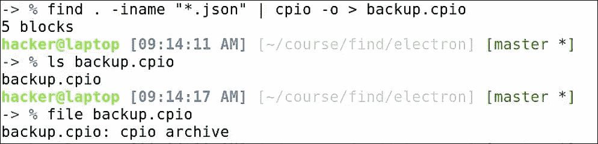

我们可以看到这个命令已经创建了一个`backup.cpio`文件，类型为`cpio`存档。

这可能也是用`-exec`写的，但是关键是你要明白管道也可以和重定向一起用在这种场景中。

做报告时，您可能需要计算所写的行数:

*   为了做到这一点，我们把 find 和`wc -l` :

    ```sh
    find . -iname "*.js" -exec wc -l {} \; 

    ```

    结合起来
*   这会给我们所有`js`文件和行数。我们可以用管道把这个切断:

    ```sh
    find . -iname "*.js" -exec wc -l {} \; | cut -f 1 -d ' ' 

    ```

*   要只输出行数，然后管道到粘贴命令，我们这样做:

    ```sh
    find . -iname "*.js" -exec wc -l {} \; | cut -f 1 -d ' ' | paste -sd+ 

    ```

*   The above will merge all our lines with the `+` sign as a delimiter. This, of course, can translate to an arithmetic operation, which we can calculate using the binary calculator (`bc`):

    ```sh
    find . -iname "*.js" -exec wc -l {} \; | cut -f 1 -d ' ' | paste -sd+ | bc

    ```

    

最后一个命令将告诉我们`javascript`文件包含多少行。当然，这些不是实际的代码行，因为它们可以是空行或注释。要精确计算代码行，可以使用`sloc`实用程序。

为了批量重命名文件，比如将所有`js`文件的文件扩展名更改为`node`，我们可以使用以下命令:

```sh
find . -type f -iname "*.js" -exec rename "s/js$/node/g" {} \;

```

您可以看到重命名语法与 sed 非常相似。此外，没有更多的`.js`文件了，因为所有文件都已重命名为`.node`:


有些软件项目要求所有源代码文件都有版权头。由于一开始并不需要这样做，所以很多时候我们会发现自己处于这样一种情况，即我们必须在所有文件的开头添加版权信息。

为此，我们可以将 find 与 sed 结合起来，如下所示:

```sh
find . -name "*.node" -exec sed -i "1s/^/\/** Copyright 2016 all rights reserved *\/\n/" {} \;

```

这基本上是在告诉电脑找到所有`.node`文件，在每个文件的开头加上版权声明，后面加一行新的。

我们可以检查一个随机文件，是的，版权声明在那里:

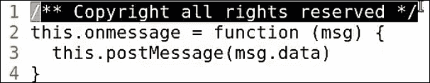

更新所有文件中的版本号:

```sh
find . -name pom.xml -exec sed -i "s/<version>4.02/<version>4.03/g" {} \;

```

可以想象，find 有很多用例。我给你看的例子只是第一部分。学习查找，以及`sed`和`git cli`可以让你在查找、重构或使用`git`时从你的 IDE 中解放出来，这意味着你可以更容易地从一个 IDE 切换到另一个 IDE，因为你不必学习所有的功能。您只需使用友好的命令行界面工具。

# tmux–虚拟控制台、后台作业等

在这一节中，我们将看到另一个很棒的工具，叫做 tmux。当在远程`ssh`会话中工作时，Tmux 特别有用，因为它让你能够从你停止的地方继续你的工作。如果你在工作，例如在苹果电脑上，你不能安装终结者，它也可以取代终结者中的一些功能。

要在 Ubuntu 上开始使用`tmux`，我们首先需要安装它:

```sh
sudo apt install tmux

```

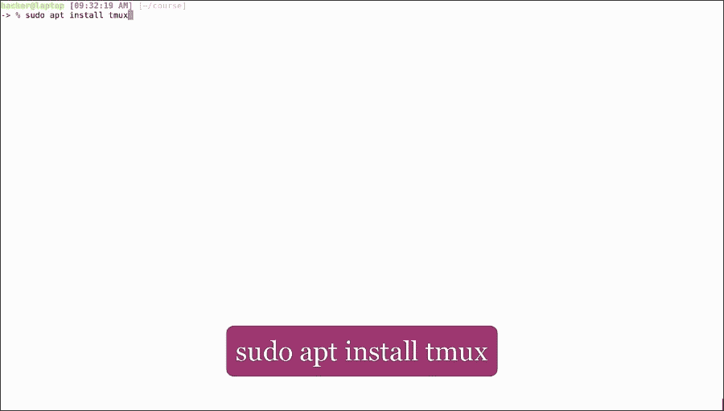

然后只需运行命令:

```sh
tmux

```


你会发现自己置身于一个全新的虚拟控制台中:

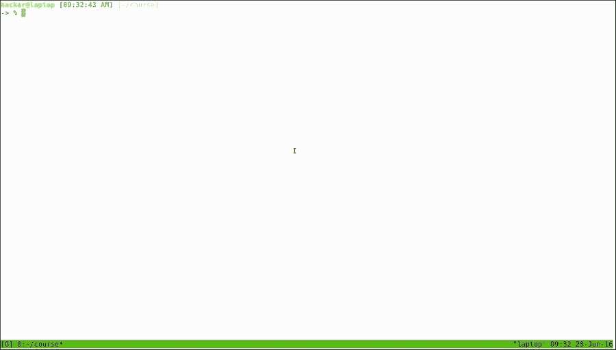

出于演示目的，我们将打开一个新的选项卡，您可以使用`tmux ls`查看打开的会话列表:

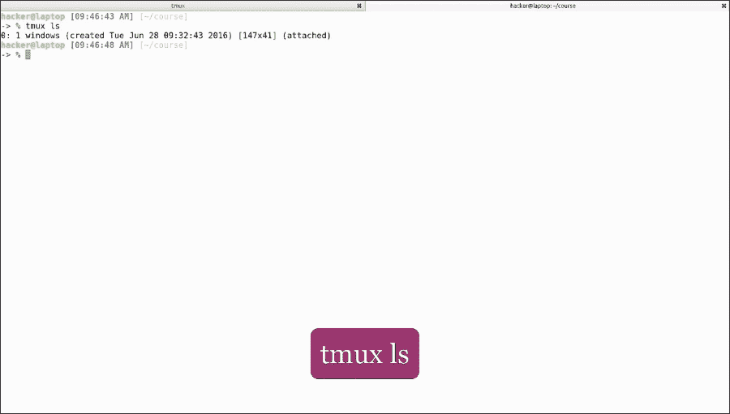

让我们开始一个新的`tmux`命名会话:

```sh
tmux new -s mysession

```


在这里我们可以看到打开一个`tmux`会话会维护当前目录。要在`tmux`内列出并切换`tmux`会话，请点击 *Ctrl* + *B* *S* 。

我们可以看到我们可以切换到另一个 tmux 会话，在里面执行命令，如果愿意的话可以切换回我们的初始会话。要分离(保持会话运行并返回正常终端)，请点击*Ctrl*+*b d*；

现在我们可以看到我们有两个开放的会议。

要附加到会话，请执行以下操作:

```sh
tmux a -t mysession

```


当您登录到远程服务器并想执行一个长时间运行的任务，然后离开并在任务结束时返回时，这种情况会很方便。我们将使用名为 infinity.sh 的快速脚本来复制这个场景。我们将执行它。它正在写入标准输出。现在让我们脱离 tmux。

如果我们看一下脚本，它只是一个简单的 while 循环，永远继续下去，每秒打印文本。

现在，当我们回到会话时，我们可以看到脚本在运行，而我们从会话中分离出来，它仍然向控制台输出数据。我会通过点击 *Ctrl* + *c* 手动停止。

好吧，让我们去我们的第一个 tmux 会话，并关闭它。要手动终止正在运行的 tmux 会话，请使用:

```sh
tmux kill-session -t mysession

```


这将终止正在运行的会话。如果我们切换到第二个选项卡，我们可以看到我们已经注销了 tmux。让我们也关闭这个终止符选项卡，并打开一个全新的 tmux 会话:


Tmux 给你分屏的可能性，就像终结者一样，水平用 *Ctrl* + *b* +”，垂直用*Ctrl*+*b*+*%*。之后，使用 *Ctrl* + *b* +箭头在窗格之间导航:

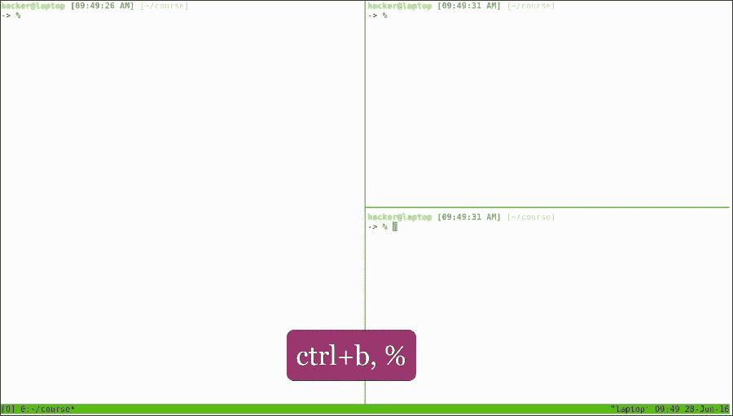

您还可以创建窗口(标签):

*   *Ctrl* + *b c*: create:

    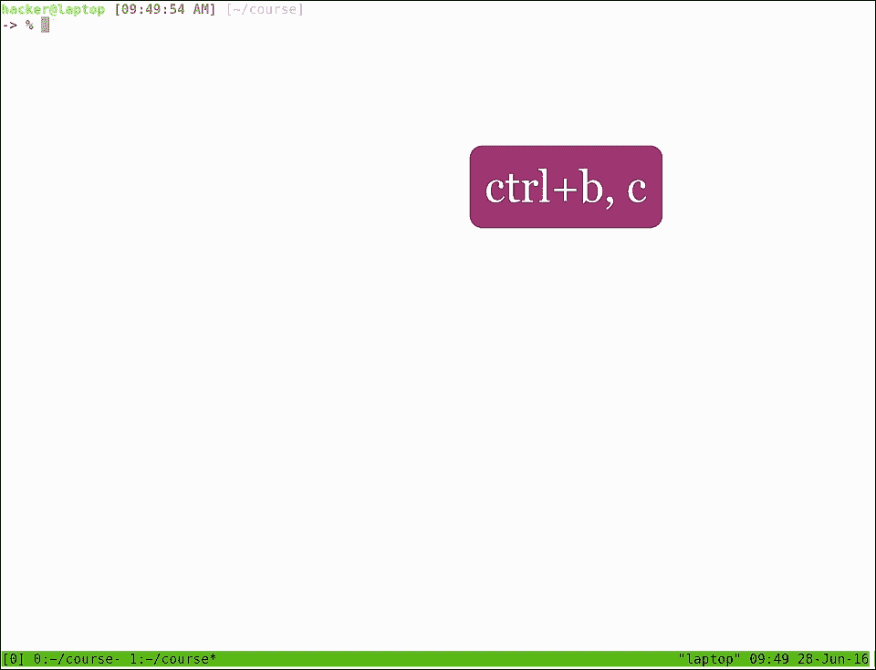

*   *Ctrl* + *b w*: list:

    

*   *Ctrl* + *b &*: delete

    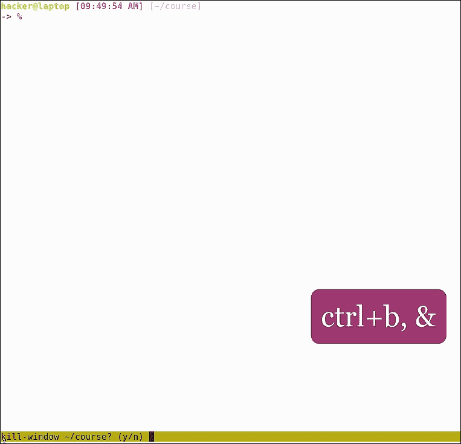

最后这些功能与终结者提供的非常相似。

您可以在远程`ssh`连接中希望有两个或更多窗格甚至选项卡，但不想打开多个`ssh`会话的情况下使用 tmux。你也可以在本地使用它，作为终结者的替代品，但是键盘快捷键更难使用。虽然它们可以更改，但是您将失去远程使用 tmux 的选项，因为不鼓励在另一个 tmux 会话中打开一个 tmux 会话。此外，由于快捷方式的差异，配置新的 tmux 键盘快捷方式可能会使 tmux 在处理大量服务器时成为负担。

# 网络–谁在听？

在使用网络应用时，能够看到开放的端口和连接，并且能够与不同主机上的端口进行交互以进行测试，这非常方便。在本节中，我们将了解一些基本的网络命令，以及它们在什么情况下会派上用场。

第一个命令是`netstat`:

```sh
netstat -plnt

```


这将显示我们主机上所有打开的端口。你可以在这里看到，我们在一个默认的 Ubuntu 桌面安装上只有一个开放的端口，那就是端口 `53`。我们可以在特殊文件`/etc/services`中查找这个。该文件包含程序和协议的所有基本端口号。我们在这里看到的端口`53`是 DNS 服务器:


仅仅通过分析输出，我们无法确定哪个程序正在监听这个端口，因为这个过程不属于我们当前的用户。这就是为什么*PID/程序名*栏为空的原因。如果我们用`sudo`再次运行相同的命令，我们会看到这个过程被命名为`dnsmasq`，如果我们想要更多的信息，我们可以在手册页中查找。这是一个轻量级的 DHCP 和缓存 DNS 服务器:

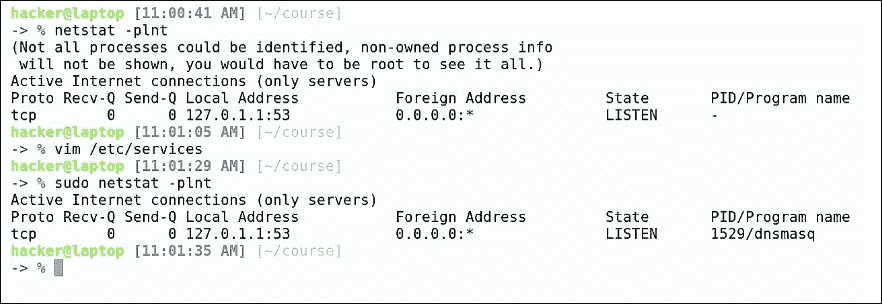

我们从该命令中获得的其他有用的信息:

*   程序协议，在这种情况下是 dhcp。
*   未复制的总字节数。
*   未确认的字节总数。
*   本地和国外地址和港口。获取端口是我们使用这个命令的主要原因。这对于确定端口是仅在本地主机上打开还是正在侦听网络上的传入连接也很重要。
*   港口的状态。通常这是**听着**。
*   PID 和程序名，帮助我们识别哪个程序在哪个端口监听。

现在，如果我们运行一个应该在某个端口监听的程序，但我们不知道它是否工作，我们可以通过`netstat`找到答案。让我们通过运行以下命令来打开最基本的 HTTP 服务器:

```sh
python -m SimpleHTTPServer

```

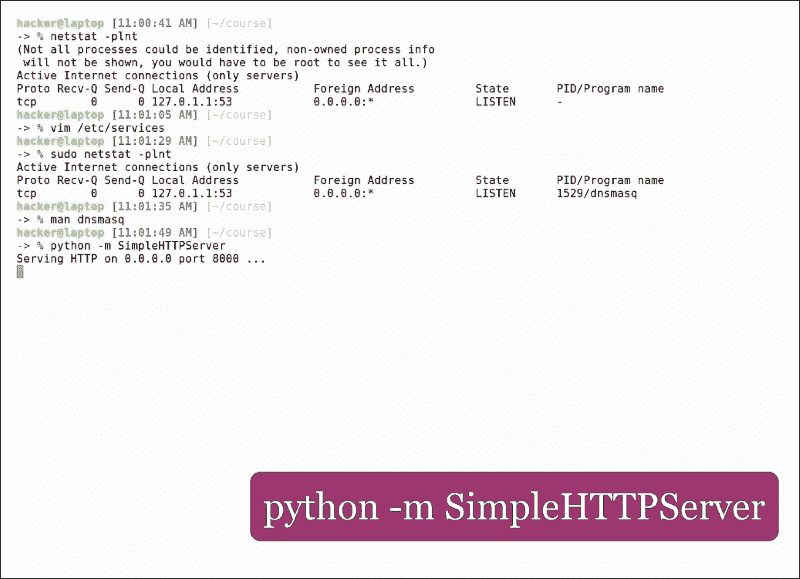

从输出中可以看到，它正在接口`0.0.0.0`上的端口`8000`上监听。如果我们打开一个新的窗格并运行`netstat`命令，我们将看到打开的端口和 PID /名称。

您可能已经知道这一点，但是为了安全起见，我们将考虑在我们的机器上添加不同的主机名作为静态`dns`条目。当开发需要连接到服务器并且服务器更改其 IP 地址的应用时，或者当您想要模拟本地机器上的远程服务器时，这很有帮助。为此，我们键入:

```sh
sudo vim /etc/hosts

```


您可以从现有内容中快速了解文件的格式。让我们为本地主机添加一个别名，这样我们就可以用不同的名称访问它。添加以下一行:

```sh
127.0.0.1     myhostname.local

```

我们建议本地主机使用不存在的顶级域名，例如。这是为了避免覆盖任何现有地址，因为`/etc/hosts`在`dns`解析中优先。现在，如果我们在`8000`端口的浏览器中打开该地址，我们将看到本地 Python 服务器正在运行并提供内容。

下一个命令是`nmap`。如您所见，默认情况下，Ubuntu 上没有安装它，所以让我们通过键入以下内容来安装它:

```sh
sudo apt install nmap 

```


Nmap 是用于检查远程主机上所有打开端口的命令，也称为端口扫描程序。如果我们在我们的网络网关上运行`nmap`，在我们的例子中是`192.68.0.1`，我们将获得网关上所有打开的端口:

类型: **nmap 192.168.0.1**


如您所见，又有`dns`端口打开，http 和 https 服务器，用作配置路由器的网页，以及端口`49152`，此时，它不特定于任何通用协议-这就是为什么它被标记为未知。Nmap 不确定那些特定的程序是否真的在主机上运行；它所做的只是验证哪些端口是打开的，并编写通常在该端口上运行的默认应用。

如果我们不确定需要连接什么服务器，或者想知道当前网络中有多少服务器，可以在本地网络地址上运行`nmap`，指定网络掩码为目的网络。我们从`ifconfig`得到这个信息；如果我们的 IP 地址是`192.168.0.159`，我们的网络掩码是`255.255.255.0`，这意味着命令将如下所示:

```sh
nmap -sP 192.168.0.0/24

```

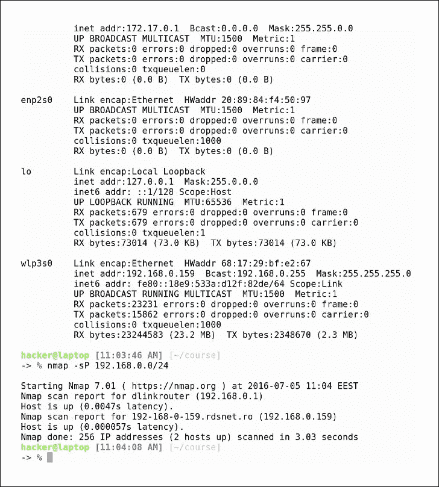

在`/24 = 255.255.255.0`中，基本上网络会有从`192.168.0.0`到`192.168.0.255`的`ips`。我们在这里看到，我们有三个活动主机，它甚至给了我们延迟，因此我们可以确定哪个主机更近。

Nmap 在开发客户机-服务器应用时很有帮助，例如，当您想查看服务器上有哪些端口可以访问时。但是，`nmap`可能会错过非标准的特定于应用的端口。为了实际连接到给定的端口，我们将使用预先安装在 Ubuntu 桌面上的 telnet。要查看特定端口是否接受连接，只需键入主机名，后跟端口:

```sh
telnet 192.168.0.1 80

```

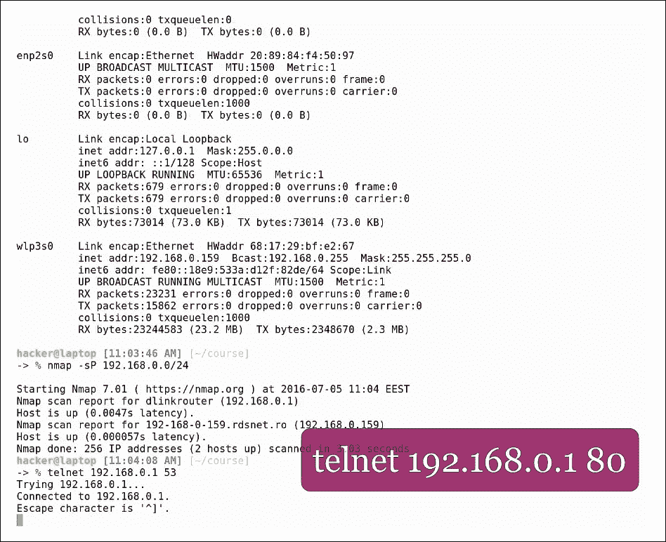

如果端口正在侦听并接受连接，telnet 将输出如下消息:

*   尝试`192.168.0.1`...
*   连接到`192.168.0.1`
*   转义字符为`^]`

这意味着你也可以从你的应用连接。所以如果你在连接上有困难，那通常是客户的问题；服务器工作正常。

要退出 telnet，点击:*Ctrl*+*，然后是 *Ctrl* + *d* 。*

 *此外，在某些情况下，我们需要获取特定主机名的 ip 地址。最简单的方法是使用 host 命令:

```sh
host ubuntu.com

```

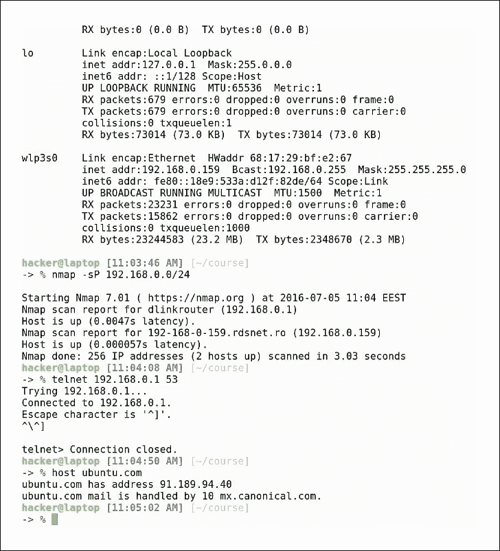

为了开始使用主机名和端口，我们只学习了基础知识，即您需要的最少元素。为了更深入地了解网络和包流量，我们建议查看关于渗透测试或网络流量分析工具(如 Wireshark)的课程。这里有一个这样的课程:[https://www . packtpub . com/networking-and-servers/mastering-wireshark”](https://www.packtpub.com/networking-and-servers/mastering-wireshark)。

# Autoenv–建立一个持久的、基于项目的栖息地

项目彼此不同，环境也不同。我们可能正在我们的本地机器上开发一个应用，该应用具有某些环境变量，如调试级别、应用编程接口键或内存大小。然后，我们希望将应用部署到一个临时的或生产服务器上，该服务器具有相同环境变量的其他值。用于动态加载环境的工具是`autoenv`。

要安装它，我们转到官方 GitHub 页面，并按照说明进行操作:

[https://github . com/kennethritz/autonv](https://github.com/kennethreitz/autoenv)

首先，我们将在主目录中克隆项目，然后将下面的行添加到。zshrc 配置文件，以便每次 zsh 启动时，默认情况下会加载 autoenv:

```sh
source ~/.autoenv/activate.sh

```

现在让我们创建一个有两个假想项目的示例工作场所，项目 1 和项目 2。

我们为项目 1 打开一个环境文件:

```sh
vim project1/.env

```

现在让我们假设项目 1 使用了一个名为`ENV`的环境变量，我们将它设置为`dev`:

```sh
export ENV=dev

```


现在让我们对项目 2 做同样的事情，但是对`ENV`用不同的值；`qa`:

```sh
export ENV=qa

```


保存并关闭这两个文件。现在当我们在项目 1 文件夹中 cd 时，我们看到如下消息:

```sh
autoenv:
autoenv: WARNING:
autoenv: This is the first time you are about to source /home/hacker/course/work/project1/.env:
autoenv:
autoenv:     --- (begin contents) ---------------------------------------
autoenv:     export ENV=dev$
autoenv:
autoenv:     --- (end contents) -----------------------------------------
autoenv:
autoenv: Are you sure you want to allow this? (y/N)
```

点击 *y* 加载文件。每次获取新的环境文件时都会发生这种情况。现在，如果我们为 ENV 变量对环境进行 grep，我们可以看到它存在，并且值为`dev`:


现在让我们将目录更改为`project 2`:


我们可以看到发出了同样的警告信息。当我们对 ENV 变量进行 grep 时，我们现在看到它的值是`qa`。如果我们离开这个文件夹，环境变量仍然被定义，并且将被定义，直到其他脚本覆盖它或者当前会话关闭。`.env`文件来源于，即使我们 cd 到项目 1 内部更深的目录。

现在让我们看一个更复杂的项目 1 的例子。

假设我们想从`package.json`获取版本，我们还想使用一个名为 COMPOSE_FILE 的变量，该变量将为 docker compose 指定一个不同的文件。Docker 用户知道这是怎么回事，但是如果你不知道..谷歌时间！

这里有一个例子:

```sh
export environment=dev
export version=`cat package.json | grep version | cut -f 4 -d "\""`
export COMPOSE_FILE=docker-compose.yml
```

为了使其生效，我们需要首先复制一个`package.json`文件，并测试`cat`命令是否有效:

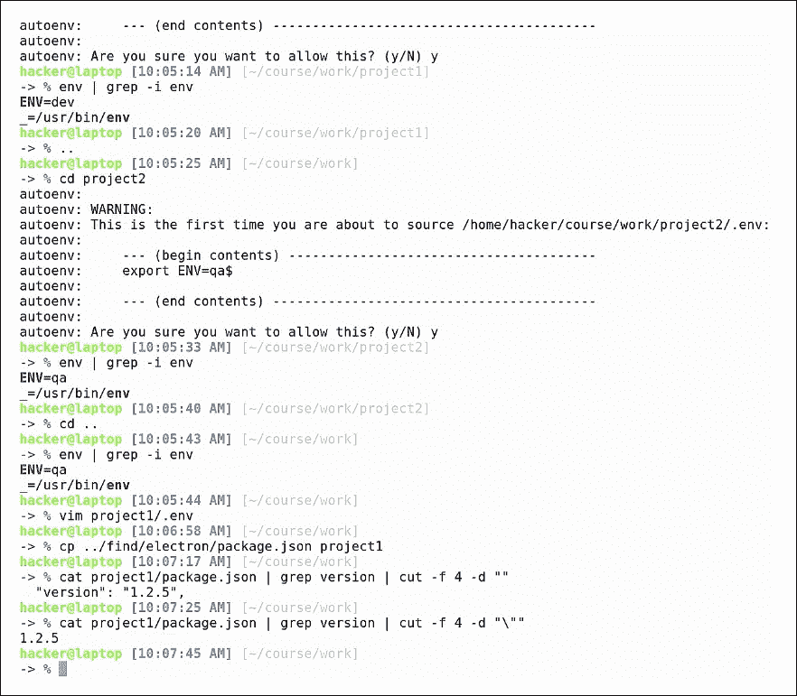

一切似乎都很好，所以让我们进入我们的文件夹:


如您所见，环境变量已经设置:


`Autoenv`真的能派上用场，而且不仅限于导出环境变量。您可以做一些事情，比如在进入某个项目或运行`git pull`时发出提醒，或者更新终端的外观和感觉，以便为每个项目提供独特的感觉。

## 不要乱扔垃圾

命令可以分为无害的和有害的。大多数命令都属于第一类，但有一个命令非常常见，已知会在计算机世界中造成大量破坏。可怕的命令是`rm`，它摧毁了无数硬盘，使得大量宝贵的数据无法访问。Linux 桌面借鉴了其他桌面的垃圾概念，删除文件时默认的动作是将其发送到`Trash`。发送文件是一个很好的做法，这样就不会无意中删除文件。但是这个垃圾没有神奇的位置；这只是一个隐藏的文件夹，通常位于`~/.local`。

在这一部分，我们将看到一个实用工具，旨在处理垃圾。我们将通过以下方式安装它:

```sh
sudo apt install trash-cli

```

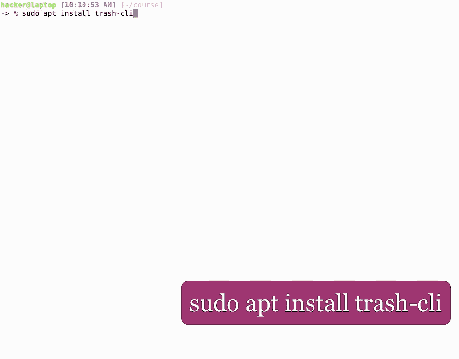

这将安装多个命令。让我们来看看当前包含相当多文件的目录。假设我们不需要以文件开头的文件。`*`

为了删除文件，我们将使用:

```sh
trash filename

```


(使用垃圾桶有一个单独的命令。我们将重新加载我们的路径。)我们列出了所有垃圾桶命令。列出废纸篓内容的命令是:

```sh
trash-list

```

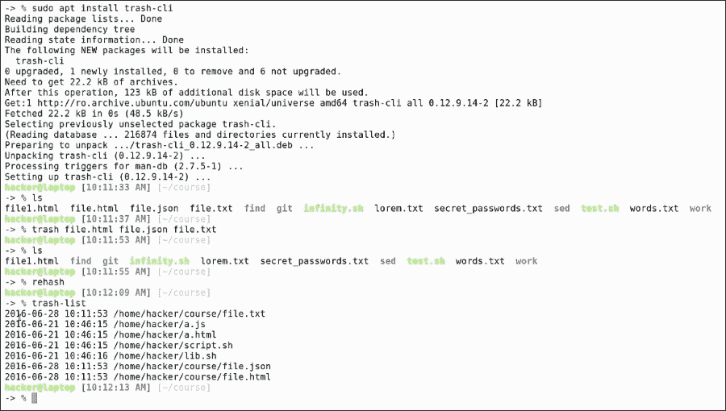

在这里，我们可以看到垃圾桶里的文件。它只显示与废纸篓命令放在一起的文件。我们可以看到它们被删除的日期、时间和确切位置。如果我们有多个具有相同名称和路径的文件，它们就会被列在这里，我们可以通过删除日期来识别它们。

为了从废纸篓恢复文件，我们将使用以下命令:

```sh
restore-trash

```


它将向我们显示一个选项列表，并要求一个与我们想要恢复的文件相对应的数字。在这种情况下我们将选择 1，这意味着我们想要恢复`json`文件。

我们打开文件，可以看到内容在这个过程中没有被修改。

为了删除废纸篓中的所有文件，我们使用:

```sh
trash-empty

```


这相当于首先做`rm`。现在，如果我们再次列出垃圾，我们会看到它没有任何内容。

虽然网络上充斥着`rm -rf /`的笑话，但这实际上是一个严重的问题，会导致头痛，浪费时间试图恢复造成的损害。如果你已经使用`rm`很长时间了并且不能养成使用垃圾桶的习惯，我们建议为`rm`添加一个别名来实际运行垃圾桶命令。在这种情况下，在提交文件之前，或者甚至在删除整个根分区之前，将一堆堆的文件堆积在垃圾箱中比冒险删除一个可能需要的文件更好！*