# 五、开发者的宝藏

在这一章中，我们将从使用 Python 构建网络服务器开始。然后我们将看到如何使用 ImageMagick 自动处理我们所有的图像。然后，我们将看看 git 流分支模型以及它将如何帮助您。此外，我们将看到 meld 命令行如何帮助合并我们的 git 冲突。然后，我们将重点关注 ngrok 工具的工作，看看它如何通过将来自互联网的请求代理到我们的笔记本电脑来节省时间。我们还将探索 JSON 的瑞士军刀 jq 的全能查询能力！最后，我们将探索管理和终止 Linux 进程的方法。

在本章中，我们将介绍以下内容:

*   收缩法术和其他图像魔法
*   理解 git 流分支模型的工作
*   使用 ngrok 保护到本地主机的隧道
*   了解 jq

# 现场网络服务器

我们准备了一个基本的演示`html`文件，其中包含一个按钮、`div`、`jquery`功能(用于帮助我们进行一些`ajax`调用)和一个脚本，该脚本将尝试从我们的服务器加载静态内容并将内容放入`div`标签中。该脚本试图在磁盘上加载一个简单的文本文件，`/file`:

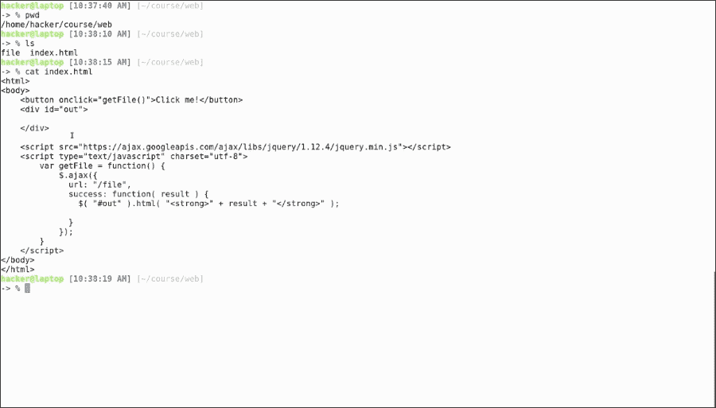

如果我们在浏览器中打开这个文件，我们可以看到页面内容:


点击按钮产生`javascript`错误。它告诉我们，我们想做一个跨来源的请求，这是浏览器默认不允许的。这是为了防止跨站点脚本攻击。为了测试我们的`javascript`代码，我们需要做的是在一个 HTTP 服务器中提供这个文件。

为了在文件所在的文件夹中启动 HTTP 服务器，我们键入以下命令:

```sh
python -m SimpleHTTPServer

```

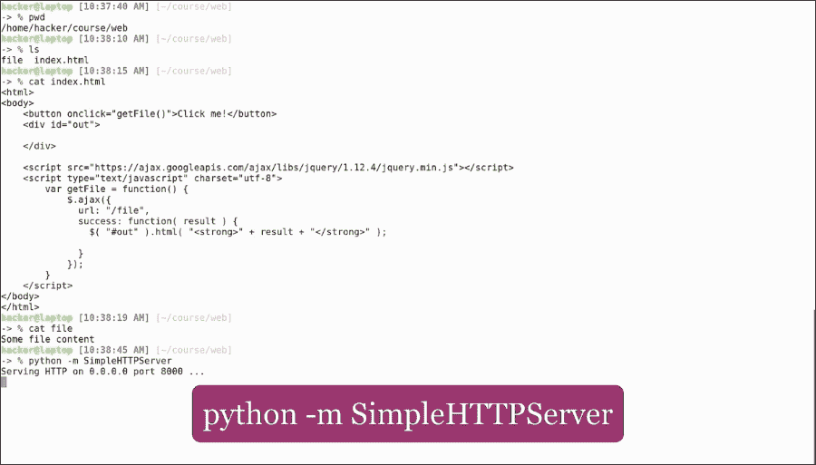

这是一个基本的 Python 模块，在 localhost 上打开端口`8000`，只服务静态内容(所以，不，不能用于`php`)。让我们在浏览器中打开地址:

点击**点击我！**按钮。我们看到我们的文件内容被加载到按钮下方的`div`中，这意味着浏览器不再阻止我们，因为我们使用相同的协议向同一台主机发出请求。查看 Python 服务器的输出，我们可以看到浏览器向服务器发出的所有请求。我们可以看到它默认请求一个不存在的`favicon.ico`文件，并返回一个`404`状态代码:


你可以在 GitHub 项目页面找到这个项目中使用的文件。

此外，如果我们停止服务器并升级一级并再次启动它，我们可以将其用作`webdav`服务器，有可能在当前目录中的文件中导航。例如，我们可以让远程用户访问我们本地机器上的一个文件夹，并允许他们通过浏览器中的一个页面来访问它，从而无需安装文件服务器。

# 收缩法术和其他图像魔法

在本章中，我们将学习如何从命令行处理图像。我们将从最复杂和广泛使用的图像命令行界面处理工具包 **ImageMagick** 开始。要安装它，请运行以下命令:

```sh
sudo apt install imagemagick

```


如您所见，我们已经安装了它。

现在，让我们找一些图像来处理。让我们使用`/usr/share/backgrounds`中可以找到的默认 Ubuntu 背景。让我们将背景复制到另一个位置，这样我们就不会更改默认的背景。

我们先来看看我们列表中的第一张图片:从`ls`可以看出是 1.6 MB 的 JPEG 图片。要打开它并查看的外观，让我们使用 **eog** (【侏儒之眼】)图像查看器:


知道如何处理图像的第一个也是最重要的部分是知道图像实际上是什么。为了找到答案，ImageMagick 提供了一个名为**的工具来识别**。最简单的形式是给它一个图像名称，它会输出如下信息:

```sh
identify image_name
160218-deux-two_by_Pierre_Cante.jpg JPEG 3840x2400 3840x2400+0+0 8-bit sRGB 1.596MB 0.240u 0:00.230

```

我们可以看到，该文件是一个 1.6 MB 的 JPEG 图像，最重要的是，它的大小为 3，840x2，400 像素。

如果我们看`warty-final-ubuntu.png`我们会看到输出格式是相似的:尺寸和分辨率更高，图像格式是 PNG。让我们看看它是什么样子的:

```sh
eog warty-final-ubuntu.png

```


PNG 图像通常比 JPEG 图像占用更多的空间。如果没有透明度，建议使用`.jpg`。为了从一种类型转换到另一种类型，我们使用带有两个参数的`imagemagick` `convert`命令:输入文件名和输出文件名:

```sh
convert file.png file.jpg

```


输出图像的格式将由`convert`从文件扩展名中推导出来。如你所见，输出的是一个相同分辨率的 JPEG 图像，但尺寸比小得多 PNG 版本:180 KB，而不是 2.6 MB。如果我们打开图像，我们看不到任何明显的差异。这对于网页开发来说是一件大事，因为如果我们在网页上使用这张图片，它的加载速度将比 PNG 版本快 15 倍。

如果我们想要裁剪图像的一个区域，我们可以通过`convert`来完成。例如，如果我们想从坐标 100，100 开始切割一张 500x500 的图像，我们可以使用以下方法:

```sh
convert -crop "500x500+100+100" warty-final-ubuntu.png warty.jpg

```

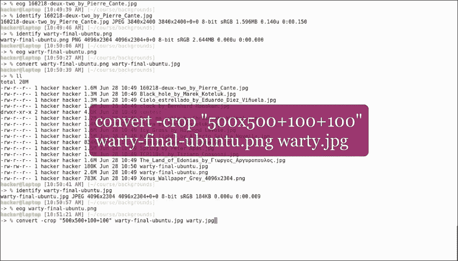

正如我们所看到的，输出图像的分辨率是我们要求的，但是它的大小要小得多，只有 2.5 KB。从视觉上分析两幅图像，我们可以看到裁剪的那幅是大图的一部分。通常情况下，您不会想要在命令行中猜测像素，但是会使用图像处理软件(如 GIMP)来为您完成工作，以便您可以直观地选择和裁剪部分图像。然而，在开发软件应用时，通常情况下，您必须以编程方式裁剪图像，在这种情况下，这就派上了用场。

`convert`命令也擅长创建图像。如果我们想从文本字符串创建图像，我们可以使用以下方法:

```sh
convert -size x80 label:123 nr.jpg

```

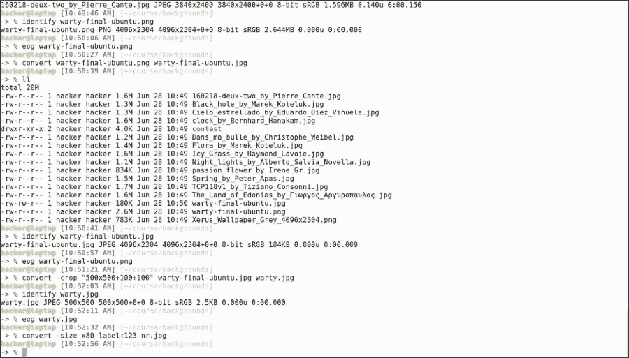

这将创建一个高度为 80 像素的 JPEG 图像，包含指定的文本，在本例中为字符串`123`。我们可以看到输出，它是一个 3.4 KB 的图像，如果我们从视觉上看，我们会看到文本`123`:


这在需要以编程方式生成可读图像的不同场景中也会派上用场，例如使用验证码软件或生成带有用户姓名首字母的默认配置文件图像。

现在我们来看看`imagemagick`之外的一些图像缩小工具。第一个是名为`pngquant`的`png`收缩工具。我们将通过键入以下内容来安装它:

```sh
sudo apt install pngquant

```

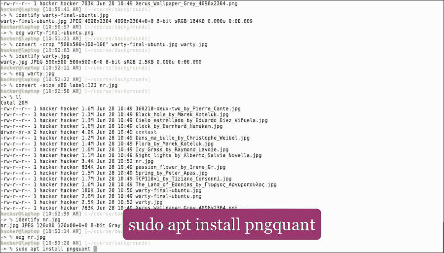

让我们尝试缩小之前看到的大的 PNG 图像。如果图像包含透明度并且需要保持 PNG 格式，我们就用下面的图像名称来调用`pngquant`:

```sh
pngquant warty-final-ubuntu.png

```


默认情况下，它输出一个具有相同名称和添加的`fs8`扩展名的文件。我们可以看到的大小差异也很明显(小了 1 MB，几乎是原来的一半大小)。如果我们直观地比较图像，我们将无法发现任何差异:


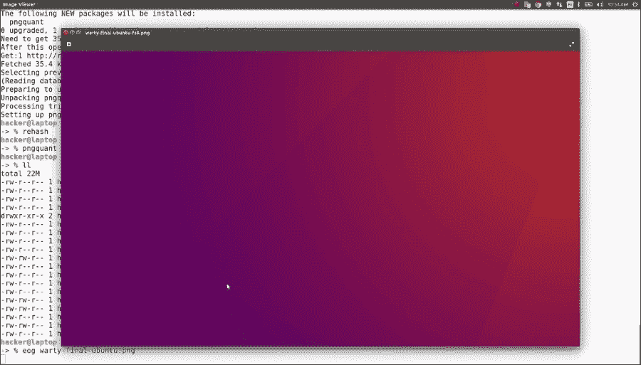

好了，现在让我们试着对 JPEG 图像做同样的事情。

为此，我们将安装相当于`pngquant,`，也就是`jpegoptim`:

```sh
sudo apt install jpegoptim

```


我们将以同样的方式调用它，我们只是给它一个命令行参数，也就是要收缩的文件。让我们挑选一些随机图像，看看是否可以缩小它们的大小:


从输出可以看出，是说**跳过了**。这意味着图像已经被缩小了(Ubuntu 的人在提交图像之前可能使用了相同的工具)。如果我们在`imagemagick`制作的 JPEG 上再次尝试，可以看到它也被跳过了:`imagemagick`已经使用了最小必要格式。

当涉及到网络开发时，图像处理工具尤其方便，在网络开发中，需要使用大量的图像，并且图像的大小需要尽可能小。命令行工具非常有用，因为它们可以用来自动化任务。图像收缩通常被添加到构建任务中，在那里准备网站的生产版本。`imagemagick`工具包附带了比我们今天看到的工具多得多的工具，所以请随意探索工具包中其他方便的命令。此外，当涉及到图形处理图像时，有一些很好的开源工具，如 GIMP 和 Inkscape，可以真正帮助您完成工作，并为您节省大量资金。

# 随波逐流

**Git** 是目前最受欢迎的版本控制系统。在这一章中，我们将看到 Git 的一个插件，名为 **GitFlow** ，它为软件项目提出了一个分支模型。这种分支模型对小项目没有太大的帮助，但对大中型项目来说是一个很大的好处。我们将看到一个名为`gitflow-avh`的`git-flow` 插件的变体，它增加了额外的功能，比如 **Git hooks** 、[https://github.com/petervanderdoes/gitflow-avh](https://github.com/petervanderdoes/gitflow-avh)。

要安装它，我们将按照 GitHub 页面上的说明进行操作。我们在 Ubuntu 上，所以我们将按照的安装说明来安装 Linux。

我们可以看到它可以直接用`apt`命令安装，但是 apt 通常不包含最新版本的软件，所以今天我们来做一个手动安装。我们想选择稳定的版本，并使用一行命令。

完成后，让我们创建一个虚拟项目。我们将创建一个空目录，并将其初始化为 Git 存储库:

```sh
git init

```

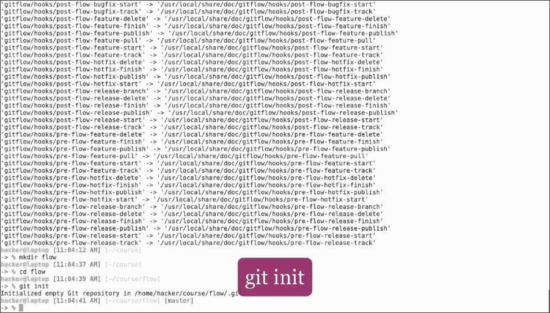

基础 Git 用法不是本课程的一部分，我们假设您了解基础知识。

好吧。开始阅读`git-flow`的一个好方法是阅读丹尼尔·库默创作的优秀备忘单:

[http://danielnumber . github . io/git-flow-cheat sheet/](http://danielkummer.github.io/git-flow-cheatsheet/)

这为提供了基本的提示和技巧，让您快速开始使用`git-flow`。因此，cheatsheet 建议的第一件事是运行以下内容:

```sh
git flow init

```

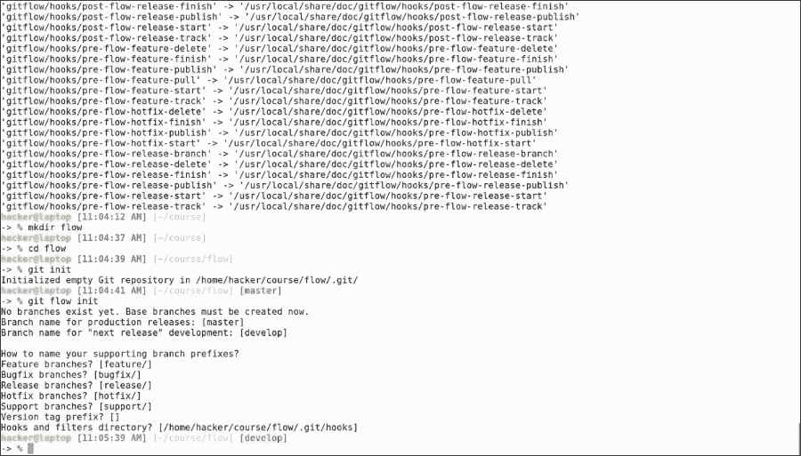

要配置它，我们需要回答一堆问题，关于分支在每个流中应该有什么名字，版本标签前缀和 hooks 目录是什么。让我们保持默认值。现在，让我们运行以下内容:

```sh
git branch

```


我们可以看到我们现在在`develop`分支上，所以不再在`master`分支上开发。这有助于我们有一个稳定的主人，而不那么稳定的特征则保留在`develop`分支上。

如果我们回到 cheatsheet，我们可以看看第一个项目，这是一个功能分支。功能分支在开发功能的特定部分或进行重构时很有用，但是您不想破坏开发分支上的现有功能。要创建要素分支，只需运行以下命令:

```sh
git flow feature start feature1

```


这不是对该特性最直观的描述，但它有助于演示。`GitFlow`一旦特征分支完成，还将向我们显示动作摘要。这使得在开发分支的基础上创建了一个名为`feature/feature1`的新分支，并将我们切换到该分支。我们也可以从我们得心应手的`zsh`提示中看到这一点。

让我们打开一个文件，编辑并保存它:

```sh
git status

```


该命令将告诉我们，我们有一个未提交的文件。让我们开始行动吧。

现在`git commit`正在使用`nano`编辑器编辑提交消息。既然我们更喜欢`vim`，让我们继续将默认编辑器更改为`vim`。我们所需要做的就是在我们的`zshrc`中添加这一行并重新加载它:

```sh
export EDITOR=vim

```

现在，当我们执行`git commit`时，Vim 打开，向我们显示提交的摘要，然后关闭。

现在让我们假设我们已经完成了一个新特性的添加。是时候将功能分支合并回以下内容进行开发了:

```sh
git flow feature finish feature1

```


同样，要获得操作摘要:

*   功能分支被合并回去开发
*   特征分支已被删除
*   当前分支被切换回开发

如果我们执行`ls`，我们会在开发分支上看到来自我们分支的文件。查看备忘单，我们可以看到这个过程的图形表示。

接下来是开始发布。发布分支有利于停止来自开发分支的传入特性和 bug 修复，测试当前版本，提交其上的 bug 修复，并向公众发布。

我们可以看到，语法是相似的，过程也是相似的，开发分支到一个发布分支，但是当涉及到完成分支时，特性也合并到主分支，并且从这个分支中剪切出一个标签。是时候看到它发挥作用了:

```sh
git flow release start 1.0.0

```


这将我们切换到我们的`release/1.0.0`分支。让我们添加一个`releasenotes.txt`文件来显示这个版本中发生了什么变化。增加了更多的 bugs 希望没有！

让我们提交文件。

当您开始运行您的集成和压力测试时，通常会出现这种情况，以查看是否一切正常，并检查是否没有 bug。

测试完成后，我们继续完成我们的发布分支:

```sh
git flow release finish 1.0.0

```


它会提示我们一系列的发布消息:我们将保留所有的默认值。

查看摘要，我们可以看到:

*   发布分支被合并到主分支中
*   从主版本中剪切出一个标签
*   标签也被合并到开发中
*   发布分支已被删除
*   我们又回到了发展分支

现在，我们运行以下内容:

```sh
git branch

```


我们看到只有两个可用的分支被掌握和发展:

```sh
git tag

```


这告诉我们，有一个 1.0.0 标签切割。我们可以看到，分支现在包含两个文件，分别来自特征和释放分支的合并；如果我们也切换到 master 分支，我们可以看到，在这一点上，master 是 develop 的精确副本:


GitFlow 还带有增强的钩子功能。如果我们阅读文档，我们可以在`hooks`文件夹中看到所有可能的钩子。让我们添加一个`git`钩子，它将在每个修复分支之前执行。为此，我们只需打开模板，复制内容，并将其粘贴到我们的`.git/hooks`目录中名为`pre-flow-hotfix-start`的文件中。

GitFlow 的工作流程比所展示的要多。我们不会一一介绍，但是您可以通过访问 cheatsheet 页面或阅读 GitHub 页面上的说明来找到附加信息。

我们就简单的`echo`一个有版本和出处的消息。

如果我们看一下`hotfix`流程，可以看到它们是从主分支创建的，合并回 master 进行开发，在 master 上有一个标签。

让我们看看它是否有效:

```sh
git flow hotfix start 1.0.1

```


显然不是。出现了问题，我们的脚本没有执行，我们需要删除我们的分支:

```sh
git flow hotfix delete 1.0.1

```


分析`git hooks`目录，我们看到我们的钩子没有执行权限。在添加执行权限并再次运行`git hook`命令后，我们可以在修复程序输出的顶部看到我们的消息。让我们用以下内容来完成此修复程序:

```sh
git flow hotfix finish 1.0.1

```


如您所见，命令非常简单。还有一个`oh-my-zsh`插件，你可以激活它来完成命令行。

正如我们之前所说的，这是一个适合开发多个功能、修复 bug 和同时发布补丁的开发团队的插件。GitFlow 简单易学，帮助团队拥有正确的工作流程，他们可以轻松地为生产代码准备补丁，而不用担心在主分支上开发的额外功能。

你可以随意调整`config`:有些人更喜欢把`hooks`文件夹放在不同的地方，这样就可以提交到`git repo`上，不用担心把文件复制过来；其他人继续在主分支上开发，并使用单独的分支(如 customer)作为生产代码。

# 轻松合并 Git 冲突

现在让我们看看我们可以给`git`带来的另一个改进。大多数任务很容易从命令行执行，但是有些任务，例如合并，需要专家的眼睛来理解不同的格式。

让我们打开上一章的`feature`文件，编辑它，添加一个新行，并保存它:

```sh
git diff

```


`git diff`命令将向我们显示彩色文本，解释`git`文件和修改文件之间的区别，但是有些人觉得这种格式很难理解:


幸运的是，当涉及到合并时，我们可以告诉`git`使用外部工具，我们可以使用的一个外部工具叫做**梅尔德**。让我们使用以下方法安装它:

```sh
sudo apt install meld

```


之后，我们可以运行以下命令:

```sh
git difftool

```

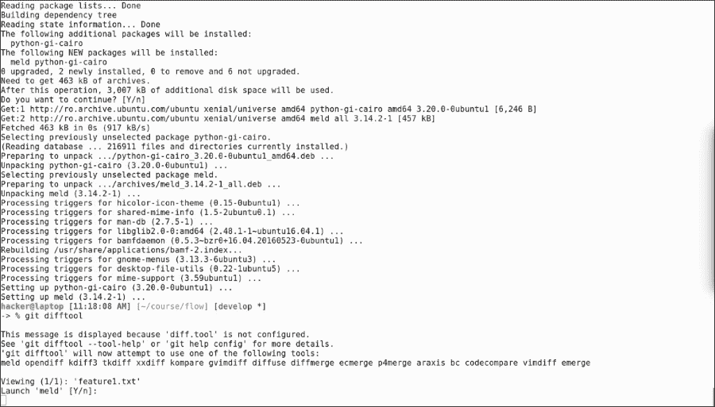

它会询问我们是否要启动 Meld 作为查看文件的外部程序。它还为我们提供了一个工具列表，可以用来显示差异。点击`y`打开 Meld:


现在，我们可以轻松地并排看到这两个文件以及它们之间的差异。我们可以看到`1`变成了`2`，增加了一条新的线。基于这个输出，我们可以很容易地决定是否要添加它。让我们按原样提交文件。

接下来，我们将研究合并冲突。让我们手动创建一个名为**的分支，测试**和**编辑**同一个文件，提交它，然后切换回开发分支。让我们更新同一个文件，提交它，然后尝试合并`test`分支:当然，还有合并冲突。

为了解决冲突，我们将使用以下命令:

```sh
git mergetool

```


再次，它提供打开 Meld。在 Meld 中，我们可以看到三个文件:

*   左边是我们当前分支的文件
*   右边是来自远程分支的文件
*   中间是将要创建的结果文件

假设我们决定该特性的正确版本是`4`，并且我们还想添加`of text`:

```sh
git commit -a

```


您可以看到预定义的提交消息。不要忘记删除在合并时创建的临时文件:

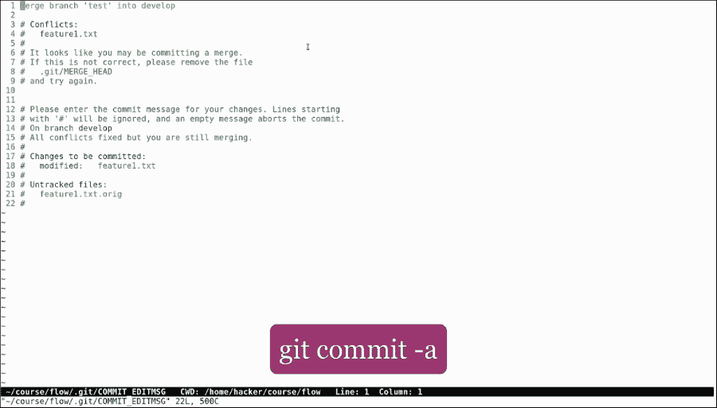

总的来说，大多数现代 ide 都提供了与`git`一起工作的插件，包括合并和`diffs`。我们建议您更多地了解命令行工具，因为从一个 IDE 切换到另一个 IDE 时，您不需要来学习新的`git`插件。

`git`命令在 Linux、Mac 和 Windows 上的工作方式相同。这是一个开发人员经常使用的工具，熟练使用它将提高您的工作效率。

# 从本地主机到即时 DNS

通常，尤其是当与他人一起工作或开发与在线服务的集成时，我们需要使我们的计算机可以从互联网上访问。这些信息可以从我们信任的路由器上获得，但是如果我们有一个工具，让我们的计算机端口可以公开访问，不是更容易吗？

幸运的是，我们有这样一个工具！

满足`ngrok`，多才多艺的一行命令，让你忘记路由器配置和连续重新部署。`Ngrok`是一个简单的工具，将我们计算机的一个端口暴露给互联网上公开的唯一域名。

它是怎么做到的？

好吧，让我们看看它在行动吧！

去网站，点击**下载**按钮，选择你的命运。在我们的例子中，我们的命运是64 位的 Linux 软件包。接下来，进入终端，解压文件，将其内容复制到`bin`文件夹:

*   `cd`下载
*   `unzip ngrok.zip`
*   `mv ngrok ~/bin`

    

现在执行一次重写，并键入以下内容:

```sh
ngrok http 80

```

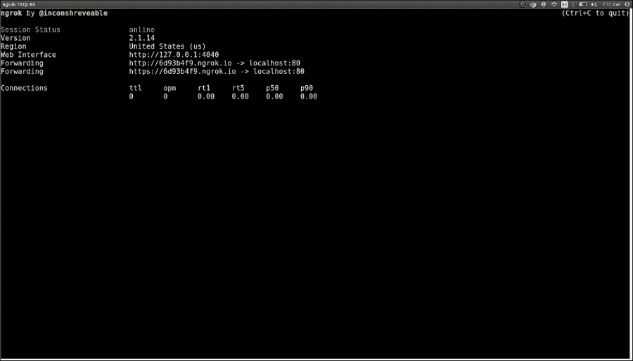

我们可以看到端口 80 和 443 的端口转发运行在我们本地的 80 端口上，在一个自定义的`ngrok`子域名称上。我们还可以看到服务器的区域，默认位于美国。如果我们在不同的地区，我们可以通过以下方式进行设置:

```sh
ngrok http 80 --region eu

```

`ngrok`服务器位于欧洲。为了测试我们的`ngrok`服务器，让我们使用我们信任的 Python 服务器来显示一个简单的 HTML 页面:

```sh
python -m SimpleHTTPServer

```

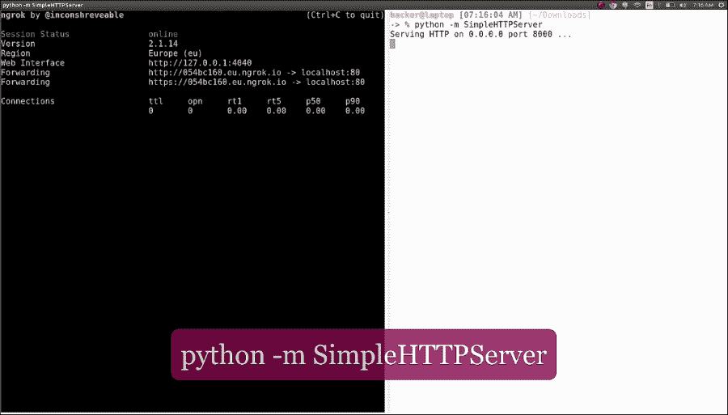

然后使用从端口`8000`(默认 Python 网络服务器端口)转发的 HTTP 流量重新启动`ngrok`:

```sh
ngrok http 8000 --region eu

```

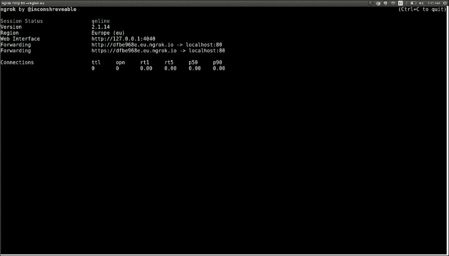

点击`ngrok`提供的链接，我们会看到我们的网页可以上网。

就这样。没有配置，没有账号，没有头疼。只是一个简单的一行命令，我们可以从任何地方运行。`ngrok`提供的子域是生成的，每次重启`ngrok`都会改变。我们可以选择像使用 Linux[https://ngrok.com/](https://ngrok.com/)一样使用我们的自定义域名，但必须在获得付费账户后。

`ngrok`在`http://127.0.0.1:4040`也有一个网页界面，我们可以在这里看到统计数据和日志。

力量来自易用性`ngrok`为我们提供了这种力量:

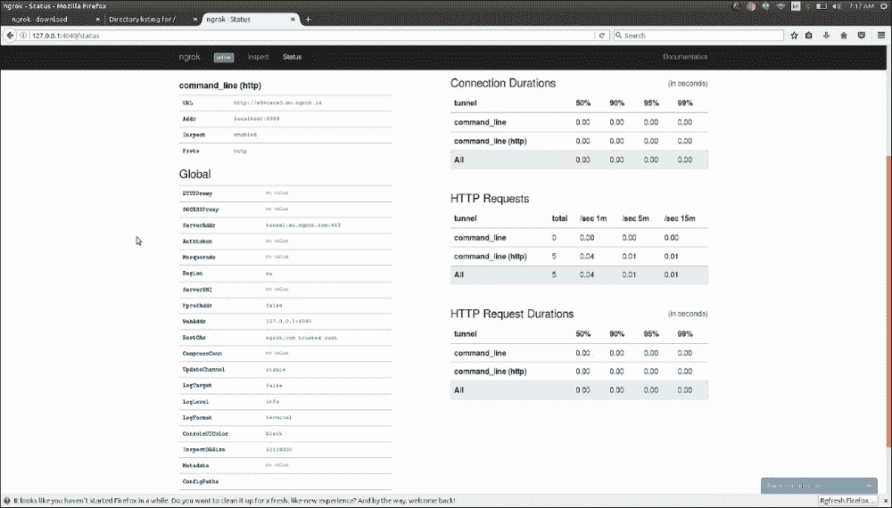

以下是使用这一强大工具的一些具体场景:

*   当测试与需要回调的在线服务的集成时`url`，例如 oAuth 登录和在线支付
*   当开发连接到本地服务的移动应用时
*   当我们想要暴露一个`ssh`端口时
*   当我们想让客户访问我们笔记本电脑上的网页时，也许可以给他们看一些代码

# 新时代的 JSON 干扰

如今，JSON 无处不在，在 web `apis`中，在配置文件中，甚至在日志中。JSON 是用于构造数据的默认格式。因为用的太多了，会有需要我们从命令行处理 JSON 的时候。你能想象用`grep`、`sed,`或其他常规工具做这件事吗？这将是一个相当大的挑战。

幸运的是，有一个叫做`jq`的简单命令行工具，我们可以用它来查询 JSON 文件。它有自己的语言语法，我们几分钟后就会看到。

首先让我们用下面的命令安装`jq`:

```sh
sudo apt install jq

```

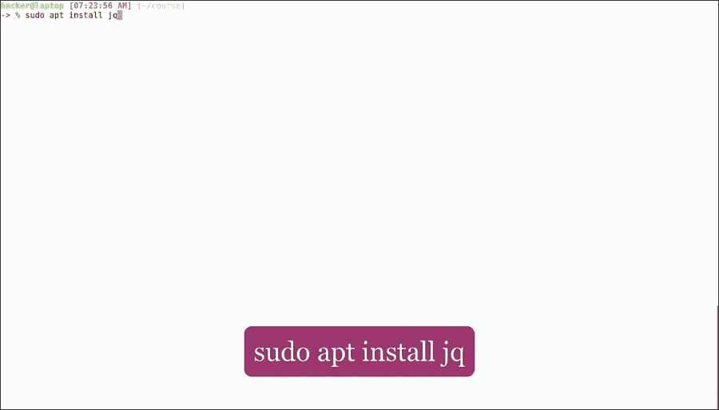

现在让我们使用一个示例文件，一个 JSON 格式的虚拟访问日志:`access.log`，我们也可以在课程 GitHub 资源库中找到它。

让我们从一些简单的查询开始:

```sh
jq . access.log

```


我们将把 JSON 对象打印回屏幕，格式很好:


如果我们想从每个请求中获取`request`方法，运行以下命令:

```sh
jq '.requestMethod' access.log

```


这将打印每个`json`对象的请求方法。请注意每个方法周围的双引号:


如果我们想使用输出作为其他脚本的输入，我们可能不需要双引号，这就是`-r`(原始输出)派上用场的地方:

```sh
jq '.requestMethod' -r access.log

```

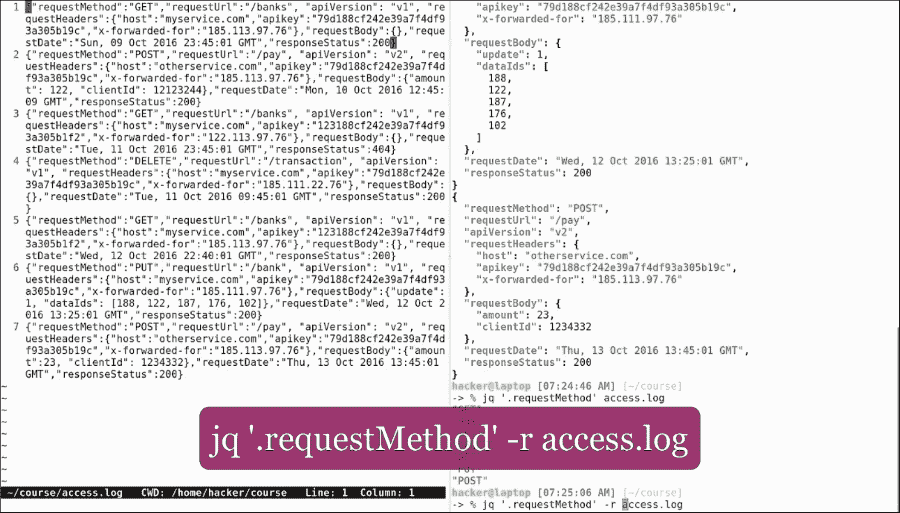

`jq`通常用于规模小得多的大数据查询:

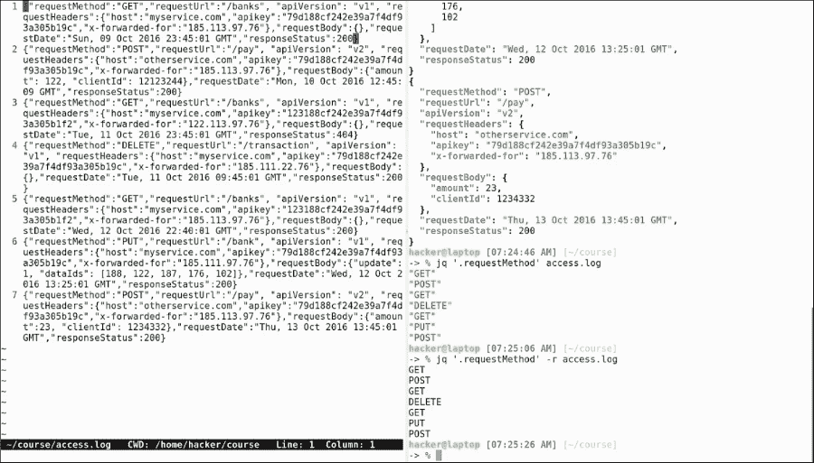

比方说，如果我们想要计算日志文件中请求方法的统计数据，我们可以运行以下命令:

```sh
jq '.requestMethod' -r access.log | sort | uniq -c

```


现在我们可以看到对`get`、`put`、`post,`和`delete`请求的计数。如果我们想要对另一个字段进行相同类型的计算，比如`apikey`，我们可以运行以下内容:

```sh
jq '.requestHeaders.apikey' -r access.log | sort | uniq -c

```


因为访问嵌套字段的语法是只使用点作为它们之间的分隔符。还要注意我们使用单引号而不是双引号来将我们的查询标记为字符串。您可能知道，shell 脚本中单引号和双引号之间的区别在于，双引号字符串将尝试扩展变量，而单引号字符串将被视为固定字符串。

要查询请求主体的，我们将使用以下命令:

```sh
jq '.requestBody' access.log

```


从输出中我们可以看到，即使是空的请求体也会被记录下来，并由`jq`打印出来:


要跳过打印空体，我们可以使用 jq 的查询语言选择所有没有空体的文档:

```sh
jq 'select(.requestBody != {}) | .requestBody' access.log

```

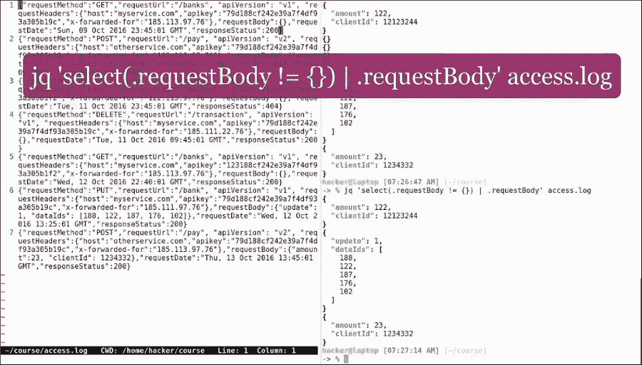

如果我们想进一步细化搜索，并且只打印请求体的`dataIds`对象中的第一个元素，请使用以下内容:

```sh
jq 'select(.requestBody.dataIds[0] != null) | .requestBody.dataIds[0]' access.log

```

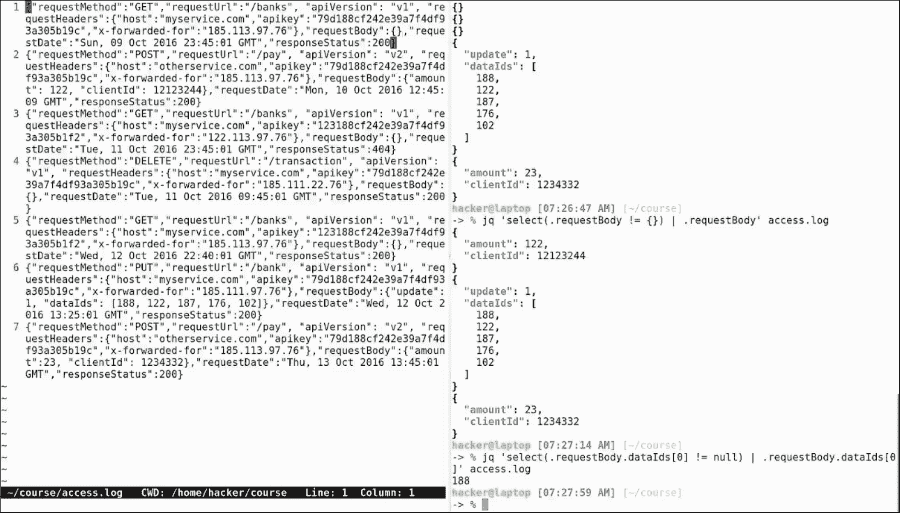

我们甚至可以对返回值进行算术运算，比如递增:

```sh
jq 'select(.requestBody.dataIds[0] != null) | .requestBody.dataIds[0] + 1' access.log

```


还有很多`jq`的例子和用例:去官方`jq`页面访问那里的教程就可以了；

[https://stedolan . github . io/jq/tutorial/](https://stedolan.github.io/jq/tutorial/)

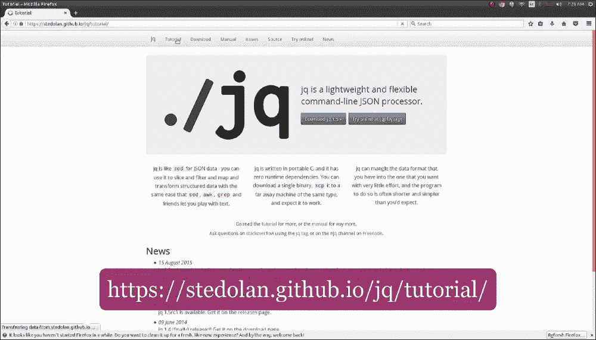

在这里我们可以看到一个使用 rest API 的例子，它返回`json`并将其传送到`jq`。要打印带有来自`github`存储库的提交消息的`json`，请运行以下命令:

```sh
curl 'https://api.github.com/repos/stedolan/jq/commits?per_page=5' | jq -r '[.[] | {message: .commit.message}]'

```

正如我们所说的，文档中有更多的例子，以及更多的用例。`jq`是一个相当强大的工具，从命令行与`json`交互时必不可少。

## 不再有好人先生了

Linux 中的内核和命令行稳定而强大。多年来，它们的可靠性已经得到了证明，关于 Linux 服务器连续运行多年而不重启的现代传说。然而，图形界面不一样，它们有时会失败或变得无响应。这可能会变得很烦人，有一个快速杀死无响应窗口的方法总是好的。准备迎接`xkill`。

首先，让我们复制一个无响应的窗口。去终端启动`gedit`:然后点击 *Ctrl* + *z* 。这将把`gedit`发送到后台，而窗口仍然可见。尝试在窗口内点击几次会告诉 Ubuntu 不再有进程处理这个窗口，Ubuntu 会使变成灰色:

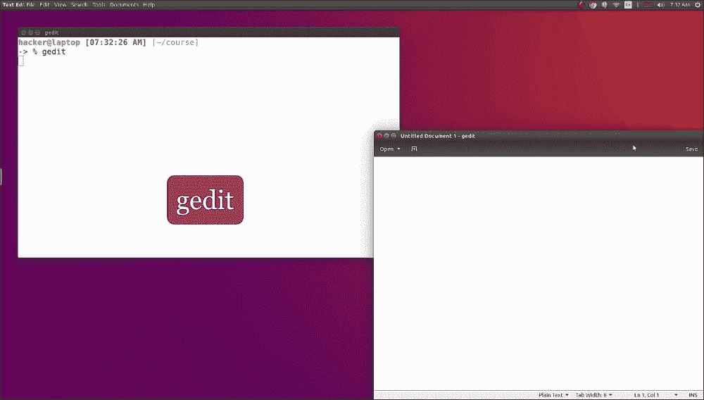

点击 *Ctrl* + *z* :

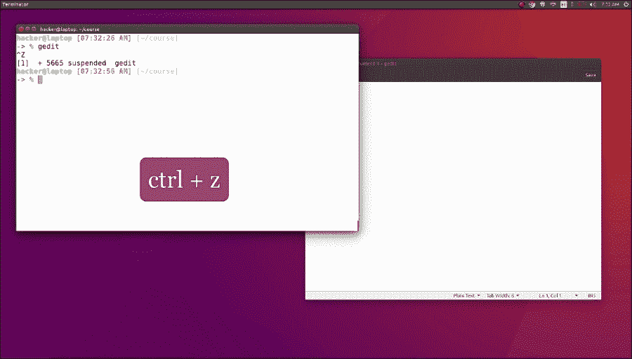

这将把`gedit`发送到后台，而窗口仍然可见。尝试在窗口内点击几次会告诉 Ubuntu 不再有进程处理这个窗口，Ubuntu 会将其变成灰色:


为了避免为了窗口的`pid`而涂抹然后杀死的过程，我们使用了一个小技巧。转到终端并运行以下命令:

```sh
xkill

```

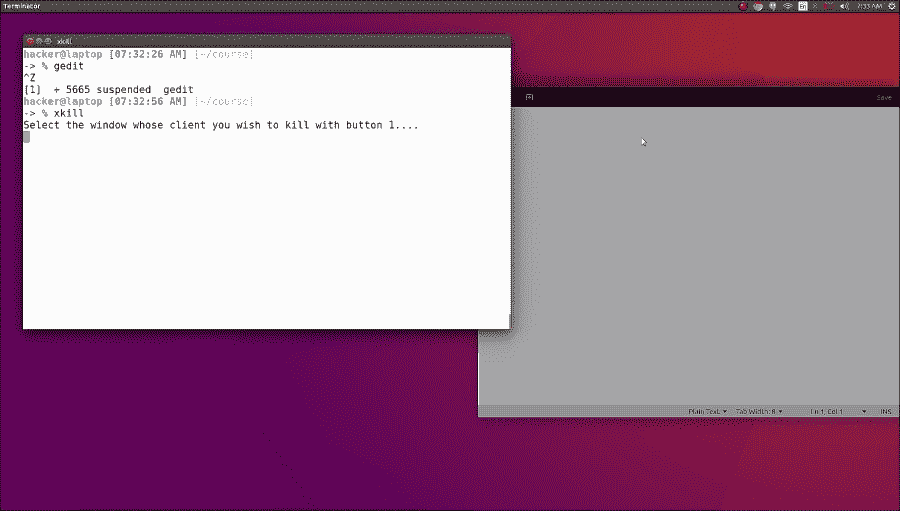

现在我们看到鼠标指针变成了`x`。

注意不要点击任何东西。点击 *Alt* + *Tab* 调出`gedit`窗口，然后点击。`xkill`命令会找到并杀死我们刚刚点击的窗口的进程。

这个技巧可以用在任何类型的窗口上；就像拍窗户一样！

好的，但是如果整个系统没有响应，并且您不能在命令行中键入任何内容，会发生什么呢？这种情况可能会发生，尤其是在旧系统上。您可以在笔记本电脑或服务器上点击**开/关**按钮，但在某些情况下，这是不可能的。

我们现在要给大家看的是一个被 Linux 大师们保密了很久的老把戏；没有人真正谈论它，因为它太强大了，可以在错误的人手中造成损害。请确保您保存了所有工作并关闭了所有程序，然后再尝试致命的键盘快捷键，这将强制重启您的 Linux 系统。按住 *Alt* + *PrtScrn* 并同时键入以下内容:

```sh
reisub

```

如果你尝试过，这意味着你的电脑重新启动了，你必须回到这个课程，从你停止的地方继续。

非常小心地练习这个命令，请不要经常使用它来重新启动计算机。仅在**图形用户界面** ( **图形用户界面**)没有响应时使用。

另一个技巧:如果图形用户界面没有响应，并且您有未保存的工作，您可以通过访问 Linux 的一个虚拟终端，从命令行恢复其中一些工作。默认情况下，Ubuntu 启动七个虚拟终端，图形用户界面在终端 7 启动。要访问七个终端中的任何一个，请使用*Ctrl*+*Alt*+*F1*至 *F7* 。将出现一个提示，要求您登录，登录后，您可以运行一些命令来关闭进程并在退出前保存工作。回到用户界面，点击*Ctrl*+*Alt*+*F1*。