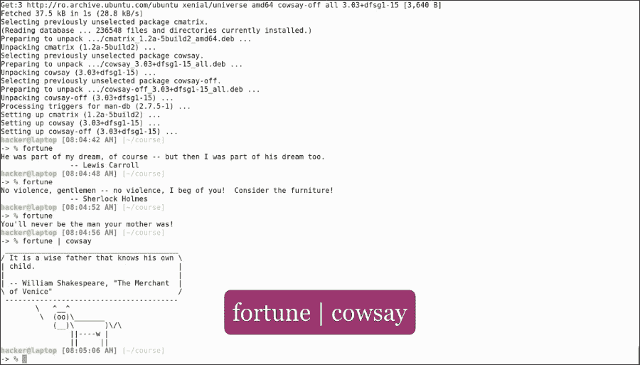
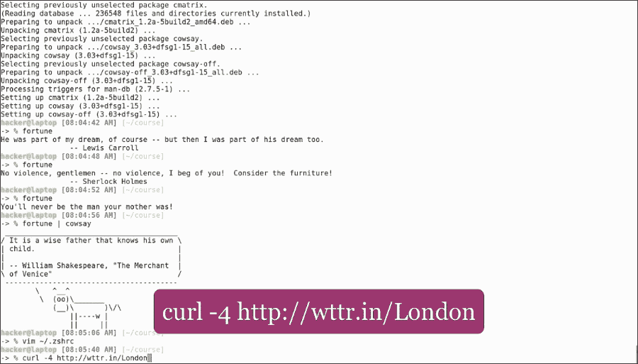
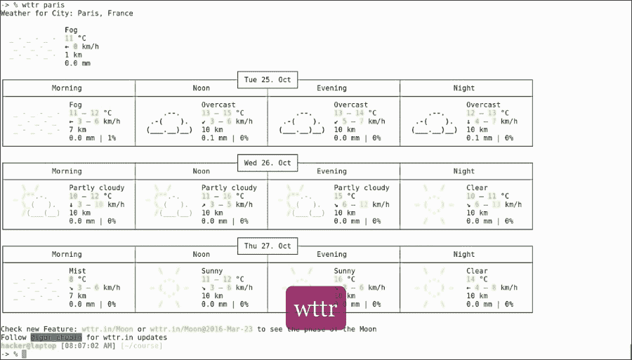

# 第六章。终端艺术

只工作不玩耍，聪明的孩子也变傻。尽管命令行对许多人来说似乎很无聊，但它可以变得非常有趣。一切都取决于你的想象。终端可以很时尚，可以给人留下很好的印象，尤其是我们在电影里看到的那些。颜色、ASCII 艺术和动画可以让我们的终端变得生动起来。所以，这里来了一些终端艺术！

在本章中，我们将介绍以下内容:

*   使用一些 Linux 命令来获得乐趣

听说过幸运饼干吗？你想吃它们而不发胖吗？只需运行以下`apt`命令来安装我们将在本章中使用的实用程序:

```sh
sudo apt install fortune cowsay cmatrix

```


然后运行以下命令:

```sh
fortune

```


当运行这个命令时，你会随机得到财富、引语和笑话。如果我们把命令和`cowsay`结合起来，我们会得到同样的命运，用一头牛的形象来传递:

```sh
fortune | cowsay

```



为了使这种情况反复出现，我们可以将其作为最后一行包含在我们的`zshrc`文件中。然后，每次我们打开一个新的终端窗口，一头牛就会给我们送来一笔财富。

现在这可能没什么用(尽管它有点有趣)，所以，让我们做一些有成效的魔法。

让我们预测天气！

你只需要一个`curl`命令:

```sh
curl -4 http://wttr.in/London

```



这将以良好的格式显示指定城市的三天天气预报，在本例中为伦敦:


现在，利用我们新学到的技能，让我们编写一个 shell 脚本，为我们提供天气预报:

打开`~/bin/wttr`并输入以下内容:

```sh
#!/bin/bash
CITY=${1:-London}
curl -4 http://wttr.in/${CITY}

```

给它执行权，指定一个默认城市，比如伦敦。现在，运行这个:

```sh
wttr

```


我们得到了伦敦的天气预报。现在，运行这个:

```sh
wttr paris

```



我们得到了巴黎的天气预报。第一次在命令行中工作看起来像是进入了 Matrix，如果是这样，为什么不创建那个环境呢？

运行以下命令:

```sh
cmatrix

```


让你的朋友对你在那个神秘的终端里做的复杂的事情感到惊讶。终端不无聊！


它们有漂亮的颜色，易于阅读的输出，它们显示紧凑的信息，让用户控制自己的系统。

终端可以定制和交互，它们可以提高你的工作效率，同时让你的鼠标进入无休止的低效率睡眠。

当然，所有这些技能都不是一蹴而就的，它们需要每个用户仔细调整，以便根据自己的口味以及思维和工作方式进行定制。然而，在那之后，它们会像量身定做的西装一样合身，成为你工作方式的延伸，有时甚至是你工作的延伸。

我们希望您喜欢我们提供的所有提示和技巧，并从中获得乐趣。记住教育是一个持续的过程，所以不要止步于此！保持饥饿和上网冲浪，以跟踪最新的工具和技术，这将把你变成一个生产力野兽！