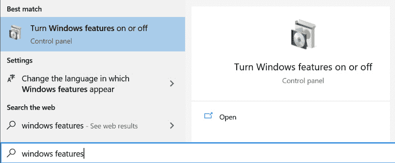

# *第二章*:为 Linux 安装和配置 Windows 子系统

**窗口子系统为 Linux**(**WSL)不是默认安装,所以起床的第一步安装和运行将它连同一个 Linux**分布**(**发行版**)。 在本章结束时，您将知道如何安装 WSL 以及如何安装与其一起使用的 Linux 发行版。 您还将看到如何检查和控制 Linux 发行版，以及如何在 WSL 中配置其他属性。**

 **在本章中，我们将特别涵盖以下主要主题:

*   使 WSL
*   在 wsdl 中安装 Linux 发行版
*   配置和控制 WSL

# 启用 WSL

要将设置为运行 WSL 的机器，您需要确保您使用的是支持它的 Windows 版本。 然后，您可以启用运行 WSL 所需的 Windows 特性，并为安装 Linux 发行版准备好安装 Linux 内核。 最后，您将能够安装一个或多个 Linux 发行版来运行。

让我们从确保您使用的是最新版本的 Windows 开始。

## 正在检查所需的 Windows 版本

要安装WSL 2，您需要运行在一个最新的 Windows 10 版本上。 要检查您正在运行的 Windows 10 版本(以及您是否需要更新)，按*Windows 键*+*R*，然后键入`winver`:


图 2.1 -视窗版本对话框显示 2004 年的更新

在这个屏幕截图中，您可以看到**Version 2004**，这表明系统正在运行 2004 版本。 在此之后，可以看到**OS Build**是**19041.208**。

要运行 WSL 2，您需要版本 1903 或更高，操作系统版本为 18362 或更高。 (注意，ARM64 系统要求版本为 2004 或更高，操作系统版本为 19041 或更高。) 详见[https://docs.microsoft.com/en-us/windows/wsl/install-win10#requirements](https://docs.microsoft.com/en-us/windows/wsl/install-win10#requirements)。

如果您的版本号较低，则转到您的计算机上的**Windows Update**并应用任何未决更新。

重要提示

Windows 10 更新的命名可能有点令人困惑，1903 和 1909(或者更糟的是，2004，看起来像一年)等版本号背后的含义并不是很明显。 命名是一个组合的年和月更新预计将公布在**yymm 形式**yy 的最后两位数是**,**毫米的两位数的形式。 例如，1909 年的更新目标是在 2019 年的第 09 个月发布，换句话说，2019 年 9 月。 同样，2004 年版的目标是在 2020 年 4 月发布。****

 **现在您已经使用了所需的 Windows 版本，让我们开始启用 wsdl。

## 检查容易安装选项

在 2020 年 5 月的**BUILD**会议上，微软宣布了他们正在研究的一种新的、简化的安装WSL 的方法，但在撰写本文时，这种新方法还没有可用。 然而，由于它是一种快速而简单的方法，您可能想在使用较长的安装步骤之前尝试一下，以免在您阅读本文时它已经可用!

要尝试它，请打开您选择的提升提示符(例如，**命令提示符**)，并输入以下命令:

```sh
Wsl.exe --install
```

如果运行此命令，则意味着您有一个简单的安装选项，它将为您安装 wsdl。 在这种情况下，您可以跳到*配置和控制 WSL 部分(或者如果您想安装更多的 Linux 发行版，可以跳到在 WSL*中安装 Linux 发行版部分)。

如果没有找到该命令，那么继续下一节，使用原始方法安装 wsdl。

## 启用所需的 Windows 特性

正如在介绍性章节中讨论的，WSL 的版本 2 使用了一种新的轻量级实用工具虚拟机功能。 要启用轻量级虚拟机和 WSL，您需要启用两个 Windows 特性:**虚拟机平台**和**面向 Linux 的 Windows 子系统**。

启用这些功能通过用户界面**(**UI),按*Windows 键【显示】,进入`Windows Features`,然后点击**打开或关闭窗口特性**如下图所示:*****

 **

图 2.2 -启动 Windows 特性选项

当出现 Windows 功能对话框时，勾选**虚拟机平台**和**Windows 子系统 for Linux**，如下图所示:


图 2.3 - WSL 版本 2 所需的 Windows 特性

点击**OK**后，Windows 将下载并安装组件，并可能提示您重新启动机器。

如果您更喜欢通过命令行启用这些特性，那么启动您选择的提升提示符(例如，命令提示符)并输入以下命令:

```sh
dism.exe /online /enable-feature /featurename:Microsoft-Windows-Subsystem-Linux /all /norestart
dism.exe /online /enable-feature /featurename:VirtualMachinePlatform /all /norestart
```

完成这些命令后，重新启动机器，就可以安装 Linux 内核了。

## 安装 Linux 内核

在安装您最喜欢的 Linux 发行版之前，最后一个 T0 步骤是安装可以运行它的内核。 在写作时，这是一个手动步骤; 在未来，这计划是一个自动过程，通过 Windows Update 交付更新!

现在，转到[http://aka.ms/wsl2kernel](http://aka.ms/wsl2kernel)以获得下载和安装内核的链接。 完成此操作后，您可以选择安装**Linux 发行版**到。

# 在 WSL 中安装 Linux 发行版

标准的安装用于 WSL 的 Linux 发行版的方式是通过 Microsoft Store。 当前可用的 Linux 发行版的完整列表可以在官方文档([https://docs.microsoft.com/windows/wsl/install-win10#install-your-linux-distribution-of-choice](https://docs.microsoft.com/windows/wsl/install-win10#install-your-linux-distribution-of-choice))中找到。 在撰写本文时，这包括各种版本的 Ubuntu、OpenSUSE Leap、SUSE Linux Enterprise Server、Kali、Debian、Fedora Remix、Pengwin 和 Alpine。 因为我们不能在整本书中包含每个 Linux 版本的示例，所以我们将着重使用*Ubuntu*作为示例。

提示

上一章中的步骤已经安装了在 WSL 中运行版本 2 发行版所需的所有部件，但是版本 1 仍然是默认的!

这些命令将在本章的下一节讨论，但是如果你想让版本 2 成为你安装的 Linux 发行版的默认版本，那么运行以下命令:

`wsl --set-default-version 2`

如果你从 Windows 启动微软商店，你可以搜索你选择的 Linux 发行版。 例如，在 Microsoft Store 中搜索`Ubuntu`的结果如下图所示:


图 2.4 -在 Microsoft Store 中搜索 Linux 发行版

当找到你想要的发行版时，遵循以下步骤:

1.  点击它，点击**安装**。 然后，商店应用程序将为您下载并安装发行版。
2.  安装完成后，可以单击**Launch**按钮运行。 这将开始您所选择的发行版的设置过程，如图所示(针对 Ubuntu)。
3.  在安装过程中，系统会要求您输入 UNIX 用户名(不必匹配您的 Windows 用户名)和 UNIX 密码。

此时，您安装的发行版将运行 WSL 的版本 1(除非您之前运行了`wsl --set-default-version 2`命令)。 不要担心——下一节将介绍`wsl`命令，包括在 WSL 版本 1 和版本 2 之间转换已安装的 Linux 发行版!

现在您已经安装了 Linux 发行版，让我们看看如何配置和控制它。

# 配置和控制 WSL

前面的部分简要提到了`wsl`命令，这是与 WSL 交互和控制 WSL 的最常见方式。 在这个节中，您将了解如何使用`wsl`命令交互式地控制 WSL，以及如何通过修改`wsl.conf`配置文件中的设置来更改 WSL 的行为。

重要提示

WSL 的早期版本提供了一个`wslconfig.exe`实用程序。 如果您在文档或文章中看到任何对它的引用，请不要担心——您将在下面的部分中看到的`wsl`命令中提供`wslconfig.exe`(以及更多)的所有功能。

下一节中的命令和配置将为您提供所需的工具，以控制在 WSL 中运行的发行版，并配置发行版(和整个 WSL)的行为，以满足您的需求。

## wsl 命令介绍

`wsl`命令为您提供了一种与 WSL 和已安装的 Linux 发行版进行控制和交互的方法，比如在发行版中运行命令或停止运行发行版。 在本部分中，您将了解`wsl`命令最常用的选项。 如果您感兴趣，可以通过运行`wsl --help`找到完整的选项集。

### 重复 distros

命令`wsl`是一个多用途的命令行实用程序，既可以用于在 WSL 中控制 Linux 发行版，也可以用于在这些发行版中运行命令。

要开始，运行`wsl --list`来获取你已经安装的 Linux 发行版列表:

```sh
PS C:\> wsl --list
Windows Subsystem for Linux Distributions:
Ubuntu-20.04 (Default)
Legacy
docker-desktop
docker-desktop-data
WLinux
Alpine
Ubuntu
PS C:\>
```

上面的输出显示了已安装的发行版的完整`list`，但是还可以应用一些其他开关来定制此命令的行为。 例如，如果你只想看到正在运行的发行版，你可以使用`wsl --list --running`，如下代码片段所示:

```sh
PS C:\> wsl --list --running
Windows Subsystem for Linux Distributions:
Ubuntu-20.04 (Default)
Ubuntu
PS C:\>
```

list 命令的另一个有用的变体是详细输出选项，使用`wsl --list –verbose`实现，如下所示:

```sh
PS C:\> wsl --list --verbose
  NAME                   STATE           VERSION
* Ubuntu-20.04           Running         2
  Legacy                 Stopped         1
  docker-desktop         Stopped         2
  docker-desktop-data    Stopped         2
  WLinux                 Stopped         1
  Alpine                 Stopped         2
  Ubuntu                 Running         2
PS C:\>
```

如上面的输出所示，详细选项显示每个发行版使用哪个版本的 wsdl; 您可以看到，同时支持`1`和`2`。 详细的输出还显示每个发行版是否正在运行。 它还在默认发行版旁边包含一个星号(`*`)。

除了获得关于 WSL 的信息外，我们还可以使用`wsl`命令来控制发行版。

### 控制 WSL 发行版

正如在`wsl --list --verbose`的输出中看到的，可以并排安装多个发行版，并让它们使用不同版本的 WSL。 除了拥有并排的版本之外，发行版还可以在安装后在 wsdl 的版本之间进行转换。 要实现这一点，可以使用`wsl --set-version`命令。

这个命令有两个参数:

*   要更新的发行版的名称
*   要转换的版本

下面是一个将`Ubuntu`发行版转换为版本 2 的例子:

```sh
PS C:\> wsl --set-version Ubuntu 2
Conversion in progress, this may take a few minutes...
For information on key differences with WSL 2 please visit https://aka.ms/wsl2
Conversion complete.
PS C:\>
```

默认情况下，为 WSL 安装 Linux 发行版将把它们安装为版本 1。 但是，可以使用`wsl --set-default-version`命令来更改这一点，该命令接受版本的单个参数以成为默认版本。

例如，`wsl --set-default-version 2`将把 WSL 的版本 2 作为您安装的任何新发行版的默认版本。

接下来，让我们看看在 Linux 发行版中运行命令。

### 使用 wsdl 命令运行 Linux 命令

`wsl`命令的另一个功能是在 Linux 中运行命令。 事实上，如果你不带任何参数运行`wsl`，它将在你的默认发行版中启动一个 shell !

如果您向`wsl`传递一个命令字符串，那么它将在您的默认发行版中运行它。 例如，下面的代码片段显示了运行`wsl ls ~`和`wsl cat /etc/issue`时的输出:

```sh
PS C:\> wsl ls ~
Desktop    Downloads  Pictures  Templates  source    tmp
Documents  Music      Public    Videos     go        ssh-test  
PS C:\> wsl cat /etc/issue
Ubuntu 20.04 LTS \n \l
PS C:\>
```

从前面的`wsl cat /etc/issue`输出中可以看到，这些命令是在 Ubuntu-20.04 发行版中运行的。 如果您安装了多个发行版，并且希望在一个特定的发行版中运行该命令，那么您可以使用`-d`开关来指定您希望在其中运行该命令的发行版。 您可以使用`wsl --list`命令获取发行版名称。 下面是一些`wsl -d`的例子:

```sh
PS C:\> wsl -d Ubuntu-20.04 cat /etc/issue
Ubuntu 20.04 LTS \n \l
PS C:\> wsl -d Alpine cat /etc/issue
Welcome to Alpine Linux 3.11
Kernel \r on an \m (\l)
PS C:\>
```

前面的示例显示了在多个发行版中运行`cat /etc/issue`命令，并且输出确认了该命令所运行的发行版。

除了允许您选择要在其中运行命令的 Linux 发行版之外，`wsl`命令还允许您通过`-u`交换机指定要运行这些命令的用户。 我发现最常见的用法是作为 root 运行命令，这允许使用`sudo`运行命令，而不需要提示输入密码。 `-u`开关显示如下:

```sh
PS C:\> wsl whoami
stuart
PS C:\> wsl -u stuart whoami
stuart
PS C:\> wsl -u root whoami
root
PS C:\>
```

上面显示的是`whoami`命令(输出当前用户)。 不通过`-u`开关，您可以看到命令是作为`stuart`用户运行的，该用户是在最初安装发行版时创建的，但是这可以被覆盖。

我们将看到的关于`wsl`命令的最后一个例子是停止运行发行版。

### 你要我做这些吗

如果您一直在运行 WSL，并且由于任何原因想要停止它，也可以使用`wsl`命令来完成。

如果你有多个发行版正在运行，而你只是想停止一个特定的发行版，你可以运行`wsl --terminate <distro>`，例如`wsl --terminate Ubuntu-20.04`。

提示

记住，正如我们前面看到的，您可以使用`wsl --list --running`获得当前正在运行的发行版。

如果你想关闭 WSL 和所有正在运行的发行版，你可以运行`wsl --shutdown`。

现在我们已经了解了如何使用`wsl`命令来控制 WSL，让我们看一下 WSL 的配置文件。

## 介绍 wsl.conf 和。wslconfig

WSL 提供了两个地方，您可以在其中配置其行为。 其中第一个是`wsl.conf`，它提供每个发行版的配置，第二个是`.wslconfig`，它提供全局配置选项。 这两个文件允许您启用 WSL 的不同特性，例如主机驱动器在一个发行版中挂载的位置，或者控制整个 WSL 行为，例如它可以消耗多少系统内存。

### 使用 wsl.conf

`wsl.conf`文件位于每个发行版的`/etc/wsl.conf`文件中。 如果该文件不存在，而您想将一些设置应用到一个发行版，那么就使用所需的配置在该发行版中创建该文件，并重新启动该发行版(参见*用 WSL*停止发行版一节中的`wsl --terminate`)。

默认选项通常工作得很好，但是本节将带您浏览`wsl.conf`，以便您了解在需要时可以自定义的设置类型。

`wsl.conf`文件遵循`ini`文件结构，名称/值对组织在节中。 示例如下:

```sh
[section]
value1 = true
value2 = "some content"
# This is just a comment
[section2]
value1 = true
```

以下示例显示了文件的一些主要部分和`wsl.conf`值及其默认选项:

```sh
[automount]
enabled = true # control host drive mounting (e.g. /mnt/c)
mountFsTab = true # process /etc/fstab for additional mounts
root = /mnt/ # control where drives are mounted
[interop]
enabled = true # allow WSl to launch Windows processes
appendWindowsPath = true # add Windows PATH to $PATH in WSL
```

`automount`部分提供了控制 WSL 如何在 WSL 发行版中挂载 Windows 驱动器的选项。 `enabled`选项允许您完全启用或禁用该行为，而`root`选项允许您控制在发行版的文件系统中创建驱动器挂载的位置，如果您有理由或偏好将它们放在不同的位置。

`interop`部分控制允许 Linux 发行版与 Windows 交互的特性。 您可以通过将`enabled`属性设置为`false`来完全禁用该特性。 默认情况下，Windows`PATH`会附加到发行版的`PATH`中，但是如果您需要更好地控制发现哪些 Windows 应用程序，可以使用`appendWindowsPath`设置禁用此功能。

`wsl.conf`的完整文档可以在[https://docs.microsoft.com/en-us/windows/wsl/wsl-config#configure-per-distro-launch-settings-with-wslconf](https://docs.microsoft.com/en-us/windows/wsl/wsl-config#configure-per-distro-launch-settings-with-wslconf)找到。 您将在[*第 5 章*](05.html#_idTextAnchor054)，*Linux to Windows Interoperability*中了解更多关于从 WSL 中访问 Windows 文件和应用程序的知识。

在这里，我们已经看到了如何更改每个发行版的配置，接下来我们将看看系统范围的 WSL 配置选项。

### 使用.wslconfig

除了作为每个发行版的`wsl.conf`配置之外，还有一个全局`.wslconfig`文件与 WSL 的版本 2 一起添加，例如，可以在`Windows User`文件夹中找到`C:\Users\<your username>\.wslconfig`。

与`wsl.conf`文件一样，`.wslconfig`使用`ini`文件结构。 下面的示例显示了`[wsl2]`部分的主要值，它允许您更改 WSL 版本 2 的行为:

```sh
[wsl2]
memory=4GB
processors=2
localhostForwarding=true
swap=6GB
swapFile=D:\\Temp\\WslSwap.vhdx
```

`memory`值配置用于 WSL 版本 2 的轻量级实用程序虚拟机所消耗的内存的限制。 默认情况下，这是系统内存的 80%。

类似地，`processors`允许您限制虚拟机将使用的处理器数量(默认情况下没有限制)。 如果您需要平衡在 Windows 和 Linux 上运行的工作负载，这两个值可以提供帮助。

另一点需要注意的是，路径(如`swapFile`)需要是绝对路径，反斜杠(如`\\`)需要转义，如下所示。

还有其他选项(如`kernel`和`kernelCommandLine`,它允许您指定一个自定义内核或额外的内核参数),这是出于对这本书的范围,但可以发现在文档:[https://docs.microsoft.com/en-us/windows/wsl/wsl-config configure-global-options-with-wslconfig](https://docs.microsoft.com/en-us/windows/wsl/wsl-config#configure-global-options-with-wslconfig)。

在这个节中，您已经看到了如何控制 WSL 集成特性，例如驱动器挂载以及通过更改发行版中`wsl.conf`文件中的设置来调用 Windows 进程的能力。 您还了解了如何控制整个 WSL 系统的行为，比如限制内存数量或将使用的处理器数量。 这些选项允许您确保 WSL 以适合您的方式适合您的系统和工作流。

# 总结

在本章中，您已经看到了如何启用 wsdl，安装 Linux 发行版，并确保它们运行在 wsdl 的版本 2 下。 您还学习了如何使用`wsl`命令来控制 WSL，以及如何使用`wsl.conf`和`.wslconfig`配置文件来进一步控制 WSL 及其中运行的发行版的行为。 有了这些工具，您就可以控制 WSL 以及它如何与您的系统交互。

在下一章中，我们将看看新的 Windows 终端，它是 WSL 的自然组合。 我们将介绍如何安装它并使其启动和运行。******