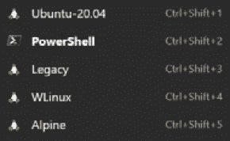
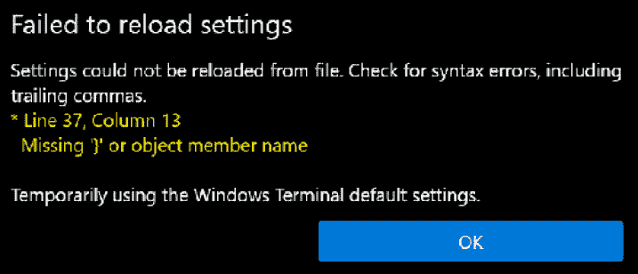
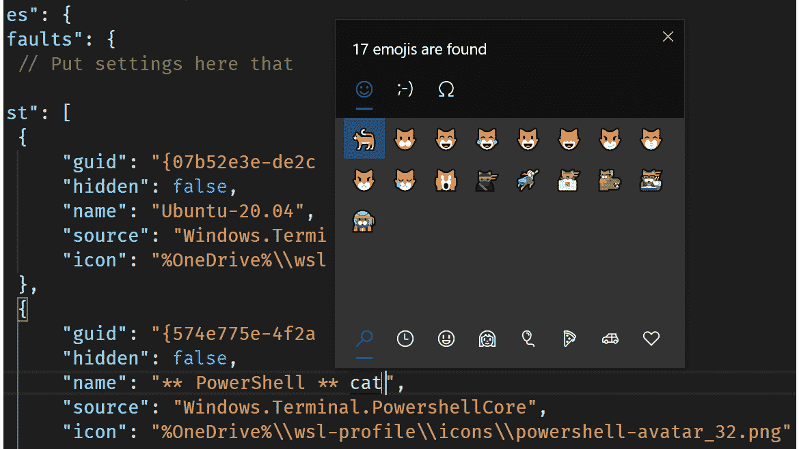
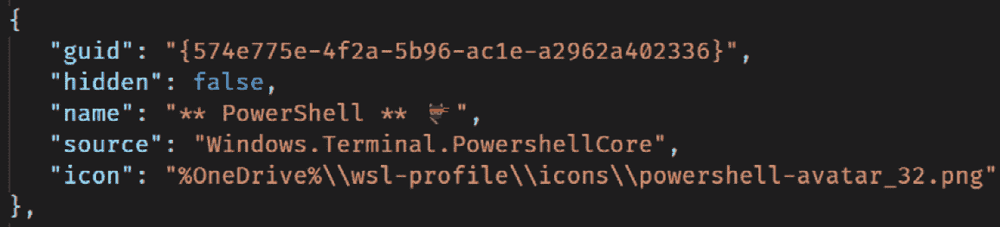
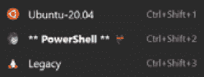

# 三、Windows 终端入门

微软已经宣布在即将发布的 Windows 子系统 Linux 版本中支持 GUI 应用，但在撰写本文时，甚至在早期的预览形式中也无法提供。 在本书中，我们选择将重点放在稳定的、已发布的 WSL 特性上，因此它涵盖了当前以命令行为中心的 WSL 视图。 因此，为自己装备一个良好的终端体验是有意义的。 Windows 中的默认控制台体验(由`cmd.exe`使用)在很多方面都缺乏，新的 Windows 终端提供了很多好处。 在本章中，我们将看看这些优点，以及如何安装和开始使用 Windows Terminal。

在本章中，我们将涵盖以下主要主题:

*   介绍 Windows 终端
*   安装 Windows 终端
*   使用 Windows 终端
*   配置 Windows 终端

# Windows 终端介绍

Windows 终端是 Windows 的替代终端体验。 如果你习惯在 Windows 上运行命令行应用，你可能会熟悉以前运行 PowerShell 或`cmd.exe`时看到的 Windows 控制台体验(如下图所示):


图 3.1 -显示 cmd.exe 用户体验的屏幕截图

Windows Console 有很长的历史，可以追溯到 Windows NT 和 Windows 2000 时代，再追溯到 Windows 3。 x 和 95/98 ! 在此期间，许多 Windows 用户创建了依赖于 Windows 控制台行为的脚本和工具。 Windows 控制台团队对体验做了一些很好的改进(例如，*Ctrl*+鼠标滚轮滚动来缩放文本， 改进了许多 Linux 和 UNIX 命令行应用和 shell 发出的 ANSI/VT 控制序列的处理)，但最终在不破坏向后兼容性的情况下，它们所能实现的目标受到了限制。

Windows控制台团队花费了大量时间重构控制台的代码，以使其他终端体验(如新的 Windows 终端)能够在其之上构建。

新的 Windows 终端提供了许多改进，使其成为基于 Windows 控制台的应用和 Linux shell 应用的出色终端体验。 使用 Windows Terminal，您可以获得更丰富的支持来定制终端的外观和感觉，并控制如何配置键绑定。 您还可以在终端中拥有多个选项卡，就像您在 web 浏览器中拥有多个选项卡一样，如下图所示:


图 3.2 -在 Windows 终端中显示多个选项卡的截图

除了每个窗口有多个选项卡外，Windows Terminal 还支持将选项卡拆分为多个窗格。 与一次只显示一个选项卡的选项卡不同，使用窗格可以将选项卡细分为多个部分。 *图 3.3*显示了带有多个窗格的 Windows Terminal，混合了在 WSL2 中运行的 Bash 和在 Windows 中运行的 PowerShell:


图 3.3 -视窗终端显示多个窗格的截屏

正如你可以从前面的截图中看到的，Windows 终端的体验与默认控制台的体验相比有了很大的改善。

您将学习如何利用其丰富的特性,比如窗格在第六章[](06.html#_idTextAnchor069)*,*获得更多从 Windows 终端【5】,但现在你有味道的 Windows 终端是什么,让我们把它安装!**

 *# 安装 Windows 终端

Windows终端(在撰写本文时)仍然在积极地工作，它存在于 GitHub 上的[https://github.com/microsoft/terminal](https://github.com/microsoft/terminal)。 如果您想运行绝对最新的代码(或者对贡献特性感兴趣)，那么 GitHub 上的文档将带您完成构建代码所需的步骤。 (GitHub 回购也是一个提出问题和特性请求的好地方。)

更常见的安装 Windows 终端的方式是通过 Windows Store，它将安装应用，并提供一个简单的方法来保持它的更新。 您可以在 Store app 中搜索`Windows Terminal`(如下图所示)，或者使用[https://aka.ms/terminal](https://aka.ms/terminal)快速链接:


图 3.4 - Windows Store 应用显示 Windows Terminal 的截图

如果您对尽早测试功能感兴趣(并且不介意潜在的偶然不稳定性)，那么您可能会对 Windows Terminal Preview 感兴趣。 这在 Store 应用中也可以使用(你可能已经注意到它在前面的图中显示)，或者通过快速链接[https://aka.ms/terminal-preview](https://aka.ms/terminal-preview)。 预览版和主版可以并排安装和运行。 如果你对 Windows 终端的路线图感兴趣，可以在 GitHub 上的文档[https://github.com/microsoft/terminal/blob/master/doc/terminal-v2-roadmap.md](https://github.com/microsoft/terminal/blob/master/doc/terminal-v2-roadmap.md)找到。

现在已经安装了 Windows Terminal，让我们来了解一下其中的一些特性。

# 使用 Windows 终端

当您运行 Windows 终端时，它将启动您的默认配置文件。 配置文件是指定在终端实例中应该运行什么 shell 的一种方法，例如 PowerShell 或 Bash。 点击标题栏中的**+**来创建一个带有默认配置文件的另一个实例的新选项卡，或者你可以点击向下箭头来选择你想要运行的配置文件，如下图所示:


图 3.5 -显示用于创建新选项卡的概要文件下拉框的截图

前面的图显示了启动新终端选项卡的一系列选项，这些选项中的每一个都被称为配置文件。 显示的配置文件是由 Windows Terminal 自动生成的——它检测我的机器上安装了什么，并创建了动态配置文件列表。 更好的是，如果我在安装 Windows Terminal 之后安装了一个新的 WSL 发行版，它将自动添加到可用配置文件的列表中! 我们将在本章的后面快速地配置您的配置文件，但首先，让我们看看一些方便的 Windows 终端键盘快捷键。

## 学习快捷键

无论您是键盘快捷键爱好者还是主要的鼠标用户，知道一些快捷键并没有什么坏处，特别是对于 Windows Terminal 中的常见场景，因此本节列出了最常见的键盘快捷键。

您刚刚看到了如何使用 Windows 终端标题栏中的**+**和向下箭头来启动带有默认配置文件的新选项卡或选择要启动的配置文件。 在键盘上，*Ctrl*+*Shift*+*T*可以用来启动一个默认配置文件的新实例。 显示配置文件选择器,您可以使用【显示】Ctrl+*+空格键转变,但是如果你看看截图在图 3.5【病人】,可以看到,前九资料得到自己的快捷键: *【t16.1】*Ctrl + Shift+*1 发射第一个概要,**Ctrl + Shift*+*2*启动第二,等等。***

 **当你在 Windows 终端打开多个选项卡,您可以使用*Ctrl*+*选项卡导航通过标签和*Ctrl*+*【T7 转变】+*【显示】选项卡导航向后(这是一样的大多数浏览器选项卡)。 如果你想要导航到一个特定的选项卡中,您可以使用*【病人】*Ctrl + Alt*+*<>*,在【t16.1】<n>选项卡的位置你想要导航到,例如,**Ctrl + Alt*+*3*导航到第三个选项卡。 最后，你可以用*Ctrl*+*Shift*+*W*来关闭一个标签。*

 *在 Windows 终端中，使用键盘可以快速地管理选项卡。 如果 Windows 终端检测到很多配置文件，你可能想要控制它们的顺序，把你最常用的放在最上面，以方便访问(并确保它们获取快捷键)。 在下一节中，我们将研究这个和其他一些配置选项。

# 配置 Windows 终端

Windows 终端的设置都存储在隐藏在 Windows 配置文件中的`JSON`文件中。 要访问设置，您可以单击向下箭头选择要启动的配置文件，然后选择**设置**，或者您可以使用*Ctrl*+*，*键盘快捷键。 Windows 终端将在默认编辑器中为系统的`JSON`文件打开`settings.json`。

`settings`文件被分成几个部分:

*   **全局设置**位于`JSON`文件的根目录
*   每个概要文件的设置分别定义和配置每个概要文件
*   指定配置文件可以使用的配色方案的方案
*   **按键绑定**，可以自定义在 Windows 终端中执行任务的键盘快捷键

在 Windows 终端的设置中有很多选项可以调整，随着它的不断更新，新的选项随着时间的推移而出现! 完整描述所有的设置是由文档(https://docs.microsoft.com/en-us/windows/terminal/customize-settings/global-settings),我们将转而关注的一些定制您可能想要使用`settings`以及如何实现这些目标文件。

让我们先来看看您可能希望在 Windows Terminal 中对配置文件进行的一些自定义。

## 定制配置文件

`settings`文件的`profiles`部分控制了当您单击 new 选项卡下拉菜单时，Windows Terminal 将显示哪些概要文件，并允许您为概要文件配置各种显示选项。 您还可以选择默认启动哪个概要文件，如下面的内容所示。

### 更改默认配置文件

您可能希望做的第一个更改是，在启动 Windows Terminal 时控制默认启动哪个配置文件，以便您最常用的配置文件是自动启动的那个。

此选项的设置是全局设置中的`defaultProfile`值，如下面的示例所示(全局设置是位于`settings`文件顶层的值):

```sh
{
    "$schema": "https://aka.ms/terminal-profiles-schema",
    "defaultProfile": "Ubuntu-20.04",
```

`defaultProfile`设置的值允许您为您希望设置为默认配置文件的配置文件使用`name`(或关联的`guid`)属性。 请确保输入的名称与`profiles`部分中指定的名称完全一致。

接下来，您将查看如何更改 Windows Terminal 配置文件的顺序。

### 更改概要文件的顺序

您可能希望进行的另一个生产力更改是对配置文件进行排序，以便最常用的配置文件位于顶部，便于访问。 如果您使用键盘快捷键来启动新的选项卡，那么快捷键的顺序将决定快捷键是什么，因此在这里顺序具有额外的重要性。 下图显示了在我的机器上的初始顺序，如上一节的设置所示:


图 3.6 -显示初始配置文件顺序的截图

在屏幕截图中，您可以看到 PowerShell 是第一个列出的配置文件(您可能还注意到 PowerShell 用粗体显示，表明它是默认配置文件)。

为了改变 UI 中概要文件的顺序，我们可以改变`settings`文件中`profiles`下`list`条目的顺序。 下面的片段显示更新了上一节的设置，使**Ubuntu-20.04**成为列表中的第一项:

```sh
    "profiles":
    {
        "defaults":
        {
            // Put settings here that you want to apply to all profiles.
        },
        "list":
        [
            {
                "guid": "{07b52e3e-de2c-5db4-bd2d-ba144ed6c273}",
                "hidden": false,
                "name": "Ubuntu-20.04",
                "source": "Windows.Terminal.Wsl"
            },
            {
                "guid": "{574e775e-4f2a-5b96-ac1e-a2962a402336}",
                "hidden": false,
                "name": "PowerShell",
                "source": "Windows.Terminal.PowershellCore"
            },
            {
                "guid": "{6e9fa4d2-a4aa-562d-b1fa-0789dc1f83d7}",
                "hidden": false,
                "name": "Legacy",
                "source": "Windows.Terminal.Wsl"
            },
// ... more settings omitted
```

一旦你保存`settings`文件，你可以返回到 Windows 终端的下拉菜单，按顺序查看更改:



图 3.7 -显示更新后的配置文件顺序的截图

在上面的截图中，注意到**Ubuntu-20.04**在列表的最上方，现在有了**Ctrl+Shift+1**快捷键。 还值得注意的是，**PowerShell**仍然是粗体，这表明它仍然是默认配置文件，尽管它不再是列表中的第一个配置文件。

需要注意的一件重要的事情是，列表中的每个项都需要用逗号分隔，并且在最后一个列表项之后不能有逗号。 如果你要更改列表末尾的项目，这很容易让你出错。 然而，Windows 终端可能会显示一个警告(如下图所示):



图 3.8 -显示加载设置的错误示例的截图

如果你在前面的截图中看到错误，不要担心。 当 Windows 终端运行时，每当文件更改时，它都会重新加载设置。 错误指出在`settings`文件中哪一部分有错误。 当您驳回错误时，Windows 终端仍然会重新加载您的设置。

就像控制配置文件在列表中出现的顺序一样，您可以改变它们在列表中出现的方式，正如您现在将看到的。

### 重命名配置文件和改变图标

Windows 终端在预填充概要文件方面做得很好，但是您可能希望重命名这些概要文件。 为此，更改相关概要文件的`name`属性的值，如下面的代码片段所示。 和之前一样，一旦文件被保存，Windows 终端将重新加载它并应用更改:

```sh
{
    "guid": "{574e775e-4f2a-5b96-ac1e-a2962a402336}",
    "hidden": false,
    "name": "** PowerShell **",
    "source": "Windows.Terminal.PowershellCore"
},
```

你甚至可以在 Windows 表情包的支持下更进一步。 更改配置文件名称时，按*Win*+*。 打开表情选择器，然后继续输入以过滤表情列表。 例如，下图显示了对猫的过滤:*



图 3.9 -表情选择器使用的截图

从列表中选择一个表情将插入编辑器，如下截图所示:



图 3.10 -显示完整 PowerShell 配置文件的屏幕截图

在这个截图中，你可以看到在`name`属性中使用的表情符号。 除了更改名称，设置还允许您自定义显示在列表中配置文件旁边的图标。 这是通过向概要文件中添加一个图标属性来实现的，该属性提供您希望使用的图标的路径，如前一个截图所示。 该图标可以是`PNG`、`JPG`、`ICO`或其他文件类型——我倾向于选择`PNG`，因为它易于在一系列编辑器中使用，并且允许图像的透明部分。

值得注意的是，路径需要将反斜杠(`\`)转义为双反斜杠(`\\`)。 您还可以方便地在路径中使用环境变量。 这允许你把你的图标放在 OneDrive(或其他文件同步平台)，并在多台机器上共享它们(或简单地备份它们以备将来使用)。 要使用环境变量，请将它们用百分号括起来，如前面代码片段中的`%OneDrive%`所示。

这些自定义(图标和文本)的结果是，如下图所示:



图 3.11 -显示自定义图标和文本(包括表情符号!)

至此，您已经了解了如何控制配置文件列表中的项目以及如何显示它们。 最后要看的是如何从列表中删除项目。

### 删除配置文件

如果您阅读了前面的部分，您可能会认为删除概要文件是简单的从列表中删除条目。 然而，如果概要文件是动态生成的，那么 Windows Terminal 将在下一次加载设置时将该概要文件添加回(在列表的底部)! 虽然这看起来有点奇怪，但这是 Windows 终端自动检测新的配置文件(例如新的 WSL 发行版)的副作用，即使您在安装 Windows 终端之后安装了它们。 相反，为了防止一个配置文件显示在列表中，你可以设置隐藏属性，如下面的代码片段所示:

```sh
{
    "guid": "{0caa0dad-35be-5f56-a8ff-afceeeaa6101}",
    "name": "Command Prompt",
    "commandline": "cmd.exe",
    "hidden": true
}
```

现在我们已经探索了如何在 Windows Terminal 中控制配置文件，让我们看看如何定制其外观。

## 改变 Windows 终端的外观

Windows 终端为您提供了许多方法来应用这些定制的外观和你的动机可能是纯粹的审美或可能使终端更容易使用通过增加字体大小,增加对比,或使用特定的字体,使内容更容易阅读(例如, OpenDyslexic 字体:[https://www.opendyslexic.org/](https://www.opendyslexic.org/)

### 改变字体

Windows 终端的默认字体是一种名为**Cascadia**的新字体，可以在[https://github.com/microsoft/cascadia-code/](https://github.com/microsoft/cascadia-code/)上免费获得，随 Windows 终端一起提供。 **Cascadia Code**支持程序员的结扎，所以当呈现为`≠`时，像`!=`这样的字符会组合在一起。 如果你不喜欢结扎，**Cascadia Mono**是相同的字体，但已摘除结扎。

每个概要文件的字体可以通过在概要文件中设置`fontFace`和`fontSize`属性来独立更改，如下例所示:

```sh
{
    "guid": "{574e775e-4f2a-5b96-ac1e-a2962a402336}",
    "hidden": false,
    "name": "PowerShell",
    "source": "Windows.Terminal.PowershellCore",
    "fontFace": "OpenDyslexicMono",
    "fontSize": 16
},
```

如果你想自定义所有配置文件的字体设置，你可以在`defaults`部分添加`fontFace`和`fontSize`属性，如下所示:

```sh
"profiles": {
    "defaults": {
        // Put settings here that you want to apply to all profiles.
        "fontFace": "OpenDyslexicMono",
        "fontSize": 16
    },
```

在`defaults`节中指定的设置应用于所有概要文件，除非该概要文件覆盖了它。 现在我们已经了解了如何更改字体，接下来让我们看看如何控制配色方案。

### 改变颜色

Windows终端允许您以多种方式定制配置文件的配色方案。

最简单的定制是在概要文件中使用`foreground`、`background`和`cursorColor`属性。 这些值以`#rgb`或`##rrggbb`的形式指定为 RGB 值(例如，`#FF0000`表示亮红色)。 下面的代码片段显示了一个示例:

```sh
{
    "guid": "{07b52e3e-de2c-5db4-bd2d-ba144ed6c273}",
    "name": "Ubuntu-20.04",
    "source": "Windows.Terminal.Wsl",
    "background": "#300A24",
    "foreground": "#FFFFFF",
    "cursorColor": "#FFFFFF"
},
```

要对颜色进行更细粒度的控制，您可以在`settings`文件的`schemes`部分下创建一个颜色方案。 有关这方面的详细信息可以在[https://docs.microsoft.com/en-us/windows/terminal/customize-settings/color-schemes](https://docs.microsoft.com/en-us/windows/terminal/customize-settings/color-schemes)中找到，包括内置配色方案的列表。 正如你在下面的例子中看到的，一个方案有一个名称和一组以`#rgb`或`#rrggbb`形式显示的颜色规范:

```sh
"schemes": [
    {
        "name" : "Ubuntu-inspired",
        "background" : "#300A24",
        "foreground" : "#FFFFFF",
        "black" : "#2E3436",
        "blue" : "#0037DA",
        "brightBlack" : "#767676",
        "brightBlue" : "#3B78FF",
        "brightCyan" : "#61D6D6",
        "brightGreen" : "#16C60C",
        "brightPurple" : "#B4009E",
        "brightRed" : "#E74856",
        "brightWhite" : "#F2F2F2",
        "brightYellow" : "#F9F1A5",
        "cyan" : "#3A96DD",
        "green" : "#13A10E",
        "purple" : "#881798",
        "red" : "#C50F1F",
        "white" : "#CCCCCC",
        "yellow" : "#C19C00"
    }
],
```

一旦定义了配色方案，就需要更新配置文件设置来使用它。 您可以使用`colorScheme`属性指定此属性，或者在单个概要文件级别应用此属性，或者像您在本章前面看到的那样，使用`default`部分将其应用到所有概要文件。 一个应用到个人配置文件的例子显示在这里:

```sh
{
    "guid": "{07b52e3e-de2c-5db4-bd2d-ba144ed6c273}",
    "name": "Ubuntu-20.04",
    "source": "Windows.Terminal.Wsl",
    "colorScheme": "Ubuntu-inspired"
},
```

保存这些更改后，Windows Terminal 将把您定义的配色方案应用到使用该配置文件的任何选项卡上。

通过这里看到的选项，您可以自定义默认启动哪个概要文件，以及这些概要文件在概要文件列表中显示的顺序(和方式)。 您已经看到了各种选项，这些选项允许您自定义概要文件在运行时的显示方式，了解这些选项将使您更容易应用其他设置，例如设置背景图像或更改终端概要文件的透明度。 详细信息可以在 Windows 终端文档[https://docs.microsoft.com/en-us/windows/terminal/customize-settings/profile-settings](https://docs.microsoft.com/en-us/windows/terminal/customize-settings/profile-settings)中找到。

# 总结

在本章中，您了解了 Windows Terminal，以及它如何通过对显示的更大控制以及对多个选项卡的支持等功能改进了以前的终端体验。 在使用 WSL 时，拥有一个能够自动检测您所安装的新 Linux 发行版的终端也是一个很好的好处!

您已经了解了如何安装和使用 Windows Terminal，以及如何自定义它以适应您的首选项，以便您可以轻松地阅读文本，并定义配色方案以轻松地知道哪个终端配置文件正在运行。 通过定制缺省配置文件和配置文件顺序，您可以确保您能够轻松访问您使用最多的配置文件，从而帮助您保持工作效率。 在下一章中，我们将开始使用 Windows 终端，探索如何从 Windows 与 Linux 发行版交互。****