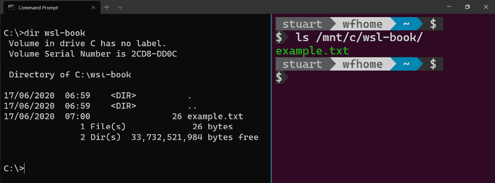
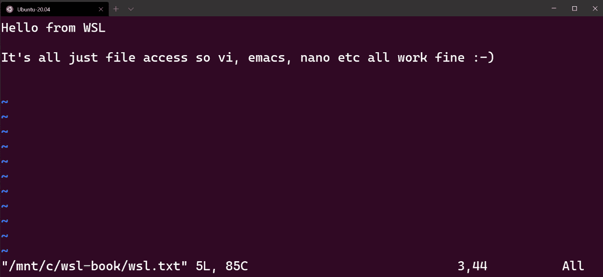
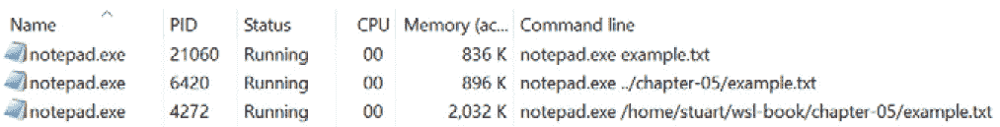

# *第五章*:Linux 到 Windows 的互操作性

在[*第一章*](01.html#_idTextAnchor017),*介绍 Windows 子系统为 Linux*,我们比较 WSL 体验在虚拟机中运行 Linux 和提到 WSL 功能互操作性。 在[*第四章*](04.html#_idTextAnchor047)，*Windows 到 Linux 的互操作性*中，我们看到了如何开始从 Windows 端利用这些互操作性特性。 在本章中，我们将继续探索互操作性特性，但这一次是在 Linux 方面。 这将允许您将 Windows 命令和工具的功能引入到 wsdl 环境中。

我们将从研究如何在 wsdl 环境中与 Windows 应用和文件交互开始。 接下来，我们将研究如何跨 Linux 和 Windows 使用脚本，包括如何在它们之间传递输入。 我们将完成许多互操作性技巧来提高你的效率,让 Windows 命令感觉更自然的混叠,分享你的**Secure Shell (SSH**)键在 Windows 和 Linux 之间易于使用和维护。****

 ****在本章中，我们将涵盖以下主要主题:

*   从 Linux 访问 Windows 文件
*   从 Linux 调用 Windows 应用
*   从 Linux 调用 Windows 脚本
*   互操作性提示和技巧

让我们从第一个话题开始吧!

# 从 Linux 访问 Windows 文件

默认情况下，WSL会自动将你的 Windows驱动装入 WSL**发行版**(**发行版**)中。 这些挂载在`/mnt`中创建; 例如，您的`C:`驱动器被安装为`/mnt/c`。 为此，在`C:`驱动器上创建一个名为`wsl-book`的文件夹，并在其中放置一个`example.txt`文件(文本文件的内容并不重要)。 现在，启动 WSL 中的终端并运行`ls /mnt/c/wsl-book`，您将看到您创建的文件在 Bash 输出中列出:



图 5.1 -显示 Windows 和 WSL 文件夹内容的屏幕截图

这个屏幕截图包括来自 Windows 的目录列表，在左边的**命令提示符**中显示`example.txt`，在右边的是通过 WSL 发行版中的`/mnt/c`路径列出的相同文件。

您可以与挂载的文件交互，就像与任何其他文件交互一样; 例如，你可以`cat`文件来查看它的内容:

```sh
$ cat /mnt/c/wsl-book/example.txt
Hello from a Windows file!
```

或者，你可以将内容重定向到 Windows 文件系统中的一个文件:

```sh
$ echo "Hello from WSL" > /mnt/c/wsl-book/wsl.txt
$ cat /mnt/c/wsl-book/wsl.txt
Hello from WSL
```

或者，你可以在`vi`中编辑文件(或者任何你喜欢的终端文本编辑器):



图 5.2 -显示在 WSL 下用 vi 编辑 Windows 文件的截图

在这个截图中，您可以看到 Windows 文件系统中的文件在运行`vi /mnt/c/wsl-book/wsl.txt`后正在 WSL 发行版的`vi`中进行编辑。

重要提示

在 Windows 下，文件系统通常不区分大小写; 也就是说，Windows 将`SomeFile`视为与`somefile`相同。 在 Linux 下，文件系统是大小写*敏感*的，所以它们可以被视为两个独立的文件。

当从 WSL 挂载访问 Windows 文件系统时，在 Linux 端以区分大小写的方式处理文件，因此尝试从`/mnt/c/wsl-book/EXAMPLE.txt`读取将失败。

虽然 Linux 端将文件系统区分大小写，但底层 Windows 文件系统仍然是大小写不敏感的，记住这一点很重要。 例如，虽然 Linux 将`/mnt/c/wsl-book/wsl.txt`和`/mnt/c/wsl-book/WSL.txt`视为独立的文件，但从 Linux 写入`/mnt/c/wsl-book/WSL.txt`实际上会覆盖之前创建的`wsl.txt`文件的内容，因为 Windows 对名称不区分大小写。

您已经看到了在这一节中,自动创建挂载(`/mnt/…`)使它很容易从内部访问 Windows 文件与 WSL 您的 Linux 发行版(如果你想禁用这个安装或更改创建挂载的,您可以使用`wsl.conf`,[所示*第二章*](02.html#_idTextAnchor023), *为 Linux 安装和配置 Windows 子系统*)。 下一节将介绍从 Linux 调用 Windows 应用。

# 从 Linux 调用 Windows 应用

在[*第四章*](04.html#_idTextAnchor047)，*Windows 到 Linux 的互操作性*中，我们看到了如何使用`wsl`命令从 Windows 调用 Linux 应用。 采用的其他方法(从 Linux 调用 Windows 应用)甚至更容易! 要查看实际操作，请在您的 WSL 发行版中启动一个终端，并运行`/mnt/c/Windows/System32/calc.exe`来直接从 Linux 启动 Windows 计算器应用。 如果没有在`C:\Windows`中安装 Windows，则更新路径以匹配。 通过这种方式，您可以从 wsdl 发行版中的终端启动任何 Windows 应用。

在 Windows Calculator(和许多其他应用)的情况下，wsdl 实际上使它更容易。 这一次，在终端中键入`calc.exe`，Windows 计算器仍然会运行。 这样做的原因是`calc.exe`在您的 Windows 路径中，(默认情况下)WSL 会将您的 Windows 路径映射到您的 WSL 发行版中的 Linux 路径。 为了演示这一点，在终端中运行`echo $PATH`:

```sh
$ echo $PATH
/home/stuart/.local/bin:/home/stuart/bin:/usr/local/sbin:/usr/local/bin:/usr/sbin:/usr/bin:/sbin:/bin:/usr/games:/usr/local/games:/mnt/c/Program Files (x86)/Microsoft SDKs/Azure/CLI2/wbin:/mnt/c/WINDOWS/system32:/mnt/c/WINDOWS:/mnt/c/WINDOWS/System32/Wbem:/mnt/c/WINDOWS/System32/WindowsPowerShell/v1.0/:/mnt/c/Program Files/dotnet/:/mnt/c/Go/bin:/mnt/c/Program Files (x86)/nodejs/:/mnt/c/WINDOWS/System32/OpenSSH/:/mnt/c/Program Files/Git/cmd:/mnt/c/Program Files (x86)/Microsoft VS Code/bin:/mnt/c/Program Files/Azure Data Studio/bin:/mnt/c/Program Files/Microsoft VS Code Insiders/bin:/mnt/c/Program Files/PowerShell/7/:/mnt/c/Program Files/Docker/Docker/resources/bin:/mnt/c/ProgramData/DockerDesktop/version-bin:/mnt/c/Program Files/Docker/Docker/Resources/bin:… <truncated>
```

从这里可以看到，Linux 中的`PATH`变量不仅包含通常的路径(如`/home/stuart/bin`)，还包含 Windows`PATH`变量的值(如`/mnt/c/WINDOWS/System32`)，这些值已经被转换为使用 WSL 挂载。 这样做的结果是，您习惯在 Windows 中运行而不指定路径的任何应用也可以在 WSL 中运行而不指定路径。 一个区别是，在 Windows 中，我们不需要指定文件扩展名(例如，我们可以在 PowerShell 中运行`calc`)，但在 WSL 中需要指定。

在上一节中，我们在 Windows 中创建了一个文本文件(`c:\wsl-book\wsl.txt`)，并在 Linux 中使用`vi`打开它，但是如果我们想在 Windows 应用中打开该文件呢? 如果您尝试从 Linux 运行`notepad.exe c:\wsl-book\wsl.txt`，记事本将给出一个错误，它无法找到该文件。 要解决这个问题，可以将路径放入引号(`notepad.exe "c:\wsl-book\wsl.txt"`)或转义反斜杠(`notepad.exe c:\\wsl-book\\wsl.txt`)。 完成这些修复后，该命令将启动 Notepad 并打开指定的文件。

在现实中,当你工作在终端 WSL 发行版,你将花很多时间工作与 Linux 文件系统中的文件,你会想打开【显示】*那些文件在一个编辑器。 如果你有这本书的示例代码(你可以找到它在[https://github.com/PacktPublishing/Windows-Subsystem-for-Linux-2-WSL-2-Tips-Tricks-and-Techniques](https://github.com/PacktPublishing/Windows-Subsystem-for-Linux-2-WSL-2-Tips-Tricks-and-Techniques)),导航到`chapter-05`文件夹在您的终端,哪里有一个`example.txt`文件(如果你没有样品,您可以运行`echo "Hello from WSL!" > example.txt`创建一个测试文件)。 在终端中，尝试运行`notepad.exe example.txt`—这将启动记事本，并加载来自 WSL 文件系统的`example.txt`文件。 这非常方便，因为它允许您轻松启动 Windows GUI 编辑器来处理 wsdl 发行版中的文件。*

在本节中，我们看到了从 WSL 调用 Windows GUI 应用并将路径作为参数传递是多么容易。 在下一节中，我们将研究如何从 wsdl 调用 Windows 脚本，以及如何在需要时显式地转换路径。

# 从 Linux 调用 Windows 脚本

如果您习惯于在 Windows 中运行 PowerShell，那么您也将习惯于能够直接调用 PowerShell cmdlet 和脚本。 当你在 WSL 中运行 PowerShell 脚本时，你有两个选择:为 Linux 安装 PowerShell 或者在 Windows 中调用 PowerShell 来运行脚本。 如果您对用于 Linux 的 PowerShell 感兴趣，可以在[https://docs.microsoft.com/en-us/powershell/scripting/install/installing-powershell-core-on-linux?view=powershell-7](https://docs.microsoft.com/en-us/powershell/scripting/install/installing-powershell-core-on-linux?view=powershell-7)找到安装文档。 然而，由于本章主要讨论从 wsdl 调用 Windows，我们将研究后一种方法。

PowerShell 是一个 Windows 应用，并且位于 Windows 路径中，因此我们可以在 Linux 中使用`powershell.exe`调用它，正如我们在上一节中看到的那样。 要用 PowerShell 运行命令，我们可以使用`-C`开关(简称`-Command`):

```sh
$ powershell.exe -C "Get-ItemProperty -Path Registry::HKEY_LOCAL_MACHINE\HARDWARE\DESCRIPTION\System"
Component Information : {0, 0, 0, 0...}
Identifier            : AT/AT COMPATIBLE
Configuration Data    :
SystemBiosVersion     : {OEMC - 300, 3.11.2650,
                        American Megatrends - 50008}
BootArchitecture      : 3
PreferredProfile      : 8
Capabilities          : 2327733
...
```

如您所见，这里我们使用`-C`开关来运行 PowerShell`Get-ItemProperty`cmdlet 来从 Windows 注册表中检索值。

除了能够调用 PowerShell cmdlet 之外，您还可以从 Linux 调用 PowerShell 脚本。 本书附带的代码包含一个示例`wsl.ps1`脚本。 该脚本向用户打印问候(使用传入的`Name`参数)，打印当前工作目录，然后从 Windows 事件日志输出一些条目。 在 Bash 提示符中，将工作文件夹设置为`chapter-05`文件夹，我们可以运行以下脚本:

```sh
$ powershell.exe -C ./wsl.ps1 -Name Stuart
Hello from WSL: Stuart
Current directory: Microsoft.PowerShell.Core\FileSystem
::\\wsl$\Ubuntu-20.04\home\stuart\wsl-book\chapter-05
Index Source      Message
----- ------      -------
14954 edgeupdatem The description for Event ID '0'...
14953 edgeupdate  The description for Event ID '0'...
14952 ESENT       svchost (15664,D,50) DS_Token_DB...
14951 ESENT       svchost (15664,D,0) DS_Token_DB:...
14950 ESENT       svchost (15664,U,98) DS_Token_DB...
14949 ESENT       svchost (15664,R,98) DS_Token_DB...
14948 ESENT       svchost (15664,R,98) DS_Token_DB...
14947 ESENT       svchost (15664,R,98) DS_Token_DB...
14946 ESENT       svchost (15664,R,98) DS_Token_DB...
14945 ESENT       svchost (15664,P,98) DS_Token_DB...
```

前面的输出显示了运行刚才描述的脚本的结果:

*   我们可以看到`Hello from WSL: Stuart`输出，其中包括`Stuart`(作为`Name`参数传递的值)。
*   输出当前目录(`Microsoft.PowerShell.Core\FileSystem::\\wsl$\Ubuntu-20.04\home\stuart\wsl-book\chapter-05`)。
*   从 Windows 事件日志中调用`Get-EventLog`PowerShell cmdlet 的条目。

这个示例显示了获取 Windows 事件日志条目，但是由于它在 Windows 中运行 PowerShell，所以您可以访问任何 Windows PowerShell cmdlet 来检索 Windows 数据或操作 Windows。

在这里可以调用 PowerShell 命令和脚本，这为在需要时从 Windows 获取信息提供了一种简单的方法。 该示例还展示了从 WSL 向 PowerShell 脚本传递一个参数(`Name`)，接下来，我们将进一步研究这一点，以了解如何组合 PowerShell 和 Bash 命令。

## 在 PowerShell 和 Bash 之间传递数据

有时，调用 PowerShell 命令或脚本就足够了，但其他时候，您将希望在 Bash 中处理该命令的输出。 在 WSL 中处理 PowerShell 脚本的输出以一种自然的方式工作:

```sh
$ powershell.exe -C "Get-Content ./wsl.ps1" | wc -l
10
```

如您所见，该命令演示了从执行某些 PowerShell 中获取输出并将其管道化到`wc -l`中，这将计算输入中的行数(在本例中为`10`)。

在编写脚本时，还可能希望将值*传递给 PowerShell 脚本*。 在简单的情况下，我们可以使用 Bash 变量，如下所示:

```sh
$ MESSAGE="Hello"; powershell.exe -noprofile -C "Write-Host $MESSAGE"
Hello
```

这里，我们在 Bash 中创建了一个`MESSAGE`变量，然后在传递给 PowerShell 的命令中使用它。 这种方法在 Bash 中使用变量替换—传递给 PowerShell 的命令实际上是`Write-Host Hello`。 这种技术适用于某些场景，但有时您实际上需要将输入管道导入 PowerShell。 这有点不直观，在 PowerShell 中使用了特殊的`$input`变量:

```sh
$ echo "Stuart" | powershell.exe -noprofile -c 'Write-Host "Hello $input"'
Hello Stuart
```

在这个示例中，您可以看到`echo "Stuart"`的输出被传递到 PowerShell 中，该 shell 使用`$input`变量来检索输入。 为了帮助展示传递输入的技术，本示例故意保持简单。 更常见的情况是，输入可以是文件的内容或来自另一个 Bash 命令的输出，而 PowerShell 命令可以是执行更丰富处理的脚本。

在本节中，您已经看到了如何从 wsdl 调用 Windows 应用，包括如何在 GUI 应用中打开 wsdl 文件。 您还了解了如何调用 PowerShell 脚本，以及如何在 PowerShell 和 Bash 之间传递数据，以创建跨两个环境的脚本，从而为如何编写脚本提供更多的选项。 在下一节中，我们将探讨使集成更加紧密以进一步提高生产力的一些技巧和技巧。

# 互操作性提示和技巧

在本节中，我们将查看一些技巧，当您在 Windows 和 WSL 之间工作时，可以使用这些技巧来提高您的工作效率。 我们将看到如何使用别名来避免在执行 Windows 命令时指定扩展名，以使它们看起来更自然。 我们还将看到如何将文本从 Linux 复制到 Windows 剪贴板，以及如何使 Windows 文件夹更自然地适应 wsdl 发行版。 之后，我们将看到如何在 Linux 的默认 Windows 应用中打开文件。 从这里，我们将了解 Windows 应用如何在将 wsdl 路径作为参数传递时使用它们，以及当默认行为不起作用时如何控制映射路径。 最后，我们将研究如何将 SSH 密钥从 Windows 共享到 WSL 发行版中，以方便密钥维护。

让我们从别名开始。

## 为 Windows 应用创建别名

正如本章前面提到的，当从 WSL 调用 Windows 应用时，我们需要包含文件扩展名。 例如，我们需要使用`notepad.exe`来启动记事本，而在 Windows 中，我们可以只使用`notepad`。 如果您习惯于不包含文件扩展名，那么包含它可能需要一些时间来适应。

除了对自己进行再培训，你还可以对巴斯进行再培训! Bash 中的别名允许您为命令创建别名或替代名称。 例如，运行`alias notepad=notepad.exe`将为`notepad.exe`创建一个`notepad`的别名。 这意味着当您运行`notepad hello.txt`时，Bash 将其解释为`notepad.exe hello.txt`。

在终端交互式运行`alias`命令只会为当前 shell 实例设置别名。 要永久地添加别名，请将`alias`命令复制到您的`.bashrc`(或`.bash_aliases`)文件中，以便 shell 在每次启动时自动设置它。

接下来，我们将研究一个方便的 Windows 实用程序，它是一个很好的别名候选。

## 复制输出到 Windows 剪贴板

Windows已经有`clip.exe`实用程序很长时间了。 `clip.exe`的帮助文本表示*将命令行工具的输出重定向到 Windows 剪贴板*，这是一个很好的描述。 正如我们在本章前面看到的，我们可以通过管道将输出从 WSL 传输到 Windows 应用，并且我们可以通过`clip.exe`将项目放在 Windows 剪贴板上。

例如，运行`echo $PWD > clip.exe`将把终端中的当前工作目录(即`$PWD`的值)管道到`clip.exe`。 换句话说，您可以将 wsdl 中的当前工作目录复制到 Windows 剪贴板中。

您还可以将其与别名(`alias clip=clip.exe`)组合，将其简化为`echo $PWD > clip`。

我发现自己经常使用`clip.exe`——例如，将命令的输出复制到我的代码编辑器或电子邮件中——而且它节省了在终端中选择和复制文本的时间。

让我们通过研究一种使 Windows 路径在 WSL 中更容易使用的方法来继续本文的技巧。

## 使用符号链接使 Windows 路径更容易访问

如前所述，我们可以通过`/mnt/c/…`映射访问 Windows 路径。 但是有一些路径，您可能会发现您经常访问，并且希望有更容易的访问。 对我来说，其中一个路径就是我的 Windows`Downloads`文件夹——每当我发现一个我想在 WSL 中安装的 Linux 工具并需要下载一个包来安装时，我的浏览器默认将其下载到 Windows 中的`Downloads`文件夹。 虽然我可以通过`/mnt/c/Users/stuart/Downloads`访问它，但我喜欢在 WSL 中以`~/Downloads`的形式访问它。

要做到这一点,我们可以使用`ln`**实用程序来创建一个符号链接****(也就是说,一个符号链接**)在`~/Downloads`目标 Wi【显示】ndows`Downloads`文件夹:

```sh
$ ln -s /mnt/c/Users/stuart/Downloads/ ~/Downloads
$ ls ~/Downloads
browsh_1.6.4_linux_amd64.deb
devcontainer-cli_linux_amd64.tar.gz
powershell_7.0.0-1.ubuntu.18.04_amd64.deb
windirstat1_1_2_setup.exe
wsl_update_x64.msi
```

在此输出中，您可以看到用于创建符号链接的`ln -s /mnt/c/Users/stuart/Downloads/ ~/Downloads`命令(您需要更改第一个路径以匹配您的Windows`Downloads`文件夹)。 之后，您可以看到在 wsdl 中列出新符号链接位置的内容的输出。

虽然在符号链接方面在 WSL 中没有什么特别的，但是能够创建到 Windows 文件夹的符号链接允许您进一步定制您的 WSL 环境。 当您使用 WSL 时，您可能会找到自己想要符号链接到的文件夹。

接下来，我们将看看如何在默认的 Windows 编辑器中打开 WSL 文件，了解它们的文件类型。

## 使用 wslview 启动默认的 Windows 应用

在这一章中，我们看到了如何从 WSL 中调用特定的 Windows 应用。 Windows 的另一个特性是能够启动*一个文件*，并让 Windows 决定应该启动哪个应用来打开它。 例如，在 PowerShell 提示符下，执行`example.txt`将打开默认的文本编辑器(可能是记事本)，而执行`example.jpg`将打开默认的图像查看器。

幸运的是，帮助就在眼前，并且`wslutilities`中的`wslview`允许我们在 Linux 中做同样的事情。 微软商店中最新版本的 Ubuntu 预装了`wslutilities`，但是其他发行版的安装说明可以在[https://github.com/wslutilities/wslu](https://github.com/wslutilities/wslu)找到。

安装了`wslutilities`后，可以在 WSL 终端中运行`wslview`:

```sh
# Launch the default Windows test editor
$ wslview my-text-file.txt
# Launch the default Windows image viewer
wslview my-image.jpg
# Launch the default browser
wslview https://wsl.tips
```

这些命令显示了使用`wslview`的几个示例。 前两个示例显示根据文件扩展名启动默认 Windows 应用。 第一个示例启动默认的 Windows文本编辑器(通常是记事本)，第二个示例启动与 JPEG 文件关联的 Windows 应用。 在第三个例子中，我们传递了一个 URL，这将在默认的 Windows 浏览器中打开该 URL。

这个实用程序是连接 wsdl 中的控制台和 Windows 中的图形应用的一种非常方便的方法。

在撰写本文时，可以使用`wslview`的路径有一些限制; 例如，`wslview ~/my-text-file.txt`将失败，错误为`The system cannot find the file specified`。 在下一节中，我们将研究如何在 Windows 和 Linux 之间转换路径来克服这个问题。

## Windows 和 WSL 的映射路径

在本章前面的中，我们运行来自 WSL 的命令，比如`notepad.exe example.txt`，这导致记事本使用我们指定的文本文件打开。 乍一看，当我们运行命令时，WSL 似乎为我们转换了路径，但下面的截图显示了任务管理器中的记事本(添加了**命令行**列):



图 5.3 -显示 notepad.exe 在任务管理器中运行的截图

在这个截图中，你可以看到记事本有三个不同的参数:

*   `notepad.exe example.txt`
*   `notepad.exe ../chapter-05/example.txt`
*   `notepad.exe /home/stuart/wsl-book/chapter-05/example.txt`

对于每个列出的例子,我确定我是在一个目录路径解决 WSL 的文件,和记事本启动示例文件打开每一次,即使参数直接传递给笔记本没有翻译(图 5.3 所示的*截图)。*

 *对于作为 WSL 用户的我们来说，这是非常有用的，但是，虽然这个*在本场景和大多数其他场景中只能*工作，但是理解为什么它可以工作对于它不能工作的情况是很有用的。 这样，您就知道什么时候可能需要更改行为—例如，当从 wsdl 调用 Windows 脚本时。 因此，如果在调用命令时没有转换路径，那么记事本如何在 WSL 中找到`example.txt`呢? 答案的第一部分是，当 Notepad 由 WSL 启动时，它将其工作目录设置为与 WSL 中终端的当前工作目录相对应的`\\wsl$\...`路径。 我们可以通过运行`powershell.exe ls`来确认这个行为:

```sh
$ powershell.exe ls
Directory: \\wsl$\Ubuntu-20.04\home\stuart\wsl-book\chapter-05
Mode                 LastWriteTime         Length Name
----                 -------------         ------ ----
------        01/07/2020     07:57             16 example.txt
$
```

在这个输出中，您可以看到从 WSL 启动的 PowerShell 列出了其当前工作目录的内容。 WSL shell 有一个工作目录`/home/stuart/wsl-book/chapter-05`，当 PowerShell 启动时，它会得到 Windows 等效目录`\\wsl$\Ubuntu-20.04\home\stuart\wsl-book\chapter-05`。

现在我们知道记事本开始其工作目录 WSL 工作目录的基础上,我们可以看到,在前两个例子(`notepad.exe example.txt`和`notepad.exe ../chapter-05/example.txt`),记事本治疗路径为相对路径,解决他们对其工作目录中找到该文件。

最后一个例子(`notepad.exe /home/stuart/wsl-book/chapter-05/example.txt`)略有不同。 在本例中，Notepad 将该路径解析为根相对路径。 如果记事本有一个工作目录`C:\some\folder`，那么它将解析相对于其工作目录(`C:\`)根的路径，并得出路径`C:\home\stuart\wsl-book\chapter-05\example.txt`。 但是，由于我们从 WSL 启动记事本，它有一个工作目录`\\wsl$\Ubuntu-20.04\home\stuart\wsl-book\chapter-05`，这是一个 UNC 路径，因此根被认为是`\\wsl$\Ubuntu-20.04`。 这样做的效果非常好，因为它映射到`Ubuntu-20.04`发行版文件系统的根，所以添加 Linux 绝对路径到它生成预期的路径!

这个映射是非常高效的，并且在大多数情况下是有效的，但是在上一节中，我们看到`wslview ~/my-text-file.txt`不起作用。 当我们需要自己控制路径映射时，我们可以使用另一个实用程序，我们将在下一节讨论它。

### 引入 wslpath

`wslpath`实用程序可以用于在 Windows 路径和 Linux 路径之间进行转换。 例如，要将 wsdl 路径转换为 Windows 路径，我们可以运行以下命令:

```sh
$ wslpath -w ~/my-text-file.txt
\\wsl$\Ubuntu-20.04\home\stuart\my-text-file.txt
```

该输出显示`wslpath`返回了作为参数传递的 WSL 路径的`\\wsl$\...`路径。

我们还可以使用`wslpath`将路径反向转换:

```sh
$ wslpath -u '\\wsl$\Ubuntu-20.04\home\stuart\my-text-file.txt'
/home/stuart/my-text-file.txt
```

在这里，我们可以看到`\\wsl$\...`路径被转换回了 WSL 路径。

重要提示

在 Bash 中指定 Windows 路径时，必须转义它们，或者用单引号将路径括起来，以避免转义它们。 同样的道理也适用于`\\wsl$\...`路径中的美元符号。

在前面的例子中，我们使用的是 WSL 文件系统中的文件路径，但是`wslpath`同样适用于来自 Windows 文件系统的路径:

```sh
$ wslpath -u 'C:\Windows'
/mnt/c/Windows
$ wslpath -w /mnt/c/Windows
C:\Windows
```

在这个输出中，您可以看到将 Windows 文件系统中的路径转换为`/mnt/…`路径，然后再转换回来。

现在我们已经了解了`wslpath`是如何工作的，让我们看几个使用它的例子。

### wslpath 在行动

在本章前面的中，我们看到了方便的`wslview`实用程序，但是注意到它只处理相对的 WSL 路径，所以我们不能使用`wslview /home/stuart/my-text-file.txt`。 但是`wslview`在 Windows 路径下工作，我们可以使用`wslpath`来利用这一点。 例如，`wslview $(wslpath -w /home/stuart/my-text-file.txt)`将使用`wslpath`将路径转换为相应的 Windows 路径，然后使用该值调用`wslview`。 为了方便使用，我们可以将所有这些打包到一个函数中:

```sh
# Create a 'wslvieww' function
wslvieww() { wslview $(wslpath -w "$1"); };
# Use the function 
wslvieww /home/stuart/my-text-file.txt
```

在本例中，在 Bash 中创建了一个`wslvieww`函数(额外的`w`用于 Windows)，但是如果您愿意，也可以选择另一个名称。 然后以与`wslview`相同的方式调用新函数，但这一次执行路径映射，Windows 能够解析映射的路径并将其加载到文本编辑器中。

我们看到的另一个可以使用`wslpath`的例子是在 Linux`home`文件夹中创建到 Windows`Downloads`文件夹的符号链接。 本章前面给出的命令需要您编辑该命令，以便将适当的路径放入 Windows 用户配置文件中。 下面的命令集将不需要修改即可完成此操作:

```sh
WIN_PROFILE=$(cmd.exe /C echo %USERPROFILE% 2>/dev/null)
WIN_PROFILE_MNT=$(wslpath -u ${WIN_PROFILE/[$'\r\n']})
ln -s $WIN_PROFILE_MNT/Downloads ~/Downloads
```

这些命令显示调用 Windows 来获取`USERPROFILE`环境变量，然后将其与`wslpath`转换为`/mnt/…`路径。 最后，将其与`Downloads`文件夹组合并传递给`ln`以创建符号链接。

这些只是两个示例，说明了如何使用`wslpath`来完全控制在 Windows 和 WSL 文件系统之间的转换路径。 大多数情况下，这是不需要的，但是知道它的存在(以及如何使用它)可以帮助您高效地处理 wsdl 中的文件。

我们要看的最后一个技巧是在 Windows 和 WSL 发行版之间共享 SSH 密钥。

## SSH 代理转发

当使用 SSH 连接到远程计算机时，通常使用 SSH 身份验证密钥。 SSH 密钥也可以用于对其他服务进行身份验证——例如，当通过`git`将源代码更改推送到 GitHub 时。

本节将指导您配置用于 WSL 发行版的 OpenSSH 身份验证代理。 假设您已经拥有 SSH 密钥和要连接到的机器。

提示

如果您没有具有 SSH 密钥，那么 OpenSSH 文档将介绍如何创建它们:[https://docs.microsoft.com/en-us/windows-server/administration/openssh/openssh_keymanagement](https://docs.microsoft.com/en-us/windows-server/administration/openssh/openssh_keymanagement)。

如果你没有一个机器连接到 Azure 文档将帮助您创建一个虚拟机使用 SSH 访问(可以免费试用):[https://docs.microsoft.com/en-us/azure/virtual-machines/linux/ssh-from-windows provide-an-ssh-public-key-when-deploying-a-vm](https://docs.microsoft.com/en-us/azure/virtual-machines/linux/ssh-from-windows#provide-an-ssh-public-key-when-deploying-a-vm)。

如果您在 Windows 和一个或多个 WSL 发行版中使用 SSH 密钥，那么您*可以每次*复制 SSH 密钥。 另一种方法是在 Windows 中设置**OpenSSH 身份验证代理**，然后配置 WSL 发行版以使用它来获取密钥。 这意味着您只有一个地方来管理您的 SSH 密钥，而只有一个地方可以输入 SSH 密钥口令(假设您正在使用它们)。

让我们从 Windows OpenSSH 身份验证代理开始。

### 确保 Windows 的 OpenSSH 认证代理正在运行

设置此设置的第一步是确保 Windows 的 OpenSSH 身份验证代理正在运行。 要做到这一点，请打开 Windows 中的**Services**应用，并向下滚动到**OpenSSH Authentication Agent**。 如果它没有显示为**正在运行**，那么右键单击并选择**属性**。 在打开的对话框中，确保它具有以下设置:

*   **启动类型**为**自动**。
*   **服务状态**为**运行**(如果不是，请单击**启动**按钮)。

现在，您可以使用`ssh-add`将密钥添加到代理—例如`ssh-add ~/.ssh/id_rsa`。 如果您有 SSH 密钥的密码，系统将提示您输入它。 如果您得到一个错误`ssh-add`没有找到，那么使用[https://docs.microsoft.com/en-us/windows-server/administration/openssh/openssh_install_firstuse](https://docs.microsoft.com/en-us/windows-server/administration/openssh/openssh_install_firstuse)的说明安装 OpenSSH 客户端。

要检查密钥是否已正确添加，请尝试从 Windows 运行`ssh`来连接到远程计算机:

```sh
C:\ > ssh stuart@sshtest.wsl.tips
key_load_public: invalid format
Welcome to Ubuntu 18.04.4 LTS (GNU/Linux 5.3.0-1028-azure x86_64)                                                                           
Last login: Tue Jul  7 21:24:59 2020 from 143.159.224.70
stuart@slsshtest:~$ 
```

在这个输出中，您可以看到`ssh`正在运行，并成功地连接到远程机器。

提示

如果您已经配置了用于 GitHub 认证的 SSH 密钥，那么您可以使用`ssh -T git@github.com`来测试您的连接。 在 GitHub 上使用 SSH 密钥的详细信息可以在[https://docs.github.com/en/github/authenticating-to-github/connecting-to-github-with-ssh](https://docs.github.com/en/github/authenticating-to-github/connecting-to-github-with-ssh)找到。

要告诉 Git 使用**OpenSSH Authentication Agent**来检索您的 SSH 密钥，您需要将`GIT_SSH`环境变量设置为`C:\Windows\System32\OpenSSH\ssh.exe`(或者如果您的 Windows 文件夹不同，则将其安装到其他路径)。

到目前为止，步骤已经用我们在 Windows 中的 SSH 密钥配置了 OpenSSH 身份验证代理。 如果我们为我们的密钥设置了密码，这将避免我们在每次使用密钥时都被提示输入密码。 接下来，我们将设置从 wsdl 访问这些键。

### 配置从 WSL 访问 Windows SSH 密钥

现在我们已经有了键在 Windows 中工作，我们希望用 WSL 设置我们的 Linux 发行版，以连接到 Windows 的 OpenSSH 身份验证代理。 Linux`ssh`客户机具有`SSH_AUTH_SOCK`环境变量，它允许您为`ssh`提供一个套接字，以便在`ssh`检索 SSH 密钥时连接到它。 挑战在于 OpenSSH Authentication Agent 允许通过 windows 命名的管道而不是套接字(更不用说是一台独立的机器)进行连接。

为了将 Linux 套接字连接到 windows 命名的管道，我们将使用两个实用程序:`socat`和`npiperelay`。 `socat`实用程序是一个功能强大的 Linux 工具，可以在不同位置之间中继流。 我们将使用它来监听`SSH_AUTH_SOCK`套接字并转发到它所执行的命令。 这个命令将是`npiperelay`实用程序(由 John Starks 编写，他是 Windows 团队中的一名开发人员，在 Linux 和容器方面做着很酷的工作)，它将其输入转发到一个命名管道。

为了安装`npiperelay`，从 GitHub([https://github.com/jstarks/npiperelay/releases/latest](https://github.com/jstarks/npiperelay/releases/latest))获取的最新版本，并将`npiperelay.exe`提取到路径中的某个位置。 要安装`socat`，运行`sudo apt install socat`。

启动转发 SSH 密钥请求，在 WSL 中执行如下命令:

```sh
export SSH_AUTH_SOCK=$HOME/.ssh/agent.sock
socat UNIX-LISTEN:$SSH_AUTH_SOCK,fork EXEC:"npiperelay.exe -ei -s //./pipe/openssh-ssh-agent",nofork &
```

第一行设置环境变量`SSH_AUTH_SOCK`。 第二行运行`socat`并告诉它监听`SSH_AUTH_SOCK`插座并将其传递给`npiperelay`。 `npiperelay`命令行告诉它侦听并将其输入转发给`//./pipe/openssh-ssh-agent`命名管道。

有了这些，你现在可以在你的 WSL 发行版中运行`ssh`:

```sh
$ ssh stuart@sshtest.wsl.tips
agent key RSA SHA256:WEsyjMl1hZY/xahE3XSBTzURnj5443sg5wfuFQ+bGLY returned incorrect signature type
Welcome to Ubuntu 18.04.4 LTS (GNU/Linux 5.3.0-1028-azure x86_64)
Last login: Wed Jul  8 05:45:15 2020 from 143.159.224.70
stuart@slsshtest:~$
```

这个输出显示了在 WSL 发行版中成功运行了`ssh`。 我们可以通过运行`ssh`和`-v`(详细)开关来验证键是否已经从 Windows 加载:

```sh
$ ssh -v stuart@sshtest.wsl.tips
...
debug1: Offering public key: C:\\Users\\stuart\\.ssh\\id_rsa RSA SHA256:WEsyjMl1hZY/xahE3XSBTzURnj5443sg5wfuFQ+bGLY agent
debug1: Server accepts key: C:\\Users\\stuart\\.ssh\\id_rsa RSA SHA256:WEsyjMl1hZY/xahE3XSBTzURnj5443sg5wfuFQ+bGLY agent
...
```

完整的详细输出相当长，但是在它的这个片段中，我们可以看到`ssh`用于建立连接的键。 注意，路径是 Windows 路径，显示了键是通过 Windows OpenSSH 代理加载的。

前面为启动`socat`而运行的命令使我们能够测试此场景，但是您可能希望自动转发 SSH 密钥请求，而不需要在每个新的终端会话中运行这些命令。 为了实现这一点，在你的`.bash_profile`文件中添加以下几行:

```sh
export SSH_AUTH_SOCK=$HOME/.ssh/agent.sock
ALREADY_RUNNING=$(ps -auxww | grep -q "[n]piperelay.exe -ei -s //./pipe/openssh-ssh-agent"; echo $?)
if [[ $ALREADY_RUNNING != "0" ]]; then
    if [[ -S $SSH_AUTH_SOCK ]]; then
 (http://www.tldp.org/LDP/abs/html/fto.html)
        echo "removing previous socket..."
        rm $SSH_AUTH_SOCK
    fi
    echo "Starting SSH-Agent relay..."
    (setsid socat UNIX-LISTEN:$SSH_AUTH_SOCK,fork EXEC:"npiperelay.exe -ei -s //./pipe/openssh-ssh-agent",nofork &) /dev/null 2>&1
fi
```

这些命令的本质与原来的`socat`命令相同，但添加了错误检查，在启动`socat`命令之前测试其是否已经运行，并允许其在终端会话之间持久存在。

有了这个，您就可以有一个地方来管理您的 SSH 密钥和口令(windows 的 OpenSSH 身份验证代理)，并且可以无缝地与您的 WSL 发行版共享您的 SSH 密钥。

此外，将 Linux 套接字转发到 windows 命名的管道的技术可以在中用于其他情况。 查看`npiperelay`文档获取更多示例，包括从 Linux 连接到 Windows 下的 MySQL 服务:[https://github.com/jstarks/npiperelay](https://github.com/jstarks/npiperelay)。

在这个技巧和技巧部分中，您看到了一系列示例，这些示例说明了连接 WSL 和 Windows 的技术，从创建命令别名到共享 SSH 密钥。 虽然这些示例的目的是让它们有用，但它们背后的技术是可推广的。 例如，SSH 密钥共享示例展示了如何使用一些工具来启用 Linux 套接字和 windows 命名管道之间的桥接，并且可以在其他场景中使用。

# 总结

在本章中，您已经看到了如何从 WSL 发行版访问 Windows 文件系统中的文件，以及如何从 Linux 启动 Windows 应用，包括使用`wlsview`实用程序轻松地启动文件的默认 Windows 应用。 您已经了解了如何在 Windows 和 Linux 脚本之间传输输入，包括如何在需要时使用`wslpath`在两个文件系统方案之间映射路径。

在本章的末尾，您看到了如何从 Linux 套接字映射到 Windows 命名的管道，并使用这种技术使您的 Windows SSH 键在 wsdl 中可用。 这允许您避免将 SSH 密钥复制到每个 WSL 分发版中，而是在一个共享的地方管理您的 SSH 密钥和口令，从而更容易控制和备份您的 SSH 密钥。

所有这些都有助于将 Windows 和 Linux 与 WSL 紧密结合在一起，并在您的日常工作流中驱动更大的生产力。

在这一章中，我们花了很多时间在终端上。 在下一章中，我们将重新讨论 Windows 终端，并探索一些更高级的方法来定制它以满足您的需求。*****