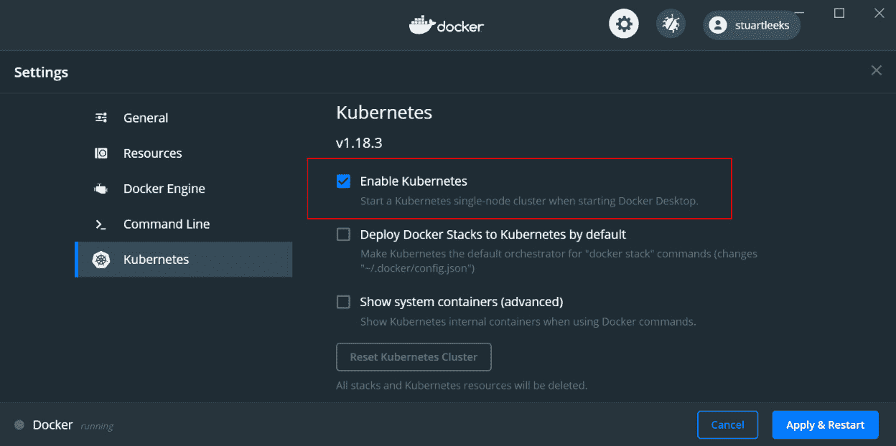

# *第七章*:在 WSL 中使用容器

作为一种打包和管理应用程序的方法，容器是一个热门话题。 虽然容器有 Windows 和 Linux 两种风格，但由于这是一本关于 WSL 的书，我们将特别关注 Linux 容器和 Docker 容器。 如果你想了解 Windows 容器，这个链接是一个很好的起点:[https://docs.microsoft.com/virtualization/windowscontainers/](https://docs.microsoft.com/virtualization/windowscontainers/)

在介绍了什么是容器并安装 Docker 之后，本章将指导你运行预构建的 Docker 容器，然后以 Python web 应用为例，教你如何为自己的应用构建容器映像。 在创建容器映像之后，您将快速浏览 Kubernetes 的一些关键组件，然后了解如何使用这些组件在 Kubernetes 内部托管容器化应用程序，所有这些组件都以 wsdl 运行。

在本章中，我们将涵盖以下主要主题:

*   概述的容器
*   通过 wsdl 安装和使用 Docker
*   使用 Docker 运行一个容器
*   在 Docker 中构建并运行一个 web 应用程序
*   引入协调器
*   在 WSL 中设置 Kubernetes
*   在 Kubernetes 中运行 web 应用程序

我们将通过探索容器是什么来开始本章。

# 容器概述

容器提供了一种打包应用程序及其依赖项的方法。 这个描述可能有点像**虚拟机**(**VM**)，其中有一个文件系统，可以在其中安装应用程序二进制文件，然后稍后运行。 然而，当您运行容器时，无论从启动的速度还是它所消耗的内存数量来看，它更像是一个进程。 在后台,容器是一组孤立的过程通过使用 Linux 名称空间特性,比如**【显示】和**对照组**(**并且【病人】),使它看起来像这些流程运行在自己的环境(包括自己的文件系统)。 容器与主机操作系统共享内核，因此不像 vm 那样隔离，但对于许多目的来说，这种隔离已经足够了，而且这种主机资源共享可以实现容器所能实现的低内存消耗和快速启动时间。****

除了容器的执行，Docker 还可以方便地定义容器(称为容器映像)的组成，并将容器映像发布到注册表中，供其他用户使用。

我们将在本章稍后的部分看到这一点，但首先，让我们安装 Docker。

# 在 WSL 中安装和使用 Docker

传统的方法在 Windows 机器上运行码头工人使用码头工人桌面(https://www.docker.com/products/docker-desktop),将创建和管理一个 Linux VM 和运行 VM 的码头工人服务作为一个守护进程。 这样做的缺点是，VM 启动需要时间，并且必须预先分配足够的内存来为您运行各种容器。

有了 WSL2，就可以在 WSL**发行版**中安装和运行标准的 Linux Docker 守护进程。 这样做的好处是启动更快，在启动时消耗更少的内存，并且只会在运行容器时增加内存消耗。 缺点是您必须自己安装和管理这个守护进程。

幸运的是，现在有了第三种选择，即安装 Docker Desktop 并启用 WSL 后端。 通过这种方法，您可以从安装和管理的角度保持 Docker Desktop 的便利性。 不同之处在于，Docker Desktop 以 WSL 的形式为您运行守护进程，在启动时间和内存使用方面进行了改进，同时又不失易用性。

首先，从 https://www.docker.com/products/docker-desktop 下载并安装Docker Desktop。 安装完成后，右键单击系统图标托盘中的 Docker 图标，选择**设置**。 你会看到以下画面:


图 7.1 -显示 WSL 2 选项的 Docker 设置截图

前面的截图显示了**使用基于 WSL 2 的引擎**选项。 确保勾选此选项，将 Docker Desktop 配置为在 WSL 2 下运行，而不是在传统虚拟机下运行。

您可以从**资源**部分选择 Docker Desktop 集成的发行版:


图 7.2 -用于 WSL 集成的 Docker 设置截图

正如你在前面的截图中看到的，你可以控制你想要与 Docker Desktop 集成的发行版。 当你选择集成 WSL 发行版,套接字的码头工人守护进程使用发行版和码头工人**命令行界面**(**CLI)添加你。 选择所有你想要使用Docker 的发行版，然后点击**Apply&Restart**。**

一旦 Docker 重新启动，你就可以使用`docker`命令行与 Docker 进行交互，比如`docker info`:

```sh
$ docker info
Client:
 Debug Mode: false
Server:
...
Server Version: 19.03.12
...
Kernel Version: 4.19.104-microsoft-standard
 Operating System: Docker Desktop
 OSType: linux
...
```

这个代码片段显示了输出的一些运行`docker info`和中可以看到,服务器运行在内核的`linux``4.19.104-microsoft-standard`,这是 WSL 内核版本一样在我的机器上(你可以检查这个在你的机器上运行`uname -r`从你 WSL 发行版)。

更多关于使用 WSL 安装和配置 Docker Desktop 的信息可以在 https://docs.docker.com/docker-for-windows/wsl/的Docker 文档中找到。

现在我们已经安装了 Docker，让我们开始运行一个容器。

# 使用 Docker 运行一个容器

正如前面提到的，Docker 给了我们一种包装容器图像的标准化方法。 这些容器镜像可以通过 Docker 注册表共享，而 Docker Hub (https://hub.docker.com/)是一个常用的注册表，用于公开可用的镜像。 在本节中，我们将使用`docker run -d --name docker-nginx -p 8080:80 nginx`命令运行一个带有`nginx`web 服务器的容器，如下所示:

```sh
$ docker run -d --name docker-nginx -p 8080:80 nginx
Unable to find image 'nginx:latest' locally
latest: Pulling from library/nginx
8559a31e96f4: Already exists
1cf27aa8120b: Downloading [======================>                            ]  11.62MB/26.34MB
...
```

我们刚才运行的命令的最后一部分告诉 Docker 我们想要运行的容器映像(`nginx`)。 这段输出显示 Docker 没有在本地找到`nginx`图像，所以它已经开始从 Docker Hub 提取(也就是下载)它。 容器图像由层组成(我们将在本章后面进一步讨论)，在输出中，一个层已经存在，另一个层正在下载中。 在下载过程中，`docker`命令行会不断更新输出，如下所示:

```sh
$ docker run -d --name docker-nginx -p 8080:80 nginx
Unable to find image 'nginx:latest' locally
latest: Pulling from library/nginx
8559a31e96f4: Already exists
1cf27aa8120b: Pull complete
67d252a8c1e1: Pull complete
9c2b660fcff6: Pull complete
4584011f2cd1: Pull complete
Digest: sha256:a93c8a0b0974c967aebe868a186 e5c205f4d3bcb5423a56559f2f9599074bbcd
Status: Downloaded newer image for nginx:latest
336ab5bed2d5f547b8ab56ff39d1db08d26481215d9836a1b275e0c7dfc490d5
```

当 Docker 完成图像提取后，您将看到类似于前面的输出，它确认 Docker 已经提取了图像，并打印了它创建的容器(`336ab5bed2d5…`)的 ID。 现在，我们可以运行`docker ps`来列出正在运行的容器:

```sh
$ docker ps
CONTAINER ID        IMAGE              COMMAND                CREATED              STATUS              PORTS                 NAMES
336ab5bed2d5        nginx              "/docker-entrypoint.…"   About a minute ago   Up About a minute   0.0.0.0:8080->80/tcp|     docker-nginx
```

该输出显示了运行的单个容器，我们可以看到容器 ID`336ab5bed2d5`值与从`docker run`输出的容器 ID 的开头匹配。 默认情况下，`docker ps`输出容器 ID 的简写形式，而`docker run`输出完整的容器 ID 值。

让我们回到我们用于运行容器的命令:`docker run -d --name docker-nginx -p 8080:80 nginx`。 它有不同的部分:

*   `-d`告诉 Docker 运行这个与终端分离的容器，即在后台运行它。
*   `--name`告诉 Docker 为容器使用一个特定的名称`docker-nginx`，而不是生成一个随机的名称。 这个名称也可以在`docker ps`输出中看到，并且可以使用。
*   `-p`允许我们将主机上的端口映射到运行容器内的端口。 格式为`<host port>:<container port>`，因此在`8080:80`的情况下，我们已经将主机上的端口`8080`映射到容器内的端口`80`。
*   最后一个参数是要运行的映像的名称:`nginx`。

由于`80`端口是`nginx`提供内容的默认端口，我们已经将`8080`端口映射到该容器端口，所以我们可以将浏览器打开到`http://localhost:8080`，如下图所示:


图 7.3 -显示 nginx 输出的浏览器截图

上面的屏幕截图显示了在 web 浏览器中 nginx 的输出。 现在，我们已经使用单个命令(`docker run`)下载并在 Docker 容器中运行 nginx。 容器资源有一个隔离级别，这意味着nginx 在容器内服务流量的端口`80`在外部是不可见的，所以我们将其映射到容器外的端口`8080`。 因为我们码头工人桌面 2 WSL 后台运行,港口`8080`是暴露在 WSL 2 VM,但由于我们看到的魔法[【显示】第四章](04.html#_idTextAnchor047),*Windows, Linux 互操作性【病人】,在*访问 Linux web 应用程序从 Windows*部分,我们可以从 Windows 访问,在`http://localhost:8080`。*

如果我们让容器继续运行，它将继续消耗资源，所以让我们在继续之前停止并删除它，如下所示:

```sh
$ docker stop docker-nginx
docker-nginx
$ docker rm docker-nginx
docker-nginx
```

在这个输出中，您可以看到`docker stop docker-nginx`，它将停止正在运行的容器。 此时，它不再消耗内存或 CPU，但它仍然存在并引用用于创建它的映像，从而防止该映像被删除。 因此，在停止容器之后，我们使用`docker rm docker-nginx`来删除它。 为了释放磁盘空间，我们也可以通过运行`docker image rm nginx:latest`来清理`nginx`映像。

现在我们已经了解了如何运行容器，让我们构建自己的容器映像来运行。

# 在 Docker 中构建并运行一个 web 应用

在本节中，我们将构建一个 Docker 容器映像，该映像打包了一个 Python web 应用程序。 这个容器映像将包含 web 应用程序及其所有的依赖项，这样它就可以在安装了 Docker 守护进程的机器上运行。

跟随在这个例子中,确保你有这本书的代码(来自 https://github.com/PacktPublishing/Windows-Subsystem-for-Linux-2-WSL-2-Tips-Tricks-and-Techniques)克隆在一个 Linux 发行版,然后打开终端并导航到`chapter-07/01-docker-web-app`文件夹, 其中包含我们将在这里使用的示例应用程序。 请检查`README.md`文件中关于安装运行应用程序所需的依赖项的说明。

示例应用程序构建在 Python 的**Flask**web 框架(https://github.com/pallets/flask)上，并使用**Gunicorn HTTP 服务器**来托管应用程序(https://gunicorn.org/)。

为了保持 Docker 容器这一章的重点，应用程序有一个单独的代码文件`app.py`:

```sh
from os import uname
from flask import Flask
app = Flask(__name__)
def gethostname():
    return uname()[1]
@app.route("/")
def home():
    return f"<html><body><h1>Hello from {gethostname()}</h1></body></html>"
```

如代码所示，为主页定义了一个单一端点，该端点返回一条消息，显示web 服务器所在机器的主机名。

应用程序可以使用`gunicorn --bind 0.0.0.0:5000 app:app`运行，我们可以在浏览器中打开`http://localhost:5000`:


图 7.4 -在 web 浏览器中显示示例应用程序的截图

在这个屏幕截图中，您可以看到来自示例应用程序的响应，显示了应用程序运行的主机名(`wfhome`)。

现在您已经看到了实际的示例应用程序，我们将开始研究如何将其打包为容器映像。

## Dockerfiles 简介

要构建一个映像，我们需要能够向 Docker 描述映像应该包含什么，为此，我们将使用`Dockerfile`。 一个`Dockerfile`包含了一系列命令，Docker 要执行来构建一个容器映像:

```sh
FROM python:3.8-slim-buster
EXPOSE 5000
ADD requirements.txt .
RUN python -m pip install -r requirements.txt
WORKDIR /app
ADD . /app
CMD ["gunicorn", "--bind", "0.0.0.0:5000", "app:app"]
```

这个 Dockerfile 包含许多命令。 让我们来看看它们:

*   `FROM`命令指定了 Docker 应该使用的基本映像，换句话说，就是容器映像的起始内容。 安装在基本映像中的任何应用程序和包都将成为我们在其上构建的映像的一部分。 这里，我们指定了`python:3.8-slim-buster`映像，它提供基于**Debian Buster**的映像，其中安装了 Python 3.8。 还有一个`python:3.8-buster`图像，其中包含许多常见的包，但这会使基础图像变大。 因为这个应用程序只使用了几个包，所以我们使用了`slim`变体。
*   `EXPOSE`表示我们想要公开一个端口(在本例中是`5000`，因为这是 web 应用程序将要侦听的端口)。
*   我们使用`ADD`命令向容器图像添加内容。 `ADD`的第一个参数指定要从`host`文件夹中添加的内容，第二个参数指定将其放置在容器图像中的位置。 这里，我们添加了`requirements.txt`。
*   `RUN`命令用于使用我们刚刚在`ADD`命令的帮助下添加到映像的`requirements.txt`文件执行`pip install`操作。
*   `WORKDIR`用于将容器中的工作目录设置为`/app`。
*   再次使用`ADD`将应用程序的全部内容复制到`/app`目录中。 在下一节中，我们将讨论为什么要用两个单独的`ADD`命令复制应用程序文件。
*   最后，`CMD`命令指定从映像运行容器时将执行什么命令。 这里，我们指定了刚才用于在本地运行 web 应用程序的相同的`gunicorn`命令。

现在我们有了`Dockerfile`，让我们看看如何使用它来构建映像。

## 塑造形象

要构建容器映像，我们将使用`docker build`命令:

```sh
docker build -t simple-python-app  .
```

这里，我们使用了`-t`开关来指定结果图像应该被标记为`simple-python-app`。 这是映像的名称，稍后我们可以使用它从映像运行容器。 最后，我们告诉 Docker 使用哪个目录作为构建上下文，这里，我们使用`.`来表示当前目录。 构建上下文指定打包并传递给 Docker 守护进程用于构建映像的内容——当您将一个文件`ADD`转移到`Dockerfile`时，它将从构建上下文复制。

这个命令的输出相当长，因此我们将不包含完整的输出，而是查看几个关键部分。

初始输出来自`FROM`命令:

```sh
Step 1/7 : FROM python:3.8-slim-buster
3.8-slim-buster: Pulling from library/python
8559a31e96f4: Already exists
62e60f3ef11e: Pull complete
...
Status: Downloaded newer image for python:3.8-slim-buster
```

在这里，您可以看到 Docker 已经确定它没有本地的基础映像，所以将它从 Docker Hub 中拉出，就像我们之前运行`nginx`映像时一样。

再往下一点输出，我们可以看到`pip install`已经被执行，以在映像中安装应用程序需求:

```sh
Step 4/7 : RUN python -m pip install -r requirements.txt
 ---> Running in 1515482d6808
Requirement already satisfied: wheel in /usr/local/lib/python3.8/site-packages (from -r requirements.txt (line 1)) (0.34.2)
Collecting flask
  Downloading Flask-1.1.2-py2.py3-none-any.whl (94 kB)
Collecting gunicorn
  Downloading gunicorn-20.0.4-py2.py3-none-any.whl (77 kB)
...
```

在前面的代码片段中，您可以看到在安装`flask`和`gunicorn`时`pip install`的输出。

在输出的末尾，我们看到了两个成功消息:

```sh
Successfully built 747c4a9481d8
Successfully tagged simple-python-app:latest
```

第一个成功消息给出了我们刚刚创建的图像的 ID(`747c4a9481d8`)，第二个消息显示它已经使用我们指定的标记(`simple-python-app`)进行了标记。 要查看本地机器上的Docker 映像，我们可以运行`docker image ls`:

```sh
$ docker image ls
REPOSITORY          TAG                 IMAGE ID            CREATED             SIZE
simple-python-app   latest              7383e489dd38        16 seconds ago      123MB
python              3.8-slim-buster     ec75d34adff9        22 hours ago        113MB
nginx               latest              4bb46517cac3        3 weeks ago         133MB
```

在这个输出中，我们可以看到刚刚构建的`simple-python-app`图像。 现在我们已经构建了一个容器映像，现在可以运行它了!

## 运行镜像

如前所述，我们可以使用`docker run`命令运行容器:

```sh
$ docker run -d -p 5000:5000 --name chapter-07-example simple-python-app
6082241b112f66f2bb340876864fa1ccf170a 519b983cf539e2d37e4f5d7e4df
```

在这里，您可以看到我们正在将`simple-python-app`映像作为一个名为`chapter-07-example`的容器运行，并且已经暴露了端口`5000`。 命令输出显示了我们刚刚启动的容器的 ID。

当容器运行时，我们可以在浏览器中打开`http://localhost:5000`:


图 7.5 -显示 web 浏览器中容器化示例应用程序的截图

在这个屏幕截图中，我们可以看到示例应用程序的输出。注意，它输出的主机名与`docker run`命令输出中的容器 ID 的开头相匹配。 在创建容器的隔离环境时，主机名被设置为容器 ID 的短形式。

现在已经构建并运行了容器的初始版本，让我们看看如何修改应用程序并重新构建映像。

## 用变化重建形象

在开发一个应用程序时，我们将对源代码进行更改。 要模拟这一点，只需对`app.py`中的消息进行简单更改(例如，将`Hello from`更改为`Coming to you from`)。 一旦我们做了这个更改，我们可以使用与之前相同的`docker build`命令重新构建容器映像:

```sh
$ docker build -t simple-python-app -f Dockerfile .
Sending build context to Docker daemon   5.12kB
Step 1/7 : FROM python:3.8-slim-buster
 ---> 772edcebc686
Step 2/7 : EXPOSE 5000
 ---> Using cache
 ---> 3e0273f9830d
Step 3/7 : ADD requirements.txt .
 ---> Using cache
 ---> 71180e54daa0
Step 4/7 : RUN python -m pip install -r requirements.txt
 ---> Using cache
 ---> c5ab90bcfe94
Step 5/7 : WORKDIR /app
 ---> Using cache
 ---> f4a62a82db1a
Step 6/7 : ADD . /app
 ---> 612bba79f590
Step 7/7 : CMD ["gunicorn", "--bind", "0.0.0.0:5000", "app:app"]
 ---> Running in fbc6af76acbf
Removing intermediate container fbc6af76acbf
 ---> 0dc3b05b193f
Successfully built 0dc3b05b193f
Successfully tagged simple-python-app:latest
```

这次的输出是，略有不同。 除了基本映像没有被提取(因为我们已经下载了基本映像)之外，您可能还会注意到带有`---> Using cache`的许多行。 当 Docker 运行`Dockerfile`中的命令时，每一行(有几个例外)创建一个新的容器映像，随后的命令构建在该映像之上，就像我们构建在基本映像之上一样。 这些图像通常被称为层，因为它们是建立在彼此之上的。 当构建一个映像时，如果 Docker 确定命令中使用的文件与之前构建的层匹配，那么它将重用该层，并使用`---> Using cache`输出来表明这一点。 如果文件不匹配，那么 Docker 运行该命令并使以后任何层的缓存无效。

这一层缓存是我们将`requirements.txt`从应用程序的`Dockerfile`的主要应用程序内容中分离出来的原因:安装需求通常是一个缓慢的操作，通常应用程序文件的其余部分更改更频繁。 分离需求并在复制应用程序代码之前执行`pip install`，可以确保层缓存在我们开发应用程序时能够正常工作。

我们在这里看到了一系列 Docker 命令; 如果您想进一步了解(包括如何将映像推送到注册表)，请查看 https://www.docker.com/101-tutorial 上的*Docker 101 教程*。

在本节中，我们了解了如何构建容器映像以及如何运行容器，无论是我们自己的映像还是来自 Docker Hub 的映像。 我们还看到了层缓存如何加快开发周期。 这些都是基本步骤，在下一节中，我们将开始研究编排器，它是使用容器构建系统的下一层。

# 介绍管弦乐

在前一节中，我们看到了如何使用 Docker 的功能轻松地将应用程序打包为容器映像并运行它。 如果我们将映像推送到 Docker 注册表中，那么从任何安装了 Docker 的机器上拉出并运行该应用程序就变得简单了。 然而，更大的系统是由许多这样的组件组成的，我们可能希望将这些组件分布在许多 Docker 主机上。 这允许我们通过增加或减少正在运行的组件容器的实例数量来适应系统负载的变化。 在容器化系统中获得这些特性的方法是使用编排器。 编排器提供了其他特性，比如自动重新启动失败的容器，如果主机发生故障，在不同的主机上运行容器，以及在容器可能重新启动和在主机之间移动时与容器进行通信的稳定方式。

有许多容器协调器,如**Kubernetes**,**码头工人群**,**中间层直流/ OS**(基于 Apache 便与马拉松【显示】)。 这些编排器都提供了略微不同的特性和实现我们刚才描述的需求的方法。 Kubernetes 已经成为一个非常受欢迎的编排器，所有主要的云供应商都提供了 Kubernetes 产品(它甚至在 Docker Enterprise 和中间层 DC/OS 中都有支持)。 我们将用本章剩下的时间来研究如何在 WSL 中创建 Kubernetes 开发环境并在其上运行应用程序。

# 在 WSL 中设置 Kubernetes

安装 Kubernetes 不缺少选项，包括如下:

*   种类([https://kind.sigs.k8s.io/](https://kind.sigs.k8s.io/))
*   [https://kubernetes.io/docs/tasks/tools/install-minikube/](https://kubernetes.io/docs/tasks/tools/install-minikube/)
*   MicroK8s (https://microk8s.io/)
*   k3s([https://k3s.io/](https://k3s.io/))

其中第一个，Kind，是 Docker 中Kubernetes 的，用于测试Kubernetes。 只要您的构建工具能够运行 Docker 容器，那么将 Kubernetes 作为自动构建中集成测试的一部分运行是一个不错的选择。 默认情况下,将创建一个单节点集群 Kubernetes 但您可以配置它运行多节点集群,每个节点在哪里运行作为一个单独的容器*(*我们将看到如何使用*【显示】*第十章*【病人】, Visual Studio Code and Containersin*Working with Kubernetes in dev container*section*)**

 *然而，在本章中，我们将使用 Docker Desktop 中内置的 Kubernetes 功能，它提供了一种方便的方式来为你管理 Kubernetes 集群:



图 7.6 - Docker Desktop 中启用 Kubernetes 的截图

在这个截图中，你可以看到 Docker Desktop 设置的**Kubernetes**页面，有**Enable Kubernetes**选项。 通过勾选此选项并点击**应用&重启**，Docker Desktop 将为您安装一个Kubernetes 集群。

就像我们在中使用`docker`CLI 与 Docker 交互一样，Kubernetes 也有自己的 CLI`kubectl`。 我们可以使用`kubectl`来检查我们是否能够连接到 Docker Desktop 用`kubectl cluster-info`命令为我们创建的 Kubernetes 集群:

```sh
$ kubectl cluster-info
Kubernetes master is running at https://kubernetes.docker.internal:6443
KubeDNS is running at https://kubernetes.docker.internal:6443/api/v1/namespaces/kube-system/services/kube-dns:dns/proxy
To further debug and diagnose cluster problems, use 'kubectl cluster-info dump'.
```

这个输出显示`kubectl`已经成功地连接到`kubernetes.docker.internal`的 Kubernetes 集群，表明我们正在使用*Docker Desktop Kubernetes 集成*。

现在我们已经运行了一个Kubernetes 集群，让我们看看在其中运行一个应用程序。

# 在 Kubernetes 中运行 web 应用程序

Kubernetes 引入了几个新术语，其中第一个是豆荚。 **荚**是在Kubernetes 中运行容器的方式。 当我们要求 Kubernetes 运行一个 pod 时，我们指定一些细节，例如我们希望它运行的图像。 像 Kubernetes 这样的编排器的设计目的是让我们能够将多个组件作为系统的一部分运行，包括能够向外扩展组件实例的数量。 为了帮助实现这个目标，Kubernetes 加入了另一个概念**部署**。 部署构建在 pod 上，允许我们指定希望 Kubernetes 运行多少对应 pod 的实例，这个值可以动态更改，使我们能够向外(或向内)扩展应用程序。

稍后我们将查看如何创建部署，但首先，我们需要为示例应用程序创建一个新标记。 在之前构建 Docker 映像时，我们使用了`simple-python-app`标记。 每个标记都有一个或多个相关联的版本，因为我们没有指定版本，所以假设它是`simple-python-app:latest`。 在使用 Kubernetes 时，使用*最新的*图像版本意味着 Kubernetes 将尝试从注册表中提取图像，即使它在本地拥有该图像。 由于我们没有将映像推送到注册表中，所以这个操作将失败。 我们可以重新构建映像，指定`simple-python-app:v1`作为映像名称，但是由于已经构建了映像，我们还可以通过运行`docker tag simple-python-app:latest simple-python-app:v1`来创建映像的新标记版本。 现在我们有两个标记指向同一图像，但是通过使用`simple-python-app:v1`标记，Kubernetes 将只尝试在本地不存在该图像的情况下提取该图像。 准备好新标记后，让我们开始将应用程序部署到 Kubernetes。

## 创建部署

将示例应用程序部署到 Kubernetes 的第一步是在 Kubernetes 中创建一个部署对象。 使用容器镜像的版本标签，我们可以使用`kubectl`来创建部署:

```sh
$ kubectl create deployment chapter-07-example --image=simple-python-app:v1
deployment.apps/chapter-07-example created
$ kubectl get deployments
NAME                 READY   UP-TO-DATE   AVAILABLE   AGE
chapter-07-example   1/1     1            1           10s
```

该输出显示了运行`simple-python-app:v1`映像的名为`chapter-07-example`的部署的创建。 在创建部署之后，它显示了用于列出部署并获取关于部署状态的摘要信息的`kubectl get deployments`。 这里，`READY`列中的`1/1`表明部署配置为运行一个 pod 实例，并且该实例是可用的。 如果在我们的 pod 中运行的应用程序崩溃，Kubernetes 将(默认情况下)自动为我们重新启动它。 我们可以运行`kubectl get pods`来查看部署创建的 pod:

```sh
$ kubectl get pods
NAME                                  READY   STATUS    RESTARTS   AGE
chapter-07-example-7dc44b8d94-4lsbr   1/1     Running   0          1m
```

在这个输出中，我们可以看到已经创建了 pod，其名称以部署名称开头，后跟一个随机后缀。

正如我们之前提到的，在 pod 上使用部署的一个好处是能够扩展它:

```sh
$ kubectl scale deployment chapter-07-example --replicas=2
deployment.apps/chapter-07-example scaled
$ kubectl get pods
NAME                                  READY   STATUS    RESTARTS   AGE
chapter-07-example-7dc44b8d94-4lsbr   1/1     Running   0       2m
chapter-07-example-7dc44b8d94-7nv7j   1/1     Running   0      15s
```

这里，我们看到在`chapter-07-example`部署中使用了`kubectl scale`命令来将副本的数量设置为两个，换句话说，将部署扩展到两个 pod。 在除垢之后，我们再次运行`kubectl get pods`，可以看到我们创建了第二个豆荚。

提示

在使用 kubectl 时，您可以通过启用 bash 完成来提高生产率。 要配置，运行命令:

`echo 'source <(kubectl completion bash)' >>~/.bashrc`

这会将 kubectl bash 完成添加到您的`.bashrc`文件中，因此您需要重新启动 bash 来启用它(详细信息请参见[https://kubernetes.io/docs/tasks/tools/install-kubectl/#optional-kubectl-configurations](https://kubernetes.io/docs/tasks/tools/install-kubectl/#optional-kubectl-configurations))，

完成此更改后，您现在可以输入以下内容(按*Tab*键代替`<TAB>`):

`kubectl sc<TAB> dep<TAB> chap<TAB> --re<TAB>2`

使用 bash 完成的最终结果是:

`kubectl scale deployment chapter-07-example --replicas=2`

如您所见，这节省了输入命令的时间，并支持命令(如`scale`)和资源名(`chapter-07-example`)的补全。

现在我们已经部署了应用程序，让我们看看如何访问它。

创建一个服务

接下来，我们希望能够访问作为`chapter-07-example`部署运行的 web 应用程序。 因为我们可以让 web 应用程序的实例跨 pod 运行，所以我们需要一种访问 pod 集合的方法。 为此，Kubernetes 有一个称为**服务**的概念。 我们可以使用`kubectl expose`创建一个服务:

```sh
$ kubectl expose deployment chapter-07-example --type="NodePort" --port 5000
service/chapter-07-example exposed
$ kubectl get services
NAME                 TYPE        CLUSTER-IP      EXTERNAL-IP    PORT(S)          AGE
chapter-07-example   NodePort    10.107.73.156   <none>        5000:30123/TCP   7s
kubernetes           ClusterIP   10.96.0.1       <none>        443/TCP          16m
```

这里，我们运行`kubectl expose`，指示 Kubernetes 为我们的`chapter-07-example`部署创建一个服务。 我们指定`NodePort`作为服务类型，这使得服务在集群中的任何节点上都可用，并将`5000`作为服务目标的端口，以匹配我们的 web 应用程序正在侦听的端口。 接下来，我们运行`kubectl get services`，它显示新的`chapter-07-example`服务。 在`PORT(S)`栏下，我们可以看到`5000:30123/TCP`，这表明服务正在监听端口`30123`，并将通信转发到部署中吊舱上的端口`5000`。

多亏 Docker Desktop 为 Kubernetes 集群设置了网络(以及`localhost`从 Windows 到 WSL 的 WSL 转发)，我们可以在浏览器中打开`http://localhost:30123`:


图 7.7 -浏览器中 Kubernetes web 应用程序的屏幕截图

这张截图显示了加载在浏览器中的 web 应用程序，它显示的主机名与我们在扩展部署后列出 pod 时看到的其中一个 pod 名称相匹配。 如果刷新页面几次，您将看到在扩展部署后创建的 pod 名称之间的名称更改，这表明我们创建的 Kubernetes 服务正在 pod 之间分发流量。

我们一直在交互式地运行`kubectl`命令来创建部署和服务，但是 Kubernetes 的一个强大方面是它对声明式部署的支持。 Kubernetes 允许您在以`YAML`格式编写的文件中定义对象，例如部署和服务。 通过这种方式，您可以指定系统的多个方面，然后将`YAML`文件集一次性传递给 Kubernetes, Kubernetes 将创建所有这些文件。 您可以稍后更新*YAML*规范，并将其传递给 Kubernetes，它将协调规范中的差异，以应用您的更改。 其中的一个例子是本书附带的代码中的`chapter-07/02-deploy-to-kubernetes`文件夹(请参阅该文件夹中的`README.md`文件，了解如何部署)。

在本节中，我们通过来了解如何使用 Kubernetes 部署将 web 应用程序打包为容器映像。 我们看到这是如何为我们创建豆荚的，并允许我们动态地缩放我们正在运行的豆荚的数量。 我们还看到了如何使用 Kubernetes 创建一个服务，该服务在我们的部署中跨豆荚分发流量。 该服务对部署中的豆荚进行逻辑抽象，并处理扩展部署以及重新启动的豆荚(例如，如果它崩溃了)。 这为使用 Kubernetes 提供了一个很好的起点，如果你想进一步了解它，Kubernetes 在[https://kubernetes.io/docs/tutorials/kubernetes-basics/](https://kubernetes.io/docs/tutorials/kubernetes-basics/)有一个很棒的交互式教程。

请注意

如果你有兴趣深入挖掘使用*Docker*或*Kubernetes*构建应用程序，下面的链接是一个很好的起点(还有其他内容的进一步链接):

[https://docs.docker.com/develop/](https://docs.docker.com/develop/)

[https://kubernetes.io/docs/home/](https://kubernetes.io/docs/home/)

# 总结

在本章中，我们已经介绍了容器，并看到了容器如何将应用程序及其依赖项打包在一起，从而使其能够在运行 Docker 守护进程的机器上简单地运行。 我们讨论了 Docker 注册表作为一种共享映像的方式，包括常用的公共注册表:**Docker Hub**。 介绍了`docker`命令行，并使用此命令从 Docker Hub 运行`nginx`镜像，Docker 自动将镜像从 Docker Hub 拉到本地机器。

运行了`nginx`映像之后，您看到了如何使用`Dockerfile`中定义的步骤从自定义 web 应用程序构建映像。 你看到码头工人如何构建图像层的步骤`Dockerfile`和重用它们在随后构建如果文件没有改变,以及如何可以用来改善后续构建时间通过精心构建`Dockerfile`最常见的改变在后续的步骤中添加内容。

在了解了如何使用 Docker 之后，您首先了解了容器编排器的概念，然后再了解 Kubernetes。 通过 Kubernetes，您了解了如何使用不同类型的资源(如豆荚、部署和服务)来部署应用程序。 您了解了 Kubernetes 部署如何构建在 pods 上，从而允许您轻松地伸缩使用单个命令运行的 pod 实例的数量，以及如何使用 Kubernetes 服务提供一种简单而一致的方式，在独立于伸缩的部署中处理 pods。

在下一章中，我们将把注意力更直接地转向 wsdl，在这里，构建和使用容器的知识将被证明是有用的。*