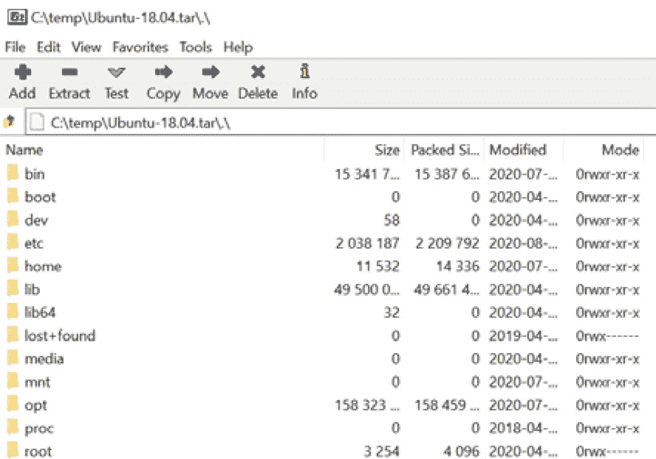
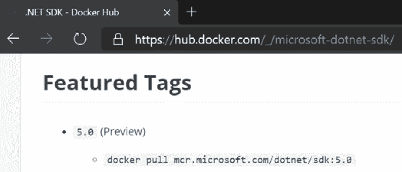

# 八、使用 WSL 发行版

在第二章[](02.html#_idTextAnchor023)*,*安装和配置 Windows 子系统为 Linux*,在*引入 wsl 命令【显示】部分,我们看到了如何使用`wsl`命令列表**分布**(【病人】**发行版),我们已经安装,运行命令,并根据需要终止它们。****

 *我们将在这一章中重新讨论发行版，这一次更多地从发行版管理的角度来看待它们。 特别地，我们将研究如何使用`export`和`import`命令来备份一个发行版或将其复制到另一台机器。 我们还将了解如何基于 Docker 容器映像快速创建一个新的发行版，以便轻松创建自己的发行版，并安装任何依赖项。

在本章中，我们将涵盖以下主要主题:

*   导出和导入一个 WSL 发行版
*   创建并运行一个自定义发行版

我们将通过查看如何导出和导入 WSL 发行版来开始本章。

# 导出和导入一个 WSL 发行版

如果您有投入时间来设置一个 WSL 发行版，您可能希望能够将其复制到另一台机器上。 这可能是因为您正在替换或重新安装您的机器，或者可能您有多台机器，并且希望将配置好的发行版复制到另一台机器上，而不是从头开始设置发行版。 在这一节中，我们将研究如何将一个发行版导出到一个存档文件，这个存档文件可以复制到另一台机器上并导入。

让我们从准备用于导出的发行版开始。

## 准备出口

导出一个发行版之前,我们要确保发行版的默认用户在`/etc/wsl.conf`中设置文件在发行版(你可以阅读更多关于`wsl.conf`[*第二章*](02.html#_idTextAnchor023),*安装和配置 Windows 子系统为 Linux【显示】,在*引入 wsl.conf 和.wslconfig*部分)。 通过这样做，我们可以确保在我们稍后导入了 wsdl 之后，它仍然为我们的发行版使用正确的默认用户。*

在你的 WSL 发行版中打开一个终端并运行`cat /etc/wsl.conf`来检查文件的内容:

```sh
$ cat /etc/wsl.conf
[network]
generateHosts = true
generateResolvConf = true
[user]
default=stuart
```

在输出的末尾，您可以看到带有`default=stuart`条目的`[user]`部分。 如果您没有默认的用户条目(或者您没有`wsl.conf`)，那么您可以使用您喜欢的编辑器来确保有一个类似的条目(具有正确的用户名)。 或者，您可以运行以下命令添加一个用户(假设您的`wsl.conf`没有`[user]`部分):

```sh
sudo bash -c "echo -e '\n[user]\ndefault=$(whoami)' >> /etc/wsl.conf"
```

该命令使用`echo`输出`[user]`部分，默认设置为当前用户。 它嵌入调用`whoami`以获取当前用户名的结果。 使用`sudo`封装并执行整个命令，以确保它具有写入文件的必要权限。

准备工作完成后，让我们看看如何导出发行版。

## 执行导出

要导出发行版，我们将使用`wsl`命令将发行版的内容导出到磁盘上的一个文件。 为此，我们运行`wsl --export`:

```sh
wsl --export Ubuntu-18.04 c:\temp\Ubuntu-18.04.tar
```

如您所见，我们指定了想要导出的发行版的名称(`Ubuntu-18.04`)，后面是我们想要保存导出的路径(`c:\temp\Ubuntu-18.04.tar`)。 导出将需要一些时间来完成，这取决于发行版的大小和其中的内容数量。

在导出过程中，发行版不可用，如`wsl --list`命令(在单独的终端实例中执行)所示:

```sh
PS C:\> wsl --list --verbose
  NAME                   STATE           VERSION
* Ubuntu-20.04           Running         2
  Legacy                 Stopped         1
  Ubuntu-18.04           Converting      2
PS C:\>
```

在这个输出中，您可以看到`Ubuntu-18.04`发行版的状态显示为`Converting`。 一旦导出命令完成，发行版将处于`Stopped`状态。

导出的文件是一个以**TAR**格式(最初是**Tape archive**的缩写)的归档文件，在 Linux 中很常见。 如果您打开 TAR 文件(例如，在一个应用中，例如 7-zip from[https://www.7-zip.org/](https://www.7-zip.org/))，您可以看到内容:



图 8.1 -以 7-zip 格式打开导出的 TAR 的截图

在这个屏幕截图中，您可以看到导出的 TAR 文件包含 Linux 系统中熟悉的文件夹。 如果愿意，您可以深入到文件夹(如`/home/stuart`)并导出单个文件。

现在我们已经为发行版导出了一个文件，让我们看看如何导入它。

## 执行导入

一旦您拥有了您的发行版的导出文件，您可以将其复制到新机器(假设您正在传输发行版)，或者如果您正在使用导出/导入来创建一个发行版的副本，则将其留在相同的位置。

要执行导入，我们将使用以下`wsl`命令:

```sh
wsl --import Ubuntu-18.04-Copy C:\wsl-distros\Ubuntu-18.04-Copy C:\temp\Ubuntu-18.04.tar
```

如您所见，这一次我们使用了`--import`开关。 之后，我们传递以下三个参数:

*   `Ubuntu-18.04-Copy`:这是导入将要创建的新发行版的名称。
*   `C:\wsl-distros\Ubuntu-18.04-Copy`:这是新发行版的状态存储在磁盘上的路径。 通过 Store 安装的发行版被安装在`$env:LOCALAPPDATA\Packages`下的文件夹中，如果你想把你导入的发行版放在类似的位置，你可以使用这个路径。
*   `C:\temp\Ubuntu-18.04.tar`:要导入的导出发行版的 TAR 文件的路径。

与导出一样，如果内容很多，导入过程可能需要一段时间。 我们可以通过在另一个终端实例中运行`wsl`来查看状态:

```sh
PS C:\ > wsl --list --verbose
  NAME                   STATE           VERSION
* Ubuntu-20.04           Running         2
  Legacy                 Stopped         1
  Ubuntu-18.04-Copy      Installing      2
  Ubuntu-18.04           Stopped         2
PS C:\Users\stuar>
```

在这个输出中，我们可以看到新的发行版(`Ubuntu-18.04-Copy`)在导入期间显示为处于`Installing`状态。 一旦`import`命令完成，新的发行版就可以使用了。

正如您在这里看到的，通过将一个发行版导出到一个可以导入的 TAR 文件，您可以在您的机器上创建一个发行版的克隆，例如，在不影响原始发行版的情况下测试一些其他应用。 通过在计算机之间复制 TAR 文件，它还提供了一种方法来复制您已经在计算机之间配置好以重用它们的发行版。

接下来，我们将看看如何创建自己的发行版。

# 创建并运行自定义发行版

如果您跨多个项目工作，每个项目都有自己的工具集，并且您希望保持依赖关系独立，那么为每个项目运行一个发行版可能比较有吸引力。 我们刚才看到的用于导出和导入发行版的技术为您提供了一种实现此目的的方法，即创建一个正在启动的发行版的副本。

在本节中，我们将研究一种使用 Docker 映像的替代方法。 Docker Hub 上发布了大量的图像，包括安装了各种开发工具集的图像。 正如我们将在本节中看到的，这是安装一个用于使用新工具集的发行版的快速方法。 在[*第 10 章*](10.html#_idTextAnchor125)，*Visual Studio Code 和容器*中，我们将看到另一种方法，直接使用容器封装开发依赖。

在我们开始之前，值得注意的是，还有一种方法可以为 WSL 构建自定义发行版，但这是一个更复杂的过程，不适合本节的场景。 它也是将 Linux 发行版发布到 Store 的路径——详细信息可以在[https://docs.microsoft.com/en-us/windows/wsl/build-custom-distro](https://docs.microsoft.com/en-us/windows/wsl/build-custom-distro)找到。

在这一节中，我们将看看如何使用容器来设置一个准备使用。net Core 的发行版(但是这个过程适用于任何你能找到容器映像的技术堆栈)。 我们将使用 Docker Hub 来找到我们想要用作新 wsdl 发行版基础的映像，然后配置一个运行容器，以便它能够顺利地与 wsdl 一起工作。 一旦我们设置好容器，我们将它导出到一个 TAR 文件，可以像在前一节中看到的那样导入该文件。

让我们开始寻找我们想要使用的图像。

## 查找和抓取容器图像

第一步是找到我们想要使用作为起点的容器。 后寻找`dotnet`在码头工人中心(https://hub.docker.com/),我们可以滚动从微软找到图片,这将导致我们这个页面(https://hub.docker.com/_/microsoft-dotnet-core[【显示】):](https://hub.docker.com/_/microsoft-dotnet-core)


图 8.2 - Docker Hub 上。net 图像页面的截图

从这张截图中可以看到，. net 中有很多可用的图片。 在本章中，我们将使用。net 5.0 映像，特别是 SDK 映像，因为我们希望能够测试构建的应用(而不是运行时映像设计用来运行的应用)。

通过点击`dotnet/sdk`页面，我们可以找到我们需要使用的图像标签来拉动和运行图像:



图 8.3 - Docker Hub 上。net 5.0 SDK 图像标签的截图

如图所示，我们可以运行`docker pull mcr.microsoft.com/dotnet/sdk:5.0`将图像拉到本地机器上。

既然已经找到了我们想要使用作为新发行版的起点的映像，那么准备将其与 WSL 一起使用还需要几个步骤。 让我们看看这些是什么。

## 为 WSL 配置一个准备好的容器

在我们可以导出我们刚刚从 Docker Hub 中取出的图像之前，我们需要做一些调整，以便它能够干净地适应 WSL:

1.  To start, we will create a running container from the image:

    ```sh
    PS C:\> docker run -it --name dotnet mcr.microsoft.com/dotnet/sdk:5.0
    root@62bdd6b50070:/#
    ```

    在这里，您可以看到我们从上一节中提取的图像开始了一个容器。 我们将其命名为`dotnet`，以便以后更容易提及。 我们还传递了`-it`开关来启动具有交互访问的容器—注意前面输出中的最后一行显示我们在容器内的 shell 提示符。

2.  The first thing to set up will be a user for WSL to use:

    ```sh
    root@62bdd6b50070:/# useradd -m stuart
    root@62bdd6b50070:/# passwd stuart
    New password:
    Retype new password:
    passwd: password updated successfully
    root@62bdd6b50070:/#
    ```

    在这里，我们首先使用`useradd`命令创建一个名为`stuart`的新用户(但可以选择不同的名称!)，并且`-m`开关确保创建了用户主目录。 然后，使用`passwd`命令为用户设置密码。

3.  Next, we add the `/etc/wsl.conf` file to tell WSL to use the user that we just created:

    ```sh
    root@62bdd6b50070:/# echo -e "[user]\ndefault=stuart" > /etc/wsl.conf
    root@62bdd6b50070:/# cat /etc/wsl.conf
    [user]
    default=stuart
    root@62bdd6b50070:/#
    ```

    在这个输出中，您可以看到我们重定向了`echo`命令的输出以设置文件内容，但是如果您愿意，也可以使用您喜欢的终端文本编辑器。 在写入文件之后，我们将其转储以显示内容—确保将`default`属性的值设置为与您在这里创建的用户匹配。

我们可以在这一阶段进行额外的配置(我们将在本章后面的*节中查看一些示例)，但是现在基本的准备工作已经完成，所以让我们将容器转换为一个 WSL 发行版。*

## 将容器转换为 WSL 发行版

在本章的第一节中，我们看到了如何将一个 WSL 发行版导出到 TAR 文件，然后将该 TAR 文件导入为一个新的发行版(在相同或不同的机器上)。

对我们来说幸运的是，Docker 提供了一种将容器导出到 TAR 文件的方法，该 TAR 文件与 wsdl 使用的格式兼容。 在本节中，我们将使用刚刚配置的容器，并使用导出/导入过程将其转换为 wsdl 发行版。

在我们出口之前，让我们退出集装箱:

```sh
root@62bdd6b50070:/# exit
exit
PS C:\> docker ps -a
CONTAINER ID        IMAGE                              COMMAND                  CREATED             STATUS                     PORTS               NAMES
62bdd6b50070        mcr.microsoft.com/dotnet/sdk:5.0   "bash"                   52 minutes ago      Exited (0) 7 seconds ago                        dotnet
```

该输出显示了运行`exit`命令退出容器中的`bash`实例。 这将导致容器进程退出，并且容器不再运行。 通过运行`docker ps -a`，我们可以看到所有容器(包括那些已停止的容器)的列表，并且可以看到所列出的正在使用的容器。

接下来，我们可以将 Docker 容器导出为 TAR 文件:

```sh
docker export -o c:\temp\dotnet.tar dotnet
```

这里，我们使用了`docker export`命令。 `-o`开关提供输出 TAR 文件的路径，最后一个参数是我们想要导出的容器的名称(`dotnet`)。

一旦这个命令完成(可能需要一些时间)，我们就有了可以用`wsl`命令导入的 TAR 文件:

```sh
wsl --import dotnet5 C:\wsl-distros\dotnet5 C:\temp\dotnet.tar --version 2
```

`import`命令与前面的部分相同。 第一个参数是我们想要创建的发行版本的名称`dotnet5`; 第二个指定 WSL 应该存储发行版的位置; 最后，给出要导入的 TAR 文件的路径。

一旦完成，我们就创建了一个新的 WSL 发行版，并准备运行它。

## 运行新版本

现在我们已经创建了一个新的发行版，我们可以对它进行测试了。 让我们在发行版中启动一个新的`bash`实例，并检查我们运行的是哪个用户:

```sh
PS C:\> wsl -d dotnet5 bash
stuart@wfhome:/mnt/c$ whoami
stuart
stuart@wfhome:/mnt/c$ 
```

这里，我们在刚刚创建的`dotnet5`发行版中启动`bash`并运行`whoami`。 这表明我们是作为在容器中创建并配置的`stuart`用户运行的，然后才将其作为发行版导入容器。

现在我们可以测试运行`dotnet`:

1.  首先，让我们创建一个新的 web 应用`dotnet new`:

    ```sh
    stuart@wfhome:~$ dotnet new webapp --name new-web-app
    The template "ASP.NET Core Web App" was created successfully.
    This template contains technologies from parties other than Microsoft, see https://aka.ms/aspnetcore/5.0-third-party-notices for details.
    Processing post-creation actions...
    Running 'dotnet restore' on new-web-app/new-web-app.csproj...
      Determining projects to restore...
      Restored /home/stuart/new-web-app/new-web-app.csproj (in 297 ms).
    Restore succeeded.
    ```

2.  接下来，我们可以将目录更改到新的 web 应用，并使用`dotnet run`:

    ```sh
    stuart@wfhome:~$ cd new-web-app/
    stuart@wfhome:~/new-web-app$ dotnet run
    warn: Microsoft.AspNetCore.DataProtection.KeyManagement.XmlKeyManager[35]
          No XML encryptor configured. Key {d4a5da2e-44d5-4bf7-b8c9-ae871b0cdc42} may be persisted to storage in unencrypted form.
    info: Microsoft.Hosting.Lifetime[0]
          Now listening on: https://localhost:5001
    info: Microsoft.Hosting.Lifetime[0]
          Now listening on: http://localhost:5000
    info: Microsoft.Hosting.Lifetime[0]
          Application started. Press Ctrl+C to shut down.
    info: Microsoft.Hosting.Lifetime[0]
          Hosting environment: Development
    info: Microsoft.Hosting.Lifetime[0]
          Content root path: /home/stuart/new-web-app
    ^Cinfo: Microsoft.Hosting.Lifetime[0]
          Application is shutting down...
    ```

    运行它。

如您所见，这种方法为我们提供了一种快速创建新的、独立的 WSL 发行版的好方法，它可以用于在项目之间划分不同的依赖关系。 这种方法也可以用来创建临时发行版来试用预览，而不必将它们安装在主发行版中。 在这种情况下，您可以使用`wsl --unregister dotnet5`在您使用完发行版后删除它，并释放磁盘空间。

我们在这里使用的流程要求我们交互式地执行一些步骤，这在许多情况下都是可行的。 如果您发现自己在重复这些步骤，您可能希望使它们更加自动化，我们将在下面讨论。

## 更进一步

到目前为止，我们已经看到了如何使用 Docker 交互式地设置一个容器，该容器可以作为 TAR 导出，然后作为 wsdl 发行版导入。 在本节中，我们将研究如何自动化这个过程，并且作为自动化的一部分，我们将添加一些额外的步骤来改进我们之前执行的映像准备。

容器的自动化配置的基础是我们看到的`Dockerfile`[*第七章*](07.html#_idTextAnchor082),*处理容器在 WSL*,在【显示】引入 Dockerfiles 部分。 我们可以使用`Dockerfile`构建映像，然后按照前面的步骤从映像运行容器，并将文件系统导出到可以作为 wsdl 发行版导入的 TAR 文件。

让我们从`Dockerfile`开始。

### 创建 Dockerfile

`docker build`命令允许我们通过`Dockerfile`自动化构建容器映像的步骤。 这个`Dockerfile`的起始点如下:

```sh
FROM mcr.microsoft.com/dotnet/sdk:5.0
ARG USERNAME
ARG PASSWORD
RUN useradd -m ${USERNAME}
RUN bash -c 'echo -e "${PASSWORD}\n${PASSWORD}\n" | passwd ${USERNAME}'
RUN bash -c 'echo -e "[user]\ndefault=${USERNAME}" > /etc/wsl.conf'
RUN usermod -aG sudo ${USERNAME}
RUN apt-get update && apt-get -y install sudo 
```

在这个`Dockerfile`中，我们在`FROM`步骤中指定起始图像(与前面使用的`dotnet/sdk`图像相同)，然后使用两个`ARG`语句允许传入`USERNAME`和`PASSWORD`。 在此之后，我们将`RUN`一些命令来配置映像。 通常,在`Dockerfile`,你会看到这些命令连接作为一个【显示】一步帮助减少的数量和大小的层,但在这里,我们要导出完整的文件系统,所以没关系。 让我们来看看这些命令:

*   我们有`useradd`，我们以前用它来创建用户，这里我们用`USERNAME`参数值来使用它。
*   `passwd`命令要求用户输入两次密码，因此我们使用`echo`输出两次密码，中间有换行符，并将其传递给`passwd`。 我们调用`bash`来运行它，以便我们可以使用`\n`来转义换行符。
*   我们再次使用`echo`来设置`/etc/wsl.conf`内容，为 WSL 配置默认用户。
*   我们调用`usermod`，通过将用户添加到`sudo`ers 组来允许用户运行`sudo`。
*   然后，使用`apt-get`安装`sudo`实用程序。

如您所见，这个列表涵盖了我们以前手动运行的步骤，以及一些其他的步骤来设置`sudo`，以使环境感觉更自然一些。 您可以在这里添加任何您想要的其他步骤，并且通过更改`FROM`映像，这个`Dockerfile`可以在其他基于 debian 的映像中重用。

接下来，我们可以使用 Docker 从`Dockerfile`构建一个映像。

### 创建 TAR 文件

现在有了`Dockerfile`，我们需要调用 Docker 来构建映像并创建 TAR 文件。 我们可以使用下面的命令来做到这一点:

```sh
docker build -t dotnet-test -f Dockerfile --build-arg USERNAME=stuart --build-arg PASSWORD=ticONUDavE .
docker run --name dotnet-test-instance dotnet-test
docker export -o c:\temp\chapter-08-dotnet.tar dotnet-test-instance
docker rm dotnet-test-instance
```

这组命令执行从`Dockerfile`创建 TAR 文件所需的步骤:

*   运行`docker build`，指定要创建的映像名称(`dotnet-test`)、输入`Dockerfile`以及我们定义的每个`ARG`的值。 在这里您可以设置您想要使用的用户名和密码。
*   使用`docker run`从映像创建一个容器。 我们必须这样做才能导出容器文件系统。 Docker 确实有一个`save`命令，但它可以保存图像及其图层，这不是我们需要导入到 WSL 的格式。
*   执行`docker export`命令，将容器文件系统导出为 TAR 文件。
*   删除带有`docker rm`的容器以释放空间，并便于重新运行命令。

现在，我们有了 TAR 文件，我们可以像在上一节中看到的那样运行`wsl --import`来创建新的 WSL 发行版:

```sh
wsl --import chapter-08-dotnet c:\wsl-distros\chapter-08-dotnet c:\temp\chapter-08-dotnet.tar
```

这将创建一个带有我们在`Dockerfile`中应用的指定用户和配置的`chapter-08-dotnet`发行版。

使用这些可编写脚本的命令，创建新的发行版变得很容易。 您可以在`Dockerfile`中添加步骤，以添加其他应用或配置。 例如，如果你打算在那个发行版中使用 Azure，为了方便，你可能想通过在你的`Dockerfile`中添加以下行来安装 Azure CLI:

```sh
RUN  curl -sL https://aka.ms/InstallAzureCLIDeb | bash
```

这个`RUN`命令基于 Azure CLI 文档([https://docs.microsoft.com/en-us/cli/azure/install-azure-cli-apt?view=azure-cli-latest](https://docs.microsoft.com/en-us/cli/azure/install-azure-cli-apt?view=azure-cli-latest))中的安装说明。

通过这种方式，您可以轻松地编写脚本来创建根据您的需要配置的新的 wsdl 发行版。 无论您计划长期使用它们，还是将它们作为临时的、一次性的环境，这都是您的工具包中的一个强大工具。

# 总结

在本章中，您已经了解了如何使用 WSL`export`和`import`命令。 这些命令允许您将您的发行版复制到其他计算机上，或者在您重新安装计算机时备份和恢复您的发行版。 它们还提供了一种克隆发行版的方法，如果您想在一个发行版的副本中进行试验或工作，而不影响原来的发行版。

您还看到了如何使用*容器*构建新的发行版。 这提供了一种高效的方法来设置新的发行版，或者在不影响原始发行版的情况下快速测试应用。 如果您在不同的项目之间有不同的技术堆栈，并且希望在它们的依赖关系之间有一定的隔离，那么它也是一个很好的方法来设置每个项目的发行版。 如果您发现自己正在使用这种多发行版方法，那么能够以脚本方式创建这些发行版将有助于提高生产率。

随着我们通过使用 dockerfile 编写脚本来创建这些环境，我们更接近于使用容器。 我们将在[*第 10 章*](10.html#_idTextAnchor125)、*Visual Studio Code 和容器*中探索如何继续这个旅程，并直接使用容器进行开发工作。

在此之前，下一章将介绍 Visual Studio Code，这是微软的一个功能强大的免费编辑器，并探索它如何允许我们在 WSL 中使用源代码。*