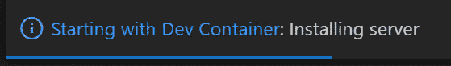
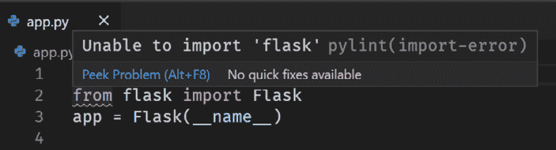
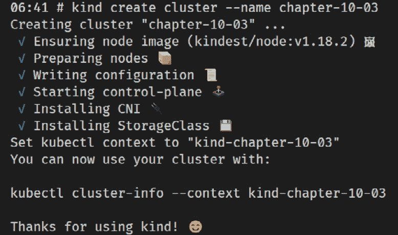
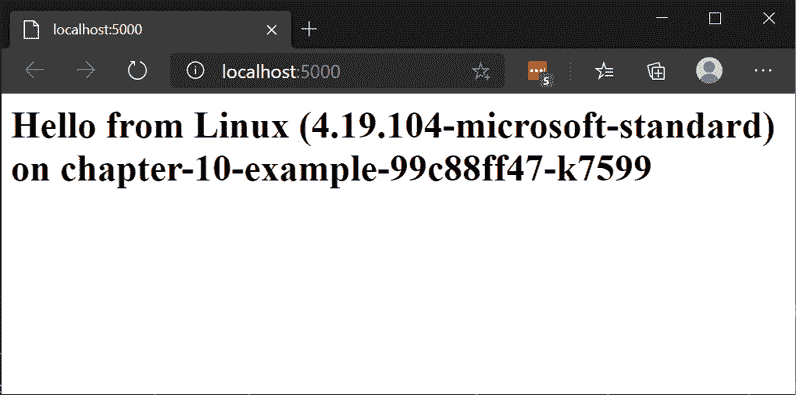

# 十、Visual Studio Code 和容器

在[*第 9 章*](09.html#_idTextAnchor111),*Visual Studio Code 和 WSL*中,我们看到 Visual Studio Code 编辑器允许与其他分离用户界面功能,与我们的代码,并运行它。 使用 wsdl，我们可以保持熟悉的基于 windows 的用户界面，同时在 Linux 中运行项目的所有关键部分。 除了允许代码交互在 WSL 中的服务器组件中运行外，Visual Studio code 还允许我们通过 SSH 连接到代码服务器或在容器中运行它。 在容器中运行的能力是由**Remote-Containers**扩展提供的，本章将重点讨论如何使用该功能。 我们将看到如何使用这些开发容器(或**开发容器**)来封装我们的项目依赖。 通过这样做，我们可以更容易地让人们参与到我们的项目中，并获得一种优雅的方法来隔离项目之间潜在的冲突工具集。

在本章中，我们将涵盖以下主要主题:

*   介绍 Visual Studio Code 远程容器
*   安装 Remote-Containers
*   创建开发容器
*   在开发容器中使用容器化的应用
*   在开发容器中使用 Kubernetes
*   使用开发容器的技巧

这一章,你将需要安装 Visual Studio Code——[*第 9 章*](09.html#_idTextAnchor111),*Visual Studio Code 和 WSL*,*介绍 Visual Studio Code*部分更多的细节。 我们将通过介绍 Visual Studio Code 的 Remote-Containers 扩展并安装它来开始这一章。

# 介绍 Visual Studio Code 远程容器

Visual Studio Code 的 Remote-Containers 扩展与**Remote-WSL**和**Remote-SSH**一起作为 Remote-Development 扩展包的一部分。 这些扩展的所有都允许您将用户界面方面从代码交互中分离出来，例如加载、运行和调试代码。 Remote-Containers,我们指示 Visual Studio Code 运行这些代码交互作用在一个容器,在【显示】我们定义 Dockerfile(见[*第七章【病人】*](07.html#_idTextAnchor082),*处理容器在 WSL*,【t16.1】引入 Dockerfiles 部分)。

当 Visual Studio Code 将我们的项目加载到开发容器中时，它会经历以下步骤:

1.  从 Dockerfile 构建容器映像
2.  使用生成的映像运行容器，将源代码挂载到容器中
3.  在容器中安装 VS 代码服务器，供用户界面连接

通过这些步骤，我们得到一个包含 Dockerfile 描述的依赖项的容器映像。 通过将代码挂载到容器中，就可以在容器中使用代码，但是只有一个代码副本。

在开发项目中，通常有一个需要安装的工具或先决条件列表，以便在项目文档中为使用项目准备环境。 如果你真的很幸运，这个列表甚至会是最新的! 通过使用*dev 容器*，我们可以将文档中的工具列表替换为 Dockerfile 中为我们执行这些步骤的一组步骤。 因为这些映像可以重新构建，所以安装工具的标准方式现在变成了 Dockerfile。 由于这是源代码控制的一部分，所需工具中的这些更改将与其他开发人员共享，这些开发人员可以简单地从 Dockerfile 重新构建他们的开发容器映像，以更新他们的工具集。

开发容器的另一个好处是，依赖项安装在容器中，因此是隔离的。 这允许我们使用相同工具的不同版本(例如 Python 或 Java)为不同的项目创建容器，而不会产生冲突。 这种隔离还允许我们在项目之间独立地更新工具版本。

让我们看看如何安装 Remote-Containers 扩展。

# 安装远程容器

要使用 Remote-Containers 扩展，您需要安装它，还需要安装 Docker 并在 WSL 中访问它。 请参见[*第七章*](07.html#_idTextAnchor082)，*在 WSL 中与容器一起工作*，*在 WSL*中安装和使用 Docker。 如果您已经安装了 Docker Desktop，请确保配置为使用**基于 WSL 2 的引擎**。 wsdl 2 引擎使用在 wsdl 2 中运行的 Docker 守护进程，因此您的代码文件(来自 wsdl 2)可以直接挂载在容器中，而无需通过 linux 到 windows 的文件共享。 这种直接挂载为您提供了更好的性能，确保正确地处理文件事件，并使用相同的文件缓存(更多详细信息请参阅本文:[https://www.docker.com/blog/docker-desktop-wsl-2-best-practices/)](https://www.docker.com/blog/docker-desktop-wsl-2-best-practices/))。

一旦您配置了 Docker，下一步就是安装 Remote-Containers 扩展。 你可以在 Visual Studio Code 的**EXTENSIONS**视图中搜索`Remote-Containers`，或者从[https://marketplace.visualstudio.com/items?itemName=ms-vscode-remote.remote-containers](https://marketplace.visualstudio.com/items?itemName=ms-vscode-remote.remote-containers)中搜索。

安装了扩展后，让我们看看如何创建一个开发容器。

# 创建 dev 容器

要将 dev 容器添加到项目中，我们需要创建一个带有两个文件的`.devcontainer`文件夹:

*   描述要构建和运行的容器映像
*   `devcontainer.json`添加额外配置

这种文件组合将为我们提供一个单容器配置。 Remote-Containers 还支持使用**multi-container 配置码头工人组成**[(见 https://code.visualstudio.com/docs/remote/create-dev-container _using-docker-compose](https://code.visualstudio.com/docs/remote/create-dev-container#_using-docker-compose)),但我们会关注本章 single-container 场景。

本书附带的代码包含一个示例项目，我们将使用它来探索开发容器。 确保从 Linux 发行版中的[https://github.com/PacktPublishing/Windows-Subsystem-for-Linux-2-WSL-2-Tips-Tricks-and-Techniques](https://github.com/PacktPublishing/Windows-Subsystem-for-Linux-2-WSL-2-Tips-Tricks-and-Techniques)克隆代码。 一旦代码被克隆，打开 Visual Studio code 中的`chapter-10/01-web-app`文件夹(还有一个`chapter-10/02-web-app-completed`文件夹，其中包含本节中的所有步骤作为参考)。 这个示例代码还没有开发容器定义，所以让我们看看如何添加它。

## 添加并打开一个开发容器定义

开发容器的第一个步骤是创建**开发容器定义**，而 Remote-Containers 扩展在这里提供了一些帮助。 在 Visual Studio Code 中打开示例项目，从命令面板中选择**Remote-Containers: Add Development Container Configuration Files…**，然后提示您选择一个配置:


图 10.1 -显示开发容器配置列表的屏幕截图

如这个屏幕截图中的所示，我们可以从预定义的开发容器配置开始。 对于示例项目，选择**Python 3**。 这将创建带有`devcontainer.json`和`Dockerfile`的`.devcontainer`文件夹，以用于使用 Python 3。 一旦这些文件被添加，你应该会看到以下提示:


图 10.2 -显示“在容器中重新开放”提示的屏幕截图

当 Visual Studio Code 检测到您打开了带有开发容器定义的文件夹时，将出现此提示。 单击**在容器**中重新打开开发容器中的文件夹。 如果您错过了提示符，您可以使用命令面板中的**Remote-Containers: open in Container**命令来实现相同的目的。

选择在容器中重新打开文件夹后，Visual Studio Code 将重新启动并开始构建容器映像以运行代码服务器。 你会看到一个通知:



图 10.3 -显示 start with Dev Container 通知的截图

这个屏幕截图显示了开发容器正在启动的通知。 如果单击通知，将被转到**TERMINAL**视图中的**Dev Containers**窗格。 显示构建和运行容器的命令和输出。 当您开始自定义开发容器定义时，此窗口对于调试场景非常有用，比如您的容器映像无法构建时。 现在我们已经在开发容器中打开了项目，让我们开始探索它。

## 在开发容器中工作

一旦 dev 容器已建成并开始,您将看到示例代码的内容在**EXPLORER 视图和窗口将看起来非常类似于 Visual Studio Code 走查在前面的章节中,用一个简单的 Python web 应用使用**瓶**。 在窗口左下角的，您应该看到**Dev Container: Python 3**，这表明窗口正在使用*Dev 容器*。 您可以通过在`devcontainer.json`中编辑`name`属性来更改名称(**Python 3**):**

```sh
{
    "name": "chapter-10-01-web-app",
...
```

在这段来自`devcontainer.json`的代码片段中，开发容器名称已更改为`chapter-10-01-web-app`。 此更改将在下次构建和加载开发容器时生效。 设置有意义的名称是特别有帮助的，如果您有时在任何时候加载多个开发容器，它显示在窗口标题。

接下来，让我们打开`app.py`文件，其中包含示例的应用代码:



图 10.4 -在 app.py 中显示导入错误的截图

在这个屏幕截图中，您可以看到在导入 Flask 包的行下面有一个红色的下划线，它显示在 Python 扩展加载并处理该文件之后。 此错误表明 Python 无法找到 Flask 包。 希望这是有意义的——所有的工具都运行在安装了 Python 的容器中，除此之外什么都没有。 让我们快速解决这个问题。 使用*Ctrl*+*'*(反勾号)或**视图打开集成终端:通过命令面板切换集成终端**。 这在 Visual Studio Code 中提供了一个终端视图，终端运行在开发容器中。 从终端，运行`pip3 install -r requirements.txt`来安装`requirements.txt`中列出的要求(包括 Flask)。 安装了要求后，Python 语言服务器最终将更新以删除红色下划线警告。

在本章的后面，我们将看看如何在构建容器时自动安装需求，以提供更平滑的体验; 但是现在一切就绪，让我们运行代码。

## 运行代码

示例代码包含一个`.vscode/launch.json`文件，描述如何启动我们的代码。 这个文件允许我们配置一些东西，比如传递给进程的命令行参数和应该设置的环境变量。 介绍`launch.json`和从头开始创建一个,看到[*第 9 章*](09.html#_idTextAnchor111),*Visual Studio Code 和 WSL【显示】,**调试我们的程序部分。*

使用`launch.json`，我们可以简单地按*F5*在调试器下启动应用。 如果您想查看交互式调试器的运行情况，可以使用*F9*设置一个断点(`get_os_info`函数中的`return`语句是一个很好的选择)。

启动后，您将看到在**TERMINAL**视图中执行的调试器命令和相应的输出:

```sh
* Serving Flask app "app.py"
 * Environment: development
 * Debug mode: off
 * Running on http://127.0.0.1:5000/ (Press CTRL+C to quit)
```

在这个输出中，您可以看到应用启动并显示它正在监听的地址和端口(`http://127.0.0.1:5000`)。 当您将鼠标悬停在该地址上时，您将看到一个弹出窗口，显示您可以使用*Ctrl*+单击来打开该链接。 这样做将在该地址启动默认的 Windows 浏览器，如果设置了断点，您将发现代码已经在该点暂停，以便您检查变量等等。 一旦你完成了调试器的探索，按下*F5*继续执行，你将在浏览器中看到呈现的响应:


图 10.5 -在 Windows 浏览器中显示 Python 应用的网页截图

这截图显示了浏览器与 web 页面从我们的 Python 应用加载。注意到主机名(截图`831c04e3574c`,但您将会看到一个不同的 ID 作为它改变为每个容器),即短容器 ID 设置为主机名在容器的实例应用正在运行。 我们能够从 Windows 加载网页，因为 Remote-Containers 扩展自动为我们设置端口转发。 这个端口转发在 Windows 上监听端口`5000`，并将流量转发到容器中的`5000`，我们的 Python 应用正在监听和响应。

现在，我们有了一个在 Docker 中以 WSL 运行的容器，所有的开发人员工具(包括 Python 和 Visual Studio Code 服务器)都在运行，我们能够以我们所期望的丰富的、交互式的方式来处理代码。 我们可以很容易地在调试器中启动代码，逐步检查代码并检查变量，然后与我们的 Windows web 应用交互。 所有这些都像代码在主机上运行一样顺利，但是我们拥有开发容器带给我们的开发环境的隔离和自动化的所有优势。

接下来，我们将探索在开发容器中将应用打包和作为容器使用时如何定制开发容器定义。

# 在开发容器中使用容器化的应用

到目前为止，我们已经看到了如何使用开发容器来开发应用，但是如果我们想开发一个应用，它本身将被打包并在容器中运行，可能是在 Kubernetes 中呢? 在本节中，我们将重点关注这个场景，看看如何从开发容器内部为我们的应用构建和运行容器映像。

我们将再次使用本书附带的代码作为本节的起点。 确保您从 Linux 发行版中的[https://github.com/PacktPublishing/Windows-Subsystem-for-Linux-2-WSL-2-Tips-Tricks-and-Techniques](https://github.com/PacktPublishing/Windows-Subsystem-for-Linux-2-WSL-2-Tips-Tricks-and-Techniques)克隆代码。 一旦代码被克隆，打开 Visual Studio code 中的`chapter-10/03-web-app-kind`文件夹(还有一个`chapter-10/04-web-app-kind-completed`文件夹，其中包含本节中的所有步骤作为参考)。 `03-web-app-kind`文件夹中包含一个 web 应用，它与我们刚刚使用的那个非常相似，但是添加了一些额外的文件，以帮助我们在本章后面的部分将该应用集成到 Kubernetes 中。

使我们在码头工人与应用,我们需要经过几个步骤类似于我们在[*第七章*](07.html#_idTextAnchor082),*处理容器在 WSL*,在【显示】构建和运行一个 web 应用在码头工人部分,除了这一次,我们将在我们的开发工作容器:

1.  在开发容器中设置 Docker。
2.  构建应用 Docker 映像。
3.  运行应用容器。

让我们从如何设置开发容器开始，以允许我们构建应用容器映像。

## 在 dev 容器中设置 Docker

启用 Docker 映像构建的第一个步骤是安装`docker`**命令行界面**(**CLI**)。 为了做到这一点，我们将从 Docker 文档([https://docs.docker.com/engine/install/ubuntu/#install-using-the-repository](https://docs.docker.com/engine/install/ubuntu/#install-using-the-repository))中获取安装步骤，并将其应用到我们的 Dockerfile 中。 在 Visual Studio Code 中打开`.devcontainer/Dockerfile`并添加以下内容:

```sh
RUN apt-get update \
     && export 
DEBIAN_FRONTEND=noninteractive \"
    # Install docker
    && apt-get install -y apt-transport-https ca-certificates curl gnupg-agent software-properties-common lsb-release \
    && curl -fsSL https://download.docker.com/linux/$(lsb_release -is | tr '[:upper:]' '[:lower:]')/gpg | apt-key add - 2>/dev/null \
    && add-apt-repository "deb [arch=amd64] https://download.docker.com/linux/$(lsb_release -is | tr '[:upper:]' '[:lower:]') $(lsb_release -cs) stable" \
    && apt-get update \
    && apt-get install -y docker-ce-cli \
    # Install docker (END)
    # Install icu-devtools
    && apt-get install -y icu-devtools \ 
    # Clean up
    && apt-get autoremove -y \
    && apt-get clean -y \
    && rm -rf /var/lib/apt/lists/*
```

在这个代码片段中，请注意`# Install docker`和`# Install docker (END)`之间的行。 添加这些行是为了遵循 Docker 文档中添加`apt`存储库的步骤，然后将该存储库使用到`apt-get install``docker-ce-cli`包。 此时，重新构建并打开开发容器将为您提供一个带有`docker`CLI 的环境，但没有用于与之通信的守护进程。

我们用在主机上设置 Docker, Visual StudioCode 使用 Docker 守护进程来构建和运行我们用于开发的开发容器。 为了在容器中构建并运行 Docker 映像，您可以考虑在开发容器中安装 Docker。 这是可能的，但可能会变得相当复杂，并增加性能问题。 相反，我们将从 dev 容器中的主机重用 Docker 守护进程。 在 Linux 上，与 Docker 的默认通信是通过`/var/run/docker.sock`套接字。 通过`docker`命令行运行容器时，可以通过`--mounts`交换机([https://docs.docker.com/storage/bind-mounts/](https://docs.docker.com/storage/bind-mounts/))挂载插座。 对于 dev 容器，我们可以在`.devcontainer/devcontainer.json`中使用`mounts`属性来指定:

```sh
"mounts": [
    // mount the host docker socket (for Kind and docker builds)
    "source=/var/run/docker.sock,target=/var/run/docker.sock,type=bind"
],
```

这个片段显示了`devcontainer.json`中的`mounts`属性，它指定了 Visual Studio Code 在运行我们的开发容器时将使用的挂载。 这个属性是一个挂载字符串数组，在这里我们指定了需要一个`bind`挂载(即来自主机的挂载)，它将主机上的`/var/run/docker.sock`挂载到 dev 容器内相同的值。 这样做的效果是使主机上的 Docker 守护进程的套接字在 dev 容器中可用。

此时，在命令面板中使用**Remote-Containers: open in Container**命令将为您提供一个带有`docker`CLI 的开发容器，以便您在终端中使用。 你运行的任何`docker`命令都将在 Docker Desktop 守护进程上执行; 所以，例如，运行`docker ps`来列出容器将在其输出中包含开发容器:

```sh
# docker ps
CONTAINER ID        IMAGE                                                            COMMAND                  CREATED             STATUS              PORTS               NAMES
6471387cf184        vsc-03-web-app-kind-44349e1930d9193efc2813 97a394662f             "/bin/sh -c 'echo Co…"   54 seconds ago       Up 53 seconds  
```

在 dev 容器的终端中执行`docker ps`的输出包含了 dev 容器本身，确认 Docker 命令正在连接到主机 Docker 守护进程。

提示

如果在更新 Dockerfile 和`devcontainer.json`之前(或者在任何修改这些文件的时候)已经打开了 dev 容器，那么可以运行**Remote-Containers: Rebuild and open in container**命令。 这个命令将重新运行开发容器的构建过程，然后重新打开它，将您的更改应用到开发容器。

现在我们已经安装并配置了 Docker，接下来让我们为应用构建容器映像。

## 构建应用 Docker 映像

要为我们的应用构建 Docker 映像，我们可以运行`docker build`命令。 由于 Docker CLI 被配置为与主机 Docker 守护进程对话，所以我们在 dev 容器中构建的任何映像实际上都是在主机上构建的。 这消除了一些您可能期望从开发容器中获得的隔离，但我们可以通过确保使用的映像名称是唯一的来解决这个问题，以避免与其他项目发生名称冲突。

示例代码在根文件夹中已经有一个 Dockerfile，我们将使用它来构建应用的 Docker 映像(不要与用于构建开发容器的`.devcontainer/Dockerfile`混淆)。 Dockerfile 构建在`python`基础映像上，然后复制我们的源代码并配置启动命令。 关于 Dockerfile 的更多细节，请参考[*第七章*](07.html#_idTextAnchor082)，*在 WSL 中使用容器*，*介绍 Dockerfiles*章节。

要构建应用映像，像我们在本章前面所做的那样，打开集成终端，并运行以下命令来构建容器映像:

```sh
docker build -t simple-python-app-2:v1 -f Dockerfile .
```

该命令将提取 Python 映像(如果不存在)，并在输出`Successfully tagged simple-python-app-2:v1`之前运行 Dockerfile 中的每个步骤。

现在我们已经构建了应用映像，让我们运行它。

## 运行应用容器

要运行映像，我们将使用`docker run`命令。 在 Visual Studio Code 的集成终端中，运行以下命令:

```sh
# docker run -d --network=container:$HOSTNAME --name chapter-10-example simple-python-app-2:v1 
ffb7a38fc8e9f86a8dd50ed197ac1a202ea7347773921de6a34b93cec 54a1d95
```

在这个输出中，您可以看到我们正在使用前面构建的`simple-python-app-2:v1`映像运行一个名为`chapter-10-example`的容器。 我们指定了——`network=container:$HOSTNAME`，它将新创建的容器与开发容器放在同一个 Docker 网络上。 注意,我们使用`$HOSTNAME`指定的 ID dev 容器自容器 ID 用作机器名称在运行容器(正如我们在[*看到第七章【显示】*](07.html#_idTextAnchor082)*,以 WSL 处理容器,在构建和运行*【病人】一个 web 应用在码头工人部分)。 有关`--network`开关的更多信息，请参见[https://docs.docker.com/engine/reference/run/#network-settings](https://docs.docker.com/engine/reference/run/#network-settings)。 我们可以确认我们可以通过在集成终端运行`curl`来访问运行容器中的 web 应用:

```sh
# curl localhost:5000
<html><body><h1>Hello from Linux (4.19.104-microsoft-standard) on ffb7a38fc8e9</h1></body></html>
```

在这个输出中，您可以看到 web 应用响应`curl`命令的 HTML 响应。 这确认了我们可以从开发容器内部访问应用。

如果你试图从 Windows 的浏览器访问 web 应用，它将无法连接。 这是因为来自 web 应用的容器端口已经映射到 Docker 网络中作为开发容器。 幸运的是，Remote-Containers 提供了一个**转发端口**命令，允许我们将端口从 dev 容器内部转发到主机。 通过执行此命令并指定端口`5000`，可以使 Windows 中的 web 浏览器也可以访问容器中运行的 web 应用。

对于您想要定期在主机上以这种方式访问的 dev 容器端口，可以方便地更新`devcontainer.json`:

```sh
"forwardPorts": [
    5000
]
```

在这个片段中，您可以看到`forwardPorts`属性。 这是一个端口数组，您可以将其配置为在运行开发容器时自动转发，以节省每次转发它们的手动步骤。

**注**

作为使用`--network`交换机运行 web 应用容器的替代方案，我们可以将开发容器配置为使用主机网络(使用`--network=host`，如下一节所示)。 通过这种方法，dev 容器重用了与主机相同的网络堆栈，所以我们可以使用以下命令运行我们的 web 应用容器:

`docker run -d -p 5000:5000 --name chapter-10-example simple-python-app-2:v1`

在这个命令中,我们使用了`-p 5000:5000`暴露 web 应用端口 5000 的主机作为我们看到[*第七章*【4】【5】,以 WSL 处理容器,在码头工人的构建和运行一个 web 应用部分。](07.html#_idTextAnchor082)

现在，我们已经设置了开发容器来连接主机上的 Docker，并使用我们安装在开发容器中的 Docker CLI 来构建和运行映像。 现在我们已经测试了为我们的 web 应用构建一个容器映像，并检查了它的运行是否正确，让我们看看在 Kubernetes 中运行它，同时从我们的开发容器中工作。

# 在开发容器中使用 Kubernetes

现在，已经为我们的 web 应用创建了一个容器映像，我们可以从开发容器中构建它，接下来我们将看看在 Kubernetes 中运行应用所需的步骤。 这一节相当高级(特别是如果您不熟悉 Kubernetes 的话)，所以您可以直接跳到使用开发容器的*技巧*一节，稍后再回到这一节。

让我们首先看看如何设置使用 Kubernetes 的开发容器。

## 带开发容器的 Kubernetes 选项

在 WSL 中有许多与 Kubernetes 一起工作的选项。 常见的选项在[*第 7 章*](07.html#_idTextAnchor082)，*在 WSL 中使用容器*，*在 WSL 中设置 Kubernetes*节中概述。 在那一章中，我们在 Docker Desktop 中使用了 Kubernetes 集成，这是一种设置 Kubernetes 的低阻力方式。 这种方法也可以用在开发容器上，只需几个步骤(假设你已经启用了 Docker 桌面集成):

1.  挂载一个卷，将`~/.kube`文件夹从 WSL 映射到开发容器作为`/root/.kube`，以共享连接 Kubernetes API 的配置。
2.  安装`kubectl`CLI，在开发容器 Dockerfile 中使用 Kubernetes 作为一个步骤。

第一步使用`devcontainer.json`中的挂载，正如我们在前一节中看到的(引用用户主文件夹的标准实践是使用环境变量——例如`${env:HOME}${env:USERPROFILE}/.kube`)。 稍后我们将介绍安装`kubectl`的第二步。 在这一章中，我们将探索 Kubernetes 的另一种方法，但是在这本书的代码中有一个`chapter10/05-web-app-desktop-k8s`文件夹，其中包含了完成这两个步骤的开发容器。

虽然 Docker Desktop Kubernetes 集成很方便，但它对主机配置增加了额外的要求。 默认情况下，开发容器只需要安装带有 Remote-Containers 的 Visual Studio Code 并运行 Docker 守护进程，其余的项目需求由开发容器的内容来满足。 Docker Desktop 中对 Kubernetes 集成的要求会略微降低开发容器的可移植性。 另一个需要考虑的问题是，使用 Docker Desktop 集成意味着您使用的是在您的机器上共享的*Kubernetes 集群*。 当您的项目涉及创建 Kubernetes 集成(例如操作符或其他可能应用策略的组件)时，这种隔离的损失可能特别相关。 `kind`项目([https://kind.sigs.k8s.io/)提供了另一种方法,让我们轻松地创建和管理 Kubernetes 集群在 dev 容器使用【显示】码头工人(事实上,*是【病人】*K*ubernetes*【t16.1】*D*内涵)。 如果你计划在**持续集成**(**CI**)构建中重用你的开发容器，这种方法也能很好地工作。 让我们看看在开发容器中设置`kind`。**](https://kind.sigs.k8s.io/)

 *## 在开发容器中设置类型

在本节中，我们将介绍在开发容器中安装`kind`(和`kubectl`)的步骤。 这将允许我们在开发容器的中使用`kind`CLI 创建 Kubernetes 集群，然后使用`kubectl`访问它们。 为此，我们需要做到以下几点:

*   在 dev 容器 Dockerfile 中添加安装`kind`和`kubectl`的步骤。
*   更新`devcontainer.json`以启用连接`kind`集群。

要安装`kind`，请打开`.devcontainer/Dockerfile`并添加以下`RUN`命令(在以`apt-get update`开头的`RUN`命令之后):

```sh
# Install Kind
RUN curl -Lo ./kind https://github.com/kubernetes-sigs/kind/releases/download/v0.8.1/kind-linux-amd64 && \
    chmod +x ./kind && \
    mv ./kind /usr/local/bin/kind
```

此代码片段中的`RUN`命令遵循安装`kind`([https://kind.sigs.k8s.io/docs/user/quick-start/#installation](https://kind.sigs.k8s.io/docs/user/quick-start/#installation))的文档，并使用`curl`下载`kind`的发布二进制文件。

将下面的`RUN`命令放在前面的命令之后，安装`kubectl`:

```sh
# Install kubectl
RUN curl -sSL -o /usr/local/bin/kubectl https://storage.googleapis.com/kubernetes-release/release/v1.19.0/bin/linux/amd64/kubectl \
    && chmod +x /usr/local/bin/kubectl
```

此`RUN`步骤根据文档([https://kubernetes.io/docs/tasks/tools/install-kubectl/](https://kubernetes.io/docs/tasks/tools/install-kubectl/))安装`kubectl`。 第一个命令使用`curl`下载发布二进制文件(本例中为`1.19.0`版本)。 第二个命令使下载的二进制文件可执行。

现在我们已经为`kind`和`kubectl`配置了安装，我们需要对`.devcontainer/devcontainer.json`进行一些更改。 第一个是在 dev 容器中为`.kube`文件夹添加一个卷:

```sh
"mounts": [
    // mount a volume for kube config
    "source=04-web-app-kind-completed-kube,target=/root/.kube,type=volume",
    // mount the host docker socket (for Kind and docker builds)
    "source=/var/run/docker.sock,target=/var/run/docker.sock,type=bind"
],
```

这段代码显示了`mounts`属性，我们以前使用该属性将主机的 Docker 套接字与一个新挂载绑定，该挂载配置为创建一个以 dev 容器中的`/root/.kube`文件夹为目标的卷。 当我们运行`kind`来创建 Kubernetes 集群时，它将在这个文件夹中保存与集群通信的配置。 通过添加卷，我们确保该文件夹的内容在开发容器的实例(和重建)之间持久存在，以便我们仍然可以连接到 Kubernetes 集群。

正如前面提到的，**类**代表 Docker 中的**Kubernetes，它在 Docker 中作为容器运行**节点**。 `kind`生成的配置将 Kubernetes API 端点列出为`127.0.0.1`(本地 IP 地址)。 这是指主机，但是 dev 容器默认在一个隔离的 Docker 网络上。 为了通过`kind`生成的配置，使开发容器能够访问 Kubernetes API，我们可以通过更新`.devcontainer/devcontainer.json`将开发容器放入主机网络模式:**

```sh
"runArgs": [
    // use host networking (to allow connecting to Kind clusters)
    "--network=host"
],
```

在此代码片段中，您可以看到`runArgs`属性。 这允许我们配置其他参数，以便 remote - container 在启动开发容器时传递给`docker run`命令。 这里，我们设置了`--network=host`选项，该选项将容器运行在与主机相同的网络空间中(请参阅[https://docs.docker.com/engine/reference/run/#network-settings](https://docs.docker.com/engine/reference/run/#network-settings)以了解更多细节)。

有了这些更改，我们可以重新构建并重新打开开发容器，我们就可以创建一个 Kubernetes 集群并在其中运行我们的应用了!

## 在 Kubernetes 集群中运行我们的应用

我们现在已经准备好了的所有部分，可以在我们的开发容器中创建一个 Kubernetes 集群。 要创建集群，我们将在集成终端上使用`kind`命令行:



图 10.6 -显示创建类型集群的屏幕截图

在这里，您可以看到运行`kind create cluster --name chapter-10-03`的输出。 `kind`CLI 负责为尚未出现的节点提取容器映像，然后在执行设置集群的步骤时更新输出。 默认情况下，`kind`创建一个单节点集群，但是有一系列配置选项，其中包括设置多节点集群(参见[https://kind.sigs.k8s.io/docs/user/configuration/](https://kind.sigs.k8s.io/docs/user/configuration/))。

现在，我们可以使用这个集群来运行我们的应用(假设您已经在前一节中构建了容器映像; 如果不是，执行`docker build -t simple-python-app-2:v1 -f Dockerfile.`)。

为了使我们的应用的容器映像在`kind`集群中可用，我们需要运行`kind load`(参见[https://kind.sigs.k8s.io/docs/user/quick-start/#loading-an-image-into-your-cluster](https://kind.sigs.k8s.io/docs/user/quick-start/#loading-an-image-into-your-cluster)):

```sh
# kind load docker-image --name chapter-10-03 simple-python-app-2:v1
Image: "simple-python-app-2:v1" with ID "sha256:7c085e8bde177aa0abd02c36da2cdc68238e672f49f0c9b888581b 9602e6e093" not yet present on node "chapter-10-03-control-plane", loading...
```

这里，我们使用`kind load`命令将`simple-python-app-2:v1`映像加载到我们创建的`chapter-10-03`集群中。 这会将映像加载到集群中的所有节点上，以便我们在 Kubernetes 中创建部署时可以使用它。

样例应用中的`manifests`文件夹包含在 Kubernetes 中配置应用的定义。 参考[*第七章*](07.html#_idTextAnchor082),*处理容器在 WSL*,【显示】运行一个 web 应用在 Kubernetes 部分,介绍,解释一个非常类似的应用的部署文件。 我们可以使用`kubectl`将应用部署到 Kubernetes:

```sh
# kubectl apply -f manifests/
deployment.apps/chapter-10-example created
service/chapter-10-example created
```

在这里，我们使用`kubectl apply`和`-f`开关将加载清单的路径传递给它。 在本例中，我们指定了`manifests`文件夹，以便`kubectl`应用该文件夹中的所有文件。

我们的 web 应用现在在`kind`集群的一个节点上运行，而我们刚刚应用的配置在前面创建了一个 Kubernetes 服务来暴露`5000`端口。 该服务仅在`kind`集群中可用，因此我们需要运行`kubectl port-forward`将本地端口转发给该服务:

```sh
# kubectl port-forward service/chapter-10-example 5000
Forwarding from 127.0.0.1:5000 -> 5000
Forwarding from [::1]:5000 -> 5000
```

在输出中，您可以看到用于指定`service/chapter-10-03-example`服务为目标的`kubectl port-forward`命令，以及指定`5000`为我们想要转发的端口。 这将设置从 dev 容器中的本地端口`5000`到服务上的端口`5000`的端口转发，用于在`kind`中运行的应用。

如果您创建了一个新的集成终端(通过单击集成终端右上角的加号)，您可以使用它运行一个`curl`命令来验证服务是否正在运行:

```sh
# curl localhost:5000
<html><body><h1>Hello from Linux (4.19.104-microsoft-standard) on chapter-10-example-99c88ff47-k7599</h1></body></html>
```

该输出显示了从开发容器内部运行`curl localhost:5000`，并使用`kubectl`端口转发访问部署在`kind`集群中的 web 应用。

当我们在本章前面使用 Docker 的应用时，我们在`devcontainer.json`中配置了`forwardPorts`属性来转发`5000`端口。 这意味着 Visual Studio Code 已经设置将 Windows 上的`5000`端口转发到我们的开发容器中的`5000`端口。 在 dev 容器中，发送到端口`5000`的任何流量都将由我们刚才运行的`kubectl`端口转发命令处理，并将被转发到 Kubernetes 服务上的端口`5000`。 这意味着我们可以在 Windows 的浏览器中打开`http://localhost:5000`:



图 10.7 - Windows 浏览器显示 Kubernetes 应用的截图

在这张截图中，我们可以看到 Windows 浏览器通过`http://localhost:5000`访问 Kubernetes 中的应用。 这是因为 Visual Studio Code 将 Windows 端口`5000`转发到开发容器内的`5000`端口，该端口由`kubectl port-forward`处理，并转发到我们为应用部署的 Kubernetes 服务。

在本节中,我们使用 Visual Studio Code,**Remote-Containers*,*和*码头工人创造一个集装箱使用 web 应用的开发环境。我们看到了如何使用这个构建和运行容器图片为我们的 web 应用, 然后创建一个 Kubernetes 集群，并在集群中部署和测试我们的应用，包括如何从 Windows 主机上的浏览器访问在 Kubernetes 中运行的 web 应用。 我们在没有向主机添加任何进一步需求的情况下实现了所有这些功能，这使它成为一个可移植的解决方案，对于任何使用 Visual Studio Code 和 Docker 的人来说，都可以快速地在自己的机器上启动和运行。*

在本章的最后一节，我们将讨论一些使用开发容器的生产力技巧。

# 使用开发容器的技巧

在这个部分中，我们将看看一些技巧，这些技巧可以用来调整使用开发容器的体验。 让我们先来看看在构建完开发容器之后，如何在其内部自动化步骤。

## postCreateCommand 和自动 pip 安装

早期的例子在这一章本章早些时候例子,我们不得不运行`pip install`建筑 dev 容器后,这是需要每次重建 dev 容器更改后其配置。 为了避免这种情况，可能会倾向于在开发容器 Dockerfile 中添加一个`RUN`步骤来执行`pip install`，但我不喜欢将应用包放入开发容器映像中。 应用包依赖关系往往会随着时间的推移而演变，将它们构建到映像中(并重新构建映像以便安装)感觉有点重量级。 随着时间的推移，在使用开发容器时，我的经验是在开发容器映像中安装工具，并在运行后在开发容器中安装应用包。 幸运的是，开发容器提供了一个可以在`devcontainer.json`中配置的`postCreateCommand`选项:

```sh
// Use 'postCreateCommand' to run commands after the container is created.
"postCreateCommand": "pip3 install -r requirements.txt",
```

此代码片段显示配置为运行`pip install`步骤的`postCreateCommand`。 Visual Studio Code 在重建映像后启动开发容器时将自动运行`postCreateCommand`。

如果您想要运行多个命令，您可以将它们组合为`command1 && command2`，或者将它们放在一个脚本文件中，然后从`postCreateCommand`运行脚本。

在我们研究自动化开发容器任务的设置时，让我们再来看看端口转发。

## 端口转发

本章早些时候,我们使用的端口转发 Visual Studio Code 将选择 Windows 主机的流量转发到 dev 容器——例如,允许 Windows 浏览器连接到容器中运行的 web 应用开发。 建立端口转发的一种方法是使用**转发端口**命令，该命令将提示您转发端口。 每次启动 dev 容器时，都必须重新配置此端口转发。 另一种方法是将其加入`devcontainer.json`:

```sh
// Use 'forwardPorts' to make a list of ports inside the container available locally.
"forwardPorts": [
    5000,
    5001
]
```

在这个代码片段中，我们在`forwardPorts`属性中指定了端口`5000`和`5001`。 当 Visual Studio Code 启动开发容器时，它会自动为我们转发这些端口，帮助我们顺利完成工作流程。

要查看哪些端口正在被转发，请切换到**REMOTE EXPLORER**视图(例如，通过运行**REMOTE EXPLORER: Focus on forwarding ports view**命令):


图 10.8 -显示转发端口视图的截图

在这个屏幕截图中，您可以看到当前配置的转发端口列表。 将鼠标悬停在一个端口上，你会看到屏幕截图中的球形和交叉图标。 点击地球仪将在默认的 Windows 浏览器中打开该端口，点击十字将停止共享该端口。

**端口转发**是一个非常有用的工具，它可以将开发容器集成到 web 应用和 api 的典型流程中，并通过`forwardPorts`配置使其自动化，从而提高生产率。

接下来，我们将重新讨论卷安装的主题，并查看更多的示例。

## 安装卷和 Bash 历史

在本章中，我们已经看到了几个配置挂载的例子，它们分为两类:

*   将文件夹或文件从主机装入容器中
*   将卷挂载到容器中以在容器实例之间持久化数据

第一种是将主机卷挂载到容器中，这是我们用来将主机 Docker 套接字(`/var/run/docker.sock`)挂载到 dev 容器中的方法。 这也可以用于从主机挂载文件夹(如`~/.azure`)，将 Azure CLI 身份验证数据带到开发容器中，从而避免在开发容器中再次登录。

第二类 mount 创建一个 Docker 卷，该卷在每次开发容器运行时都被挂载。 这在开发容器中提供了一个文件夹，其内容在容器重建中被保留。 这可能很有用，例如，对于包缓存文件夹，如果您有希望避免重复下载的大文件。 另一个非常有用的例子是在开发容器中保存 Bash 历史记录。 为此，我们可以在 Dockerfile 中配置的`bash history`位置:

```sh
# Set up bash history
RUN echo "export PROMPT_COMMAND='history -a' && export HISTFILE=/commandhistory/.bash_history" >> /root/.bashrc
```

此代码段向`.bashrc`文件(Bash 启动时运行该文件)添加配置，以将`.bash_history`文件的位置配置为`/commandhistory`文件夹。 单独来说，这并没有多大效果，但是如果您将其与将`/commandhistory`文件夹作为挂载卷结合使用，结果是跨开发容器的实例保存 Bash 历史记录。 事实上，这种配置还有一个额外的好处。 如果没有开发容器，所有项目在主机上共享相同的 Bash 历史，因此，如果您几天没有使用某个项目，可能意味着与该项目相关的命令已经从您的历史中删除了。 对于开发容器的这种配置，Bash 历史记录是特定于容器的，因此加载开发容器将返回 Bash 历史记录，而不管您同时在主机上运行了什么命令(确保为卷添加了特定于项目的名称)。

下面是一个说明所讨论示例的配置:

```sh
"mounts": [
    // mount the host docker socket
    "source=/var/run/docker.sock,target=/var/run/docker.sock,type=bind"
    // mount the .azure folder
    "source=${env:HOME}${env:USERPROFILE}/.azure,target=//root/.azure,type=bind",
// mount a volume for bash history
    "source=myproject-bashhistory,target=/commandhistory,type=volume",
],
```

这段代码展示了我们在本节中讨论的各种挂载:

*   挂载主机`/var/run/docker.sock`，将主机 Docker 套接字暴露在 dev 容器中。
*   从主机挂载`.azure`文件夹，将缓存的 Azure CLI 身份验证带到 dev 容器中。 请注意用于在源文件中定位用户文件夹的环境变量替换。
*   挂载一个卷以跨开发容器实例保存 Bash 历史记录。

**卷挂载**在使用开发容器时是一个非常有用的工具，通过允许我们跨主机文件夹重用 Azure CLI 身份验证，可以显著提高生产率。 它还可以提供跨开发容器实例的持久文件存储—例如，保存 Bash 历史记录或启用包缓存。

我们要研究的最后一个技巧是确保构建开发容器映像的可重复性。

## 使用固定版本的工具

在配置开发容器时，很容易(而且很容易)使用安装最新版本工具的命令。 开始 dev 容器定义运行时使用**Remote-Containers:添加开发容器配置文件…**命令经常使用的命令安装最新版本的工具,和大量的安装文档工具指导你的命令做同样的事情。

如果开发容器 Dockerfile 中的命令安装了最新版本的工具，那么团队中不同的人可能在他们的开发容器中拥有不同版本的工具，这取决于他们构建开发容器的时间以及当时工具的最新版本。 此外，您可以添加一个新工具并重新构建开发容器，并选择其他工具的新版本。 一般来说，工具在版本之间保持了合理的兼容性，但是偶尔，它们的行为会在版本之间发生变化。 这可能会导致一些奇怪的情况，即开发容器工具似乎只适用于一个开发人员，而不适用于另一个开发人员，或者这些工具在您重新构建开发容器(例如，添加一个新工具)之前运行良好，但随后却无意中使用了其他工具的新版本。 这可能会破坏您的工作流，而且我通常更喜欢将工具固定到特定的版本(例如本章中的`kind`和`kubectl`)，然后在方便的时间或需要时显式地更新它们的版本。

## 总是安装扩展名和 dotfile

当设置一个开发容器时，您可以在创建开发容器时指定扩展来安装。 为此，您可以将添加以下内容到`devcontainer.json`:

```sh
"extensions": [
    "redhat.vscode-yaml",
    "ms-vsliveshare.vsliveshare"
],
```

在这里，您可以看到 JSON 中的`extensions`属性，它指定了扩展 id 数组。 要找到一个扩展的 ID，在 Visual Studio Code 的**EXTENSIONS**视图中搜索该扩展并打开它。 您将看到以下详细信息:


图 10.9 -在 Visual Studio Code 中显示扩展信息的截图

在这个屏幕截图中，您可以看到突出显示的扩展 ID(`ms-vsliveshare.vsliveshare`)的扩展信息。 通过在这里添加扩展，您可以确保使用开发容器的任何人都安装了相关的扩展。

Remote-Containers 扩展还具有一个名为**Always Installed Extensions**(或**Default Extensions**)的特性。 这个特性允许您配置一个始终希望安装在开发容器中的扩展列表。 要启用此功能，通过选择**首选项打开设置 JSON:从命令面板中打开用户设置(JSON)**并添加以下内容:

```sh
"remote.containers.defaultExtensions": [
    "mhutchie.git-graph",
    "trentrand.git-rebase-shortcuts"
],
```

在设置文件的这个片段中，您可以看到`remote.containers.defaultExtensions`属性。 这是一个扩展 id 数组，就像`devcontainer.json`中的`extensions`属性一样，但是这里列出的扩展总是安装在您的机器上构建的开发容器中。

Remote-Containers 扩展支持的一个相关特性是**dotfiles**。 如果您不熟悉 dotfiles，它们提供了一种配置系统的方法(名称来自 Linux 中使用的配置文件，例如`.bash_rc`和`.gitconfig`)。 要找到更多关于 dotfiles 的信息，[https://dotfiles.github.io/](https://dotfiles.github.io/)是一个很好的起点。

Remote-Containers 中的 dotfile 支持允许您为包含您的 dotfile 的 Git 存储库指定 URL，它们应该在 dev 容器中被克隆到的位置，以及克隆存储库后要运行的命令。 这些可以在设置 JSON 中配置:

```sh
"remote.containers.dotfiles.repository": "stuartleeks/dotfiles",
"remote.containers.dotfiles.targetPath": "~/dotfiles",
"remote.containers.dotfiles.installCommand": "~/dotfiles/install.sh",
```

在这里，我们可以看到与我们刚才描述的设置相对应的三个 JSON 属性。 注意，`remote.containers.dotfiles.repository`值可以是一个完整的 URL，例如[https://github.com/stuartleeks/dotfiles.git](https://github.com/stuartleeks/dotfiles.git)或简单的`stuartleeks/dotfiles`。

我喜欢使用这个 dotfiles 特性来设置 Bash 别名。 我早期使用计算机的大部分时间都花在 MS-DOS 上，而且我仍然发现，我键入`cls`和`md`等命令比键入`clear`和`mkdir`等命令更容易。 在这个配置中使用 dotfile 有助于提高我在开发容器之间的工作效率，但是这个配置并不是其他开发容器用户可能需要或想要的。

有了 dotfiles 和**Always Installed Extensions**特性，现在需要做一个决定:配置和扩展应该在 dev 容器定义中设置，还是使用 dotfiles 和**Always Installed Extensions**? 要回答这个问题，我们可以问自己，扩展或设置是否与开发容器的功能或个人偏好有关。 如果答案是个人偏好，那么我把它放在 dotfiles 或**总是安装的扩展**中。 对于与开发容器的用途直接相关的功能，我将其包含在开发容器定义中。

例如，如果我正在使用用于 Python 开发的开发容器，那么我将在开发容器定义中包含 Python 扩展。 类似地，对于使用 Kubernetes 的项目，我将在 Dockerfile 中包含`kubectl`作为开发容器，并为其配置 Bash 完成。 我还将包括 RedHat YAML 扩展，以获得 Kubernetes YAML 文件的完成帮助(参见[https://marketplace.visualstudio.com/items?itemName=redhat.vscode-yaml](https://marketplace.visualstudio.com/items?itemName=redhat.vscode-yaml))。

dotfiles 和**Always Installed Extensions**都是确保环境和开发容器体验熟悉和高效的好方法。

本节看着提示,以帮助提高生产力与 dev 容器,等删除重复的任务由自动运行命令 dev 容器后重建,dev 容器启动时自动转发端口。

要了解更多关于配置开发容器的选项，请参见[https://code.visualstudio.com/docs/remote/containers](https://code.visualstudio.com/docs/remote/containers)。

# 总结

在本章中，您已经看到了 Visual Studio Code 远程容器扩展如何允许我们使用标准 Dockerfile 定义一个容器来完成我们的开发工作，同时保持 Visual Studio Code 丰富的、交互式的环境。 这些开发容器允许我们构建独立的开发环境来打包特定于项目的工具和依赖项，从而消除了在团队中经常看到的跨项目协调工具更新的需要。 此外，通过在源代码控制中包含开发容器定义，团队成员可以轻松地创建(和更新)开发环境。 在处理 web 应用时，您看到了如何将端口转发到在容器中运行的应用，以便您可以在 Windows 浏览器中浏览 web 应用，同时在容器中交互地调试它。

您还了解了如何通过共享主机 Docker 守护进程在开发容器中构建和使用容器化应用。 本章考虑了在开发容器中使用 Kubernetes 的不同选项，并且您了解了如何在开发容器中配置`kind`，以提供对主机具有最低要求的 Kubernetes 环境。

最后，这一章以一些使用开发容器的技巧结束。 您看到了如何在创建开发容器之后自动执行步骤，以及如何在开发容器启动时自动转发端口。 您还了解了如何从主机挂载文件夹或文件，以及如何创建跨 dev 容器实例持久化文件的卷(例如，持久化 Bash 历史或其他生成的数据)。 所有这些方法都提供了使用开发容器简化开发流程的方法，以帮助您专注于想要编写的代码。

使用 remote - container 可能需要为项目设置一些额外的开发环境，但它为隔离和可重复开发环境提供了一些引人注目的优势，对于个人和整个团队都是如此。

在下一章中，我们将返回到 wsdl，并研究在 wsdl 中使用命令行工具的各种技巧。*