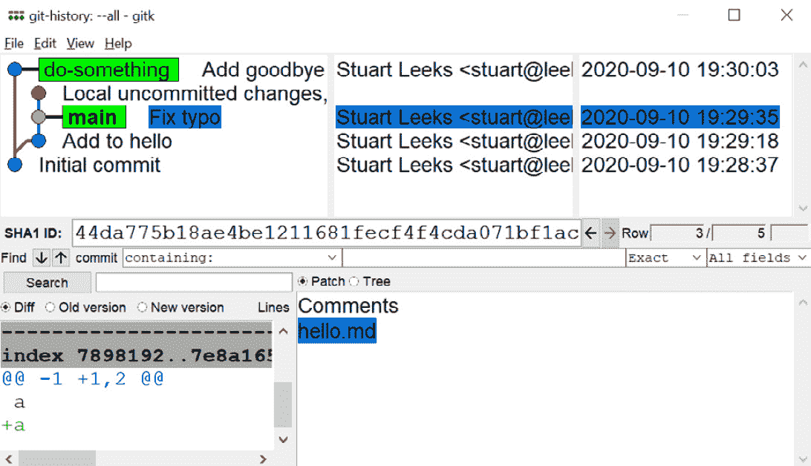
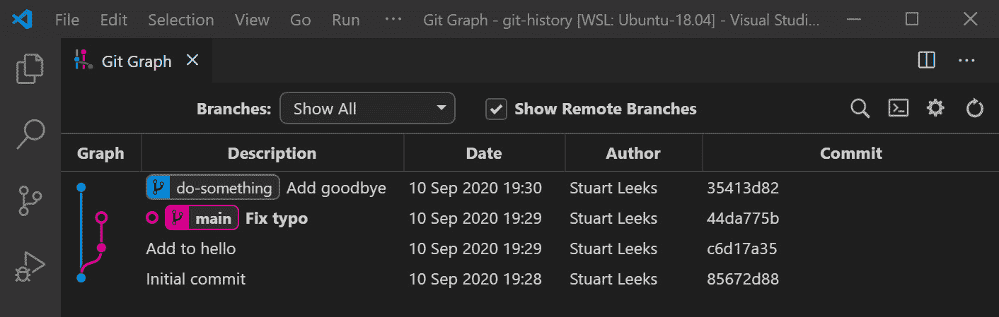
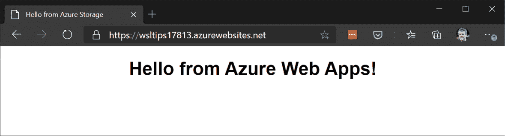

# *第 11 章*:使用命令行工具提高效率的技巧

在本章中，我们将介绍一些使用不同的常用命令行工具的技巧。 我们将从提高生产率和改善在 WSL 中使用 Git 的体验开始。 Git 得到了广泛的使用，使用它提高生产力可以在任何使用它进行源代码控制的项目中得到改进。 在此之后，我们将看看两个**命令行接口**(**CLIs**):Azure 的`az`和 Kubernetes 的`kubectl`。 对于这些 CLIs，我们将部署一个简单的示例资源，然后展示使用它们查询数据的一些技术。 是常见的许多综合领先指标,`az`和`kubectl`提供一个选项**获取数据的 JavaScript 对象表示法**(【病人】JSON)格式,在观察这些综合领先指标之前,我们将探讨一些选项在 WSL 处理 JSON 数据。 即使您没有使用`az`或`kubectl`，这些部分中介绍的技术也可能与您正在使用的其他 cli 相关。 通过学习如何有效地操作 JSON，您将为使用广泛的 api 和 cli 编写脚本和自动化打开新的可能性。

在本章中，我们将涵盖以下主要主题:

*   使用 Git
*   使用 JSON
*   使用 Azure CLI(`az`)
*   使用 Kubernetes CLI(`kubectl`)

让我们从探索使用 Git 的一些技巧开始。

# 使用 Git

毫无疑问，Git 是一种常用的源代码控制系统。 最初由 Linus Torvalds 用于 Linux 内核源代码,现在广泛使用,包括像微软这样的公司,它被广泛使用,包括 Windows 开发 https://docs.microsoft.com/en-us/azure/devops/learn/devops-at-microsoft/use-git-microsoft(参见的更多信息)。

在本节中，我们将研究在 wsdl 中使用 Git 的一些技巧。 一些技巧在前面的章节中已经介绍过并链接起来以获取更多的信息，而另一些则是新的技巧——这里将两者结合在一起以方便参考。

让我们先来看看大多数命令行工具的快速优势:bash 完成。

## 用 Git 完成 Bash

当使用和许多命令行工具时，bash 完成可以为节省大量输入，`git`也不例外。

例如，`git com<TAB>`会产生`git commit`，`git chec<TAB>`会产生`git checkout`。 如果您输入的部分命令不足以指定单个命令，那么 bash 补全将显示不做任何事情，但是按*Tab*两次将显示选项。 举个例子:

```sh
$ git co<TAB><TAB>
commit   config
$ git co
```

这里，我们看到，`git co`可以完成`git commit`或`git config`。

Bash 补全也不仅仅是补全命令名; 您可以使用`git checkout my<TAB>`来完成到`git checkout my-branch`的分支名称。

一旦你习惯了敲打完成，你会发现它可以大大提高生产力!

接下来，让我们看看使用远程 Git repos 进行身份验证的选项。

## Git 认证

使用 Git 进行身份验证的一种强大的方法是通过使用**Secure Shell**(**SSH**)密钥。 这种身份验证方法重用了 SSH 密钥，这些密钥通常用于建立到远程机器的 SSH 连接，通过 Git 进行身份验证，并且被主要的 Git 源代码控制提供程序支持。 在[【显示】第五章](05.html#_idTextAnchor054),*Linux, Windows 互操作性【病人】,在*SSH 代理转发*一节中,我们看到了如何配置 WSL 重用 SSH 密钥存储在窗口。 如果您已经设置了这个，它还允许您在 wsdl 中使用 Git 的 SSH 密钥。*

或者，如果您正在跨 Windows 和 WSL 进行混合开发，并希望在它们之间共享 Git 身份验证，那么您可能需要为 Windows 配置 Git Credential Manager，以便在 WSL 中使用。 这也支持使用 GitHub 或 Bitbucket 等提供商的双因素认证(参见[https://github.com/Microsoft/Git-Credential-Manager-for-Windows](https://github.com/Microsoft/Git-Credential-Manager-for-Windows)了解更多信息)。 要使用它，您必须在 Windows 中安装 Git。 要配置，请从您的**发行版**(**发行版**)中运行以下命令:

```sh
git config --global credential.helper "/mnt/c/Program\ Files/Git/mingw64/libexec/git-core/git-credential-manager.exe"
```

这个命令设置 Git 配置，以启动 Git Credential Manager，以便 Windows 处理远程 repos 的身份验证。 通过 Windows 访问 Git 远程服务器时存储的任何凭据都将被 wsdl 重用(反之亦然)。 详情见[https://docs.microsoft.com/en-us/windows/wsl/tutorials/wsl-git#git-credential-manager-setup](https://docs.microsoft.com/en-us/windows/wsl/tutorials/wsl-git#git-credential-manager-setup)。

在处理了身份验证之后，让我们看看在 Git 中查看历史的几个选项。

## 查看 Git 历史

当在 WSL 中使用 Git 时，有许多不同的方法可以在 Git 回购中查看提交的历史。 在这里，我们将看看以下不同的选择:

*   通过`git`命令行
*   从 Windows 使用图形化的 Git 工具
*   使用 Visual Studio 代码远程- wsdl

第一个选项是在 CLI 中使用`git log`命令:

```sh
$ git log --graph --oneline --decorate --all
* 35413d8 (do-something) Add goodbye
| * 44da775 (HEAD -> main) Fix typo
| * c6d17a3 Add to hello
|/
* 85672d8 Initial commit
```

在`git log`的输出中，您可以看到运行`git log`命令的结果，该命令带有许多附加开关，使用文本图像来显示分支，从而产生简洁的输出。 这种方法非常方便，因为它可以直接从 WSL 中的命令行使用，并且只需要在 WSL 中安装 Git。 然而，输入这个命令可能有点乏味，所以你可能想要创建一个 Git 别名，如下所示:

```sh
$ git config --global --replace-all alias.logtree 'log --graph --oneline --decorate --all'
```

这里，我们使用`git config`命令为前面的 Git 命令创建一个名为`logtree`的别名。 在创建这个之后，我们现在可以运行`git logtree`来生成之前的输出。

如果您有一个用于 Windows 的图形化工具，并且与 Git 一起使用，那么您可以将其指向 wsdl 中的 Git 回购。 在[*第 9 章*](09.html#_idTextAnchor111),*Visual Studio 代码和 WSL【显示】,在*查看 Git 历史*部分,我们研究了如何使用`gitk`工具,包含在 Git。 例如，我们可以在一个 WSL shell 的 Git repo 文件夹中运行`gitk.exe --all`来启动 Windows`gitk.exe`可执行文件:*



图 11.1 -显示 Windows 中 gitk 实用程序的屏幕截图，该实用程序显示了一个 WSL Git repo

在这个屏幕截图中，我们可以看到`gitk`实用程序在 Windows 中运行，并显示与前面和`git log`相同的 Git 回购。 因为我们在 WSL 推出了它从一个 shell,它拿起`\\wsl$`分享用来访问 shell 的当前文件夹 WSL 从 Windows(见第四章[*【显示】*](04.html#_idTextAnchor047),*Windows, Linux 互操作性*,【病人】访问 Linux 文件从 Windows 部分,`\\wsl$`分享的更多信息)。 这种方法的一个潜在问题是，通过`\\wsl$`共享访问文件会带来性能开销，对于较大的 Git 回购，这可能会使 Windows Git 实用程序加载缓慢。

另一个选项,我们看到[*第 9 章*](09.html#_idTextAnchor111),*Visual Studio 代码和 WSL*,在*【查看 Git 历史 T7】部分,是使用 Visual Studio 代码。 通过使用 Remote-WSL 扩展，我们可以为 Visual Studio Code 安装其他的扩展，这样它们就可以在 WSL 中运行。 Git 图形扩展**是 Visual Studio Code 的一个方便的添加，它允许您以图形化的方式查看 Git 历史，并且可以很好地与 Remote-WSL 一起工作。 你可以在这里看到一个例子:***

 **

图 11.2 -在 Visual Studio Code 中显示 Git Graph 扩展的截图

这张截图再次显示了相同的 Git 回购，但这一次使用的是 Visual Studio Code 中的 Git Graph 扩展。 因为这个扩展是通过 remote - wsdl 在 WSL 中加载的，所以所有对 Git 回购的访问都直接在 WSL 中执行，并且在查询 Git 时没有通过`\\wsl$`共享的性能开销。

我们在这里看到了几种方法，每种方法都有各自的优点，每种方法在各自的环境中都很有用。 如果您已经在终端上，那么*Git CLI*方法是非常方便的，并且它在 WSL 中运行，因此具有良好的性能。 对于检查复杂的分支和历史，这正是图形工具发挥作用的地方。 然而，正如前面提到的，使用 Windows 的图形化 Git 工具会导致`\\wsl$`共享的性能开销——通常，这不会引起注意，但对于包含大量文件或历史的 Git 回购，这可能会变得更重要。 在这些情况下，或者当我已经在编辑器中工作时，我发现 Visual Studio Code 扩展(如 Git Graph)作为图形可视化非常有用，而且没有性能开销。

接下来，我们将看看如何改进使用 Git 时的 bash 提示符。

## bash 提示符中的 Git 信息

在 Git 存储库的文件夹中使用 bash 中的时，默认提示不会给您关于 Git 存储库状态的任何提示。 将上下文从 Git 存储库添加到 bash 有多种选项，我们将在这里讨论中的几个选项。 第一个选项是**bash- Git -prompt**(https://github.com/magicmonty/bash-git-prompt)，它在 Git 存储库中定制 bash 提示。 你可以在这里看到一个例子:


图 11.3 -显示 bash-git-prompt 的屏幕截图

如图所示，`bash-git-prompt`显示您当前所在的分支(在本例中为`main`)。 它还指示本地分支是否有提交要推入，或者是否有提交要通过向上和向下箭头从远程分支拉出。 向上的箭头表示提交到 push，向下的箭头表示提交到 pull。 最后，它显示您是否有未提交的本地更改—在本例中为`+1`。

要安装`bash-git-prompt`，首先使用以下命令克隆存储库:

```sh
git clone https://github.com/magicmonty/bash-git-prompt.git ~/.bash-git-prompt --depth=1
```

这个`git clone`命令将回购复制到用户文件夹中的`.bash-git-prompt`文件夹中，并使用`--depth=1`只拉出最新的提交。

接下来，在您的用户文件夹中添加以下内容到`.bashrc`:

```sh
if [ -f "$HOME/.bash-git-prompt/gitprompt.sh" ]; then
    GIT_PROMPT_ONLY_IN_REPO=1
    source $HOME/.bash-git-prompt/gitprompt.sh
fi
```

这段代码将`GIT_PROMPT_ONLY_IN_REPO`变量设置为只在带有 Git 存储库的文件夹中使用自定义提示，然后加载`git`提示。 现在，重新打开终端并将文件夹更改为 Git 存储库，以查看`bash-git-prompt`的工作情况。 有关其他配置选项，请参阅文档[https://github.com/magicmonty/bash-git-prompt](https://github.com/magicmonty/bash-git-prompt)。

丰富 bash 提示的另一个选项是**Powerline**。 与`bash-git-prompt`相比，它的安装步骤要多一些，并且接管了一般的提示经验，为 Git 和 Kubernetes 等内容添加了上下文。 在下面的截图中看到 Powerline 提示的例子:


图 11.4 -显示电力线提示的屏幕截图

如图截图所示，Powerline 使用了一些特殊的字体字符，并不是所有的字体都设置了这些字符，所以第一步是确保我们有一个合适的字体。 Windows 终端自带一种名为**Cascadia**的字体，你可以从[https://github.com/microsoft/cascadia-code/releases](https://github.com/microsoft/cascadia-code/releases)下载 Powerline 的变体。 下载最新版本，然后在**Windows 资源管理器**中右键单击**安装**，从`ttf`文件夹解压缩并安装`CascadiaCodePL.ttf`和`CascadiaMonoPL.ttf`。

安装了 Powerline 字体后，我们需要配置终端来使用它。 如果您使用的是 Windows 终端，然后启动它，按*Ctrl*+*，*加载设置，并添加以下内容:

```sh
"profiles": {
    "defaults": {
        "fontFace": "Cascadia Mono PL"
    },
```

这里，我们将默认的`fontFace`值设置为我们刚刚安装的`Cascadia Mono PL`(Powerline)字体。 要更改单个配置文件的字体，请参见[*第 3 章*](03.html#_idTextAnchor037)、*开始使用 Windows 终端*、*更改字体*部分。

现在我们的终端设置了 Powerline 字体，我们就可以安装 Powerline 了。 有几个变体，我们将在这里使用**powerline-go**。 从[https://github.com/justjanne/powerline-go/releases](https://github.com/justjanne/powerline-go/releases)中获取最新的`powerline-go-linux-amd64`版本，并将其保存为`powerline-go`在您的 WSL 发行版的`PATH`中的某个地方，例如`/usr/local/bin`。 (另一种选择是安装这个通过**,但发行版的存储库被困在旧版本的可以导致不兼容——如果你愿意尝试这个选项,然后把 Windows 终端文档:https://docs.microsoft.com/en-us/windows/terminal/tutorials/powerline-setup【病人】)。**

 **安装了`powerline-go`后，我们可以通过在`bashrc`中添加以下内容来配置 bash:

```sh
function _update_ps1() {
    PS1="$(powerline-go -error $?)"
}
if [ "$TERM" != "linux" ] && [ "$(command -v powerline-go > /dev/null 2>&1; echo $?)" == "0" ]; then
    PROMPT_COMMAND="_update_ps1; $PROMPT_COMMAND"
fi
```

这里，我们创建了一个调用`powerline-go`的`_update_ps1`函数。 在这里可以添加额外的开关来控制`powerline-go`的行为——更多细节请参阅文档:[https://github.com/justjanne/powerline-go#customization](https://github.com/justjanne/powerline-go#customization)。

在使用 Git 时，调整提示以自动获得 Git 存储库的上下文可以使您选择的任何选项都更容易。 结合这一点，将 Git 中的身份验证设置为跨 Windows 和 WSL 共享，并了解在不同情况下如何最好地查看 Git 历史，您就可以很好地使用在 WSL 中使用 Git。

在下一节中，我们将研究处理 JSON 数据的两种方法。

# 使用 JSON

将复杂的任务自动化可以节省数小时的手工劳动。 在本节中，我们将探讨一些处理 JSON 数据的技术，这是许多命令行工具和 api 都允许使用的一种常见格式。 在本章的后面，我们将展示一些示例，展示如何使用这些技术轻松地创建和发布内容到云网站或 Kubernetes 集群。

对于本节，在本书附带的代码中有一个示例 JSON 文件。 你可以用 Git 从[https://github.com/PacktPublishing/Windows-Subsystem-for-Linux-2-WSL-2-Tips-Tricks-and-Techniques](https://github.com/PacktPublishing/Windows-Subsystem-for-Linux-2-WSL-2-Tips-Tricks-and-Techniques)克隆这段代码。 示例 JSON 名为`wsl-book.json`，位于`chapter-11/02-working-with-json`文件夹中，它基于对一本书的章节和标题的 JSON 描述。 这个 JSON 的一个片段显示在这里:

```sh
{
    "title": "WSL: Tips, Tricks and Techniques",
    "parts": [
        {
            "name": "Part 1: Introduction, Installation and Configuration",
            "chapters": [
                {
                    "title": "Introduction to the Windows Subsystem for Linux",
                    "headings": [
                        "What is the Windows Subsystem for Linux?",
                        "Exploring the Differences between WSL 1 and 2"
                    ]
                },
			...
            "name": "Part 2: Windows and Linux - A Winning Combination",
            "chapters": [
                {
			...
```

这段代码显示了示例 JSON 的结构。 值得花点时间熟悉它，因为它是本节示例的基础。 本节中的示例假设您在包含示例 JSON 的文件夹中打开了一个 shell。

让我们从一个流行的实用程序`jq`开始。

## 使用 jq

我们将介绍的第一个工具是`jq`，对于处理 JSON 字符串来说，它是一个非常方便的实用工具，主要平台都支持它。 [https://stedolan.github.io/jq/download/](https://stedolan.github.io/jq/download/)列出了完整安装选项，但是您可以通过运行`sudo apt-get install jq`快速启动 Debian/Ubuntu。

最基本的是，`jq`可以用来格式化输入。 例如，我们可以将一个 JSON 字符串管道到`jq`:

```sh
$ echo '[1,2,"testing"]' | jq
[
  1,
  2,
  "testing"
]
```

在这个命令的输出中，您可以看到`jq`获取了紧凑的 JSON 输入，并将其转换为格式化良好的输出。 当与返回压缩 JSON 的 api 交互时，这个功能本身就很有用。 然而，`jq`的真正强大之处在于它的查询功能，我们将在本节中探讨这些功能。 如果你想了解可以实现什么，看看下面的例子:

```sh
$ cat ./wsl-book.json | jq ".parts[].name"
"Part 1: Introduction, Installation and Configuration"
"Part 2: Windows and Linux - A Winning Combination"
"Part 3: Developing with Windows Subsystem for Linux"
```

该输出显示了`jq`提取并输出示例 JSON 中各部分的`name`值。 当使用 api和返回 JSON 数据的命令行工具编写脚本时，这种类型的功能非常有用，我们将从一些简单的查询开始，逐步构建更复杂的查询。 你可以使用`jq`命令行或者**jq playground**在[https://jqplay.org](https://jqplay.org)跟随的例子，如下截图所示:


图 11.5 -显示 jq 游乐场的截图

这个屏幕截图显示了在`jq`操场上打开的前一个示例。 在左上角，您可以看到过滤器(`.parts[].name`)，下面是输入 JSON，右边是`jq`输出。 当您处理复杂的查询时，playground 可能是一个很有帮助的环境，底部的**Command Line**部分甚至提供了可以复制并在脚本中使用的命令行。

现在您已经了解了`jq`可以做什么，让我们从一个简单的查询开始。 我们正在处理的 JSON 有两个顶级属性:`title`和`parts`。 如果我们想提取`title`属性的值，我们可以使用以下查询:

```sh
$ cat ./wsl-book.json | jq ".title"
"WSL: Tips, Tricks and Techniques"
```

在这里，我们使用了`.title`过滤器来提取`title`属性的值。 注意，该值在输出中使用了引号，因为`jq`默认输出 JSON。 要将其赋值给脚本中的一个变量，我们通常希望该值不带引号，我们可以使用带有`jq`的`-r`选项来获得原始输出:

```sh
$ BOOK_TITLE=$(cat ./wsl-book.json | jq ".title" -r)
$ echo $BOOK_TITLE
WSL: Tips, Tricks and Techniques
```

这个输出显示了使用`-r`选项获取原始(没有引号)输出，并将其赋值给一个变量。

在本例中，我们使用了`title`属性，它是一个简单的字符串值。 另一个顶级属性是`parts`，它是一个 JSON 对象数组:

```sh
$ cat ./wsl-book.json | jq ".parts"
[
  {
    "name": "Part 1: Introduction, Installation and Configuration",
    "chapters": [
      {
        "title": "Introduction to the Windows Subsystem for Linux",
        "headings": [
          "What is the Windows Subsystem for Linux?",
          "Exploring the Differences between WSL 1 and 2"
        ]
      },
	...
```

在这个命令的输出中，我们看到检索`parts`属性将返回该属性的完整值。 我们可以将过滤器改为`.parts[0]`，以拉回`parts`数组中的第一项，然后如果我们想要获得第一部分的名称，则进一步扩展过滤器，如下所示:

```sh
$ cat ./wsl-book.json | jq ".parts[0].name"
"Part 1: Introduction, Installation and Configuration"
```

在这里，我们将看到如何构建一个查询来沿着 JSON 数据的层次结构进行工作，选择属性并对数组进行索引以选择特定的值。 有时，能够获得一个数据列表是很有用的——例如，检索所有部件的名称。 我们可以用下面的命令来做:

```sh
$ cat ./wsl-book.json | jq ".parts[].name"
"Part 1: Introduction, Installation and Configuration"
"Part 2: Windows and Linux - A Winning Combination"
"Part 3: Developing with Windows Subsystem for Linux"
```

正如您在本例中所看到的，我们省略了前一个过滤器中的数组索引，并且`jq`针对`parts`数组的每一项处理了过滤器的其余部分(`.name`)。 与单值输出一样，我们可以添加`-r`选项来获得未加引号的字符串，以便在脚本中轻松处理输出。 或者，如果我们正在使用 api，我们可能希望构建 JSON 输出——例如，要将以前的值作为数组输出，我们可以将过滤器用方括号括起来:`[.parts[].name]`。

到目前为止，我们只使用了一个过滤器表达式，但是`jq`允许我们将多个过滤器链接在一起，并将一个过滤器的输出作为输入输送到下一个过滤器。 例如，我们可以将`.parts[].name`重写为`.parts[] | .name`，这将产生相同的输出。 从这里开始，我们可以将第二个过滤器改为`{name}`，以产生一个具有`name`属性的对象，而不仅仅是名称值:

```sh
$ cat ./wsl-book.json | jq '.parts[] | {name}'
{
  "name": "Part 1: Introduction, Installation and Configuration"
}
{
  "name": "Part 2: Windows and Linux - A Winning Combination"
}
{
  "name": "Part 3: Developing with Windows Subsystem for Linux"
}
```

这里，我们看到`.parts`数组中的每个值现在都在输出中产生一个对象，而不是以前的简单字符串。 `{name}`语法实际上是`{name: .name}`的简写。 完整的语法使您更容易了解如何控制输出中的属性名—例如，`{part_name: .name}`。 使用完整的语法，我们还可以看到属性值是另一个过滤器。 在这个例子中，我们使用了简单的`.name`过滤器，但我们也可以使用更丰富的过滤器:

```sh
$ cat ./wsl-book.json | jq '.parts[] | {name: .name, chapter_count: .chapters | length}'
{
  "name": "Part 1: Introduction, Installation and Configuration",
  "chapter_count": 3
}
{
  "name": "Part 2: Windows and Linux - A Winning Combination",
  "chapter_count": 5
}
{
  "name": "Part 3: Developing with Windows Subsystem for Linux",
  "chapter_count": 3
}
```

在这个示例中，我们添加了`.chapters | length`作为过滤器来指定`chapter_count`属性的值。 将`.chapters`表达式应用于当前正在处理的`parts`数组的值并选择`chapters`数组，然后将其解析到`length`函数，该函数返回数组长度。 有关`jq`中可用功能的更多信息，请查看 https://stedolan.github.io/jq/manual/#Builtinoperatorsandfunctions 中的文档。

对于`jq`的最后一个例子，让我们将显示部分名称的部分汇总，以及章节标题列表:

```sh
$ cat ./wsl-book.json | jq '[.parts[] | {name: .name, chapters: [.chapters[] | .title]}]'
[
  {
    "name": "Part 1: Introduction, Installation and Configuration",
    "chapters": [
      "Introduction to the Windows Subsystem for Linux",
      "Installing and Configuring the Windows Subsystem for Linux",
      "Getting Started with Windows Terminal"
    ]
  },
  {
    "name": "Part 2: Windows and Linux - A Winning Combination",
    "chapters": [
...
]
```

在本例中，`parts`数组被管道输送到一个过滤器中，该过滤器为每个具有`name`和`chapters`属性的数组项创建一个对象。 `chapters`属性是通过将`chapters`数组管道到属性的选择器中，然后将数组封装到`[.chapters[] | title]`数组中来构建的。 整个结果被包装在一个数组中(再次使用方括号)，以在输出中创建这些摘要对象的 JSON 数组。

提示

使用命令行工具(如`jq`)查找选项的方法有很多种。 您可以运行`jq --help`查看简要帮助页，或者运行`man jq`查看完整的手册页。 一个方便的替代方案是`tldr`(参见[https://tldr.sh](https://tldr.sh)了解更多细节和安装说明)。 `tldr`实用程序将自己描述为*简化和社区驱动的手册页*，运行`tldr jq`将提供比手册页更短的输出，并包含有用的示例。

这段快速的旅程向您展示了`jq`提供的一些强大功能，无论是在交互工作时格式化 JSON 输出以提高可读性，还是快速从 JSON 中选择单个值以用于脚本，还是将 JSON 输入转换为新的 JSON 文档。 在处理 JSON 时，`jq`是一个非常有用的工具，我们将在本章后面的章节中看到更多的例子。

在下一节中，我们将探索使用**PowerShell**处理 JSON 数据的选项。

## 使用 PowerShell 处理 JSON

在这一节中，我们将探索 PowerShell 为处理 JSON数据提供的一些功能。 PowerShell 是一种 shell 和脚本语言，它起源于 Windows，但现在可用于 Windows、Linux 和 macOS。 要在 WSL 中安装，请遵循您的发行版在 https://docs.microsoft.com/en-us/powershell/scripting/install/installing-powershell-core-on-linux?view=powershell-7 上的安装说明。 例如，对于 Ubuntu 18.04，我们可以使用以下命令来安装 PowerShell:

```sh
# Download the Microsoft repository GPG keys wget -q https://packages.microsoft.com/config/ubuntu/18.04/packages-microsoft-prod.deb
# Register the Microsoft repository GPG keys sudo dpkg -i packages-microsoft-prod.deb
# Update the list of products sudo apt-get update
# Enable the "universe" repositories sudo add-apt-repository universe
# Install PowerShell sudo apt-get install -y powershell
```

这些步骤将注册 Microsoft 包存储库，然后从那里安装 PowerShell。 安装后，您可以通过运行`pwsh`来启动 PowerShell，这将为您提供一个交互式 shell，我们将在本节的其余示例中使用它。

我们可以加载和解析示例 JSON 文件如下:

```sh
PS > Get-Content ./wsl-book.json | ConvertFrom-Json
title                            parts
-----                            -----
WSL: Tips, Tricks and Techniques {@{name=Part 1: Introduction, Installation and Configuration; chapters=System.Object[…
```

这里，我们看到了用于加载示例文件内容的`Get-Content`cmdlet (PowerShell 中的命令称为**cmdlet**)，以及用于将 JSON 对象图解析为 PowerShell 对象的`ConvertFrom-Json`。 此时，我们可以使用任何 PowerShell 特性来处理数据。 例如，我们可以使用`Select-Object`cmdlet 来获取标题:

```sh
PS > Get-Content ./wsl-book.json | ConvertFrom-Json | Select-Object -ExpandProperty title
WSL: Tips, Tricks and Techniques
```

cmdlet 允许我们对一组对象执行各种操作，例如从集合的开始或结束处获取指定数量的项，或者只筛选唯一的项。 在本例中，我们使用它来选择要输出的输入对象的属性。 另一种获取标题的方法是直接处理转换后的 JSON 对象，如下所示:

```sh
PS > $data = Get-Content ./wsl-book.json | ConvertFrom-Json
PS > $data.title
WSL: Tips, Tricks and Techniques
```

在本例中，我们保存了将数据从 JSON 转换为`$data`变量的结果，然后直接访问`title`属性。 现在我们有了`$data`变量，我们可以探索`parts`属性:

```sh
PS > $data.parts | Select-Object -ExpandProperty name
Part 1: Introduction, Installation and Configuration
Part 2: Windows and Linux - A Winning Combination
Part 3: Developing with Windows Subsystem for Linux
```

在这个例子中，我们直接访问了`parts`属性，它是一个对象数组。 然后将这个对象数组传递给`Select-Object`以展开每个部分的`name`属性。 如果我们想生成 JSON 输出(就像我们在前一节中使用`jq`所做的那样)，我们可以使用`ConvertTo-Json`cmdlet:

```sh
PS > $data.parts | select -ExpandProperty name | ConvertTo-Json
[
  "Part 1: Introduction, Installation and Configuration",
  "Part 2: Windows and Linux - A Winning Combination",
  "Part 3: Developing with Windows Subsystem for Linux"
]
```

这里，我们使用了与前面示例中相同的命令(尽管为了简洁起见，我们使用了`Select-Object`的别名`select`)，然后将输出传递给`ConvertTo-Json`cmdlet。 该 cmdlet 执行与`ConvertFrom-Json`相反的操作——换句话说，它将一组 PowerShell 对象转换为 JSON。

如果我们想输出带有部件名称的 JSON 对象，我们可以使用以下命令:

```sh
PS > $data.parts | ForEach-Object { @{ "Name" = $_.name } } | ConvertTo-Json
[
  {
    "Name": "Part 1: Introduction, Installation and Configuration"
  },
  {
    "Name": "Part 2: Windows and Linux - A Winning Combination"
  },
  {
    "Name": "Part 3: Developing with Windows Subsystem for Linux"
  }
]
```

这里，我们用`ForEach-Object`代替`Select-Object`。 `ForEach-Object`cmdlet 允许提供一个 PowerShell 代码片段，为输入数据中的每个对象执行，`$_`变量包含用于每次执行的集合中的项。 `ForEach-Object`内的代码片段中,我们使用了`@{ }`语法来创建一个新的 PowerShell 对象的属性叫做`Name`设置为`name`房地产当前的输入对象(这是部分的名称,在本例中)。 最后，我们将结果对象集传递给`ConvertTo-Json`以转换为 JSON 输出。

我们可以使用这种方法来构建更丰富的输出——例如，包括部件的名称和它包含的章节数:

```sh
PS > $data.parts | ForEach-Object { @{ "Name" = $_.name; "ChapterCount"=$_.chapters.Count } } | ConvertTo-Json
[
  {
    "ChapterCount": 3,
    "Name": "Part 1: Introduction, Installation and Configuration"
  },
  {
    "ChapterCount": 5,
    "Name": "Part 2: Windows and Linux - A Winning Combination"
  },
  {
    "ChapterCount": 3,
    "Name": "Part 3: Developing with Windows Subsystem for Linux"
  }
]
```

在本例中，我们将`ForEach-Object`中的代码片段扩展为`@{ "Name" = $_.name; "ChapterCount"=$_.chapters.Count }`。 这将创建一个具有两个属性的对象:`Name`和`ChapterCount`。 `chapters`属性是一个 PowerShell 数组，因此我们可以使用该数组的`Count`属性作为输出中的`ChapterCount`属性的值。

如果我们想要输出带有每个部分的章节名称的摘要，我们可以结合我们目前看到的方法:

```sh
PS > $data.parts | ForEach-Object { @{ "Name" = $_.name; "Chapters"=$_.chapters | Select-Object -ExpandProperty title } } | ConvertTo-Json
[
  {
    "Chapters": [
      "Introduction to the Windows Subsystem for Linux",
      "Installing and Configuring the Windows Subsystem for Linux",
      "Getting Started with Windows Terminal"
    ],
    "Name": "Part 1: Introduction, Installation and Configuration"
  },
  {
    "Chapters": [
...
    ],
    "Name": "Part 2: Windows and Linux - A Winning Combination"
  },
  ...
]
```

这里，我们再次使用了`ForEach-Object`cmdlet 来创建 PowerShell 对象，这一次使用了`Name`和`Chapters`属性。 创建`Chapters`属性,我们只希望每一章的名称,我们可以使用`Select-Object`cmdlet正如我们最初所选择部件名称早在本节中,但这一次我们在`ForEach-Object`代码片段中使用它。 能够以这种方式组合命令给我们带来了很大的灵活性。

在前面的示例中，我们一直在处理使用`Get-Content`从本地文件加载的数据。 为了从 URL 下载数据，PowerShell 提供了两个方便的 cmdlet:`Invoke-WebRequest`和`Invoke-RestMethod`。

我们可以使用`Invoke-WebRequest`从 GitHub 下载样本数据:

```sh
$SAMPLE_URL="https://raw.githubusercontent.com/PacktPublishing/Windows-Subsystem-for-Linux-2-WSL-2-Tips-Tricks-and-Techniques/main/chapter-11/02-working-with-json/wsl-book.json"
PS > Invoke-WebRequest $SAMPLE_URL
StatusCode        : 200
StatusDescription : OK
Content           : {
                        "title": "WSL: Tips, Tricks and Techniques",
                        "parts": [
                            {
                                "name": "Part 1: Introduction, Installation and Configuration",
                                "chapters": [
                                    {
                        …
RawContent        : HTTP/1.1 200 OK
                    Connection: keep-alive
                    Cache-Control: max-age=300
                    Content-Security-Policy: default-src 'none'; style-src 'unsafe-inline'; sandbox
                    ETag: "075af59ea4d9e05e6efa0b4375b3da2f8010924311d487d…
Headers           : {[Connection, System.String[]], [Cache-Control, System.String[]], [Content-Security-Policy, System.String[]], [ETag, System.Strin                     g[]]…}
Images            : {}
InputFields       : {}
Links             : {}
RawContentLength  : 4825
RelationLink      : {}
```

这里，我们看到`Invoke-WebRequest`让我们访问响应的各种属性，包括状态代码和内容。 要将数据作为 JSON 加载，我们可以将`Content`属性传递给`ConvertFrom-JSON`:

```sh
PS > (iwr $SAMPLE_URL).Content | ConvertFrom-Json
                                                                                                                                                     title                           parts
-----                            -----
WSL: Tips, Tricks and Techniques {@{name=Part 1: Introduction, Installation and Configuration; chapters=System.Object[]}, @{name=Part 2: Windows and…
```

在本例中，我们使用了`iwr`别名作为`Invoke-WebRequest`的简写，这在交互工作时非常方便。 我们可以将`Invoke-WebRequest`的输出传递给`Select-Object`以扩展`Content`属性，正如我们前面看到的那样。 相反，我们将表达式包装在括号中，以便直接访问属性，以显示另一种语法。 然后将这些内容传递给`ConvertFrom-Json`，它将数据转换为我们前面看到的 PowerShell 对象。 这种可组合性很方便，但如果你只对 JSON 内容感兴趣(而对响应的任何其他属性不感兴趣)，那么你可以使用`Invoke-RestMethod`cmdlet 来实现这一点:

```sh
PS > Invoke-RestMethod $SAMPLE_URL
title                            parts
-----                            -----
WSL: Tips, Tricks and Techniques {@{name=Part 1: Introduction, Installation and Configuration; chapters=System.Object[]}, @{name=Part 2: Windows and…
```

这里，我们看到与前面相同的输出，因为`Invoke-RestMethod`cmdlet 已经确定响应包含 JSON 数据并自动执行转换。

## 总结 JSON 的工作

在最后的两节中，您已经看到了`jq`和 PowerShell 如何为处理 JSON 输入提供丰富的功能。 在每种情况下，您都看到了如何提取简单值和执行更复杂的操作来生成新的 JSON 输出。 随着 JSON 在 api 和 CLIs 之间的普遍使用，能够有效地使用 JSON 工作将极大地提高生产率，我们将在本章的其余部分看到这一点。 在本章的其余部分，我们将在一些例子中使用`jq`，在这些例子中，我们需要一个额外的工具来帮助处理 JSON，但请注意，你也可以使用 PowerShell。

在下一节中，我们将看到如何将使用 JSON 的技术与另一个命令行工具结合起来，这一次将介绍使用 Azure CLI 的一些技巧。

# 使用 Azure CLI (az)

向云计算的发展带来了许多好处，其中之一就是能够按需提供计算资源。 能够自动化这些资源的创建、配置和删除是其优势的关键部分，这通常是使用相关云供应商提供的 CLI 来执行的。

在本节中，我们将创建并发布一个简单的网站，全部通过命令行，并以此作为一种方法来研究使用 Azure CLI(`az`)的一些技巧。 我们将看到在本章前面看到的一些使用`jq`的方法，以及`az`的内置查询功能。 如果你想继续学习，但还没有 Azure 订阅，你可以在 https://azure.microsoft.com/free/上注册免费试用。 让我们从安装 CLI 开始。

## 安装和配置 Azure CLI

有一系列安装 Azure CLI 的选项。 最简单的是在想要安装 CLI 的 WSL 发行版中打开一个终端，并运行以下命令:

```sh
curl -sL https://aka.ms/InstallAzureCLIDeb | sudo bash
```

这个命令下载安装脚本并在 bash 中运行它。 如果您不喜欢直接从互联网运行脚本，您可以先下载脚本并检查它，或者在这里查看单独的安装步骤:[https://docs.microsoft.com/en-us/cli/azure/install-azure-cli-apt?view=azure-cli-latest](https://docs.microsoft.com/en-us/cli/azure/install-azure-cli-apt?view=azure-cli-latest)。

安装后，您应该能够从终端运行`az`。 要连接到 Azure 订阅以便您可以管理它，运行`az login`:

```sh
$ az login
To sign in, use a web browser to open the page https://microsoft.com/devicelogin and enter the code D3SUM9QVS to authenticate.
```

在这个来自`az login`命令的输出中，您可以看到`az`已经生成了一个代码，我们可以通过访问[https://microsoft.com/devicelogin](https://microsoft.com/devicelogin)来登录该代码。 在浏览器中打开此 URL，并使用您用于 Azure 订阅的帐户登录。 执行此操作后不久，`az login`命令将输出您的订阅信息并完成运行。

如果有多个订阅，可以用`az account list`列出它们，并选择使用`az account set --subscription YourSubscriptionNameOrId`处理的默认订阅。

现在我们已经登录了，可以开始运行命令了。 在 Azure 中，资源位于资源组(一个逻辑容器)中，所以让我们列出我们的组:

```sh
$ az group list
[]
```

这里，命令的输出显示订阅中目前没有资源组。 注意，输出是`[]`—一个空 JSON 数组。 默认情况下，`az`以 JSON 的形式输出结果，所以对带有一些现有资源组的订阅运行前面的命令会得到以下输出:

```sh
$ az group list
[
  {
    "id": "/subscriptions/36ce814f-1b29-4695-9bde-1e2ad14bda0f/resourceGroups/wsltipssite",
    "location": "northeurope",
    "managedBy": null,
    "name": "wsltipssite",
    "properties": {
      "provisioningState": "Succeeded"
    },
    "tags": null,
    "type": "Microsoft.Resources/resourceGroups"
  },
  ...
]
```

前面的输出由于过于冗长而被截断。 幸运的是，`az`允许从许多输出格式中进行选择，包括 table:

```sh
$ az group list -o table
Name         Location     Status
-----------  -----------  ---------
wsltipssite  northeurope  Succeeded
wsltipstest  northeurope  Succeeded
```

在这个输出中，我们使用了`-o table`开关来配置表输出。 这种输出格式更简洁，通常对于 CLI 的交互使用非常方便，但是必须不断地向命令添加开关会很单调。 幸运的是，我们可以通过运行`az configure`命令将表输出设置为默认值。 这将为您提供一组简短的交互选择，包括默认情况下使用哪种输出格式。 因为默认输出格式可以被覆盖，所以如果脚本中需要 JSON 输出，那么在用户配置了不同的默认格式时，指定 JSON 输出是很重要的。

要了解更多使用`az`的示例，包括如何在 Azure 中创建各种资源，请参见[https://docs.microsoft.com/cli/azure](https://docs.microsoft.com/cli/azure)中的*Samples*部分。 在本节的其余部分中，我们将查看一些使用 CLI 查询资源信息的特定示例。

## 创建 Azure web 应用

证明与`az`查询,我们将创建一个简单的 Azure web 应用。Azure web 应用允许您举办各种语言编写的 web 应用(包括. net, node . js、PHP、Java、Python),并且有许多部署选项,你可以选择根据自己的偏好。 我们将保持简单，以确保我们关注 CLI 的使用，因此我们将创建一个单页静态网站，并通过 FTP 部署它。 要了解更多关于 Azure web 应用的信息，请参阅[https://docs.microsoft.com/en-us/azure/app-service/overview](https://docs.microsoft.com/en-us/azure/app-service/overview)中的文档。

在创建 web 应用之前，我们需要创建一个资源组:

```sh
az group create \
        --name wsltips-chapter-11-03 \
        --location westeurope
```

在这里，我们使用`az group create`命令创建一个资源组，以包含将要创建的资源。 注意，为了可读性，我们使用了行延续字符(`\`)将命令拆分为多行。 要运行一个 web 应用，我们需要一个 Azure 应用服务计划来托管它，所以我们首先创建:

```sh
az appservice plan create \
        --resource-group wsltips-chapter-11-03 \
        --name wsltips-chapter-11-03 \
        --sku FREE
```

在这段代码片段中，我们使用`az appservice plan create`命令在刚才创建的资源组中创建一个空闲托管计划。 现在，我们可以使用该托管计划创建一个 web 应用:

```sh
WEB_APP_NAME=wsltips$RANDOM
az webapp create \
        --resource-group wsltips-chapter-11-03 \
        --plan wsltips-chapter-11-03 \
        --name $WEB_APP_NAME
```

在这里，我们为站点生成一个随机名称(因为它需要是唯一的)，并将其存储在`WEB_APP_NAME`变量中。 然后使用`az webapp create`命令。 一旦命令完成，我们就创建了新网站，并准备开始使用`az`CLI 进行查询。

## 查询单个值

我们要查询的 web 应用的第一个是它的 URL。 我们可以使用`az webapp show`命令来列出我们的 web 应用的各种属性:

```sh
$ az webapp show \
             --name $WEB_APP_NAME \
             --resource-group wsltips-chapter-11-03 \
             --output json
{
  "appServicePlanId": "/subscriptions/67ce421f-bd68-463d-85ff-e89394ca5ce6/resourceGroups/wsltips-chapter-11-02/providers/Microsoft.Web/serverfarms/wsltips-chapter-11-03",
  "defaultHostName": "wsltips28126.azurewebsites.net",
  "enabled": true,
  "enabledHostNames": [
    "wsltips28126.azurewebsites.net",
    "wsltips28126.scm.azurewebsites.net"
  ],
  "id": "/subscriptions/67ce421f-bd68-463d-85ff-e89394ca5ce6/resourceGroups/wsltips-chapter-11-02/providers/Microsoft.Web/sites/wsltips28126",
   ...
  }
}
```

这里，我们通过了`--output json`开关，以确保无论配置的默认格式是什么，都能得到 JSON 输出。 在这个缩减后的输出中，我们可以看到有一个`defaultHostName`属性，我们可以使用它来构建站点的 URL。

提取`defaultHostName`属性y 的一种方法是使用`jq`，正如我们在*Using jq*节中看到的:

```sh
$ WEB_APP_URL=$(az webapp show \
             --name $WEB_APP_NAME \
             --resource-group wsltips-chapter-11-03 \
             --output json  \
             | jq ".defaultHostName" -r)
```

在这个代码片段中,我们使用`jq`选择`-r``defaultHostName`属性,通过切换到原始输出,以避免它被引用,然后分配这个`WEB_APP_URL`财产,所以我们可以使用它在其他脚本。

`az`CLI还包含使用**JMESPath**查询语言的内置查询功能。 我们可以使用这个让`az`运行 JMESPath 查询并输出结果:

```sh
$ WEB_APP_URL=$(az webapp show \
                --name $WEB_APP_NAME \
                --resource-group wsltips-chapter-11-03 \
                --query "defaultHostName" \
                --output tsv)
```

这里，我们使用`--query`选项传递`"defaultHostName"`JMESPath 查询，该查询选择`defaultHostName`属性。 我们还添加了`--output tsv`以使用制表符分隔的输出，这可以防止值被引号括起来。 这将检索与前面使用`jq`的示例相同的值，但使用`az`完成所有操作。 这在与他人共享脚本时很有用，因为它删除了必需的依赖项。

提示

您可以在[https://jmespath.org](https://jmespath.org)找到关于 JMESPath 和交互式查询工具的更多详细信息。 有是一个用于运行 JMESPath 查询的`jp`CLI，可以从[https://github.com/jmespath/jp](https://github.com/jmespath/jp)安装。 另外，在您的终端中有一个`jpterm`CLI，它提供了一个交互式 JMESPath，可以从[https://github.com/jmespath/jmespath.terminal](https://github.com/jmespath/jmespath.terminal)安装。

在构建查询时，这些工具可以提供一种很好的方法来研究 JMESPath。 以下面的例子为例，使用`jpterm`:

**az webapp show——name $WEB_APP_NAME——resource-group wsltips-chapter-11-03——output json | jpterm**

在这里，您可以看到将 JSON 输出管道到`jpterm`，然后允许您在终端中交互式地试验查询。

我们已经看到了通过`az`检索主机名并将其存储在`WEB_APP_URL`变量中的两种方法。 现在,无论是运行`echo $WEB_APP_URL`输出值和复制到你的浏览器,或运行`wslview https://$WEB_APP_URL`从 WSL 启动浏览器(`wslview`的更多细节,请参见*使用 wslview 启动默认的 Windows 应用【显示】在[*第五章*【病人】,*Linux, Windows 互操作性*):](05.html#_idTextAnchor054)*


图 11.6 -显示 Azure web 应用占位符站点的截图

在这个截图中，您可以看到占位符站点，它是通过我们通过`az`CLI 查询的 URL 加载的。 接下来，当我们向 web 应用添加一些内容时，让我们看看一个更复杂的查询需求。

## 查询过滤多个值

现在我们已经创建了一个 web 应用，让我们上传一个简单的 HTML 页面。 有很多选项可用于管理内容 Azure 的 web 应用(参见 https://docs.microsoft.com/en-us/azure/app-service/),但为简单起见,在本节中,我们将使用`curl`通过 FTP 上传单个 HTML 页面。 为此，我们需要获得 FTP URL 以及用户名和密码。 可以使用`az webapp deployment list-publishing-profiles`命令检索这些值:

```sh
$ az webapp deployment list-publishing-profiles \
                --name $WEB_APP_NAME \
                --resource-group wsltips-chapter-11-03 \
                -o json
[
  {
    ...
    "publishMethod": "MSDeploy",
    "publishUrl": "wsltips28126.scm.azurewebsites.net:443",
    "userName": "$wsltips28126",
    "userPWD": "evps3kT1Ca7a2Rtlqf1h57RHeHMo9TGQaAjE3hJDv426HKhnlrzoDvGfeirT",
    "webSystem": "WebSites"
  },
  {
    ...
    "publishMethod": "FTP",
    "publishUrl": "ftp://waws-prod-am2-319.ftp.azurewebsites.windows.net/site/wwwroot",
    "userName": "wsltips28126\\$wsltips28126",
    "userPWD": "evps3kT1Ca7a2Rtlqf1h57RHeHMo9TGQaAjE3hJDv426HKhnlrzoDvGfeirT",
    "webSystem": "WebSites"
  }
]
```

这个截断的输出在输出中显示了一个 JSON 数组。 我们需要的值在第二个数组项中(将`publishMethod`属性设置为`FTP`的项)。 让我们来看看如何使用上一节中看到的`--query`方法来实现这一点:

```sh
PUBLISH_URL=$(az webapp deployment list-publishing-profiles \
  --name $WEB_APP_NAME \
  --resource-group wsltips-chapter-11-03 \
  --query "[?publishMethod == 'FTP']|[0].publishUrl" \
  --output tsv)
PUBLISH_USER=...
```

在这里，我们使用了的 JMESPath 查询`[?publishMethod == 'FTP']|[0].publishUrl`。 我们可以把查询分成几个部分:

*   `[?publishMethod == 'FTP']`是过滤数组的语法，这里我们只过滤它以返回值为`FTP`且包含`publishMethod`属性的项。
*   上一个查询的输出仍然是一个项目数组，因此我们使用`|[0]`将该数组管道到数组选择器中以获取第一个数组项。
*   最后，我们使用`.publishUrl`来选择`publishUrl`属性。

同样，我们使用了`--output tsv`开关来避免结果被引号括起来。 该查询检索发布 URL，我们可以重复该查询，将属性选择器更改为检索用户名和密码。

这种方法的缺点是，我们向`az`发出了三个查询，每个查询都返回我们需要的信息，但除了一个值外，所有的查询都被丢弃了。 在许多情况下，这是可以接受的，但有时我们需要的信息会从调用返回给我们以创建资源，在这些情况下，重复调用是不可能的。 在这些情况下，我们可以使用前面提到的`jq`方法的一个微小变化:

```sh
CREDS_TEMP=$(az webapp deployment list-publishing-profiles \
                --name $WEB_APP_NAME \
                --resource-group wsltips-chapter-11-03 \
                --output json)
PUBLISH_URL=$(echo $CREDS_TEMP | jq 'map(select(.publishMethod =="FTP"))[0].publishUrl' -r)
PUBLISH_USER=$(echo $CREDS_TEMP | jq 'map(select(.publishMethod =="FTP"))[0].userName' -r)
PUBLISH_PASSWORD=$(echo $CREDS_TEMP | jq 'map(select(.publishMethod =="FTP"))[0].userPWD' -r)
```

这里，我们将从`az`存储 JSON 响应，而不是将其直接管道到`jq`。 然后我们可以将 JSON 多次管道到`jq`中，以选择我们想要检索的不同属性。 通过这种方式，我们可以对`az`进行一次调用，但仍然可以捕获多个值。 `jq`查询`map(select(.publishMethod =="FTP"))[0].publishUrl`可以按照与刚才看到的 JMESPath 查询类似的方式分解。 第一部分(`map(select(.publishMethod =="FTP"))`)是`jq`选择数组项的方法，其中`publishMethod`属性具有值 FTP。 查询的其余部分选择第一个数组项，然后捕获要输出的`publishUrl`属性。

这里还有一个选项，它是`--query`方法的一种变体，它允许我们不需要`jq`就发出单个查询:

```sh
CREDS_TEMP=($(az webapp deployment list-publishing-profiles \
  --name $WEB_APP_NAME \
  --resource-group wsltips-chapter-11-03 \
  --query "[?publishMethod == 'FTP']|[0].[publishUrl,userName,userPWD]" \
                --output tsv))
PUBLISH_URL=${CREDS_TEMP[0]}
PUBLISH_USER=${CREDS_TEMP[1]}
PUBLISH_PASSWORD=${CREDS_TEMP[2]}
```

此代码片段构建于早期的`--query`方法之上，但有几个不同之处需要指出。

首先，我们使用`.[publishUrl,userName,userPWD]`而不是简单地`.publishUrl`作为 JMESPath 查询中的最终选择器。 其结果是生成一个包含`publishUrl`、`userName,`和`userPWD`属性值的数组。

这个属性数组以制表符分隔的值输出，通过将执行`az`命令的结果括在括号中:`CREDS_TEMP=($(az...))`，将结果视为 bash 数组。

这两个步骤允许我们使用`--query`从对`az`的一次调用中返回多个值，并将结果存储在一个数组中。 输出中的最后几行显示了将数组项分配给命名变量以方便使用。

无论使用哪个选项来设置发布环境变量，我们现在都可以从终端上传`index.html`文件到示例内容的`chapter-11/03-working-with-az`文件夹中:

```sh
curl -T index.html -u $PUBLISH_USER:$PUBLISH_PASSWORD $PUBLISH_URL/
```

这里，我们使用`curl`使用查询的 URL、用户名和密码将`index.html`文件上传到 FTP。 现在我们可以回到浏览器并重新加载页面。 我们将得到以下结果:



图 11.7 -显示带有上传内容的 web 应用的截图

这张截图显示了我们之前创建的 web 应用，现在返回我们刚刚上传的简单 HTML 页面。

现在我们已经完成了我们创建的 web 应用(和应用服务计划)，我们可以删除它们:

```sh
az group delete --name wsltips-chapter-11-03
```

这个命令将删除我们一直在使用的`wsltips-chapter-11-03`资源组以及我们在其中创建的所有资源。

本节中的示例显示使用`curl`FTP 单页 Azure 我们创建 web 应用,它提供了一个方便的查询例子`az`,但 Azure 部署 web 应用提供了一个广泛的选项内容的详细信息,请参阅下面的文章: [https://docs.microsoft.com/archive/msdn-magazine/2018/october/azure-deploying-to-azure-app-service-and-azure-functions](https://docs.microsoft.com/archive/msdn-magazine/2018/october/azure-deploying-to-azure-app-service-and-azure-functions)。 同样值得注意的是，对于托管静态网站，Azure Storage 静态站点托管可能是一个很好的选择。 有关演练，请参见[https://docs.microsoft.com/en-us/azure/storage/blobs/storage-blob-static-website-how-to?tabs=azure-cli](https://docs.microsoft.com/en-us/azure/storage/blobs/storage-blob-static-website-how-to?tabs=azure-cli)。

在本节中，您看到了许多使用`az`CLI 进行查询的方法。 您已经了解了如何将默认输出设置为表格式，以便进行可读的交互式查询。 在编写脚本时，您已经了解了如何使用 JSON 输出并使用`jq`处理它。 您已经了解了如何通过`--query`切换到筛选器使用JMESPath 查询，并通过`az`命令直接从响应中选择值。 在本节中，我们只研究了`az`CLI 的一小部分(用于 web 应用)——如果您对`az`的更多内容感兴趣，请参阅[https://docs.microsoft.com/cli/azure](https://docs.microsoft.com/cli/azure)。

在下一节中，我们将研究另一个 CLI—这一次是 Kubernetes。

# 使用 Kubernetes CLI (kubectl)

在构建容器化应用时，Kubernetes 是容器编排器的常用选择。 Kubernetes 的介绍，见[*第 7 章*](07.html#_idTextAnchor082)，*在 WSL 中与容器一起工作*中的*在 WSL 中*部分。 Kubernetes 包含一个名为`kubectl`的 CLI，用于从命令行使用 Kubernetes。 在本节中，我们将在 Kubernetes 中部署一个基本的网站，然后研究使用`kubectl`查询有关该网站信息的不同方法。

在[*第七章*](07.html#_idTextAnchor082)，*在 WSL 中使用容器*中，我们看到了如何使用 Docker Desktop 在本地机器上设置 Kubernetes。 在这里，我们将探索使用云提供商设置 Kubernetes 集群。 下面的说明是针对 Azure 的，但是如果您熟悉另一种具有 Kubernetes 服务的云，那么就尝试使用它。 如果你想继续学习，但还没有 Azure 订阅，你可以在 https://azure.microsoft.com/free/注册免费试用。

让我们从安装`kubectl`开始。

## 安装和配置 kubectl

有各种选项安装`kubectl`([在 https://kubernetes.io/docs/tasks/tools/install-kubectl/可以找到 install-kubectl-binary-with-curl-on-linux](https://kubernetes.io/docs/tasks/tools/install-kubectl/#install-kubectl-binary-with-curl-on-linux))但最简单的方法是运行以下命令从你 WSL 地理分布:

```sh
curl -LO https://storage.googleapis.com/kubernetes-release/release/$(curl -s https://storage.googleapis.com/kubernetes-release/release/stable.txt)/bin/linux/amd64/kubectl
chmod +x ./kubectl
sudo mv ./kubectl /usr/local/bin/kubectl
```

这些命令下载最新的`kubectl`二进制文件，将其标记为可执行文件，然后将其移动到`bin`文件夹中。 完成此操作后，您应该能够运行`kubectl version --client`来检查`kubectl`是否正确安装:

```sh
$ kubectl version --client
Client Version: version.Info{Major:"1", Minor:"19", GitVersion:"v1.19.2", GitCommit:"f5743093fd1c663cb0cbc89748f730662345d44d", GitTreeState:"clean", BuildDate:"2020-09-16T13:41:02Z", GoVersion:"go1.15", Compiler:"gc", Platform:"linux/amd64"}
```

这里，我们看到`kubectl`的输出显示我们已经安装了版本`v1.19.2`。

`kubectl`实用程序具有广泛的命令，启用 bash 完成功能可以提高您的工作效率。 运行如下命令:

```sh
echo 'source <(kubectl completion bash)' >>~/.bashrc
```

这将向您的`.bashrc`文件添加一个命令，以便在 bash 启动时自动加载`kubectl`bash 完成。 要进行测试，请重新启动 bash 或运行`source ~/.bashrc`。 现在，您可以键入`kubectl ver<TAB> --cli<TAB>`来获得之前的`kubectl version --client`命令。

提示

如果您发现`kubectl`太多无法输入，您可以通过运行以下命令来创建一个别名:

**echo 'alias k=kubectl'>>~/。 bashrc**

**echo 'complete -F __start_kubectl k'>>~/。 bashrc**

这些命令添加到`.bashrc`中，将`k`配置为`kubectl`的别名，并为`k`设置 bash 补全。

这样，您就可以使用诸如`k version – client`之类的命令，并且仍然可以获得 bash 完成。

现在我们已经安装并配置了`kubectl`，让我们创建一个 Kubernetes 集群来使用它。

## 创建 Kubernetes 集群

下面的指令将引导您使用**Azure Kubernetes 服务**(**AKS**)使用 Azure CLI(`az`)创建 Kubernetes 集群。 如果您还没有安装`az`，请参考本章前面的*安装和配置 Azure CLI*小节。

第一步是创建一个资源组来包含我们的集群:

```sh
az group create \
        --name wsltips-chapter-11-04 \
        --location westeurope
```

这里，我们在`westeurope`区域中创建一个名为`wsltips-chapter-11-04`的资源组。

接下来，我们创建 AKS 集群:

```sh
az aks create \
        --resource-group wsltips-chapter-11-04 \
        --name wsltips \
        --node-count 2 \
        --generate-ssh-keys
```

这个命令在我们刚刚创建的资源组中创建了一个名为`wsltips`的集群。 这个命令将花费几分钟来运行，当它完成时，我们将有一个 Kubernetes 集群，其中包含两个工作节点，我们可以在其中运行容器工作负载。

最后一步是设置`kubectl`，使其可以连接到集群:

```sh
az aks get-credentials \
       --resource-group wsltips-chapter-11-04 \
       --name wsltips
```

在这里，我们使用`az aks get-credentials`来获取我们创建的集群的凭据，并将其保存在`kubectl`的配置文件中。

现在，我们可以运行像`kubectl get services`这样的命令来列出已定义的服务:

```sh
$ kubectl get services
NAME            TYPE           CLUSTER-IP     EXTERNAL-IP     PORT(S)        AGE
kubernetes      ClusterIP      10.0.0.1       <none>          443/TCP        7m
```

这个输出显示了我们创建的集群中 Kubernetes 服务的列表，这表明我们已经成功地连接到集群。

现在我们有了一个 Kubernetes 集群，并且配置了`kubectl`来连接到它，让我们向它部署一个测试网站。

## 基本网站部署

为了帮助探索`kubectl`，我们将部署一个基本的网站。 然后我们可以使用它来查看使用`kubectl`查询信息的不同方式。

本书附带的代码包含本节的 Kubernetes YAML 文件文件夹。 您可以从[https://github.com/PacktPublishing/Windows-Subsystem-for-Linux-2-WSL-2-Tips-Tricks-and-Techniques](https://github.com/PacktPublishing/Windows-Subsystem-for-Linux-2-WSL-2-Tips-Tricks-and-Techniques)获得此代码。 本节的内容在`chapter-11/04-working-with-kubectl`文件夹中。 `manifests`文件夹包含许多定义要部署的 Kubernetes 资源的 YAML 文件:

*   一个包含的简单 HTML 页面的**ConfigMap**
*   部署**，它部署`nginx`图像，并将其配置为从 ConfigMap 加载 HTML 页面**
***   位于`nginx`部署前面的服务**

 **要部署网站，请启动您的 WSL 发行版并导航到`chapter-11/04-working-with-kubectl`文件夹。 然后执行如下命令:

```sh
$ kubectl apply -f manifests
configmap/nginx-html created
deployment.apps/chapter-11-04 created
service/chapter-11-04 created
```

在这里，我们使用`kubectl apply -f manifests`来创建`manifests`文件夹中的 YAML 文件所描述的资源。 该命令的输出显示已创建的三个资源。

现在，我们可以运行`kubectl get services chapter-11-04`来查看创建的服务的状态:

```sh
$ kubectl get services chapter-11-04
NAME            TYPE           CLUSTER-IP    EXTERNAL-IP   PORT(S)        AGE
chapter-11-04   LoadBalancer   10.0.21.171   <pending>     80:32181/TCP   3s
```

这里，我们看到`chapter-11-04`服务的类型是`LoadBalancer`。 部,`LoadBalancer`服务将自动公开使用*Azure 负载均衡器*和这可能需要几分钟规定——注意`EXTERNAL_IP`的`<pending>`值在输出显示负载均衡器的过程中被提供。 在下一节中，我们将看看如何查询这个 IP 地址。

## 使用 JSONPath 查询

正如我们刚才看到的，服务的外部 IP 地址在创建服务之后并不能立即可用，因为需要配给和配置 Azure 负载平衡器。 通过获取 JSON 格式的服务输出，我们可以看到它在底层数据结构中的样子:

```sh
$ kubectl get services chapter-11-04 -o json
{
    "apiVersion": "v1",
    "kind": "Service",
    "metadata": {
        "name": "chapter-11-04",
        "namespace": "default",
       ...
    },
    "spec": {
        ...
        "type": "LoadBalancer"
    },
    "status": {
        "loadBalancer": {}
    }
}
```

这里，我们看到应用`-o json`选项后截断的 JSON 输出。 注意`status`下的`loadBalancer`属性的空值。 如果我们等待一段时间，然后重新运行该命令，我们将看到以下输出:

```sh
    "status": {
        "loadBalancer": {
            "ingress": [
                {
                    "ip": "20.50.162.63"
                }
            ]
        }
    }
```

在这里，我们可以看到`loadBalancer`属性现在包含一个带有 IP 地址数组的`ingress`属性。

可以使用`kubectl`内置的`jsonpath`功能直接查询 IP 地址:

```sh
$ kubectl get service chapter-11-04 \
      -o jsonpath="{.status.loadBalancer.ingress[0].ip}"
20.50.162.63
```

这里，我们使用`-o jsonpath`来提供一个 JSONPath 查询:`{.status.loadBalancer.ingress[0].ip}`。 这个查询直接映射到我们想要查询的JSON 结果的路径上。 有关 JSONPath(包括在线交互式评估器)的更多详细信息，请参见[https://jsonpath.com/](https://jsonpath.com/)。 在脚本中使用这种技术非常方便，并且附带的代码有一个`scripts/wait-for-load-balancer.sh`脚本，该脚本等待负载平衡器被配给，然后输出 IP 地址。

直接与`kubectl`一起使用 JSONPath 是很方便的，但是与`jq`相比，JSONPath 有一定的局限性，而且有时我们需要进行切换。 下面我们将讨论其中一个场景。

## 拓展网站

我们刚刚创建的 Deployment只运行`nginx`Pod 的单个实例。 我们可以通过运行以下命令看到这一点:

```sh
$ kubectl get pods -l app=chapter-11-04
NAME                           READY   STATUS    RESTARTS   AGE
chapter-11-04-f4965d6c4-z425l   1/1     Running   0         10m
```

这里，我们列出了与`app=chapter-11-04`标签选择器匹配的 Pods，标签选择器是在我们应用的`deployment.yaml`定义中指定的。

Kubernetes 部署资源提供的特性之一是能够轻松地增加部署的 pod 数量:

```sh
$ kubectl scale deployment chapter-11-04 --replicas=3
deployment.apps/chapter-11-04 scaled
```

在这里，我们指定要扩展的部署和希望扩展到的实例数量(`replicas`)。 如果我们再次查询 pod，我们现在将看到三个实例:

```sh
$ kubectl get pods -l app=chapter-11-04
NAME                           READY   STATUS    RESTARTS   AGE
chapter-11-04-f4965d6c4-dptkt   0/1     Pending   0        12s
chapter-11-04-f4965d6c4-vxmks   1/1     Running   0        12s
chapter-11-04-f4965d6c4-z425l   1/1     Running   0         11
```

该输出列出了部署的三个 pod，但是注意其中一个处于`Pending`状态。 原因是，Deployment 定义为每个 Pod 请求一个完整的 CPU，但集群只有两个工作节点。 虽然运行每个节点的机器有两个 cpu，但其中一些 cpu 是留给工作节点进程本身的。 尽管这个场景是特意构造来演示使用`kubectl`进行查询的，但是遇到类似的问题是很常见的。

在发现一个没有运行的 Pod 后，我们可以进一步调查它:

```sh
$ kubectl get pod chapter-11-04-f4965d6c4-dptkt -o json
{
    "metadata": {
        ...
        "name": "chapter-11-04-f4965d6c4-dptkt",
        "namespace": "default",
    },
    ...
    "status": {
        "conditions": [
            {
                "lastTransitionTime": "2020-09-27T19:01:07Z",
                "message": "0/2 nodes are available: 2 Insufficient cpu.",
                "reason": "Unschedulable",
                "status": "False",
                "type": "PodScheduled"
            }
        ],
    }
}
```

这里，我们有请求未运行 Pod 的 JSON，截断的输出显示了`conditions`属性。 其中有一个条目表明 Pod 不能被调度(也就是说，Kubernetes 在集群中找不到运行它的地方)。 在下一节中，我们将编写一个查询来查找不能从 pod 列表中调度的任何 pod。

## 使用 jq 查询

让我们看看如何编写查询来查找具有 `PodScheduled`类型条件且`status`设置为`False`的任何 pod。 首先，我们可以通过以下命令获取 pod 的名称:

```sh
$ kubectl get pods -o json | \
    jq '.items[] | {name: .metadata.name}'
{
  "name": "chapter-11-04-f4965d6c4-dptkt"
}
{
  "name": "chapter-11-04-f4965d6c4-vxmks"
}
...
```

这里，我们将 JSON 输出通过管道从`kubectl`传送到`jq`，并使用选择器为输入`items`数组中的每个项提取`metadata.name`作为输出中的`name`属性。 这使用了我们在本章前面看到的相同的技术——参见*Using jq*一节了解更多细节。

接下来，我们想要包含`status`属性中的条件:

```sh
$ kubectl get pods -o json | \
    jq '.items[] | {name: .metadata.name, conditions: .status.conditions} '
{
  "name": "chapter-11-04-f4965d6c4-dptkt",
  "conditions": [
    {
      "lastProbeTime": null,
      "lastTransitionTime": "2020-09-27T19:01:07Z",
      "message": "0/2 nodes are available: 2 Insufficient cpu.",
      "reason": "Unschedulable",
      "status": "False",
      "type": "PodScheduled"
    }
  ]
}{
  ...
}
```

这里，我们让包含了所有的条件，但是由于我们只查找那些没有被安排的条件，所以我们希望只包含特定的条件。 为此，我们可以使用`jq``select`过滤器，它处理一个值数组，并通过那些匹配指定条件的值。 这里，我们将使用它来过滤状态条件，只包括那些设置`type`为`PodScheduled`和`status`为`False`的状态:

```sh
$ kubectl get pods -o json | \
    jq '.items[] | {name: .metadata.name, conditions: .status.conditions[] | select(.type == "PodScheduled" and .status == "False")}'
{
  "name": "chapter-11-04-f4965d6c4-dptkt",
  "conditions": {
    "lastProbeTime": null,
    "lastTransitionTime": "2020-09-27T19:01:07Z",
    "message": "0/2 nodes are available: 2 Insufficient cpu.",
    "reason": "Unschedulable",
    "status": "False",
    "type": "PodScheduled"
  }
}
```

这里，我们将`select(.type == "PodScheduled" and .status == "False")`应用于分配给`conditions`属性的条件集合。 查询的结果只是具有失败状态条件的单个项。

我们可以对查询做一些最后的调整:

```sh
$ kubectl get pods -o json | \
  jq '[.items[] | {name: .metadata.name, conditions: .status.conditions[] | select(.type == "PodScheduled" and .status == "False")} | {name, reason: .conditions.reason, message: .conditions.message}]'
[
  {
    "name": "chapter-11-04-f4965d6c4-dptkt",
    "reason": "Unschedulable",
    "message": "0/2 nodes are available: 2 Insufficient cpu."
  }
]
```

这里，我们对选择器做了几个最后的更新。 第一种方法是将前面的选择器的结果管道到`{name, reason: .conditions.reason, message: .conditions.message}`中，从而只提取出我们在输出中感兴趣的字段，使输出更易于阅读。 第二种方法是将整个选择器包装在方括号中，以便输出为 JSON 数组。 这样，如果有多个无法调度的豆荚，我们将得到有效的输出，如果我们想进一步处理的话。

如果你发现自己经常使用这个命令，你可能想将它保存为一个 bash 脚本，甚至将它作为别名添加到你的`.bashrc`文件中:

```sh
alias k-unschedulable="kubectl get pods - json | jq '[.items[] | {name: .metadata.name, conditions: .status.conditions[] | select(.type == \"PodScheduled\" and .status == \"False\")} | {name, reason: .conditions.reason, message: .conditions.message}]'"
```

在这里，我们为命令创建了一个`k-unschedulable`别名，用于列出不可调度的 pod。 注意，引号(`"`)已用反斜杠(`\"`)转义。

这种技术可以应用于 Kubernetes 中的各种资源。 例如，Kubernetes 中的节点具有指示节点是否耗尽内存或磁盘空间的状态条件，可以修改该查询以方便识别这些节点。

但是，总的来说，我们遵循了一个通用模式，即从获取感兴趣的资源的 JSON 输出开始。 在这里，如果您想要检索的值是一个简单的值，那么 JSONPath 方法是一个很好的选择。 对于更复杂的过滤或输出格式化，`jq`是工具箱中一个方便的工具。 Kubernetes 拥有丰富的资源信息集，可以轻松使用`kubectl`，其 JSON 输出为您提供强大的查询功能。

现在我们已经完成了集群，我们可以删除包含的资源组:

```sh
az group delete --name wsltips-chapter-11-04
```

这个命令将删除我们一直在使用的`wsltips-chapter-11-04`资源组以及我们在其中创建的所有资源。

在本节中，您讨论了从为`kubectl`设置 bash 完成以提高键入`kubectl`命令时的效率到使用`kubectl`查询 Kubernetes 集群中资源信息的方法。 无论您是查询特定资源的单个值，还是过滤资源集上的数据，使用这里的技术都为您的工作流脚本化步骤提供了巨大的机会。

# 总结

在本章中，您看到了改进在 WSL 中使用 Git 的方法。 您看到了如何为 Windows 配置 Git 凭据管理器，以便在 wsdl 中重用从 Windows 中保存的 Git 凭据，并在需要新的 Git 凭据时在 Windows 中提示您。 在此之后，您看到了查看 Git 历史的一系列选项，并讨论了它们的优缺点，以帮助您选择正确的方法。

在本章的其余部分中，您看到了如何在 WSL 中处理 JSON 数据，首先深入探讨了`jq`和 PowerShell 的 JSON 功能。 在此背景下，您将看到一些通过使用`az`和`kubectl`部署使用 JSON 的示例。 除了介绍这些 CLIs 可能面临的场景外，这些示例还演示了可以应用于提供 JSON 数据的其他 CLIs(或 api)的技术。 能够有效地处理 JSON 数据将为您提供强大的功能，您可以在脚本中使用这些功能来节省时间。

这是本书的最后一章，我希望我已经设法传达了我对 WSL 2 及其带来的可能性的一些兴奋之情。 在 Windows 上享受 Linux 的乐趣!******